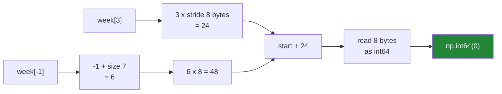

# 1.1 — `arr[3]` — one element, and what comes back

## One-line answer

Indexing an array with a single whole number works exactly like indexing a list — including negative
positions counting from the end — but what comes back is a **NumPy scalar** that carries the array's
dtype, not a plain Python number.

---

## The story

The month of step counts is written out as a grid on squared paper: four rows, one per week, seven
boxes across, one per day.

Somebody wants Thursday of week one. They count along the top row — Monday, Tuesday, Wednesday,
Thursday — and put their finger on the fourth box.

It says 0. The phone was on the charger that day.

Then somebody wants "the last day of week one", and they do something different. They do not count
forward at all. They start at the right-hand end and take the box that is there. Sunday. 7204.

Nobody thinks of that as a separate skill. Counting from the front and reaching for the back are
both just "finding the box", and which one you use depends on whether you know how far in it is or
how far from the end.

---

## The idea in plain language

Indexing means asking for one thing out of many by saying where it is. You met it for lists on
[Day 8, 1.2](../../../day-08-containers/parts/01-sequences/1.2-slicing-and-the-copy-you-missed.md)
and for strings on
[Day 7, 1.2](../../../day-07-strings/parts/01-text/1.2-indexing-and-slicing.md). Arrays use the same
square brackets and the same rules for a single number.

**Positions start at 0.** The first box is `week[0]`, the fourth is `week[3]`. This is the same
convention as every list you have written, and the reason is
[Day 20, 1.3](../../../day-20-arrays-and-dtypes/parts/01-the-block/1.3-one-block-and-strides.md):
the position is multiplied by the stride and added to the start address, so the first element is
zero steps along.

**Negative positions count from the end.** `week[-1]` is the last, `week[-2]` the one before it.
Read `-1` as "one back from the end" and it stops being strange. There is no `-0`, because `0` is
already the first.

**Asking beyond the end raises.** `week[9]` on a seven-element array is an `IndexError`, and the
message names the axis and its size. That is a good failure; the alternative would be reading
whichever bytes happened to be next in memory.

Now the part that is different from a list, and it matters more than it looks.

**What comes back is not a plain Python number.** `week[0]` gives a `np.int64` — a **NumPy scalar**.
It prints like `8213`, it adds and multiplies like `8213`, and it carries a dtype. That last
property has consequences you met on
[Day 20, 2.5](../../../day-20-arrays-and-dtypes/parts/02-dtypes/2.5-nep-50-and-the-python-number.md):
a NumPy scalar is **strong** in an expression, so it can promote the dtype of whatever it meets,
where a plain Python number would not.

It also matters at the far boundary. `np.int64` is not JSON-serialisable, and `json.dumps` refuses
it. Anything leaving your program gets `int(...)` or `float(...)` around it.

One term to fix now, because the whole day turns on it. **Basic indexing** is indexing with whole
numbers, slices, `...` and `np.newaxis`. **Advanced indexing** — also called fancy indexing — is
indexing with a list, an array, or a boolean mask. The difference is not cosmetic: basic indexing
gives you a **view** onto the same memory, and advanced indexing always gives you a **copy**. That
is [section 2](../02-the-view-trap/2.1-a-slice-does-not-copy.md), and this part is the simplest case
of basic indexing there is.

---

## Why Setu needs it

- **Every other kind of indexing today builds on this one.** A slice is a range of these positions;
  a mask is a boolean per position; a fancy index is a list of them.
- **`arr[i]` inside a loop is the anti-pattern the whole phase is teaching you to replace**, and you
  cannot recognise it as one until you can read it fluently.
- **Day 25's stats module returns scalars**, and every one of them is wrapped in `float(...)` before
  it leaves — the `np.float64` problem above, met for real.
- **Day 130 indexes a batch out of 60 000 images**, and `images[i]` there is one 28 × 28 picture
  rather than one number, which is [1.2](1.2-the-comma-a-list-cannot-do.md).

---

## The mechanism

The month, and one box out of it.

```python
import numpy as np

month = np.array(
    [
        [8213, 10442, 6180, 0, 12007, 9631, 7204],
        [7788, 9120, 11345, 8402, 6733, 14210, 5096],
        [9004, 8765, 7621, 10188, 9950, 8317, 11002],
        [6540, 12488, 9873, 7106, 8899, 10540, 9218],
    ]
)
week = month[0]

print("month.shape :", month.shape)
print("week        :", week)
print("week[0]     :", week[0], type(week[0]))
print("week[3]     :", week[3])
print("week[-1]    :", week[-1])
```

**Line by line:**

- `month` — four weeks by seven days, twenty-eight numbers. It is the running example for the whole
  of Day 21 and Day 22.
- `week = month[0]` — one whole number as the index of a **two-dimensional** array, so what comes
  back is the whole first row: an array of seven, not one number. **Indexing removes one axis.**
  That is the rule, and it is [1.2](1.2-the-comma-a-list-cannot-do.md) in full.
- `week[0]` — now the array has one axis, so removing one gives zero axes: a single scalar.
- `type(week[0])` — `numpy.int64`, not `int`. Print this once and remember it.
- `week[3]` — Thursday. `0`, and it is a real zero rather than a missing value, because the phone
  genuinely counted nothing.
- `week[-1]` — Sunday, reached from the back.

```text
month.shape : (4, 7)
week        : [ 8213 10442  6180     0 12007  9631  7204]
week[0]     : 8213 <class 'numpy.int64'>
week[3]     : 0
week[-1]    : 7204
```

How position becomes an address:



The negative index is turned into a positive one first, by adding the length. Everything after that
is the same arithmetic.

Now what the scalar is, and why it is worth knowing:

```python
import numpy as np

week = np.array([8213, 10442, 6180, 0, 12007, 9631, 7204], dtype=np.int32)
value = week[0]

print("value        :", value)
print("type         :", type(value))
print("dtype        :", value.dtype)
print("is a Python int:", isinstance(value, int))
print("arithmetic   :", value + 1, type(value + 1))
print("as a plain int:", type(int(value)))
print("shape         :", value.shape, "ndim:", value.ndim)
```

**Line by line:**

- `dtype=np.int32` on the array — so the scalar's dtype is visibly inherited rather than being the
  default.
- `value.dtype` — the scalar carries `int32`. It is not a number that happens to have come from an
  array; it is a NumPy object with a type.
- `isinstance(value, int)` — **`False`.** `np.int32` is not a subclass of Python's `int`. That is
  why `type(x) is int` is the right assertion in a test
  ([Day 20, 5.2](../../../day-20-arrays-and-dtypes/parts/05-the-module/5.2-the-test-that-can-go-red.md)).
- `value + 1` — still `np.int32`, because the array's dtype wins over the plain `1` under NEP 50
  ([Day 20, 2.5](../../../day-20-arrays-and-dtypes/parts/02-dtypes/2.5-nep-50-and-the-python-number.md)).
- `int(value)` — the conversion you write at a boundary.
- `value.shape` — `()`, an empty tuple, and `ndim` is 0. **A scalar is a zero-dimensional array**,
  which is why it has array attributes at all.

```text
value        : 8213
type         : <class 'numpy.int32'>
dtype        : int32
is a Python int: False
arithmetic   : 8214 <class 'numpy.int32'>
as a plain int: <class 'int'>
shape         : () ndim: 0
```

---

## When it breaks

**Past the end:**

```text
$ uv run python -c "
import numpy as np
week = np.array([8213, 10442, 6180, 0, 12007, 9631, 7204])
week[9]
" 2>&1 | tail -2
IndexError: index 9 is out of bounds for axis 0 with size 7
```

**What it means.** The message names the axis and the size, which is more than a list gives you
(`list index out of range`) and is genuinely useful once arrays have more than one axis. In real
code this usually means a loop bound came from the wrong array — a `range(len(other))` where `other`
is longer.

**A `np.int64` that a JSON encoder refuses:**

```text
$ uv run python -c "
import json
import numpy as np
week = np.array([8213, 10442, 6180])
json.dumps({'best': week.max()})
" 2>&1 | tail -2
TypeError: Object of type int64 is not JSON serializable
```

**What it means.** The value prints as `10442` and behaves like a number everywhere except at the
one place it has to leave the program. `json.dumps({'best': int(week.max())})` fixes it. This is the
single most common way a NumPy scalar causes trouble, and it happens at the API boundary, in
production, on the path that returns a summary.

**A float index:**

```text
$ uv run python -c "
import numpy as np
week = np.array([8213, 10442, 6180, 0, 12007, 9631, 7204])
middle = len(week) / 2
week[middle]
" 2>&1 | tail -2
IndexError: only integers, slices (`:`), ellipsis (`...`), numpy.newaxis (`None`) and integer or boolean arrays are valid indices
```

**What it means.** `/` is true division and always gives a float
([Day 5, 1.2](../../../day-05-operators-and-conditionals/parts/01-operators/1.2-the-two-divisions.md)),
even when the answer is a whole number. `3.5` is not a position and neither is `3.0`. Use `//` for
floor division. The message is long because it lists everything that *is* a valid index — which is
a useful summary of the whole day.

**Indexing something that has no axes:**

```text
$ uv run python -c "
import numpy as np
week = np.array([8213, 10442, 6180])
total = week.sum()
print('total :', total, total.shape)
total[0]
" 2>&1 | tail -3
IndexError: invalid index to scalar variable.
total : 24835 ()
```

**What it means.** `week.sum()` gives a NumPy scalar with `shape == ()` — no axes at all — so there
is nothing to index along, and the message says exactly that. (The two output lines appear in that
order because the traceback goes to stderr and the `print` to stdout, and the shell interleaves
them.) This turns up when a reduction is applied one level higher
than intended: `arr.sum()` instead of `arr.sum(axis=1)`, and then the code tries to index the
result.

---

## In production

**What a professional writes instead of the teaching version.** They almost never index a single
element in a loop. `for i in range(len(arr)): total += arr[i]` is the pattern
[Day 20, 1.4](../../../day-20-arrays-and-dtypes/parts/01-the-block/1.4-a-million-floats-measured.md)
measured at about a hundred times slower than `arr.sum()`, and every appearance of `arr[i]` inside a
`for` is worth a second look.

Where single-element indexing *is* right: reading one configuration value, checking one known
position in a test, and pulling out the answer after an `argmax`. That last one is the common one,
and it looks like this:

```python
import numpy as np


def best_day(month: np.ndarray) -> tuple[int, int, int]:
    """Which week, which day, how many steps — as plain Python integers."""
    if month.ndim != 2:
        raise ValueError(f"expected a (weeks, days) table, got shape {month.shape}")
    flat_position = int(month.argmax())
    week, day = np.unravel_index(flat_position, month.shape)
    return int(week), int(day), int(month[week, day])
```

**Line by line:**

- `if month.ndim != 2` — the shape assumption checked at the door, with the actual shape in the
  message ([Day 20, 1.2](../../../day-20-arrays-and-dtypes/parts/01-the-block/1.2-shape-dtype-and-the-rest.md)).
- `month.argmax()` — the position of the largest value, **as a position into the flattened array**.
  That surprises people every time: `argmax` on a 2-D array gives one number, not a pair.
- `np.unravel_index(flat_position, month.shape)` — turns that flat position back into `(row,
  column)`. This is the function nobody finds on their own and everybody needs.
- `int(...)` on all three returns — plain Python integers, because these go into a log line, a JSON
  response or a message, and `np.int64` fails at all three
  ([Day 20, 5.1](../../../day-20-arrays-and-dtypes/parts/05-the-module/5.1-reading-the-week-typed-on-purpose.md)).
- `-> tuple[int, int, int]` — the annotation is honest about all three, so a checker catches a caller
  who unpacks two ([Day 19, 1.2](../../../day-19-typing-dataclasses-and-concurrency/parts/01-type-hints/1.2-the-vocabulary.md)).

**What changes at scale.** Single-element indexing is O(1) and stays O(1) forever — that never
changes. What changes is the *Python overhead around it*. Each `arr[i]` builds a new NumPy scalar
object, so a loop over ten million elements allocates ten million short-lived objects, and the
garbage collector work alone can dominate the runtime. That is the real reason the loop is slow, and
it is why the fix is always to move the loop into NumPy rather than to make the indexing faster.

**The failure that only appears with real data.** A service that returns `{"peak": arr.max()}` from
an endpoint. Every test passes, because the tests compare Python objects. The first real request
fails with `TypeError: Object of type int64 is not JSON serializable`, in the response serialiser,
after the work is done. Wrapping the value in `int()` is a one-character-class fix and the bug is
100% avoidable by never letting a NumPy scalar cross a boundary.

**The review comment a senior engineer leaves.** *"`counts[i]` inside this loop makes a `np.int64`
per iteration. Whatever this loop is computing, NumPy has it as a reduction — and if it genuinely
does not, use `arr.tolist()` once and loop over plain Python numbers, which is faster than indexing
the array element by element."*

**The interview question.** *"What does `arr[0]` return for a 1-D NumPy array?"* A NumPy scalar — a
`np.int64` or `np.float64` — not a Python `int` or `float`. It behaves like a number in arithmetic
and carries the array's dtype, which means it is *strong* in a NumPy expression and can promote the
dtype of whatever it meets, and it is not JSON-serialisable. The follow-up is usually about a 2-D
array: `arr[0]` there gives the whole first **row** as a view, because indexing removes one axis, and
`arr[0, 0]` is what gives you a scalar.

---

## Check yourself

```bash
uv run python -c "
import numpy as np
week = np.array([8213, 10442, 6180, 0, 12007, 9631, 7204])
print('week[0]  :', week[0], type(week[0]))
print('week[-1] :', week[-1])
print('week[3]  :', week[3])
print('is int?  :', isinstance(week[0], int))
print('shape    :', week[0].shape)
"
```

The fourth line says `False` and the fifth prints an empty tuple. Say what both of those tell you.

**Answer out loud, without scrolling up:**

> What type does `week[0]` return, and name one place where that being a NumPy scalar rather than a
> Python `int` actually breaks something.

---

**Next:** [1.2 — the comma a list cannot do](1.2-the-comma-a-list-cannot-do.md).
