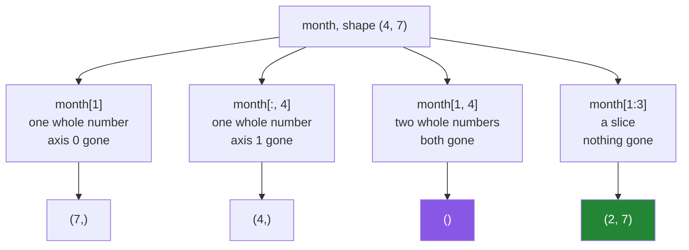

# 1.2 — `arr[1, 4]` — the comma a list cannot do

## One-line answer

A NumPy index can name a position on every axis at once — `month[1, 4]` is week 1, day 4 — and each
whole number you supply **removes one axis** from the result, which is the rule that decides what
shape comes back.

---

## The story

Two people are reading the same grid of step counts on squared paper, four rows by seven columns.

The first one says: "give me row two." The other slides a finger down two rows and reads out all
seven numbers.

Then: "in that row, the fifth one." The finger moves across five, and one number comes out.

Two instructions, two movements, one answer.

The second person, who does this all day, does it differently. They hear "row two, column five" and
their finger goes straight there — down and across in one motion. Same answer, one movement, and
they never held a whole row in their head on the way.

The grid did not change. What changed is that the second instruction named both directions at once.

---

## The idea in plain language

A Python list of lists can only be indexed one level at a time: `rows[1][4]` means "get row 1, then
get item 4 of whatever that is". Two separate operations, and the first one produces an intermediate
object.

A NumPy array takes a **tuple of indices**, one per axis: `month[1, 4]`. The comma is not a
convenience — it is the whole idea of an *n*-dimensional array. Both positions are used in one
address calculation
([Day 20, 1.3](../../../day-20-arrays-and-dtypes/parts/01-the-block/1.3-one-block-and-strides.md)):

> **address = start + 1 × stride0 + 4 × stride1**

No intermediate row is built.

`month[1][4]` also works and gives the same number, because `month[1]` is a valid array which can
then be indexed. But it is two operations instead of one, it builds an intermediate array object,
and — the part that matters — **it cannot express everything the comma can.** `month[:, 4]` (a whole
column) has no `[...][...]` equivalent at all.

Now the rule that governs every shape you will see today:

> **Each whole-number index removes one axis. Each slice keeps one.**

Work it through on the `(4, 7)` month:

| Expression | Indices given | Axes removed | Result shape |
|---|---|---|---|
| `month` | none | 0 | `(4, 7)` |
| `month[1]` | one whole number | 1 | `(7,)` |
| `month[1, 4]` | two whole numbers | 2 | `()` — a scalar |
| `month[1:3]` | one slice | 0 | `(2, 7)` |
| `month[:, 4]` | slice, whole number | 1 | `(4,)` |
| `month[1:3, 4:6]` | two slices | 0 | `(2, 2)` |

That table is the whole of basic indexing, and being able to reconstruct it is worth more than
memorising any function name. When a shape surprises you, count the whole numbers.

Two notes on notation.

**`month[1, 4]` is `month[(1, 4)]`.** Python collects the comma-separated values into a tuple before
handing them to `__getitem__`, so the brackets are optional and almost never written. This matters
once, when you build an index programmatically and have to pass a real tuple.

**Missing axes are filled in with `:`.** `month[1]` means `month[1, :]`. NumPy assumes you want all
of any axis you did not mention, which is why indexing a 2-D array with one number gives you a whole
row.

---

## Why Setu needs it

- **Day 22's broadcasting is entirely about shapes**, and you cannot predict a broadcast until you
  can predict the shape an index produces.
- **Day 130's images are `(60000, 28, 28)`.** `images[i]` is one picture, `images[i, 13]` is one row
  of pixels, and `images[:, 13, 13]` is the centre pixel of every picture. All three are the same
  rule.
- **Day 155's embeddings are `(n_documents, 384)`.** `emb[i]` is one document's vector and
  `emb[:, 0]` is the first dimension across all documents — and only one of those two is ever what
  you meant.
- **Every scikit-learn error from Day 42 on prints two shapes.** Reading them is this part.

---

## The mechanism

The comma, and the two-step form beside it.

```python
import numpy as np

month = np.array(
    [
        [8213, 10442, 6180, 0, 12007, 9631, 7204],
        [7788, 9120, 11345, 8402, 6733, 14210, 5096],
        [9004, 8765, 7621, 10188, 9950, 8317, 11002],
        [6540, 12488, 9873, 7106, 8899, 10540, 9218],
    ]
)

print("month[1, 4] :", month[1, 4])
print("month[1][4] :", month[1][4])
print("month[1]    :", month[1])
print("month[-1, -1]:", month[-1, -1])
```

**Line by line:**

- `month[1, 4]` — week 1 (the second), day 4 (the fifth). One address calculation, one number out.
- `month[1][4]` — the same number by a different route: build the row, then index it. Correct, and
  it makes an intermediate array object that is thrown away.
- `month[1]` — the missing second index is `:`, so the whole row comes back.
- `month[-1, -1]` — negatives work per axis, so this is the last day of the last week.

```text
month[1, 4] : 6733
month[1][4] : 6733
month[1]    : [ 7788  9120 11345  8402  6733 14210  5096]
month[-1, -1]: 9218
```

Now the shape rule, demonstrated rather than asserted:

```python
import numpy as np

month = np.arange(28).reshape(4, 7)

cases = [
    ("month", month),
    ("month[1]", month[1]),
    ("month[1, 4]", month[1, 4]),
    ("month[1:3]", month[1:3]),
    ("month[:, 4]", month[:, 4]),
    ("month[1:3, 4:6]", month[1:3, 4:6]),
    ("month[1, 4:6]", month[1, 4:6]),
]
for label, result in cases:
    print(f"{label:16} shape={np.shape(result)!s:8} ndim={np.ndim(result)}")
```

**Line by line:**

- `np.arange(28).reshape(4, 7)` — each value equals its own flat position, so the printed numbers
  double as a map of where things came from
  ([Day 20, 3.3](../../../day-20-arrays-and-dtypes/parts/03-creating/3.3-arange-and-the-float-step.md)).
- `np.shape(result)` and `np.ndim(result)` as **functions** rather than attributes — because
  `month[1, 4]` is a scalar and the function form works for scalars as well as arrays. The attribute
  form would work too, since a NumPy scalar has `.shape`, but the function form also handles a plain
  Python number, which makes this loop robust.
- `month[1, 4:6]` — one whole number and one slice, so one axis is removed and one kept: shape
  `(2,)`. **This mixed case is the one people get wrong**, and it is worth predicting before reading
  the output.

```text
month            shape=(4, 7)   ndim=2
month[1]         shape=(7,)     ndim=1
month[1, 4]      shape=()       ndim=0
month[1:3]       shape=(2, 7)   ndim=2
month[:, 4]      shape=(4,)     ndim=1
month[1:3, 4:6]  shape=(2, 2)   ndim=2
month[1, 4:6]    shape=(2,)     ndim=1
```

Count the whole numbers in each expression and subtract from 2. Every line agrees.



And the thing `[...][...]` cannot do:

```python
import numpy as np

month = np.array(
    [
        [8213, 10442, 6180, 0, 12007, 9631, 7204],
        [7788, 9120, 11345, 8402, 6733, 14210, 5096],
        [9004, 8765, 7621, 10188, 9950, 8317, 11002],
        [6540, 12488, 9873, 7106, 8899, 10540, 9218],
    ]
)

print("every Wednesday      :", month[:, 2])
print("shape                :", month[:, 2].shape)
print("as a list of lists   :", [row[2] for row in month.tolist()])
print("same numbers?        :", np.array_equal(month[:, 2], [row[2] for row in month.tolist()]))
```

**Line by line:**

- `month[:, 2]` — **a whole column**: every week's Wednesday. The `:` means "all of axis 0", and `2`
  picks one position on axis 1.
- `.shape` is `(4,)` — one number per week, four of them.
- `[row[2] for row in month.tolist()]` — what you would have to write for a list of lists. It works,
  it is four times slower per element, and it says much less about what you meant.
- `np.array_equal` — the two agree, which is the point: the comma form is not a different answer, it
  is the same answer written once.

```text
every Wednesday      : [ 6180 11345  7621  9873]
shape                : (4,)
as a list of lists   : [6180, 11345, 7621, 9873]
same numbers?        : True
```

---

## When it breaks

**Too many indices:**

```text
$ uv run python -c "
import numpy as np
week = np.array([8213, 10442, 6180])
week[0, 1]
" 2>&1 | tail -2
IndexError: too many indices for array: array is 1-dimensional, but 2 were indexed
```

**What it means.** The array has one axis and two positions were supplied. The message states both
numbers, so the diagnosis is immediate. In real code this almost always means something upstream
returned a `(n,)` where a `(n, m)` was expected — a single row rather than a table, or a reduction
that collapsed an axis you needed.

**A comma where a tuple was meant:**

```text
$ uv run python -c "
import numpy as np
month = np.arange(28).reshape(4, 7)
print('with a tuple :', month[(1, 3)])
print('with a list  :', month[[1, 3]].shape)
"
with a tuple : 10
with a list  : (2, 7)
```

**What it means.** **A tuple and a list mean completely different things inside `[]`.** The tuple is
basic indexing — one position per axis, giving a scalar. The list is *advanced* indexing — a list of
rows to pick, giving a `(2, 7)` array
([4.1](../04-fancy-indexing/4.1-a-list-of-positions.md)). No error, two very different results, and
the difference is one pair of brackets. This is the single easiest NumPy typo to make and the
hardest to spot when reading.

**Chained indexing that quietly copies:**

```text
$ uv run python -c "
import numpy as np
month = np.arange(28).reshape(4, 7)
month[[0, 2]][0, 0] = 99
print('did it stick?:', month[0, 0])
month[0, 0] = 99
print('and now      :', month[0, 0])
"
did it stick?: 0
and now      : 99
```

**What it means.** `month[[0, 2]]` is advanced indexing, so it returns a **copy**
([2.1](../02-the-view-trap/2.1-a-slice-does-not-copy.md)). Assigning into that copy changes the copy
and then throws it away. **Nothing raises**, the assignment silently does nothing, and the bug looks
like "my update did not save". The rule is: assign through **one** set of brackets, not two.
`month[[0, 2], 0] = 99` works, because it is a single indexing operation.

**Forgetting that a missing axis means `:`:**

```text
$ uv run python -c "
import numpy as np
month = np.arange(28).reshape(4, 7)
print('month[2]      :', month[2])
print('month[2, :]   :', month[2, :])
print('identical?    :', np.array_equal(month[2], month[2, :]))
print('month[:, 2]   :', month[:, 2], ' <- a completely different four numbers')
"
month[2]      : [14 15 16 17 18 19 20]
month[2, :]   : [14 15 16 17 18 19 20]
identical?    : True
month[:, 2]   : [ 2  9 16 23]  <- a completely different four numbers
```

**What it means.** `month[2]` and `month[2, :]` are the same thing — a row. `month[:, 2]` is a
column, and it shares only one element with the row. Confusing a row for a column produces an array
of the right *kind* and the wrong *contents*, and on a square array it produces the right shape too,
so nothing catches it. **When the table is square, print a value you can check by eye.**

---

## In production

**What a professional writes instead of the teaching version.** They name the axes, in a comment or
a constant, at the point where the array is created — because `arr[:, 3]` is unreadable and
`arr[:, WEDNESDAY]` is not:

```python
import numpy as np

WEEKS, DAYS = 0, 1  # axis names for a (weeks, days) table
MONDAY, TUESDAY, WEDNESDAY, THURSDAY, FRIDAY, SATURDAY, SUNDAY = range(7)


def weekend_totals(month: np.ndarray) -> np.ndarray:
    """One number per week: Saturday plus Sunday."""
    if month.ndim != 2 or month.shape[DAYS] != 7:
        raise ValueError(f"expected a (weeks, 7) table, got shape {month.shape}")
    return month[:, [SATURDAY, SUNDAY]].sum(axis=DAYS)
```

**Line by line:**

- `WEEKS, DAYS = 0, 1` — the axis numbers get names. `sum(axis=1)` needs a comment every time;
  `sum(axis=DAYS)` does not, and it survives somebody transposing the table.
- `MONDAY, ... = range(7)` — tuple unpacking of a range
  ([Day 8, 1.4](../../../day-08-containers/parts/01-sequences/1.4-unpacking-and-star-rest.md)) to
  name seven positions in one line. An `enum.IntEnum` is the heavier alternative and is worth it once
  the names need methods.
- `month.shape[DAYS] != 7` — the shape check uses the same names, so it reads as "the days axis is
  not seven".
- `month[:, [SATURDAY, SUNDAY]]` — a list inside the brackets, so this is advanced indexing and gives
  a `(weeks, 2)` **copy** ([4.1](../04-fancy-indexing/4.1-a-list-of-positions.md)). That is fine here
  and it is worth knowing rather than assuming.
- `.sum(axis=DAYS)` — sum across the two selected days, leaving one number per week.

**What changes at scale.** The comma form stays O(1) per element and the chained form does not.
`arr[i][j]` on a large array builds a full intermediate row object, and inside a loop that is one
allocation per iteration for a value you use once. On `(60000, 784)` images, `images[i][j]` in a
training loop allocates a 784-element view per pixel access. The comma form does none of that.

There is a second, larger effect. On an array with more than two axes, **the order in which you index
decides how much memory the intermediate holds.** `cube[:, :, 0][10]` builds the whole 2-D slice
first and then takes one row of it; `cube[10, :, 0]` goes straight there. On a memory-mapped array
that difference is the number of pages the operating system has to fetch.

**The failure that only appears with real data.** A metrics table stored as `(days, sensors)` and
consumed by a function that assumed `(sensors, days)`. With 30 days and 30 sensors during
development, every shape check passed and every plot looked plausible. The first month with 31 days
raised `IndexError: index 30 is out of bounds for axis 1 with size 30`, in a completely different
module, and the code had been silently transposing for six weeks.

**The review comment a senior engineer leaves.** *"`data[i][j] = x` does not always write through —
if `data[i]` is ever an advanced index the assignment lands in a temporary and vanishes. Write
`data[i, j] = x`, which is one indexing operation and cannot do that."*

**The interview question.** *"What is the difference between `arr[1][4]` and `arr[1, 4]`?"* For a
plain 2-D array they give the same value, but `arr[1][4]` is two operations that build an
intermediate row, while `arr[1, 4]` is one address calculation. The comma form is also strictly more
expressive: `arr[:, 4]` selects a column and has no chained equivalent. The answer that shows real
use is the assignment case — `arr[a][b] = x` silently does nothing when the first index is advanced,
because it writes into a temporary copy, whereas `arr[a, b] = x` always writes through.

---

## Check yourself

```bash
uv run python -c "
import numpy as np
month = np.arange(28).reshape(4, 7)
for expr in ['month[1]', 'month[1, 4]', 'month[:, 4]', 'month[1:3, 4:6]', 'month[1, 4:6]']:
    print(f'{expr:18} shape={np.shape(eval(expr))}')
"
```

Predict all five shapes before running it, by counting the whole numbers in each expression.

**Answer out loud, without scrolling up:**

> State the rule that decides the shape of a basic index. Then say what `month[:, 2]` gives you and
> why there is no `month[...][...]` version of it.

---

**Next:** [1.3 — slicing one axis](1.3-slicing-one-axis.md).
