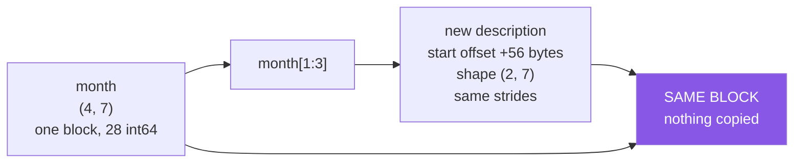

# 1.3 — `arr[1:3]` — a slice keeps its axis

## One-line answer

`start:stop` selects a range of positions with the stop **excluded**, it keeps the axis it was
applied to instead of removing it, and — unlike a list slice — it does **not** copy.

---

## The story

Somebody wants to photocopy weeks two and three out of the month grid.

They lay a sheet of paper over the page with a window cut in it, so only those two rows show
through. Weeks one and four are hidden. Through the window they can read fourteen numbers, arranged
exactly as they were: two rows of seven, in the same order.

They have not cut the page. They have not copied anything. They have made a smaller way of looking
at the same page.

If somebody now writes a number in the window, they are writing on the original page. The window is
not a piece of paper of its own.

That distinction — a window rather than a copy — is the single most surprising thing about NumPy,
and it starts here.

---

## The idea in plain language

A **slice** is written `start:stop` and means "from position `start` up to but not including
`stop`". You met the syntax for lists on
[Day 8, 1.2](../../../day-08-containers/parts/01-sequences/1.2-slicing-and-the-copy-you-missed.md),
and the rules are identical:

- `week[1:5]` — positions 1, 2, 3, 4. Four values.
- `week[:3]` — from the beginning. An omitted `start` means 0.
- `week[4:]` — to the end. An omitted `stop` means "as far as there is".
- `week[:]` — everything.
- Negative positions work: `week[-3:]` is the last three.

**The stop is excluded**, always. `week[1:5]` gives four values, and `5 - 1 = 4` — the length of a
slice is `stop - start`, which is the reason the convention exists.

Two things are different from a list, and both matter.

**A slice keeps its axis.** `month[1:3]` gives shape `(2, 7)`, not `(7,)`. Compare `month[1]`, which
gives `(7,)`. This is the rule from [1.2](1.2-the-comma-a-list-cannot-do.md) — a whole number
removes an axis, a slice keeps one — and the practical consequence is that `month[1:2]` and
`month[1]` hold the same seven numbers in different shapes. You will need `month[1:2]` more often
than you expect, when a downstream function insists on a 2-D input.

**A slice does not copy.** `lst[1:3]` on a Python list builds a new list with new slots.
`arr[1:3]` on an array builds a new *description* — same block of memory, offset start, shorter
length — and hands it back. Both objects then read and write the same bytes.

That is the window in the story, and it is the whole of
[section 2](../02-the-view-trap/2.1-a-slice-does-not-copy.md). This part introduces it so that
nothing in the next few pages is a surprise; the consequences, the detection and the fix are there.

**An out-of-range slice does not raise.** `week[3:99]` on a seven-element array gives you positions
3 to 6 and says nothing. That is deliberate and it is different from `week[99]`, which raises. A
slice is a request for a range and NumPy gives you the part of it that exists — including, when
nothing exists, an empty array.

---

## Why Setu needs it

- **Every train/test split is a slice.** `data[:n_train]` and `data[n_train:]` on Day 42, and both of
  them are views of the same block, which is why Principle 8's leakage rule needs
  [5.1](../05-in-anger/5.1-the-leak-a-view-causes.md).
- **Every batch in a training loop is a slice.** `data[i : i + batch_size]` on Day 130, and it is
  free precisely because it does not copy.
- **Day 108's time-series windows are slices**, and an off-by-one in the stop is the difference
  between forecasting and reading the answer.
- **The empty-slice case appears in every loop that runs past the end**, and it fails silently rather
  than loudly, which is why it is worth meeting on purpose.

---

## The mechanism

Slices on one axis.

```python
import numpy as np

month = np.array(
    [
        [8213, 10442, 6180, 0, 12007, 9631, 7204],
        [7788, 9120, 11345, 8402, 6733, 14210, 5096],
        [9004, 8765, 7621, 10188, 9950, 8317, 11002],
        [6540, 12488, 9873, 7106, 8899, 10540, 9218],
    ]
)
week = month[0]

print("week        :", week)
print("week[1:5]   :", week[1:5])
print("week[:3]    :", week[:3])
print("week[4:]    :", week[4:])
print("week[-3:]   :", week[-3:])
print("week[3:99]  :", week[3:99], " <- no error")
print("week[5:2]   :", week[5:2], " <- empty, also no error")
```

**Line by line:**

- `week[1:5]` — Tuesday to Friday. Four values, because `5 - 1 = 4`, and Saturday's position 5 is
  excluded.
- `week[:3]` — the first three. This is the form that reads best when you mean "the first *n*".
- `week[4:]` — from Friday to the end.
- `week[-3:]` — the last three, without needing to know the length.
- `week[3:99]` — **no `IndexError`.** A slice is clipped to what exists, so you get positions 3 to 6.
  A single index would have raised.
- `week[5:2]` — start after stop, so nothing. An **empty array**, shape `(0,)`, no complaint. This is
  the one that costs an evening, because every operation on it works and produces nothing.

```text
week        : [ 8213 10442  6180     0 12007  9631  7204]
week[1:5]   : [10442  6180     0 12007]
week[:3]    : [ 8213 10442  6180]
week[4:]    : [12007  9631  7204]
week[-3:]   : [12007  9631  7204]
week[3:99]  : [    0 12007  9631  7204]  <- no error
week[5:2]   : []  <- empty, also no error
```

Now slicing a 2-D array, and the axis that survives:

```python
import numpy as np

month = np.arange(28).reshape(4, 7)

print("month[1:3]      shape:", month[1:3].shape)
print("month[1]        shape:", month[1].shape)
print("month[1:2]      shape:", month[1:2].shape)
print("same numbers?        :", np.array_equal(month[1], month[1:2].ravel()))
print()
print("month[1:3]:")
print(month[1:3])
print("month[1:3, 2:5]:")
print(month[1:3, 2:5])
```

**Line by line:**

- `month[1:3]` — two rows, and the second axis is untouched, so `(2, 7)`.
- `month[1]` — one row and the axis is gone: `(7,)`.
- `month[1:2]` — **one row, and the axis survives**: `(1, 7)`. Same seven numbers as `month[1]`, one
  extra axis. This is the trick for "I need this to stay 2-D".
- `np.array_equal(month[1], month[1:2].ravel())` — flattening the `(1, 7)` gives back the `(7,)`, so
  the contents really are identical and only the shape differs.
- `month[1:3, 2:5]` — a slice per axis, a rectangle out of the middle: `(2, 3)`.

```text
month[1:3]      shape: (2, 7)
month[1]        shape: (7,)
month[1:2]      shape: (1, 7)
same numbers?        : True

month[1:3]:
[[ 7  8  9 10 11 12 13]
 [14 15 16 17 18 19 20]]
month[1:3, 2:5]:
[[ 9 10 11]
 [16 17 18]]
```

The window, drawn:



Both arrows point at one block. That is [2.1](../02-the-view-trap/2.1-a-slice-does-not-copy.md).

And the difference from a list, shown rather than claimed:

```python
import numpy as np

as_list = [8213, 10442, 6180, 0, 12007, 9631, 7204]
as_array = np.array(as_list)

list_slice = as_list[1:3]
array_slice = as_array[1:3]

list_slice[0] = 0
array_slice[0] = 0

print("list  after :", as_list)
print("array after :", as_array)
print("array shares:", np.shares_memory(as_array, array_slice))
```

**Line by line:**

- `as_list[1:3]` — a **new list** with two new slots pointing at the same integer objects. Writing to
  it replaces a slot in the new list only.
- `as_array[1:3]` — a **view**. Writing to it writes into `as_array`.
- Both assignments are written the same way and one of them reaches back into the original.

```text
list  after : [8213, 10442, 6180, 0, 12007, 9631, 7204]
array after : [ 8213     0  6180     0 12007  9631  7204]
array shares: True
```

**The list is unchanged and the array is not.** That one difference is the reason section 2 exists.

---

## When it breaks

**An empty slice, and everything downstream that follows from it:**

```text
$ uv run python -c "
import numpy as np
week = np.array([8213, 10442, 6180, 0, 12007, 9631, 7204])
batch = week[10:20]
print('batch  :', batch)
print('shape  :', batch.shape)
print('sum    :', batch.sum())
print('mean   :', batch.mean())
" 2>&1 | tail -6
```

```text
batch  : []
shape  : (0,)
sum    : 0
mean   : nan
```

**What it means.** No error anywhere. The slice is empty, `sum()` of nothing is `0` — which is
arithmetically defensible and completely misleading in a report — and `mean()` is `nan` with a
`RuntimeWarning`. A batching loop whose start index has run past the end produces a stream of empty
batches, each of which "processes" successfully. **Check `arr.size` before trusting a reduction over
a slice.**

**A slice that was meant to include the end:**

```text
$ uv run python -c "
import numpy as np
week = np.array([8213, 10442, 6180, 0, 12007, 9631, 7204])
print('Mon to Fri, wrong:', week[0:4])
print('Mon to Fri, right:', week[0:5])
print('lengths          :', len(week[0:4]), len(week[0:5]))
"
Mon to Fri, wrong: [ 8213 10442  6180     0]
Mon to Fri, right: [ 8213 10442  6180     0 12007]
```

**What it means.** Friday is position 4, so a slice that includes it must stop at 5. The off-by-one
never raises and the result is a perfectly reasonable four-element array. The habit that prevents
it: **read `a:b` as "b minus a of them, starting at a"**, and check the length rather than the
contents.

**Assigning to a slice writes through:**

```text
$ uv run python -c "
import numpy as np
month = np.arange(28).reshape(4, 7)
recent = month[2:]
recent[:] = 0
print(month)
"
[[ 0  1  2  3  4  5  6]
 [ 7  8  9 10 11 12 13]
 [ 0  0  0  0  0  0  0]
 [ 0  0  0  0  0  0  0]]
```

**What it means.** `recent[:] = 0` looks like it fills a local variable and it zeroes half the
original table. Note the `[:]` — without it, `recent = 0` would just rebind the name and change
nothing at all, which is the opposite mistake. **`x[:] = v` writes into the array; `x = v` replaces
the name.** Both are one character from each other and they do entirely different things.

**A slice of a slice, still a view:**

```text
$ uv run python -c "
import numpy as np
month = np.arange(28).reshape(4, 7)
a = month[1:3]
b = a[:, 2:4]
b[0, 0] = 999
print('month[1, 2] :', month[1, 2])
print('chain shares:', np.shares_memory(month, b))
"
month[1, 2] : 999
chain shares: True
```

**What it means.** Views compose. A slice of a slice of a slice is still a window onto the original
block, however many levels deep, and a write at the bottom lands at the top. There is no depth at
which NumPy quietly starts copying, which is good for performance and means the caution never
relaxes.

---

## In production

**What a professional writes instead of the teaching version.** They batch with a slice, deliberately,
because it is free — and they say so in a comment, because the next reader will wonder whether it
should have been a copy:

```python
import numpy as np
from collections.abc import Iterator


def batches(data: np.ndarray, size: int) -> Iterator[np.ndarray]:
    """Yield consecutive views of `data`. Nothing is copied; do not write to a batch."""
    if size < 1:
        raise ValueError(f"batch size must be at least 1, got {size}")
    for start in range(0, len(data), size):
        yield data[start : start + size]
```

**Line by line:**

- `-> Iterator[np.ndarray]` — the annotation for a generator function
  ([Day 11, 2.1](../../../day-11-iterators-and-generators/parts/02-generators/2.1-yield-the-function-that-pauses.md)),
  imported from `collections.abc` rather than `typing`.
- `if size < 1: raise ValueError(...)` — `range(0, n, 0)` raises a confusing `ValueError: range() arg
  3 must not be zero`, and a negative size loops forever. Checking here gives a message that names
  the parameter.
- `range(0, len(data), size)` — the starts. `len(data)` is the **first axis**
  ([Day 20, 1.2](../../../day-20-arrays-and-dtypes/parts/01-the-block/1.2-shape-dtype-and-the-rest.md)),
  which is right here because batching is always over rows.
- `data[start : start + size]` — the slice is clipped automatically at the end, so the last batch is
  short rather than an error. **No `min(start + size, len(data))` needed**, and writing one is a sign
  the author has not internalised how slices clip.
- `yield` rather than building a list — the batches are views and cost nothing, so materialising them
  all would only add bookkeeping.
- **The docstring says "do not write to a batch"**, because the function's whole efficiency rests on
  the fact that it does not copy, and that is a contract with the caller rather than an implementation
  detail.

**What changes at scale.** Slicing is O(1) — it builds a small object and touches no data, no matter
how large the array. That is why batching, windowing and splitting are all free, and it is the single
most important performance property in this whole section.

The scale problem is the opposite one: **a view keeps the whole parent alive.** If you load a 4 GB
array, take `arr[:100]`, and return that, the 4 GB block cannot be released, because something still
points into it. Memory profilers show a hundred rows and the process holds four gigabytes. The fix is
`arr[:100].copy()` at the point where the small piece outlives the large one — and knowing when to
pay for that copy is [2.3](../02-the-view-trap/2.3-copy-and-when-to-pay.md).

**The failure that only appears with real data.** A batching loop written as
`data[i * size : (i + 1) * size]` with `i` running over `range(n // size)`. Integer division drops
the remainder, so with 1 003 rows and a batch of 100 the loop runs ten times and the last three rows
are never seen. Every test used a round number of rows. In production, three records a batch-cycle
were silently skipped for a year.

**The review comment a senior engineer leaves.** *"`window = series[i:i+10]` here is a view, and the
next line writes into it, so this is modifying the caller's series. Either `.copy()` it or make the
function pure — right now the second call gets different data from the first."*

**The interview question.** *"What does slicing a NumPy array return?"* A **view** — a new array
object describing the same memory with a different offset, shape and possibly strides — not a copy,
which is the opposite of what list slicing does. So writing to a slice writes into the parent, and a
slice of a large array keeps that whole array alive. The follow-up worth pre-empting: slices keep
their axis, so `arr[1:2]` is `(1, 7)` where `arr[1]` is `(7,)`, and an out-of-range slice is clipped
silently while an out-of-range single index raises.

---

## Check yourself

```bash
uv run python -c "
import numpy as np
week = np.array([8213, 10442, 6180, 0, 12007, 9631, 7204])
print('week[1:5] :', week[1:5], len(week[1:5]))
print('week[3:99]:', week[3:99])
print('week[5:2] :', week[5:2], week[5:2].shape)
part = week[1:3]
part[0] = 0
print('week now  :', week)
"
```

The last two lines are the point. Nothing was assigned to `week`.

**Answer out loud, without scrolling up:**

> How many elements does `arr[2:7]` give you, and what shape does `arr[1:2]` have compared with
> `arr[1]`? Then say what a list slice does that an array slice does not.

---

**Next:** [1.4 — a whole column](1.4-a-whole-column.md).
