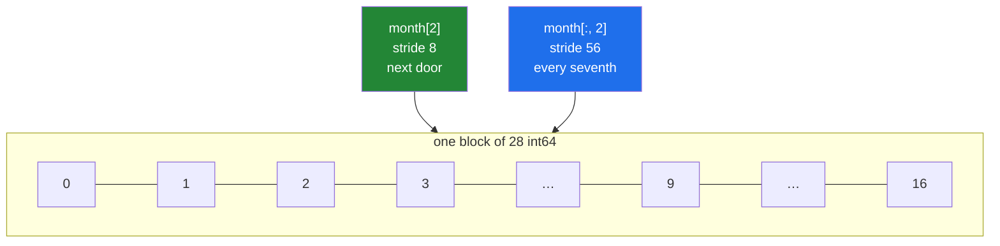

# 1.4 — `arr[:, 2]` — a whole column, and the shape that comes back

## One-line answer

`month[:, 2]` reads every Wednesday out of a four-week table and hands back a flat `(4,)` array —
still a view, even though the numbers it names are 56 bytes apart in memory.

---

## The story

The month grid is on the fridge: four rows, one per week, seven columns, one per day.

Somebody asks a question the rows cannot answer. "Am I lazier on Wednesdays?"

Reading a row tells you about one week. To answer this you have to read *down* — the third box in
every row, four numbers, one from each week. Your finger goes down the page instead of across it.

Nothing about the grid changed. The numbers are in the same boxes. You are simply travelling in the
other direction, and the four numbers you collect were never next to each other.

That last sentence is the whole of this part. A row is four numbers in a line on the paper; a column
is four numbers with six others in between each pair. On paper it makes no difference. In memory it
makes all of it.

---

## The idea in plain language

`month[:, 2]` reads as: **all of axis 0, position 2 on axis 1**.

By the rule from [1.2](1.2-the-comma-a-list-cannot-do.md), the slice keeps axis 0 and the whole
number removes axis 1, so the result has one axis: shape `(4,)`. Four numbers, one per week, and the
"which day" information is gone because that axis no longer exists.

The `:` is doing real work and is easy to skip over. `month[2]` means `month[2, :]` — row 2.
`month[:, 2]` means column 2. **One comma apart, and completely different numbers.** On a square
table they even have the same shape, so nothing catches the mistake.

Now the interesting part.

**A column is still a view**, even though its elements are not next to each other. That surprises
people, and it is the clearest possible demonstration of why strides exist
([Day 20, 1.3](../../../day-20-arrays-and-dtypes/parts/01-the-block/1.3-one-block-and-strides.md)).
The month has strides `(56, 8)`: 56 bytes to move down a row, 8 to move across a column. A column is
described by starting 16 bytes in (2 × 8) and stepping **56 bytes** each time. Same block, different
stride, nothing copied.

So the general rule holds without exception: **basic indexing always gives a view.** Not "usually",
not "when the elements are contiguous" — always. A view can have any strides it likes, including
enormous ones.

There is a cost, and it is not correctness. A column view is not **contiguous**: reading it walks the
memory in 56-byte jumps, so the processor fetches a whole 64-byte cache line to use 8 bytes of it. On
a table with a million rows, summing a column can be several times slower than summing a row, purely
because of how the memory is touched. That is
[Day 22, 3.3](../../../day-22-broadcasting-and-shape/parts/03-transpose/3.3-contiguity-and-the-speed-you-lose.md),
and it is a real consideration when you choose whether your data is stored rows-as-samples or
columns-as-samples.

One shape note that comes up constantly. `month[:, 2]` gives `(4,)` — flat. If you need it as a
**column**, shaped `(4, 1)`, the two ways are `month[:, 2:3]` (a slice, so the axis survives) and
`month[:, 2, np.newaxis]`. Both are views. Which you need depends on what you are about to broadcast
against, and that is [1.6](1.6-ellipsis-and-newaxis.md) and Day 22.

---

## Why Setu needs it

- **A column is a feature.** From Day 42 on, every dataset is `(samples, features)`, and `X[:, 3]` is
  the fourth feature across every sample. That single expression appears in almost every ML day.
- **Day 44's scaler computes one mean per column**, and `X.mean(axis=0)` is the same "read down"
  motion generalised.
- **Day 155's embeddings are `(n_documents, 384)`**, so `emb[:, 0]` is one dimension across every
  document — almost never what you want, and easy to write by accident when you meant `emb[0]`.
- **Day 24's linear algebra treats columns as vectors**, and the `(4,)`-versus-`(4, 1)` distinction
  starts mattering there.

---

## The mechanism

Read down, and check the shape.

```python
import numpy as np

month = np.array(
    [
        [8213, 10442, 6180, 0, 12007, 9631, 7204],
        [7788, 9120, 11345, 8402, 6733, 14210, 5096],
        [9004, 8765, 7621, 10188, 9950, 8317, 11002],
        [6540, 12488, 9873, 7106, 8899, 10540, 9218],
    ]
)

print("every Wednesday :", month[:, 2])
print("shape           :", month[:, 2].shape)
print("week 2 (a row)  :", month[2])
print("shape           :", month[2].shape)
print("every weekend   :", month[:, 5:].tolist())
print("shape           :", month[:, 5:].shape)
```

**Line by line:**

- `month[:, 2]` — all weeks, day 2. Wednesday, four times.
- `.shape` is `(4,)` — one axis. The day axis was removed by the whole number.
- `month[2]` — week 2, all days. Same *kind* of object, seven numbers instead of four, and it shares
  exactly one element with the column: `month[2, 2]`.
- `month[:, 5:]` — all weeks, days 5 onward. **Two slices**, so both axes survive: `(4, 2)`. This is
  how you take "the weekend columns" and keep the table shape.
- `.tolist()` — only so the four rows print on one line here.

```text
every Wednesday : [ 6180 11345  7621  9873]
shape           : (4,)
week 2 (a row)  : [ 9004  8765  7621 10188  9950  8317 11002]
shape           : (7,)
every weekend   : [[9631, 7204], [14210, 5096], [8317, 11002], [10540, 9218]]
shape           : (4, 2)
```

Now the part worth proving — that a column, scattered as it is, is still a view:

```python
import numpy as np

month = np.arange(28).reshape(4, 7)
wednesday = month[:, 2]

print("month.strides     :", month.strides)
print("wednesday         :", wednesday)
print("wednesday.strides :", wednesday.strides)
print("shares memory     :", np.shares_memory(month, wednesday))
print("owns its data     :", wednesday.flags["OWNDATA"])
print("contiguous        :", wednesday.flags["C_CONTIGUOUS"])

wednesday[0] = 999
print("month[0, 2] now   :", month[0, 2])
```

**Line by line:**

- `month.strides` — `(56, 8)`. Down a row is seven `int64` values, so 56 bytes; across a column is
  one, so 8.
- `wednesday.strides` — `(56,)`. **One axis, stepping 56 bytes at a time.** The elements are 48 bytes
  apart in the gaps and the description handles it without moving anything.
- `np.shares_memory(month, wednesday)` — `True`. It is a window, not a copy.
- `wednesday.flags["C_CONTIGUOUS"]` — **`False`.** A view can be non-contiguous, and this one is. It
  is still perfectly usable; it is just slower to scan.
- `wednesday[0] = 999` then `month[0, 2]` — the write went through to the parent, as every view write
  does ([2.1](../02-the-view-trap/2.1-a-slice-does-not-copy.md)).

```text
month.strides     : (56, 8)
wednesday         : [ 2  9 16 23]
wednesday.strides : (56,)
shares memory     : True
owns its data     : False
contiguous        : False
month[0, 2] now   : 999
```

Reading across against reading down:



Same block, two ways of walking it. Green is contiguous, blue is not.

And the answer to the actual question in the story:

```python
import numpy as np

month = np.array(
    [
        [8213, 10442, 6180, 0, 12007, 9631, 7204],
        [7788, 9120, 11345, 8402, 6733, 14210, 5096],
        [9004, 8765, 7621, 10188, 9950, 8317, 11002],
        [6540, 12488, 9873, 7106, 8899, 10540, 9218],
    ]
)
names = ["Mon", "Tue", "Wed", "Thu", "Fri", "Sat", "Sun"]

for day, name in enumerate(names):
    column = month[:, day]
    print(f"{name}: {column} mean {column.mean():8.1f}")

print()
print("all seven means at once:", np.round(month.mean(axis=0), 1))
```

**Line by line:**

- `enumerate(names)` — position and name together
  ([Day 6, 1.3](../../../day-06-loops/parts/01-iteration/1.3-enumerate-and-zip.md)), so the printed
  label and the index cannot drift apart.
- `month[:, day]` — the column for that weekday.
- `column.mean()` — the four weeks averaged. `np.float64`, so `:8.1f` formats it.
- `month.mean(axis=0)` — **all seven at once, with no loop.** `axis=0` means "collapse axis 0", so
  the weeks disappear and one number per day is left. This is the vectorised form of the loop above
  it, and the loop is here only so the two can be compared.
- Note the direction: `axis=0` collapses **down the rows** and gives a per-column answer. That is the
  opposite of what most people guess the first time, and the reliable reading is "the axis named is
  the one that disappears".

```text
Mon: [8213 7788 9004 6540] mean   7886.2
Tue: [10442  9120  8765 12488] mean  10203.8
Wed: [ 6180 11345  7621  9873] mean   8754.8
Thu: [    0  8402 10188  7106] mean   6424.0
Fri: [12007  6733  9950  8899] mean   9397.2
Sat: [ 9631 14210  8317 10540] mean  10674.5
Sun: [ 7204  5096 11002  9218] mean   8130.0
```

Thursday is lowest, and one of those four Thursdays is the charger day, which is exactly the kind of
thing a mean hides.

---

## When it breaks

**Row and column confused on a square table:**

```text
$ uv run python -c "
import numpy as np
square = np.arange(9).reshape(3, 3)
print('square[1]    :', square[1])
print('square[:, 1] :', square[:, 1])
print('same shape?  :', square[1].shape == square[:, 1].shape)
print('same values? :', np.array_equal(square[1], square[:, 1]))
"
square[1]    : [3 4 5]
square[:, 1] : [1 4 7]
same shape?  : True
same values? : False
```

**What it means.** Identical shapes, different numbers, and **no shape check anywhere can catch
it.** On a square correlation matrix, a square image patch or a square confusion matrix, mixing up
rows and columns produces a result of exactly the right form and the wrong content. The only
defences are naming the axes
([1.2](1.2-the-comma-a-list-cannot-do.md)'s production section) and asserting one value you can
work out by hand.

**A column where a 2-D column was needed:**

```text
$ uv run python -c "
import numpy as np
month = np.arange(28).reshape(4, 7)
flat = month[:, 2]
kept = month[:, 2:3]
print('flat shape :', flat.shape)
print('kept shape :', kept.shape)
print('flat + row :', (flat + month[0]).shape)
" 2>&1 | tail -4
ValueError: operands could not be broadcast together with shapes (4,) (7,) 
flat shape : (4,)
kept shape : (4, 1)
```

**What it means.** `flat` is `(4,)` and `month[0]` is `(7,)`, and those cannot be combined
([Day 22, 1.2](../../../day-22-broadcasting-and-shape/parts/01-broadcasting/1.2-the-rule-in-three-lines.md)).
The error names both shapes and nothing else, because the shapes are the whole diagnosis. The two
fixes are different questions: if you wanted one number per week you already have it, and if you
wanted a column to broadcast against the table you wanted `month[:, 2:3]`, shape `(4, 1)`.

**Assigning to a column:**

```text
$ uv run python -c "
import numpy as np
month = np.arange(28).reshape(4, 7)
month[:, 3] = 0
print(month)
"
[[ 0  1  2  0  4  5  6]
 [ 7  8  9  0 11 12 13]
 [14 15 16  0 18 19 20]
 [21 22 23  0 25 26 27]]
```

**What it means.** One statement wrote four numbers, 56 bytes apart, and the shapes worked out
because a single value broadcasts to fill any shape. This is the right way to blank a feature — no
loop — and it is also how a whole column gets destroyed by a typo in the index.

**A column scan is much slower than the same numbers laid out in a line:**

```text
$ uv run python scan.py
strided column, stride  4000 bytes :    128.6 us
contiguous copy, stride    8 bytes :      6.7 us
same 20,000 numbers, ratio               :     19.2x
```

The script, timing the same 20 000 values twice:

```python
import time

import numpy as np

big = np.random.default_rng(20).random((20_000, 500))
column = big[:, 0]
copied = np.ascontiguousarray(column)
column.sum()
copied.sum()


def best_of(fn, runs=20):
    times = []
    for _ in range(runs):
        start = time.perf_counter()
        fn()
        times.append(time.perf_counter() - start)
    return min(times)


strided = best_of(lambda: column.sum())
contiguous = best_of(lambda: copied.sum())
print(f"strided column, stride {column.strides[0]:>5} bytes : {strided * 1e6:8.1f} us")
print(f"contiguous copy, stride {copied.strides[0]:>4} bytes : {contiguous * 1e6:8.1f} us")
print(f"same 20,000 numbers, ratio               : {strided / contiguous:8.1f}x")
```

**Line by line:**

- `np.ascontiguousarray(column)` — a copy of the same 20 000 numbers, laid out end to end. This is
  the control: identical values, identical count, different memory layout.
- `column.sum()` and `copied.sum()` before the timing — the warm-up, discarded
  ([Day 20, 1.4](../../../day-20-arrays-and-dtypes/parts/01-the-block/1.4-a-million-floats-measured.md)).
- `min(times)` over twenty runs — interference can only make a timing longer, so the smallest is
  closest to the truth.
- `column.strides[0]` printed — 4 000 bytes, which is 500 `float64` values, the width of a row.

**What it means.** **Nineteen times slower for exactly the same numbers**, purely because of how far
apart they are. Each element sits in its own 64-byte cache line, so the processor fetches 64 bytes to
use 8 of them and cannot predict what comes next. A second run gave 21×, so quote the range. On a
`(10_000_000, 500)` table this is the difference between a job that finishes and one that does not,
and the fix is either `np.ascontiguousarray` once — paying for one copy — or storing the data the
other way round in the first place.

---

## In production

**What a professional writes instead of the teaching version.** They almost never loop over columns.
Every operation that "does something per column" is a reduction with an axis:

```python
import numpy as np

DAYS = 1  # axis names for a (weeks, days) table
WEEKS = 0


def per_day_summary(month: np.ndarray) -> dict[str, np.ndarray]:
    """Mean, spread and best week for each weekday, with no Python loop."""
    if month.ndim != 2:
        raise ValueError(f"expected a (weeks, days) table, got shape {month.shape}")
    return {
        "mean": month.mean(axis=WEEKS),
        "std": month.std(axis=WEEKS, ddof=1),
        "best_week": month.argmax(axis=WEEKS),
    }
```

**Line by line:**

- `axis=WEEKS`, which is `0` — **the axis named is the one that disappears.** Collapsing the weeks
  leaves one number per day, which is the per-column answer. Writing the constant rather than the
  digit is what makes the direction re-readable six months later.
- `ddof=1` — the sample standard deviation. NumPy's default is `0`, the population version, and
  taking the default silently is exactly what Principle 4 forbids.
- `argmax(axis=WEEKS)` — for each day, **which week** was highest. An array of week numbers, not of
  step counts, and confusing `argmax` with `max` is a classic.
- `dict[str, np.ndarray]` — the annotation says the values are arrays, so a caller who expects
  scalars is caught by the checker
  ([Day 19, 1.2](../../../day-19-typing-dataclasses-and-concurrency/parts/01-type-hints/1.2-the-vocabulary.md)).
- No `for` anywhere. Three reductions over a table, each one a single compiled pass.

**What changes at scale.** The choice of which axis is contiguous becomes an architecture decision.
NumPy's default is C order — rows contiguous — which suits `(samples, features)` data when you
process sample by sample. If your workload is overwhelmingly per-feature — scaling every column,
computing per-feature statistics — column-major (`order="F"`) storage can be substantially faster,
and that is what columnar formats like Parquet and Arrow are built around. Day 27 meets Parquet, and
this is the reason it exists.

The second effect is memory rather than speed. A column view of a huge table keeps the entire table
alive ([1.3](1.3-slicing-one-axis.md)), so returning `X[:, 0]` from a function that loaded a 20 GB
array pins 20 GB for one column's worth of numbers. `.copy()` is the fix, at the point where the
small thing outlives the large one.

**The failure that only appears with real data.** A feature-scaling step written as
`X[:, i] = (X[:, i] - X[:, i].mean()) / X[:, i].std()` inside a loop over features. It is correct,
and on `(1000, 10)` test data it is instant. On `(2_000_000, 900)` it takes twenty minutes, because
each of the 900 iterations makes three non-contiguous passes over two million scattered values. The
vectorised form — `(X - X.mean(axis=0)) / X.std(axis=0)` — does the same work in one pass and
finishes in seconds. Nothing was wrong; it was just written per column.

**The review comment a senior engineer leaves.** *"This loops over `range(X.shape[1])` and slices a
column each time. That is `X.mean(axis=0)` and `X.std(axis=0)` — one line, no loop, and it will be
two orders of magnitude faster on the real table."*

**The interview question.** *"How do you get a column out of a 2-D NumPy array, and what do you get
back?"* `arr[:, j]` — all of axis 0, position `j` on axis 1 — and the result is a flat `(n,)` array,
because the whole-number index removes that axis. It is still a **view**: NumPy describes it with a
stride equal to the row length in bytes, so nothing is copied even though the elements are far
apart. The follow-up worth volunteering is the consequence: that view is not contiguous, so scanning
a column touches one cache line per element and can be several times slower per value than scanning
a row — which is why columnar storage formats exist for column-heavy workloads.

---

## Check yourself

```bash
uv run python -c "
import numpy as np
month = np.arange(28).reshape(4, 7)
print('month[2]      :', month[2])
print('month[:, 2]   :', month[:, 2])
print('shapes        :', month[2].shape, month[:, 2].shape)
print('strides       :', month[2].strides, month[:, 2].strides)
print('both views?   :', np.shares_memory(month, month[2]), np.shares_memory(month, month[:, 2]))
"
```

Two views of the same block with completely different strides. Say which one is contiguous.

**Answer out loud, without scrolling up:**

> What shape does `arr[:, 2]` give for a `(4, 7)` array, and why is it still a view even though the
> elements are 56 bytes apart? Then say which axis `mean(axis=0)` collapses.

---

**Next:** [1.5 — the step, and the reverse](1.5-the-step-and-the-reverse.md).
