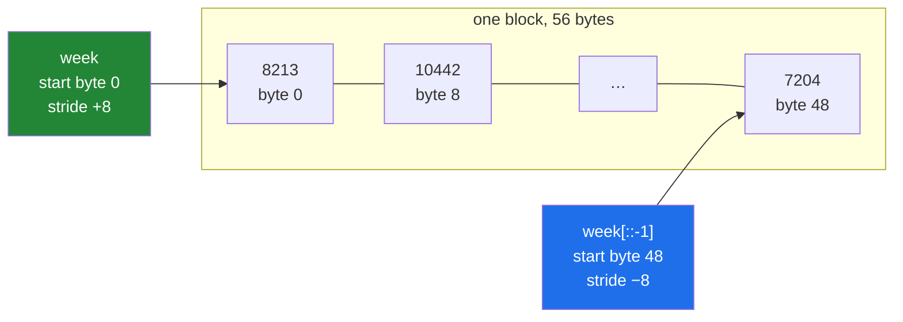

# 1.5 — `arr[::2]` and `arr[::-1]` — the step, and the reverse that costs nothing

## One-line answer

The third part of a slice is the **step**: `arr[::2]` takes every other element and `arr[::-1]`
reverses the array — and both are views, because reversing an array is a negative stride rather than
any movement of data.

---

## The story

Somebody reading the week's step counts out loud is asked to skip the weekdays and just do the
weekend. They read Saturday and Sunday.

Then they are asked for every other day, starting Monday. They read Monday, skip Tuesday, read
Wednesday, and so on — four numbers, and their finger moves in hops rather than steps.

Then: "read it backwards." They put their finger on Sunday and work leftwards to Monday.

Nothing was rewritten. The card on the fridge still says Monday first. What changed each time is
where the finger starts and how far it moves — and, in the last case, which direction it moves in.

Reading a list backwards has never required copying the list out in reverse order. It only requires
starting at the other end.

---

## The idea in plain language

The full slice syntax is `start:stop:step`, and you have used two thirds of it. The step says how far
to move each time.

- `week[::2]` — every second element, starting at 0. Positions 0, 2, 4, 6.
- `week[1::2]` — every second element, starting at 1. Positions 1, 3, 5.
- `week[::3]` — every third.
- `week[::-1]` — **reversed.** Every element, moving backwards.
- `week[::-2]` — every second element, backwards.

The default step is 1, which is why `week[1:5]` behaves the way it does.

**A negative step reverses the direction, and it also flips what `start` and `stop` mean.** With
`step=-1`, an omitted `start` means "the last element" and an omitted `stop` means "past the
beginning". That is why `week[::-1]` gives everything and `week[5:2:-1]` gives positions 5, 4, 3 —
counting down, stop still excluded. Slices with an explicit start, stop *and* negative step are the
hardest thing in this syntax to read, and the honest advice is to avoid writing them: reverse first,
then slice forwards.

Now the property that matters.

**A step is a stride multiplier, so a stepped slice is still a view.** `week[::2]` on an `int64`
array has stride 16 instead of 8. `week[::-1]` has stride **−8** and starts at the last element.
Negative strides are perfectly legal — the address arithmetic from
[Day 20, 1.3](../../../day-20-arrays-and-dtypes/parts/01-the-block/1.3-one-block-and-strides.md)
works just as well going down as up.

That means **reversing an array is free**, regardless of its size. `arr[::-1]` on a four-gigabyte
array returns instantly and uses no extra memory. Compare `list(reversed(lst))`, which builds a new
list of the same length.

It also means the reversed array is a *view*, so writing to it writes into the parent, backwards.
That is occasionally exactly what you want and usually a surprise.

One practical note: a reversed view is not C-contiguous, so anything that requires contiguous memory
— `tobytes`, some library calls, `ravel` in some cases — will copy it. That copy is fine; the point
is knowing where it happens
([Day 22, 2.4](../../../day-22-broadcasting-and-shape/parts/02-reshape/2.4-ravel-and-flatten.md)).

---

## Why Setu needs it

- **`arr[::-1]` is how you get descending order** after `np.argsort`, which sorts ascending only.
  That pairing is Day 23's top-k, and it is the most common use of a negative step in the whole
  curriculum.
- **Downsampling a signal is `arr[::k]`** — Day 108 takes every fourth reading from a time series
  exactly this way.
- **Day 130 flips images for augmentation** with `img[:, ::-1]`, a horizontal mirror that costs
  nothing until the array is actually read.
- **`arr[::-1]` returning a view rather than a copy** is why a "reverse then modify" step can reach
  back into data you thought you had left alone.

---

## The mechanism

Steps, forwards and backwards.

```python
import numpy as np

week = np.array([8213, 10442, 6180, 0, 12007, 9631, 7204])

print("week      :", week)
print("week[::2] :", week[::2])
print("week[1::2]:", week[1::2])
print("week[::3] :", week[::3])
print("week[::-1]:", week[::-1])
print("week[::-2]:", week[::-2])
print("week[5:2:-1]:", week[5:2:-1])
```

**Line by line:**

- `week[::2]` — positions 0, 2, 4, 6. Both `start` and `stop` are omitted, so it is the whole array
  with a step of two.
- `week[1::2]` — the same idea offset by one: positions 1, 3, 5. Note it gives **three** values where
  the previous gave four, because seven is odd.
- `week[::-1]` — the whole thing, backwards. Sunday first.
- `week[::-2]` — backwards, every other one: positions 6, 4, 2, 0.
- `week[5:2:-1]` — from position 5 down to but not including 2, so 5, 4, 3. **This is the form to
  avoid writing**; it is correct and nobody reads it correctly the first time.

```text
week      : [ 8213 10442  6180     0 12007  9631  7204]
week[::2] : [ 8213  6180 12007  7204]
week[1::2]: [10442     0  9631]
week[::3] : [8213    0 7204]
week[::-1]: [ 7204  9631 12007     0  6180 10442  8213]
week[::-2]: [ 7204 12007  6180  8213]
week[5:2:-1]: [ 9631 12007     0]
```

Now the strides, which explain all of it:

```python
import numpy as np

week = np.array([8213, 10442, 6180, 0, 12007, 9631, 7204])

for label, view in [
    ("week", week),
    ("week[::2]", week[::2]),
    ("week[::3]", week[::3]),
    ("week[::-1]", week[::-1]),
    ("week[::-2]", week[::-2]),
]:
    print(
        f"{label:11} strides={view.strides!s:8} shares={np.shares_memory(week, view)!s:5} "
        f"contiguous={view.flags['C_CONTIGUOUS']}"
    )
```

**Line by line:**

- `week[::2].strides` — `(16,)`. Two elements of 8 bytes each per step. **The step multiplies the
  stride**, and that is the entire implementation.
- `week[::-1].strides` — `(-8,)`. Negative, so each step moves backwards through memory. The array's
  start address is the *last* element rather than the first.
- `np.shares_memory(week, view)` — `True` for every one of them. All views, none copied.
- `flags['C_CONTIGUOUS']` — `True` only for the original. A stepped or reversed view has gaps or runs
  backwards, so it is not contiguous, and any operation needing contiguous memory will make a copy
  at that point.

```text
week        strides=(8,)     shares=True  contiguous=True
week[::2]   strides=(16,)    shares=True  contiguous=False
week[::3]   strides=(24,)    shares=True  contiguous=False
week[::-1]  strides=(-8,)    shares=True  contiguous=False
week[::-2]  strides=(-16,)   shares=True  contiguous=False
```

The negative stride, drawn:



Two arrays, one block, and the only difference is where you start and which way you go.

And the reason this matters more than it looks — sorting descending:

```python
import numpy as np

week = np.array([8213, 10442, 6180, 0, 12007, 9631, 7204])
names = np.array(["Mon", "Tue", "Wed", "Thu", "Fri", "Sat", "Sun"])

order = np.argsort(week)
print("argsort (ascending) :", order)
print("quietest first      :", names[order])
print("busiest first       :", names[order[::-1]])
print("top three           :", names[order[::-1]][:3], week[order[::-1]][:3])
print("values another way  :", np.sort(week)[::-1][:3])
```

**Line by line:**

- `np.argsort(week)` — the **positions** that would sort the array, ascending. Not the sorted values:
  the positions. `argsort` has no `descending=` option, which is why the next line exists.
- `names[order]` — indexing one array with the sort order of another. This is advanced indexing
  ([4.1](../04-fancy-indexing/4.1-a-list-of-positions.md)) and it copies, which is fine for names.
- `order[::-1]` — **the reverse of the order, which is the descending sort.** This is the idiom, and
  it is free: no second sort, no copy of the data.
- `[:3]` — the top three. Combining a reverse with a head slice is how top-k is written before you
  meet `np.argpartition` on Day 23.

```text
argsort (ascending) : [3 2 6 0 5 1 4]
quietest first      : ['Thu' 'Wed' 'Sun' 'Mon' 'Sat' 'Tue' 'Fri']
busiest first       : ['Fri' 'Tue' 'Sat' 'Mon' 'Sun' 'Wed' 'Thu']
top three           : ['Fri' 'Tue' 'Sat'] [12007 10442  9631]
values another way  : [12007 10442  9631]
```

The last two lines agree, and it is worth knowing *why* rather than being relieved.
`week[order[::-1]]` works because `order` was computed from `week`, so applying it back to `week`
gives the values in sorted order. `names[order[::-1]]` works for the same reason: `names` lines up
with `week` position by position. **Apply an `argsort` order to an array that is not aligned with the
one it was computed from and you get a plausible, silently wrong answer** — which is the whole hazard
of index arrays, and [4.1](../04-fancy-indexing/4.1-a-list-of-positions.md) is where it lives.

---

## When it breaks

**A negative step with explicit bounds, read wrongly:**

```text
$ uv run python -c "
import numpy as np
week = np.array([8213, 10442, 6180, 0, 12007, 9631, 7204])
print('week[2:5]     :', week[2:5])
print('week[5:2:-1]  :', week[5:2:-1])
print('week[2:5][::-1]:', week[2:5][::-1])
"
week[2:5]     : [ 6180     0 12007]
week[5:2:-1]  : [ 9631 12007     0]
week[2:5][::-1]: [12007     0  6180]
```

**What it means.** Somebody wanting "positions 2 to 4, backwards" writes `week[5:2:-1]` and gets
positions 5, 4, 3 — a different set entirely, off by one at both ends. The reliable form is the
third line: **slice forwards, then reverse.** It is two operations, both free, and it reads exactly
as it behaves.

**A reversed view written through:**

```text
$ uv run python -c "
import numpy as np
week = np.array([8213, 10442, 6180, 0, 12007, 9631, 7204])
backwards = week[::-1]
backwards[0] = 0
print('week :', week)
print('shares:', np.shares_memory(week, backwards))
"
week : [ 8213 10442  6180     0 12007  9631     0]
shares: True
```

**What it means.** Position 0 of the reversed view is position 6 of the original, so writing to the
"first" element of `backwards` changed the **last** element of `week`. Nothing raised. If you want a
reversed array you can modify freely, `week[::-1].copy()` is the fix, and the `.copy()` is where the
cost finally appears.

**A step of zero:**

```text
$ uv run python -c "
import numpy as np
week = np.array([8213, 10442, 6180])
week[::0]
" 2>&1 | tail -2
ValueError: slice step cannot be zero
```

**What it means.** A step of zero would never advance, so there is no sensible answer and NumPy
refuses — as Python does for lists. It happens when the step is computed, `n // k` with `n < k`, and
the guard is to check before slicing rather than to catch the error.

**Contiguity lost, and a copy made without a word:**

```text
$ uv run python -c "
import numpy as np
week = np.array([8213, 10442, 6180, 0, 12007, 9631, 7204])
backwards = week[::-1]
print('reversed contiguous:', backwards.flags['C_CONTIGUOUS'])
print('ravel copies?      :', backwards.ravel().base is None)
print('ascontig copies?   :', np.shares_memory(week, np.ascontiguousarray(backwards)))
"
reversed contiguous: False
ravel copies?      : True
ascontig copies?   : False
```

**What it means.** The reverse itself is free; flattening it is not. `ravel` must produce contiguous
memory, and a backwards view is not contiguous, so it copies — `base is None` proves the copy
happened. On a 4 GB array a stray `.ravel()` after a reverse is a 4 GB allocation nobody wrote down.
The tool for spotting it is that one-line check.

---

## In production

**What a professional writes instead of the teaching version.** They use `[::-1]` for descending
order and they write it once, in a named helper, because the argsort pairing is easy to get subtly
wrong:

```python
import numpy as np


def top_k(values: np.ndarray, k: int) -> tuple[np.ndarray, np.ndarray]:
    """The k largest values and their positions, largest first."""
    if values.ndim != 1:
        raise ValueError(f"expected one dimension, got shape {values.shape}")
    k = min(k, values.size)
    order = np.argsort(values)[::-1][:k]
    return order, values[order]
```

**Line by line:**

- `k = min(k, values.size)` — asking for the top ten of seven values is a caller mistake that is
  cheaper to absorb than to raise on, and slicing already clips
  ([1.3](1.3-slicing-one-axis.md)). Returning fewer than `k` is honest because the count is visible
  in the returned array's length.
- `np.argsort(values)` — ascending positions.
- `[::-1]` — reverse, so largest first. Free, and it does not re-sort.
- `[:k]` — the head. Note the order of the three: reverse **then** take, never take then reverse.
- `values[order]` — the values in the same order as the positions, so the two returned arrays line
  up. **Returning both is the point**: the positions are what you use to index other arrays, and the
  values are what you print.
- `-> tuple[np.ndarray, np.ndarray]` — honest about both
  ([Day 19, 1.2](../../../day-19-typing-dataclasses-and-concurrency/parts/01-type-hints/1.2-the-vocabulary.md)).

**What changes at scale.** `arr[::-1]` stays free forever, and that is genuinely useful: reversing a
memory-mapped 40 GB array costs nothing and touches no disk. What does not scale is the full sort
underneath it. `np.argsort` is O(n log n) over the whole array, so "the top ten of a hundred million"
sorts a hundred million values to throw away all but ten. `np.argpartition(values, -k)[-k:]` does the
same job in O(n) by only partially ordering, and on large arrays it is an order of magnitude faster.
Day 23 makes that swap.

The second scale effect is the copy hidden behind contiguity. Reversed and stepped views are not
contiguous, so the first operation that needs contiguous memory silently materialises the whole
thing. In a pipeline of five steps, one `.ravel()` after a reverse can double the peak memory of the
whole job.

**The failure that only appears with real data.** A downsampling step written as `signal[::4]` to
take every fourth reading. It worked for two years on data recorded at a steady rate. Then a sensor
started reporting at a variable rate, and "every fourth sample" stopped meaning "every four
seconds". The code was correct and the assumption underneath it — that position is proportional to
time — had quietly stopped being true. A step is a position operation, never a time operation.

**The review comment a senior engineer leaves.** *"`scores[::-1][:10]` sorts the whole array to get
ten values. Use `np.argpartition(scores, -10)[-10:]` and sort just those ten — on our two hundred
million rows that is the difference between eight seconds and half a second."*

**The interview question.** *"How do you reverse a NumPy array, and what does it cost?"* `arr[::-1]`,
and it costs nothing — NumPy builds a view whose stride is negative and whose start address is the
last element, so no data moves regardless of size. The two consequences worth volunteering: it is a
view, so writing to it writes backwards into the original, and it is not contiguous, so the next
operation that needs contiguous memory will copy it silently. The follow-up is usually descending
sort, where the idiom is `np.argsort(x)[::-1]` because `argsort` only sorts ascending — and the
better answer at scale is `np.argpartition`.

---

## Check yourself

```bash
uv run python -c "
import numpy as np
week = np.array([8213, 10442, 6180, 0, 12007, 9631, 7204])
print('week[::2]  :', week[::2])
print('week[::-1] :', week[::-1])
print('strides    :', week[::2].strides, week[::-1].strides)
rev = week[::-1]
rev[0] = 0
print('week now   :', week)
"
```

The last line changed one element, and it is not the first one. Say which and why.

**Answer out loud, without scrolling up:**

> What does NumPy actually do to produce `arr[::-1]`, and how much memory does it use? Then say the
> two things that make a reversed view different from a reversed copy.

---

**Next:** [1.6 — `...` and `np.newaxis`](1.6-ellipsis-and-newaxis.md).
