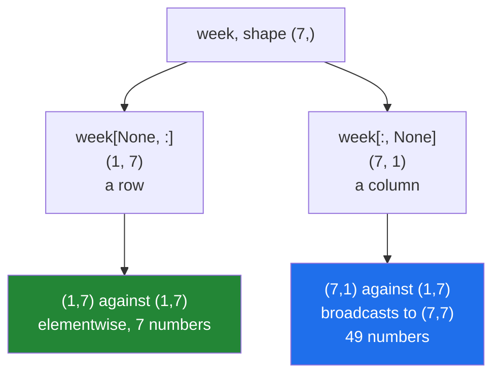

# 1.6 — `...` and `np.newaxis` — the two placeholders

## One-line answer

`...` stands for "as many `:` as it takes", so `cube[..., 0]` works whatever the number of axes; and
`np.newaxis` — which is just `None` — **inserts** an axis of length one, turning a `(7,)` row into a
`(7, 1)` column without moving any data.

---

## The story

Somebody is filling in a form that asks for a phone number in boxes: one digit per box.

They have a seven-digit number and there are seven boxes. Fine.

Then a different form arrives. Same seven digits, but the boxes are arranged in a single column down
the page instead of a row across it. The digits have not changed. Their arrangement has.

A third form has a row of boxes with the seven digits in it, and above the row a label, and the
whole thing is one row of a table that has other rows for other people. Same digits again, now sitting
inside something bigger.

Three forms. One phone number. Every time, the question is not "what are the digits" but "what shape
is the space they have to fit into", and the answer is arranged differently to suit.

---

## The idea in plain language

Two bits of index syntax exist to manage shape rather than content. Neither one selects anything.

**`...` — the ellipsis — means "fill in as many `:` as are needed here".**

For a three-axis cube, `cube[..., 0]` means `cube[:, :, 0]`. For a five-axis array, the same
expression means `cube[:, :, :, :, 0]`. You write it once and it works for both.

That matters when the number of axes varies. An image might be `(height, width)` in greyscale and
`(height, width, 3)` in colour; a batch of them adds another axis in front. `img[..., 0]` means "the
first channel" and is correct for every one of those shapes, where `img[:, :, 0]` is correct for
exactly one.

**Only one `...` is allowed per index**, because two of them would be ambiguous — NumPy could not
tell how many axes each should absorb.

**`np.newaxis` inserts an axis of length one.**

`week` has shape `(7,)`. Then:

- `week[np.newaxis, :]` → `(1, 7)` — one row of seven.
- `week[:, np.newaxis]` → `(7, 1)` — seven rows of one.

Seven numbers either way, and 56 bytes either way. Only the description changed, so both are views.

**`np.newaxis` *is* `None`.** They are the same object; `np.newaxis is None` is `True`. Writing
`week[:, None]` is extremely common in real code and means exactly `week[:, np.newaxis]`. The spelled
name is clearer and the `None` form is what you will read in other people's code, so you need both.

Why insert an axis at all? Because broadcasting decides what pairs with what by shape, and `(7,)`
against `(7,)` behaves completely differently from `(7, 1)` against `(1, 7)`. The first is
elementwise and gives seven numbers; the second gives a 7 × 7 grid of every combination. That is
Day 22's whole subject
([Day 22, 1.4](../../../day-22-broadcasting-and-shape/parts/01-broadcasting/1.4-keepdims-and-the-column.md)),
and `np.newaxis` is how you steer it.

Two alternatives worth knowing, because you will meet all three:

- **`arr[:, 2:3]`** — a slice that keeps its axis, from [1.4](1.4-a-whole-column.md). Same result as
  `arr[:, 2, np.newaxis]` for that case, and it reads worse.
- **`np.expand_dims(arr, axis=1)`** — the function form. Identical behaviour, and easier to use when
  the axis number is in a variable
  ([Day 22, 4.4](../../../day-22-broadcasting-and-shape/parts/04-joining-and-splitting/4.4-newaxis-and-expand-dims.md)).
- **`arr.reshape(-1, 1)`** — also works, also a view, and it says less about intent.

---

## Why Setu needs it

- **`X[:, None]` is how a 1-D target becomes the `(n, 1)` column scikit-learn asks for** from Day 42
  on, and the error you get without it names two shapes and nothing else.
- **Day 22's mean-centring uses `keepdims=True`**, which is `np.newaxis` applied automatically by a
  reduction, and understanding one explains the other.
- **Day 155's single-document embedding is `(384,)` where the batch version is `(1, 384)`**, and the
  `None` is what reconciles them.
- **Day 130's images gain and lose a channel axis constantly** — `img[..., 0]`, `img[None]` — and
  writing those with explicit `:` breaks the moment the batch axis appears.

---

## The mechanism

The ellipsis, on arrays of different rank.

```python
import numpy as np

flat = np.arange(4)
table = np.arange(12).reshape(3, 4)
cube = np.arange(24).reshape(2, 3, 4)

for name, arr in [("flat", flat), ("table", table), ("cube", cube)]:
    print(f"{name:6} shape={arr.shape!s:10} arr[..., 0].shape={np.shape(arr[..., 0])}")

print()
print("cube[..., 0]  == cube[:, :, 0] :", np.array_equal(cube[..., 0], cube[:, :, 0]))
print("cube[0, ...]  == cube[0]       :", np.array_equal(cube[0, ...], cube[0]))
print("cube[..., 0].shape             :", cube[..., 0].shape)
print("cube[0, ...].shape             :", cube[0, ...].shape)
print("cube[:, 1, ...].shape          :", cube[:, 1, ...].shape)
```

**Line by line:**

- `arr[..., 0]` — the **last** axis, position 0. One expression, three different ranks, and it means
  something sensible for each. For `flat` it absorbs zero axes and gives a scalar.
- `cube[..., 0]` against `cube[:, :, 0]` — identical, and the first does not have to know that there
  are three axes.
- `cube[0, ...]` — leading index, then "everything else". Equivalent to `cube[0]`, and writing the
  `...` makes it obvious that more axes exist.
- `cube[:, 1, ...]` — the `...` can sit anywhere and absorbs whatever is left, which here is nothing:
  the shape is `(2, 4)`.

```text
flat   shape=(4,)       arr[..., 0].shape=()
table  shape=(3, 4)     arr[..., 0].shape=(3,)
cube   shape=(2, 3, 4)  arr[..., 0].shape=(2, 3)

cube[..., 0]  == cube[:, :, 0] : True
cube[0, ...]  == cube[0]       : True
cube[..., 0].shape             : (2, 3)
cube[0, ...].shape             : (3, 4)
cube[:, 1, ...].shape          : (2, 4)
```

Now `np.newaxis`, and the three shapes of one week:

```python
import numpy as np

week = np.array([8213, 10442, 6180, 0, 12007, 9631, 7204])

as_row = week[np.newaxis, :]
as_column = week[:, np.newaxis]

print("week       shape:", week.shape, "nbytes:", week.nbytes)
print("as_row     shape:", as_row.shape, "nbytes:", as_row.nbytes)
print("as_column  shape:", as_column.shape, "nbytes:", as_column.nbytes)
print("newaxis is None :", np.newaxis is None)
print("week[:, None]   :", week[:, None].shape)
print("all views?      :", np.shares_memory(week, as_row), np.shares_memory(week, as_column))
print()
print("as_column:")
print(as_column)
```

**Line by line:**

- `week[np.newaxis, :]` — insert an axis **before** the existing one: `(1, 7)`. Read the index left
  to right and it says "a new axis here, then everything".
- `week[:, np.newaxis]` — insert **after**: `(7, 1)`. This is the one you want when something demands
  a column.
- `nbytes` is 56 for all three — **no data moved**, which is the point.
- `np.newaxis is None` — `True`. Not "equal to"; the same object.
- `np.shares_memory` — `True` for both. Views, as every basic index is.
- The printed `as_column` shows seven rows of one, which is what `(7, 1)` means and is worth seeing
  once.

```text
week       shape: (7,) nbytes: 56
as_row     shape: (1, 7) nbytes: 56
as_column  shape: (7, 1) nbytes: 56
newaxis is None : True
week[:, None]   : (7, 1)
all views?      : True True

as_column:
[[ 8213]
 [10442]
 [ 6180]
 [    0]
 [12007]
 [ 9631]
 [ 7204]]
```

Why the difference matters:



Same seven numbers, and one of those two answers is 49 numbers. That is why the placeholder exists.

The 7 × 7 grid, since it is worth seeing before Day 22:

```python
import numpy as np

week = np.array([8213, 10442, 6180, 0, 12007, 9631, 7204])

differences = week[:, None] - week[None, :]
print("shape :", differences.shape)
print("first three rows:")
print(differences[:3, :3])
print("diagonal is zero:", np.all(np.diag(differences) == 0))
```

**Line by line:**

- `week[:, None] - week[None, :]` — a `(7, 1)` minus a `(1, 7)`. Broadcasting stretches both to
  `(7, 7)`, so entry `[i, j]` is `week[i] - week[j]`: **every pairwise difference**, in one
  expression and no loop.
- `differences[:3, :3]` — the top-left corner, so the output is readable.
- `np.diag(differences)` — the diagonal, where `i == j`, so every entry is a value minus itself.
  Checking it is zero is a free sanity test that the broadcast went the way you meant.
- This is the shape of every pairwise-distance calculation you will write, including the one that
  scores a query against every stored vector on Day 162.

```text
shape : (7, 7)
first three rows:
[[    0 -2229  2033]
 [ 2229     0  4262]
 [-2033 -4262     0]]
diagonal is zero: True
```

---

## When it breaks

**Two ellipses:**

```text
$ uv run python -c "
import numpy as np
cube = np.arange(24).reshape(2, 3, 4)
cube[..., 0, ...]
" 2>&1 | tail -2
IndexError: an index can only have a single ellipsis ('...')
```

**What it means.** With two, NumPy cannot tell how many axes each should absorb — `[..., 0, ...]` on
a five-axis array could mean four different things. One per index, and if you need more precision,
name the axes explicitly.

**Inserting the axis on the wrong side:**

```text
$ uv run python -c "
import numpy as np
week = np.array([8213, 10442, 6180])
print('column :', (week[:, None] * np.array([1, 2])).shape)
print('row    :', (week[None, :] * np.array([1, 2])).shape)
" 2>&1 | tail -3
ValueError: operands could not be broadcast together with shapes (1,3) (2,) 
column : (3, 2)
```

**What it means.** `(3, 1)` against `(2,)` broadcasts to `(3, 2)` — every combination. `(1, 3)`
against `(2,)` does not broadcast at all, because 3 and 2 disagree. **The side you put the `None` on
decides whether the operation is legal**, and neither choice is more natural than the other; it
depends entirely on what you are pairing with.

**Expecting `np.newaxis` to add data:**

```text
$ uv run python -c "
import numpy as np
week = np.array([8213, 10442, 6180])
padded = week[:, np.newaxis]
print('shape  :', padded.shape)
print('size   :', padded.size)
print('nbytes :', padded.nbytes)
padded[0, 0] = 0
print('week   :', week)
"
shape  : (3, 1)
size   : 3
nbytes : 24
week   : [    0 10442  6180]
```

**What it means.** `(3, 1)` has **three** elements, not four and not six. An axis of length one adds
a dimension to the description and no storage — and because it is a view, writing to it writes into
the original. People sometimes reach for `newaxis` expecting to make room for something; the function
for that is `np.pad` or a `np.concatenate`
([Day 22, 4.1](../../../day-22-broadcasting-and-shape/parts/04-joining-and-splitting/4.1-concatenate.md)).

**The shape error scikit-learn gives, and its fix:**

```text
$ uv run python -c "
import numpy as np
y = np.array([1.0, 2.0, 3.0, 4.0])
print('1-D shape      :', y.shape)
print('as a column    :', y[:, None].shape)
print('reshape(-1, 1) :', y.reshape(-1, 1).shape)
print('expand_dims    :', np.expand_dims(y, axis=1).shape)
print('all views?     :', all(np.shares_memory(y, v) for v in [y[:, None], y.reshape(-1, 1), np.expand_dims(y, 1)]))
"
1-D shape      : (4,)
as a column    : (4, 1)
reshape(-1, 1) : (4, 1)
expand_dims    : (4, 1)
all views?     : True
```

**What it means.** Three spellings of the same free operation. The message that sends people here is
scikit-learn's *"Expected 2D array, got 1D array instead… Reshape your data either using
array.reshape(-1, 1) if your data has a single feature or array.reshape(1, -1) if it contains a
single sample."* Those two suggestions are `y[:, None]` and `y[None, :]`, and choosing between them
is choosing whether you have four samples of one feature or one sample of four features — a question
about your data, not about NumPy.

---

## In production

**What a professional writes instead of the teaching version.** They use `...` whenever the rank can
vary, and they insert axes with a named helper rather than scattering `None` through the code:

```python
import numpy as np


def as_column(values: np.ndarray) -> np.ndarray:
    """Return an (n, 1) view of a 1-D array, or pass a correct 2-D array straight through."""
    if values.ndim == 2 and values.shape[1] == 1:
        return values
    if values.ndim != 1:
        raise ValueError(f"expected 1-D or (n, 1), got shape {values.shape}")
    return values[:, np.newaxis]


def first_channel(images: np.ndarray) -> np.ndarray:
    """The first channel of an image, a batch of images, or a batch of batches."""
    if images.shape[-1] not in (1, 3, 4):
        raise ValueError(f"last axis is {images.shape[-1]}, which is not a channel count")
    return images[..., 0]
```

**Line by line:**

- `if values.ndim == 2 and values.shape[1] == 1: return values` — **idempotent**. Calling it twice is
  the same as calling it once, which matters because a helper like this ends up on both sides of a
  boundary and nobody tracks which side already converted.
- `values[:, np.newaxis]` rather than `values.reshape(-1, 1)` — both work; the first says *insert an
  axis* and the second says *rearrange into this shape*, and here the first is what is meant.
- `images.shape[-1]` — the **last** axis by negative index, so the check works for `(h, w, 3)` and
  `(batch, h, w, 3)` alike. Hard-coding `shape[2]` would break the moment a batch axis appears.
- `images[..., 0]` — the point of the function. One expression, any rank, and the caller does not
  have to say how many axes their data has.
- The channel-count check is a cheap guard against the classic mistake of handing this a
  `(3, h, w)` array — channels-first, the PyTorch convention — where `shape[-1]` is the width.

**What changes at scale.** Neither placeholder ever costs anything: `...` is resolved at index time
and `np.newaxis` changes only the shape tuple, so both are free on a forty-gigabyte array.

What does scale is the *consequence*. `a[:, None] - b[None, :]` on two arrays of a hundred thousand
elements produces a `(100_000, 100_000)` result — ten billion numbers, 80 GB — from an expression
that looks like a subtraction. That is the single most common way a NumPy program runs out of
memory, and it is
[Day 22, 1.7](../../../day-22-broadcasting-and-shape/parts/01-broadcasting/1.7-the-broadcast-that-ate-the-memory.md).
The habit that prevents it: **whenever you write a `None` on both sides of an operator, multiply the
two lengths out loud before running it.**

**The failure that only appears with real data.** A pipeline that handled greyscale images with
`img[:, :, 0]` and worked for a year. Then someone added a batching step, the arrays became
`(batch, h, w, 1)`, and `img[:, :, 0]` silently selected the first *row of pixels* of every image
instead of the first channel — right shape, wrong content, no error. `img[..., 0]` would have kept
working through the change, and that is the whole argument for the ellipsis.

**The review comment a senior engineer leaves.** *"`x[:, :, 0]` assumes exactly three axes. Use
`x[..., 0]` — the caller passes a batch in the training path and a single image in the inference
path, and right now only one of those is correct."*

**The interview question.** *"What is `np.newaxis` and when do you use it?"* It is `None` under
another name, and putting it in an index inserts an axis of length one without moving any data, so
the result is a view of the same bytes. You use it to steer broadcasting: a `(n,)` array is
ambiguous, and `x[:, None]` makes it a column while `x[None, :]` makes it a row, which decides
whether pairing it with something is elementwise or produces a full outer grid. The companion answer
is `...`, which stands for as many `:` as the array has spare axes, so `x[..., 0]` selects the last
axis correctly whether the array is 2-D, 3-D or 4-D — and the reason that matters is that adding a
batch axis is the most common shape change in a real pipeline.

---

## Check yourself

```bash
uv run python -c "
import numpy as np
week = np.array([8213, 10442, 6180])
print('None is newaxis :', np.newaxis is None)
print('row    :', week[None, :].shape)
print('column :', week[:, None].shape)
print('bytes  :', week.nbytes, week[:, None].nbytes)
print('grid   :', (week[:, None] - week[None, :]).shape)
cube = np.arange(24).reshape(2, 3, 4)
print('ellipsis:', cube[..., 0].shape, cube[0, ...].shape)
"
```

Three numbers become a nine-element grid on line five. Say where the other six came from.

**Answer out loud, without scrolling up:**

> What does `x[..., 0]` mean, and why is it better than `x[:, :, 0]`? Then say what shape
> `x[:, None]` gives for a `(7,)` array, and how many bytes it uses.

---

**Next:** [2.1 — a slice does not copy](../02-the-view-trap/2.1-a-slice-does-not-copy.md).
