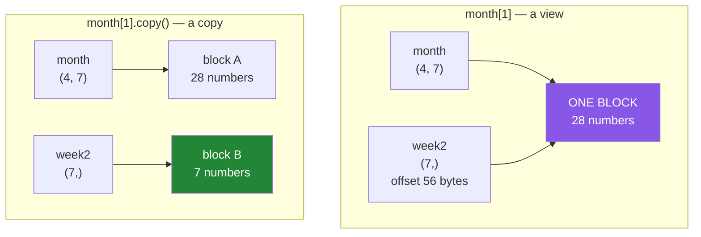

# 2.1 — A slice does not copy — write to it and the parent changes

## One-line answer

`week = month[1]` does not make a new array of seven numbers; it makes a second way of reading the
same seven numbers, so `week[0] = 0` changes `month` too — and nothing warns you.

---

## The story

Two people share a shopping list on a phone.

One of them is at the shop. They open the list, see that bread is on it, buy the bread, and cross it
off.

The other one is at home. They look at the list a minute later and bread is gone. They did not
delete it. Nobody told them it had been deleted. The item simply is not there any more, because
there was only ever one list and two ways of looking at it.

Now compare that with the old way: one of them writes the list out on a scrap of paper and takes it
to the shop. Crossing bread off the scrap does nothing at all to the list on the fridge. Two pieces
of paper, two independent lists, and the one at home stays complete until somebody updates it by
hand.

Both arrangements are useful. The shared one saves copying and keeps everybody current. The copied
one is safe from surprises.

The trouble is only ever this: **looking at the two of them, you cannot tell which one you have.**

---

## The idea in plain language

You met this exact idea for Python objects on
[Day 4, 2.3](../../../day-04-objects/parts/02-containers/2.3-aliasing-two-names-one-object.md),
where two names could point at one list. NumPy adds a sharper version: two *arrays*, genuinely
different objects with different shapes, describing the same block of memory.

A **view** is an array that does not own its data. It has its own shape, its own strides and its own
offset into somebody else's block
([Day 20, 1.3](../../../day-20-arrays-and-dtypes/parts/01-the-block/1.3-one-block-and-strides.md)).
Reading it reads that block. Writing it writes that block.

**Basic indexing always returns a view.** Every one of these:

- `month[1]` — one row
- `month[1:3]` — several rows
- `month[:, 2]` — a column
- `month[::-1]` — reversed
- `month.T` — transposed
- `month.reshape(2, 14)` — reshaped

**Advanced indexing always returns a copy.** Every one of these:

- `month[[0, 2]]` — a list of rows
- `month[month > 10000]` — a boolean mask
- `month[rows, cols]` — two index arrays

That is the whole rule, and it is worth learning as a rule rather than case by case, because there is
no third behaviour and no exceptions.

**Why views exist at all.** Because copying is expensive and usually unnecessary. A batch out of a
training set, a window over a time series, a column of a table — all of those are read, used and
thrown away, and copying them would double the memory traffic of every pipeline for no benefit. The
default is the fast thing, and the copy is what you ask for.

**Why this is a trap rather than a feature.** Because the syntax is identical to the copying kind.
`lst[1:3]` on a list gives you a new list; `arr[1:3]` on an array gives you a window. Same brackets,
same colon, opposite behaviour — and if the array came in as a function argument, you cannot see
from the code in front of you whether writing to it is safe.

The rule that keeps you out of trouble, stated once:

> **A function that receives an array and writes to it is modifying the caller's data, unless it
> copies first.**

Everything in this section follows from that sentence: how to check
([2.2](2.2-how-to-tell-base-and-shares-memory.md)), when to pay for a copy
([2.3](2.3-copy-and-when-to-pay.md)), and what it costs when nobody did
([2.4](2.4-the-function-that-changed-its-input.md)).

---

## Why Setu needs it

- **Principle 8 says the split comes before the scaler.** A split made with slices hands out views,
  so a scaler that works in place writes back into the full dataset — and that is
  [5.1](../05-in-anger/5.1-the-leak-a-view-causes.md), the leak this whole day exists to prevent.
- **Day 44's transformers all take an array and return one**, and whether they copied is the
  difference between a pipeline you can rerun and one you cannot.
- **Day 130's batches are slices of the training set.** Augmenting a batch in place augments the
  dataset, permanently, and epoch two trains on data that epoch one modified.
- **Every pandas warning you will meet on Day 26** — `SettingWithCopyWarning` and the Copy-on-Write
  changes in pandas 3.0 — is this same problem, one layer up.

---

## The mechanism

The shared list, in code.

```python
import numpy as np

month = np.array(
    [
        [8213, 10442, 6180, 0, 12007, 9631, 7204],
        [7788, 9120, 11345, 8402, 6733, 14210, 5096],
        [9004, 8765, 7621, 10188, 9950, 8317, 11002],
        [6540, 12488, 9873, 7106, 8899, 10540, 9218],
    ]
)

week2 = month[1]
week2[0] = 0

print("week2   :", week2)
print("month[1]:", month[1])
print("shares  :", np.shares_memory(month, week2))
print("owns    :", week2.flags["OWNDATA"], month.flags["OWNDATA"])
```

**Line by line:**

- `week2 = month[1]` — this looks like taking a copy of week two, and it is not. It is a second
  array object describing bytes 56 to 111 of `month`'s block.
- `week2[0] = 0` — one assignment, to what looks like a local variable.
- `month[1]` printed afterwards — **changed.** The zero is there too, because there was only one
  place for it to be.
- `np.shares_memory(month, week2)` — `True`, which is the check that would have told you
  ([2.2](2.2-how-to-tell-base-and-shares-memory.md)).
- `week2.flags["OWNDATA"]` — `False`. The view does not own its data; `month` does.

```text
week2   : [    0  9120 11345  8402  6733 14210  5096]
month[1]: [    0  9120 11345  8402  6733 14210  5096]
shares  : True
owns    : False True
```

And the same thing with a copy:

```python
import numpy as np

month = np.array(
    [
        [8213, 10442, 6180, 0, 12007, 9631, 7204],
        [7788, 9120, 11345, 8402, 6733, 14210, 5096],
        [9004, 8765, 7621, 10188, 9950, 8317, 11002],
        [6540, 12488, 9873, 7106, 8899, 10540, 9218],
    ]
)

week2 = month[1].copy()
week2[0] = 0

print("week2   :", week2)
print("month[1]:", month[1])
print("shares  :", np.shares_memory(month, week2))
print("base    :", week2.base)
```

**Line by line:**

- `.copy()` — six characters, and they are the whole difference. A new block is allocated and the
  seven values are written into it.
- `month[1]` — **unchanged.** `7788` is still there.
- `week2.base` — `None`. An array whose `base` is `None` owns its own data, and that is the second
  way to check ([2.2](2.2-how-to-tell-base-and-shares-memory.md)).

```text
week2   : [    0  9120 11345  8402  6733 14210  5096]
month[1]: [ 7788  9120 11345  8402  6733 14210  5096]
shares  : False
base    : None
```

Two blocks or one:



In the purple version there is one thing to change. In the green version there are two.

Now the rule, checked across every kind of index at once:

```python
import numpy as np

month = np.zeros((4, 7), dtype=np.int64)
month[:] = np.arange(28).reshape(4, 7)

kinds = [
    ("month[1]        row", month[1]),
    ("month[1:3]      rows", month[1:3]),
    ("month[:, 2]     column", month[:, 2]),
    ("month[::-1]     reversed", month[::-1]),
    ("month.T         transposed", month.T),
    ("month.reshape(2, 14)", month.reshape(2, 14)),
    ("month[[0, 2]]   fancy", month[[0, 2]]),
    ("month[month > 5] mask", month[month > 5]),
    ("month.copy()    copy", month.copy()),
]
for label, result in kinds:
    shares = np.shares_memory(month, result)
    print(f"{label:28} {'VIEW ' if shares else 'copy '} owndata={result.flags['OWNDATA']}")
```

**Line by line:**

- `month = np.zeros(...)` then `month[:] = ...` — built this way so `month` genuinely owns its block.
  `np.arange(28).reshape(4, 7)` would itself be a view of the `arange`, which makes the `base` column
  confusing for no reason.
- `np.shares_memory(month, result)` — the definitive check. It examines the actual byte ranges rather
  than guessing from the operation.
- The first six are basic indexing and the next two are advanced. **The split is exactly where the
  rule says it is.**
- `month.copy()` at the end as the control.

```text
month[1]        row          VIEW  owndata=False
month[1:3]      rows         VIEW  owndata=False
month[:, 2]     column       VIEW  owndata=False
month[::-1]     reversed     VIEW  owndata=False
month.T         transposed   VIEW  owndata=False
month.reshape(2, 14)         VIEW  owndata=False
month[[0, 2]]   fancy        copy  owndata=True
month[month > 5] mask        copy  owndata=True
month.copy()    copy         copy  owndata=True
```

Six views, three copies, and the line between them is exactly "did the index contain a list, an array
or a mask".

---

## When it breaks

**A helper that "just normalises a row":**

```text
$ uv run python -c "
import numpy as np

def normalise(row):
    row -= row.min()
    return row

month = np.array([[10.0, 20.0, 30.0], [40.0, 50.0, 60.0]])
print('before :', month.tolist())
result = normalise(month[0])
print('result :', result)
print('after  :', month.tolist())
"
before : [[10.0, 20.0, 30.0], [40.0, 50.0, 60.0]]
result : [ 0. 10. 20.]
after  : [[0.0, 10.0, 20.0], [40.0, 50.0, 60.0]]
```

**What it means.** `normalise` was handed a view and used `-=`, which modifies in place. The caller's
table changed. There is no error, the return value is correct, and the side effect is invisible at
the call site — `normalise(month[0])` looks like a pure expression. **`-=` on an array is the
dangerous operator**, because on a Python number it rebinds a name and on an array it writes memory.

**The same helper, made safe by one word:**

```text
$ uv run python -c "
import numpy as np

def normalise(row):
    row = row - row.min()
    return row

month = np.array([[10.0, 20.0, 30.0], [40.0, 50.0, 60.0]])
result = normalise(month[0])
print('result :', result)
print('after  :', month.tolist())
"
result : [ 0. 10. 20.]
after  : [[10.0, 20.0, 30.0], [40.0, 50.0, 60.0]]
```

**What it means.** `row = row - row.min()` builds a **new** array and rebinds the local name to it;
`row -= row.min()` writes into the existing one. One is a subtraction, the other is a subtraction
plus a store, and they differ by two characters. In performance-critical code `-=` is what you want,
deliberately, on an array you own — and that qualification is the whole skill.

**Two variables that are the same array:**

```text
$ uv run python -c "
import numpy as np
a = np.arange(6).reshape(2, 3)
b = a
c = a[:]
d = a.copy()
b[0, 0] = 99
print('a :', a[0, 0], ' b is a:', b is a)
print('c :', c[0, 0], ' c is a:', c is a, ' shares:', np.shares_memory(a, c))
print('d :', d[0, 0], ' shares:', np.shares_memory(a, d))
"
a : 99  b is a: True
c : 99  c is a: False  shares: True
d : 0  shares: False
```

**What it means.** Three levels of sharing. `b = a` is plain aliasing — the same object under two
names, which is
[Day 4, 2.3](../../../day-04-objects/parts/02-containers/2.3-aliasing-two-names-one-object.md).
`c = a[:]` is a **different object** that shares memory, so `c is a` is `False` and yet the write
still shows. Only `d` is independent. **`is` does not answer the question you care about**;
`np.shares_memory` does.

**A view that outlives the reason it existed:**

```text
$ uv run python -c "
import numpy as np
big = np.zeros((2000, 2000))
print('big is  :', f'{big.nbytes:,}', 'bytes')
first_row = big[0]
del big
print('row is  :', f'{first_row.nbytes:,}', 'bytes')
print('but base:', f'{first_row.base.nbytes:,}', 'bytes still held')
"
big is  : 32,000,000 bytes
row is  : 16,000 bytes
but base: 32,000,000 bytes still held
```

**What it means.** `del big` removed the name, and the 32 MB block is still alive because
`first_row` points into it. A function that loads a large file and returns one row keeps the whole
file in memory for as long as that row exists. Memory profilers show a 16 KB array and the process
holds 32 MB. `.copy()` at the point of return is the fix, and
[2.3](2.3-copy-and-when-to-pay.md) is when to reach for it.

---

## In production

**What a professional writes instead of the teaching version.** They decide, per function, whether it
mutates — and they say so in the name and the docstring, because a caller cannot tell from the
signature:

```python
import numpy as np


def centred(values: np.ndarray) -> np.ndarray:
    """Return a NEW array with the mean removed. The input is not touched."""
    return values - values.mean()


def centre_inplace(values: np.ndarray) -> None:
    """Subtract the mean IN PLACE. The caller's array is modified; returns nothing."""
    if not values.flags.writeable:
        raise ValueError("array is read-only")
    values -= values.mean()
```

**Line by line:**

- Two functions rather than a `copy: bool = True` flag. A boolean parameter that changes whether a
  function has side effects is the hardest kind of call to review, because the answer is at the call
  site and the consequence is somewhere else.
- `centred` returns a new array and the docstring says so in the first line.
- `centre_inplace` returns **`None`**, deliberately. Returning the array would let somebody write
  `y = centre_inplace(x)` and believe `x` was safe — the same reason Python's `list.sort()` returns
  `None` while `sorted()` returns a list
  ([Day 8, 1.5](../../../day-08-containers/parts/01-sequences/1.5-sort-sorted-and-key.md)).
- `_inplace` in the name — the convention that makes the mutation visible at the call site, which is
  the only place it matters.
- `values.flags.writeable` — a read-only view raises a confusing `ValueError` from deep inside the
  subtraction; checking first gives a message that names the problem
  ([2.3](2.3-copy-and-when-to-pay.md) covers setting that flag deliberately).

**What changes at scale.** The trade-off inverts. At small sizes, always copying is the right default:
it costs microseconds and removes a whole class of bug. At 4 GB per array it is the difference
between fitting in memory and not, and in-place operations become mandatory rather than an
optimisation. Real numeric libraries handle this by pushing the copy decision to the top of the
pipeline: copy once on entry, then work in place throughout, with a comment saying that is what is
happening.

There is a second effect that catches people. Views keep their parent alive, so a long-running
service that caches "just a few rows" from each of a thousand large arrays can hold every one of
those arrays in memory. The symptom is memory that grows and never falls, with no obvious leak,
because nothing is leaking — everything is legitimately referenced.

**The failure that only appears with real data.** A data-augmentation step that flipped images in
place, operating on batches sliced out of the training set. Epoch one flipped every image; epoch two
flipped them back; epoch three flipped them again. The model saw an alternating dataset, training was
unstable, and the cause was a `.copy()` missing from one line of the loader. It only showed up with
more than one epoch, which the smoke tests did not run.

**The review comment a senior engineer leaves.** *"This takes `X` and does `X[:, 0] /= 255`. That
writes into whatever the caller passed, and the caller is passing a slice of the full dataset — so
after the first call the dataset is scaled and every later call scales it again. Copy on entry or
return a new array."*

**The interview question.** *"Does slicing a NumPy array copy it?"* No — basic indexing (whole
numbers, slices, `...`, `newaxis`) returns a view sharing the parent's memory, so writing to the
slice writes into the parent. Advanced indexing (a list, an array or a boolean mask) always copies.
The consequences worth volunteering: a function that mutates an array argument is mutating the
caller's data unless it copies first; `is` does not detect sharing because a view is a different
object, so you use `np.shares_memory` or check `arr.base`; and a small view keeps its entire parent
array alive, which is a real memory problem in a long-running process.

---

## Check yourself

```bash
uv run python -c "
import numpy as np
month = np.arange(28).reshape(4, 7).copy()
view = month[1]
copy = month[2].copy()
view[0] = -1
copy[0] = -1
print('month[1, 0] :', month[1, 0])
print('month[2, 0] :', month[2, 0])
print('shares view :', np.shares_memory(month, view))
print('shares copy :', np.shares_memory(month, copy))
"
```

Two identical-looking assignments. Only one of them reached the table.

**Answer out loud, without scrolling up:**

> Which kinds of indexing give a view and which give a copy? Then say why `x is y` does not tell you
> whether two arrays share memory.

---

**Next:** [2.2 — how to tell: `base`, `shares_memory` and `flags`](2.2-how-to-tell-base-and-shares-memory.md).
