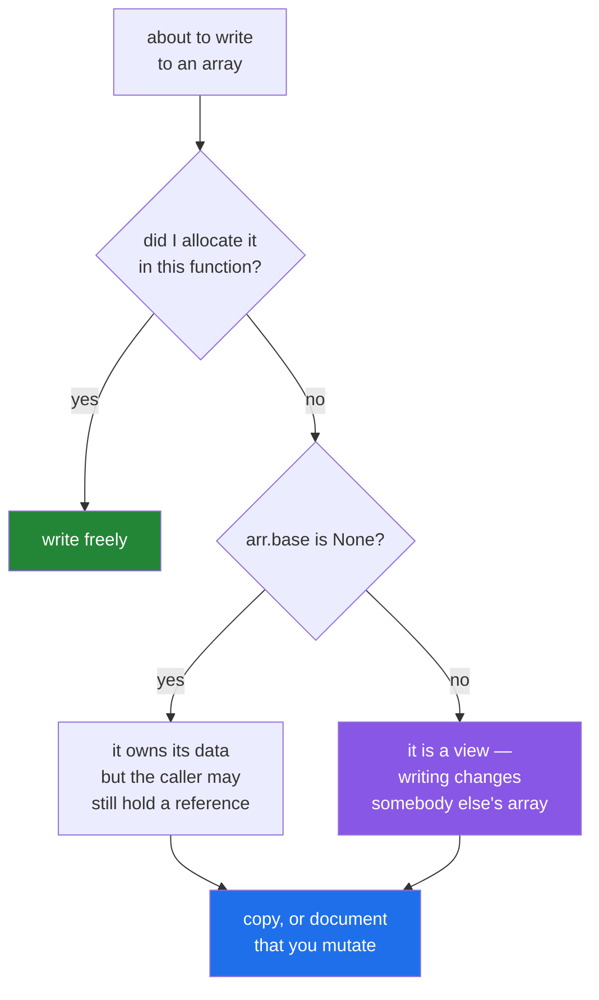

# 2.2 — How to tell — `base`, `shares_memory` and the flags

## One-line answer

`np.shares_memory(a, b)` answers the question directly, `arr.base` tells you whether an array owns
its data, and `arr.flags` reports both plus whether it can be written to — three checks, all free,
and one of them belongs in your fingers.

---

## The story

Somebody has two documents open and cannot remember whether the second one is a copy of the first or
the same file opened twice.

Guessing is available. The window title looks the same, the contents look the same, and if they are
wrong they will find out by losing an afternoon's edits.

Checking is also available, and it takes two seconds. Save the second one, look at the first, see
whether it changed.

The difference between the two people who do this is not knowledge. It is whether checking has become
automatic — whether "am I sure?" is a thought that arrives before the edit or after it.

---

## The idea in plain language

Three tools, in the order you should reach for them.

**`np.shares_memory(a, b)`** — the direct question. Do these two arrays overlap in memory at all?
`True` or `False`, and it is the one to use when you have both arrays in front of you.

It examines the actual byte ranges, so it is exact. There is a cheaper, approximate cousin,
`np.may_share_memory`, which can say `True` when the answer is really `False` — it checks whether
the address ranges overlap without working out whether any *element* does. For strided views those
differ. Use `shares_memory` unless you are calling it in a hot loop.

**`arr.base`** — the array this one is a view of, or `None` if it owns its data.

`None` means "this array owns its block". Anything else means "this is a view of that". The chain can
be more than one deep, and `base` may point at an intermediate array rather than the one you were
thinking of, which is why it answers "do I own this?" reliably and "am I a view of *that*?" only
loosely.

**`arr.flags`** — a small record of layout facts. Four of them matter today:

| Flag | Means |
|---|---|
| `OWNDATA` | this array allocated its own block |
| `WRITEABLE` | writing to it is allowed |
| `C_CONTIGUOUS` | elements run straight through the block, rows first |
| `F_CONTIGUOUS` | the same, columns first |

`OWNDATA` and `base is None` usually agree and are not quite the same question: `OWNDATA` is about
who allocated the memory, `base` is about which Python object keeps it alive. For everyday use they
are interchangeable, and `base is None` is the more common idiom.

**When to use which.** `shares_memory` when you have two arrays and want a yes or no. `base` when you
have one array and want to know whether it is safe to write to. `flags` when you are diagnosing
performance and need the contiguity too.

And the one worth building a habit around: **before writing to an array you did not allocate, ask
`arr.base is None`.** If it is not `None`, you are about to change somebody else's data.

---

## Why Setu needs it

- **Day 25's stats module has to know whether its input is safe to modify**, and the check is one
  line at the top.
- **Day 44's transformers copy on entry or document that they do not**, and the test that proves it
  uses `np.shares_memory`.
- **"Did that operation copy?" is the first question when memory goes up unexpectedly**, and
  `base is None` answers it in one line — that is
  [Day 22, 2.5](../../../day-22-broadcasting-and-shape/parts/02-reshape/2.5-when-reshape-must-copy.md).
- **The test in [5.2](../05-in-anger/5.2-view-or-copy-on-purpose.md) asserts non-sharing**, which is
  how a "this function does not modify its input" promise becomes something a machine can check.

---

## The mechanism

The three checks on one array.

```python
import numpy as np

month = np.zeros((4, 7), dtype=np.int64)
month[:] = np.arange(28).reshape(4, 7)

view = month[1:3]
copy = month[1:3].copy()

for label, arr in [("month", month), ("view", view), ("copy", copy)]:
    print(
        f"{label:6} base={'None' if arr.base is None else 'an array':9} "
        f"owndata={arr.flags['OWNDATA']!s:5} writeable={arr.flags['WRITEABLE']!s:5} "
        f"shares_with_month={np.shares_memory(month, arr)}"
    )
```

**Line by line:**

- `month = np.zeros(...)` then `month[:] = ...` — built this way so `month` really owns its block. If
  it were `np.arange(28).reshape(4, 7)`, `month.base` would point at the `arange` and the first row
  of output would be confusing for a reason unrelated to the lesson.
- `arr.base is None` — the ownership question, printed as words so the output reads.
- `arr.flags['OWNDATA']` and `arr.flags['WRITEABLE']` — the flags record, indexed by name.
- `np.shares_memory(month, arr)` — the direct question. Note it says `True` for `month` against
  itself, which is correct and occasionally surprising.

```text
month  base=None      owndata=True  writeable=True  shares_with_month=True
view   base=an array  owndata=False writeable=True  shares_with_month=True
copy   base=None      owndata=True  writeable=True  shares_with_month=False
```

Read the middle row. **`writeable=True` on a view** — NumPy will happily let you write to it, and
that is exactly the problem [2.1](2.1-a-slice-does-not-copy.md) described.

Now the whole catalogue, so the rule from [2.1](2.1-a-slice-does-not-copy.md) can be checked rather
than believed:

```python
import numpy as np

month = np.zeros((3, 4), dtype=np.int64)
month[:] = np.arange(12).reshape(3, 4)

operations = [
    ("month[1:]", month[1:]),
    ("month[:, 1]", month[:, 1]),
    ("month[::-1]", month[::-1]),
    ("month.T", month.T),
    ("month.reshape(4, 3)", month.reshape(4, 3)),
    ("month.ravel()", month.ravel()),
    ("month[[0, 2]]", month[[0, 2]]),
    ("month[month > 5]", month[month > 5]),
    ("month.copy()", month.copy()),
    ("month.flatten()", month.flatten()),
    ("month.astype(np.int64)", month.astype(np.int64)),
]
for label, result in operations:
    owner = "month" if result.base is month else ("None" if result.base is None else "other")
    print(f"{label:24} base={owner:6} shares={np.shares_memory(month, result)}")
```

**Line by line:**

- `result.base is month` — checking against the specific parent rather than just "not `None`", so the
  chained cases are visible.
- `month.ravel()` — flattens; a **view** here because `month` is C-contiguous.
  `month.flatten()` two lines down always copies, and having both in one table is the clearest way to
  learn the difference ([Day 22, 2.4](../../../day-22-broadcasting-and-shape/parts/02-reshape/2.4-ravel-and-flatten.md)).
- `month.astype(np.int64)` — the dtype already matches and it **still copies**, which is
  [Day 20, 2.4](../../../day-20-arrays-and-dtypes/parts/02-dtypes/2.4-astype-and-the-copy.md).
- The `"other"` case exists because a `base` can point at an intermediate array rather than at the
  one you asked about.

```text
month[1:]                base=month  shares=True
month[:, 1]              base=month  shares=True
month[::-1]              base=month  shares=True
month.T                  base=month  shares=True
month.reshape(4, 3)      base=month  shares=True
month.ravel()            base=month  shares=True
month[[0, 2]]            base=None   shares=False
month[month > 5]         base=None   shares=False
month.copy()             base=None   shares=False
month.flatten()          base=None   shares=False
month.astype(np.int64)   base=None   shares=False
```

The decision, as a habit:



Note that `base is None` is **not** a licence to write: an array can own its data and still be the
caller's array. The only safe positions are "I allocated this" and "I copied it".

And the approximate cousin, since it appears in real code:

```python
import numpy as np

block = np.arange(20)
evens = block[::2]
odds = block[1::2]

print("evens :", evens)
print("odds  :", odds)
print("may_share_memory :", np.may_share_memory(evens, odds))
print("shares_memory    :", np.shares_memory(evens, odds))
```

**Line by line:**

- `block[::2]` and `block[1::2]` — every other element, offset by one. **They interleave in memory
  and never overlap**: no byte belongs to both.
- `np.may_share_memory` — `True`. It compares the overall address ranges, which do overlap, and stops
  there. It is fast and deliberately cautious.
- `np.shares_memory` — `False`. It works out the actual elements and finds no shared byte. This is
  the correct answer and it costs more to compute.
- **In a test, always use `shares_memory`**; `may_share_memory` would make the test pass for the
  wrong reason.

```text
evens : [ 0  2  4  6  8 10 12 14 16 18]
odds  : [ 1  3  5  7  9 11 13 15 17 19]
may_share_memory : True
shares_memory    : False
```

---

## When it breaks

**`base` pointing somewhere unexpected:**

```text
$ uv run python -c "
import numpy as np
original = np.arange(12)
table = original.reshape(3, 4)
row = table[1]
print('table.base is original :', table.base is original)
print('row.base is table      :', row.base is table)
print('row.base is original   :', row.base is original)
print('shares with original   :', np.shares_memory(original, row))
"
table.base is original : True
row.base is table      : False
row.base is original   : True
```

**What it means.** NumPy **collapses the chain**: a view of a view points straight at the ultimate
owner, not at the intermediate. So `row.base is table` is `False` even though `row` came from
`table`. `base` reliably answers "do I own my data?" and unreliably answers "am I a view of that
specific array?" — for the second question, use `np.shares_memory`.

**`is` used where `shares_memory` was needed:**

```text
$ uv run python -c "
import numpy as np
a = np.arange(6)
b = a[:]
print('b is a        :', b is a)
print('b == a        :', (b == a).all())
print('shares memory :', np.shares_memory(a, b))
b[0] = 99
print('a[0] now      :', a[0])
"
b is a        : False
b == a        : True
shares memory : True
a[0] now      : 99
```

**What it means.** Three checks, three different questions, and only the third one is about sharing.
`is` asks whether they are the same object — `False`, because `a[:]` builds a new array object.
`==` asks whether the values match — `True`, and it would be `True` for an independent copy too. A
code review that checks `if b is not a:` before writing has checked nothing.

**A read-only view, and the error it gives:**

```text
$ uv run python -c "
import numpy as np
data = np.arange(6)
view = data[1:4]
view.flags.writeable = False
print('writeable:', view.flags['WRITEABLE'])
view[0] = 99
" 2>&1 | tail -3
ValueError: assignment destination is read-only
writeable: False
```

**What it means.** Setting `writeable = False` on a view turns the silent write into a loud
`ValueError`, which is how you hand somebody an array they may read and not modify. It is the
strongest available guarantee short of copying, and it costs nothing.
[2.3](2.3-copy-and-when-to-pay.md) covers when to use it instead of a copy.

**`may_share_memory` giving a false alarm in a test:**

```text
$ uv run python -c "
import numpy as np
block = np.arange(20)
evens = block[::2]
odds = block[1::2]
print('really overlapping :', np.shares_memory(evens, odds))
print('may share          :', np.may_share_memory(evens, odds))
print('ends of one array  :', np.may_share_memory(block[:5], block[-5:]))
"
really overlapping : False
may share          : True
ends of one array  : False
```

**What it means.** `evens` and `odds` interleave and share no byte at all, and `may_share_memory`
still says `True`, because it compares the overall address ranges without working out which elements
fall where. A test written as `assert not np.may_share_memory(result, source)` fails for a function
that is behaving perfectly, and somebody then "fixes" the function. Note the third line: for two
plain slices at opposite ends the cheap check *is* right, so the false alarm only appears for strided
views — which is exactly the case you are least likely to have tried by hand. **Use `shares_memory`
in assertions, always.**

---

## In production

**What a professional writes instead of the teaching version.** They put the check in the code rather
than in their head, at the one place it matters — the entry to a function that mutates:

```python
import numpy as np


def scale_inplace(values: np.ndarray, factor: float) -> None:
    """Multiply in place. Refuses an array the caller may not expect to be modified."""
    if values.base is not None:
        raise ValueError(
            "refusing to scale a view in place: pass values.copy() or an array you own"
        )
    if not values.flags.writeable:
        raise ValueError("array is read-only")
    values *= factor


def read_only(values: np.ndarray) -> np.ndarray:
    """A view nobody can write to. Free, and stronger than a docstring."""
    view = values.view()
    view.flags.writeable = False
    return view
```

**Line by line:**

- `if values.base is not None: raise ValueError(...)` — a deliberately strict guard. It refuses to
  mutate anything that is a view of something else, which is stricter than necessary and catches the
  case that actually causes damage. The message names the fix, which is
  [Day 18, 3.3](../../../day-18-exceptions/parts/03-your-own/3.3-the-message-is-an-interface.md).
- `-> None` — the mutation is in the name and the return type, so a caller cannot mistake it for a
  pure function ([2.1](2.1-a-slice-does-not-copy.md)'s production section).
- `values *= factor` — in place, deliberately, which is the whole point of the function.
- `values.view()` — a new array object over the same data with no change of shape. It exists so the
  `writeable` flag can be turned off **on the view** without touching the original.
- `view.flags.writeable = False` — you can always clear this flag; setting it back to `True` is only
  allowed when the array owns its data or its base is writeable, which is what makes the guarantee
  meaningful.
- Returning a read-only view is the right answer for a cache or a configuration array: callers get
  zero-copy read access and cannot corrupt the shared copy.

**What changes at scale.** All three checks stay free — `base` and `flags` are attribute reads, and
`shares_memory` on two simple views is a small amount of arithmetic. The exception is worth knowing:
for two arrays with awkward strides, `np.shares_memory` can fall back to solving a bounded
Diophantine problem, and NumPy exposes a `max_work` parameter to cap it. In practice you will never
hit that outside adversarial cases, and if a `shares_memory` call is ever slow, `max_work=np.MAY_SHARE_BOUNDS`
gives you the cheap approximate answer explicitly.

The real production use is in tests rather than in application code. Application code should be
written so the question does not arise — copy on entry, or document the mutation — and the test
asserts it:

```python
def test_scaling_does_not_touch_the_input():
    import numpy as np

    source = np.arange(10, dtype=np.float64)
    before = source.copy()
    result = source * 2.0
    assert not np.shares_memory(source, result)
    np.testing.assert_array_equal(source, before)
```

**Line by line:**

- `before = source.copy()` — the reference to compare against, taken before anything happens.
- `assert not np.shares_memory(source, result)` — the structural claim: the result is independent.
- `np.testing.assert_array_equal(source, before)` — the behavioural claim: nothing changed. **Both
  are needed**, because a function could copy and still have modified the input first.

**The failure that only appears with real data.** A caching layer that stored `arr[:n]` for each
request, believing it was keeping a few kilobytes. Every cached entry was a view holding its
multi-megabyte parent alive. Memory grew steadily under load, no leak detector found anything —
because nothing was leaked, every byte was legitimately referenced — and `base is None` on any cached
entry would have shown it immediately.

**The review comment a senior engineer leaves.** *"This test asserts `result is not source`, which is
true for every operation NumPy has. If the point is that we did not modify the input, assert
`not np.shares_memory(source, result)` and compare the input against a copy taken beforehand."*

**The interview question.** *"How do you tell whether a NumPy array is a view?"* `arr.base` is `None`
when the array owns its data and points at the owner otherwise, and `np.shares_memory(a, b)` answers
directly whether two arrays overlap. The details worth adding: `is` does not work, because a view is
a different Python object; `base` collapses chains, so a view of a view points at the ultimate owner
rather than the intermediate; and `np.may_share_memory` is the cheap approximation that can say
`True` for two non-overlapping strided views, so tests should use `shares_memory`. The practical
follow-up is `arr.flags.writeable = False`, which turns an accidental write into a `ValueError` and
is how you hand out a read-only view.

---

## Check yourself

```bash
uv run python -c "
import numpy as np
month = np.zeros((3, 4), dtype=np.int64)
month[:] = np.arange(12).reshape(3, 4)
for label, r in [('slice', month[1:]), ('column', month[:, 1]), ('fancy', month[[0, 2]]), ('mask', month[month > 5])]:
    print(f'{label:7} base_is_None={r.base is None!s:6} shares={np.shares_memory(month, r)}')
"
```

Four operations, two of each. Say which two you could safely write to.

**Answer out loud, without scrolling up:**

> Name the three ways to find out whether an array shares memory, and say which one belongs in a
> test. Then say why `b is a` returns `False` for `b = a[:]`.

---

**Next:** [2.3 — `.copy()`, and when to pay for it](2.3-copy-and-when-to-pay.md).
