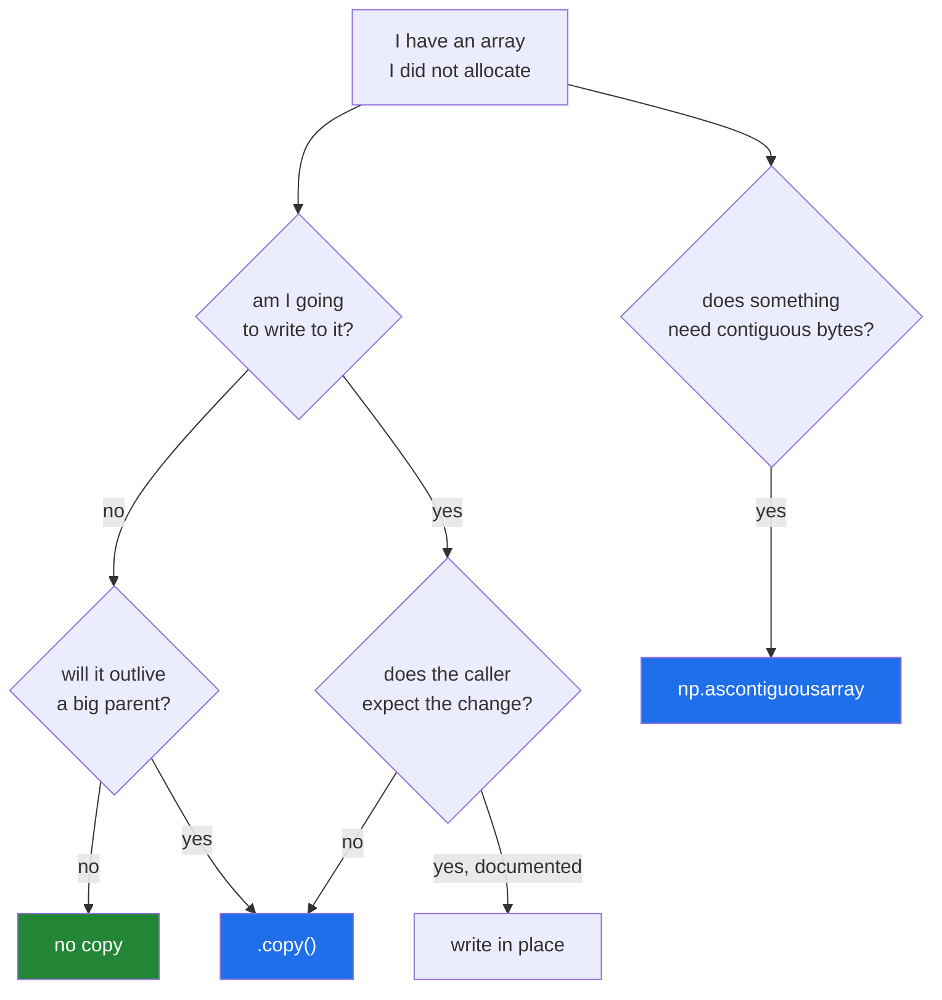

# 2.3 — `.copy()` — and the four times it is worth paying for

## One-line answer

`.copy()` allocates a new block and duplicates the values, which costs time and memory in proportion
to the array — so you pay for it deliberately, in four situations, rather than sprinkling it
everywhere or nowhere.

---

## The story

Somebody borrows a recipe book from a neighbour.

They want to change the recipe — less salt, more garlic — so they photocopy the page and write on
the photocopy. The neighbour's book stays as it was. That is a copy, and it cost a sheet of paper
and a walk to the machine.

The next week they borrow the book again, just to read a cooking time. They do not photocopy
anything. They read the number and give the book back.

The week after that, they borrow it and keep it on the shelf for a year "in case it is useful". Now
the neighbour has no recipe book, because of one page somebody wanted.

Three borrowings, and only the first one needed a photocopy. The second was fine as it was. The
third needed one for a completely different reason — not to protect the original from changes, but
to let the neighbour have their book back.

---

## The idea in plain language

`arr.copy()` allocates a new block the size of the array and duplicates every value. It is O(n) in
time and O(n) in memory, and there is no cleverness available: the numbers have to be written
somewhere.

So it is a cost, and the question is when to pay it. There are exactly four answers.

**One: you are about to write, and you did not allocate the array.** This is the common one. A
function that receives an array and modifies it is modifying the caller's data
([2.1](2.1-a-slice-does-not-copy.md)). Copying first makes the function safe to call.

**Two: a small piece is going to outlive a big parent.** A view keeps its whole parent alive
([1.3](../01-one-element/1.3-slicing-one-axis.md)). If you load a 4 GB file, take ten rows, and
return them, those ten rows pin 4 GB for as long as anything holds them. `.copy()` at the point of
return releases the rest. This is the recipe book on the shelf for a year.

**Three: you need contiguous memory and the view is not.** A reversed or strided view will be copied
by the first operation that requires contiguity anyway
([1.5](../01-one-element/1.5-the-step-and-the-reverse.md)), so copying deliberately at least puts
the cost where you can see it. `np.ascontiguousarray` is the named version of this.

**Four: the parent is about to change and you want the values as they are now.** A snapshot. This is
the mirror of case one — not protecting the parent from you, but protecting yourself from the
parent.

And the situations where you should **not** copy: reading, reducing, or passing to something that
only reads. `arr[1:3].sum()` needs no copy and copying would double the work for nothing.

Three related tools, since `.copy()` is not always the right shape of answer:

- **`np.ascontiguousarray(arr)`** — copies only if the array is not already C-contiguous. The right
  call for case three, because it is free when the copy is unnecessary.
- **`arr.flags.writeable = False`** — makes a view read-only instead of copying it. Zero cost, and it
  converts an accidental write into a `ValueError`
  ([2.2](2.2-how-to-tell-base-and-shares-memory.md)). The right answer when the caller only needs to
  read.
- **`np.copyto(dst, src)`** — copies values into an array you already have, without allocating. The
  right answer inside a loop where the destination is reused.

One note on the `order=` argument. `.copy()` takes `order="C"` (rows contiguous, the default),
`"F"` (columns contiguous) or `"K"` (match the source as closely as possible). It matters only when
the next operation is layout-sensitive, and `"C"` is right until you have measured otherwise.

**`.copy()` is shallow in the sense that matters here and deep in the sense you would expect.** For a
numeric array there is nothing to be shallow about — the values *are* the array. For a
`dtype=object` array the copy duplicates the pointers and not the objects, which is the same
distinction as
[Day 4, 2.4](../../../day-04-objects/parts/02-containers/2.4-shallow-and-deep-copy.md). Object arrays
are rare and this is the one place the distinction bites.

---

## Why Setu needs it

- **Principle 8's leakage rule is enforced by a `.copy()`** on Day 42's split, and
  [5.1](../05-in-anger/5.1-the-leak-a-view-causes.md) is what happens without it.
- **Day 44's transformers copy on entry**, which is why calling one twice gives the same answer
  twice.
- **Day 130's data loader copies each batch before augmenting it**, and skipping that copy corrupts
  the training set one epoch at a time.
- **Day 226 sizes a service's memory.** A cache of views that each pin a large parent is the most
  common way a Python service's memory grows without a leak.

---

## The mechanism

What a copy costs, measured.

```python
import time

import numpy as np

data = np.random.default_rng(20).random((5_000, 1_000))
data.sum()

start = time.perf_counter()
view = data[1000:2000]
view_time = time.perf_counter() - start

start = time.perf_counter()
copied = data[1000:2000].copy()
copy_time = time.perf_counter() - start

print(f"parent        : {data.nbytes:>12,} bytes")
print(f"slice (view)  : {view.nbytes:>12,} bytes, {view_time * 1e6:8.1f} us")
print(f"slice (copy)  : {copied.nbytes:>12,} bytes, {copy_time * 1e6:8.1f} us")
print(f"view keeps    : {view.base.nbytes:>12,} bytes alive")
print(f"copy keeps    : {0:>12,} bytes alive")
```

**Line by line:**

- `data.sum()` before timing — the warm-up
  ([Day 20, 1.4](../../../day-20-arrays-and-dtypes/parts/01-the-block/1.4-a-million-floats-measured.md)).
- `data[1000:2000]` — a thousand rows as a view. **Constant time**: it builds a small object and
  touches no data.
- `.copy()` — the same thousand rows, duplicated. Time proportional to 8 MB of copying.
- `view.base.nbytes` — the parent the view keeps alive. **40 MB held for 8 MB of interest**, which is
  case two above.
- `copy` keeps nothing alive, which is the whole reason to pay.

```text
parent        :   40,000,000 bytes
slice (view)  :    8,000,000 bytes,      8.4 us
slice (copy)  :    8,000,000 bytes,   2147.3 us
view keeps    :   40,000,000 bytes alive
copy keeps    :            0 bytes alive
```

**Eight microseconds against two milliseconds** — a factor of about 250, and the gap grows with the
array because only one of the two does work proportional to the data. That is the price, and it is
why the default is a view.

Now the four situations, each with its right answer:

```python
import numpy as np


def case_one_will_write(values: np.ndarray) -> np.ndarray:
    """About to modify an array I did not allocate: copy."""
    out = values.copy()
    out -= out.min()
    return out


def case_two_outlives_parent(big: np.ndarray) -> np.ndarray:
    """A small piece leaving a big parent behind: copy."""
    return big[:10].copy()


def case_three_needs_contiguous(values: np.ndarray) -> bytes:
    """Something downstream demands contiguous memory: ascontiguousarray."""
    return np.ascontiguousarray(values).tobytes()


def case_four_snapshot(live: np.ndarray) -> np.ndarray:
    """The parent is about to change and I want today's numbers: copy."""
    return live.copy()


def not_a_case(values: np.ndarray) -> float:
    """Only reading: no copy."""
    return float(values.mean())
```

**Line by line:**

- `case_one_will_write` — `out = values.copy()` **then** `out -= ...`. The order matters: copy first,
  mutate second. Writing `values -= values.min()` and then copying would be too late.
- `case_two_outlives_parent` — `big[:10].copy()` rather than `big[:10]`. Ten rows out and the parent
  free to be collected.
- `case_three_needs_contiguous` — `np.ascontiguousarray` rather than `.copy()`, because it is **free
  when the input is already contiguous** and only copies when it must.
- `case_four_snapshot` — no argument about ownership; the caller wants the values frozen at this
  moment.
- `not_a_case` — the majority of functions. `.mean()` reads and reduces, so a copy would be pure
  waste. **Adding `.copy()` to a read-only function is the most common over-correction** after
  learning about views.

The decision:



And the two alternatives to copying, when the caller only needs to read:

```python
import numpy as np

data = np.arange(12).reshape(3, 4)

readonly = data.view()
readonly.flags.writeable = False

destination = np.empty_like(data)
np.copyto(destination, data)

print("readonly shares  :", np.shares_memory(data, readonly))
print("readonly nbytes  :", readonly.nbytes, "extra bytes allocated: 0")
print("copyto shares    :", np.shares_memory(data, destination))
print("ascontig on C arr:", np.shares_memory(data, np.ascontiguousarray(data)))
print("ascontig on T    :", np.shares_memory(data, np.ascontiguousarray(data.T)))
```

**Line by line:**

- `data.view()` — a new array object over the same block, no change of shape. It exists so the flag
  can be cleared on the view without touching `data`.
- `readonly.flags.writeable = False` — **zero-cost protection.** The caller can read every value and
  cannot write one, and no memory was allocated.
- `np.copyto(destination, data)` — copies values into an array that already exists. In a loop that
  reuses one buffer, this replaces one allocation per iteration with none.
- `np.ascontiguousarray(data)` — `data` is already C-contiguous, so it is **returned unchanged**:
  `shares_memory` is `True` and nothing was copied.
- `np.ascontiguousarray(data.T)` — the transpose is not C-contiguous, so this one does copy:
  `shares_memory` is `False`. **Same call, two behaviours, decided by the input** — which is exactly
  what you want from it.

```text
readonly shares  : True
readonly nbytes  : 96 extra bytes allocated: 0
copyto shares    : False
ascontig on C arr: True
ascontig on T    : False
```

---

## When it breaks

**Copying too late:**

```text
$ uv run python -c "
import numpy as np

def wrong(values):
    values -= values.min()
    return values.copy()

data = np.array([[10.0, 20.0], [30.0, 40.0]])
row = data[0]
result = wrong(row)
print('result :', result)
print('data   :', data.tolist())
"
result : [ 0. 10.]
data   : [[0.0, 10.0], [30.0, 40.0]]
```

**What it means.** The copy happened after the damage. `values -= values.min()` wrote into the
caller's array on the first line, and copying the result afterwards protected nothing. **The copy
belongs before the first write**, and reading the function top to bottom is enough to see it once
you know to look.

**Copying in a loop:**

```text
$ uv run python -c "
import time
import numpy as np
data = np.random.default_rng(20).random((2000, 500))
data.sum()
start = time.perf_counter()
total = 0.0
for i in range(0, 2000, 100):
    batch = data[i:i+100].copy()
    total += batch.sum()
copied = time.perf_counter() - start
start = time.perf_counter()
total2 = 0.0
for i in range(0, 2000, 100):
    batch = data[i:i+100]
    total2 += batch.sum()
viewed = time.perf_counter() - start
print(f'with .copy() : {copied * 1000:7.2f} ms')
print(f'views only   : {viewed * 1000:7.2f} ms')
print(f'ratio        : {copied / viewed:7.1f}x')
print('same answer  :', np.isclose(total, total2))
"
with .copy() :    1.03 ms
views only   :    0.86 ms
ratio        :     1.2x
same answer  : True
```

**What it means.** The loop only sums, so every one of those copies is wasted work. Note the ratio is
modest — 1.2× here, because the summing dominates — and that is exactly what makes this
over-correction stick around: it is never bad enough to notice, only bad enough to pay for forever.
On a pipeline of ten such stages the same 20% appears ten times. **Copy where you write; never where
you only read.**

**A copy that was not deep enough:**

```text
$ uv run python -c "
import numpy as np
inner = [1, 2, 3]
objects = np.array([inner, 'text'], dtype=object)
duplicate = objects.copy()
duplicate[0].append(4)
print('duplicate[0] :', duplicate[0])
print('objects[0]   :', objects[0])
print('shares memory:', np.shares_memory(objects, duplicate))
"
duplicate[0] : [1, 2, 3, 4]
objects[0]   : [1, 2, 3, 4]
shares memory: False
```

**What it means.** The arrays do not share memory — the *pointers* were duplicated — but both
pointers point at the same Python list, so modifying it through one shows through the other. This is
exactly
[Day 4, 2.4](../../../day-04-objects/parts/02-containers/2.4-shallow-and-deep-copy.md)'s shallow
copy, and it only arises for `dtype=object` arrays. For any numeric dtype there are no inner objects
and `.copy()` is complete. `copy.deepcopy` is the answer if you genuinely need one, and needing one
usually means the object array was the wrong structure.

**A memory-mapped array copied by accident:**

```text
$ uv run python -c "
import numpy as np
import tempfile, os
path = os.path.join(tempfile.mkdtemp(), 'big.npy')
np.save(path, np.arange(1_000_000, dtype=np.float64))
mapped = np.load(path, mmap_mode='r')
print('type        :', type(mapped).__name__)
print('writeable   :', mapped.flags['WRITEABLE'])
first = mapped[:10]
print('slice type  :', type(first).__name__)
print('slice shares:', np.shares_memory(mapped, first))
copied = mapped[:10].copy()
print('copy type   :', type(copied).__name__)
print('copy shares :', np.shares_memory(mapped, copied))
"
type        : memmap
writeable   : False
slice type  : memmap
slice shares: True
copy type   : memmap
copy shares : False
```

**What it means.** A memory-mapped array is not loaded into RAM; it is a window onto a file, and a
slice of it is still a `memmap` sharing that window. `.copy()` allocates real memory and fills it —
`shares_memory` is `False`, so the values are genuinely independent — while the returned object keeps
the `memmap` class, which is why `type()` alone will not tell you whether you are still on disk.
Copying is right for a small piece and catastrophic for a large one: `mapped.copy()` on a 40 GB file
tries to allocate 40 GB, and the process is killed with no traceback. **Check `nbytes` before copying
anything you did not allocate.**

---

## In production

**What a professional writes instead of the teaching version.** They make the copy decision once, at
the top of a function, and they say which of the four cases it is:

```python
import numpy as np


def standardise(features: np.ndarray, *, inplace: bool = False) -> np.ndarray:
    """Centre and scale each column.

    With inplace=False (the default) the caller's array is untouched — the copy is case one.
    With inplace=True the caller has said they own the array and want the memory saved.
    """
    if features.ndim != 2:
        raise ValueError(f"expected a 2-D table, got shape {features.shape}")
    out = features if inplace else features.copy()
    if inplace and out.base is not None:
        raise ValueError("inplace=True on a view would modify the parent array")
    means = out.mean(axis=0)
    spreads = out.std(axis=0, ddof=1)
    spreads[spreads == 0] = 1.0
    out -= means
    out /= spreads
    return out
```

**Line by line:**

- `*, inplace: bool = False` — keyword-only, defaulting to the safe behaviour. **The default is the
  copy**, so the dangerous version has to be asked for by name at the call site, where a reviewer
  sees it. [2.1](2.1-a-slice-does-not-copy.md)'s production section argued for two functions instead;
  a flag is acceptable when the function is long and the two would duplicate real code, and the cost
  is that the call site must be read carefully.
- `out = features if inplace else features.copy()` — one line, one decision, **before any write**.
- `if inplace and out.base is not None: raise` — the guard from
  [2.2](2.2-how-to-tell-base-and-shares-memory.md). `inplace=True` on a view is almost always a
  mistake, and this turns it into a message rather than a corrupted parent array.
- `spreads[spreads == 0] = 1.0` — a constant column has zero spread and would divide to `inf`.
  Assignment through a boolean mask ([3.4](../03-boolean-masks/3.4-assigning-through-a-mask.md)) is
  the one-line fix, and setting the divisor to 1 leaves such a column at zero after centring, which
  is the honest answer.
- `out -= means` and `out /= spreads` — in place, deliberately, on an array this function now owns.
  This is where `inplace=True` earns its memory saving: no temporaries.
- `ddof=1` — the sample standard deviation, stated rather than inherited (Principle 4).

**What changes at scale.** The copy stops being a rounding error. On a 4 GB feature matrix, a
copy-on-entry needs a second 4 GB while both exist, so the peak is 8 GB for a job that "uses 4". At
that size the pipeline is restructured: copy once at the very top, then work in place through every
stage, with a comment at the boundary saying the array is owned from here down.

The second scale effect is the pinned-parent problem, and it is the one that surprises people.
Views are free and they are not free of consequences: a service that caches a small slice of each
large array it processes will hold every one of those arrays forever. There is no leak, nothing is
unreachable, and memory only grows. `.copy()` on the way into a cache is the fix, and it is the
clearest case where paying for the copy saves orders of magnitude.

**The failure that only appears with real data.** A preprocessing function that copied on entry and
ran fine for a year on 200 MB batches. The data grew to 3 GB per batch, the copy pushed peak memory
to 6 GB, and the job started being killed by the container's memory limit — with no traceback,
because the kernel does not raise. Nothing in the code had changed. The fix was `inplace=True` plus
a documented ownership boundary, and the bug was invisible in every test because the tests used
small fixtures.

**The review comment a senior engineer leaves.** *"`return rows[:100]` returns a view of the 6 GB
array this function loaded, so the whole thing stays in memory as long as anyone holds those hundred
rows. Add `.copy()` — a hundred rows is nothing and it lets the rest go."*

**The interview question.** *"When do you call `.copy()` on a NumPy array?"* When you are about to
write to an array you did not allocate; when a small view is going to outlive a large parent, because
a view keeps the whole parent alive; when something downstream needs contiguous memory — and there
`np.ascontiguousarray` is better, because it is free when no copy is needed; and when you want a
snapshot of values that are about to change. The other half of the answer matters just as much:
**not** when you are only reading, because copying then doubles the memory traffic for nothing. The
detail that shows experience is `arr.flags.writeable = False`, which protects a shared array from
accidental writes at zero cost, and is the right answer when the caller only needs read access.

---

## Check yourself

```bash
uv run python -c "
import numpy as np
big = np.zeros((2000, 2000))
view = big[:10]
copied = big[:10].copy()
del big
print('view keeps  :', f'{view.base.nbytes:,}', 'bytes alive')
print('copy keeps  :', 'nothing, base is', copied.base)
print('same values :', np.array_equal(view, copied))
"
```

Two arrays holding the same 160 kilobytes. One of them is also holding 32 megabytes.

**Answer out loud, without scrolling up:**

> Name the four situations where a `.copy()` is worth paying for. Then say the one situation where
> adding `.copy()` makes the code slower and no safer.

---

**Next:** [2.4 — the function that changed its input](2.4-the-function-that-changed-its-input.md).
