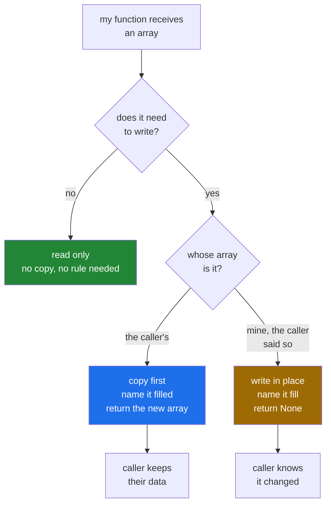

# 2.4 — The function that changed its input — and how to write one that cannot

## One-line answer

A function that writes to the array it was handed changes the caller's data, and because a slice is
a view ([2.1](2.1-a-slice-does-not-copy.md)) the damage can reach an array the caller never passed
in — so a function must either return a new array and never write, or write and return nothing, and
say which in its name.

---

## The story

Two people share a flat and a shopping list on the fridge.

One of them takes the list to the shop. At the shop they cross off what they bought, add "bin bags"
at the bottom, and rewrite the whole thing in neater handwriting, because the first three lines were
smudged.

They come home. The other person looks at the fridge and cannot find the note they wrote that
morning. It said "the small bottle of the blue one, not the big one". It is gone, because the list
was rewritten and that line looked like a smudge.

Nobody did anything wrong on purpose. One person thought they had borrowed the list. The other
thought the list was still theirs. The list itself said nothing about which it was.

The fix in a flat is a habit. You take a photo and cross things off the photo, or you say out loud
"I am taking the list and I will bring it back changed". The fix in code is the same habit, written
down.

---

## The idea in plain language

When you call a function and pass it an array, you hand over a way of reaching your data. Python
does not copy an argument on the way in. You met that on
[Day 4, 2.2](../../../day-04-objects/parts/02-containers/2.2-what-in-place-means.md),
where a list changed inside a function stayed changed outside it. Arrays behave the same way, with
one extra edge. Because a slice is a view, the array you passed may itself be a window onto a bigger
array, so a write inside the function can appear in a third array that was never mentioned at the
call site.

There are exactly two honest shapes for such a function.

**Shape one: it returns a new array and never writes to its input.** The caller keeps their data.
The cost is one copy. This is `np.sort(arr)`, which hands back a sorted copy and leaves `arr` alone.

**Shape two: it writes to the array it was given, and returns `None`.** The caller has asked for the
change and knows they are giving up the old values. The saving is the copy. This is `arr.sort()`,
which sorts in place and returns nothing at all.

The important word in shape two is `None`. A function that writes to its input **and** returns it
looks exactly like shape one at the call site, and that is how the flatmate lost their note. Read
this line cold:

```
fixed = drop_the_zero_day(week_one)
```

It looks as though `fixed` is new and `week_one` is safe. If the function wrote in place and
returned its argument, both names are the same array, and `week_one` was changed the moment the call
ran. Returning `None` makes that line read `fixed = None`, and the next use of `fixed` fails loudly
instead of quietly lying.

Three terms, since they come up in every discussion of this.

**In place** means the function writes into memory that already exists rather than allocating new
memory. `arr += 1` is in place. `arr = arr + 1` builds a new array and points the name at it.

**Ownership** is the question of who is allowed to write to an array. NumPy does not track it, so it
lives in your function's name and its docstring. Every array has one owner at a time, and handing an
array to a function either lends it, in which case the function may only read, or gives it away, in
which case the function may write.

**Defensive copy** means copying on the way in so that ownership never has to be discussed. It is
correct, and it is not free. [2.3](2.3-copy-and-when-to-pay.md) is the whole argument about when to
pay for one.

---

## Why Setu needs it

- **Day 44's scikit-learn transformers** follow shape one: `fit_transform` returns a new array. The
  ones that offer `copy=False` say so in the signature, which is the naming rule below wearing
  different clothes.
- **Day 76's feature engineering** passes column views between steps. A step that writes in place
  changes the training matrix under the step before it, and the model that comes out is not the
  model you think you trained.
- **Day 130's data loader** hands each batch to an augmentation function. If that function writes in
  place, the augmentation is permanent, and the second pass over the data trains on the first pass's
  distortions.
- **Day 226 reviews a service** where a request handler received a cached array and modified it. The
  next request read the modified cache, and the bug only appeared with two users at once.

---

## The mechanism

Here is the real mistake, in the order people actually make it. A helper fills in the day the phone
spent on the charger, and it is called on one week of the month.

```python
import numpy as np

month = np.array(
    [
        [8213, 10442, 6180, 0, 12007, 9631, 7204],
        [7788, 9120, 11345, 8402, 6733, 14210, 5096],
        [9004, 8765, 7621, 10188, 9950, 8317, 11002],
        [6540, 12488, 9873, 7106, 8899, 10540, 9218],
    ]
)


def drop_the_zero_day(counts: np.ndarray) -> np.ndarray:
    """Replace a not-recorded day with the week's own average."""
    recorded = counts[counts > 0]
    counts[counts == 0] = recorded.mean()
    return counts


week_one = month[0]
fixed = drop_the_zero_day(week_one)
print("returned :", fixed)
print("month[0] :", month[0])
print("same obj :", fixed is week_one)
```

**Line by line:**

- `week_one = month[0]` — one whole number as the index, so this is a view of the first row
  ([1.2](../01-one-element/1.2-the-comma-a-list-cannot-do.md)). No copy has happened, and this is
  the line that turns a local mistake into a global one.
- `counts[counts > 0]` — selecting with a condition, which is section 3's subject
  ([3.2](../03-boolean-masks/3.2-indexing-with-a-mask.md)). All you need here is that it hands back
  the recorded days, so `.mean()` has something honest to average.
- `counts[counts == 0] = recorded.mean()` — **the write.** It is one line in the middle of a helper,
  and it lands in `month`, which this function has never heard of.
- `return counts` — the line that makes the bug invisible. The function returns the same array it was
  given, so the call site reads like shape one and behaves like shape two.
- `fixed is week_one` — `is` asks whether two names point at one object
  ([Day 4, 2.3](../../../day-04-objects/parts/02-containers/2.3-aliasing-two-names-one-object.md)).
  `True` here is the whole bug in one word.

```text
returned : [ 8213 10442  6180  8946 12007  9631  7204]
month[0] : [ 8213 10442  6180  8946 12007  9631  7204]
same obj : True
```

Thursday's `0` became `8946` inside `month`, and nobody asked for that. An average over six days was
written back as though it were a measurement, which is a second problem for another day. The one
that matters here is that `month` changed at all.

Now the same job, written both honest ways:

```python
import numpy as np

month = np.array(
    [
        [8213, 10442, 6180, 0, 12007, 9631, 7204],
        [7788, 9120, 11345, 8402, 6733, 14210, 5096],
        [9004, 8765, 7621, 10188, 9950, 8317, 11002],
        [6540, 12488, 9873, 7106, 8899, 10540, 9218],
    ]
)


def filled(counts: np.ndarray) -> np.ndarray:
    """Return a new array with each not-recorded day replaced. The input is untouched."""
    out = counts.copy()
    out[out == 0] = out[out > 0].mean()
    return out


def fill(counts: np.ndarray) -> None:
    """Replace each not-recorded day, writing into the caller's array. Returns nothing."""
    counts[counts == 0] = counts[counts > 0].mean()


before = month[0].copy()
new = filled(month[0])
print("filled  -> returned :", new)
print("filled  -> month[0] :", month[0])
print("untouched           :", np.array_equal(month[0], before))

fill(month[0])
print("fill    -> month[0] :", month[0])
```

**Line by line:**

- `def filled(...) -> np.ndarray:` — the name is a past participle. The thing it hands back is
  already filled: `filled`, `sorted`, `reversed`, `normalised`. English is doing real work here.
- `out = counts.copy()` — the copy is the **first** line of the body, before any write. Copying after
  a write protects nothing, which is [2.3](2.3-copy-and-when-to-pay.md)'s first failure.
- `def fill(...) -> None:` — the name is an imperative verb. It tells the array to change: `fill`,
  `sort`, `shuffle`. The `-> None` is not decoration; it is the promise that there is nothing worth
  assigning.
- `counts[counts == 0] = ...` — the same write as before. Here it is expected, because the caller
  typed the imperative name.
- `np.array_equal(month[0], before)` — the check that `filled` really did leave the caller alone.
  That assertion belongs in a test, and section 5 puts it in one.

```text
filled  -> returned : [ 8213 10442  6180  8946 12007  9631  7204]
filled  -> month[0] : [ 8213 10442  6180     0 12007  9631  7204]
untouched           : True
fill    -> month[0] : [ 8213 10442  6180  8946 12007  9631  7204]
```

NumPy names its own functions by this rule, and once you have seen it you can read the library's
intent straight off the call:

```python
import numpy as np

week = np.array([8213, 10442, 6180, 0, 12007, 9631, 7204])

copy_sorted = np.sort(week)
print("np.sort returns :", copy_sorted)
print("week unchanged  :", week)
print("arr.sort() gives:", week.sort())
print("week now        :", week)
```

**Line by line:**

- `np.sort(week)` — the free function returns a new sorted array. Free functions in NumPy return a
  result; they do not write to their arguments.
- `week.sort()` — the method sorts in place. Methods that change the array return `None`, and
  printing that `None` is the entire point of the third line.
- `print(..., week.sort())` — prints `None`, because that is what the call gives you. If you have
  ever written `week = week.sort()` and ended up with nothing, this is why.
- The last line prints `week` **after** the method ran, so the sorted values show up there and not in
  the returned value.

```text
np.sort returns : [    0  6180  7204  8213  9631 10442 12007]
week unchanged  : [ 8213 10442  6180     0 12007  9631  7204]
arr.sort() gives: None
week now        : [    0  6180  7204  8213  9631 10442 12007]
```

The convention, as a decision:



---

## When it breaks

**The write that was refused, which is the good outcome:**

```text
$ uv run python -c "
import numpy as np
month = np.arange(28).reshape(4, 7)
week = month[0]
week.flags.writeable = False
week[3] = 0
"
Traceback (most recent call last):
  File "<string>", line 6, in <module>
    week[3] = 0
    ~~~~^^^
ValueError: assignment destination is read-only
```

**What it means.** The view was marked read-only before it was handed out
([2.2](2.2-how-to-tell-base-and-shares-memory.md)), so the write that would have reached `month`
raised instead. Read this error as *"a function tried to write to an array it was only lent"*. The
fix is either to copy inside that function, or to stop setting the flag because the write was
intended all along. Setting the flag costs nothing, and it converts the silent version of this bug
into three lines of traceback.

**The in-place operator that will not narrow:**

```text
$ uv run python -c "
import numpy as np
month = np.arange(28).reshape(4, 7)
month[0] += 0.5
"
Traceback (most recent call last):
  File "<string>", line 4, in <module>
numpy._core._exceptions._UFuncOutputCastingError: Cannot cast ufunc 'add' output from dtype('float64') to dtype('int64') with casting rule 'same_kind'
```

**What it means.** `+=` writes the result back into the block that already exists, and that block
holds integers. Adding `0.5` produces floats, and NumPy refuses to throw the fraction away without
being asked. The message names the rule it applied, `same_kind`, which permits `float64` to
`float32` and forbids float to integer. The fix is to decide out loud: `month = month + 0.5`
allocates a new float array and points the name at it, while
`month[0] = (month[0] + 0.5).astype(month.dtype)` says "yes, truncate" in a line a reviewer can see.
**`+=` is not shorthand for `= ... +`.** It is a different operation with a different failure, and
this is the error that teaches it.

**The `out=` that does not fit:**

```text
$ uv run python -c "
import numpy as np
month = np.arange(28).reshape(4, 7)
out = np.empty(7, dtype=np.int64)
np.multiply(month, 2, out=out)
"
Traceback (most recent call last):
  File "<string>", line 5, in <module>
ValueError: non-broadcastable output operand with shape (7,) doesn't match the broadcast shape (4,7)
```

**What it means.** `out=` is NumPy's own version of shape two. It writes the result into an array you
supply instead of allocating one, so the destination has to be the right shape, and here it is one
week where the result is four. The word `non-broadcastable` points at
[Day 22, 1.2](../../../day-22-broadcasting-and-shape/parts/01-broadcasting/1.2-the-rule-in-three-lines.md):
NumPy will happily stretch a `(7,)` input up to `(4, 7)`, and it will never stretch an output,
because there is nowhere to put the extra rows.

**The silent one, which has no error text at all.** The first block in the mechanism is the whole
failure. `month` changed, nothing was raised, nothing was printed in red, and the returned array
looked new. There is no traceback to search for. That is why the naming convention exists: the only
defence against a failure with no message is a habit that prevents it.

---

## In production

**What a professional writes instead of the teaching version.** They make shape one the default and
offer shape two through an explicit `out=` parameter, exactly as NumPy does:

```python
import numpy as np


def fill_missing(counts: np.ndarray, *, out: np.ndarray | None = None) -> np.ndarray:
    """Replace not-recorded days with the mean of the recorded ones.

    The caller's array is never written to unless they pass it as ``out``.
    """
    if counts.ndim != 1:
        raise ValueError(f"expected one week of counts, got shape {counts.shape}")
    if out is None:
        out = np.empty_like(counts)
    elif out.shape != counts.shape:
        raise ValueError(f"out has shape {out.shape}, expected {counts.shape}")
    recorded = counts > 0
    if not recorded.any():
        raise ValueError("no recorded days: nothing to average")
    np.copyto(out, counts)
    out[~recorded] = counts[recorded].mean()
    return out
```

**Line by line:**

- `*, out: np.ndarray | None = None` — keyword-only
  ([Day 10, 1.5](../../../day-10-functions/parts/01-the-signature/1.5-keyword-only-and-positional-only.md)),
  so the destructive behaviour has to be typed by name at the call site. `fill_missing(week, week)`
  would be an accident waiting to happen. `fill_missing(week, out=week)` is a decision a reviewer
  can see.
- `if counts.ndim != 1: raise` — the shape check first, before anything is allocated. The message
  quotes the shape that actually arrived, because "expected one week" on its own tells the caller
  nothing about what they passed.
- `out = np.empty_like(counts)` — same shape, same dtype, no initialisation
  ([Day 20, 3.2](../../../day-20-arrays-and-dtypes/parts/03-creating/3.2-zeros-ones-full-and-empty.md)).
  `empty` is safe here **only** because the next lines write every element. Anywhere else it is the
  bug that prints somebody's leftover memory.
- `elif out.shape != counts.shape: raise` — checking the destination before writing, with our own
  message. Without it the failure would be NumPy's `non-broadcastable output operand`, which is
  accurate and says nothing about weeks or counts.
- `recorded = counts > 0` — the mask computed **once** and used three times. Writing `counts > 0` at
  each use is three passes over the data for one answer.
- `if not recorded.any(): raise` — the empty case. Without it, `counts[recorded].mean()` over an
  empty selection returns `nan` with a `RuntimeWarning`, and a `nan` written into a report is worse
  than a refusal ([3.5](../03-boolean-masks/3.5-the-mask-that-matched-nothing.md)).
- `np.copyto(out, counts)` — fills the destination from the source without allocating anything. When
  the caller passed `out=counts` this copies the array onto itself, which changes nothing and costs
  one pass. That is the price of having one code path instead of two.
- `out[~recorded] = ...` — `~` is elementwise `not`
  ([3.3](../03-boolean-masks/3.3-and-or-not-and-why-and-raises.md)), so the write touches only the
  missing days.
- `return out` — returning even in the `out=` case, which is NumPy's own convention for functions
  that take `out=`. It does not contradict the `-> None` rule: this function's default is shape one,
  and `out=` is the opt-in.

**What changes at scale.** Two things. First, the copy in shape one stops being free. On a 4 GB
feature matrix, copying on entry at every stage of a five-stage pipeline is five copies, and peak
memory is set by the largest two that exist at the same moment. Real pipelines copy once at the top
and then document an ownership boundary — *everything below this line owns its input* — rather than
copying at every door. Second, writing in place is what makes a training loop fit in memory at all,
so the rule inverts inside the loop: buffers are allocated once and written many times, and the
safety comes from the loop being small and reviewed rather than from copies.

**The failure that only appears with real data.** A cache of feature arrays keyed by user, and a
scoring function that normalised its input in place. With one request at a time nobody noticed,
because the second normalisation of an already-normalised array barely moves the numbers. With two
requests at once the same array was normalised twice in overlapping order, the values drifted, and
roughly one score in a thousand came back wrong. Every test passed, because a test calls the
function once.

**The review comment a senior engineer leaves.** *"This takes an array, writes to it, and returns
it. Either copy on entry and keep the return, or write in place and return `None` — as written, the
call site reads as if it is safe and it is not. Also, the caller here is passing `matrix[0]`, which
is a view, so this reaches the whole matrix."*

**The interview question.** *"You are given a function that takes a NumPy array. How do you decide
whether it is safe to pass a slice of your data to it?"* You read whether it writes. If it does, a
slice is a view, so the write reaches the parent, and you pass `matrix[0].copy()` instead. If the
function is not yours to read, the cheap defence is `arr.flags.writeable = False` on the view before
handing it over, which turns a write into `ValueError: assignment destination is read-only` rather
than a silent change. The answer that shows experience names the convention rather than the trick —
return a new array or return `None`, never both — and points out that NumPy's own split between
`np.sort` and `arr.sort()` is that convention, applied to itself.

---

## Check yourself

```bash
uv run python -c "
import numpy as np
month = np.arange(28).reshape(4, 7)


def looks_safe(counts):
    counts[0] = -1
    return counts


result = looks_safe(month[2])
print('result   :', result)
print('month[2] :', month[2])
print('same obj :', result is month[2])
print('month[2, 0] was 14, is now:', month[2, 0])
"
```

One array, three names for it, and a value that nothing you wrote ever assigned.

**Answer out loud, without scrolling up:**

> A function returns the array you passed it. What is the one question you must ask before using
> that return value, and what single change to the function would make the question unnecessary?

---

**Next:** [3.1 — a comparison makes an array](../03-boolean-masks/3.1-a-comparison-makes-an-array.md).
