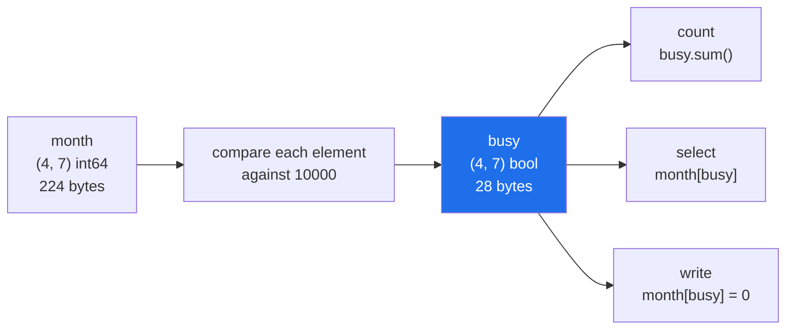

# 3.1 — `week > 10000` — a comparison makes an array of `True` and `False`

## One-line answer

Comparing an array with a number does not give you one answer; it gives you one answer **per
element** — a new array of `True` and `False` with the same shape as the original, called a **mask**.

---

## The story

Somebody is going through the month of step counts with a highlighter.

They are looking for the days they walked more than ten thousand steps. They do not stop at the
first one and announce "yes, there was a busy day". They go along every row, and where the number is
big enough they draw a stripe of yellow.

At the end they have not written down a single number. They have a sheet of paper with the same
twenty-eight boxes in the same places, and each box is either highlighted or it is not.

That sheet is useful in a way the answer "yes there was a busy day" never could be. They can count
the stripes. They can read off which days they were. They can lay the sheet over the original and
read only the highlighted numbers. And the sheet has the same layout as the month, so nothing has to
be lined up by hand.

The highlighting is the interesting step, and it happens before any of those questions are asked.

---

## The idea in plain language

You already know what `>` does to two numbers. `12007 > 10000` is `True`, and that `True` is one
answer. You met the comparison operators on
[Day 5, 1.3](../../../day-05-operators-and-conditionals/parts/01-operators/1.3-comparison-and-chaining.md).

An array changes the shape of the answer, not the question. `week > 10000` compares **every**
element against `10000` and returns an array of the same shape, holding one `True` or `False` per
element. That result is called a **mask** — a word borrowed from painting and photography, where a
mask is a sheet with holes in it that decides which parts of the surface get touched.

Four facts about a mask, and each one matters later.

**It has the same shape as the array it came from.** A `(4, 7)` month gives a `(4, 7)` mask. This is
what makes the highlighter sheet line up with the original.

**Its dtype is `bool`, and a `bool` element takes one byte.** Not one bit — one byte. A mask of a
million values costs a megabyte, which is real memory but eight times less than the `float64` values
it describes ([Day 20, 1.2](../../../day-20-arrays-and-dtypes/parts/01-the-block/1.2-shape-dtype-and-the-rest.md)).

**It is a new array, not a view.** The comparison allocated memory and filled it. Nothing about the
mask shares storage with the original, so changing the original afterwards does not update the mask.
A mask is a photograph of a condition at one moment, not a live query.

**`True` counts as 1 and `False` as 0 in arithmetic.** So `mask.sum()` is the number of matches, and
`mask.mean()` is the fraction that matched. That is not a trick; `bool` is a numeric type in NumPy
just as it is in Python
([Day 4, 1.3](../../../day-04-objects/parts/01-objects/1.3-numbers-and-bool.md)).

All the comparison operators work this way — `>`, `>=`, `<`, `<=`, `==`, `!=` — and so do the
functions that ask a question about each element, such as `np.isnan`. Every one of them takes an
array and gives back a mask.

The word **elementwise** is worth defining now, because the rest of NumPy uses it constantly. An
elementwise operation is one that is applied separately to each element, with the results collected
into an array of the same shape. `week * 2` is elementwise. `week > 10000` is elementwise. `week.sum()`
is not: it produces one number from many, and that is a **reduction**.

---

## Why Setu needs it

- **Day 23 builds `np.where`** — the vectorised `if` — and its first argument is a mask exactly like
  this one.
- **Day 30's Pandas filtering** is `frame[frame["steps"] > 10000]`, and the thing inside the brackets
  is a mask with an index attached. Everything you learn here transfers, including the traps.
- **Day 91 splits data into train and test** by building a mask of row positions. Principle 8's
  leakage rule is enforced by which mask is applied before which step.
- **Day 156 filters a vector store by metadata** before the similarity search runs, and that filter
  is a boolean array over the whole collection.
- **Day 76 counts missing values per column**, which is `np.isnan(matrix).sum(axis=0)` — a mask and
  a reduction, in that order.

---

## The mechanism

One week, one condition:

```python
import numpy as np

week = np.array([8213, 10442, 6180, 0, 12007, 9631, 7204])

busy = week > 10_000
print("week  :", week)
print("busy  :", busy)
print("dtype :", busy.dtype)
print("shape :", busy.shape)
print("bytes :", busy.nbytes, "vs", week.nbytes)
print("count :", busy.sum())
```

**Line by line:**

- `10_000` — underscores in a number literal are ignored by Python and exist purely so a human can
  see the thousands. `10000` and `10_000` are the same value.
- `week > 10_000` — the comparison. `week` has seven elements, `10_000` has one, and NumPy compares
  each element against that single number. This is the simplest case of the broadcasting rule that
  [Day 22, 1.2](../../../day-22-broadcasting-and-shape/parts/01-broadcasting/1.2-the-rule-in-three-lines.md)
  states in full.
- `busy.dtype` — `bool`, chosen by the comparison. You never ask for it and it is never anything
  else.
- `busy.nbytes` — 7 bytes for seven elements, against 56 for seven `int64` values. **One byte per
  element**, not one bit, because the smallest thing a NumPy array can address is a byte.
- `busy.sum()` — 2. Summing a boolean array counts the `True` values, because `True` is 1.

```text
week  : [ 8213 10442  6180     0 12007  9631  7204]
busy  : [False  True False False  True False False]
dtype : bool
shape : (7,)
bytes : 7 vs 56
count : 2
```

Now the whole month, which is where the shape rule earns its keep:

```python
import numpy as np

month = np.array(
    [
        [8213, 10442, 6180, 0, 12007, 9631, 7204],
        [7788, 9120, 11345, 8402, 6733, 14210, 5096],
        [9004, 8765, 7621, 10188, 9950, 8317, 11002],
        [6540, 12488, 9873, 7106, 8899, 10540, 9218],
    ]
)

busy = month > 10_000
print(busy)
print("shape   :", busy.shape)
print("per week:", busy.sum(axis=1))
print("any     :", busy.any())
print("all     :", busy.all())
print("view?   :", np.shares_memory(month, busy))
```

**Line by line:**

- `month > 10_000` — twenty-eight comparisons, one array back. There is no loop in the source and no
  loop in Python at runtime; the loop is inside NumPy, in C.
- `busy.shape` — `(4, 7)`, the same as `month`. The mask is the highlighter sheet, and it lines up
  with the original box for box.
- `busy.sum(axis=1)` — summing along axis 1 collapses the days and keeps the weeks, so this is
  "busy days per week". Which axis disappears is
  [Day 22, 1.4](../../../day-22-broadcasting-and-shape/parts/01-broadcasting/1.4-keepdims-and-the-column.md)'s
  subject; here read it as "sum across each row".
- `busy.any()` — `True` if at least one element is `True`. This is the question `if` wanted to ask,
  and asking it explicitly is what 3.3 is about.
- `busy.all()` — `True` only if every element is. Here it is `False`, because most days were under
  ten thousand.
- `np.shares_memory(month, busy)` — `False`. **The mask is a fresh array**, not a view
  ([2.2](../02-the-view-trap/2.2-how-to-tell-base-and-shares-memory.md)). Changing `month` after this
  line leaves `busy` describing the old values.

```text
[[False  True False False  True False False]
 [False False  True False False  True False]
 [False False False  True False False  True]
 [False  True False False False  True False]]
shape   : (4, 7)
per week: [2 2 2 2]
any     : True
all     : False
view?   : False
```

Two busy days in every week, which is the sort of pattern you would never have spotted by reading
twenty-eight numbers.

What actually happened, in order:



The mask is the middle step, and it is worth naming as its own variable rather than writing the
comparison inside every question. It is computed once, and each question is then one pass over one
byte per element instead of a fresh comparison over eight.

---

## When it breaks

**The comparison that has no matching shape:**

```text
$ uv run python -c "
import numpy as np
month = np.arange(28).reshape(4, 7)
print(month > np.array([1, 2, 3]))
"
Traceback (most recent call last):
  File "<string>", line 4, in <module>
ValueError: operands could not be broadcast together with shapes (4,7) (3,)
```

**What it means.** Comparing an array with another array compares them element against element, so
the shapes have to line up. Seven days against three numbers has no honest reading, and NumPy
refuses rather than guessing. The message prints both shapes, which is almost always enough to see
the mistake. The full rule for which shapes do line up is
[Day 22, 1.2](../../../day-22-broadcasting-and-shape/parts/01-broadcasting/1.2-the-rule-in-three-lines.md).

**The comparison against the wrong kind of thing:**

```text
$ uv run python -c "
import numpy as np
week = np.array([8213, 10442, 6180, 0, 12007, 9631, 7204])
print(week > '10000')
"
Traceback (most recent call last):
  File "<string>", line 4, in <module>
numpy._core._exceptions._UFuncNoLoopError: ufunc 'greater' did not contain a loop with signature matching types (<class 'numpy.dtypes.Int64DType'>, <class 'numpy.dtypes.StrDType'>) -> None
```

**What it means.** The message is written in NumPy's internal vocabulary, so read it from the end:
there is no rule for comparing an integer with a string. The usual cause is a threshold that came
from a text file, an environment variable or a form field and was never converted. `int(threshold)`
at the boundary is the fix, and the general habit — convert at the edge, never in the middle — is
[Day 19, 3.4](../../../day-19-typing-dataclasses-and-concurrency/parts/03-pydantic/3.4-model-dump-and-the-boundary.md).

**The comparison that finds nothing and raises nothing:**

```text
$ uv run python -c "
import numpy as np
week = np.array([8213.0, np.nan, 6180.0])
print('week == np.nan :', week == np.nan)
print('np.isnan(week) :', np.isnan(week))
"
week == np.nan : [False False False]
np.isnan(week) : [False  True False]
```

**What it means.** `nan` is not equal to anything, including itself
([Day 20, 2.3](../../../day-20-arrays-and-dtypes/parts/02-dtypes/2.3-floats-nan-and-precision.md)),
so a mask built with `== np.nan` is all `False` and a "drop the missing days" step drops nothing.
There is no error, no warning, and the result looks plausible. `np.isnan` is the only correct test,
and this is the single most expensive silent bug in this section.

---

## In production

**What a professional writes instead of the teaching version.** They name the mask, reuse it, and
count with the function built for counting:

```python
import time

import numpy as np

rng = np.random.default_rng(21)
steps = rng.integers(0, 20_000, size=10_000_000, dtype=np.int32)
steps.sum()

start = time.perf_counter()
mask = steps > 10_000
mask_time = time.perf_counter() - start

start = time.perf_counter()
by_sum = mask.sum()
sum_time = time.perf_counter() - start

start = time.perf_counter()
by_count = np.count_nonzero(mask)
count_time = time.perf_counter() - start

print(f"values       : {steps.nbytes:>12,} bytes")
print(f"mask         : {mask.nbytes:>12,} bytes, built in {mask_time * 1000:6.1f} ms")
print(f"mask.sum()   : {by_sum:>12,} in {sum_time * 1000:6.1f} ms")
print(f"count_nonzero: {by_count:>12,} in {count_time * 1000:6.1f} ms")
```

**Line by line:**

- `default_rng(21)` — a seeded generator, so this measurement is repeatable
  ([Day 20, 4.2](../../../day-20-arrays-and-dtypes/parts/04-random/4.2-the-seed-is-part-of-the-result.md)).
- `dtype=np.int32` — stated, not inferred. Ten million values at four bytes each is 40 MB, and at
  eight it would be 80 MB for no extra information.
- `steps.sum()` before the timing — the warm-up
  ([Day 20, 1.4](../../../day-20-arrays-and-dtypes/parts/01-the-block/1.4-a-million-floats-measured.md)).
  The first pass over a fresh array pays for page faults that have nothing to do with what is being
  measured.
- `mask = steps > 10_000` — **allocates 10 MB**, one byte per value. This is the number people are
  surprised by: a mask is not free, and a chain of five conditions written as five separate
  comparisons allocates five of them.
- `mask.sum()` — correct, and it adds ten million values into an `int64` accumulator.
- `np.count_nonzero(mask)` — the same answer by a different route. It counts bytes that are not zero
  and never does arithmetic, so it is the faster of the two by roughly a factor of ten here.

```text
values       :   40,000,000 bytes
mask         :   10,000,000 bytes, built in    3.9 ms
mask.sum()   :    4,999,382 in    6.9 ms
count_nonzero:    4,999,382 in    0.6 ms
```

**What changes at scale.** The mask stops being an implementation detail and becomes a line item.
On a 10 GB table, one boolean mask over every row is 1.25 GB, and code that writes
`table[table["a"] > 1][table["b"] > 2]` builds two of them plus an intermediate table. The
production shape is to combine the conditions into one mask before selecting anything
([3.3](3.3-and-or-not-and-why-and-raises.md)), and to prefer `np.count_nonzero` and
`np.flatnonzero` over `.sum()` and `.nonzero()[0]` when what you want is a count or the positions.
The other scale effect is that a mask is a snapshot: in a long pipeline, a mask computed at step one
and applied at step five describes the data as it was at step one, and if any step in between
changed the values, the mask is silently stale.

**The failure that only appears with real data.** A quality check that flagged rows where a sensor
read below zero, written as `readings < 0`. In testing every reading was a real number and the check
worked. In production the sensor occasionally reported `nan`, and `nan < 0` is `False`, so every
broken reading passed the check that existed to catch broken readings. The fix was one extra
condition, `np.isnan(readings) | (readings < 0)`, and the lesson is that with floating-point data
there are **three** outcomes to a comparison, not two: true, false, and "there was no number here".

**The review comment a senior engineer leaves.** *"`df[df.steps > 10000]` appears four times in this
function with four different thresholds. Compute each mask once, give it a name that says what it
means — `busy`, `missing`, `after_cutoff` — and combine the names. Right now the reader has to
re-derive the condition each time, and the machine recomputes it each time too."*

**The interview question.** *"What does `arr > 5` return, and what does it cost?"* It returns a new
boolean array of the same shape, one byte per element, computed in a single pass in C. It is not a
view, so it does not track later changes to `arr`, and it is not free: on a large array the mask
itself is a real allocation, which is why conditions get combined with `&` and `|` into one mask
rather than applied one after another. The follow-up that separates people who have used it is what
happens with `nan`: every comparison involving `nan` is `False`, including `nan != nan` being `True`,
so a filter written with `<` silently keeps or drops the missing values depending on which way it
points.

---

## Check yourself

```bash
uv run python -c "
import numpy as np
month = np.array([
    [8213, 10442, 6180, 0, 12007, 9631, 7204],
    [7788, 9120, 11345, 8402, 6733, 14210, 5096],
    [9004, 8765, 7621, 10188, 9950, 8317, 11002],
    [6540, 12488, 9873, 7106, 8899, 10540, 9218],
])
recorded = month > 0
print('mask dtype :', recorded.dtype)
print('mask bytes :', recorded.nbytes, 'vs values', month.nbytes)
print('recorded   :', np.count_nonzero(recorded), 'of', month.size)
print('fraction   :', recorded.mean())
"
```

Note that the last line averages `True` and `False` and gets a sensible number out. Say why.

**Answer out loud, without scrolling up:**

> `month > 10000` on a `(4, 7)` array of `int64`. What is the shape of the result, what is its dtype,
> how many bytes does it take, and does it share memory with `month`?

---

**Next:** [3.2 — indexing with a mask](3.2-indexing-with-a-mask.md).
