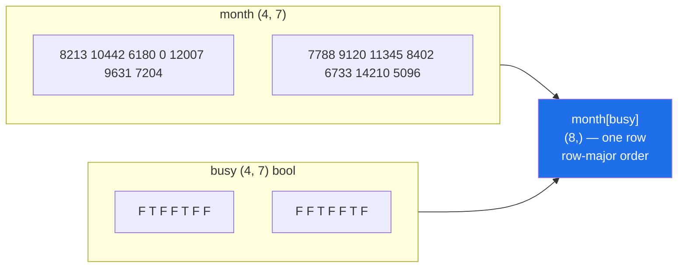

# 3.2 — `month[busy]` — indexing with a mask, and the copy it always makes

## One-line answer

Putting a boolean array inside the brackets keeps the elements where the mask is `True`, hands back
a **flat one-dimensional array** however many axes went in, and — unlike a slice — it always
**copies**.

---

## The story

Back to the highlighted month. The sheet with the yellow stripes is finished, and now somebody wants
the numbers themselves.

They lay the highlighter sheet over the original grid and copy out, onto a fresh line of paper, only
the numbers showing through the yellow. Left to right, top to bottom, one after another.

What they end up with is a single line of eight numbers. It is not a grid any more. There were two
highlighted days in week one and two in week two, and once the numbers are written in a row you
cannot tell where one week ended and the next began. Nobody minds, because the question was "which
days were the big ones", and the answer is a list.

Two things about that line of paper are worth noticing, because they are the whole part.

The first is that it is a new piece of paper. Crossing something out on it does nothing to the
original grid. The copying was real work — eight numbers, written by hand — and now there are two
independent things.

The second is that the shape is gone. A grid went in, a row came out, and no amount of staring at
the row will tell you which week each number came from.

---

## The idea in plain language

Everything you have put inside `[]` so far selects by **position**: a number, a slice, a comma
between axes. A mask selects by **condition** instead. You hand NumPy an array of `True` and `False`
with the same shape as the data, and it gives you back the elements where the mask said `True`.

This is called **boolean indexing**, and it is one of the two kinds of *advanced indexing* in NumPy.
The other kind, indexing with a list of positions, is section 4. Both share one property that
separates them from everything in sections 1 and 2:

**Advanced indexing always copies.** A slice is a view because the elements it names are evenly
spaced, so a shape and a stride can describe them
([Day 20, 1.3](../../../day-20-arrays-and-dtypes/parts/01-the-block/1.3-one-block-and-strides.md)).
The elements a mask names are wherever they happen to fall. There is no stride that lands on
`10442`, `12007`, `11345` and nothing in between, so NumPy has no choice: it allocates a new block
and copies the matching values into it.

That single fact explains the behaviours people find surprising.

**The result is one-dimensional.** A `(4, 7)` array with a `(4, 7)` mask gives a `(8,)` result,
because each row matched a different number of elements and no rectangle fits them. The values come
out in **row-major order** — all of row 0 left to right, then row 1, and so on — which is the order
they sit in memory.

**Writing to the result does not change the original.** `month[busy]` is a copy, so
`month[busy][0] = 0` changes a temporary array that is discarded on the next line. This is the one
place where the view trap runs backwards: people who have just learned that slices are views expect
this to write through, and it does not. Assigning **through** the mask — `month[busy] = 0` — does
write, and that is 3.4.

**The mask has to match the array along the axes it indexes.** A `(7,)` mask cannot select from a
`(4, 7)` array's first axis, because that axis has four entries and the mask has seven.

There is a second way to ask the same question, and it is worth knowing both. `np.flatnonzero(mask)`
gives the **positions** of the `True` values rather than the values themselves, and `np.nonzero(mask)`
gives one array of positions per axis. Positions are smaller than values when matches are rare, and
they can be reused against several arrays that share a shape, which values cannot.

---

## Why Setu needs it

- **Day 30's Pandas filtering** — `frame[frame["steps"] > 10000]` — is this operation with an index
  bolted on, and it copies for the same reason.
- **Day 76's outlier removal** selects the rows inside a range and hands the rest to a report. The
  copy is what stops the removal from changing the raw data.
- **Day 91's train/test split** builds a mask of rows and applies it twice, once with the mask and
  once with `~mask`. Principle 8 lives or dies on the fact that the two selections are copies and
  cannot leak into each other.
- **Day 156's metadata filter** in a vector store selects the candidate vectors before any distance
  is computed, which is exactly `vectors[allowed]`.
- **Day 130's class balancing** selects every row of one label, and the flattening rule is why it
  operates on row positions rather than on the two-dimensional data.

---

## The mechanism

The mask, then the values:

```python
import numpy as np

month = np.array(
    [
        [8213, 10442, 6180, 0, 12007, 9631, 7204],
        [7788, 9120, 11345, 8402, 6733, 14210, 5096],
        [9004, 8765, 7621, 10188, 9950, 8317, 11002],
        [6540, 12488, 9873, 7106, 8899, 10540, 9218],
    ]
)

busy = month > 10_000
picked = month[busy]
print("picked  :", picked)
print("shape   :", picked.shape, "from", month.shape)
print("copy?   :", np.shares_memory(month, picked))
print("base    :", picked.base)
print("mean    :", picked.mean())

week = month[0]
print("one week:", week[week > 10_000])
print("positions:", np.flatnonzero(busy))
rows, cols = np.nonzero(busy)
print("rows    :", rows)
print("cols    :", cols)
```

**Line by line:**

- `month[busy]` — the mask goes inside the brackets in the position where a number or a slice would
  go. NumPy sees a boolean array of matching shape and switches to boolean indexing.
- `picked.shape` — `(8,)`. **Two axes went in and one came out**, because the matches do not form a
  rectangle. This is the behaviour to expect, not an edge case.
- `np.shares_memory(month, picked)` — `False`, and `picked.base` is `None`. Both are the check from
  [2.2](../02-the-view-trap/2.2-how-to-tell-base-and-shares-memory.md), and both say the same thing:
  this is a new array that owns its data.
- `picked.mean()` — a reduction over the selected values only. The zero on Thursday is not in the
  selection, so it cannot drag the average down.
- `week[week > 10_000]` — the same operation one dimension down. The mask is built inline here, which
  is fine for a single use; name it when it is used more than once
  ([3.1](3.1-a-comparison-makes-an-array.md)).
- `np.flatnonzero(busy)` — the positions of the `True` values, counted as though the array were laid
  out in one long line. `1` is Tuesday of week one; `9` is day 9 of 28.
- `np.nonzero(busy)` — the same information split by axis: a tuple of one array per dimension, so
  `rows[0], cols[0]` is `(0, 1)`, the first match. Reading the two printed arrays down the columns
  gives every match as a coordinate pair.

```text
picked  : [10442 12007 11345 14210 10188 11002 12488 10540]
shape   : (8,) from (4, 7)
copy?   : False
base    : None
mean    : 11527.75
one week: [10442 12007]
positions: [ 1  4  9 12 17 20 22 26]
rows    : [0 0 1 1 2 2 3 3]
cols    : [1 4 2 5 3 6 1 5]
```

Where the flattening comes from, drawn:



Two `True` values in the first row, two in the second, and no rectangle that holds exactly those
four. A flat array is the only honest answer.

One more shape worth knowing, because it does **not** flatten. A mask over a single axis selects
whole rows:

```python
import numpy as np

month = np.array(
    [
        [8213, 10442, 6180, 0, 12007, 9631, 7204],
        [7788, 9120, 11345, 8402, 6733, 14210, 5096],
        [9004, 8765, 7621, 10188, 9950, 8317, 11002],
        [6540, 12488, 9873, 7106, 8899, 10540, 9218],
    ]
)

weekly_total = month.sum(axis=1)
good_weeks = weekly_total > 60_000
print("weekly totals :", weekly_total)
print("good weeks    :", good_weeks)
print("selected shape:", month[good_weeks].shape)
print(month[good_weeks])
```

**Line by line:**

- `month.sum(axis=1)` — one number per week, so this is a `(4,)` array. The days axis was consumed by
  the sum.
- `weekly_total > 60_000` — a `(4,)` mask, one entry per **row**, not per element.
- `month[good_weeks]` — a `(4,)` mask against a `(4, 7)` array indexes the first axis only, so whole
  rows are selected and the result keeps two dimensions. The shape is `(n_selected, 7)`.
- This is the pattern behind every "filter the rows of a table" operation you will write from Day 26
  onwards, and it is the reason a table filter keeps its columns.

```text
weekly totals : [53677 62694 64847 64664]
good weeks    : [False  True  True  True]
selected shape: (3, 7)
[[ 7788  9120 11345  8402  6733 14210  5096]
 [ 9004  8765  7621 10188  9950  8317 11002]
 [ 6540 12488  9873  7106  8899 10540  9218]]
```

Week one is out, because the day the phone spent on the charger cost it a whole day's steps.

---

## When it breaks

**The mask that is the wrong length:**

```text
$ uv run python -c "
import numpy as np
month = np.arange(28).reshape(4, 7)
week_mask = np.array([True, False, True, False, True, False, True])
print(month[week_mask])
"
Traceback (most recent call last):
  File "<string>", line 5, in <module>
IndexError: boolean index did not match indexed array along axis 0; size of axis is 4 but size of corresponding boolean axis is 7
```

**What it means.** A one-dimensional mask indexes the **first** axis, which here is weeks, and there
are four of them. A seven-element mask looks like a mask over days, and NumPy will not guess which
axis you meant. The message is unusually good: it names the axis, the size it has, and the size you
supplied. The fix is either `month[:, week_mask]`, which applies the mask to the days axis of every
week, or building the mask from the array itself so it cannot be the wrong shape.

**The mask that is not a mask:**

```text
$ uv run python -c "
import numpy as np
week = np.array([8213, 10442, 6180, 0, 12007, 9631, 7204])
mask = week > 10_000
print('bool mask :', week[mask])
print('int  mask :', week[mask.astype(int)])
"
bool mask : [10442 12007]
int  mask : [ 8213 10442  8213  8213 10442  8213  8213]
```

**What it means.** There is no error here at all, and that is the danger. `mask.astype(int)` turns
`[False, True, False, ...]` into `[0, 1, 0, ...]`, and an array of integers inside the brackets is
**fancy indexing** ([4.1](../04-fancy-indexing/4.1-a-list-of-positions.md)): NumPy reads them as
positions, returns element 0 for every `0` and element 1 for every `1`, and hands back seven values
in the shape of the index. Everything is legal, nothing is what you meant. The cause is almost
always a mask that has been through a file, a database column, or a `json.dumps`, and the fix is to
convert back with `.astype(bool)` at the boundary. **A mask is a mask because of its dtype, not
because of what is in it.**

**The write that vanished:**

```text
$ uv run python -c "
import numpy as np
month = np.arange(28).reshape(4, 7)
busy = month > 20
month[busy][0] = 0
print('month[busy] :', month[busy])
print('nothing changed, because month[busy] made a copy')
"
month[busy] : [21 22 23 24 25 26 27]
nothing changed, because month[busy] made a copy
```

**What it means.** `month[busy]` built a new array, `[0] = 0` wrote into that new array, and the new
array was thrown away at the end of the line because nothing kept a reference to it. NumPy raises no
error, because every step is legal on its own. This is called **chained indexing**, and the rule is
worth memorising: *one pair of brackets writes, two pairs of brackets do not*. Write
`month[busy] = 0` instead ([3.4](3.4-assigning-through-a-mask.md)). Pandas raises a
`SettingWithCopyWarning` for exactly this pattern; NumPy says nothing at all.

---

## In production

**What a professional writes instead of the teaching version.** When the only thing wanted from the
selection is a statistic, they never materialise the selection at all:

```python
import time

import numpy as np

rng = np.random.default_rng(21)
steps = rng.integers(0, 20_000, size=10_000_000).astype(np.float64)
steps.sum()
mask = steps > 10_000

start = time.perf_counter()
selected = steps[mask]
select_time = time.perf_counter() - start
mean_a = selected.mean()

start = time.perf_counter()
mean_b = np.mean(steps, where=mask)
where_time = time.perf_counter() - start

print(f"values          : {steps.nbytes:>12,} bytes")
print(f"steps[mask]     : {selected.nbytes:>12,} bytes in {select_time * 1000:6.1f} ms")
print(f"mean(where=mask): {0:>12,} bytes in {where_time * 1000:6.1f} ms")
print(f"means           : {mean_a:.4f} and {mean_b:.4f}")
print("same answer     :", np.isclose(mean_a, mean_b))
```

**Line by line:**

- `.astype(np.float64)` — `where=` needs a dtype whose reduction has an identity element, and floats
  are the honest choice for a mean anyway.
- `steps[mask]` — allocates a new array holding half the values, about 40 MB. That allocation is the
  entire cost being measured; the mean afterwards is a single pass.
- `np.mean(steps, where=mask)` — the same answer with **no allocation**. The `where=` argument is
  accepted by the reductions — `sum`, `mean`, `std`, `min`, `max` — and tells the reduction to skip
  the elements where the mask is `False`.
- `np.isclose(mean_a, mean_b)` — comparing floats with a tolerance rather than `==`
  ([Day 20, 2.3](../../../day-20-arrays-and-dtypes/parts/02-dtypes/2.3-floats-nan-and-precision.md)).
  The two routes sum in a different order, so bit-for-bit equality is not guaranteed and is not the
  point.

```text
values          :   80,000,000 bytes
steps[mask]     :   39,995,056 bytes in   51.2 ms
mean(where=mask):            0 bytes in   69.3 ms
means           : 14998.6542 and 14998.6542
same answer     : True
```

Read that honestly: `where=` is **not faster here** — it is about 18 ms slower, because it walks the
mask and the values together rather than compacting first. What it does is trade 40 MB of allocation
for that time. On a machine with room to spare, selecting is fine. In a service holding several such
arrays, the version that allocates nothing is the one that stays up. **Quote both numbers when you
recommend it**; a benchmark that reports only the half that flatters your preference is how bad
advice spreads.

**What changes at scale.** Selection cost is proportional to the number of matches, so a filter that
keeps 1% is cheap and one that keeps 90% nearly duplicates the array. That asymmetry decides the
shape of the code: with a very selective filter, `np.flatnonzero(mask)` and then working with
positions is smaller than the values; with a permissive one, `where=` avoids the copy entirely. The
second scale effect is chaining. `data[a][b][c]` allocates three intermediate arrays and each one is
built from the previous, so the peak memory is the sum of the two largest. Combining the conditions
into one mask with `&` ([3.3](3.3-and-or-not-and-why-and-raises.md)) allocates one.

**The failure that only appears with real data.** A pipeline stored the mask alongside the data so
that a later stage could "re-apply the same filter". Between the two stages, another step sorted the
array. The mask was still the right length, so nothing raised, and it now selected an unrelated set
of rows. Masks are positional and they do not travel with their data. Real pipelines carry a stable
identifier — a row id — and rebuild the mask against whatever the data currently is.

**The review comment a senior engineer leaves.** *"`values[values > threshold].mean()` allocates a
copy of everything that passes just to average it. Use `np.mean(values, where=values > threshold)` —
same number, no allocation. And if you need the count as well, `np.count_nonzero(mask)` rather than
`len(values[mask])`, which is asking for the whole selection in order to look at its length."*

**The interview question.** *"Does `arr[arr > 5]` return a view or a copy, and why?"* A copy, always.
Boolean indexing is advanced indexing, and the elements it selects are not evenly spaced, so no
shape and stride can describe them — NumPy must allocate and gather. The follow-up worth having
ready is what that implies: `arr[arr > 5][0] = 0` silently changes nothing, because the write lands
in a temporary that is immediately discarded, whereas `arr[arr > 5] = 0` writes through the mask into
the original array. One pair of brackets writes; two do not.

---

## Check yourself

```bash
uv run python -c "
import numpy as np
month = np.arange(28).reshape(4, 7)
mask = month % 5 == 0
print('matches   :', month[mask])
print('shape     :', month[mask].shape)
print('is a copy :', not np.shares_memory(month, month[mask]))
print('positions :', np.flatnonzero(mask))
print('by axis   :', np.nonzero(mask))
"
```

Six matches out of twenty-eight, arriving as one flat row. Say which week each of them came from
without looking at the grid — then check yourself against the `by axis` line.

**Answer out loud, without scrolling up:**

> `month` is `(4, 7)` and `mask` is `(4, 7)`. What shape is `month[mask]`, why is it not `(4, 7)`,
> and what happens to `month` when you assign to `month[mask][0]`?

---

**Next:** [3.3 — `&`, `|`, `~`, and why `and` raises](3.3-and-or-not-and-why-and-raises.md).
