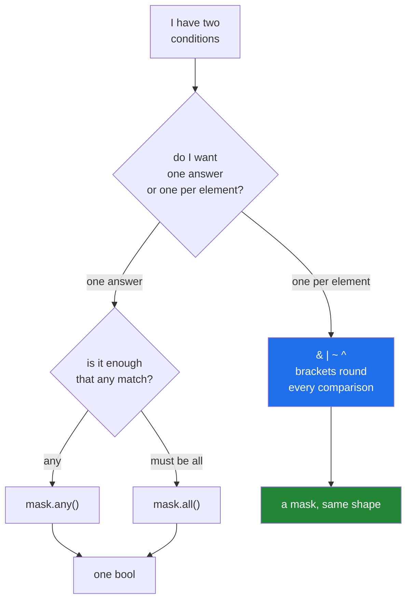

# 3.3 — `&`, `|` and `~` — combining masks, and why `and` raises

## One-line answer

Two masks are combined with `&`, `|` and `~`, never with `and`, `or` and `not` — the English words
demand one true-or-false answer and an array of seven has seven, so Python raises rather than guess.

---

## The story

Someone is looking through the highlighted month again, this time for a narrower question: which of
the big days were work days?

They have two sheets now. One has the big days highlighted. The other has Saturday and Sunday
crossed out, because those columns are the weekend. To answer the question they hold both sheets up
to the window and look for the boxes that are marked on both.

Nothing about that is clever. It is two sheets, one on top of the other, checked box by box — and
crucially, the answer is a third sheet, not a yes or a no. Twenty-eight boxes went in and twenty-eight
came out, each of them marked only where both sheets agreed.

Now imagine somebody asks, instead, "is the month busy?" That question expects one word back. Held
against a sheet of twenty-eight marks, it has no answer. Some boxes are marked and some are not, and
"is the month busy" has quietly assumed the answer is a single thing when the evidence is a grid.

That is the whole part. Combining two sheets gives a sheet. Demanding a yes or a no from a sheet is
the mistake.

---

## The idea in plain language

Python has two families of operators that both look like logic, and until now you have only needed
one of them.

**The English words** — `and`, `or`, `not` — work on **one** true-or-false value each. They are
defined in terms of truthiness ([Day 5, 2.2](../../../day-05-operators-and-conditionals/parts/02-conditionals/2.2-truthiness.md)):
Python asks each operand "are you true?", gets one answer, and decides. They also short-circuit,
which means `a and b` never looks at `b` when `a` is already false
([Day 5, 2.4](../../../day-05-operators-and-conditionals/parts/02-conditionals/2.4-and-or-return-operands.md)).

**The symbols** — `&`, `|`, `~`, `^` — are the bitwise operators
([Day 5, 1.5](../../../day-05-operators-and-conditionals/parts/01-operators/1.5-bitwise-and-the-mask.md)).
On plain integers they work bit by bit. NumPy gives them a second meaning: on boolean arrays they
work **element by element**, and hand back an array of the same shape.

So the four you need are:

| Written | Means | Result |
|---|---|---|
| `a & b` | true where **both** are true | a mask |
| `a \| b` | true where **either** is true | a mask |
| `~a` | true where `a` is false | a mask |
| `a ^ b` | true where **exactly one** is true | a mask |

The English words do not have an elementwise meaning, and this is where the famous error comes from.
When you write `mask1 and mask2`, Python asks `mask1` for a single yes or no. A NumPy array with more
than one element refuses to answer, because both possible answers — "yes, some are true" and "yes,
all are true" — are guesses about what you meant. It raises `ValueError: The truth value of an array
with more than one element is ambiguous. Use a.any() or a.all()`, which is the same error you met on
[Day 5, 2.3](../../../day-05-operators-and-conditionals/parts/02-conditionals/2.3-if-df-raises.md).
That message is not a complaint about your array. It is NumPy telling you which two questions you
might have meant, and asking you to pick one.

Three consequences follow, and each one bites at least once.

**Every mask must be in brackets.** `&` binds more tightly than `>`, so `a > 5 & a < 9` is read as
`a > (5 & a) < 9`, which is nonsense assembled from legal pieces. Write `(a > 5) & (a < 9)`. The
rule is the operator precedence table from
[Day 5, 1.6](../../../day-05-operators-and-conditionals/parts/01-operators/1.6-precedence-and-associativity.md),
and this is the one case in Python where the brackets are not optional style — they are the
difference between a mask and an exception.

**There is no short-circuit.** `(x != 0) & (100 / x > 1)` computes the division for **every**
element, including the zeros, before the `&` ever runs. The guard on the left does not protect the
right-hand side the way `and` would, because both sides are complete arrays computed before they
meet.

**Chained comparisons do not work either.** `5000 < week < 11000` is defined by Python as
`(5000 < week) and (week < 11000)` — the English `and` — so it raises for the same reason. Write
`(week > 5000) & (week < 11000)`.

For more than two conditions there is a tidier form: `np.logical_and.reduce([m1, m2, m3])` folds a
list of masks together, and `np.logical_or.reduce` does the same for "any of these". They are worth
knowing when the conditions are built in a loop, because a list of masks is easier to assemble than
a chain of `&`.

---

## Why Setu needs it

- **Day 30's Pandas filters** use exactly these operators for exactly this reason, and
  `frame[(frame.a > 1) & (frame.b < 2)]` is the single most-typed line in data work.
- **Day 76's data cleaning** combines "is not missing" with "is inside the plausible range" into one
  mask, so a row is judged once rather than filtered twice.
- **Day 91's split** builds the test mask and uses `~test` for training, which guarantees the two
  sets cannot overlap — a property that would take a comment to promise if the two masks were built
  separately.
- **Day 156's hybrid retrieval** intersects a metadata filter with a score threshold before ranking.
- **Day 205's guardrails** decide whether a tool call is allowed by combining several boolean checks
  over a batch of requests at once.

---

## The mechanism

Two conditions, four ways of putting them together:

```python
import numpy as np

month = np.array(
    [
        [8213, 10442, 6180, 0, 12007, 9631, 7204],
        [7788, 9120, 11345, 8402, 6733, 14210, 5096],
        [9004, 8765, 7621, 10188, 9950, 8317, 11002],
        [6540, 12488, 9873, 7106, 8899, 10540, 9218],
    ]
)
weekday = np.array([True, True, True, True, True, False, False])

busy = month > 10_000
both = busy & weekday
print("busy count      :", np.count_nonzero(busy))
print("weekday busy    :", np.count_nonzero(both))
print("weekend busy    :", np.count_nonzero(busy & ~weekday))
print("busy or Sunday  :", np.count_nonzero(busy | ~weekday))
print("exactly one     :", np.count_nonzero(busy ^ weekday))
print("values          :", month[both])
```

**Line by line:**

- `weekday` — a `(7,)` mask, one entry per day of the week, while `busy` is `(4, 7)`. They combine
  anyway, because NumPy stretches the seven-element mask across all four weeks. That stretching is
  broadcasting, and
  [Day 22, 1.3](../../../day-22-broadcasting-and-shape/parts/01-broadcasting/1.3-a-row-against-a-table.md)
  is where it is explained in full; here it is doing the obvious thing, which is applying the same
  week pattern to every week.
- `busy & weekday` — elementwise `and`. The result is `(4, 7)`, marked only where a big day fell on a
  work day.
- `~weekday` — elementwise `not`, so this is the weekend. `~` is how you say "the other ones", and it
  is much safer than writing the opposite condition out again, because an inverted condition written
  by hand can disagree with the original at the boundary.
- `busy | ~weekday` — elementwise `or`. Thirteen of the twenty-eight days are either big or at the
  weekend.
- `busy ^ weekday` — exclusive or: true where exactly one holds. Rarely what you want, useful when
  you want to know where two versions of a filter **disagree**.
- `np.count_nonzero` — counting without building the selection
  ([3.1](3.1-a-comparison-makes-an-array.md)).

```text
busy count      : 8
weekday busy    : 5
weekend busy    : 3
busy or Sunday  : 13
exactly one     : 18
values          : [10442 12007 11345 10188 12488]
```

Three of the eight big days were at the weekend, which is a real answer to a real question and took
one line.

For a list of conditions, fold instead of chaining:

```python
import numpy as np

week = np.array([8213, 10442, 6180, 0, 12007, 9631, 7204])
weekday = np.array([True, True, True, True, True, False, False])

conds = [week > 5000, week < 11000, weekday]
all_of = np.logical_and.reduce(conds)
print("combined :", all_of)
print("values   :", week[all_of])
print("any_of   :", np.logical_or.reduce(conds))
```

**Line by line:**

- `conds` — an ordinary Python list of masks. Building it in a loop is the point: rules that come
  from a config file cannot be written as a fixed chain of `&`.
- `np.logical_and.reduce(conds)` — folds the list with elementwise `and`, left to right, giving one
  mask. `np.logical_and` is the function form of `&`, and `.reduce` is the ufunc method that
  [Day 23, 1.7](../../../day-23-ufuncs-and-statistics/parts/01-ufuncs/1.7-reduce-accumulate-and-at.md)
  explains properly.
- `week[all_of]` — the three days that satisfy all three rules at once.
- `np.logical_or.reduce(conds)` — the same fold with `or`. Everything passes here, because every day
  is either above 5000, below 11000, or a weekday.

```text
combined : [ True  True  True False False False False]
values   : [ 8213 10442  6180]
any_of   : [ True  True  True  True  True  True  True]
```

Which operator to reach for:



---

## When it breaks

**The English word, which is the error everybody meets first:**

```text
$ uv run python -c "
import numpy as np
week = np.array([8213, 10442, 6180, 0, 12007, 9631, 7204])
mask = (week > 5000) and (week < 11000)
"
Traceback (most recent call last):
  File "<string>", line 4, in <module>
ValueError: The truth value of an array with more than one element is ambiguous. Use a.any() or a.all()
```

**What it means.** `and` asked the left-hand mask for one yes or no, and a seven-element array has
seven. The message even offers the two things you might have meant. The fix is `&` with brackets:
`(week > 5000) & (week < 11000)`. Read the error as *"you used the English word where you wanted the
symbol"* and it becomes a one-second fix rather than a mystery.

**The chained comparison, which raises the same error for a different reason:**

```text
$ uv run python -c "
import numpy as np
week = np.array([8213, 10442, 6180, 0, 12007, 9631, 7204])
print(5000 < week < 11000)
"
Traceback (most recent call last):
  File "<string>", line 4, in <module>
ValueError: The truth value of an array with more than one element is ambiguous. Use a.any() or a.all()
```

**What it means.** Python defines `a < b < c` as `a < b and b < c`, with the English `and` in the
middle, so the chained form cannot work on arrays no matter how natural it reads. There is no
version of chaining that does; write the two comparisons and join them with `&`.

**The missing brackets, which raise a third time:**

```text
$ uv run python -c "
import numpy as np
week = np.array([8213, 10442, 6180, 0, 12007, 9631, 7204])
print(week > 5000 & week < 11000)
"
Traceback (most recent call last):
  File "<string>", line 4, in <module>
ValueError: The truth value of an array with more than one element is ambiguous. Use a.any() or a.all()
```

**What it means.** `&` binds tighter than `>`, so Python read this as `week > (5000 & week) < 11000`
— a bitwise `and` between the number and the array, and then a chained comparison, which brings back
the previous error. The same message for three different mistakes is why this one is worth learning
by shape rather than by text: **whenever you see "truth value ... is ambiguous", look for an English
word, a chained comparison, or a missing pair of brackets.**

**The `~` that quietly did arithmetic:**

```text
$ uv run python -c "
import numpy as np
week = np.array([8213, 10442, 6180, 0, 12007, 9631, 7204])
mask = week > 10_000
print('~mask        :', ~mask)
print('~mask as int :', ~mask.astype(int))
print('selected     :', week[~mask.astype(int)])
"
~mask        : [ True False  True  True False  True  True]
~mask as int : [-1 -2 -1 -1 -2 -1 -1]
selected     : [7204 9631 7204 7204 9631 7204 7204]
```

**What it means.** On a boolean array `~` flips true and false. On an integer array it flips **bits**,
so `~0` is `-1` and `~1` is `-2`. Those are legal negative positions, so the indexing that follows
succeeds and returns the last and second-to-last values over and over. No error, no warning, seven
plausible numbers, all wrong. Keep masks as `bool` from the moment they are created, and if one
arrives as integers from a file, convert with `.astype(bool)` before doing anything else.

**The guard that did not guard:**

```text
$ uv run python -c "
import numpy as np
week = np.array([8213, 0, 6180], dtype=np.float64)
mask = (week != 0) & (100000 / week > 10)
print('mask :', mask)
"
<string>:4: RuntimeWarning: divide by zero encountered in divide
mask : [ True False  True]
```

**What it means.** The final mask is correct, and the division still ran on the zero. There is no
short-circuit: both sides are computed in full, as complete arrays, before `&` combines them. The
warning is harmless here because the `inf` it produced is discarded, but the same pattern with a
`log` of a negative number, or a division that is genuinely expensive, is a real cost. When the
right-hand side must not run on the bad elements, compute it with `where=` or select first and
compute on the selection ([3.2](3.2-indexing-with-a-mask.md)).

---

## In production

**What a professional writes instead of the teaching version.** Named masks, combined once, with the
rules readable as English:

```python
import numpy as np


def usable_days(counts: np.ndarray, *, floor: int = 100, ceiling: int = 60_000) -> np.ndarray:
    """Mark the days that can be used in a summary.

    A day is usable when it was recorded at all, is not implausibly small, and is not
    implausibly large. Each rule is named, so a failing row can be explained.
    """
    recorded = counts > 0
    not_a_stub = counts >= floor
    not_a_glitch = counts <= ceiling
    return recorded & not_a_stub & not_a_glitch


def explain(counts: np.ndarray, *, floor: int = 100, ceiling: int = 60_000) -> dict[str, int]:
    """Count how many days each rule rejects, so a filter can be argued with."""
    return {
        "not recorded": int(np.count_nonzero(counts <= 0)),
        "below floor": int(np.count_nonzero((counts > 0) & (counts < floor))),
        "above ceiling": int(np.count_nonzero(counts > ceiling)),
        "usable": int(np.count_nonzero(usable_days(counts, floor=floor, ceiling=ceiling))),
    }
```

**Line by line:**

- `recorded`, `not_a_stub`, `not_a_glitch` — three names, three lines. The combined expression at the
  end reads as the sentence in the docstring, and a reviewer can check each rule on its own. The
  one-line version — `(counts > 0) & (counts >= floor) & (counts <= ceiling)` — is the same
  arithmetic and cannot be read aloud.
- `floor` and `ceiling` as keyword-only parameters with defaults — the thresholds are stated at the
  call site rather than buried as numbers in the middle of a condition (Principle 4).
- `recorded & not_a_stub & not_a_glitch` — `&` is left-associative, so this is
  `(recorded & not_a_stub) & not_a_glitch`, and each step is a full pass over the data. Three masks
  are allocated and two more for the intermediates; on a large array this is the moment to consider
  `np.logical_and.reduce`.
- `explain` — the function that turns "146 rows were dropped" into "121 were never recorded, 25 were
  below the floor". **A filter nobody can explain is a filter nobody will trust**, and the counts cost
  one extra pass each.
- `int(np.count_nonzero(...))` — converting to a plain Python integer at the boundary, because a
  `np.int64` in a dictionary that is about to become JSON is a bug waiting for
  [Day 19, 3.4](../../../day-19-typing-dataclasses-and-concurrency/parts/03-pydantic/3.4-model-dump-and-the-boundary.md).
- `(counts > 0) & (counts < floor)` in the "below floor" count — the recorded condition is repeated
  deliberately, so that a not-recorded day is counted once rather than in two categories. Categories
  that overlap are how a total stops adding up.

**What changes at scale.** Each `&` is a full pass that allocates a new mask, so a five-condition
filter over ten million rows allocates about ten megabytes per intermediate and walks the data ten
times. Three ways out, in the order you should try them. Put the **most selective condition first**,
then select, then apply the rest to the much smaller selection. Use `np.logical_and.reduce`, which
folds without keeping every intermediate alive. Or, when the filter is genuinely the bottleneck,
compute the combined mask in one pass with a compiled tool. Measure before reaching for the third,
because the first two are free.

**The failure that only appears with real data.** A filter written as `(x > lo) & (x < hi)` on a
column that sometimes contained `nan`. Every comparison with `nan` is `False`, so the missing values
were excluded from both the "inside the range" set and the "outside the range" set. The two counts
were reported side by side in a dashboard and they stopped adding up to the total. Nobody noticed
for a month, because the gap was small. The habit that prevents it: whenever you split data with a
mask and its `~`, assert that the two counts sum to the length. With `nan` present they will not,
and the assertion tells you on the first run.

**The review comment a senior engineer leaves.** *"`df[(df.a > 1) & (df.b < 2) & (df.c != 'x')]` —
give each condition a name and combine the names. And put the `c != 'x'` first if it drops most of
the rows; the other two then run on a tenth of the data."*

**The interview question.** *"Why does `mask1 and mask2` raise, when `mask1 & mask2` works?"* Because
`and` is defined on a single truth value: Python calls `bool()` on the left operand to decide whether
to look at the right one, and an array of more than one element has no single truth value, so it
raises rather than picking `any` or `all` for you. `&` has an elementwise meaning that NumPy defines,
so it returns a mask. The detail that shows real use is the follow-on: `&` binds tighter than the
comparison operators, so every comparison needs brackets, and there is no short-circuit, so both
sides are always computed in full — a guard on the left will not stop a division by zero on the
right.

---

## Check yourself

```bash
uv run python -c "
import numpy as np
week = np.array([8213, 10442, 6180, 0, 12007, 9631, 7204])
inside = (week > 5000) & (week < 11000)
print('inside     :', np.count_nonzero(inside))
print('outside    :', np.count_nonzero(~inside))
print('adds up    :', np.count_nonzero(inside) + np.count_nonzero(~inside) == week.size)
print('any inside :', inside.any())
print('all inside :', inside.all())
"
```

Then change the array's dtype to `float64`, set one day to `np.nan`, and run it again. Watch which
line stops being `True`.

**Answer out loud, without scrolling up:**

> Name the three different mistakes that all produce the message "The truth value of an array with
> more than one element is ambiguous", and give the fix for each.

---

**Next:** [3.4 — assigning through a mask](3.4-assigning-through-a-mask.md).
