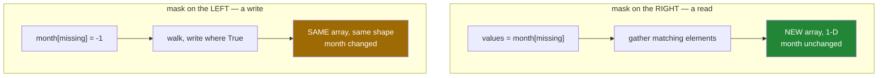

# 3.4 — `month[missing] = -1` — assigning through a mask

## One-line answer

A mask on the **left** of an `=` writes into the original array, in place, only where the mask is
`True` — which is the mirror of [3.2](3.2-indexing-with-a-mask.md), where a mask on the right made a
copy.

---

## The story

The highlighter sheet is still on the desk, and now there is a different job to do.

Thursday of week one is a zero. The phone was on the charger, and nobody walked zero steps that day.
Leaving the zero in means every average for that week is wrong, and it is wrong in a direction that
looks like a bad week rather than a missing day.

So somebody takes the grid and a pen, and writes a small dash in that one box. They do not copy the
grid out. They do not make a list of the boxes that need changing and then work through it. They put
the sheet with the one highlighted box over the grid, and write through the hole.

Twenty-seven boxes are untouched. One box now says something different. It is the same sheet of
paper it was before, which is exactly the point: everyone who was already looking at that grid sees
the change.

---

## The idea in plain language

The same brackets do two different things depending on which side of the `=` they sit.

`values = month[missing]` — the mask is on the **right**. NumPy gathers the matching elements into a
new array, and nothing about the original changes.

`month[missing] = -1` — the mask is on the **left**. NumPy walks the array and writes `-1` into every
position where the mask is `True`. Nothing is allocated, nothing is returned, and the original array
now holds different numbers.

This is not a special rule for masks. It is Python's ordinary distinction between reading an item and
setting one: `x = d["k"]` calls one method and `d["k"] = x` calls a different one. NumPy implements
both, and for masks the read has to copy while the write does not.

Three things you can put on the right-hand side.

**One value.** `month[missing] = -1` writes the same number into every marked position, however many
there are. This is the common case.

**Exactly as many values as there are `True` entries.** `week[top] = np.array([1, 2])` when `top`
has two `True` values, and they are matched up in **row-major order** — the same order the values
came out in when the mask was on the right.

**Another array of the same shape as the whole thing**, from which only the marked positions are
taken. This is how you copy the corrections from one array into another without touching anything
else.

Two warnings, both of which have their own failure below. The count has to match exactly, and NumPy
raises when it does not. And the assignment casts silently, so writing `8946.7` into an integer array
stores `8946` without a word.

Because this writes in place, everything from section 2 applies. If `month` is itself a view of some
larger array, this write reaches the parent
([2.1](../02-the-view-trap/2.1-a-slice-does-not-copy.md)). If the array was handed to you by a
caller, you have just changed their data
([2.4](../02-the-view-trap/2.4-the-function-that-changed-its-input.md)). If the array is read-only,
this raises `ValueError: assignment destination is read-only`, which is the flag doing its job.

There is one more form worth knowing now, because it separates the two decisions that
`month[missing] = -1` bundles together. `np.copyto(destination, values, where=mask)` writes `values`
into `destination` at the marked positions. It says *what* to write, *where* to write it, and *into
what*, as three arguments rather than as one expression, which is easier to read when the mask is
long and the destination is not the array the mask came from.

---

## Why Setu needs it

- **Day 76's imputation** — filling a missing value with the column's median — is this operation, and
  Principle 8 says the median must come from the training rows only.
- **Day 78's outlier capping** writes the 99th percentile into every value above it, which is
  `values[values > cap] = cap`.
- **Day 130's label smoothing** and every masking step in a training loop write through a mask into a
  pre-allocated buffer, because allocating a new array per batch is what makes a loop slow.
- **Day 165's chunk cleaning** replaces the runs of whitespace a PDF extractor leaves behind, on the
  numeric side of the pipeline as much as the text side.
- **Day 44 is where the leak shows up if you get this wrong**: a value filled in from the whole
  dataset before the split is the classic leakage bug, and it looks exactly like this line.

---

## The mechanism

Write through the hole:

```python
import numpy as np

month = np.array(
    [
        [8213, 10442, 6180, 0, 12007, 9631, 7204],
        [7788, 9120, 11345, 8402, 6733, 14210, 5096],
        [9004, 8765, 7621, 10188, 9950, 8317, 11002],
        [6540, 12488, 9873, 7106, 8899, 10540, 9218],
    ]
)

missing = month == 0
print("missing count:", np.count_nonzero(missing))
month[missing] = -1
print("row 0 now    :", month[0])
print("still (4, 7) :", month.shape)

capped = month.copy()
capped[capped > 12_000] = 12_000
print("capped row 1 :", capped[1])

week = np.array([8213, 10442, 6180, 0, 12007, 9631, 7204])
top = week > 10_000
week[top] = np.array([1, 2])
print("two values   :", week)
```

**Line by line:**

- `missing = month == 0` — the mask, named. It is used twice below, and naming it also documents what
  a zero means in this data: not "no steps", but "not recorded".
- `month[missing] = -1` — the write. **No new array**, no return value, and the shape is unchanged
  afterwards, which the next line checks. Compare this with `month[missing]`, which would have
  produced a one-element copy.
- `-1` as the value — a sentinel, chosen because a step count can never be negative, so the marker
  cannot be confused with data
  ([Day 20, 2.4](../../../day-20-arrays-and-dtypes/parts/02-dtypes/2.4-astype-and-the-copy.md)). In a
  float array `np.nan` is the better marker; in an integer array there is no `nan`, so a sentinel is
  the only option.
- `capped = month.copy()` — the copy is deliberate, because the next line writes and `month` is
  wanted intact ([2.3](../02-the-view-trap/2.3-copy-and-when-to-pay.md)).
- `capped[capped > 12_000] = 12_000` — the mask is built inline from the array being written to. This
  reads oddly the first time and is completely ordinary: the condition is evaluated first, producing
  a mask, and the write happens afterwards.
- `week[top] = np.array([1, 2])` — two `True` values, two replacement values, matched in order. The
  first `True` gets `1`, the second gets `2`.

```text
missing count: 1
row 0 now    : [ 8213 10442  6180    -1 12007  9631  7204]
still (4, 7) : (4, 7)
capped row 1 : [ 7788  9120 11345  8402  6733 12000  5096]
two values   : [8213    1 6180    0    2 9631 7204]
```

The two sides of the same brackets, side by side:



The three-argument form, when the destination is not where the mask came from:

```python
import numpy as np

week = np.array([8213.0, 10442.0, 0.0])
np.copyto(week, np.nan, where=week == 0)
print(week)
print("nan count:", np.count_nonzero(np.isnan(week)))
```

**Line by line:**

- `np.array([8213.0, ...])` — floats, deliberately. `np.nan` is a floating-point value and cannot be
  stored in an integer array at all
  ([Day 20, 2.3](../../../day-20-arrays-and-dtypes/parts/02-dtypes/2.3-floats-nan-and-precision.md)).
- `np.copyto(week, np.nan, where=week == 0)` — destination, value, condition. The same effect as
  `week[week == 0] = np.nan`, written as three named things instead of one expression.
- `np.count_nonzero(np.isnan(week))` — counting `nan` values needs `isnan`, because `== np.nan` finds
  nothing.

```text
[ 8213. 10442.    nan]
nan count: 1
```

---

## When it breaks

**The wrong number of replacement values:**

```text
$ uv run python -c "
import numpy as np
week = np.array([8213, 10442, 6180, 0, 12007, 9631, 7204])
week[week > 10_000] = np.array([1, 2, 3])
"
Traceback (most recent call last):
  File "<string>", line 4, in <module>
ValueError: NumPy boolean array indexing assignment cannot assign 3 input values to the 2 output values where the mask is true
```

**What it means.** Two days matched and three values were offered, and NumPy will not decide which
one to drop. The message is admirably literal: it names both counts. This usually happens when the
replacement values were computed from a different mask, or from the data before a filter narrowed it.
The fix is to compute both from the same mask, and the habit that prevents it is to name the mask
once and use the name everywhere.

**The value that was quietly truncated:**

```text
$ uv run python -c "
import numpy as np
week = np.array([8213, 10442, 6180, 0, 12007, 9631, 7204])
week[week == 0] = 8946.7
print('assigned 8946.7, stored:', week[3])
print('dtype still:', week.dtype)
"
assigned 8946.7, stored: 8946
dtype still: int64
```

**What it means.** Assignment into an existing array cannot change its dtype — the block is already
allocated, and every cell is eight bytes of integer
([Day 20, 2.1](../../../day-20-arrays-and-dtypes/parts/02-dtypes/2.1-a-dtype-is-a-promise.md)). So
the float is truncated, not rounded, and nothing is said. Notice that `month[0] += 0.5` **does**
raise ([2.4](../02-the-view-trap/2.4-the-function-that-changed-its-input.md)) while this does not:
the in-place operator applies the `same_kind` casting rule and plain assignment applies the `unsafe`
one. Filling an integer array with a mean is the usual way to meet this, and the fix is to decide
which you want — `astype(np.float64)` first to keep the fraction, or `np.rint` before assigning to
round rather than truncate.

**The write that had nowhere to go:**

```text
$ uv run python -c "
import numpy as np
month = np.arange(28).reshape(4, 7)
month.flags.writeable = False
month[month > 20] = 0
"
Traceback (most recent call last):
  File "<string>", line 5, in <module>
ValueError: assignment destination is read-only
```

**What it means.** Someone marked this array read-only, and this is the flag catching exactly what it
was set for ([2.2](../02-the-view-trap/2.2-how-to-tell-base-and-shares-memory.md)). Two arrays behave
this way without anyone setting a flag: an array loaded with `np.load(..., mmap_mode="r")`, and one
built by `np.broadcast_to`, which
[Day 22, 1.5](../../../day-22-broadcasting-and-shape/parts/01-broadcasting/1.5-no-data-is-copied.md)
explains. In both cases the fix is `.copy()` if you meant to change your own version, and a rethink
if you meant to change theirs.

**The write that went further than expected:**

```text
$ uv run python -c "
import numpy as np
month = np.arange(28).reshape(4, 7)
week = month[1]
week[week > 10] = 0
print('week  :', week)
print('month :')
print(month)
"
week  : [ 7  8  9 10  0  0  0]
month :
[[ 0  1  2  3  4  5  6]
 [ 7  8  9 10  0  0  0]
 [14 15 16 17 18 19 20]
 [21 22 23 24 25 26 27]]
```

**What it means.** `week` is a view of row 1, so writing through a mask on `week` writes into
`month`. Both the mask and the write are correct; the surprise is only in which array changed. This
is [2.1](../02-the-view-trap/2.1-a-slice-does-not-copy.md) again, and it is worth meeting twice,
because a masked write inside a helper function is where it does real damage.

---

## In production

**What a professional writes instead of the teaching version.** They know that "write where the mask
is true" has three implementations with very different costs, and they pick on purpose:

```python
import time

import numpy as np

rng = np.random.default_rng(21)
base = rng.integers(0, 20_000, size=10_000_000).astype(np.float64)
base.sum()

a = base.copy()
start = time.perf_counter()
a[a > 15_000] = 15_000
in_place = time.perf_counter() - start

b = base.copy()
start = time.perf_counter()
b = np.where(b > 15_000, 15_000, b)
allocating = time.perf_counter() - start

c = base.copy()
start = time.perf_counter()
np.clip(c, None, 15_000, out=c)
clipped = time.perf_counter() - start

print(f"mask assignment : {in_place * 1000:6.1f} ms, nothing allocated")
print(f"np.where        : {allocating * 1000:6.1f} ms, {base.nbytes:,} bytes allocated")
print(f"np.clip(out=)   : {clipped * 1000:6.1f} ms, nothing allocated")
print("same answer     :", np.array_equal(a, b), np.array_equal(a, c))
```

**Line by line:**

- `base.copy()` before each timing — each version starts from the same data, because the first one
  would otherwise leave nothing above the cap for the second to do.
- `a[a > 15_000] = 15_000` — builds a 10 MB mask, then walks it and writes. Two passes and one
  allocation for the mask.
- `np.where(b > 15_000, 15_000, b)` — builds the mask **and** a whole new 80 MB array. It is the
  fastest of the two general forms here and the most expensive in memory, which is the trade to
  notice.
- `np.clip(c, None, 15_000, out=c)` — the specialised function. No mask, no allocation, one pass, and
  it is several times faster than either general form. **When a named function exists for what you
  are doing, it usually beats the general mask version**, and clipping, filling and replacing all
  have one.
- `None` as the lower bound — clip takes a minimum and a maximum, and `None` means "no lower limit".
- `np.array_equal` — proof that all three did the same job, printed rather than assumed.

```text
mask assignment :   57.9 ms, nothing allocated
np.where        :   39.4 ms, 80,000,000 bytes allocated
np.clip(out=)   :    8.5 ms, nothing allocated
same answer     : True True
```

**What changes at scale.** The choice stops being about style. In a training loop, allocating an
80 MB array per batch is what makes the loop stall, so buffers are allocated once and written through
a mask on every iteration. In a service, the same reasoning applies to memory rather than time. And
when the operation is a named one — clip, fill, replace — the specialised function is both faster and
easier to review than the mask that spells it out. The general form earns its place when the
condition is genuinely arbitrary.

**The failure that only appears with real data.** A cleaning step wrote a column's mean into its
missing values with `col[np.isnan(col)] = col.mean()` — and `col.mean()` over an array containing
`nan` is `nan`, so every missing value was filled with a missing value. Every shape check passed,
every count was right, and the model silently trained on a column of `nan`. The fix is `np.nanmean`,
and the general lesson is that the right-hand side of a masked assignment is computed over the
**whole** array unless you say otherwise. Compute the fill value from `col[~np.isnan(col)]`, or use
the `nan`-aware function, and say in a comment which you chose.

**The leakage version of the same failure, which is worse.** Filling missing values with the mean of
the entire dataset — training rows and test rows together — leaks information from the test set into
the training set, and the model's reported score is better than the model is. Principle 8's rule is
mechanical: split first, compute the fill value on the training rows only, then write it into both.
This is the line that Day 44 will ask you to point at.

**The review comment a senior engineer leaves.** *"`arr[arr > cap] = cap` — that is `np.clip(arr,
None, cap, out=arr)`, which is one pass instead of two and says what it means. Also, this function
was handed `features[:, 3]`, which is a view, so this writes into the caller's feature matrix. Copy
on entry or rename the function to say that it changes its input."*

**The interview question.** *"What is the difference between `arr[mask]` and `arr[mask] = 0`?"* The
first is a read: it gathers the matching elements into a new one-dimensional array and leaves `arr`
untouched. The second is a write: it walks `arr` and stores into the marked positions in place,
allocating nothing and returning nothing. That difference is why `arr[mask][0] = 0` silently does
nothing — the read runs first, producing a temporary, and the write lands in the temporary. The
detail that shows experience is the casting rule: assignment into an existing array cannot change its
dtype, so writing `8946.7` into an integer array stores `8946` without a warning, while `arr += 0.5`
on the same array raises.

---

## Check yourself

```bash
uv run python -c "
import numpy as np
month = np.arange(28).reshape(4, 7).astype(np.float64)
month[1, 3] = np.nan
missing = np.isnan(month)
print('missing        :', np.count_nonzero(missing))
print('mean with nan  :', month.mean())
print('mean ignoring  :', np.nanmean(month))
month[missing] = np.nanmean(month)
print('after filling  :', month[1])
print('any nan left   :', np.isnan(month).any())
"
```

Then swap `np.nanmean` for `month.mean()` on the filling line and run it again. Read the last two
lines carefully before you decide which version was correct.

**Answer out loud, without scrolling up:**

> `arr[mask] = values` writes in place. Name the two things that must be true about `values` for the
> write to succeed, and the one thing NumPy will change about `values` without telling you.

---

**Next:** [3.5 — the mask that matched nothing](3.5-the-mask-that-matched-nothing.md).
