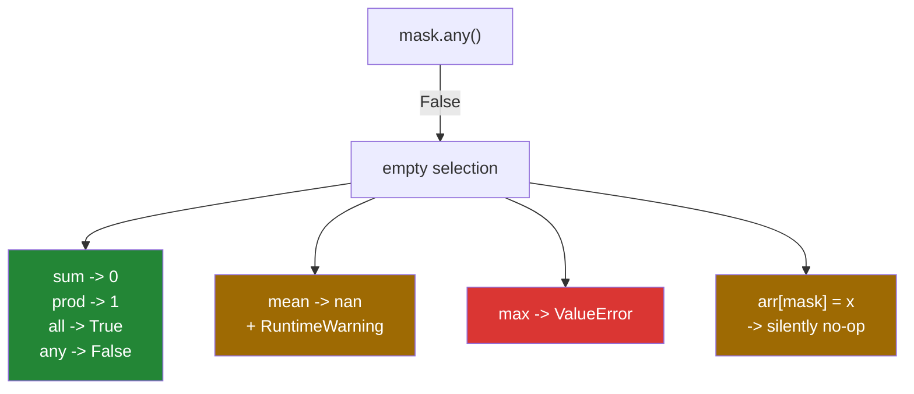

# 3.5 — The mask that matched nothing — the empty selection

## One-line answer

A mask with no `True` values gives an array of length zero, and the interesting part is what happens
next: `sum` returns `0`, `all` returns `True`, `mean` returns `nan` with a warning, and `max` raises.

---

## The story

A shop puts up a sign: *average spend of customers who bought a bicycle today*.

On a normal day the sign is filled in from the till roll. Someone runs a finger down the day's
receipts, picks out the ones with a bicycle on them, adds the totals, divides by how many there
were, and writes the number on the board.

On a wet Tuesday, nobody buys a bicycle.

Now the same procedure runs into a wall it has never met. Adding up no receipts gives zero, which is
fine and even sensible. Dividing zero by zero is not a number at all. And "the largest bicycle sale
today" has no answer, not even a bad one — there is nothing to be the largest.

Three questions, all reasonable, and the empty day treats them completely differently. One has an
obvious answer, one has an answer that is not a number, and one has no answer at all.

---

## The idea in plain language

An empty selection is not an error. `week[week > 40000]` on a week of ordinary walking is a perfectly
good array. It has the right dtype, it has shape `(0,)`, and it has no elements. Code that assumes
"selection" means "at least one element" is the thing that breaks, and it breaks later, somewhere
else.

What happens next depends on a single idea worth naming: the **identity element** of an operation.

The identity of addition is `0`, because adding zero changes nothing. So the sum of no numbers is
`0`, and NumPy returns it without complaint. The identity of multiplication is `1`, so the product of
no numbers is `1`. The identity of "and" is `True`, so `all()` of nothing is `True` — an empty
collection satisfies every rule, which is a genuine mathematical convention called **vacuous truth**
and not a NumPy quirk. The identity of "or" is `False`, so `any()` of nothing is `False`.

Now the two that have no identity.

**The mean has no identity**, because it is a sum divided by a count, and the count is zero. NumPy
computes `0 / 0`, gets `nan`, and warns: `RuntimeWarning: Mean of empty slice`. It is a warning, not
an error, so the program carries on with a `nan` in it — and a `nan` spreads through everything it
touches ([Day 20, 2.3](../../../day-20-arrays-and-dtypes/parts/02-dtypes/2.3-floats-nan-and-precision.md)).

**The maximum has no identity either**, and NumPy chooses differently here: it raises
`ValueError: zero-size array to reduction operation maximum which has no identity`. There is no
number that can stand in for "the largest of nothing", because whatever you pick could be smaller
than a real value that might have been there. So it stops rather than inventing one. You can supply
your own answer with `initial=`, and doing so is a statement about your data rather than about NumPy.

The last behaviour is the quietest of all. **Assigning through an empty mask does nothing, silently.**
`week[week > 40000] = -1` writes zero values into zero positions and returns without a word, which is
correct and is also how a filter that has stopped matching anything can run for a year unnoticed.

Two vocabulary notes to keep the rest straight. A **reduction** is an operation that turns many
values into one: `sum`, `mean`, `min`, `max`, `all`, `any`. A **warning** is a message Python prints
without stopping, unlike an exception; by default it is printed once per location and then
suppressed, which is why the same `nan` can appear a thousand times with one warning to show for it.

---

## Why Setu needs it

- **Day 76's imputation** computes a fill value from the rows that are not missing. When a column is
  entirely missing, that is an empty selection, and the fill value is `nan` — which fills the column
  with the thing it was meant to remove.
- **Day 91's stratified split** can produce an empty class when a label is rare, and the metric
  computed on it silently becomes `nan` for the whole run.
- **Day 156's filtered retrieval** returns no candidates when the metadata filter is too narrow, and
  the ranking step that follows must return "nothing found" rather than crash or make something up.
- **Day 172's eval harness** averages a score over the examples that passed a filter. One empty batch
  turns a whole report into `nan`, and a report of `nan` is indistinguishable from a broken metric.
- **Day 205's guardrail counters** use `all()` over a batch, and an empty batch passing every check by
  vacuous truth is exactly the wrong default for a guardrail.

---

## The mechanism

An empty selection, and what it still knows about itself:

```python
import numpy as np

week = np.array([8213.0, 10442.0, 6180.0, 0.0, 12007.0, 9631.0, 7204.0])

marathon = week > 40_000
picked = week[marathon]
print("matches :", np.count_nonzero(marathon))
print("picked  :", picked)
print("shape   :", picked.shape)
print("dtype   :", picked.dtype)
print("size    :", picked.size)
print("sum     :", picked.sum())
print("all     :", marathon.all(), "of an all-False mask")
print("any     :", marathon.any())
```

**Line by line:**

- `week > 40_000` — a real question with a real answer: nobody walked a marathon this week. The mask
  is seven `False` values, not an error.
- `picked.shape` — `(0,)`. **One axis, length zero.** It is still one-dimensional, which matters:
  code that reads `picked.shape[0]` gets `0` rather than crashing.
- `picked.dtype` — `float64`, inherited from `week`. An empty array remembers what it would have
  held, which is why an empty selection can still be concatenated with a full one.
- `picked.sum()` — `0.0`, the identity of addition. No warning, because zero is the right answer.
- `marathon.all()` — `False`, because the mask has seven elements and none is `True`. This is
  **not** the vacuous-truth case; the mask is not empty, the *selection* is.
- `marathon.any()` — `False`, and this single call is the guard that the production section is built
  around.

```text
matches : 0
picked  : []
shape   : (0,)
dtype   : float64
size    : 0
sum     : 0.0
all     : False of an all-False mask
any     : False
```

Which reductions survive an empty array, and which do not:

| Reduction | On an empty array | Why |
|---|---|---|
| `sum()` | `0.0` | identity of `+` is 0 |
| `prod()` | `1.0` | identity of `×` is 1 |
| `all()` | `True` | vacuous truth: nothing violates the rule |
| `any()` | `False` | nothing satisfies it |
| `mean()` | `nan`, with a warning | 0 divided by 0 |
| `max()` / `min()` | **raises** | no identity, and no honest stand-in |
| `max(initial=0)` | `0` | you supplied the stand-in |



The three colours are the whole point. Green is safe, amber is silent and wrong, red is loud. The
loud one is the one you would choose if you could, and the amber ones are why a guard is written by
hand.

---

## When it breaks

**The mean that is not a number:**

```text
$ uv run python -c "
import numpy as np
week = np.array([8213.0, 10442.0, 6180.0])
empty = week[week > 40_000]
print('mean :', empty.mean())
"
<string>:5: RuntimeWarning: Mean of empty slice
...\numpy\_core\_methods.py:142: RuntimeWarning: invalid value encountered in scalar divide
  ret = ret.dtype.type(ret / rcount)
mean : nan
```

**What it means.** Two warnings for one mistake: the first says the slice was empty, the second says
the division that followed was `0 / 0`. Neither stops the program. The `nan` then travels — added to
anything it makes `nan`, compared with anything it makes `False` — so the failure surfaces far from
here, often as a chart with a gap in it. In a script that runs unattended, promote this to an error
with `np.seterr(invalid="raise")` or `warnings.simplefilter("error")`, so that the thing that goes
wrong and the thing that reports it are in the same place.

**The maximum that refuses:**

```text
$ uv run python -c "
import numpy as np
week = np.array([8213.0, 10442.0, 6180.0])
empty = week[week > 40_000]
print(empty.max())
"
  File "...\numpy\_core\_methods.py", line 41, in _amax
    return umr_maximum(a, axis, None, out, keepdims, initial, where)
ValueError: zero-size array to reduction operation maximum which has no identity
```

**What it means.** Exactly what it says: `maximum` has no identity element, so there is no value that
could be returned without lying. This is NumPy at its best — the alternative would be returning
`-inf`, which would quietly become the largest value in a downstream comparison. When your data
genuinely has a floor, say so: `np.max(empty, initial=0.0)` returns `0.0` and is a documented claim
that no step count is below zero.

**The write that wrote nothing:**

```text
$ uv run python -c "
import numpy as np
week = np.array([8213.0, 10442.0, 6180.0])
week[week > 40_000] = -1
print('unchanged:', week)
"
unchanged: [ 8213. 10442.  6180.]
```

**What it means.** Zero positions matched, zero values were written, and the operation succeeded. It
is the correct behaviour and it is invisible. A cleaning step whose condition has drifted — a
threshold in the wrong units, a column renamed upstream so the comparison now runs against zeros —
keeps passing its tests and stops doing its job. The defence is to count: log or assert how many
values a cleaning step changed, and treat zero as suspicious rather than as success.

**The vacuous truth, which is the one that gets past review:**

```text
$ uv run python -c "
import numpy as np
week = np.array([8213.0, 10442.0, 6180.0])
empty = week[week > 40_000]
print('max with initial :', np.max(empty, initial=0.0))
print('sum              :', empty.sum())
print('all of empty     :', empty.size == 0, np.all(empty))
"
max with initial : 0.0
sum              : 0.0
all of empty     : True True
```

**What it means.** `np.all` of an empty array is `True`. Read as English — "are all of these values
non-zero?" — with no values at all, nothing is violating the rule, so the answer is yes. That is
mathematically standard, and it is the wrong default for a check. A validator written as
`if np.all(scores > 0.9): approve()` approves an empty batch. Always pair `all()` with a size check:
`values.size > 0 and np.all(values > 0.9)`.

---

## In production

**What a professional writes instead of the teaching version.** The guard comes first, and it says
which of the three answers an empty selection deserves:

```python
import numpy as np


def busy_day_summary(counts: np.ndarray, *, threshold: int = 10_000) -> dict[str, float | int]:
    """Describe the days above a threshold. An empty result is reported, never averaged.

    Returns ``count`` 0 and ``mean``/``best`` of None when no day qualifies, so the caller
    can tell "no busy days" apart from "the average busy day was zero steps".
    """
    if counts.ndim != 1:
        raise ValueError(f"expected one run of counts, got shape {counts.shape}")
    busy = counts > threshold
    matched = int(np.count_nonzero(busy))
    if matched == 0:
        return {"count": 0, "mean": None, "best": None}
    selected = counts[busy]
    return {
        "count": matched,
        "mean": float(selected.mean()),
        "best": float(selected.max()),
    }
```

**Line by line:**

- `if counts.ndim != 1: raise` — shape first, because a two-dimensional input would make `matched`
  right and the rest meaningless.
- `matched = int(np.count_nonzero(busy))` — the count is computed **before** the selection, so the
  empty case is decided without allocating anything ([3.2](3.2-indexing-with-a-mask.md)).
- `if matched == 0: return ...` — the guard. It returns a dictionary with the same keys as the normal
  path, so the caller's code does not need a second shape. **A guard that returns a different shape
  moves the problem instead of solving it.**
- `"mean": None` rather than `0.0` — the distinction the docstring names. Zero is a measurement;
  `None` is the absence of one. Writing `0.0` here is how "no busy days this week" becomes "an
  average of zero steps on busy days" in a report, and nobody can tell afterwards which happened.
- `float(selected.mean())` — a plain Python float at the boundary, not a `np.float64`, so the
  dictionary survives `json.dumps`
  ([Day 19, 3.4](../../../day-19-typing-dataclasses-and-concurrency/parts/03-pydantic/3.4-model-dump-and-the-boundary.md)).
- `selected.max()` — safe here, and only here, because the guard above proved there is at least one
  element. This is the shape of every safe `max` in production code: a check, then the call.

**What changes at scale.** Empty selections stop being an edge case and become a daily event. A
filter over ten million rows partitioned by hour, customer or country produces some partitions with
nothing in them on almost every run, so the "impossible" branch executes constantly. Two habits
follow. Every per-group statistic is computed by a function with the guard above, so an empty group
returns a stated value rather than a `nan`. And warnings are configured rather than ignored: in a
batch job, `np.seterr(all="raise")` at the top turns the silent `nan` into a traceback with a line
number, and the handful of places that genuinely expect a `nan` opt out locally with
`np.errstate(invalid="ignore")`.

**The failure that only appears with real data.** A daily report averaged response times for requests
that had failed. On the day the system worked perfectly, there were no failures, the mean was `nan`,
and the dashboard drew nothing. Somebody read the empty panel as "monitoring is broken" and spent an
afternoon on it. The output that would have taken one line — *"0 failed requests"* — is exactly what
the `matched == 0` branch exists to print.

**The review comment a senior engineer leaves.** *"`values[mask].mean()` — what happens when the mask
matches nothing? You get `nan` and a warning nobody reads. Guard with `count_nonzero` first and
return an explicit 'no data' result. And `np.all(checks)` on an empty batch is `True`, so this
approves an empty request list."*

**The interview question.** *"What does `arr[arr > 100].mean()` return when nothing is above 100?"*
`nan`, with a `RuntimeWarning`, because the mean divides a sum of zero by a count of zero, and NumPy
warns rather than raising. The follow-up that separates people who have shipped this is knowing that
the reductions do not agree: `sum` returns `0` and `all` returns `True`, both by their identity
elements, while `max` raises `ValueError` because it has no identity. So the empty case has three
different behaviours depending on which statistic you asked for, and the only reliable defence is to
check `mask.any()` before reducing.

---

## Check yourself

```bash
uv run python -c "
import numpy as np
week = np.array([8213.0, 10442.0, 6180.0])
empty = week[week > 40_000]
print('sum   :', empty.sum())
print('all   :', np.all(empty))
print('any   :', np.any(empty))
try:
    print('max   :', empty.max())
except ValueError as exc:
    print('max   : raised ->', exc)
print('mean  :', np.mean(empty) if empty.size else 'guarded, not computed')
"
```

Four reductions over the same empty array, four different kinds of answer. Say which of them you
would be happy to see in a report.

**Answer out loud, without scrolling up:**

> A mask matched nothing. What does `sum()` give, what does `all()` give, and which single reduction
> raises rather than returning a value — and why is raising the better behaviour?

---

**Next:** [4.1 — a list of positions](../04-fancy-indexing/4.1-a-list-of-positions.md).
