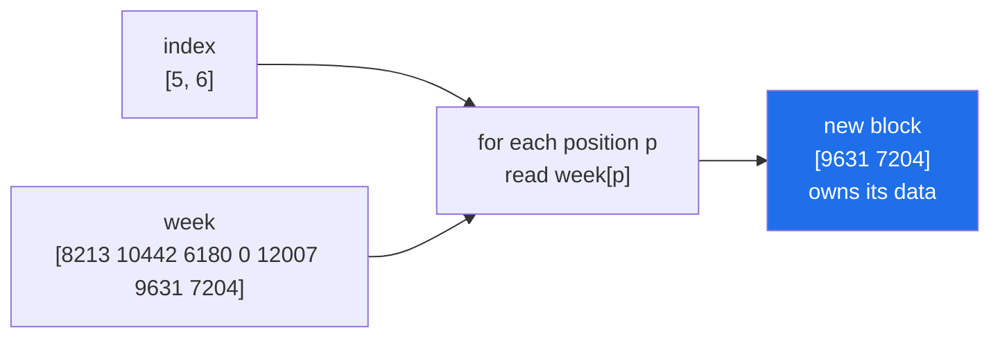

# 4.1 — `week[[0, 3, 6]]` — a list of positions

## One-line answer

Put a list of positions inside the brackets and NumPy returns those elements, **in the order you
asked for them**, repeats allowed — and the result takes the shape of the index, not the shape of
the array.

---

## The story

Somebody is reading the week of step counts down the phone to a friend, and the friend only wants
three days: Monday, Thursday and Sunday.

They do not read the whole week and let the friend pick. They do not read Monday to Sunday and stop
in the middle. They jump: first box, fourth box, last box. Three numbers, in the order they were
asked for.

Then the friend says "actually, read them back to front". The same three boxes, a different order,
and no rearranging of the original — the grid on the desk has not moved. What changed is the order
the reader visited it in.

And when the friend says "read Monday again, I missed it", the reader simply looks at the first box
a second time. Nothing about reading a box stops you reading it twice.

---

## The idea in plain language

Sections 1 and 2 selected by **position ranges**: one number, or a start-stop-step slice. Section 3
selected by **condition**. This section selects by **an explicit list of positions**, and NumPy calls
it **fancy indexing** — the official name in the documentation, and the phrase you will see in error
messages and Stack Overflow answers alike.

You write the positions as a list or an array inside the brackets: `week[[0, 3, 6]]`. Five properties
follow, and all five are different from a slice.

**Order is yours.** `week[[6, 5, 0]]` returns the last, the second-to-last and the first, in that
order. A slice can only go forwards or backwards at a constant step
([1.5](../01-one-element/1.5-the-step-and-the-reverse.md)); a list of positions can be in any order at
all.

**Repeats are allowed.** `week[[0, 0, 0]]` returns three copies of Monday. This is not a mistake to be
caught; it is how you build a bigger array out of a smaller one, and it is how sampling with
replacement works.

**Negative positions work**, exactly as they do for a single index
([1.1](../01-one-element/1.1-index-and-the-negative-index.md)). `week[[-1, -2]]` is the last two days,
in reverse.

**The result has the shape of the index.** Ask with a flat list of three positions and you get three
values. Ask with a `(2, 2)` array of positions and you get a `(2, 2)` array of values. The array being
indexed contributes the *values*; the index contributes the *shape*. This is the rule that makes
fancy indexing feel strange at first, and it is the rule that makes it powerful later.

**It always copies.** Fancy indexing is advanced indexing, exactly like a boolean mask
([3.2](../03-boolean-masks/3.2-indexing-with-a-mask.md)), and for the same reason: arbitrary positions
cannot be described by a stride, so the values must be gathered into a new block.

One more term, because it is the one used everywhere for this operation: a **gather**. To gather is
to collect values from scattered positions into a compact result. Its opposite, writing values back
out to scattered positions, is a **scatter**, and that is 4.4.

Two things that are **not** fancy indexing, which is where most confusion starts.

`week[0:3]` is a slice, not a list, and gives a view. The square brackets are the same; what is
inside them decides everything.

`month[(1, 2)]` is **not** a list of positions. A tuple inside the brackets means "one index per
axis", so `month[(1, 2)]` is identical to `month[1, 2]` — a single element
([1.2](../01-one-element/1.2-the-comma-a-list-cannot-do.md)). A **list** means positions along the
first axis. Tuple and list are interchangeable in most of Python and are two completely different
requests here.

---

## Why Setu needs it

- **Day 23's `argsort`** returns positions, and those positions are then used exactly like this to
  reorder the values — which is how top-k retrieval works
  ([Day 23, 3.2](../../../day-23-ufuncs-and-statistics/parts/03-sorting-and-searching/3.2-argsort-the-positions.md)).
- **Day 91's train/test split** shuffles a list of row positions and indexes the data with the two
  halves. The positions are shuffled, never the data.
- **Day 130's mini-batching** takes a permutation of row positions and slices it into batches, so each
  epoch sees the data in a new order without a single row being moved.
- **Day 156's vector search** returns the ids of the nearest neighbours, and turning those ids into
  the actual documents is a gather.
- **Day 117's bag-of-words** maps tokens to column positions and gathers the matching embedding rows.

---

## The mechanism

Positions in, values out:

```python
import numpy as np

week = np.array([8213, 10442, 6180, 0, 12007, 9631, 7204])
names = np.array(["Mon", "Tue", "Wed", "Thu", "Fri", "Sat", "Sun"])

weekend = week[[5, 6]]
print("weekend   :", weekend)
print("named     :", names[[5, 6]])
print("reordered :", week[[6, 5, 4, 3, 2, 1, 0]])
print("repeated  :", week[[0, 0, 0]])
print("negative  :", week[[-1, -2]])
print("copy?     :", np.shares_memory(week, weekend))

positions = np.array([[0, 1], [5, 6]])
picked = week[positions]
print("index shape :", positions.shape)
print("result shape:", picked.shape)
print(picked)
```

**Line by line:**

- `week[[5, 6]]` — two pairs of brackets, and both are doing a job. The outer pair is indexing; the
  inner pair is the list of positions. `week[5, 6]` without the inner brackets means something else
  entirely — one index per axis — and on a one-dimensional array it raises.
- `names[[5, 6]]` — **the same positions applied to a different array.** This is the reason positions
  are worth keeping: one list of positions can select the matching entries from every array that
  shares an axis, which a mask can do too, and which a slice can only do when the selection is
  contiguous.
- `week[[6, 5, 4, 3, 2, 1, 0]]` — the reverse, written out. `week[::-1]` does the same thing and is a
  view; this one copies. **When a slice can express what you want, use the slice.**
- `week[[0, 0, 0]]` — Monday three times. Legal, useful for sampling with replacement, and the reason
  4.4's write behaviour is surprising.
- `np.shares_memory(week, weekend)` — `False`. Fancy indexing copies, always
  ([2.2](../02-the-view-trap/2.2-how-to-tell-base-and-shares-memory.md)).
- `positions` as a `(2, 2)` array — and the result is `(2, 2)`. The values came from a
  one-dimensional array and the shape came from the index. Read `picked[0, 1]` as "the value at
  position `positions[0, 1]`".

```text
weekend   : [9631 7204]
named     : ['Sat' 'Sun']
reordered : [ 7204  9631 12007     0  6180 10442  8213]
repeated  : [8213 8213 8213]
negative  : [7204 9631]
copy?     : False
index shape : (2, 2)
result shape: (2, 2)
[[ 8213 10442]
 [ 9631  7204]]
```

What actually happens, position by position:



There is no stride that reaches position 5 and then position 6 and nothing else — well, there is, for
that particular pair. But there is none for `[6, 5, 0]`, and NumPy does not have two code paths for
"the positions happened to be regular" and "they did not". Advanced indexing gathers, and gathering
allocates.

The same operation on a two-dimensional array selects **rows**:

```python
import numpy as np

month = np.arange(28).reshape(4, 7)

print("two rows   :", month[[1, 2]].shape)
print(month[[1, 2]])
print("reordered  :")
print(month[[3, 0]])
print("one element:", month[(1, 2)])
```

**Line by line:**

- `month[[1, 2]]` — a list indexes the **first** axis, so this is weeks 1 and 2 with all their days.
  The shape is `(2, 7)`: two rows selected, seven columns untouched.
- `month[[3, 0]]` — the last week first. This is how a table is reordered, and it is the operation
  behind every "sort the rows by this column" you will write
  ([Day 23, 3.2](../../../day-23-ufuncs-and-statistics/parts/03-sorting-and-searching/3.2-argsort-the-positions.md)).
- `month[(1, 2)]` — a **tuple**, so this is `month[1, 2]`: row 1, column 2, one number. Change the
  brackets from round to square and the meaning changes from one element to two rows. There is no
  warning, because both are valid.

```text
two rows   : (2, 7)
[[ 7  8  9 10 11 12 13]
 [14 15 16 17 18 19 20]]
reordered  :
[[21 22 23 24 25 26 27]
 [ 0  1  2  3  4  5  6]]
one element: 9
```

---

## When it breaks

**A position that is not there:**

```text
$ uv run python -c "
import numpy as np
week = np.array([8213, 10442, 6180, 0, 12007, 9631, 7204])
print(week[[0, 7]])
"
Traceback (most recent call last):
  File "<string>", line 4, in <module>
IndexError: index 7 is out of bounds for axis 0 with size 7
```

**What it means.** Position 7 does not exist in a seven-element array, where the last position is 6.
The message names the offending index, the axis and the size, which is everything you need. Note the
contrast with slicing: `week[0:99]` clips silently and returns what exists
([1.3](../01-one-element/1.3-slicing-one-axis.md)), while a list of positions raises. **Slices
forgive, positions do not**, and that difference is a feature — a position list usually comes from
another computation, and a wrong one is a bug rather than an over-long range.

**A position that is not a whole number:**

```text
$ uv run python -c "
import numpy as np
week = np.array([8213, 10442, 6180, 0, 12007, 9631, 7204])
print(week[[0.0, 1.0]])
"
Traceback (most recent call last):
  File "<string>", line 4, in <module>
IndexError: only integers, slices (`:`), ellipsis (`...`), numpy.newaxis (`None`) and integer or boolean arrays are valid indices
```

**What it means.** `0.0` is a float, and there is no such thing as element 0.0. This looks pedantic
until you meet the real cause: positions computed with `/` instead of `//`, because true division
always returns a float in Python
([Day 5, 1.2](../../../day-05-operators-and-conditionals/parts/01-operators/1.2-the-two-divisions.md)).
`n / 2` is `3.5` or `3.0`; `n // 2` is `3`. The message is also a useful summary of everything that
*is* allowed inside brackets, and it is worth reading once for that alone.

**The list that was a tuple:**

```text
$ uv run python -c "
import numpy as np
month = np.arange(28).reshape(4, 7)
print('list  :', month[[1, 2]].shape)
print('tuple :', month[(1, 2)])
"
list  : (2, 7)
tuple : 9
```

**What it means.** No error, two completely different results. A tuple is spread across the axes, a
list selects along the first one. This bites when positions arrive from a function that returns a
tuple — `np.nonzero` returns one, for instance
([3.2](../03-boolean-masks/3.2-indexing-with-a-mask.md)) — and passing that tuple straight into
brackets indexes by axis rather than by position. `list(...)` or `np.array(...)` at the boundary is
the fix, and knowing which one you have is the skill.

---

## In production

**What a professional writes instead of the teaching version.** They know that a gather's cost is not
just the number of elements, but where those elements are:

```python
import time

import numpy as np

rng = np.random.default_rng(21)
data = rng.random(10_000_000)
data.sum()

n = 1_000_000
sorted_positions = np.sort(rng.integers(0, data.size, size=n))
shuffled_positions = rng.permutation(sorted_positions)

start = time.perf_counter()
a = data[:n]
slice_time = time.perf_counter() - start

start = time.perf_counter()
b = data[sorted_positions]
sorted_time = time.perf_counter() - start

start = time.perf_counter()
c = data[shuffled_positions]
random_time = time.perf_counter() - start

print(f"slice (view)     : {slice_time * 1e6:9.1f} us, {a.nbytes:>10,} bytes shared")
print(f"gather, sorted   : {sorted_time * 1000:9.2f} ms, {b.nbytes:>10,} bytes copied")
print(f"gather, shuffled : {random_time * 1000:9.2f} ms, {c.nbytes:>10,} bytes copied")
print(f"shuffled costs {random_time / sorted_time:.1f}x the sorted gather")
print("same values      :", np.array_equal(np.sort(b), np.sort(c)))
```

**Line by line:**

- `rng.integers(0, data.size, size=n)` — a million random positions from a seeded generator, so the
  measurement can be repeated ([Day 20, 4.2](../../../day-20-arrays-and-dtypes/parts/04-random/4.2-the-seed-is-part-of-the-result.md)).
- `np.sort(...)` and `rng.permutation(...)` — **the same positions in two orders.** That is the whole
  experiment: identical work, identical output values, different visiting order.
- `data[:n]` — a slice, for scale. It is a view, so it does no work at all and finishes in
  microseconds while the gathers take milliseconds.
- `data[sorted_positions]` — a gather that walks memory forwards. Each memory page it touches is used
  for several values before it moves on.
- `data[shuffled_positions]` — the same values, jumping around an 80 MB block. Every read is likely to
  land in a page the processor has not cached, and the cost is roughly double.
- `np.array_equal(np.sort(b), np.sort(c))` — proof that the two gathers collected the same values, so
  the timing difference is entirely about order.

```text
slice (view)     :       6.4 us,  8,000,000 bytes shared
gather, sorted   :      5.99 ms,  8,000,000 bytes copied
gather, shuffled :     12.01 ms,  8,000,000 bytes copied
shuffled costs 2.0x the sorted gather
same values      : True
```

**What changes at scale.** Three things. The copy becomes a memory decision: gathering a million rows
from a 10 GB table allocates a real array, and a pipeline of five gathers holds five. Sorting the
positions first is a free optimisation when order does not matter — a 2× difference here, and larger
when the data does not fit in cache. And when order **does** matter, as it does for a shuffled
training epoch, the random access is the price of the shuffle, which is why data loaders shuffle
*indices* and read in large contiguous chunks rather than gathering one row at a time.

`np.take(data, positions)` is the function form of the same operation, and it is worth knowing for
two arguments the bracket form does not have: `out=` writes into a buffer you already own, and
`mode="clip"` or `mode="wrap"` handles out-of-range positions instead of raising. On this machine
`np.take` measured slightly slower than the brackets for a plain gather, so reach for it when you
need `out=` or `mode=`, not for speed you have not measured.

**The failure that only appears with real data.** A recommendation service kept an array of item
vectors and a Python dictionary from item id to row position. Items were occasionally deleted, the
array was rebuilt, and the dictionary was updated a moment later. In that gap every gather returned
the wrong rows — no error, no crash, just recommendations for the wrong items. Positions are only
meaningful against one specific array at one specific moment, and the fix was to rebuild both
together and swap them in one assignment.

**The review comment a senior engineer leaves.** *"`data[list(range(0, n))]` is a gather that copies
n elements; `data[:n]` is a view that copies nothing. Same values. Use the slice when the positions
are contiguous, and keep the fancy index for when they are genuinely arbitrary."*

**The interview question.** *"What is the difference between `arr[[0, 1, 2]]` and `arr[0:3]`?"* The
values are the same and nothing else is. The slice is basic indexing, so it returns a view that
shares memory and costs nothing; the list is advanced indexing, so it gathers into a new array. The
detail that shows you have used it: the fancy index takes the shape of the index rather than of the
array, so indexing a one-dimensional array with a `(2, 2)` index gives a `(2, 2)` result — and it
allows repeats and arbitrary order, which is why `argsort` output can be fed straight back in as an
index to reorder the data.

---

## Check yourself

```bash
uv run python -c "
import numpy as np
week = np.array([8213, 10442, 6180, 0, 12007, 9631, 7204])
order = np.array([3, 0, 6, 1])
print('gathered  :', week[order])
print('shape     :', week[order].shape)
print('is a copy :', not np.shares_memory(week, week[order]))
print('twice     :', week[[2, 2, 2, 2]])
print('as a grid :', week[np.array([[0, 1], [2, 3]])])
"
```

The last line indexes a flat array and gets a grid back. Say where the grid came from.

**Answer out loud, without scrolling up:**

> `arr` has 10 elements and `idx` is a `(3, 4)` array of positions. What shape is `arr[idx]`, does it
> share memory with `arr`, and what happens if one of the twelve positions is `10`?

---

**Next:** [4.2 — two index arrays](4.2-two-index-arrays.md).
