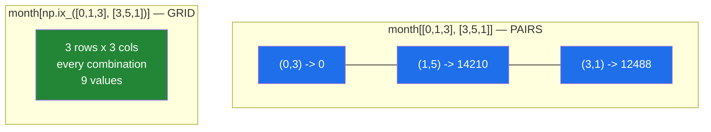

# 4.2 — `month[[0, 1], [3, 5]]` — two index arrays make pairs, not a grid

## One-line answer

When you put a list on more than one axis, NumPy zips them into **coordinate pairs** — the first
week's fourth day and the second week's sixth day, two values — rather than selecting those weeks
crossed with those days.

---

## The story

Somebody is checking two specific days on the month grid: Thursday of week one, and Saturday of week
two.

They read out the two coordinates: "row one, column four" and "row two, column six". Then they put a
finger on each one and read the two numbers. Two coordinates in, two numbers out.

Now a different person, given the same four numbers — rows one and two, columns four and six — does
something else entirely. They read every combination: week one Thursday, week one Saturday, week two
Thursday, week two Saturday. Four numbers, arranged in a little block.

Both readings are reasonable. Both are things people genuinely want. Written down as "rows one and
two, columns four and six", the sentence does not say which. NumPy picks the first one, always, and
almost everybody expects the second the first time.

---

## The idea in plain language

An index for a two-dimensional array has one entry per axis, separated by a comma
([1.2](../01-one-element/1.2-the-comma-a-list-cannot-do.md)). When those entries are lists rather
than single numbers, the rule is:

**The index arrays are matched up element by element, and the result has one value per matched pair.**

So `month[[0, 1, 3], [3, 5, 1]]` reads position `(0, 3)`, then `(1, 5)`, then `(3, 1)`. Three pairs,
three values, a `(3,)` result. It is the same as writing a loop over `zip(weeks, days)`
([Day 6, 1.3](../../../day-06-loops/parts/01-iteration/1.3-enumerate-and-zip.md)) and collecting the
answers, which is exactly what the mechanism below prints side by side.

The general statement, which covers every case you will meet: **the index arrays are broadcast
against each other, and the result takes the broadcast shape.** Two `(3,)` arrays broadcast to `(3,)`,
which gives the pairing above. That is the same broadcasting Day 22 is about, applied to indices
rather than to values, and it is the reason the next trick works.

**To get every combination — the grid — the index arrays must have shapes that stretch against each
other.** Make the row index a column, `(3, 1)`, and leave the column index a row, `(3,)`. They
broadcast to `(3, 3)`, and every row position is paired with every column position. Written out, that
is `month[rows[:, np.newaxis], cols]`, using the `np.newaxis` from
[1.6](../01-one-element/1.6-ellipsis-and-newaxis.md).

Because that is fiddly and easy to get wrong, NumPy provides `np.ix_`, whose only job is to reshape
a set of index arrays so they form a grid. `month[np.ix_(rows, cols)]` is the readable version, and
it is what you should write.

One more case worth pinning down now, because it looks like it should behave like the pairs and does
not. **A slice mixed with a list is not a pair.** `month[0:2, [3, 5]]` gives a `(2, 2)` block: the
slice keeps both rows and the list selects two columns from each. The pairing rule applies between
**index arrays**, and a slice is not one. Where the axes end up when you mix the two is its own trap,
and 4.5 is about that.

---

## Why Setu needs it

- **Day 23's `argsort` on a table** gives one array of positions per row, and reading the top result
  from each row is exactly a pair index: `scores[np.arange(n), best]`.
- **Day 130's classification loss** picks the predicted probability of the *correct* class for each
  row — `probs[np.arange(batch), labels]` — which is the single most common use of this operation in
  machine learning code.
- **Day 141's attention** gathers one selected position per sequence in a batch, the same shape of
  problem one dimension up.
- **Day 156's evaluation** compares each query against its own ground-truth document, so the pairs
  are `(query_row, correct_column)`.
- **Day 84's cross-tabulation** wants the grid version instead — every selected row crossed with every
  selected column — which is where `np.ix_` earns its place.

---

## The mechanism

Pairs, then the grid, then proof that the grid is just broadcasting:

```python
import numpy as np

month = np.array(
    [
        [8213, 10442, 6180, 0, 12007, 9631, 7204],
        [7788, 9120, 11345, 8402, 6733, 14210, 5096],
        [9004, 8765, 7621, 10188, 9950, 8317, 11002],
        [6540, 12488, 9873, 7106, 8899, 10540, 9218],
    ]
)

weeks = [0, 1, 3]
days = [3, 5, 1]
print("pairs      :", month[weeks, days])
print("shape      :", month[weeks, days].shape)
print("by hand    :", [month[w, d] for w, d in zip(weeks, days)])

grid = month[np.ix_(weeks, days)]
print("grid shape :", grid.shape)
print(grid)

col = np.array(weeks)[:, np.newaxis]
row = np.array(days)
print("broadcast  :", month[col, row].shape)
print("same?      :", np.array_equal(month[col, row], grid))
```

**Line by line:**

- `month[weeks, days]` — one list per axis, so the two are zipped: `(0, 3)`, `(1, 5)`, `(3, 1)`. The
  result is `(3,)` — **three values, not nine.**
- `[month[w, d] for w, d in zip(weeks, days)]` — the same three values computed the slow, obvious way.
  Printing both next to each other is the fastest way to convince yourself of the pairing rule, and it
  is worth doing once by hand.
- `np.ix_(weeks, days)` — the grid helper. It returns a tuple of reshaped index arrays, one shaped
  `(3, 1)` and one shaped `(1, 3)`, which broadcast to `(3, 3)`.
- `grid.shape` — `(3, 3)`. Every chosen week crossed with every chosen day, which is the
  "sub-table" people usually want.
- `np.array(weeks)[:, np.newaxis]` — the same reshape done by hand: a `(3,)` row becomes a `(3, 1)`
  column ([1.6](../01-one-element/1.6-ellipsis-and-newaxis.md)).
- `np.array_equal(month[col, row], grid)` — `True`, which says `np.ix_` is a convenience and not a
  different operation. **Understanding it as broadcasting is what makes the three-axis case obvious
  later.**

```text
pairs      : [    0 14210 12488]
shape      : (3,)
by hand    : [np.int64(0), np.int64(14210), np.int64(12488)]
grid shape : (3, 3)
[[    0  9631 10442]
 [ 8402 14210  9120]
 [ 7106 10540 12488]]
broadcast  : (3, 3)
same?      : True
```

The two readings, drawn:



The single most useful instance of the pairing rule — one chosen value from every row:

```python
import numpy as np

month = np.array(
    [
        [8213, 10442, 6180, 0, 12007, 9631, 7204],
        [7788, 9120, 11345, 8402, 6733, 14210, 5096],
        [9004, 8765, 7621, 10188, 9950, 8317, 11002],
        [6540, 12488, 9873, 7106, 8899, 10540, 9218],
    ]
)

best_day = month.argmax(axis=1)
rows = np.arange(month.shape[0])
print("best day per week :", best_day)
print("row positions     :", rows)
print("the best counts   :", month[rows, best_day])
print("check with max    :", month.max(axis=1))
```

**Line by line:**

- `month.argmax(axis=1)` — the **position** of the largest value in each week, not the value. One
  number per row, so this is a `(4,)` array. `argmax` is
  [Day 23, 3.2](../../../day-23-ufuncs-and-statistics/parts/03-sorting-and-searching/3.2-argsort-the-positions.md)'s
  subject; here it is a source of positions.
- `np.arange(month.shape[0])` — `[0, 1, 2, 3]`, one row position per row. This array exists purely to
  be the other half of each pair, and writing it is the idiom to memorise.
- `month[rows, best_day]` — the pairs `(0, best_day[0])`, `(1, best_day[1])`, and so on. **This is the
  line that appears in every neural-network loss function you will read.**
- `month.max(axis=1)` — the same numbers by a shorter route, printed as a check. The pair form matters
  when the positions come from one array and the values from another, which is what a loss function
  does: positions from the labels, values from the predictions.

```text
best day per week : [4 5 6 1]
row positions     : [0 1 2 3]
the best counts   : [12007 14210 11002 12488]
check with max    : [12007 14210 11002 12488]
```

---

## When it breaks

**Index arrays that cannot be matched up:**

```text
$ uv run python -c "
import numpy as np
month = np.arange(28).reshape(4, 7)
print(month[[0, 1], [3, 5, 6]])
"
Traceback (most recent call last):
  File "<string>", line 4, in <module>
IndexError: shape mismatch: indexing arrays could not be broadcast together with shapes (2,) (3,)
```

**What it means.** Two row positions and three column positions cannot be zipped, and they cannot be
broadcast either, because neither shape is 1. The message says "indexing arrays", which is the clue
that the problem is between the two index lists rather than between an index and the data. If you
wanted every combination, this is the moment to reach for `np.ix_`; if you wanted pairs, one of the
two lists has an element too many.

**The grid you expected and did not get:**

```text
$ uv run python -c "
import numpy as np
month = np.arange(28).reshape(4, 7)
print('rows then cols :', month[[0, 1], [3, 5]])
print('slice then list:', month[0:2, [3, 5]])
print('shape          :', month[0:2, [3, 5]].shape)
"
rows then cols : [ 3 12]
slice then list: [[ 3  5]
 [10 12]]
shape          : (2, 2)
```

**What it means.** No error here, which is what makes it dangerous. The first line pairs and gives two
values; the second uses a **slice** for the rows, and a slice is not an index array, so there is
nothing to pair with and the list applies to every selected row. Two nearly identical lines, one
giving `(2,)` and the other `(2, 2)`. When you meant the grid and wrote the pairs, the shape is wrong
immediately and you will notice; when you meant the pairs and wrote the slice, the shape is bigger
than you wanted and the mistake can survive until something downstream averages nine numbers instead
of three.

**The pair index that silently reordered:**

```text
$ uv run python -c "
import numpy as np
scores = np.array([[0.1, 0.7, 0.2], [0.8, 0.1, 0.1], [0.3, 0.2, 0.5]])
labels = np.array([1, 0, 2])
rows = np.arange(3)
print('correct  :', scores[rows, labels])
print('swapped  :', scores[labels, rows])
"
correct  : [0.7 0.8 0.5]
swapped  : [0.8 0.7 0.5]
```

**What it means.** Both calls are legal, both return three numbers, and only one of them means
anything. Swapping the two index arrays swaps rows for columns, and because this matrix has as many
classes as rows, nothing raises — two of the three values even happen to be right. With a
non-square matrix the same mistake usually raises `index 2 is out of bounds for axis 1 with size 2`,
which is the lucky version: three classes and three rows is the unlucky one. This is why the row
index is written as `np.arange(n)` in place rather than stored in a variable that could be passed in
the wrong order — the idiom `scores[np.arange(len(labels)), labels]` is nearly impossible to write
backwards.

---

## In production

**What a professional writes instead of the teaching version.** The pair index is wrapped in a
function whose name says what the pairs mean, and the row index is generated rather than passed:

```python
import numpy as np


def score_of_correct_class(probabilities: np.ndarray, labels: np.ndarray) -> np.ndarray:
    """Pick each row's probability for that row's correct class.

    ``probabilities`` is (n_rows, n_classes); ``labels`` holds one class position per row.
    """
    if probabilities.ndim != 2:
        raise ValueError(f"expected (rows, classes), got shape {probabilities.shape}")
    if labels.shape != (probabilities.shape[0],):
        raise ValueError(
            f"expected one label per row: {probabilities.shape[0]}, got {labels.shape}"
        )
    if labels.dtype.kind not in "iu":
        raise TypeError(f"labels must be integer positions, got dtype {labels.dtype}")
    n_classes = probabilities.shape[1]
    if labels.min() < 0 or labels.max() >= n_classes:
        raise ValueError(f"labels out of range for {n_classes} classes")
    return probabilities[np.arange(probabilities.shape[0]), labels]
```

**Line by line:**

- The three shape checks come before any indexing, and each message quotes the shape that arrived. A
  bare `IndexError` from deep inside a training loop tells you almost nothing; these tell you which
  argument is wrong.
- `labels.dtype.kind not in "iu"` — `kind` is a single character describing the dtype family: `i`
  signed integer, `u` unsigned, `f` float, `b` boolean, `U` text. This check catches labels that
  arrived as floats from a CSV, which would otherwise fail later with the unhelpful "only integers …
  are valid indices" ([4.1](4.1-a-list-of-positions.md)).
- `labels.min() < 0 or labels.max() >= n_classes` — the range check. Without it, a label of `-1` used
  as a "missing" marker silently selects the **last** class, and the model trains against a plausible
  wrong target.
- `np.arange(probabilities.shape[0])` — generated inside the function, from the data's own shape, so
  it cannot be the wrong length or in the wrong order.
- The return is one line and the eleven lines above it are all guards. That ratio is normal for a
  function that indexes with data supplied by a caller.

**What changes at scale.** The row index becomes a real allocation: `np.arange(batch)` on a batch of a
million rows is 8 MB, created and thrown away on every step. In a hot loop it is allocated once,
outside the loop, and reused — or the operation is replaced by `np.take_along_axis(probabilities,
labels[:, None], axis=1)`, which expresses "one element per row along this axis" directly and needs no
row index at all. The second scale effect is memory order: gathering one element per row from a large
matrix touches one value per row of memory, so it is dominated by cache misses rather than by
arithmetic, and it does not speed up by being given more processors.

**The failure that only appears with real data.** A ranking evaluation used `scores[queries,
relevant]` where both arrays came from a database query. For most batches the two arrays had the same
length and the pairs were meaningful. Then a query with no relevant document arrived, one array came
back one element shorter, and the whole batch raised `shape mismatch` in the middle of a nightly job.
The real bug was upstream — the two arrays were built by separate queries and nothing guaranteed they
matched — and the fix was to build them together and assert the lengths at the boundary.

**The review comment a senior engineer leaves.** *"`matrix[rows, cols]` — is this pairs or a grid? It
reads as a grid and it is pairs. If you want the sub-table, use `np.ix_(rows, cols)` and say so; if
you want the pairs, name the variable `pairs` or add the comment, because the next person will read
this as a cross product."*

**The interview question.** *"What does `a[[0, 1], [2, 3]]` return for a 2-D array `a`?"* Two elements:
`a[0, 2]` and `a[1, 3]`. The index arrays are broadcast against each other and matched element by
element, so this is a pair selection, not a cross product. The follow-up worth volunteering is how to
get the cross product — `a[np.ix_([0, 1], [2, 3])]`, which reshapes the first index to a column so the
two broadcast into a grid — and the one place the pair form matters most: `probs[np.arange(n),
labels]`, picking each row's correct-class probability, which is the standard way to write a
cross-entropy loss.

---

## Check yourself

```bash
uv run python -c "
import numpy as np
month = np.arange(28).reshape(4, 7)
rows = [0, 2]
cols = [1, 6]
print('pairs :', month[rows, cols])
print('grid  :')
print(month[np.ix_(rows, cols)])
print('shapes:', month[rows, cols].shape, 'vs', month[np.ix_(rows, cols)].shape)
"
```

Two values against four, from the same four numbers. Say out loud which line is which before you run
it.

**Answer out loud, without scrolling up:**

> You have row positions `[0, 2]` and column positions `[1, 6]`. Write the expression that returns
> two values, the expression that returns four, and say what rule turns the second one into a grid.

---

**Next:** [4.3 — fancy indexing always copies](4.3-fancy-indexing-always-copies.md).
