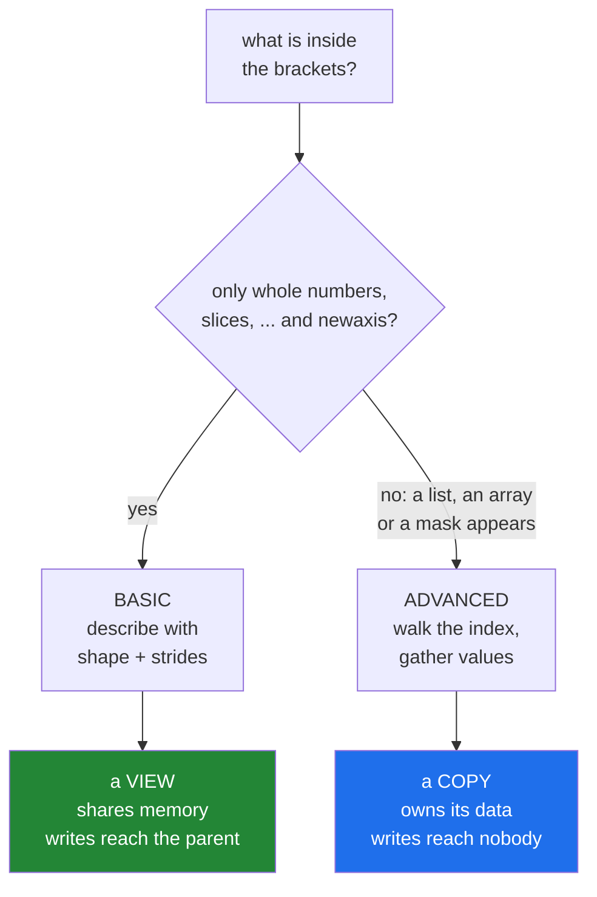

# 4.3 — Basic or advanced — the rule that decides view or copy

## One-line answer

Everything inside the brackets falls into two families: **basic** indexing — whole numbers, slices,
`...` and `np.newaxis` — always gives a view, and **advanced** indexing — a list, an array of
positions, or a boolean mask — always gives a copy.

---

## The story

A library has two ways of letting you take a book away.

The first is a reading desk by the window with a shelf above it. If you ask for "the four books
between Baker and Bennett", the librarian does not move anything; they point at a stretch of shelf
and say the books are there. You read them where they are. If somebody re-labels one of those books
while you are looking at the shelf, you see the new label.

The second is a request slip. You write down four call numbers from all over the building — one from
the basement, one from the top floor — and half an hour later a small pile arrives on your desk.
Those are the books, and they are now on your desk. If somebody re-labels the copy on the shelf
afterwards, your pile does not change, because the pile is the pile.

Both are "getting four books". One is a pointer at a stretch of shelf, the other is a trip round the
building with a trolley. Which one you get depends entirely on how you asked.

---

## The idea in plain language

You have now met every way of putting something inside `[]`, and they sort into exactly two families.

**Basic indexing** is what you write when the selection can be described by a starting point, a
shape, and a step per axis. It covers a whole number ([1.1](../01-one-element/1.1-index-and-the-negative-index.md)),
a slice ([1.3](../01-one-element/1.3-slicing-one-axis.md)), `...`, and `np.newaxis`
([1.6](../01-one-element/1.6-ellipsis-and-newaxis.md)). Because such a selection *can* be described by
a shape and a set of strides, NumPy describes it — and hands you a new array object that points at
the original memory. That is a **view**: no data is copied, and writes go through to the parent.

**Advanced indexing** is what you write when the selection is a set of arbitrary positions: a list or
array of positions ([4.1](4.1-a-list-of-positions.md)), several of them
([4.2](4.2-two-index-arrays.md)), or a boolean mask
([3.2](../03-boolean-masks/3.2-indexing-with-a-mask.md)). Arbitrary positions cannot be described by a
stride, so NumPy walks the index, reads each value, and writes it into fresh memory. That is a
**copy**: new storage, and writes do not go through to anything.

The rule is worth stating as a single sentence, because it explains every surprise in this day:
**basic indexing describes, advanced indexing gathers.**

Two details keep people guessing when they should be certain.

**One advanced index makes the whole expression advanced.** `month[1:3, [3, 4]]` mixes a slice with a
list, and it copies. The moment any part of the index is an array of positions or a mask, the result
must be gathered.

**`base is None` is not a reliable test.** [2.2](../02-the-view-trap/2.2-how-to-tell-base-and-shares-memory.md)
introduced `arr.base` as "does this array own its data", and it is honest but not sufficient: a copy
produced by a mixed expression can have a `base` pointing at a temporary array that no longer matters.
The reliable question is `np.shares_memory(original, result)`, which asks about the actual bytes, and
the table in the mechanism shows one row where the two answers disagree.

There is no third family and no exceptions. If you can say which family an expression belongs to, you
can say whether it copies, and if you can say whether it copies, you can say whether a write through
it will be seen by anybody else.

---

## Why Setu needs it

- **Day 44's pipelines** pass arrays between transformers. Whether a step received a view or a copy
  decides whether writing into it corrupts the previous step's data.
- **Day 76's feature selection** takes a subset of columns. Written as a slice it costs nothing;
  written as a list of column positions it copies the whole selection, and on a wide table that is the
  difference between a free operation and a gigabyte.
- **Day 91 depends on this for correctness, not speed.** The train and test sets are produced by
  advanced indexing, so they are copies, so a scaler fitted on one physically cannot reach the other.
- **Day 130's batches** are slices of a shuffled index array, deliberately: the shuffle is a gather,
  paid once per epoch, and the batches are then free.
- **Day 226 sizes a service**, where the difference between a view that pins a parent and a copy that
  releases it is the difference between steady memory and a slow climb.

---

## The mechanism

Every form you have met, sorted by what it actually returns:

```python
import numpy as np

month = np.arange(28).reshape(4, 7)

cases = {
    "month[1]": month[1],
    "month[1:3]": month[1:3],
    "month[:, 2]": month[:, 2],
    "month[::2, ::-1]": month[::2, ::-1],
    "month[...]": month[...],
    "month[np.newaxis]": month[np.newaxis],
    "month[[1, 2]]": month[[1, 2]],
    "month[month > 20]": month[month > 20],
    "month[[1, 2], [3, 4]]": month[[1, 2], [3, 4]],
    "month[1:3, [3, 4]]": month[1:3, [3, 4]],
    "month[np.array([1])]": month[np.array([1])],
}

print(f"{'expression':<24} {'shape':<10} {'base is None':<14} shares memory")
for label, result in cases.items():
    print(
        f"{label:<24} {str(result.shape):<10} "
        f"{str(result.base is None):<14} {np.shares_memory(month, result)}"
    )
```

**Line by line:**

- `cases` — a dictionary from the expression, written as text, to what it evaluates to. Building the
  table this way means the label and the code cannot drift apart, which they would if the labels were
  typed separately.
- `f"{label:<24}"` — left-aligned in a field of 24 characters
  ([Day 7, 3.2](../../../day-07-strings/parts/03-formatting/3.2-the-format-spec.md)). Alignment is
  what makes a comparison table readable at a glance.
- `result.base is None` — `True` means the array owns its data. Watch the row where this says `False`
  and `shares memory` also says `False`.
- `np.shares_memory(month, result)` — the question that actually matters: do these two arrays touch
  any of the same bytes?
- `month[np.array([1])]` — an array with **one** position in it, which looks almost identical to
  `month[1]` and behaves completely differently: `(1, 7)` and a copy, against `(7,)` and a view.

```text
expression               shape      base is None   shares memory
month[1]                 (7,)       False          True
month[1:3]               (2, 7)     False          True
month[:, 2]              (4,)       False          True
month[::2, ::-1]         (2, 7)     False          True
month[...]               (4, 7)     False          True
month[np.newaxis]        (1, 4, 7)  False          True
month[[1, 2]]            (2, 7)     True           False
month[month > 20]        (7,)       True           False
month[[1, 2], [3, 4]]    (2,)       True           False
month[1:3, [3, 4]]       (2, 2)     False          False
month[np.array([1])]     (1, 7)     True           False
```

Read the last four rows carefully. `month[1:3, [3, 4]]` reports `base is None` as `False` — it has a
base — and shares no memory with `month`. Its base is a temporary array NumPy built while evaluating
the expression, and that temporary is not `month`. **This is the row that proves `base` answers
"do I own my data" and `shares_memory` answers "can I reach yours".** They are different questions,
and only the second one tells you whether a write will be seen.

The whole rule, as one picture:



The consequence that costs people an afternoon:

```python
import numpy as np

month = np.arange(28).reshape(4, 7)

slice_view = month[1:3]
slice_view[0, 0] = -1

gathered = month[[1, 2]]
gathered[0, 1] = -2

print("after writing to the slice   :", month[1, 0])
print("after writing to the gather  :", month[1, 1])
print("the gather's own value       :", gathered[0, 1])
```

**Line by line:**

- `month[1:3]` — basic, so `slice_view` is a window onto rows 1 and 2.
- `slice_view[0, 0] = -1` — writes through to `month[1, 0]`, which is
  [2.1](../02-the-view-trap/2.1-a-slice-does-not-copy.md) doing exactly what it promised.
- `month[[1, 2]]` — advanced, so `gathered` is a fresh array holding a copy of the same two rows.
- `gathered[0, 1] = -2` — writes into that fresh array and reaches nothing else.
- The three prints are the whole difference: **two expressions that select the same two rows, and
  only one of them lets you change the original.**

```text
after writing to the slice   : -1
after writing to the gather  : 8
the gather's own value       : -2
```

---

## When it breaks

**The write that went nowhere:**

```text
$ uv run python -c "
import numpy as np
month = np.arange(28).reshape(4, 7)
month[[1, 2]][0, 0] = -1
print('month[1, 0] :', month[1, 0])
print('no error, and nothing changed')
"
month[1, 0] : 7
no error, and nothing changed
```

**What it means.** `month[[1, 2]]` gathered a copy, `[0, 0] = -1` wrote into that copy, and the copy
was discarded at the end of the statement. This is the chained-indexing failure from
[3.2](../03-boolean-masks/3.2-indexing-with-a-mask.md), and it is worth meeting again here because
now you can say exactly when it happens: **whenever the first pair of brackets is advanced.** With
`month[1:3][0, 0] = -1` the first pair is basic, so the write lands in `month` and everything works.
Two lines that differ by one character behave oppositely, and neither says a word.

**The `base` that told you the wrong thing:**

```text
$ uv run python -c "
import numpy as np
month = np.arange(28).reshape(4, 7)
mixed = month[1:3, [3, 4]]
print('base is None :', mixed.base is None)
print('shares memory:', np.shares_memory(month, mixed))
mixed[0, 0] = -1
print('month[1, 3]  :', month[1, 3])
"
base is None : False
shares memory: False
month[1, 3]  : 10
```

**What it means.** `mixed` has a base, so the "does it own its data" test says it is a view of
something — and the something is a temporary NumPy built during evaluation, not `month`. Writing to it
changes nothing outside. If you are checking whether a write will be visible, `np.shares_memory` is
the only test that answers the question you are actually asking.

**The one-element index that changed the shape:**

```text
$ uv run python -c "
import numpy as np
month = np.arange(28).reshape(4, 7)
a = month[1]
b = month[[1]]
print('month[1]   :', a.shape, 'view:', np.shares_memory(month, a))
print('month[[1]] :', b.shape, 'view:', np.shares_memory(month, b))
print('a + b      :', (a + b).shape)
"
month[1]   : (7,) view: True
month[[1]] : (1, 7) view: False
a + b      : (1, 7)
```

**What it means.** Two extra characters, and both the shape and the copy behaviour change.
`month[1]` is basic: one whole number, one axis removed, a `(7,)` view. `month[[1]]` is advanced: a
list of one position, the axis kept, a `(1, 7)` copy. The shape difference is the one that bites in
practice, and it does not raise — `a + b` broadcasts the `(7,)` against the `(1, 7)` and quietly
produces `(1, 7)`, which is
[Day 22, 1.2](../../../day-22-broadcasting-and-shape/parts/01-broadcasting/1.2-the-rule-in-three-lines.md)
being helpful at the wrong moment. A function that sometimes receives `(7,)` and sometimes `(1, 7)`
will not fail here; it will fail three steps later with a shape nobody can account for.

---

## In production

**What a professional writes instead of the teaching version.** They avoid the accidental copy by
indexing once rather than twice:

```python
import time

import numpy as np

rng = np.random.default_rng(21)
table = rng.random((200_000, 50))
table.sum()

rows = rng.choice(table.shape[0], size=1_000, replace=False)
cols = np.array([0, 3, 7, 11])

start = time.perf_counter()
two_steps = table[rows][:, cols]
two_step_time = time.perf_counter() - start

start = time.perf_counter()
one_step = table[np.ix_(rows, cols)]
one_step_time = time.perf_counter() - start

intermediate = table[rows].nbytes
print(f"table            : {table.nbytes:>12,} bytes")
print(f"table[rows][:, c]: {two_step_time * 1000:8.2f} ms, intermediate {intermediate:,} bytes")
print(f"np.ix_(rows, c)  : {one_step_time * 1000:8.2f} ms, intermediate            0 bytes")
print(f"result           : {one_step.nbytes:>12,} bytes")
print("same answer      :", np.array_equal(two_steps, one_step))
```

**Line by line:**

- `rng.choice(..., replace=False)` — a thousand distinct row positions, seeded so the measurement
  repeats.
- `table[rows][:, cols]` — **two operations.** The first gathers a thousand full rows, all fifty
  columns, into a new array; the second then slices four columns out of it. The intermediate is 400 KB
  here and would be 400 MB on a table a thousand times taller.
- `table[np.ix_(rows, cols)]` — **one operation.** The grid index selects the thousand rows and the
  four columns together, so only the wanted values are ever touched.
- `intermediate = table[rows].nbytes` — the size of the array the two-step version builds and throws
  away, printed rather than reasoned about.
- `np.array_equal(two_steps, one_step)` — the same answer, which is what makes this a free improvement
  rather than a trade.

```text
table            :   80,000,000 bytes
table[rows][:, c]:     0.43 ms, intermediate 400,000 bytes
np.ix_(rows, c)  :     0.22 ms, intermediate            0 bytes
result           :       32,000 bytes
same answer      : True
```

**What changes at scale.** The chained form's intermediate grows with the number of columns you did
not want. Selecting 1% of the rows and 8% of the columns of a 10 GB table costs 100 MB in the
one-step form and 1.25 GB in the two-step form, because the first step keeps every column. The rule
of thumb is simple: **make the array smaller in one step, not in two.** The second effect is on
writes — because advanced indexing copies, an in-place pipeline that at some point does
`data = data[keep]` silently switches from writing into the caller's array to writing into its own,
and any earlier reference to the data stops seeing updates.

**The failure that only appears with real data.** A feature pipeline was written against a small
fixture where the column selector happened to be `slice(0, 8)` and every stage worked in place. In
production the selector came from a config file as a list of names, which became a list of positions,
which made the selection advanced — so from that stage on, every operation was writing into a copy.
Nothing raised, the numbers were right, and memory usage doubled because both the original and the
copy stayed alive for the length of the request.

**The review comment a senior engineer leaves.** *"`table[rows][:, cols]` materialises every column
for those rows and then throws all but four away. `table[np.ix_(rows, cols)]` is the same result in
one pass. And if `rows` is contiguous, use a slice — that one is free."*

**The interview question.** *"How do you know whether a NumPy indexing expression gives you a view or
a copy?"* By which family it belongs to. Basic indexing — whole numbers, slices, `...`, `np.newaxis` —
gives a view, because the selection can be described by a shape and a set of strides over the existing
block. Advanced indexing — a list or array of positions, or a boolean mask — gives a copy, because
arbitrary positions cannot be described by a stride, so the values must be gathered. One advanced
index anywhere in the expression makes the whole thing advanced. The practical test is
`np.shares_memory(a, b)` rather than `b.base is None`, because a mixed expression produces a copy that
still has a base — and the reason to care is that `arr[idx][0] = 1` silently does nothing when `idx`
is a list, and writes through when it is a slice.

---

## Check yourself

```bash
uv run python -c "
import numpy as np
month = np.arange(28).reshape(4, 7)
for label, sel in [
    ('month[::2]', month[::2]),
    ('month[[0, 2]]', month[[0, 2]]),
    ('month[:, ::3]', month[:, ::3]),
    ('month[:, [0, 3, 6]]', month[:, [0, 3, 6]]),
]:
    print(f'{label:<22} shares memory: {np.shares_memory(month, sel)}')
"
```

Four expressions, two of them selecting exactly the same values as the other two. Predict all four
before you run it.

**Answer out loud, without scrolling up:**

> Name the four things that make an index *basic*, and say what happens to the whole expression if
> exactly one of the axes is indexed with a list instead.

---

**Next:** [4.4 — repeated positions and the lost update](4.4-repeated-positions-and-the-lost-update.md).
