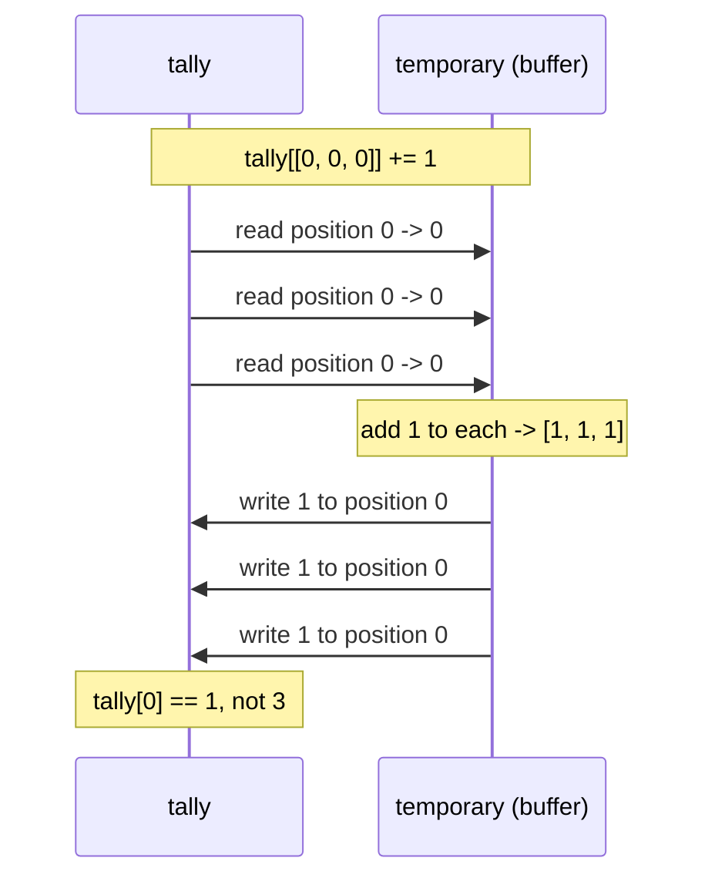

# 4.4 — `tally[walks] += 1` — the update that counted once

## One-line answer

When a position appears more than once in a fancy index, an in-place update applies **once**, not
once per occurrence — because `arr[idx] += 1` is a read, an add and a write, and the reads all happen
before any of the writes.

---

## The story

A club keeps a tally on a whiteboard of how many times each member has been to the Tuesday walk.

Three people arrive at once and hand their cards to the volunteer at the door. All three cards say
the same name, because it is one family and they share a membership.

The volunteer does what anyone does with three cards. They look up the name on the board — it says
4 — write "4 plus one is 5" on a sticky note for each card, and then go and update the board. Three
sticky notes, all of them saying 5. They write 5 on the board three times.

The board now says 5. Three visits were handed in, and the tally went up by one.

Nobody did anything careless. The volunteer read the board before doing any of the writing, which is
the natural way to work through a pile of cards. It is only wrong because the same name came up
twice, and nothing in the procedure noticed.

---

## The idea in plain language

`tally[walks] += 1` looks like one operation and is three. Python expands it into:

1. **Read** — gather the values at every position in `walks` into a temporary array
   ([4.1](4.1-a-list-of-positions.md), and this gather is where the copy happens).
2. **Add** — add 1 to every value in the temporary.
3. **Write** — scatter the temporary back out to those same positions.

The read finishes completely before the write starts. So if position 0 appears three times, all three
reads see the same original value, all three get "original plus one", and all three write that same
result back. The last write wins, and the other two were identical to it anyway.

The general name for this is a **lost update**: two changes are computed from the same starting value
and one of them overwrites the other. It is the same shape of bug as two threads incrementing a
counter ([Day 19, 4.3](../../../day-19-typing-dataclasses-and-concurrency/parts/04-concurrency/4.3-threads.md)),
and it is worth noticing that here it happens with no threads at all — the "concurrency" is inside a
single NumPy call.

Plain assignment has the same shape and a clearer symptom. `arr[[0, 0, 0]] = [10, 20, 30]` writes
three values into one position, in order, so the position ends up holding `30`. **Last write wins**, no
warning, and the first two values are simply gone.

NumPy provides the operation you actually wanted, and it is called **unbuffered**:
`np.add.at(tally, walks, 1)` applies the addition once per occurrence, in order, with no temporary in
between. The `.at` method exists on every ufunc — `np.add.at`, `np.subtract.at`, `np.maximum.at` —
and the ufunc machinery it belongs to is
[Day 23, 1.7](../../../day-23-ufuncs-and-statistics/parts/01-ufuncs/1.7-reduce-accumulate-and-at.md).

For the specific job of counting occurrences, there is a better tool still: `np.bincount(positions)`
counts how many times each position appears, and `np.bincount(positions, weights=values)` sums a value
per occurrence. It is the specialised function for the commonest case, and — like `np.clip` in
[3.4](../03-boolean-masks/3.4-assigning-through-a-mask.md) — the specialised function is the one to
reach for when it fits.

---

## Why Setu needs it

- **Day 117's bag-of-words** counts how often each token appears by scattering token positions into a
  vocabulary-sized array. Written with `+=` it reports every document as having one of each word.
- **Day 84's histogram** by hand is this operation, and it is why `np.histogram` and `np.bincount`
  exist.
- **Day 130's gradient accumulation** adds a gradient into one embedding row per token, and the same
  token appearing twice in a batch is normal rather than rare — this is the single most common place
  the bug appears in real machine-learning code.
- **Day 155's vector index** counts how many documents landed in each cluster.
- **Day 199's usage metering** adds a token count into a per-user array, where one user making several
  requests in a batch is the expected case, not the edge case.

---

## The mechanism

The same tally, three ways:

```python
import numpy as np

tally = np.zeros(7, dtype=np.int64)
walks = np.array([0, 0, 0, 3, 3, 6])

tally[walks] += 1
print("with += :", tally)

tally_again = np.zeros(7, dtype=np.int64)
np.add.at(tally_again, walks, 1)
print("add.at  :", tally_again)

counted = np.bincount(walks, minlength=7)
print("bincount:", counted)

last_wins = np.zeros(7, dtype=np.int64)
last_wins[[0, 0, 0]] = [10, 20, 30]
print("assign  :", last_wins)
```

**Line by line:**

- `walks` — six visits by members 0, 0, 0, 3, 3 and 6. Member 0 walked three times, which is exactly
  the case the naive version cannot see.
- `tally[walks] += 1` — the broken one. Six reads of a zeroed array, six values of 1 computed, six
  writes of 1. Positions 0 and 3 each end up at 1 rather than 3 and 2.
- `np.add.at(tally_again, walks, 1)` — the unbuffered version. It applies the addition one occurrence
  at a time, so position 0 goes 0, 1, 2, 3. **Note the argument order**: the array first, then the
  positions, then the value.
- `np.bincount(walks, minlength=7)` — counts occurrences directly. `minlength=7` forces the result to
  cover all seven members even though nobody in this data is member 4, 5 or 2; without it the result
  would stop at the largest position seen, and two runs would produce arrays of different lengths.
- `last_wins[[0, 0, 0]] = [10, 20, 30]` — plain assignment with a repeated position. `30` survives.
  There is no rule to remember beyond "in order, last one wins", and no warning that two values were
  discarded.

```text
with += : [1 0 0 1 0 0 1]
add.at  : [3 0 0 2 0 0 1]
bincount: [3 0 0 2 0 0 1]
assign  : [30  0  0  0  0  0  0]
```

Six visits, and the first line accounts for three of them.

Why the buffered version loses updates:



Every read happens before every write. That is the whole mechanism, and once you have seen this
diagram the behaviour stops being surprising and starts being obvious.

The unbuffered version interleaves instead:

```python
import numpy as np

tally = np.zeros(4, dtype=np.int64)
positions = np.array([1, 1, 2])

for step, p in enumerate(positions, start=1):
    tally[p] += 1
    print(f"after visit {step} (member {p}):", tally)

vectorised = np.zeros(4, dtype=np.int64)
np.add.at(vectorised, positions, 1)
print("np.add.at gives          :", vectorised)
print("same as the loop         :", np.array_equal(tally, vectorised))
```

**Line by line:**

- The `for` loop applies one update at a time, so each iteration reads the value the previous one
  wrote. This is what "unbuffered" means, and writing it out once makes `np.add.at` self-explanatory.
- `enumerate(positions, start=1)` — counting from 1 for readable output
  ([Day 6, 1.3](../../../day-06-loops/parts/01-iteration/1.3-enumerate-and-zip.md)).
- `np.add.at(vectorised, positions, 1)` — the same sequence of updates, without the Python loop.
- `np.array_equal(tally, vectorised)` — the loop is the specification and `np.add.at` is the fast
  implementation of it. **If you are unsure what an unbuffered operation will do, write the loop
  first**; it is slow and it is never ambiguous.

```text
after visit 1 (member 1): [0 1 0 0]
after visit 2 (member 1): [0 2 0 0]
after visit 3 (member 2): [0 2 1 0]
np.add.at gives          : [0 2 1 0]
same as the loop         : True
```

---

## When it breaks

**The count that came out as ones:**

```text
$ uv run python -c "
import numpy as np
tokens = np.array([2, 7, 2, 2, 7, 0])
counts = np.zeros(8, dtype=np.int64)
counts[tokens] += 1
print('counts  :', counts)
print('total   :', counts.sum(), 'from', tokens.size, 'tokens')
"
counts  : [1 0 1 0 0 0 0 1]
total   : 3 from 6 tokens
```

**What it means.** Six tokens went in and the counts add up to three. There is no error, and the
result is a perfectly plausible-looking array of counts — which is why this survives review. The
check that catches it every time is the one on the last line: **assert that the total equals the
number of items you put in.** For a count that is exact; for a weighted sum it is
`np.isclose(result.sum(), weights.sum())`.

**The assignment that kept only the last value:**

```text
$ uv run python -c "
import numpy as np
prices = np.zeros(4)
items = np.array([1, 1, 3])
prices[items] = np.array([9.99, 4.50, 2.00])
print('prices :', prices)
print('the 9.99 is gone, and nothing said so')
"
prices : [0.  4.5 0.  2. ]
the 9.99 is gone, and nothing said so
```

**What it means.** Two values were written to position 1 and the second one won. If the intent was
"the latest price for each item", this is correct and you should say so in a comment. If the intent
was "the total for each item", it is wrong by however much the earlier values were, and
`np.add.at(prices, items, values)` is the fix. The dangerous part is that both intents produce
identical-looking code.

**The `.at` argument order, got wrong:**

```text
$ uv run python -c "
import numpy as np
tally = np.zeros(7, dtype=np.int64)
np.add.at(tally, 1, np.array([0, 0, 3]))
print(tally)
"
Traceback (most recent call last):
  File "<string>", line 4, in <module>
ValueError: array is not broadcastable to correct shape
```

**What it means.** The positions and the values were swapped: this asks to add three numbers into the
single position 1, and one slot cannot hold three values. The message is terse because it comes from
deep inside the ufunc machinery and never mentions `at`, positions or your array's name. Read it as
*"the values do not line up with the positions"*, then check the argument order, which is
`np.add.at(array, positions, values)` — *"at these positions of this array, add this"*. It is worth
saying that sentence out loud as you type the call.

**The one that does raise, for contrast:**

```text
$ uv run python -c "
import numpy as np
tally = np.zeros(7, dtype=np.int64)
np.add.at(tally, np.array([0, 1, 2]), np.array([1.5, 2.5, 3.5]))
print(tally)
"
[1 2 3 0 0 0 0]
```

**What it means.** Floats added into an integer array, truncated to `1`, `2`, `3` without a word —
the same silent narrowing as plain masked assignment
([3.4](../03-boolean-masks/3.4-assigning-through-a-mask.md)), because `.at` writes into the existing
block and the block holds integers. The lesson is the one from
[Day 20, 2.1](../../../day-20-arrays-and-dtypes/parts/02-dtypes/2.1-a-dtype-is-a-promise.md): allocate
the accumulator with the dtype the answer needs, before you start adding to it.

---

## In production

**What a professional writes instead of the teaching version.** They use the specialised function, and
they assert the total:

```python
import time

import numpy as np

rng = np.random.default_rng(21)
n_bins = 1_000
positions = rng.integers(0, n_bins, size=5_000_000)
weights = rng.random(5_000_000)
positions.sum()

a = np.zeros(n_bins)
start = time.perf_counter()
a[positions] += weights
wrong_time = time.perf_counter() - start

b = np.zeros(n_bins)
start = time.perf_counter()
np.add.at(b, positions, weights)
at_time = time.perf_counter() - start

start = time.perf_counter()
c = np.bincount(positions, weights=weights, minlength=n_bins)
bincount_time = time.perf_counter() - start

print(f"a[pos] += w : {wrong_time * 1000:8.1f} ms, total {a.sum():12.2f}  (WRONG)")
print(f"np.add.at   : {at_time * 1000:8.1f} ms, total {b.sum():12.2f}")
print(f"np.bincount : {bincount_time * 1000:8.1f} ms, total {c.sum():12.2f}")
print(f"weights sum : {weights.sum():12.2f}")
print("add.at == bincount :", np.allclose(b, c))
```

**Line by line:**

- Five million updates into a thousand bins, so **every bin is hit about five thousand times** — the
  repeated-position case is not an edge here, it is the entire workload.
- `a[positions] += weights` — the buffered version. It also allocates a five-million-element temporary
  for the gather, which is why it is the slowest of the three as well as the wrong one.
- `np.add.at(b, positions, weights)` — unbuffered and correct.
- `np.bincount(positions, weights=weights, minlength=n_bins)` — the specialised function, which
  allocates the result itself rather than adding into an array you supply.
- `weights.sum()` printed last — **the assertion, as a printed number.** The correct totals match it;
  the wrong one is short by a factor of about five thousand, which is exactly the number of collisions
  per bin.

```text
a[pos] += w :     30.0 ms, total       488.50  (WRONG)
np.add.at   :      7.6 ms, total   2498418.12
np.bincount :      7.2 ms, total   2498418.12
weights sum :   2498418.12
add.at == bincount : True
```

Note that the wrong answer is also the slowest, which is unusual and worth saying plainly: there is no
speed argument for the buffered version. On this machine and this NumPy, `np.add.at` and
`np.bincount` are within a few per cent of each other. That has not always been true — `np.add.at` was
notoriously slow in older NumPy and a great deal of code was written to avoid it — which is a good
reason to measure on the version you are actually running rather than to trust remembered advice.

**What changes at scale.** The collision rate is what matters, and it grows as the data grows against
a fixed number of bins. With five million updates into a thousand bins there are thousands of
collisions per bin, so the buffered version is not slightly wrong — it reports a total five thousand
times too small. The second effect is the accumulator's dtype: counting five million events into an
`int32` array is fine, and summing five million weights into a `float32` accumulator loses precision
steadily as the running total grows, which is
[Day 23, 2.6](../../../day-23-ufuncs-and-statistics/parts/02-statistics/2.6-float-summation-and-the-drift.md)'s
subject. Accumulators are `float64` unless you have measured a reason.

**The failure that only appears with real data.** A metering service added each request's token count
into a per-customer array with `usage[customer_ids] += tokens`. In testing, batches were small and each
customer appeared at most once, so the totals were right. In production, batches were large and the
top customers appeared many times per batch, so exactly the busiest accounts were the most
under-billed. The bug had a bias: it was invisible for small customers and grew with usage.

**The review comment a senior engineer leaves.** *"`counts[idx] += 1` with duplicate positions in
`idx` only counts each position once — that is a buffered read-modify-write. Use `np.bincount(idx,
minlength=n)` here, and add an assertion that the total equals `len(idx)`, because the failure is
silent."*

**The interview question.** *"What does `a[[0, 0, 0]] += 1` do?"* It adds 1 once, not three times.
`+=` on a fancy index expands to a gather, an add on the gathered temporary, and a scatter back, so
every read sees the original value and the three writes store the same result — a lost update, with no
threads involved. The fix is `np.add.at(a, idx, 1)`, which is unbuffered and applies each update in
turn, or `np.bincount` when the job is counting. The detail that shows you have hit this in anger:
the check that catches it is asserting that the sum of the result equals the number of updates you
applied, because nothing about the wrong answer looks wrong.

---

## Check yourself

```bash
uv run python -c "
import numpy as np
visits = np.array([0, 0, 1, 1, 1, 3])
buffered = np.zeros(4, dtype=np.int64)
buffered[visits] += 1
unbuffered = np.zeros(4, dtype=np.int64)
np.add.at(unbuffered, visits, 1)
print('buffered   :', buffered, 'total', buffered.sum())
print('unbuffered :', unbuffered, 'total', unbuffered.sum())
print('bincount   :', np.bincount(visits, minlength=4))
print('visits     :', visits.size)
"
```

Two of the three totals equal the number of visits. Say which line you would have shipped.

**Answer out loud, without scrolling up:**

> `tally[[2, 2, 2]] += 1` leaves `tally[2]` one higher, not three. Explain why in terms of reads and
> writes, and name the two functions that do it correctly.

---

**Next:** [4.5 — mixing a slice with a list](4.5-mixing-a-slice-with-a-list.md).
