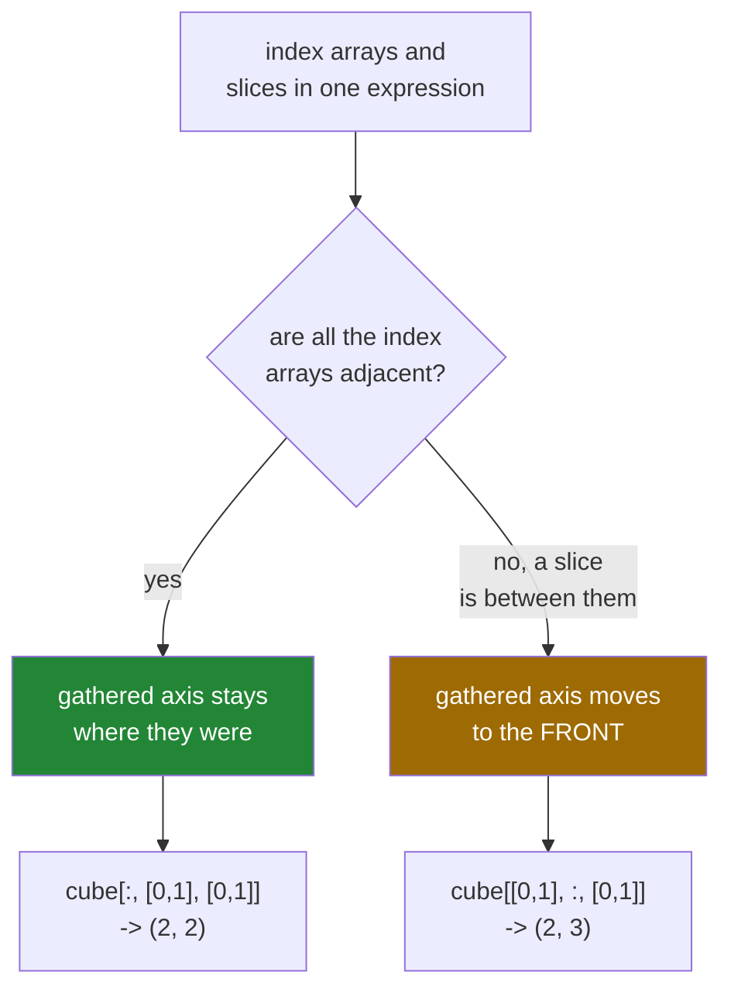

# 4.5 — `cube[[0, 1], :, [0, 1]]` — mixing a slice with a list, and where the axis goes

## One-line answer

When index arrays sit next to each other the result keeps its axes where you expect, and when a slice
separates them the gathered axis jumps to the **front** — a rule you should know exists and then
avoid relying on.

---

## The story

Somebody is filling in a form that has been photocopied badly.

Three boxes on the form ask for a date, a reference number and a signature, in that order. On the
photocopy, the reference box has slipped to the top of the page, above the date. The person filling
it in writes their answers in the order the questions are asked, because that is what anyone does,
and the finished form has the reference in the wrong place.

Nothing was misread. Every answer is correct. The layout moved and the person filling it in did not
notice, because the boxes are still all there and each one still has the right thing in it.

The form comes back rejected a week later, and the reason is not that an answer was wrong. It is that
the machine reading it expected the reference on line two.

---

## The idea in plain language

You have met index arrays on one axis ([4.1](4.1-a-list-of-positions.md)) and on two
([4.2](4.2-two-index-arrays.md)). This part is about what happens when an index expression contains
**both** index arrays and slices, which is the ordinary case for anything three-dimensional.

Two facts, and then the rule that trips people.

**Fact one.** The index arrays are broadcast against each other into one shape — the *gathered* shape.
Two lists of two positions give a gathered shape of `(2,)`; a `(3, 1)` and a `(1, 4)` give `(3, 4)`.

**Fact two.** The sliced axes keep their own sizes and their own order.

The question is where the gathered shape goes among the sliced axes, and NumPy answers it with a rule
that exists for a genuine reason and surprises everybody:

- **If the index arrays are all next to each other** in the expression, the gathered shape is placed
  where they were. `cube[:, [0, 1], [0, 1]]` has its index arrays in positions 1 and 2, so the result
  is `(2, 2)`: the slice's axis first, then the gathered axis.
- **If a slice separates them**, the gathered shape is placed **first**, before every sliced axis.
  `cube[[0, 1], :, [0, 1]]` has its index arrays in positions 0 and 2 with a slice between them, so
  the result is `(2, 3)`: the gathered axis, then the slice's axis.

The reason is that in the separated case there is no single place the gathered axis obviously belongs
— it came from two axes that are not adjacent — so NumPy puts it somewhere predictable rather than
somewhere arbitrary. The documentation calls this behaviour "not intuitive", which is unusually
candid, and the practical advice follows from that admission: **do not write the separated form.**

Three named tools express the common intentions without the rule:

- **`np.ix_(rows, cols)`** — every combination, the grid ([4.2](4.2-two-index-arrays.md)).
- **`np.take(arr, positions, axis=n)`** — positions along one named axis, everything else untouched.
  `np.take(month, [0, 3], axis=1)` is `month[:, [0, 3]]` with the axis stated out loud.
- **`np.take_along_axis(arr, positions, axis=n)`** — one position per row along an axis, where the
  positions came from `argmax`, `argsort` or `argpartition`. It is the readable form of the
  `arr[np.arange(n), best]` pair index from [4.2](4.2-two-index-arrays.md), and it generalises to any
  number of axes.

Each of these says which axis it is working on, which means the reader does not have to reconstruct
it from the shape of the expression.

---

## Why Setu needs it

- **Day 130's image batches** are `(batch, height, width, channel)`, and selecting some images and
  some channels at once is exactly the separated case.
- **Day 141's attention** works on `(batch, head, position, feature)` and gathers a selected position
  per batch. Getting the axis order wrong there produces a tensor of the right size and the wrong
  meaning, which trains without complaint.
- **Day 23's top-k** uses `np.take_along_axis` to turn `argsort` positions back into values, and doing
  it by hand on a two-dimensional score matrix is where this rule first bites
  ([Day 23, 3.3](../../../day-23-ufuncs-and-statistics/parts/03-sorting-and-searching/3.3-top-k-with-argpartition.md)).
- **Day 84's pivot tables** select a set of rows and a set of columns, which is `np.ix_`.
- **Day 137's debugging** of a model that trains but does not learn very often ends at a silently
  transposed tensor, and this rule is one of the two ways to produce one.

---

## The mechanism

Every combination of slice and list on a three-dimensional array:

```python
import numpy as np

cube = np.arange(24).reshape(2, 3, 4)
print("cube shape                 :", cube.shape)
print("cube[:, [0, 1], :]         :", cube[:, [0, 1], :].shape)
print("cube[:, [0, 1], [0, 1]]    :", cube[:, [0, 1], [0, 1]].shape)
print("cube[[0, 1], :, [0, 1]]    :", cube[[0, 1], :, [0, 1]].shape)
print("cube[[0, 1], [0, 1], :]    :", cube[[0, 1], [0, 1], :].shape)
print("cube[:, :, [0, 1]]         :", cube[:, :, [0, 1]].shape)
```

**Line by line:**

- `np.arange(24).reshape(2, 3, 4)` — each value equals its own flat position, so any shape confusion
  can be traced back to actual numbers. Think of it as two sheets, each three rows by four columns.
- `cube[:, [0, 1], :]` — **one** index array, so there is nothing to separate. Its axis stays in
  place: `(2, 2, 4)`.
- `cube[:, [0, 1], [0, 1]]` — two index arrays, **adjacent**, in positions 1 and 2. They broadcast to
  `(2,)` and that axis is placed where they were, after the sliced axis: `(2, 2)`.
- `cube[[0, 1], :, [0, 1]]` — two index arrays, **separated** by the slice. The gathered `(2,)` jumps
  to the front, ahead of the slice's 3: `(2, 3)`. Compare it with the line above — the same three
  index components, one of them moved, and the result is a different shape with a different meaning.
- `cube[[0, 1], [0, 1], :]` — adjacent again, at the front, so `(2, 4)`.
- `cube[:, :, [0, 1]]` — one index array on the last axis, everything in place: `(2, 3, 2)`.

```text
cube shape                 : (2, 3, 4)
cube[:, [0, 1], :]         : (2, 2, 4)
cube[:, [0, 1], [0, 1]]    : (2, 2)
cube[[0, 1], :, [0, 1]]    : (2, 3)
cube[[0, 1], [0, 1], :]    : (2, 4)
cube[:, :, [0, 1]]         : (2, 3, 2)
```

The rule, drawn:



In two dimensions there is no room for a separating slice, so the rule never fires and the mixed forms
behave the way you would guess:

```python
import numpy as np

month = np.arange(28).reshape(4, 7)

print("month[1:3, [3, 4]] :", month[1:3, [3, 4]].shape)
print(month[1:3, [3, 4]])
print("month[[1, 2], 3:5] :", month[[1, 2], 3:5].shape)
print(month[[1, 2], 3:5])
```

**Line by line:**

- `month[1:3, [3, 4]]` — rows by slice, columns by list. The result is `(2, 2)` and the axes are in the
  order you wrote them.
- `month[[1, 2], 3:5]` — the same selection with the roles swapped, and the same `(2, 2)` result with
  the same values.
- Both are advanced expressions, so both copy ([4.3](4.3-fancy-indexing-always-copies.md)), and
  neither can reorder anything because there is only one index array in each.

```text
month[1:3, [3, 4]] : (2, 2)
[[10 11]
 [17 18]]
month[[1, 2], 3:5] : (2, 2)
[[10 11]
 [17 18]]
```

The named alternative, which never depends on the rule at all:

```python
import numpy as np

month = np.arange(28).reshape(4, 7)

best = month.argmax(axis=1)
picked = np.take_along_axis(month, best[:, None], axis=1)
print("argmax per row :", best)
print("take_along_axis:", picked.shape)
print(picked)
print("squeezed       :", picked.squeeze(axis=1))
print("np.take axis=1 :", np.take(month, [0, 3], axis=1).shape)
```

**Line by line:**

- `month.argmax(axis=1)` — the position of the largest value in each row, one per row, so `(4,)`.
- `best[:, None]` — reshaped to `(4, 1)`, because `take_along_axis` wants the positions to have the
  same number of axes as the array. `None` here is `np.newaxis`
  ([1.6](../01-one-element/1.6-ellipsis-and-newaxis.md)).
- `np.take_along_axis(month, best[:, None], axis=1)` — **"along axis 1, take the position given for
  each row"**. The `axis=1` is written down, so the reader does not deduce it from the bracket layout.
- `picked.shape` is `(4, 1)` — the axis is kept, not dropped, which is deliberate: the result has the
  same rank as the input, so it can be broadcast against it without any further reshaping
  ([Day 22, 1.4](../../../day-22-broadcasting-and-shape/parts/01-broadcasting/1.4-keepdims-and-the-column.md)).
- `.squeeze(axis=1)` — drops that length-1 axis when you want a flat answer, naming the axis so it
  cannot silently drop a different one.
- `np.take(month, [0, 3], axis=1)` — two columns, with the axis stated. `month[:, [0, 3]]` is the same
  thing and needs the reader to count colons.

```text
argmax per row : [6 6 6 6]
take_along_axis: (4, 1)
[[ 6]
 [13]
 [20]
 [27]]
squeezed       : [ 6 13 20 27]
np.take axis=1 : (4, 2)
```

---

## When it breaks

**The axis that moved, with no error:**

```text
$ uv run python -c "
import numpy as np
batch = np.arange(24).reshape(2, 3, 4)
adjacent = batch[:, [0, 1], [0, 1]]
separated = batch[[0, 1], :, [0, 1]]
print('adjacent  :', adjacent.shape, adjacent.tolist())
print('separated :', separated.shape, separated.tolist())
"
adjacent  : (2, 2) [[0, 5], [12, 17]]
separated : (2, 3) [[0, 4, 8], [13, 17, 21]]
```

**What it means.** Two expressions that a reader would describe with almost the same sentence, giving
two different shapes and two different sets of values. Neither raises. In a pipeline where the next
step reduces over `axis=0`, the separated version reduces over the gathered axis and the adjacent one
reduces over the batch, and both produce a number. This is how a shape bug survives to production: the
program does not stop, it just answers a different question.

**The one that does raise, and is therefore kind:**

```text
$ uv run python -c "
import numpy as np
batch = np.arange(24).reshape(2, 3, 4)
print(batch[[0, 1], :, [0, 1, 2]])
"
Traceback (most recent call last):
  File "<string>", line 4, in <module>
IndexError: shape mismatch: indexing arrays could not be broadcast together with shapes (2,) (3,)
```

**What it means.** The two index arrays cannot be broadcast against each other, so the expression is
rejected before any axis reordering can happen. It is the same error as in
[4.2](4.2-two-index-arrays.md), and it is worth noticing that this is the *good* case: a mismatch that
raises costs a minute, and a mismatch that broadcasts costs an afternoon.

**The squeeze that removed the wrong axis:**

```text
$ uv run python -c "
import numpy as np
scores = np.arange(4).reshape(1, 4)
best = scores.argmax(axis=1)
picked = np.take_along_axis(scores, best[:, None], axis=1)
print('picked shape   :', picked.shape)
print('squeeze()      :', picked.squeeze().shape)
print('squeeze(axis=1):', picked.squeeze(axis=1).shape)
"
picked shape   : (1, 1)
squeeze()      : ()
squeeze(axis=1): (1,)
```

**What it means.** A bare `.squeeze()` removes **every** axis of length 1, and a batch of one is
length 1. So a function that works on a batch of 32 returns a `(32,)` array, and the same function on
a batch of 1 returns a bare number with no axes at all — after which anything that indexes the result
raises `IndexError: too many indices`. Always name the axis: `.squeeze(axis=1)`. The batch-of-one case
appears in exactly one place, which is production, on the request that arrives on its own.

---

## In production

**What a professional writes instead of the teaching version.** They never rely on the reordering
rule; they select on one axis at a time, or they name the axis:

```python
import numpy as np


def top_k_per_row(scores: np.ndarray, k: int) -> tuple[np.ndarray, np.ndarray]:
    """Return the positions and values of each row's k largest scores, best first.

    ``scores`` is (n_rows, n_items). Both results are (n_rows, k), so a caller can
    line them up with the rows they came from without reshaping anything.
    """
    if scores.ndim != 2:
        raise ValueError(f"expected (rows, items), got shape {scores.shape}")
    if not 1 <= k <= scores.shape[1]:
        raise ValueError(f"k must be between 1 and {scores.shape[1]}, got {k}")
    unsorted_top = np.argpartition(-scores, kth=k - 1, axis=1)[:, :k]
    top_values = np.take_along_axis(scores, unsorted_top, axis=1)
    order = np.argsort(-top_values, axis=1)
    positions = np.take_along_axis(unsorted_top, order, axis=1)
    values = np.take_along_axis(scores, positions, axis=1)
    return positions, values
```

**Line by line:**

- `-> tuple[np.ndarray, np.ndarray]` — positions and values, both `(n_rows, k)`. Returning both is the
  point: positions alone need a second lookup, values alone cannot be traced back to an item.
- `np.argpartition(-scores, kth=k - 1, axis=1)` — the k largest per row, **not in order**, in linear
  time rather than by sorting the whole row. Negating turns "largest" into "smallest", which is the
  standard trick, and `axis=1` is stated. `argpartition` is
  [Day 23, 3.3](../../../day-23-ufuncs-and-statistics/parts/03-sorting-and-searching/3.3-top-k-with-argpartition.md)'s
  subject; here it is a source of positions.
- `[:, :k]` — a **slice**, applied on its own line, after the advanced indexing is finished. Mixing it
  into the same brackets is what would have invoked the reordering rule.
- `np.take_along_axis(scores, unsorted_top, axis=1)` — the values at those positions, per row. The
  hand-written equivalent is `scores[np.arange(scores.shape[0])[:, None], unsorted_top]`, which is the
  same thing and takes three readings to check.
- `np.argsort(-top_values, axis=1)` — sorting only the k values that survived, not the whole row. On
  a row of 100 000 items with `k=10` this is the difference between sorting ten values and sorting a
  hundred thousand.
- `np.take_along_axis(unsorted_top, order, axis=1)` — reordering the **positions** by the order of
  their values. This is the step people skip, and skipping it returns the right ten items in an
  arbitrary order.
- Every gather names `axis=1`. Not one of them depends on where NumPy would have placed a gathered
  axis, which is what makes this function readable a year later.

**What changes at scale.** Two things. The intermediate arrays are `(n_rows, k)` rather than
`(n_rows, n_items)`, which is the reason `argpartition` is used at all: on a million items per row,
sorting to get ten is a thousand times more work than partitioning. And the axis conventions stop
being a matter of taste — every library at the other end of this data has one, `(batch, features)`
here and `(features, batch)` there, and a silently reordered axis is not caught by any shape assertion
that only checks sizes. Real code asserts the shape *and* the meaning:
`assert positions.shape == (scores.shape[0], k)` on the way out.

**The failure that only appears with real data.** An evaluation script gathered per-example scores
from a `(examples, models, metrics)` array with `results[example_ids, :, metric_ids]`. The index
arrays were separated by a slice, so the gathered axis moved to the front and the result was
`(n_selected, n_models)` rather than the `(n_models, n_selected)` the plotting code expected. Both
dimensions were about the same size in the test fixture, so the plot looked plausible for weeks. It
only became obvious when a new model was added and the two sizes stopped matching, at which point a
month of reported numbers had to be regenerated.

**The review comment a senior engineer leaves.** *"`arr[ids, :, channels]` puts the gathered axis
first because the two index arrays are separated by a slice — the result is not the shape the
docstring claims. Use `np.take` twice, or `np.ix_`, and assert the output shape."*

**The interview question.** *"What shape does `a[[0, 1], :, [0, 1]]` have for `a` of shape
`(2, 3, 4)`?"* `(2, 3)` — the two index arrays broadcast to `(2,)`, and because a slice separates
them, that gathered axis is placed first, ahead of the sliced axis of length 3. If the index arrays
had been adjacent, as in `a[:, [0, 1], [0, 1]]`, the gathered axis would stay in place and the result
would be `(2, 2)`. The answer that matters more than the rule is what to do about it: use
`np.take(..., axis=n)`, `np.take_along_axis(..., axis=n)` or `np.ix_`, all of which name the axis, and
assert the output shape — because getting this wrong produces a transposed array rather than an
exception.

---

## Check yourself

```bash
uv run python -c "
import numpy as np
cube = np.arange(24).reshape(2, 3, 4)
for label, sel in [
    ('cube[:, [0,1], :]', cube[:, [0, 1], :]),
    ('cube[:, [0,1], [0,1]]', cube[:, [0, 1], [0, 1]]),
    ('cube[[0,1], :, [0,1]]', cube[[0, 1], :, [0, 1]]),
    ('np.take(cube, [0,1], axis=1)', np.take(cube, [0, 1], axis=1)),
]:
    print(f'{label:<30} {sel.shape}')
"
```

Write down all four shapes before you run it. The last line is the one you should be writing in real
code; say why.

**Answer out loud, without scrolling up:**

> Two index arrays with a slice between them. Where does the gathered axis end up, and which two
> functions let you avoid ever needing to know?

---

**Next:** [5.1 — the leak a view causes](../05-in-anger/5.1-the-leak-a-view-causes.md).
