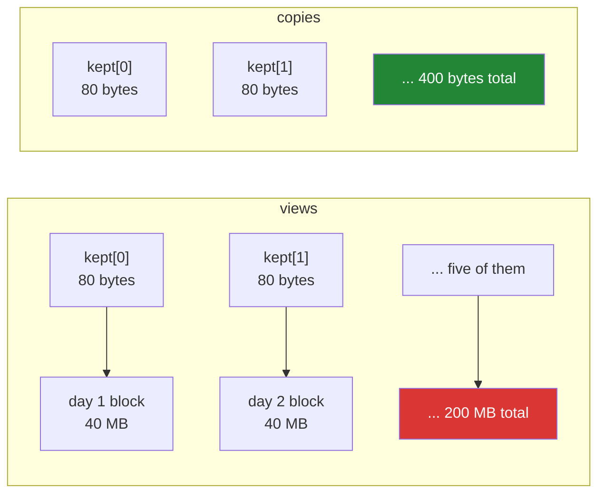

# 5.1 — 400 bytes that held 200 megabytes — the leak a view causes

## One-line answer

A view keeps its parent array alive for as long as the view exists, so keeping ten numbers out of a
five-million-number array keeps all five million in memory — and nothing about the ten numbers says
so.

---

## The story

Somebody clears out a garage over a weekend. Five big boxes go to the tip, and from each box they
keep one small thing: a photograph, a key, a badge, a ticket stub, a receipt.

At the last minute they decide the small things need to stay with their boxes so they can remember
where each one came from. So they put the photograph back in box one, the key back in box two, and
push all five boxes back against the wall.

The garage is exactly as full as it was. Five small things are being kept, and five boxes of junk are
being kept with them, and if anyone asks what is in the garage the honest answer is "five things I
wanted".

Nobody would do this with boxes. It is completely invisible when the boxes are arrays.

---

## The idea in plain language

Python frees an object when nothing is pointing at it any more. That mechanism is called **reference
counting**, and it is why you have never had to free anything by hand.

A view points at its parent. `arr.base` is that pointer
([2.2](../02-the-view-trap/2.2-how-to-tell-base-and-shares-memory.md)), and it exists because the view
has no data of its own: its numbers live inside the parent's block, so the parent must not be freed
while the view can still be read. Python does the right thing and keeps the parent alive.

The consequence is the whole part. **A small view of a large array keeps the whole large array in
memory.** Ten values out of five million is 80 bytes of interest and 40 megabytes of consequence. The
view reports `nbytes` of 80, `len` of 10, and prints as ten numbers — every observation you can make
about it says "small".

This is not a bug in NumPy and it is not a memory leak in the strict sense. Nothing is unreachable;
everything is exactly as reachable as the language says it should be. It is worse than a leak in one
respect: a leak has a cause you can find with a tool, and this has a cause that looks like ordinary
correct code.

Three shapes it takes in real systems, all of them the same mistake:

**A function that loads something large and returns a small piece of it.** The caller keeps the small
piece, the whole file stays in memory, and the function looks blameless because it returned a small
array.

**A cache of small results.** Each entry pins the request-sized array it was computed from. Memory
grows in proportion to the number of *distinct* cached keys, and the graph looks like a slow leak.

**A long-lived object holding a slice of a short-lived one.** A summary object built during startup
that holds `readings[:100]` keeps the startup data for the process's whole life.

The fix in every case is one call — `.copy()` — placed where the small piece stops being temporary
and starts being kept. The rule to write on the wall: **copy at the boundary where data outlives its
producer.**

---

## Why Setu needs it

- **Day 26 onwards, every Pandas operation** rests on this; a filtered frame that keeps a view of a
  much larger one is the same problem wearing a different name.
- **Day 130's data loader** keeps augmentation statistics per batch. A statistic that is a view of the
  batch keeps every batch alive, and the training run's memory climbs until it is killed.
- **Day 156's vector store** caches query results. Each result is a handful of vectors, and if those
  are views of the full matrix the cache pins the entire index once per query.
- **Day 226 profiles a service** whose memory grows without a leak, and this is the first thing to
  look for.
- **Day 199's request handlers** return small summaries computed from large payloads, which is
  precisely the first shape above.

---

## The mechanism

The same five readings, kept two ways, with the memory measured rather than argued about:

```python
import tracemalloc

import numpy as np


def read_day(rng: np.random.Generator) -> np.ndarray:
    """One day's readings: 5 million values, of which we keep the first ten."""
    day = rng.random(5_000_000)
    return day[:10]


def read_day_copied(rng: np.random.Generator) -> np.ndarray:
    day = rng.random(5_000_000)
    return day[:10].copy()


for label, reader in (("views", read_day), ("copies", read_day_copied)):
    rng = np.random.default_rng(21)
    tracemalloc.start()
    kept = [reader(rng) for _ in range(5)]
    current, peak = tracemalloc.get_traced_memory()
    tracemalloc.stop()
    held = sum(k.nbytes for k in kept)
    print(
        f"{label:<7} kept {held:>4,} bytes of readings, "
        f"process still holding {current:>12,} bytes (peak {peak:,})"
    )
```

**Line by line:**

- `tracemalloc` — the standard library's memory tracker. `start()` begins recording every allocation,
  `get_traced_memory()` returns the bytes currently held and the highest the total ever reached. It is
  the honest way to make this claim, because a printed `nbytes` would agree with the wrong answer.
- `day = rng.random(5_000_000)` — 40 MB allocated inside the function. It is a local name, so it
  becomes unreachable when the function returns — unless something else points at it.
- `return day[:10]` — a slice, therefore a view ([1.3](../01-one-element/1.3-slicing-one-axis.md)),
  therefore a pointer to `day`. `day` cannot be freed.
- `return day[:10].copy()` — the same ten values in their own 80-byte block. Nothing points at `day`
  any more, so the 40 MB is freed as the function returns.
- `rng` created fresh before each run with the same seed, so both versions do identical work
  ([Day 20, 4.2](../../../day-20-arrays-and-dtypes/parts/04-random/4.2-the-seed-is-part-of-the-result.md)).
- `sum(k.nbytes for k in kept)` — what the program *thinks* it is holding. Compare it with what the
  process is actually holding, which is the entire point of the exercise.

```text
views   kept  400 bytes of readings, process still holding  200,001,176 bytes (peak 200,001,224)
copies  kept  400 bytes of readings, process still holding          976 bytes (peak 40,001,168)
```

Four hundred bytes of interest. Two hundred megabytes retained. The copy version's peak is 40 MB —
one day's data at a time — and it ends holding almost nothing.

What is actually pointing at what:



How to see it in an array you already have:

```python
import numpy as np

readings = np.random.default_rng(21).random(1_000_000)
sample = readings[::1000]

print("sample nbytes  :", sample.nbytes)
print("sample length  :", len(sample))
print("owns its data  :", sample.base is None)
print("parent nbytes  :", sample.base.nbytes)
print("ratio          :", sample.base.nbytes // sample.nbytes, "to 1")

detached = sample.copy()
print("copy owns data :", detached.base is None)
print("copy pins      :", 0, "bytes")
```

**Line by line:**

- `readings[::1000]` — every thousandth value, a thousand of them. It is a strided view, not a copy
  ([1.5](../01-one-element/1.5-the-step-and-the-reverse.md)), and the stride is why: evenly spaced
  positions can be described rather than gathered.
- `sample.nbytes` — 8 000. Everything the array will tell you about its own size is about the thousand
  values.
- `sample.base is None` — `False`, which is the one observation that reveals the situation. **This is
  the check to run on any small array you are about to keep.**
- `sample.base.nbytes` — 8 000 000. The number that matters, and the only place it is visible.
- `detached.base is None` — `True`. The copy owns its 8 000 bytes and pins nothing.

```text
sample nbytes  : 8000
sample length  : 1000
owns its data  : False
parent nbytes  : 8000000
ratio          : 1000 to 1
copy owns data : True
copy pins      : 0 bytes
```

---

## When it breaks

**The cache that grew without leaking:**

```text
$ uv run python -c "
import tracemalloc
import numpy as np

cache = {}
rng = np.random.default_rng(21)


def summary_for(key):
    payload = rng.random(2_000_000)
    return payload[:5]


tracemalloc.start()
for key in range(10):
    cache[key] = summary_for(key)
current, peak = tracemalloc.get_traced_memory()
tracemalloc.stop()
print('cache entries :', len(cache))
print('values held   :', sum(v.nbytes for v in cache.values()), 'bytes')
print('memory held   :', f'{current:,}', 'bytes')
"
cache entries : 10
values held   : 400 bytes
memory held   : 160,002,520 bytes
```

**What it means.** Ten cache entries holding forty bytes each, and 160 MB of process memory. There is
no error to catch and no traceback to read; the only symptom is a graph that climbs. A memory profiler
will point at the line that allocated `payload`, which has already returned and looks innocent. The
fix is `payload[:5].copy()` in `summary_for` — one call, at the boundary where the small thing starts
outliving the big one.

**The check that would have caught it:**

```text
$ uv run python -c "
import numpy as np

big = np.zeros(1_000_000)
kept = big[:3]
if kept.base is not None and kept.base.nbytes > 10 * kept.nbytes:
    raise ValueError(
        f'refusing to cache a view: {kept.nbytes} bytes of interest '
        f'pinning {kept.base.nbytes} bytes'
    )
"
Traceback (most recent call last):
  File "<string>", line 6, in <module>
ValueError: refusing to cache a view: 24 bytes of interest pinning 8000000 bytes
```

**What it means.** Four lines at the door of a cache, and the failure becomes loud. The ratio is a
judgement call — ten is a reasonable default — and the point is not the number but that the check
exists somewhere. A view whose parent is only twice its size is not worth copying; one whose parent is
a thousand times its size always is.

**The `del` that did not help:**

```text
$ uv run python -c "
import tracemalloc
import numpy as np

tracemalloc.start()
big = np.zeros(5_000_000)
small = big[:10]
del big
current, _ = tracemalloc.get_traced_memory()
print('after del big :', f'{current:,}', 'bytes still held')
print('small.base    :', 'still there' if small.base is not None else 'gone')
tracemalloc.stop()
"
after del big : 40,000,592 bytes still held
small.base    : still there
```

**What it means.** `del big` removes the **name**, not the object. `small.base` is still pointing at
the array, so the 40 MB stays. This is the moment people conclude that Python's memory management is
broken; it is doing exactly what it promised, and the pointer they cannot see is the one in
`small.base`. `small = small.copy()` before the `del` frees it.

---

## In production

**What a professional writes instead of the teaching version.** They put the copy at the boundary and
say why in one line:

```python
from __future__ import annotations

import numpy as np


def sample_readings(source: np.ndarray, every: int) -> np.ndarray:
    """Take every nth reading, detached from the source.

    The result is copied because callers keep samples for much longer than they keep the
    array the samples came from; a view here would pin the whole source (part 5.1).
    """
    if every < 1:
        raise ValueError(f"every must be at least 1, got {every}")
    sample = source[::every]
    return sample.copy()


def peek(source: np.ndarray, count: int = 5) -> np.ndarray:
    """First few readings for a log line. Not copied: the caller must not keep this."""
    view = source[:count].view()
    view.flags.writeable = False
    return view
```

**Line by line:**

- The two functions differ in **lifetime**, not in what they select. `sample_readings` returns
  something that will be kept, so it copies; `peek` returns something that is formatted into a log
  line and dropped, so it does not.
- The docstrings say which, and that is the interface. NumPy cannot express "do not keep this" in a
  type, so the sentence is the contract.
- `source[::every]` then `.copy()` — the strided view is built and immediately detached. Slicing first
  and copying second is cheaper than copying the whole array and then slicing.
- `source[:count].view()` — a new array object over the same memory, so the writeable flag can be
  cleared without touching `source`
  ([2.3](../02-the-view-trap/2.3-copy-and-when-to-pay.md)).
- `view.flags.writeable = False` — zero-cost protection. `peek` returns something that cannot be
  written to, which is the right shape for a value that is only ever read
  ([2.2](../02-the-view-trap/2.2-how-to-tell-base-and-shares-memory.md)).
- `if every < 1: raise` — `source[::0]` raises a `ValueError` from deep inside NumPy with no mention of
  `every`; this raises at the door with the caller's own argument in the message.

**What changes at scale.** The failure changes character. On a laptop this is a program that uses more
memory than it should; in a service it is an out-of-memory kill with no traceback, because the kernel
does not raise an exception when it stops a process. It is also the hardest kind of growth to
diagnose, because every standard tool agrees that nothing is leaking: the objects are reachable, the
reference counts are correct, and `gc.collect()` frees nothing. The way it is actually found is by
walking the large objects and asking which of them have something small pointing at them —
`arr.base is not None` on the small side is the question, and the four-line guard above is the fix.

Memory-mapped arrays are the exception worth knowing. `np.load(path, mmap_mode="r")` gives an array
backed by a file rather than by memory, and a view of it pins a file handle instead of 40 MB of RAM.
There, keeping the view is often right and copying a large slice is what kills the process
([2.3](../02-the-view-trap/2.3-copy-and-when-to-pay.md)).

**The failure that only appears with real data.** A service parsed uploaded files, kept the first
hundred rows of each as a preview, and dropped the rest. In staging the uploads were a few kilobytes
and memory was flat. In production the uploads were a few hundred megabytes, and each preview pinned
its whole upload for as long as the preview was cached — which was an hour. The service was restarted
nightly for a year before anyone found it, and the fix was one `.copy()`.

**The review comment a senior engineer leaves.** *"This returns `data[:100]`, which is a view of the
whole parsed file, and the caller puts it in a cache with a one-hour timeout. Add `.copy()` — a
hundred rows is nothing and it lets the file go."*

**The interview question.** *"You have a service whose memory grows steadily and a profiler that says
nothing is leaking. What do you look for?"* Small long-lived objects holding views of large
short-lived ones. In NumPy a slice is a view, and a view keeps its parent alive through `arr.base`, so
a cache of ten-element samples taken from megabyte arrays retains every one of those arrays. Nothing
is unreachable, so the garbage collector is right and the profiler is right; the fix is `.copy()` at
the point where the small result starts outliving the array it came from. The way to check is
`arr.base is not None` on the small array, and comparing `arr.base.nbytes` with `arr.nbytes`.

---

## Check yourself

```bash
uv run python -c "
import numpy as np
readings = np.zeros(2_000_000)
keep_view = readings[:4]
keep_copy = readings[:4].copy()
for label, arr in [('view', keep_view), ('copy', keep_copy)]:
    pinned = 0 if arr.base is None else arr.base.nbytes
    print(f'{label}: {arr.nbytes} bytes of data, {pinned:,} bytes pinned')
"
```

Two arrays holding the same four zeros. Say which one you would put in a dictionary that lives for the
length of the process.

**Answer out loud, without scrolling up:**

> You return `data[:10]` from a function that loaded a 40 MB array. How much memory does the caller
> keep alive, which attribute tells you so, and what is the one-word fix?

---

**Next:** [5.2 — view or copy, on purpose](5.2-view-or-copy-on-purpose.md).
