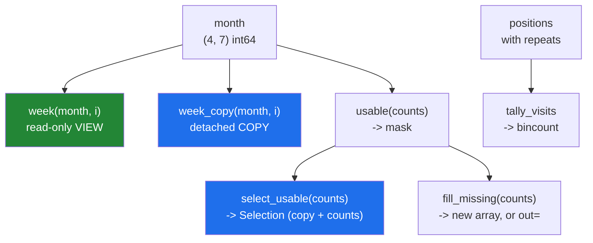

# 5.2 — `src/setu/select.py` — view or copy, decided in the signature

## One-line answer

Today's module makes the view-or-copy decision **once per function, in its name and its docstring**,
so that no caller ever has to work out which one they were handed.

---

## The story

A kitchen in a shared house has two sets of knives.

One set lives in a block on the counter. Anyone can use them, and everyone knows the rule: you wash
them and put them back. They are not yours, and if you take one to your room the next person cannot
cook.

The other set is a drawer of cheap ones. Take one, keep it, lose it, it does not matter.

Nobody argues about knives in that house, and the reason is not that people are careful. It is that
the two sets are visibly different and the rule is attached to the set rather than to each knife. You
do not have to remember whether *this particular knife* is a counter knife; you can see where it came
from.

An interface is the same trick. If every function that hands out a view is named differently from
every function that hands out a copy, nobody has to remember which is which.

---

## The idea in plain language

Everything on this day has been one question in different clothes: *does this expression share memory
with something else, and does anyone else care?* You now have all the pieces to answer it. This part
puts them into an interface.

The design has three rules, and they are the whole of it.

**Rule one: the decision belongs to the function, not to the caller.** A function that returns a view
and a function that returns a copy are two functions with two names. A boolean flag — `copy=True` —
pushes the decision to the call site, where it is easy to forget and easy to get wrong. Flags are for
when the two versions would otherwise duplicate a lot of real code
([2.3](../02-the-view-trap/2.3-copy-and-when-to-pay.md)).

**Rule two: a view that is handed out is read-only.** Setting `flags.writeable = False` costs nothing
and turns "somebody wrote to my array" into a `ValueError` at the moment it happens
([2.2](../02-the-view-trap/2.2-how-to-tell-base-and-shares-memory.md)). If a caller genuinely needs to
write, they take the copy.

**Rule three: anything a caller will keep is copied.** A view that outlives its parent's usefulness
pins the parent ([5.1](5.1-the-leak-a-view-causes.md)), and the function that produced it is where
that is knowable.

The module those rules produce is `src/setu/select.py`, and it does four jobs:

- hand out one week, either cheaply or safely,
- decide which days are usable, and **say how many were rejected and why**,
- fill in the days that were not recorded, without changing the caller's data,
- count repeated positions correctly.

The fourth is there because a tally is the one operation on this day where the obvious code is
silently wrong ([4.4](../04-fancy-indexing/4.4-repeated-positions-and-the-lost-update.md)).

One change from Day 20 to note. There, a not-recorded day became `np.nan`, which needs a float array.
Here the month is integers and there is no integer `nan`, so the module uses a **sentinel**: `-1`,
which no step count can be. The rule that makes a sentinel safe is that it must be outside the range
of real values, and the rule that makes it dangerous is that nothing enforces it —
`MISSING = -1` at the top of the module is the only thing standing between you and a `-1` that means
something else.

---

## Why Setu needs it

- **Day 25's phase gate** asks for a vectorised statistics module that beats a loop by fifty times.
  This module is the half of it that selects; Day 23's is the half that computes.
- **Day 26's Pandas work** rebuilds these same decisions on a `DataFrame`, and knowing them at the
  array level is what makes `SettingWithCopyWarning` readable rather than mysterious.
- **Day 44's transformers** have exactly this interface question, and scikit-learn answers it with the
  `copy=` flag — a choice worth being able to criticise.
- **Day 76's cleaning pipeline** imports `usable` and `select_usable` directly.
- **Day 172's eval harness** reports how many examples were dropped and why, which is the `Selection`
  record below in a different domain.

---

## The mechanism

The whole module, in four pieces. First the shape of the answer:

```python
"""Select days out of a run of step counts, saying view or copy every time."""

from __future__ import annotations

from dataclasses import dataclass

import numpy as np

MISSING = -1


@dataclass(frozen=True, slots=True)
class Selection:
    """What one filter kept, and what it rejected. Every count is a plain int."""

    values: np.ndarray
    kept: int
    missing: int
    out_of_range: int

    @property
    def total_seen(self) -> int:
        return self.kept + self.missing + self.out_of_range
```

**Line by line:**

- `MISSING = -1` — the sentinel, named once. Every comparison in the module goes through this name, so
  changing the convention is one edit rather than a search for `-1`.
- `@dataclass(frozen=True, slots=True)` — frozen because a record of what a filter did should not be
  edited afterwards, `slots` because it is cheap and catches a mistyped attribute name
  ([Day 19, 2.3](../../../day-19-typing-dataclasses-and-concurrency/parts/02-dataclasses/2.3-frozen-slots-kw-only.md)).
- `values: np.ndarray` alongside three plain `int` fields — the array is the data, the counts are the
  explanation. **A filter that reports only what it kept cannot be argued with**
  ([3.3](../03-boolean-masks/3.3-and-or-not-and-why-and-raises.md)).
- `int` rather than `np.int64` in the field types, with the conversion done where the counts are
  computed. A `np.int64` in a record that becomes JSON is a failure two layers away
  ([Day 19, 3.4](../../../day-19-typing-dataclasses-and-concurrency/parts/03-pydantic/3.4-model-dump-and-the-boundary.md)).
- `total_seen` as a `@property` — computed from the fields rather than stored, so it cannot disagree
  with them ([Day 15, 2.1](../../../day-15-constructors-and-dunders/parts/02-property/2.1-a-property-is-worked-out.md)).
  It exists to be asserted against the input's size, which is the check that catches a category that
  overlaps another.

The two doors, one cheap and one safe:

```python
def week(month: np.ndarray, index: int) -> np.ndarray:
    """One week, as a read-only view. Cheap, and must not outlive `month`."""
    if month.ndim != 2:
        raise ValueError(f"expected a (weeks, days) table, got shape {month.shape}")
    view = month[index].view()
    view.flags.writeable = False
    return view


def week_copy(month: np.ndarray, index: int) -> np.ndarray:
    """One week, detached. Costs a copy, and is safe to keep and to write to."""
    return np.array(month[index], copy=True)
```

**Line by line:**

- Two functions rather than `week(month, index, copy=False)` — rule one. The names are the
  documentation, and a reader of the call site does not have to look up a default.
- `month[index]` — basic indexing, so this is a view of one row
  ([1.2](../01-one-element/1.2-the-comma-a-list-cannot-do.md)) and nothing has been copied yet.
- `.view()` — a **second array object** over the same memory. It exists so that the next line can clear
  the writeable flag on our object without touching `month`'s. Without it,
  `month[index].flags.writeable = False` would be setting the flag on a temporary and the returned
  array would still be writeable.
- `view.flags.writeable = False` — rule two. Any write through the returned array now raises
  `ValueError: assignment destination is read-only` instead of changing `month` silently.
- `np.array(month[index], copy=True)` — the copy, said explicitly. `np.array(x, copy=False)` no longer
  means "avoid a copy if you can" in NumPy 2 and raises instead
  ([Day 20, 3.1](../../../day-20-arrays-and-dtypes/parts/03-creating/3.1-np-array-and-what-it-infers.md)),
  which is why the argument is worth writing out even though `.copy()` would do.
- The docstrings state the lifetime rule, which no type can express: *must not outlive `month`* against
  *safe to keep*.

The filter, and its explanation:

```python
def usable(counts: np.ndarray, *, floor: int = 100, ceiling: int = 60_000) -> np.ndarray:
    """Mark the days that can be used: recorded, and inside the plausible range."""
    recorded = counts != MISSING
    not_a_stub = counts >= floor
    not_a_glitch = counts <= ceiling
    return recorded & not_a_stub & not_a_glitch


def select_usable(counts: np.ndarray, *, floor: int = 100, ceiling: int = 60_000) -> Selection:
    """Gather the usable days, and count what each rule rejected."""
    keep = usable(counts, floor=floor, ceiling=ceiling)
    missing = counts == MISSING
    return Selection(
        values=counts[keep],
        kept=int(np.count_nonzero(keep)),
        missing=int(np.count_nonzero(missing)),
        out_of_range=int(np.count_nonzero(~keep & ~missing)),
    )
```

**Line by line:**

- `usable` returns the **mask**, not the values. A mask can be counted, inverted, combined with another
  filter and applied to a second array with the same shape; a list of values can only be looked at.
- Three named conditions combined with `&` — rule-per-line, so a failing day can be explained
  ([3.3](../03-boolean-masks/3.3-and-or-not-and-why-and-raises.md)).
- `counts != MISSING` rather than `counts > 0` — the sentinel is the definition of missing, and a
  genuine zero-step day is a different thing from a day the phone was not carried.
- `counts[keep]` — advanced indexing, so `values` is a **copy** and cannot be used to write back into
  the caller's array ([3.2](../03-boolean-masks/3.2-indexing-with-a-mask.md)). That is the right
  default for something returned inside a record.
- `~keep & ~missing` — out of range means "rejected, but not because it was missing". Written as
  `~keep` alone, a missing day would be counted twice and `total_seen` would exceed the input size.
  **The `total_seen` property exists to catch exactly that mistake.**
- `int(np.count_nonzero(...))` — counting without materialising a selection, converted at the boundary.

The write, and the tally:

```python
def fill_missing(counts: np.ndarray, *, out: np.ndarray | None = None) -> np.ndarray:
    """Replace MISSING days with the mean of the usable ones, rounded to whole steps."""
    keep = usable(counts)
    if not keep.any():
        raise ValueError("no usable days: nothing to average")
    if out is None:
        out = np.empty_like(counts)
    elif out.shape != counts.shape:
        raise ValueError(f"out has shape {out.shape}, expected {counts.shape}")
    np.copyto(out, counts)
    out[counts == MISSING] = np.rint(counts[keep].mean()).astype(counts.dtype)
    return out


def tally_visits(positions: np.ndarray, members: int) -> np.ndarray:
    """Count visits per member. Repeats in `positions` are the whole point."""
    if positions.size and (positions.min() < 0 or positions.max() >= members):
        raise ValueError(f"positions outside 0..{members - 1}")
    return np.bincount(positions, minlength=members)
```

**Line by line:**

- `if not keep.any(): raise` — the empty guard from
  [3.5](../03-boolean-masks/3.5-the-mask-that-matched-nothing.md), before the mean rather than after
  it. Without it the fill value would be `nan`, and writing `nan` into an integer array is its own
  disaster.
- `out=None` defaulting to a new array — shape one by default, shape two on request
  ([2.4](../02-the-view-trap/2.4-the-function-that-changed-its-input.md)).
- `np.copyto(out, counts)` then the masked write — copy everything, then overwrite the missing
  positions. The other order would need the mask twice.
- `np.rint(...).astype(counts.dtype)` — **round, then cast.** `astype` alone truncates, so a mean of
  8946.7 would be stored as 8946 by accident rather than as 8947 on purpose
  ([Day 20, 2.4](../../../day-20-arrays-and-dtypes/parts/02-dtypes/2.4-astype-and-the-copy.md)). Here
  the mean of the six usable days is 8946.1666…, so both routes happen to give 8946 — which is
  exactly why the difference has to be decided in the code rather than noticed in the output. `rint`
  also rounds a halfway value to the nearest **even** whole number, so 8946.5 becomes 8946 and 8947.5
  becomes 8948; that is the IEEE default and it exists so that rounding a large column does not drift
  upwards.
- `counts[keep].mean()` — the mean over the usable days only. Over the whole array it would include
  the `-1` sentinels and drag the fill value down, which is the sentinel's one danger made real.
- `positions.min() < 0 or positions.max() >= members` — the range check, because `np.bincount` accepts
  any non-negative position and would silently return an array longer than `members` if one were out
  of range.
- `np.bincount(positions, minlength=members)` — the correct tally
  ([4.4](../04-fancy-indexing/4.4-repeated-positions-and-the-lost-update.md)). `minlength` fixes the
  output length so two runs on different data produce comparable arrays.

Running it on the month:

```python
import numpy as np

from setu.select import fill_missing, select_usable, tally_visits, week, week_copy

month = np.array(
    [
        [8213, 10442, 6180, -1, 12007, 9631, 7204],
        [7788, 9120, 11345, 8402, 6733, 14210, 5096],
        [9004, 8765, 7621, 10188, 9950, 8317, 11002],
        [6540, 12488, 9873, 7106, 8899, 10540, 9218],
    ]
)

peek = week(month, 0)
print("week view    :", peek)
print("shares memory:", np.shares_memory(month, peek))
print("writeable    :", peek.flags.writeable)

kept = week_copy(month, 0)
print("week copy    :", np.shares_memory(month, kept), "shares; base is", kept.base)

sel = select_usable(month[0])
print("kept         :", sel.kept, "missing:", sel.missing, "out of range:", sel.out_of_range)
print("adds up      :", sel.total_seen == month[0].size)
print("values       :", sel.values)

filled = fill_missing(month[0])
print("filled       :", filled)
print("caller intact:", month[0])

print("tally        :", tally_visits(np.array([0, 0, 0, 3, 3, 6]), 7))
```

**Line by line:**

- `-1` in the data now, not `0` — the month uses the module's sentinel, which is what makes the
  `!= MISSING` test meaningful.
- `week(month, 0)` — shares memory, and cannot be written to. Both facts printed, because both are
  the interface.
- `week_copy(month, 0)` — shares nothing, `base` is `None`. It can be kept and written to.
- `sel.total_seen == month[0].size` — the assertion that the three categories cover every day exactly
  once. In the tests it is an `assert`; here it is printed so you can see it hold.
- `filled` and then `month[0]` — the returned array has the gap filled and the caller's row still has
  its `-1`. That is rule three, demonstrated in two lines.
- `tally_visits(np.array([0, 0, 0, 3, 3, 6]), 7)` — six visits, and the total of the tally is six.

```text
week view    : [ 8213 10442  6180    -1 12007  9631  7204]
shares memory: True
writeable    : False
week copy    : False shares; base is None
kept         : 6 missing: 1 out of range: 0
adds up      : True
values       : [ 8213 10442  6180 12007  9631  7204]
filled       : [ 8213 10442  6180  8946 12007  9631  7204]
caller intact: [ 8213 10442  6180    -1 12007  9631  7204]
tally        : [3 0 0 2 0 0 1]
```

The module as a whole:



---

## When it breaks

**The read-only view doing its job:**

```text
$ uv run python -c "
import numpy as np
from setu.select import week
month = np.arange(28).reshape(4, 7)
peek = week(month, 1)
peek[0] = 999
"
Traceback (most recent call last):
  File "<string>", line 6, in <module>
    peek[0] = 999
    ~~~~^^^
ValueError: assignment destination is read-only
```

**What it means.** A caller tried to write to the cheap version. The message is NumPy's rather than
ours, which is acceptable here because it is unambiguous and appears at the exact line of the write.
The caller's fix is one character of intent: use `week_copy` instead, and pay for the copy they turn
out to need.

**The `.view()` that was left out:**

```text
$ uv run python -c "
import numpy as np
month = np.arange(28).reshape(4, 7)
month[1].flags.writeable = False
print('month writeable :', month.flags.writeable)
print('so is every row :', month[1].flags.writeable)
"
month writeable : True
so is every row : True
```

**What it means.** `month[1]` builds a **new** view object, the flag is set on that object, and the
object is discarded at the end of the line. Nothing was protected and nothing complained. This is why
`week` keeps the view in a local name before touching its flags — and it is a good example of a
statement that looks like it configures something and configures a temporary.

**The tally that was one longer than expected:**

```text
$ uv run python -c "
import numpy as np
print('length 7 :', np.bincount(np.array([0, 3, 6]), minlength=7).size)
print('length 8 :', np.bincount(np.array([0, 3, 7]), minlength=7).size)
"
length 7 : 7
length 8 : 8
```

**What it means.** `minlength` is a **minimum**, not a fixed length: a position of 7 makes the result
eight long, whatever you asked for. Two runs of the same code then produce arrays of different
lengths, and any attempt to add them raises a broadcast error far from the cause. `tally_visits`
range-checks the positions before calling `bincount` for exactly this reason.

**The sentinel that was averaged:**

```text
$ uv run python -c "
import numpy as np
counts = np.array([8213, 10442, 6180, -1, 12007, 9631, 7204])
print('mean with sentinel :', counts.mean())
print('mean of usable     :', counts[counts != -1].mean())
"
mean with sentinel : 7668.0
mean of usable     : 8946.166666666666
```

**What it means.** A sentinel is a real number as far as every reduction is concerned, so any
statistic that forgets to exclude it is wrong by a plausible-looking amount. Twelve hundred steps a
day, in this case: not obviously wrong, and enough to change a conclusion. This is the price of using
a sentinel instead of `nan`, and it is why `MISSING` is a module-level name that every function in the
module goes through.

---

## In production

**What a professional writes instead of the teaching version.** They add the module to the package's
public surface, and they make the lifetime rule enforceable rather than merely documented:

```python
from __future__ import annotations

import numpy as np

MISSING = -1
PIN_RATIO = 10


def detached(values: np.ndarray) -> np.ndarray:
    """Return an array that pins nothing large, copying only when it would.

    Used at every boundary where a small result is about to be kept: a cache, a
    returned record, an attribute on a long-lived object (part 5.1).
    """
    parent = values.base
    if parent is None:
        return values
    if parent.nbytes > PIN_RATIO * values.nbytes:
        return values.copy()
    return values
```

**Line by line:**

- `PIN_RATIO = 10` — the judgement, named. A view whose parent is only twice its size is not worth
  copying; one whose parent is a thousand times its size always is, and ten is a defensible line.
- `values.base` — the pointer that makes a view a view
  ([2.2](../02-the-view-trap/2.2-how-to-tell-base-and-shares-memory.md)). `None` means the array owns
  its data and there is nothing to detach from.
- `parent.nbytes > PIN_RATIO * values.nbytes` — the copy is conditional, so calling `detached` on
  something that is already small or already owned costs one attribute lookup and no memory.
- `return values` unchanged in both other branches — this function is safe to call everywhere, which
  is what makes it usable as a habit rather than as a decision.
- What it deliberately does **not** do: it does not chase `parent.base`. A view of a view has a base
  chain, and following it is more cleverness than this is worth; the first parent is enough to catch
  the case that matters.

**What changes at scale.** The module's shape stays and its defaults change. When the month becomes a
year of per-minute readings, `week_copy` stops being free and `select_usable` returns an array that is
a real fraction of the input, so the interface grows a streaming variant that yields masks rather than
values. The `Selection` record stays exactly as it is, because counts do not grow with the data, and
that is a good sign in an interface: the part that reports scales differently from the part that
carries data, so they are separate fields rather than one array with a summary bolted on.

**The failure that only appears with real data.** A module very like this one used `0` as its missing
marker, which was fine for step counts. It was then reused for a temperature column, where `0` is an
ordinary reading in winter, and every freezing day was silently treated as missing and replaced with
the mean. The sentinel is a property of the *column*, not of the code, and moving `MISSING` into the
function signature — with a default and a docstring saying what makes it safe — is the fix.

**The review comment a senior engineer leaves.** *"`week()` returns a view of the caller's month.
Either mark it read-only or copy it, and say which in the docstring — as written, whoever calls this
in a loop is one assignment away from corrupting the data for every later iteration."*

**The interview question.** *"How do you design an array-returning API so that callers do not corrupt
each other's data?"* Decide view or copy in the function rather than at the call site, and put the
decision in the name: `week` returns a cheap read-only view, `week_copy` returns a detached array.
Mark every handed-out view read-only, which costs nothing and turns a silent corruption into a
`ValueError` at the write. Copy anything the caller is expected to keep, because a view pins its
parent for as long as it lives. The detail that shows experience is knowing what the flag does *not*
do: it protects that one view object, not the parent, so `month[1].flags.writeable = False` on a
temporary protects nothing at all.

---

## Check yourself

```bash
uv run python -c "
import numpy as np
from setu.select import select_usable, week, week_copy
month = np.array([[8213, 10442, 6180, -1, 12007, 9631, 7204]])
v = week(month, 0)
c = week_copy(month, 0)
print('view  shares:', np.shares_memory(month, v), 'writeable:', v.flags.writeable)
print('copy  shares:', np.shares_memory(month, c), 'writeable:', c.flags.writeable)
s = select_usable(month[0])
print('kept/missing/out:', s.kept, s.missing, s.out_of_range, '=', s.total_seen)
print('input size      :', month[0].size)
"
```

The last two lines must agree. Say what kind of bug it would be if they did not.

**Answer out loud, without scrolling up:**

> Why are `week` and `week_copy` two functions rather than one function with a `copy=` argument, and
> what does the read-only flag on the view protect — the view, the month, or both?

---

**Next:** [5.3 — the test that can go red](5.3-the-test-that-can-go-red.md).
