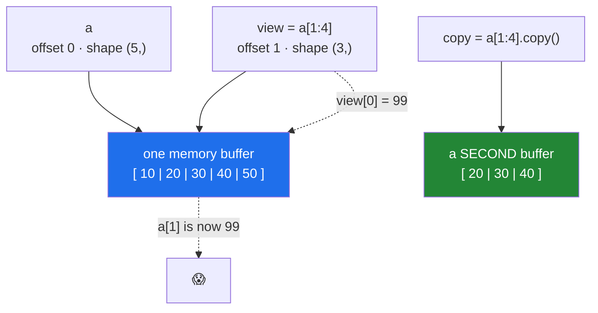

# Day 21 — Indexing, slicing, boolean masks — and the view trap

**Phase 3 · Module 3** · ID: **NP-03** (indexing and slicing arrays)

> **Yesterday:** the array, its dtype, and the NumPy 2.x names.
> **Today:** getting data *out* of an array — and the single most consequential fact in NumPy: **a
> slice is a view, not a copy.** Five days from now, pandas 3.0's Copy-on-Write is this exact
> question one level up, and you will already know the answer.
> **Tomorrow:** broadcasting.

```bash
./m start 21 && ./m scaffold 21
```

**Time:** 100 minutes. **Request budget:** 0 model calls.

---

## §1 The story

A Python list slice copies. `x[1:3]` gives you a new list; write to it and the original is untouched.

**A NumPy slice does not copy.** `a[1:3]` gives you a *window onto the same memory*. Write to the
window and the original changes. That is not a bug — it is the reason NumPy is fast. Slicing a
1 GB array a hundred times costs nothing, because nothing is duplicated. Only the header changes.



So there are two questions you must be able to answer about any indexing expression:

1. **Does it return a view or a copy?**
2. **Am I about to write to it?**

The rule is almost mechanical:

| Operation | Result |
|---|---|
| **Basic** indexing — `a[1:4]`, `a[:, 0]`, `a[::2]`, `a.T`, `a.reshape(...)` | **view** |
| **Advanced** indexing — `a[[0, 2]]`, `a[mask]`, `a[a > 3]` | **copy** |

The trap is that both are spelled with square brackets, so nothing in the syntax tells you which one
you got. `arr.base` tells you: a view has a `.base` pointing at the array it looks into; a copy's
`.base` is `None`.

**Why this belongs on Day 21 and not later.** On Day 79 you split data into train and test. If your
"test set" is a view into the training array and any preprocessing writes in place, your test data
has been modified by training-time code. That is Principle 8 — leakage — happening through a
mechanism nobody suspects, because the code looks like it only *read* the array.

---

## §2 Setup — run this

```bash
mkdir -p days/day-21/lab
touch days/day-21/lab/indexing.py
```

`src/setu/arrays.py` grows today. No new packages.

---

## §3 NP-03 — indexing, in four modes

`days/day-21/lab/indexing.py`:

```python
"""NP-03: basic indexing, slicing, fancy indexing, boolean masks - and views."""

from __future__ import annotations

import numpy as np


def basic_indexing() -> None:
    a = np.arange(10, 60, 10)
    print(f"\n{a=}")
    print(f"{a[0]=} {a[-1]=}   <- scalars, not arrays")
    print(f"{type(a[0]).__name__=}   <- a NumPy scalar, not a Python int")

    m = np.arange(12).reshape(3, 4)
    print(f"\n{m=}")
    print(f"{m[1, 2]=}     <- row, col. NOT m[1][2] (that indexes twice)")
    print(f"{m[1]=}        <- a whole row")
    print(f"{m[:, 1]=}     <- a whole column; shape {m[:, 1].shape}")
    print(f"{m[:, 1:2].shape=}   <- a slice keeps the dimension: (3, 1)")


def slicing() -> None:
    a = np.arange(10)
    print(f"\n{a[2:7]=} {a[:3]=} {a[7:]=} {a[::2]=} {a[::-1]=}")
    print(f"{a[20:30]=}   <- out-of-range SLICE is empty, not an error")
    try:
        a[20]
    except IndexError as exc:
        print(f"  out-of-range INDEX: {exc}")

    m = np.arange(24).reshape(4, 6)
    print(f"\n{m[1:3, 2:5]=}")
    print(f"{m[::2, ::3]=}")
    print(f"{m[..., 0]=}   <- Ellipsis: 'all remaining dimensions'")


def views_are_the_default() -> None:
    a = np.arange(10, 60, 10)
    view = a[1:4]
    print(f"\n{a=}")
    print(f"{view=}")
    print(f"{view.base is a=}   <- a VIEW: .base points at the parent")

    view[0] = 999
    print(f"after view[0] = 999 -> {a=}   <- the parent changed")

    copy = a[1:4].copy()
    print(f"\n{copy.base is None=}   <- a COPY has no base")
    copy[0] = -1
    print(f"after copy[0] = -1  -> {a=}   <- parent untouched")

    print(f"\n{np.shares_memory(a, a[1:4])=}   <- the authoritative check")
    print(f"{np.shares_memory(a, a[[1, 2, 3]])=}")


def fancy_and_boolean() -> None:
    a = np.arange(10, 60, 10)

    picked = a[[0, 2, 4]]
    print(f"\n{picked=}  {picked.base is None=}   <- fancy indexing COPIES")
    picked[0] = -1
    print(f"{a=}   <- unchanged")

    mask = a > 25
    print(f"\n{mask=}  {mask.dtype=}")
    print(f"{a[mask]=}   <- boolean indexing COPIES too")
    print(f"{mask.sum()=}   <- counts True (bool is an int - Day 4)")

    print(f"\n{a[(a > 15) & (a < 45)]=}   <- & not `and`; brackets are REQUIRED")
    try:
        a > 15 and a < 45
    except ValueError as exc:
        print(f"  `and` on arrays: {exc}")

    print(f"\n{np.where(a > 25, a, 0)=}   <- vectorised if/else")
    print(f"{np.where(a > 25)=}          <- one arg: the INDICES where True")


def assignment_through_indexing() -> None:
    a = np.arange(10, 60, 10)

    a[a > 25] = 0
    print(f"\nafter a[a > 25] = 0 -> {a}   <- assignment through a mask DOES write back")
    print("  ^ reading a[mask] copies, but ASSIGNING to a[mask] modifies the original.")
    print("    Same brackets, opposite behaviour. This is why Day 26's pandas rule exists.")

    b = np.arange(6).reshape(2, 3)
    b[:, 1] = 99
    print(f"\n{b=}   <- assign into a column slice")


def the_leakage_shape() -> None:
    data = np.arange(10, dtype=float)
    train, test = data[:7], data[7:]
    print(f"\n{train=}")
    print(f"{test=}")
    print(f"{np.shares_memory(train, test)=}   <- False here, but BOTH share with `data`")
    print(f"{np.shares_memory(train, data)=} {np.shares_memory(test, data)=}")

    train -= train.mean()          # in-place: writes into `data`
    print(f"\nafter centring train IN PLACE:")
    print(f"  {data=}   <- the source array was modified")
    print("  If anything later re-slices `data` for the test set, it is now contaminated.")
    print("  Day 79's rule: split, then .copy(), then fit. Principle 8.")


if __name__ == "__main__":
    basic_indexing()
    slicing()
    views_are_the_default()
    fancy_and_boolean()
    assignment_through_indexing()
    the_leakage_shape()
```

**Line by line:**

- `type(a[0])` is `np.int64`, **not** a Python `int`. It behaves like one in arithmetic, but it is
  fixed-width — so `a[0] + 1` on an `int8` array can overflow (Day 20). Use `int(a[0])` when handing a
  value to non-NumPy code, especially JSON, which cannot serialise NumPy scalars.
- `m[1, 2]` versus `m[1][2]` — the first is **one** indexing operation; the second indexes twice,
  creating an intermediate row array. Same answer, more work, and only the first form supports
  multi-dimensional slicing like `m[1:3, 2:5]`. **This is exactly the shape of Day 26's pandas
  chained-assignment bug**, and it is worth noticing that the double-bracket form is the suspicious one
  in both libraries.
- `m[:, 1]` gives shape `(3,)` — the dimension is **dropped**, because an integer index removes an
  axis. `m[:, 1:2]` gives `(3, 1)` — a slice **keeps** it. That difference breaks matrix multiplication
  on Day 126 and reshapes on Day 130.
- `a[20:30]` is empty; `a[20]` raises. **Slices clamp, indices raise.** A silently empty result from an
  off-by-one slice is a real bug source.
- `m[..., 0]` — `Ellipsis` means "as many `:` as needed". Essential once you hit 4-D image or batch
  tensors on Day 136.
- `view.base is a` — the view's `.base` is the parent. **This is how you check.**
- `np.shares_memory(a, b)` — the authoritative test, and it handles cases `.base` does not (chained
  views, transposes). Slower but definitive; it is what the §6 tests use.
- `a[[0, 2, 4]]` — **fancy indexing** with a list of positions. Returns a **copy**, because the
  selected elements need not be evenly spaced and so cannot be described by an offset and a stride.
- `a > 25` produces a **boolean array**, one entry per element. `mask.sum()` counts the `True`s
  because `bool` is an `int` (Day 4, fourth appearance).
- `(a > 15) & (a < 45)` — element-wise `and` is `&`, `or` is `|`, `not` is `~`. **The brackets are
  required** because `&` binds tighter than `>`. And plain `and` raises `ValueError: truth value of an
  array with more than one element is ambiguous` — Day 5's truthiness lesson, and the same refusal
  pandas makes for a DataFrame.
- `np.where(cond, x, y)` — vectorised if/else. With one argument it returns the **indices** where the
  condition is true, which is a different and equally useful thing.
- `a[a > 25] = 0` — **the asymmetry that matters.** *Reading* `a[mask]` gives a copy; *assigning* to
  `a[mask]` writes into the original. Python routes these to `__getitem__` and `__setitem__`
  respectively, and only the setter knows the target. Once you see that, Day 26's pandas rule stops
  being a special case and becomes the obvious consequence.
- `train -= train.mean()` — the in-place operator writes **through the view into `data`**. Written as
  `train = train - train.mean()` it would rebind a new array and leave `data` alone. Day 10's
  rebind-versus-mutate distinction, now with a memory diagram attached.

---

## §4 Build brief

Extend `src/setu/arrays.py`:

```python
def is_view_of(child: np.ndarray, parent: np.ndarray) -> bool:
    """TODO(me): True if `child` shares memory with `parent`.

    Use np.shares_memory - do NOT compare .base, which misses chained views.
    """
    raise NotImplementedError


def safe_split(values, *, train_fraction: float = 0.7, seed: int | None = None):
    """TODO(me): shuffle and split into (train, test) as INDEPENDENT arrays.

    - use make_rng(seed) - never np.random.shuffle on a global
    - shuffle a permutation of indices, do not shuffle the data in place
    - both returned arrays must be copies: is_view_of(train, values) must be False
    - raise DataError unless 0 < train_fraction < 1
    - raise DataError if fewer than 2 values (you cannot split one row)
    """
    raise NotImplementedError


def top_k_indices(scores, k: int) -> np.ndarray:
    """TODO(me): indices of the k largest values, best first. Ties broken by lower index.

    - use np.argsort; think about how to get descending order
    - k larger than the array returns every index
    - raise DataError if k < 1
    This IS the retrieval primitive from Day 155. Same function, different name there.
    """
    raise NotImplementedError


def clip_outliers(values, *, low: float, high: float) -> np.ndarray:
    """TODO(me): return a NEW array with values clamped to [low, high].

    Must NOT modify the caller's array. Raise DataError if low > high.
    NaN must pass through unchanged, not become low or high.
    """
    raise NotImplementedError
```

- `safe_split` returning **copies** is Principle 8 as code. Day 79 will use exactly this.
- `top_k_indices` is the same operation as retrieval: score every candidate, take the best k. Writing
  it here means Day 155's "vector search" is a function you already have.

---

## §5 The eval that must be able to fail

Add to `tests/test_arrays.py`:

```python
from setu.arrays import clip_outliers, is_view_of, safe_split, top_k_indices


def test_a_slice_is_a_view():
    a = np.arange(10)
    assert is_view_of(a[2:5], a) is True


def test_a_copy_is_not_a_view():
    a = np.arange(10)
    assert is_view_of(a[2:5].copy(), a) is False


def test_boolean_indexing_returns_a_copy():
    a = np.arange(10)
    assert is_view_of(a[a > 5], a) is False


def test_split_returns_independent_arrays():
    data = np.arange(20, dtype=float)
    train, test = safe_split(data, train_fraction=0.7, seed=1)
    assert not is_view_of(train, data), "train is a view - in-place work would corrupt the source"
    assert not is_view_of(test, data)


def test_split_does_not_modify_the_source():
    data = np.arange(20, dtype=float)
    before = data.copy()
    safe_split(data, seed=1)
    assert np.array_equal(data, before), "the source was shuffled in place"


def test_split_sizes_and_completeness():
    data = np.arange(20, dtype=float)
    train, test = safe_split(data, train_fraction=0.75, seed=1)
    assert len(train) == 15 and len(test) == 5
    assert np.array_equal(np.sort(np.concatenate([train, test])), data)


def test_split_is_reproducible_and_actually_shuffles():
    data = np.arange(20, dtype=float)
    a, _ = safe_split(data, seed=3)
    b, _ = safe_split(data, seed=3)
    assert np.array_equal(a, b)
    assert not np.array_equal(a, data[:14]), "the data was not shuffled"


@pytest.mark.parametrize("fraction", [0.0, 1.0, -0.1, 1.5])
def test_split_rejects_impossible_fractions(fraction):
    with pytest.raises(DataError):
        safe_split(np.arange(10), train_fraction=fraction)


def test_split_rejects_a_single_row():
    with pytest.raises(DataError):
        safe_split(np.array([1.0]))


def test_top_k_is_descending():
    assert np.array_equal(top_k_indices([0.1, 0.9, 0.5, 0.7], 2), [1, 3])


def test_top_k_breaks_ties_by_lower_index():
    assert np.array_equal(top_k_indices([0.5, 0.9, 0.9], 2), [1, 2])


def test_top_k_larger_than_the_array():
    assert len(top_k_indices([1.0, 2.0], 10)) == 2


def test_top_k_rejects_zero():
    with pytest.raises(DataError):
        top_k_indices([1.0, 2.0], 0)


def test_clip_does_not_modify_the_caller():
    a = np.array([1.0, 5.0, 10.0])
    before = a.copy()
    clip_outliers(a, low=2.0, high=8.0)
    assert np.array_equal(a, before), "clip wrote into the caller's array"


def test_clip_clamps_both_ends():
    out = clip_outliers([1.0, 5.0, 10.0], low=2.0, high=8.0)
    assert np.array_equal(out, [2.0, 5.0, 8.0])


def test_clip_passes_nan_through():
    out = clip_outliers([1.0, np.nan, 10.0], low=2.0, high=8.0)
    assert np.isnan(out[1]), "NaN was clamped to a bound - it means missing, not out-of-range"


def test_clip_rejects_inverted_bounds():
    with pytest.raises(DataError):
        clip_outliers([1.0], low=5.0, high=1.0)
```

**Line by line:**

- The first three tests turn the §1 table into executable documentation: slice → view, `.copy()` →
  not, boolean mask → not. If NumPy ever changes this, you find out from a test rather than from a
  corrupted result.
- `test_split_returns_independent_arrays` — **the day's real assessment.** An implementation returning
  `values[idx[:n]]` actually passes (fancy indexing copies), but one returning `values[:n]` does not.
  The failure message names the consequence rather than the mechanism.
- `test_split_does_not_modify_the_source` — catches `rng.shuffle(values)`, which shuffles **in place**.
  Shuffle a permutation of *indices* instead.
- `test_split_sizes_and_completeness` — sorting the concatenation back and comparing to the original
  proves nothing was lost or duplicated. A split that drops the last row when the size is odd fails here.
- `test_split_is_reproducible_and_actually_shuffles` — two assertions guarding opposite failures: not
  reproducible, and not actually shuffled. A no-op "shuffle" passes the first and fails the second.
- `test_top_k_breaks_ties_by_lower_index` — `argsort` is stable by default, but reversing a stable
  ascending sort reverses the tie order too. This test catches the naive `argsort(x)[::-1]`.
- `test_clip_passes_nan_through` — **the subtle one.** `np.clip` propagates NaN correctly; a
  hand-rolled `np.where(x < low, low, ...)` does not, because every comparison with NaN is `False`.
  A missing value silently becoming your lower bound is a data-corruption bug you would find in
  Phase 11 at the earliest.

```bash
uv run python -m pytest tests/test_arrays.py -v
```

---

## §6 Request budget

| Resource | Spent today |
|---|---|
| LLM calls | **0** |

---

## §7 Traps

- **Assuming a slice copies.** It does not. `.copy()` when you will write.
- **`m[1][2]` instead of `m[1, 2]`.** Two operations, an intermediate array, and no multi-axis slicing.
- **Losing a dimension.** `m[:, 1]` is 1-D; `m[:, 1:2]` is 2-D. Matrix code cares.
- **`and` / `or` / `not` on arrays.** Raises. Use `&`, `|`, `~` — with brackets.
- **Forgetting the brackets** in `(a > 1) & (a < 5)`. `&` binds tighter than `>`.
- **In-place `-=` on a view.** Writes into the parent. This is how a test set gets contaminated.
- **Expecting an out-of-range slice to raise.** It clamps to empty. Only indices raise.
- **Passing a NumPy scalar to `json.dumps`.** Not serialisable. `int()` / `float()` it first.
- **Hand-rolling `clip` with `np.where`.** NaN comparisons are `False`, so NaN gets clamped.
- **`rng.shuffle(data)`.** In place. Shuffle indices instead.

---

## §8 Verify before you code

Written **2026-08-21**:

- <https://numpy.org/doc/stable/user/basics.indexing.html> — the basic-versus-advanced distinction and
  exactly which returns a view.
- <https://numpy.org/doc/stable/reference/generated/numpy.shares_memory.html> — and note
  `may_share_memory`, which is faster but conservative.
- <https://numpy.org/doc/stable/reference/generated/numpy.argsort.html> — the `kind` argument and
  stability guarantees.

---

## §9 Say it in an interview

> "Basic indexing gives a view, advanced indexing gives a copy, and both are spelled with square
> brackets — so the syntax tells you nothing and `np.shares_memory` tells you everything. It matters
> most at the train/test split: if the test set is a view into the source and any preprocessing runs
> in place, training-time code has written into your test data, and nothing in the diff looks like a
> write. So my split helper returns independent arrays and there's a test asserting they don't share
> memory. The related asymmetry is that reading `a[mask]` copies but assigning to `a[mask]` writes back
> — `__getitem__` versus `__setitem__` — which is the same shape as the pandas chained-assignment
> problem a few days later."

---

## §10 Done when

Tick [`CHECKLIST.md`](CHECKLIST.md), then `./m check && ./m done 21`.
