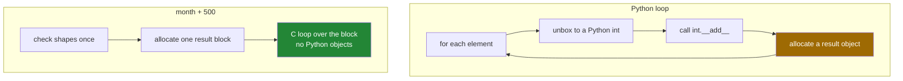

# 1.1 — `month + 500` — one number against twenty-eight

## One-line answer

Writing `month + 500` adds 500 to every one of the twenty-eight numbers and hands back an array of
the same shape — the loop you would have written is inside NumPy, in C, and this stretching of one
value across many is the simplest case of **broadcasting**.

---

## The story

Somebody realises they have been carrying their phone in a bag rather than a pocket for the whole
month, and the step counter has been missing about five hundred steps a day.

They want to correct the month. There is no interesting decision to make: every day gets five hundred
added, including the day the phone sat on the charger, which they will deal with separately.

If they were doing it on paper, they would go along the first row adding five hundred to each box,
then the second row, and so on. Twenty-eight small sums. Nobody would describe that as an algorithm;
it is just "add five hundred to everything".

The sentence "add five hundred to everything" is shorter than the twenty-eight sums, and it is also
more accurate about what they meant. That gap — between saying the operation once and performing it
twenty-eight times — is what today is about.

---

## The idea in plain language

In ordinary Python, `[1, 2, 3] + 500` is a `TypeError`, because a list and a number have no meaning
together ([Day 4, 1.5](../../../day-04-objects/parts/01-objects/1.5-why-str-plus-int-is-a-typeerror.md)).
To add five hundred to each element you write a loop or a comprehension
([Day 9, 1.1](../../../day-09-comprehensions/parts/01-list-comprehensions/1.1-the-loop-and-the-comprehension.md)),
and Python runs its interpreter once for every element.

With a NumPy array, `month + 500` is defined, and it means **add 500 to each element**. The result is
a new array with the same shape as `month`. This behaviour has a name: the operation is
**elementwise**, and applying a single value against every element of an array is the simplest case
of **broadcasting** — the rule that lets arrays of different shapes take part in the same operation.

Three things are worth being precise about, because each one comes back later today.

**The shape does not change.** A `(4, 7)` array plus a number is a `(4, 7)` array. Broadcasting never
loses an axis; that is what a reduction does
([Day 23, 2.1](../../../day-23-ufuncs-and-statistics/parts/02-statistics/2.1-a-reduction-turns-many-into-one.md)).

**A new array is allocated.** `month + 500` does not change `month`; it builds a second array of the
same size and fills it. For a `(4, 7)` month that is 224 bytes and nobody cares. For a million rows it
is the difference between one array in memory and two, which is why `+=` exists and why
[1.7](1.7-the-broadcast-that-ate-the-memory.md) is a part of its own.

**The dtype can change.** `month * 0.00075` — steps to kilometres — gives floats, because an integer
array times a Python float has to be floats to be right. The rule that decides this is NEP 50,
which you met on
[Day 20, 2.5](../../../day-20-arrays-and-dtypes/parts/02-dtypes/2.5-nep-50-and-the-python-number.md).

The word **vectorised** describes code written this way: one operation stated once, applied to a whole
array, with the loop inside the library rather than in your source. It is not a synonym for "fast",
though it usually is faster; it is a claim about **where the loop lives**. A Python loop pays the
interpreter's overhead once per element — unpacking the object, checking its type, calling the right
method, allocating a result object. A NumPy operation pays that once for the whole array and then runs
a tight machine-code loop over a block of memory
([Day 20, 1.4](../../../day-20-arrays-and-dtypes/parts/01-the-block/1.4-a-million-floats-measured.md)).

---

## Why Setu needs it

- **Day 22's own build** mean-centres a month of counts, which is this operation with an array on the
  right instead of a number ([1.3](1.3-a-row-against-a-table.md)).
- **Day 76's scaling** is `(values - mean) / spread` over a whole feature matrix, and it is written
  exactly like this line.
- **Day 125's neural network** applies a weight and adds a bias to a batch of inputs, and the bias is
  broadcast across the batch. Every layer you write from then on depends on today.
- **Day 155's cosine similarity** divides a matrix of vectors by a column of their lengths, which is
  [1.4](1.4-keepdims-and-the-column.md)'s shape problem.
- **Day 25's phase gate** asks for a fifty-fold speedup over a loop, and vectorising is how you get
  it.

---

## The mechanism

One number, twenty-eight sums:

```python
import numpy as np

month = np.array(
    [
        [8213, 10442, 6180, 0, 12007, 9631, 7204],
        [7788, 9120, 11345, 8402, 6733, 14210, 5096],
        [9004, 8765, 7621, 10188, 9950, 8317, 11002],
        [6540, 12488, 9873, 7106, 8899, 10540, 9218],
    ]
)

with_bonus = month + 500
print("shape in  :", month.shape)
print("shape out :", with_bonus.shape)
print("row 0     :", with_bonus[0])
print("in km     :", (month * 0.00075).round(2)[0])
print("dtype in  :", month.dtype, "dtype out:", (month * 0.00075).dtype)
```

**Line by line:**

- `month + 500` — one operator, twenty-eight additions. There is no loop in this source file and none
  in the running Python either; the loop is compiled C inside NumPy.
- `with_bonus.shape` — `(4, 7)`, the same as the input. **Broadcasting fills a shape, it never
  reduces one.**
- `with_bonus[0]` — the first week, each day five hundred higher. Note that Thursday's `0` became
  `500`, which is arithmetically correct and factually wrong: a day that was not recorded should not
  gain five hundred steps. Broadcasting applies the operation to **everything**, including the values
  you meant to exclude, and that is what masks are for
  ([Day 21, 3.4](../../../day-21-indexing-and-views/parts/03-boolean-masks/3.4-assigning-through-a-mask.md)).
- `month * 0.00075` — about 0.75 metres per step, so this is kilometres. The result is `float64`
  because an integer array multiplied by a Python float must be.
- `.round(2)` — for display only. It rounds the values; it does not make them exact
  ([Day 20, 2.3](../../../day-20-arrays-and-dtypes/parts/02-dtypes/2.3-floats-nan-and-precision.md)).

```text
shape in  : (4, 7)
shape out : (4, 7)
row 0     : [ 8713 10942  6680   500 12507 10131  7704]
in km     : [6.16 7.83 4.64 0.   9.01 7.22 5.4 ]
dtype in  : int64 dtype out: float64
```

What the machine actually does, in both versions:



The difference, measured on a million values rather than twenty-eight:

```python
import time

import numpy as np

rng = np.random.default_rng(22)
counts = rng.integers(0, 20_000, size=1_000_000)
counts.sum()

start = time.perf_counter()
by_loop = [c + 500 for c in counts]
loop_time = time.perf_counter() - start

start = time.perf_counter()
by_numpy = counts + 500
numpy_time = time.perf_counter() - start

print(f"comprehension : {loop_time * 1000:8.1f} ms")
print(f"counts + 500  : {numpy_time * 1000:8.1f} ms")
print(f"ratio         : {loop_time / numpy_time:8.0f}x")
print("same answer   :", np.array_equal(np.array(by_loop), by_numpy))
```

**Line by line:**

- `default_rng(22)` — seeded, so the measurement can be repeated
  ([Day 20, 4.2](../../../day-20-arrays-and-dtypes/parts/04-random/4.2-the-seed-is-part-of-the-result.md)).
- `counts.sum()` before timing — the warm-up, so the first pass's page faults are not counted.
- `[c + 500 for c in counts]` — iterating a NumPy array in Python is the slowest thing you can do with
  one: each `c` is unboxed into a Python object, added, and boxed again.
- `counts + 500` — the same million additions with the loop inside NumPy.
- `np.array_equal(...)` — proof that both produced the same numbers, so the ratio is about speed
  rather than about doing less work.

```text
comprehension :     91.5 ms
counts + 500  :      4.4 ms
ratio         :       21x
same answer   : True
```

Twenty-one times, on this machine, for the simplest possible operation. Quote that number carefully:
it is the comparison against a comprehension over a NumPy array, which is the *worst* way to write the
loop. Against a plain Python list the gap is smaller, and against `sum()` on a list it is smaller
again ([Day 20, 1.4](../../../day-20-arrays-and-dtypes/parts/01-the-block/1.4-a-million-floats-measured.md)).
**Always say what a speedup was measured against.**

---

## When it breaks

**The array that was not an array:**

```text
$ uv run python -c "
counts = [8213, 10442, 6180]
print(counts + 500)
"
Traceback (most recent call last):
  File "<string>", line 3, in <module>
TypeError: can only concatenate list (not "int") to list
```

**What it means.** `counts` is a plain Python list, and `+` on a list means *join two lists*, so
Python is complaining that 500 is not a list. Write `counts + [500]` and you get a four-element list,
which is legal and almost certainly not what you wanted. The message never mentions arrays or
broadcasting, so the thing to notice is the word `list`: it tells you the object is not what you
thought. `np.array(counts) + 500` is the fix.

**The multiplication that duplicated instead of scaling:**

```text
$ uv run python -c "
import numpy as np
as_list = [8213, 10442, 6180]
as_array = np.array(as_list)
print('list  * 2 :', as_list * 2)
print('array * 2 :', as_array * 2)
"
list  * 2 : [8213, 10442, 6180, 8213, 10442, 6180]
array * 2 : [16426 20884 12360]
```

**What it means.** No error. `*` on a list repeats it; `*` on an array scales it. Both are legal and
they mean opposite things, so a function that accidentally receives a list instead of an array
silently returns six values instead of three doubled ones. This is why `np.asarray(x)` at the top of a
function that expects an array is worth the one line — it converts a list and costs nothing when the
input is already an array.

**The integer array that would not take a float:**

```text
$ uv run python -c "
import numpy as np
month = np.arange(28).reshape(4, 7)
month += 0.5
"
Traceback (most recent call last):
  File "<string>", line 4, in <module>
numpy._core._exceptions._UFuncOutputCastingError: Cannot cast ufunc 'add' output from dtype('float64') to dtype('int64') with casting rule 'same_kind'
```

**What it means.** `month + 0.5` produces floats and works; `month += 0.5` writes the result back into
the existing integer block and refuses to throw the fraction away
([Day 21, 2.4](../../../day-21-indexing-and-views/parts/02-the-view-trap/2.4-the-function-that-changed-its-input.md)).
The in-place form is not shorthand for the other one — it is a different operation with a different
failure, and this is the error that teaches it.

---

## In production

**What a professional writes instead of the teaching version.** They avoid the second array when the
first one is theirs to change, and they say so:

```python
import time

import numpy as np

rng = np.random.default_rng(22)
base = rng.random(20_000_000)
base.sum()

a = base.copy()
start = time.perf_counter()
a = a * 1.05 + 100.0
two_temporaries = time.perf_counter() - start

b = base.copy()
start = time.perf_counter()
b *= 1.05
b += 100.0
in_place = time.perf_counter() - start

print(
    f"a = a * 1.05 + 100 : {two_temporaries * 1000:7.1f} ms, 2 temporaries of {base.nbytes:,} bytes"
)
print(f"b *= 1.05; b += 100: {in_place * 1000:7.1f} ms, no temporaries")
print("same answer        :", np.allclose(a, b))
```

**Line by line:**

- `a = a * 1.05 + 100.0` — **two** new arrays. `a * 1.05` allocates one, `+ 100.0` allocates another,
  and the first is thrown away immediately. On a 160 MB array that is 320 MB of allocation to produce
  160 MB of answer.
- `b *= 1.05` then `b += 100.0` — each writes into the block that already exists, so nothing is
  allocated at all. The cost is that `b` is changed, which is only acceptable because this function
  owns it.
- Splitting one expression into two statements — the in-place form cannot be chained, and that is a
  fair price. Readability is the argument for the first version; memory is the argument for the
  second, and on a small array the first one wins.
- `np.allclose(a, b)` — floats compared with a tolerance, because the two routes multiply and add in a
  different order ([Day 20, 2.3](../../../day-20-arrays-and-dtypes/parts/02-dtypes/2.3-floats-nan-and-precision.md)).

```text
a = a * 1.05 + 100 :   232.9 ms, 2 temporaries of 160,000,000 bytes
b *= 1.05; b += 100:    43.1 ms, no temporaries
same answer        : True
```

Five times, for the same arithmetic. Most of that gap is not the arithmetic at all — it is allocating
320 MB, writing it, and handing it back to the operating system.

**What changes at scale.** Two things, and they pull in opposite directions. The temporaries stop
being free: an expression with four operations over a 4 GB array allocates and frees several
gigabytes, and the peak memory rather than the arithmetic decides whether the job runs. Against that,
in-place code is harder to read and it changes arrays other people may be holding
([Day 21, 2.4](../../../day-21-indexing-and-views/parts/02-the-view-trap/2.4-the-function-that-changed-its-input.md)).
The usual resolution is a boundary: readable allocating code everywhere, and in-place code inside the
one function that owns the array, with a comment saying so.

**The failure that only appears with real data.** A pipeline scaled a feature column with
`values = values * factor` where `values` was an `int32` column read from a database. On the test
fixture the factor was `2` and everything stayed integral. In production the factor came from a
config file as `1.05`, the array silently became `float64`, and memory doubled — 8 bytes per value
where the schema promised 4. Nothing failed; the job simply started needing twice the memory, on the
day somebody changed a number in a config file.

**The review comment a senior engineer leaves.** *"`for x in arr` — you are iterating a NumPy array
in Python, which is the slowest possible way to touch it. This whole loop is `arr + 500`. And if the
array is large and yours, `arr += 500` avoids the copy."*

**The interview question.** *"What does `arr + 5` do, and how is it different from `[1,2,3] + 5`?"*
On an array it adds 5 to every element and returns a new array of the same shape, with the loop
running as compiled code inside NumPy rather than in the interpreter. On a list it raises a
`TypeError`, because `+` on a list means concatenation — and `list * 2` repeats the list where
`arr * 2` doubles the values, which is the same distinction with no error to warn you. The detail
worth adding is the cost: the array version allocates a second array, so in a hot loop over large
arrays you write `arr += 5`, which writes in place and allocates nothing — and which raises rather
than truncating if the value's dtype does not fit.

---

## Check yourself

```bash
uv run python -c "
import numpy as np
month = np.arange(28).reshape(4, 7)
print('shape        :', (month + 500).shape)
print('dtype int    :', (month + 500).dtype)
print('dtype float  :', (month + 500.0).dtype)
print('month intact :', month[0, 0] == 0)
print('list repeats :', [1, 2, 3] * 2)
print('array scales :', np.array([1, 2, 3]) * 2)
"
```

Two of those lines use `*` and mean completely different things. Say which is which without looking
at the output.

**Answer out loud, without scrolling up:**

> `month` is `(4, 7)`. What is the shape of `month + 500`, how many arrays exist after that line runs,
> and what has to be true for `month += 500` to work instead?

---

**Next:** [1.2 — the rule in three lines](1.2-the-rule-in-three-lines.md).
