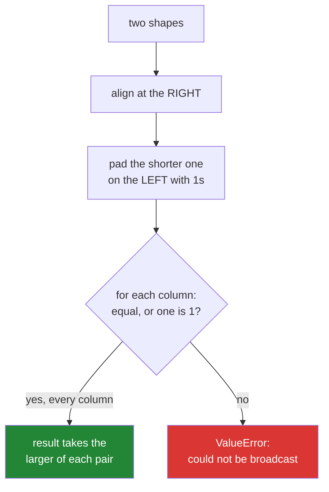

# 1.2 — The rule in three lines — align right, stretch the ones, otherwise refuse

## One-line answer

Write the two shapes one above the other, lined up at the **right-hand end**; each pair of numbers
must be equal or one of them must be 1; a missing number counts as 1, and anything else is an error.

---

## The story

Two people are comparing supermarket receipts to work out who paid more for the same shop.

The receipts are different lengths, so they line them up at the bottom — where the totals are —
rather than at the top. Everything matches up from the bottom: total against total, then the line
above, then the one above that. When one receipt runs out, they treat the missing lines as blank.

They do not line the receipts up at the top and hope. Nobody does that, because the tops are the shop
address and the date, and the useful comparison is at the other end.

Lining up from the right, and treating "not there" as "one of these", is the whole rule. The rest of
this part is just being precise about it.

---

## The idea in plain language

Two arrays can take part in the same elementwise operation when their shapes are **compatible**.
NumPy decides that with a rule you can apply on paper, and once you can, every broadcasting error
stops being mysterious.

**Step one: write the shapes one above the other, aligned at the right.**

```
month  (4, 7)
means     (7,)
```

**Step two: pad the shorter one on the left with 1s.**

```
month  (4, 7)
means  (1, 7)
```

**Step three: compare each column. Every pair must be equal, or one of them must be 1.** Where one is
1, that array is **stretched** along the axis: its single value is reused for every position. The
result's shape takes the larger of each pair.

```
month  (4, 7)
means  (1, 7)
       -------
result (4, 7)
```

If any column has two different numbers and neither is 1, the shapes are not compatible and NumPy
raises. There is no fourth step and no exception to the rule.

Three points people trip on, all of them consequences rather than extra rules.

**The padding is on the left, and only on the left.** A `(4,)` array against a `(4, 7)` array becomes
`(1, 4)` against `(4, 7)`, and 4 against 7 fails. That is the commonest broadcasting error in
existence, and [1.4](1.4-keepdims-and-the-column.md) is entirely about it.

**A 1 is stretched; a 0 is not.** An axis of length 1 means "one value, reuse it". An axis of length 0
means "no values", and there is nothing to reuse.

**A plain number is a shape of `()`** — no axes at all — so it pads to all 1s and stretches to
anything. That is why [1.1](1.1-adding-one-number-to-every-day.md) worked without you having to think
about shapes.

`np.broadcast_shapes(a, b)` applies exactly this rule and returns the answer without allocating any
arrays, which makes it the right tool for checking your reasoning.

---

## Why Setu needs it

- **Every error message in the rest of this curriculum** that says "could not be broadcast together"
  is this rule refusing, and reading it is a skill you use for two hundred more days.
- **Day 76's scaler** subtracts a `(n_features,)` mean from an `(n_rows, n_features)` matrix, which
  works, and divides by a `(n_rows,)` array, which does not — for reasons this rule states exactly.
- **Day 125's neural layers** rely on a `(features,)` bias broadcasting across a
  `(batch, features)` activation, on every layer, in every framework.
- **Day 155's similarity matrix** builds an `(n, m)` result from an `(n, 1)` and a `(1, m)`, which is
  the two-sided case in step three.
- **Day 141's attention masks** are `(1, 1, positions, positions)` precisely so they broadcast across
  batch and heads, and reading that shape is reading this rule.

---

## The mechanism

The rule, applied to nine pairs of shapes, including the two that fail:

```python
import numpy as np

pairs = [
    ((4, 7), (7,)),
    ((4, 7), (4, 1)),
    ((4, 7), (1, 7)),
    ((4, 7), ()),
    ((4, 7), (4,)),
    ((3, 1), (1, 4)),
    ((2, 3, 4), (3, 4)),
    ((2, 3, 4), (4,)),
    ((5,), (3,)),
]

print(f"{'a':<12} {'b':<10} result")
for a, b in pairs:
    try:
        out = np.broadcast_shapes(a, b)
    except ValueError as exc:
        out = f"ValueError: {exc}"
    print(f"{str(a):<12} {str(b):<10} {out}")
```

**Line by line:**

- `np.broadcast_shapes(a, b)` — applies the rule to two **shapes**, with no arrays involved and nothing
  allocated. This is the function to reach for when you are reasoning about a pipeline rather than
  running it.
- `((4, 7), ())` — the empty tuple is the shape of a plain number. It pads to `(1, 1)` and stretches to
  anything, which is [1.1](1.1-adding-one-number-to-every-day.md) restated in shape language.
- `((4, 7), (4,))` — the failing one people write by accident. `(4,)` pads to `(1, 4)`, and 4 against 7
  in the last column has no reading.
- `((3, 1), (1, 4))` — **both** arrays stretch, one along each axis, giving `(3, 4)`. This is the case
  that produces a grid from two vectors, and it is also how a broadcast eats memory
  ([1.7](1.7-the-broadcast-that-ate-the-memory.md)).
- `try/except ValueError` around each call — the failures are part of the table rather than a reason to
  stop, so the loop catches and prints them
  ([Day 18, 1.2](../../../day-18-exceptions/parts/01-raising-and-catching/1.2-try-except-and-catching-by-type.md)).

```text
a            b          result
(4, 7)       (7,)       (4, 7)
(4, 7)       (4, 1)     (4, 7)
(4, 7)       (1, 7)     (4, 7)
(4, 7)       ()         (4, 7)
(4, 7)       (4,)       ValueError: shape mismatch: objects cannot be broadcast to a single shape.  Mismatch is between arg 0 with shape (4, 7) and arg 1 with shape (4,).
(3, 1)       (1, 4)     (3, 4)
(2, 3, 4)    (3, 4)     (2, 3, 4)
(2, 3, 4)    (4,)       (2, 3, 4)
(5,)         (3,)       ValueError: shape mismatch: objects cannot be broadcast to a single shape.  Mismatch is between arg 0 with shape (5,) and arg 1 with shape (3,).
```

Rows two and five are the pair worth staring at. `(4, 1)` works and `(4,)` does not, and they hold the
same four numbers. The difference is which end the padding happens at.

The rule as a picture:



Working it by hand on the day's own data:

```python
import numpy as np

month = np.array(
    [
        [8213, 10442, 6180, 0, 12007, 9631, 7204],
        [7788, 9120, 11345, 8402, 6733, 14210, 5096],
        [9004, 8765, 7621, 10188, 9950, 8317, 11002],
        [6540, 12488, 9873, 7106, 8899, 10540, 9218],
    ]
)

per_day = np.array([1.0, 1.0, 1.0, 1.0, 1.0, 0.8, 0.8])
per_week = np.array([1.0, 1.1, 1.0, 0.9])

print("month     :", month.shape)
print("per_day   :", per_day.shape, "->", np.broadcast_shapes(month.shape, per_day.shape))
print("weighted  :", (month * per_day)[0].round(0))
print("per_week  :", per_week.shape)
print("column    :", per_week[:, np.newaxis].shape)
print("by week   :", (month * per_week[:, np.newaxis])[:, 0].round(0))
```

**Line by line:**

- `per_day` — one weight per day of the week, weekends counted at 0.8. Its shape is `(7,)`, which pads
  to `(1, 7)` and stretches down the four weeks: **the same seven weights applied to every week.**
- `np.broadcast_shapes(month.shape, per_day.shape)` — the rule, checked before the arithmetic rather
  than after the error.
- `per_week` — one weight per week, shape `(4,)`. Multiplying directly would pad it to `(1, 4)` and
  fail against seven days, which is the trap in row five of the table.
- `per_week[:, np.newaxis]` — reshaped to `(4, 1)`
  ([Day 21, 1.6](../../../day-21-indexing-and-views/parts/01-one-element/1.6-ellipsis-and-newaxis.md)),
  which lines the 4 up with the weeks and stretches across the days. **One `np.newaxis` is the
  difference between an error and the right answer**, and [1.4](1.4-keepdims-and-the-column.md) is
  about never having to add it by hand.
- `.round(0)` — display only; the values are floats because a float weight was applied.

```text
month     : (4, 7)
per_day   : (7,) -> (4, 7)
weighted  : [ 8213. 10442.  6180.     0. 12007.  7705.  5763.]
per_week  : (4,)
column    : (4, 1)
by week   : [8213. 8567. 9004. 5886.]
```

---

## When it breaks

**The shapes that will not line up:**

```text
$ uv run python -c "
import numpy as np
month = np.arange(28).reshape(4, 7)
per_week = np.array([1, 2, 3, 4])
print(month * per_week)
"
Traceback (most recent call last):
  File "<string>", line 5, in <module>
ValueError: operands could not be broadcast together with shapes (4,7) (4,)
```

**What it means.** Apply the rule on paper: `(4, 7)` above, `(4,)` below, aligned right, so the 4 sits
under the 7. Four against seven, neither is 1, refused. The message prints both shapes and that is
usually enough — the fix is `per_week[:, np.newaxis]`, which makes it `(4, 1)` and puts the 4 under
the 4. **When you see this error, write the two shapes down right-aligned before changing anything.**

**The transpose that looked like the fix:**

```text
$ uv run python -c "
import numpy as np
month = np.arange(28).reshape(4, 7)
per_week = np.array([1, 2, 3, 4])
print('shape :', (month.T * per_week).T.shape)
print('same as newaxis :', np.array_equal((month.T * per_week).T, month * per_week[:, None]))
"
shape : (4, 7)
same as newaxis : True
```

**What it means.** Transposing so the axes line up, multiplying, then transposing back does work, and
it is how people who have not learned the rule get out of trouble. It is worth knowing that it is
correct, and worth not writing: it costs two transposes, it reads as though something deep is
happening, and the `[:, None]` version says exactly what it means. Transposes are cheap
([3.1](../03-transpose/3.1-t-the-axes-swapped.md)) so this is a readability argument, not a
performance one.

**The one that silently did the wrong thing:**

```text
$ uv run python -c "
import numpy as np
scores = np.arange(12).reshape(3, 4)
weights = np.array([1, 0, 0, 0])
print('weights as a row (broadcast across rows):')
print(scores * weights)
print('shape :', (scores * weights).shape)
"
weights as a row (broadcast across rows):
[[0 0 0 0]
 [4 0 0 0]
 [8 0 0 0]]
shape : (3, 4)
```

**What it means.** Here `(3, 4)` and `(4,)` are compatible, so nothing raises — but if the intent was
one weight per **row**, the weights have been applied down the wrong axis and every answer is wrong.
A square array is the dangerous case: with `(4, 4)` and `(4,)` both interpretations are legal and
NumPy always picks the last axis. **Broadcasting is silent when it succeeds**, so the test that
catches this is one with a non-square fixture, where the wrong axis raises instead.

---

## In production

**What a professional writes instead of the teaching version.** They check the shapes at the boundary,
with a message that names the arrays rather than their dimensions:

```python
from __future__ import annotations

import numpy as np


def apply_day_weights(month: np.ndarray, weights: np.ndarray) -> np.ndarray:
    """Scale each day by its weekday weight.

    ``month`` is (weeks, 7); ``weights`` is (7,), one per day of the week.
    """
    if month.ndim != 2 or month.shape[1] != 7:
        raise ValueError(f"expected (weeks, 7), got {month.shape}")
    if weights.shape != (month.shape[1],):
        raise ValueError(
            f"expected one weight per day of the week, {(month.shape[1],)}, got {weights.shape}"
        )
    return month * weights


def apply_week_weights(month: np.ndarray, weights: np.ndarray) -> np.ndarray:
    """Scale each week by its own weight.

    ``weights`` is (weeks,); it is reshaped here so the caller never has to.
    """
    if weights.shape != (month.shape[0],):
        raise ValueError(f"expected one weight per week, {(month.shape[0],)}, got {weights.shape}")
    return month * weights[:, np.newaxis]
```

**Line by line:**

- Two functions, one per axis, rather than one that guesses. **The axis a weight applies to is part of
  what the caller means**, and a single function taking either would have to guess from the shape —
  which is exactly the silent failure above on square data.
- `weights.shape != (month.shape[1],)` — comparing the whole shape tuple rather than just the length,
  so a `(7, 1)` array is rejected rather than broadcast into a surprise.
- The error messages quote **both** the expected shape and the received one. `expected (7,), got (4,)`
  tells the caller what to change; `shapes not aligned` does not.
- `month * weights[:, np.newaxis]` — the reshape lives **inside** the function that knows what the
  weights mean. Making the caller write `[:, None]` at every call site is how a codebase ends up with
  half its call sites doing it and half not.
- Neither function checks the dtype, deliberately. Broadcasting is about shape; a dtype problem raises
  its own clear error and adding a check would only make the failure earlier, not clearer.

**What changes at scale.** The rule does not change and the cost of getting it wrong does. Two things
matter at size. First, an accidental `(n, 1)` against `(1, n)` produces an `n × n` array — a thousand
rows becomes a million values, a million rows becomes a trillion, and the process dies rather than
slows ([1.7](1.7-the-broadcast-that-ate-the-memory.md)). Second, silent success on square data becomes
a real risk once batch size happens to equal feature count, which it does more often than you would
think — 64, 128, 256 are common on both sides. Production code asserts the output shape after any
broadcast it did not write itself: `assert out.shape == (n_rows, n_features)` costs nothing and turns
a transposed result into a stopped job.

**The failure that only appears with real data.** A normalisation step divided a
`(batch, features)` activation by a `(batch,)` array of norms. It worked in every test, because the
test batch was 32 and there were 32 features. The first real batch had 31 rows, the shapes stopped
being square, and the job raised `operands could not be broadcast together with shapes (31,64)
(31,)`. That error was a gift: the code had been silently dividing by the wrong axis in every test
run, and the shape mismatch was the first honest signal.

**The review comment a senior engineer leaves.** *"`x * w` here relies on `w` being `(features,)`.
Assert it, because if someone passes `(batch,)` and batch happens to equal features, this multiplies
along the wrong axis and returns a plausible array. One `assert w.shape == (x.shape[1],)` and the
class of bug disappears."*

**The interview question.** *"When can two arrays of different shapes be added?"* Line the shapes up at
the right-hand end, pad the shorter with 1s on the left, and require every column to be equal or to
contain a 1; an axis of length 1 is stretched by reusing its single value. So `(4, 7)` and `(7,)`
work, `(4, 7)` and `(4, 1)` work, and `(4, 7)` and `(4,)` do not — because the padding is on the left,
so the 4 lands under the 7. The detail that shows experience is that broadcasting is silent when it
succeeds: on square arrays both interpretations are legal, so the wrong axis produces a plausible
result rather than an error, and the defence is asserting the shape rather than trusting the rule.

---

## Check yourself

```bash
uv run python -c "
import numpy as np
for a, b in [((8, 3), (3,)), ((8, 3), (8,)), ((8, 3), (8, 1)), ((8, 1), (1, 3))]:
    try:
        print(f'{str(a):<8} {str(b):<8} -> {np.broadcast_shapes(a, b)}')
    except ValueError:
        print(f'{str(a):<8} {str(b):<8} -> refused')
"
```

Work all four out on paper first, right-aligned, then run it. The fourth one grows.

**Answer out loud, without scrolling up:**

> `(4, 7)` and `(4,)` will not broadcast, but `(4, 7)` and `(7,)` will. Say why, in terms of which end
> the shapes are lined up at, and give the one-expression fix for the first pair.

---

**Next:** [1.3 — a row against a table](1.3-a-row-against-a-table.md).
