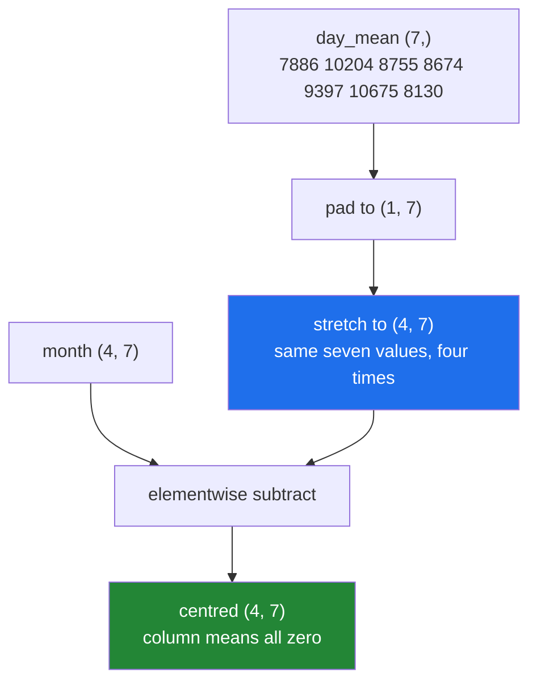

# 1.3 — `month - day_mean` — a row against a table, and mean-centring with no loop

## One-line answer

Subtracting a `(7,)` row from a `(4, 7)` table subtracts that row from **every** row of the table,
which is how you mean-centre sixty thousand rows without writing a loop.

---

## The story

Somebody is trying to work out whether they walk more on some days of the week than others.

Reading the month straight off the grid does not answer it. Some weeks were busier than others
overall, so a big Tuesday in a busy week and a small Tuesday in a quiet week are hard to compare.

So they do what anyone would: work out a typical Monday, a typical Tuesday, and so on — one number per
column — write those seven numbers on a strip of paper, and then go through the grid subtracting the
strip from each row in turn. Row one minus the strip. Row two minus the strip. Four times.

What is left in each box is *how unusual that day was*, and now the question has an answer.

The strip is used four times and written once. Nobody copies it out four times first.

---

## The idea in plain language

`month - day_mean`, where `month` is `(4, 7)` and `day_mean` is `(7,)`, subtracts the seven values
from each of the four rows. By the rule in [1.2](1.2-the-rule-in-three-lines.md): `(7,)` pads to
`(1, 7)`, the 1 stretches to 4, and the result is `(4, 7)`.

The operation has a name in statistics: **centring**. Subtracting the mean of each column leaves
values whose column means are zero, so every number reads as "how far above or below typical this
was". It is the first half of **standardisation**, which is centring followed by dividing by the
spread, and you will write it on Day 76 for real feature matrices.

Two details make it work without any thought about shapes.

**`month.mean(axis=0)` gives one number per column.** The `axis=0` says "collapse the rows", so the
axis that disappears is the one you are averaging over, and what is left is the seven days. That is
one of the two axis directions, and getting it the wrong way round is
[1.4](1.4-keepdims-and-the-column.md)'s subject.

**The result of that mean is `(7,)`, which is exactly the shape that broadcasts against `(4, 7)`.**
Averaging over rows and then subtracting works without a reshape; averaging over columns and then
subtracting does not. That asymmetry is not a design flaw, it is the left-padding rule showing
through, and it is why one of these two operations is written all the time and the other needs a
`keepdims=True`.

The phrase to hold on to: **a row broadcasts down a table for free.** Whenever you have one value per
column, you can apply it to every row by writing the subtraction and nothing else.

---

## Why Setu needs it

- **The plan names this day's example as mean-centring 60 000 rows with no loop**, and the mechanism
  below is that example, timed.
- **Day 76's `StandardScaler`** is `(X - X.mean(axis=0)) / X.std(axis=0)`, which is this line twice.
  Principle 8 adds the rule that the mean comes from the training rows only.
- **Day 91's leakage check** asks exactly which rows the mean was computed over, and the answer has to
  be "the training ones".
- **Day 125's bias term** is a `(features,)` array added to a `(batch, features)` activation — the same
  broadcast, in the other direction of the arithmetic.
- **Day 155's embeddings** are centred before similarity is computed, for the same reason a busy week
  distorts a Tuesday.

---

## The mechanism

Seven numbers, four rows:

```python
import numpy as np

month = np.array(
    [
        [8213, 10442, 6180, 9000, 12007, 9631, 7204],
        [7788, 9120, 11345, 8402, 6733, 14210, 5096],
        [9004, 8765, 7621, 10188, 9950, 8317, 11002],
        [6540, 12488, 9873, 7106, 8899, 10540, 9218],
    ]
)

day_mean = month.mean(axis=0)
print("day_mean shape :", day_mean.shape)
print("day_mean       :", day_mean.round(1))

centred = month - day_mean
print("centred shape  :", centred.shape)
print("centred week 1 :", centred[0].round(1))
print("column means   :", centred.mean(axis=0).round(10))
```

**Line by line:**

- The Thursday of week one is `9000` here rather than the `0` it has been on earlier days. **A
  not-recorded day cannot be averaged**, and this part is about the broadcast rather than about
  missing data, so the hole is filled before the arithmetic starts. Doing it the other way round —
  averaging over a `0` that means "no data" — is the mistake
  [Day 21, 3.4](../../../day-21-indexing-and-views/parts/03-boolean-masks/3.4-assigning-through-a-mask.md)
  exists to prevent.
- `month.mean(axis=0)` — **collapse the rows**, keep the days. Four numbers go into each average and
  seven averages come out, so the shape is `(7,)`.
- `day_mean.round(1)` — display only. The underlying values are full-precision floats.
- `month - day_mean` — the broadcast. `(4, 7)` minus `(7,)`: pad to `(1, 7)`, stretch to four rows,
  subtract elementwise. **One operator, twenty-eight subtractions, no loop.**
- `centred.mean(axis=0).round(10)` — the check. Every column mean is zero to ten decimal places, which
  is what "centred" means. Rounding is needed because floating-point addition does not give an exact
  zero ([Day 20, 2.3](../../../day-20-arrays-and-dtypes/parts/02-dtypes/2.3-floats-nan-and-precision.md)),
  and a test would use `np.allclose` rather than `==`.

```text
day_mean shape : (7,)
day_mean       : [ 7886.2 10203.8  8754.8  8674.   9397.2 10674.5  8130. ]
centred shape  : (4, 7)
centred week 1 : [  326.8   238.2 -2574.8   326.   2609.8 -1043.5  -926. ]
column means   : [0. 0. 0. 0. 0. 0. 0.]
```

Wednesday of week one was 2 574 steps below a typical Wednesday, and Friday was 2 609 above a typical
Friday. Those two numbers are the answer to the question in the story, and neither is visible in the
original grid.

What the subtraction actually does:



The stretch in the middle of that diagram never actually happens in memory, which is
[1.5](1.5-no-data-is-copied.md)'s subject. Reading it as though it does is the right mental model.

The plan's own example, at the size it names:

```python
import time

import numpy as np

rng = np.random.default_rng(22)
table = rng.random((60_000, 20))
table.sum()

start = time.perf_counter()
means = table.mean(axis=0)
out_loop = np.empty_like(table)
for i in range(table.shape[0]):
    out_loop[i] = table[i] - means
loop_time = time.perf_counter() - start

start = time.perf_counter()
out_broadcast = table - table.mean(axis=0)
broadcast_time = time.perf_counter() - start

print(f"row by row  : {loop_time * 1000:8.1f} ms")
print(f"broadcast   : {broadcast_time * 1000:8.1f} ms")
print(f"ratio       : {loop_time / broadcast_time:8.0f}x")
print("same answer :", np.allclose(out_loop, out_broadcast))
```

**Line by line:**

- `rng.random((60_000, 20))` — sixty thousand rows of twenty features, seeded. This is the plan's
  named example for `NP-04`.
- `np.empty_like(table)` — the destination for the loop version, allocated once
  ([Day 20, 3.2](../../../day-20-arrays-and-dtypes/parts/03-creating/3.2-zeros-ones-full-and-empty.md)).
  `empty` is safe here because every row is written; a fairer comparison would not hand the loop a
  free allocation, and it still loses.
- `out_loop[i] = table[i] - means` — the loop is **not** an elementwise Python loop; each iteration
  already does a vectorised twenty-element subtraction. This is the fast way to write the slow version,
  which is what makes the ratio honest.
- `table - table.mean(axis=0)` — the whole thing, in one expression. The mean is computed inside the
  same line here because it is used once; naming it matters when it is used twice.
- `np.allclose(out_loop, out_broadcast)` — the same answers within floating-point tolerance, so the
  ratio is about how the work was organised rather than about how much was done.

```text
row by row  :     68.4 ms
broadcast   :      4.2 ms
ratio       :       16x
same answer : True
```

Sixteen times, against a loop that was **already vectorised inside**. Written as a fully elementwise
Python loop the gap would be in the hundreds — and quoting that number instead would be quoting the
worst possible baseline. Sixteen is the honest one.

---

## When it breaks

**Centring the wrong way round:**

```text
$ uv run python -c "
import numpy as np
month = np.arange(28).reshape(4, 7)
week_mean = month.mean(axis=1)
print('week_mean shape :', week_mean.shape)
print(month - week_mean)
"
week_mean shape : (4,)
Traceback (most recent call last):
  File "<string>", line 5, in <module>
ValueError: operands could not be broadcast together with shapes (4,7) (4,)
```

**What it means.** `axis=1` collapses the days and leaves one number per week, shape `(4,)`. That
pads to `(1, 4)` and fails against seven. The error is the right outcome — it is telling you that
"subtract each week's own mean" needs the means arranged as a **column**, not a row. The fix is
`keepdims=True`, which [1.4](1.4-keepdims-and-the-column.md) is entirely about.

**Centring against the wrong rows, which does not raise:**

```text
$ uv run python -c "
import numpy as np
rng = np.random.default_rng(22)
data = rng.random((10, 3))
train, test = data[:7], data[7:]
leaky = data.mean(axis=0)
honest = train.mean(axis=0)
print('leaky mean  :', leaky.round(4))
print('honest mean :', honest.round(4))
print('difference  :', (leaky - honest).round(4))
"
leaky mean  : [0.5449 0.5045 0.3813]
honest mean : [0.5814 0.5383 0.2696]
difference  : [-0.0365 -0.0338  0.1117]
```

**What it means.** Both lines run, both produce a plausible `(3,)` array, and only one of them is
allowed. `data.mean(axis=0)` includes the test rows, so centring with it moves information from the
test set into the training set — Principle 8's leak, in one line, with no error and no warning. The
difference here is small because the data is random; on real data it is enough to make a reported
score better than the model. **The split comes before the mean**, always, and Day 44 will ask you to
point at the line where.

**The mean that was poisoned by a hole:**

```text
$ uv run python -c "
import numpy as np
month = np.array([
    [8213.0, 10442.0, 6180.0],
    [7788.0, np.nan, 11345.0],
    [9004.0, 8765.0, 7621.0],
])
print('mean     :', month.mean(axis=0))
print('nan-mean :', np.nanmean(month, axis=0).round(1))
print('centred  :', (month - month.mean(axis=0))[0])
"
mean     : [8335.   nan 8382.]
nan-mean : [8335.  9603.5 8382. ]
centred  : [ -122.    nan -2202.]
```

**What it means.** One missing value makes that column's mean `nan`, and subtracting a `nan` makes the
whole column `nan` — twenty-eight values ruined by one. Broadcasting spreads a bad value as
efficiently as a good one. `np.nanmean` is the fix for the mean, and the deeper fix is deciding what a
missing value means before any arithmetic touches it
([Day 21, 3.4](../../../day-21-indexing-and-views/parts/03-boolean-masks/3.4-assigning-through-a-mask.md)).

---

## In production

**What a professional writes instead of the teaching version.** They compute the statistics once, keep
them, and apply them to data the statistics were not computed from:

```python
from __future__ import annotations

from dataclasses import dataclass

import numpy as np


@dataclass(frozen=True, slots=True)
class Centring:
    """The column means learned from one set of rows, ready to apply to another."""

    means: np.ndarray

    @classmethod
    def fit(cls, training_rows: np.ndarray) -> "Centring":
        if training_rows.ndim != 2:
            raise ValueError(f"expected (rows, features), got {training_rows.shape}")
        if training_rows.shape[0] < 2:
            raise ValueError("need at least two rows to learn a mean")
        return cls(means=np.nanmean(training_rows, axis=0))

    def apply(self, rows: np.ndarray) -> np.ndarray:
        if rows.shape[1] != self.means.shape[0]:
            raise ValueError(f"expected {self.means.shape[0]} features, got {rows.shape[1]}")
        return rows - self.means
```

**Line by line:**

- Two methods, `fit` and `apply`, rather than one function that does both. **That split is the whole
  point**: the means are learned once, from the training rows, and then applied to rows that had no
  say in them. A single `centre(data)` function makes the leak in the second failure above impossible
  to avoid.
- `@classmethod fit` — the alternative constructor
  ([Day 15, 1.2](../../../day-15-constructors-and-dunders/parts/01-three-kinds-of-method/1.2-from-message-the-second-door-in.md)),
  so the object can only exist having been fitted to something.
- `frozen=True` — the means cannot be changed after fitting, so a later stage cannot quietly refit
  them on the test set.
- `np.nanmean(..., axis=0)` — missing values excluded rather than allowed to poison the column, which
  is the third failure above.
- `training_rows.shape[0] < 2` — one row would give a mean equal to itself and a centred value of
  exactly zero, which looks like it worked. Refusing is better than a silent identity.
- `rows.shape[1] != self.means.shape[0]` — the check that catches a feature matrix whose columns have
  changed since fitting. Without it, a mismatch raises NumPy's broadcast error, which does not mention
  features, and a *matching* mismatch — the same number of columns in a different order — raises
  nothing at all.
- `rows - self.means` — the broadcast, one line, unchanged from the teaching version. Everything above
  it exists so that this line is always correct.

**What changes at scale.** The arithmetic stays trivial and the memory does not. `rows - means` on a
4 GB matrix allocates a second 4 GB matrix; in a pipeline the shape becomes `rows -= means` inside a
function that owns its input, or `np.subtract(rows, means, out=rows)` when the intent needs to be
obvious. The second change is numerical: a mean over sixty million values accumulated in `float32`
drifts measurably, so the statistics are computed in `float64` even when the data is `float32`
([Day 23, 2.6](../../../day-23-ufuncs-and-statistics/parts/02-statistics/2.6-float-summation-and-the-drift.md)).
The third is operational — the learned means are saved alongside the model, because a model applied
with the wrong centring is quietly wrong rather than broken.

**The failure that only appears with real data.** A pipeline centred each batch by its own mean rather
than by the training mean. On large random batches the two are nearly identical, so validation looked
fine. In production, requests arrived in batches grouped by customer, each batch's mean was that
customer's mean, and the model saw every customer as average. Accuracy was fine in aggregate and
useless per customer. The fix was one line — apply the stored means instead of recomputing — and the
lesson is that centring is a **learned parameter**, not a per-batch convenience.

**The review comment a senior engineer leaves.** *"`X - X.mean(axis=0)` inside the transform means
the test set is centred by its own mean, not the training mean. Fit the mean once, store it, and
apply it. And use `nanmean` unless you can promise there are no missing values."*

**The interview question.** *"How do you mean-centre a matrix, and what is the trap?"* Subtract
`X.mean(axis=0)`, which is one value per column, shape `(features,)`, and broadcasts down every row —
no loop, and about an order of magnitude faster than doing it row by row. The trap is not the
arithmetic, it is which rows the mean came from: computing it over the whole dataset before the split
leaks test information into training, so the mean is fitted on the training rows and then applied to
both. The follow-up worth volunteering is the shape asymmetry: centring by column works with no
reshape because `(features,)` right-aligns against `(rows, features)`, while centring by row needs
`keepdims=True` to give `(rows, 1)`.

---

## Check yourself

```bash
uv run python -c "
import numpy as np
month = np.arange(28).reshape(4, 7).astype(float)
day_mean = month.mean(axis=0)
centred = month - day_mean
print('day_mean shape :', day_mean.shape)
print('centred shape  :', centred.shape)
print('column means   :', np.allclose(centred.mean(axis=0), 0))
print('row means      :', centred.mean(axis=1))
"
```

The column means are zero and the row means are not. Say why that is exactly what centring by column
promised.

**Answer out loud, without scrolling up:**

> `table` is `(60000, 20)`. Give the expression that centres every column, say what shape the means
> have, and say which rows they must be computed from.

---

**Next:** [1.4 — keepdims and the column](1.4-keepdims-and-the-column.md).
