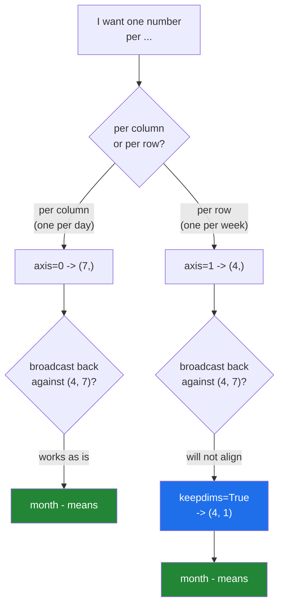

# 1.4 — `keepdims=True` — the axis that has to stay, and the column it makes

## One-line answer

A reduction along `axis=1` drops that axis, giving a `(4,)` row that will not broadcast back against
the `(4, 7)` it came from — `keepdims=True` leaves the axis in as a length of 1, giving the `(4, 1)`
column that does.

---

## The story

Somebody wants the opposite of yesterday's question. Not "how does this Tuesday compare with other
Tuesdays", but "how does this Tuesday compare with the rest of **its own week**".

So they work out one number per week — the week's own average — and write the four numbers down the
side of the grid, next to the row each belongs to.

That last detail is the whole part. The four numbers go **down the side**, not along the top. Written
along the top they would line up with the days, and subtracting them would be comparing Monday
against week one's average, Tuesday against week two's, and so on: four numbers in the wrong places,
producing an answer to no question at all.

Where a strip of numbers is laid — along the top or down the side — is not a detail of presentation.
It decides what the subtraction means.

---

## The idea in plain language

A **reduction** turns many values into one: `sum`, `mean`, `min`, `max`. Applied with an `axis=`, it
turns many values into one **along that axis**, and the axis disappears from the result.

For a `(4, 7)` month:

- `month.mean(axis=0)` collapses the weeks and leaves `(7,)` — one number per day of the week.
- `month.mean(axis=1)` collapses the days and leaves `(4,)` — one number per week.

Both results are flat one-dimensional arrays, and this is where the trouble starts, because the
broadcasting rule pads on the **left** ([1.2](1.2-the-rule-in-three-lines.md)):

```
month  (4, 7)          month  (4, 7)
axis=0    (7,)  ->  (1, 7)   OK      axis=1    (4,)  ->  (1, 4)   4 against 7, refused
```

The `(7,)` lands under the days and works. The `(4,)` lands under the days too — and it is a count of
weeks. The shapes are right-aligned, so a per-row statistic ends up pointing at the columns.

`keepdims=True` fixes it at the source. It tells the reduction to leave the collapsed axis in place
with a length of 1 rather than removing it:

- `month.mean(axis=1)` gives `(4,)`
- `month.mean(axis=1, keepdims=True)` gives `(4, 1)`

`(4, 1)` right-aligns against `(4, 7)` with the 4 under the 4 and the 1 stretching to 7, so the
subtraction means "each week's own average, applied along that week". Which is what the story
described: numbers down the side, not along the top.

Two more things worth knowing straight away.

**`arr.mean(axis=1)[:, np.newaxis]` is the same thing done afterwards.** It produces an identical
`(4, 1)` array ([Day 21, 1.6](../../../day-21-indexing-and-views/parts/01-one-element/1.6-ellipsis-and-newaxis.md)).
`keepdims=True` is preferred because it keeps the decision next to the reduction that caused it, and
because it works the same way for any number of axes without you counting brackets.

**On a square array, forgetting it does not raise.** `(4, 4)` against `(4,)` is a legal broadcast, so
the wrong-axis version returns a plausible array and the mistake survives every test written on square
fixtures. This is the failure below, and it is the reason `keepdims=True` is a habit rather than a
fix applied when something breaks.

---

## Why Setu needs it

- **Day 155's cosine similarity** divides a matrix of vectors by their lengths, and the lengths are a
  per-row statistic. Without `keepdims` the division either raises or, on a square batch, silently
  scales the wrong way.
- **Day 130's softmax** subtracts each row's maximum before exponentiating, and that maximum is
  `x.max(axis=-1, keepdims=True)`. Every implementation of softmax you will ever read has that
  argument in it.
- **Day 76's row-wise normalisation** — turning counts into proportions of each row's total — is the
  `share` calculation below.
- **Day 141's attention** normalises scores along the last axis of a four-dimensional tensor, where
  counting axes by hand is hopeless and `keepdims=True` is the only sane spelling.
- **Day 84's percentage tables** divide by a row total or a column total, and getting the wrong one is
  the classic spreadsheet error.

---

## The mechanism

The two directions, and what each one gives you:

```python
import numpy as np

month = np.array(
    [
        [8213, 10442, 6180, 9000, 12007, 9631, 7204],
        [7788, 9120, 11345, 8402, 6733, 14210, 5096],
        [9004, 8765, 7621, 10188, 9950, 8317, 11002],
        [6540, 12488, 9873, 7106, 8899, 10540, 9218],
    ]
)

flat = month.mean(axis=1)
kept = month.mean(axis=1, keepdims=True)
print("axis=1              :", flat.shape, flat.round(1))
print("axis=1, keepdims    :", kept.shape)
print(kept.round(1))
print("month - kept shape  :", (month - kept).shape)
print("row means after     :", (month - kept).mean(axis=1).round(10))
print("newaxis is the same :", np.array_equal(kept, flat[:, np.newaxis]))

share = month / month.sum(axis=1, keepdims=True)
print("share row 0         :", share[0].round(3))
print("rows sum to 1       :", np.allclose(share.sum(axis=1), 1.0))
```

**Line by line:**

- `month.mean(axis=1)` — one average per week, shape `(4,)`. Read `axis=1` as **"collapse the days"**;
  the axis you name is the one that disappears.
- `month.mean(axis=1, keepdims=True)` — the same four numbers, shape `(4, 1)`. Printed, it is a column:
  four rows of one value each.
- `month - kept` — `(4, 7)` minus `(4, 1)`: the 4s line up, the 1 stretches to 7. Each week's own
  average, subtracted along that week.
- `(month - kept).mean(axis=1)` — zero for every row, to ten decimal places. That is the check that
  the right axis was centred, and the tiny `-0.` values are floating-point noise
  ([Day 20, 2.3](../../../day-20-arrays-and-dtypes/parts/02-dtypes/2.3-floats-nan-and-precision.md)).
- `np.array_equal(kept, flat[:, np.newaxis])` — `True`. `keepdims=True` and a trailing `np.newaxis`
  produce the same array; the first says why the axis is there.
- `month / month.sum(axis=1, keepdims=True)` — each day as a share of its own week. This is the same
  pattern with division, and it is the one you will write most often.
- `np.allclose(share.sum(axis=1), 1.0)` — every row sums to 1, checked with a tolerance rather than
  `==`.

```text
axis=1              : (4,) [8953.9 8956.3 9263.9 9237.7]
axis=1, keepdims    : (4, 1)
[[8953.9]
 [8956.3]
 [9263.9]
 [9237.7]]
month - kept shape  : (4, 7)
row means after     : [-0.  0. -0. -0.]
newaxis is the same : True
share row 0         : [0.131 0.167 0.099 0.144 0.192 0.154 0.115]
rows sum to 1       : True
```

Which axis to name, and whether to keep it:



---

## When it breaks

**The refusal, which is the lucky case:**

```text
$ uv run python -c "
import numpy as np
month = np.arange(28).reshape(4, 7)
print(month - month.mean(axis=1))
"
Traceback (most recent call last):
  File "<string>", line 4, in <module>
ValueError: operands could not be broadcast together with shapes (4,7) (4,)
```

**What it means.** The per-week means came back as `(4,)`, which right-aligns under the seven days.
NumPy refuses, and you add `keepdims=True`. Thirty seconds, and no wrong numbers were produced. Read
this error as *"a per-row statistic is being applied to the columns"* and the fix writes itself.

**The same mistake on a square array, which raises nothing:**

```text
$ uv run python -c "
import numpy as np
square = np.arange(16).reshape(4, 4).astype(float)
print('no keepdims  :')
print(square - square.mean(axis=1))
print('keepdims     :')
print(square - square.mean(axis=1, keepdims=True))
"
no keepdims  :
[[ -1.5  -4.5  -7.5 -10.5]
 [  2.5  -0.5  -3.5  -6.5]
 [  6.5   3.5   0.5  -2.5]
 [ 10.5   7.5   4.5   1.5]]
keepdims     :
[[-1.5 -0.5  0.5  1.5]
 [-1.5 -0.5  0.5  1.5]
 [-1.5 -0.5  0.5  1.5]
 [-1.5 -0.5  0.5  1.5]]
```

**What it means.** Two completely different `(4, 4)` arrays, both plausible, neither flagged. The
first one subtracted week one's mean from every Monday, week two's mean from every Tuesday, and so on
— an operation with no meaning. The second centred each row against its own mean, which is what was
asked for. **A square fixture cannot tell these apart**, so the test that catches this needs a
non-square array, and the habit that prevents it is writing `keepdims=True` every time the statistic
is per-row.

**The four-dimensional version, where counting axes stops working:**

```text
$ uv run python -c "
import numpy as np
rng = np.random.default_rng(22)
scores = rng.random((4, 4, 4, 4))
kept = scores - scores.max(axis=-1, keepdims=True)
dropped = scores - scores.max(axis=-1)
print('axis=-1           :', scores.max(axis=-1).shape)
print('axis=-1, keepdims :', scores.max(axis=-1, keepdims=True).shape)
print('with keepdims     :', kept.shape, 'max per row:', np.unique(kept.max(axis=-1).round(10)))
print('without keepdims  :', dropped.shape, 'max per row:', np.unique(dropped.max(axis=-1).round(3))[:3])
print('same array        :', np.array_equal(kept, dropped))
"
axis=-1           : (4, 4, 4)
axis=-1, keepdims : (4, 4, 4, 1)
with keepdims     : (4, 4, 4, 4) max per row: [0.]
without keepdims  : (4, 4, 4, 4) max per row: [-0.449 -0.389 -0.305]
same array        : False
```

**What it means.** Both results are `(4, 4, 4, 4)` and they are different arrays. The `keepdims`
version does what softmax needs: after subtracting each row's own maximum, **every row's maximum is
exactly 0**, which is what stops `exp` overflowing. The version without it subtracted the maxima along
the wrong axes, so the row maxima are scattered negative numbers, and nothing raised — a `(4, 4, 4)`
result pads to `(1, 4, 4, 4)` and broadcasts happily against `(4, 4, 4, 4)`. On a tensor with equal
sizes in several axes, which is exactly what a small attention head looks like, the wrong version is
silent. Every softmax in every framework is written with `keepdims=True` for this reason.

**The `axis=None` that people reach for by mistake:**

```text
$ uv run python -c "
import numpy as np
month = np.arange(28).reshape(4, 7).astype(float)
print('no axis          :', month.mean(), month.mean().shape if hasattr(month.mean(), 'shape') else '')
print('axis=None keepdims:', month.mean(keepdims=True).shape)
print('centred overall  :', (month - month.mean()).mean().round(10))
"
no axis          : 13.5 ()
axis=None keepdims: (1, 1)
centred overall  : 0.0
```

**What it means.** With no `axis` at all, the reduction collapses **everything** into a single number
of shape `()`, which broadcasts against anything — so `month - month.mean()` centres the whole table
against one grand mean rather than per row or per column. That is a third, legitimate operation, and
it is not what either `axis=0` or `axis=1` does. When someone's centring "works but the numbers look
odd", the missing `axis=` is worth checking before anything else.

---

## In production

**What a professional writes instead of the teaching version.** Row normalisation, with the guard the
division needs:

```python
import numpy as np


def unit_rows(vectors: np.ndarray) -> np.ndarray:
    """Scale every row to length 1, so a dot product becomes a cosine similarity."""
    if vectors.ndim != 2:
        raise ValueError(f"expected (rows, features), got {vectors.shape}")
    lengths = np.linalg.norm(vectors, axis=1, keepdims=True)
    if not np.all(lengths > 0):
        raise ValueError(f"{int(np.count_nonzero(lengths == 0))} row(s) have length zero")
    return vectors / lengths
```

**Line by line:**

- `np.linalg.norm(vectors, axis=1, keepdims=True)` — the length of each row, kept as a `(rows, 1)`
  column so the division lines up. Without `keepdims` this raises on a non-square batch and silently
  scales along the wrong axis on a square one.
- `axis=1` — the length of a **row**, summing across its features. `axis=0` would give the length of
  each column, which is a different and rarely useful quantity.
- `if not np.all(lengths > 0): raise` — a zero-length row would divide to `inf` and `nan` with only a
  `RuntimeWarning`. An all-zero embedding is a real thing: it is what an encoder returns for an empty
  string.
- `int(np.count_nonzero(lengths == 0))` in the message — **how many** rows are bad, so the caller
  knows whether it is a corrupt batch or one empty document
  ([Day 18, 3.3](../../../day-18-exceptions/parts/03-your-own/3.3-the-message-is-an-interface.md)).
- `vectors / lengths` — the broadcast, `(rows, features)` over `(rows, 1)`. After this, the dot product
  of any two rows is their cosine similarity, which is the retrieval primitive of Day 155.

Run on four random vectors, it gives:

```text
lengths before : [0.4263 1.2701 1.1951 0.8246]
lengths after  : [1. 1. 1. 1.]
norm shape     : (4, 1)
similarity     : [1.    0.772 0.949 0.936]
zero row       : 2 row(s) have length zero
```

**What changes at scale.** The `keepdims` habit stops being about convenience and becomes the only
readable option. On a `(batch, heads, positions, features)` tensor nobody can hold the axis
arithmetic in their head, and `axis=-1, keepdims=True` says "along the last axis, keep the slot" in a
way that survives someone adding a batch dimension later. The second change is numerical: for softmax
the maximum is subtracted before exponentiating precisely to stop `exp` overflowing to `inf`, so the
`keepdims` there is protecting correctness and not just shape. Third, the division allocates: on a
large matrix, `vectors /= lengths` in a function that owns its input avoids a full-size temporary
([1.1](1.1-adding-one-number-to-every-day.md)).

**The failure that only appears with real data.** A retrieval service normalised its embedding matrix
with `vectors / np.linalg.norm(vectors, axis=1)` — no `keepdims`. The embedding dimension was 384 and
the batch size in testing was also 384, so the shapes broadcast, no error appeared, and the vectors
were scaled along the wrong axis. Similarity scores were wrong but plausibly ordered, so retrieval
"worked" and was simply worse than it should have been. It was found months later when a batch of 100
raised `operands could not be broadcast together with shapes (100,384) (100,)`.

**The review comment a senior engineer leaves.** *"`x / np.linalg.norm(x, axis=1)` needs
`keepdims=True`. It happens to work here because the batch is square; the first non-square batch will
raise, and until then it is normalising along the wrong axis."*

**The interview question.** *"What does `keepdims=True` do and when do you need it?"* A reduction
removes the axis it reduces, so `x.mean(axis=1)` on `(n, m)` gives `(n,)`; `keepdims=True` leaves the
axis in with length 1, giving `(n, 1)`. You need it whenever the statistic is going straight back into
an operation with the array it came from, because broadcasting right-aligns shapes: `(n,)` lines up
against the last axis and fails, while `(n, 1)` lines up against the first and stretches. The detail
that shows experience is that the failure is not always an exception — on a square array both shapes
broadcast, so the wrong version returns a plausible result, which is why softmax and row
normalisation are always written with `keepdims=True` rather than fixed when they break.

---

## Check yourself

```bash
uv run python -c "
import numpy as np
month = np.arange(28).reshape(4, 7).astype(float)
print('axis=0        :', month.mean(axis=0).shape)
print('axis=1        :', month.mean(axis=1).shape)
print('axis=1 kept   :', month.mean(axis=1, keepdims=True).shape)
print('col centred   :', np.allclose((month - month.mean(axis=0)).mean(axis=0), 0))
print('row centred   :', np.allclose((month - month.mean(axis=1, keepdims=True)).mean(axis=1), 0))
try:
    month - month.mean(axis=1)
except ValueError as exc:
    print('without kept  : refused ->', exc)
"
```

One of those five lines is the reason the next two hundred days write `keepdims=True` by reflex.

**Answer out loud, without scrolling up:**

> `x` is `(n, m)` and you want each row divided by its own total. Write the expression, say what shape
> the totals have, and say what happens if you leave `keepdims` out when `n` equals `m`.

---

**Next:** [1.5 — no data is copied](1.5-no-data-is-copied.md).
