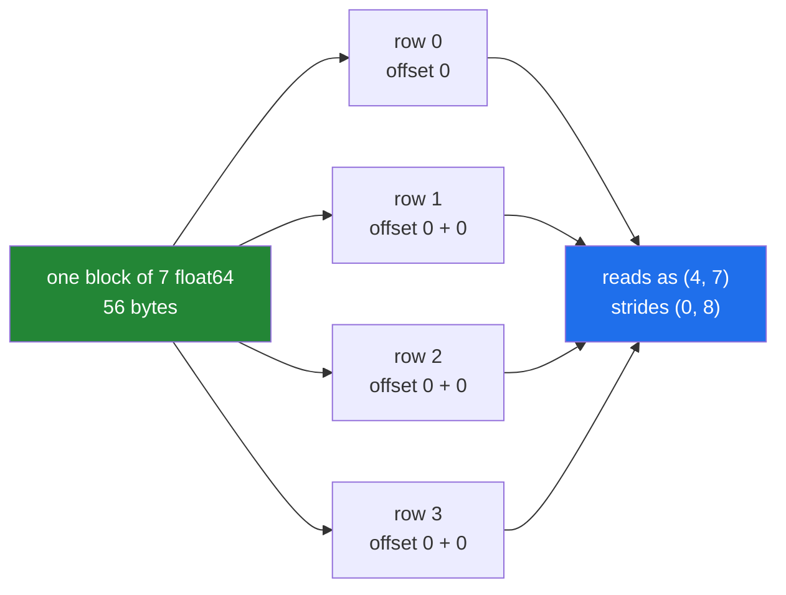

# 1.5 — A stride of zero — the stretching that never happens

## One-line answer

Broadcasting does not copy the smaller array four times; it reads the same seven numbers four times,
by setting that axis's **stride to zero** — the distance to step for the next row is nothing at all.

---

## The story

A choir of forty people is singing from one sheet of music.

There are not forty copies. There is one large sheet on a stand at the front, and everybody looks at
it. Each singer reads the same notes at the same time, and as far as any of them is concerned they
each have the music in front of them.

If somebody asks "how many sheets of music are in this room", the answer is one. If somebody asks
"how many people are reading music", the answer is forty. Both are true and they are answers to
different questions.

And there is a rule everyone understands without being told: you do not write on the sheet. Forty
people are reading it, so a correction made for one singer would appear for all of them, which is
almost never what anybody meant.

---

## The idea in plain language

When you write `month - day_mean`, the diagram in [1.3](1.3-a-row-against-a-table.md) shows the seven
means being stretched into a `(4, 7)` block before the subtraction. That is the right way to think
about the *result*. It is not what happens in memory.

Yesterday's Day 20 introduced **strides**: one number per axis, saying how many bytes to move to reach
the next position along that axis
([Day 20, 1.3](../../../day-20-arrays-and-dtypes/parts/01-the-block/1.3-one-block-and-strides.md)). A
`(4, 7)` array of `int64` has strides `(56, 8)`: eight bytes to the next day, fifty-six to the next
week.

Broadcasting works by setting a stride to **zero**. The stretched array is described as `(4, 7)` with
strides `(0, 8)`: eight bytes to the next day, and **nothing** to the next week. Stepping to the next
row moves the read position by zero bytes, so every row reads the same seven values. One sheet of
music, four singers.

Three consequences, and they are why this part exists rather than being a footnote.

**The memory cost of the stretch is zero.** `np.broadcast_to(day_mean, (4, 7))` reports `nbytes` of
224 and occupies 56, because `nbytes` is computed from the shape and dtype and does not know about the
zero stride. **`nbytes` is a claim about the shape, not a measurement of storage.**

**A broadcast array is read-only.** Writing to it would write through to the one underlying value and
appear in every row at once. NumPy refuses rather than surprising you:
`ValueError: assignment destination is read-only`. This is the choir's rule, enforced.

**The result of an arithmetic operation is not broadcast — it is real.** `month - day_mean` allocates
a genuine `(4, 7)` array with ordinary strides. The zero-stride trick applies to the *input* while it
is being read, not to the output. That is why [1.7](1.7-the-broadcast-that-ate-the-memory.md) can be
about memory at all.

Two functions let you see the machinery directly. `np.broadcast_to(arr, shape)` returns the
zero-stride view. `np.broadcast_arrays(a, b)` returns both inputs expanded to their common shape, and
printing their strides is the clearest possible demonstration of what an operation does internally.

---

## Why Setu needs it

- **Day 130's training loop** adds a `(features,)` bias to a `(batch, features)` activation on every
  step. If that broadcast allocated a batch-sized copy of the bias each time, training would be
  memory-bound rather than compute-bound.
- **Day 155's similarity search** relies on broadcasting a query vector against a whole matrix without
  duplicating the query per row.
- **Day 21's read-only views** were introduced as a discipline you apply
  ([Day 21, 2.2](../../../day-21-indexing-and-views/parts/02-the-view-trap/2.2-how-to-tell-base-and-shares-memory.md));
  here NumPy applies it to you, and the error text is identical.
- **Day 226's memory profiling** needs `nbytes` to be understood as a claim rather than a measurement,
  which this part is where you learn.
- **Day 1.7 of today** — the broadcast that ate the memory — is only surprising if you believe the
  stretch is free in all cases, and it is only free while nothing is written.

---

## The mechanism

The stretch, and what it really is:

```python
import numpy as np

day_mean = np.array([7886.2, 10203.8, 8754.8, 8674.0, 9397.2, 10674.5, 8130.0])

stretched = np.broadcast_to(day_mean, (4, 7))
print("original shape :", day_mean.shape, "nbytes", day_mean.nbytes)
print("stretched shape:", stretched.shape, "nbytes", stretched.nbytes)
print("strides        :", stretched.strides)
print("shares memory  :", np.shares_memory(day_mean, stretched))
print("writeable      :", stretched.flags.writeable)
print("base is        :", stretched.base is day_mean)
print(stretched[:2])
```

**Line by line:**

- `np.broadcast_to(day_mean, (4, 7))` — do the stretch explicitly, without any arithmetic, so it can be
  inspected. This is what the subtraction in [1.3](1.3-a-row-against-a-table.md) does to its
  right-hand operand internally.
- `stretched.nbytes` — **224, and it is not true.** The array reports what 4 × 7 `float64` values would
  cost. The storage behind it is still `day_mean`'s 56 bytes.
- `stretched.strides` — `(0, 8)`. **The zero is the whole mechanism.** Moving one step along axis 0
  moves zero bytes, so row 1 reads the same memory as row 0.
- `np.shares_memory(day_mean, stretched)` — `True`, which is the honest measurement that `nbytes` is
  not ([Day 21, 2.2](../../../day-21-indexing-and-views/parts/02-the-view-trap/2.2-how-to-tell-base-and-shares-memory.md)).
- `stretched.flags.writeable` — `False`, set by NumPy rather than by you. A write would land in one
  place and show up in four.
- `stretched.base is day_mean` — the view points straight at the original array, so the original is
  kept alive for as long as the broadcast exists
  ([Day 21, 5.1](../../../day-21-indexing-and-views/parts/05-in-anger/5.1-the-leak-a-view-causes.md)).
- `stretched[:2]` — two identical rows, which is what any reader of this array sees.

```text
original shape : (7,) nbytes 56
stretched shape: (4, 7) nbytes 224
strides        : (0, 8)
shares memory  : True
writeable      : False
base is        : True
[[ 7886.2 10203.8  8754.8  8674.   9397.2 10674.5  8130. ]
 [ 7886.2 10203.8  8754.8  8674.   9397.2 10674.5  8130. ]]
```

What a stride of zero means when the array is read:



Both operands, seen from the inside:

```python
import numpy as np

a = np.arange(4).reshape(4, 1)
b = np.arange(3).reshape(1, 3)
A, B = np.broadcast_arrays(a, b)
print("A shape/strides:", A.shape, A.strides)
print("B shape/strides:", B.shape, B.strides)
print("A nbytes claim :", A.nbytes, "real storage:", a.nbytes)
print("sum shape      :", (a + b).shape, "real allocation:", (a + b).nbytes)
```

**Line by line:**

- `a` is `(4, 1)` and `b` is `(1, 3)` — the two-sided case from
  [1.2](1.2-the-rule-in-three-lines.md), where **both** arrays stretch.
- `np.broadcast_arrays(a, b)` — returns both inputs expanded to the common `(4, 3)` shape, as views.
  This is exactly what `a + b` does before it starts adding.
- `A.strides` is `(8, 0)` — steps down the rows, stays put along the columns. `B.strides` is `(0, 8)` —
  the mirror image. **Each array has a zero exactly where it was stretched.**
- `A.nbytes` against `a.nbytes` — 96 claimed, 32 stored. Three times the claim, for an array that
  allocated nothing.
- `(a + b).nbytes` — 96, and this one is real. The **result** of the addition is an ordinary array with
  ordinary strides; only the operands were free.

```text
A shape/strides: (4, 3) (8, 0)
B shape/strides: (4, 3) (0, 8)
A nbytes claim : 96 real storage: 32
sum shape      : (4, 3) real allocation: 96
```

That last line is the sentence to remember: **the stretch is free and the result is not.** Four values
plus three values produced twelve, and twelve is what was allocated.

---

## When it breaks

**The write NumPy will not allow:**

```text
$ uv run python -c "
import numpy as np
day_mean = np.array([1.0, 2.0, 3.0])
stretched = np.broadcast_to(day_mean, (4, 3))
stretched[0, 0] = 99
"
Traceback (most recent call last):
  File "<string>", line 5, in <module>
ValueError: assignment destination is read-only
```

**What it means.** Writing to row 0 would write to the single underlying value, and rows 1, 2 and 3
would change too, because they are the same bytes. Rather than produce that surprise, NumPy marks
every broadcast array read-only. It is the same message you get from a view you froze yourself
([Day 21, 2.2](../../../day-21-indexing-and-views/parts/02-the-view-trap/2.2-how-to-tell-base-and-shares-memory.md)),
and the fix here is `np.broadcast_to(...).copy()` if you genuinely want four independent rows — which
costs the memory the broadcast was saving.

**The `nbytes` that lied:**

```text
$ uv run python -c "
import numpy as np
import tracemalloc
small = np.ones(1_000)
tracemalloc.start()
big = np.broadcast_to(small, (100_000, 1_000))
current, _ = tracemalloc.get_traced_memory()
tracemalloc.stop()
print('claims  :', f'{big.nbytes:,}', 'bytes')
print('actually:', f'{current:,}', 'bytes allocated')
print('strides :', big.strides)
"
claims  : 800,000,000 bytes
actually: 344 bytes
strides : (0, 8)
```

**What it means.** An array claiming 800 MB that cost a few hundred bytes. If you are estimating a program's
memory by summing `nbytes` — which is a reasonable thing to do — a broadcast array will make the
estimate wildly wrong in this direction, and an array of views will make it wrong in the other
([Day 21, 5.1](../../../day-21-indexing-and-views/parts/05-in-anger/5.1-the-leak-a-view-causes.md)).
Check `strides` for a zero and `base` for a parent before trusting a size.

**The copy that undid the saving:**

```text
$ uv run python -c "
import numpy as np
small = np.ones(1_000)
view = np.broadcast_to(small, (10_000, 1_000))
print('view nbytes  :', f'{view.nbytes:,}')
print('view strides :', view.strides)
real = view.copy()
print('copy strides :', real.strides)
print('copy is real :', real.flags.writeable, real.base is None)
"
view nbytes  : 80,000,000
view strides : (0, 8)
copy strides : (8000, 8)
copy is real : True True
```

**What it means.** `.copy()` on a broadcast array materialises every duplicate: the strides become
ordinary, the array becomes writeable, and 80 MB is genuinely allocated to hold ten thousand copies of
the same thousand numbers. It is occasionally what you want and usually a mistake. When you find
yourself copying a broadcast array, ask what you are about to write to it — the answer is often that
the operation should have been expressed differently.

---

## In production

**What a professional writes instead of the teaching version.** They use `broadcast_to` deliberately
when a large conceptual array is really a small one, and they say so:

```python
import numpy as np


def apply_per_feature_scale(rows: np.ndarray, scale: np.ndarray) -> np.ndarray:
    """Multiply every row by a per-feature scale, allocating only the result.

    ``scale`` is (features,) and is never materialised per row: the multiply reads it
    with a stride of zero, so the only allocation is the output.
    """
    if scale.shape != (rows.shape[-1],):
        raise ValueError(f"expected {(rows.shape[-1],)} scales, got {scale.shape}")
    return rows * scale


def as_batch_view(template: np.ndarray, batch: int) -> np.ndarray:
    """Present one row as a whole batch, without copying it.

    The result is READ-ONLY on purpose: every row is the same memory, so a write would
    change all of them. Copy it if the caller needs to modify rows independently.
    """
    return np.broadcast_to(template, (batch, *template.shape))
```

**Line by line:**

- `rows * scale` — one line, and the docstring is doing the real work by saying what does **not**
  happen. Someone reading this later will otherwise wonder whether to pre-expand `scale`.
- `scale.shape != (rows.shape[-1],)` — the last axis, so this works for `(rows, features)` and for
  `(batch, positions, features)` without change ([1.2](1.2-the-rule-in-three-lines.md)).
- `np.broadcast_to(template, (batch, *template.shape))` — the star unpacks the template's shape into
  the new one ([Day 8, 1.4](../../../day-08-containers/parts/01-sequences/1.4-unpacking-and-star-rest.md)),
  so a `(3,)` template becomes `(batch, 3)` and a `(2, 3)` one becomes `(batch, 2, 3)`.
- **The docstring says READ-ONLY in capitals** because the alternative is a caller who writes to it,
  gets a `ValueError`, and adds a `.copy()` that allocates the batch — silently undoing the reason the
  function exists.
- Neither function returns a broadcast array that will outlive its source. A broadcast view keeps its
  base alive exactly like any other view, so the same rule from
  [Day 21, 5.1](../../../day-21-indexing-and-views/parts/05-in-anger/5.1-the-leak-a-view-causes.md)
  applies.

**What changes at scale.** The zero-stride read is what makes broadcasting usable at all in a training
loop: adding a bias to a batch of ten thousand rows reads the bias ten thousand times from the same
cache line, which is close to free, rather than allocating and filling a batch-sized copy. The place
it stops being free is when a library needs contiguous memory and copies the broadcast operand
internally, which happens at the boundary to code written in another language. And there is one
genuine trap: `np.broadcast_to(x, shape).copy()` is a legitimate way to build a big array of repeated
values, but it is slower and less clear than `np.repeat` or `np.tile`, which say what they are doing.

**The failure that only appears with real data.** A service estimated its own memory by summing
`nbytes` over the arrays it held, and used that to decide when to evict from a cache. Some of those
arrays were broadcast views, so the estimate was several hundred times too high, and the cache evicted
everything on every request. The symptom was terrible performance with plenty of free memory. The fix
was to count `arr.base.nbytes` when `arr.base` is not `None`, and to treat `nbytes` as what it is: a
statement about shape.

**The review comment a senior engineer leaves.** *"`np.broadcast_to(bias, x.shape)` then `x + expanded`
— just write `x + bias`. The broadcast happens inside the addition anyway, and the explicit version
adds a read-only array that somebody will eventually try to write to."*

**The interview question.** *"Does broadcasting copy the smaller array?"* No. NumPy describes the
stretched operand with a stride of zero on the broadcast axis, so stepping along that axis moves zero
bytes and every position reads the same memory — one sheet of music, forty singers. That is why a
broadcast array is read-only: a write would land in one place and appear everywhere. The detail worth
adding is that only the *operands* are free; the result of the operation is an ordinary array with
ordinary strides, so `(n, 1) + (1, m)` allocates the full `n × m`, which is how a broadcast runs a
machine out of memory.

---

## Check yourself

```bash
uv run python -c "
import numpy as np
row = np.array([1.0, 2.0, 3.0])
wide = np.broadcast_to(row, (5, 3))
print('shape    :', wide.shape)
print('nbytes   :', wide.nbytes, 'but storage is', row.nbytes)
print('strides  :', wide.strides)
print('writeable:', wide.flags.writeable)
print('result   :', (np.zeros((5, 3)) + row).strides)
"
```

The last line is the strides of a real result rather than a broadcast operand. Say why they differ.

**Answer out loud, without scrolling up:**

> `np.broadcast_to(x, (1000, 7))` on a seven-element array. How much memory does it allocate, what is
> its first stride, and why can you not write to it?

---

**Next:** [1.6 — reading the broadcast error](1.6-reading-the-broadcast-error.md).
