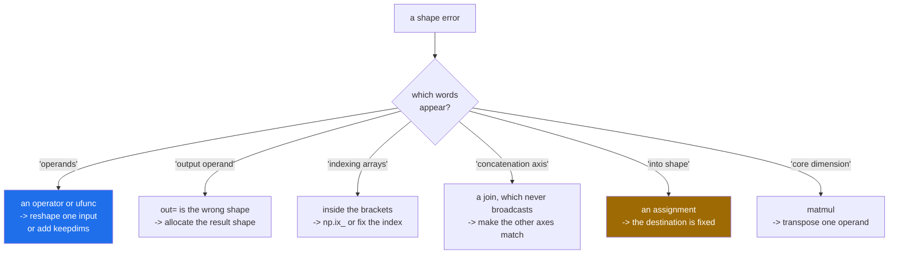

# 1.6 — Reading the error — six shape messages and what each one is telling you

## One-line answer

NumPy has six distinct shape errors, and each one names the operation that refused — an operator, an
output buffer, an index, a join, a matrix multiply, or an assignment — so the first word of the fix is
in the message.

---

## The story

A person is trying to put a new shelf up and the screws will not go in.

There are several ways that can happen, and they need different responses. The screw might be too fat
for the hole. The hole might be in the wrong place. The wall might be brick where the fixings are for
plasterboard. The screwdriver might be the wrong shape for the head.

"It will not go in" is the same experience every time, and it is not the useful description. Somebody
who has put up a lot of shelves does not say "it will not go in"; they say "that is a plasterboard
plug in a brick wall", and the fix follows from the sentence.

Shape errors are the same. They all feel like "the shapes are wrong". They are six different
sentences, and each one says which thing refused.

---

## The idea in plain language

Every shape error in NumPy is a refusal by one specific operation, and the message names it. Here are
the six you will meet, in the order of how often they appear.

**`operands could not be broadcast together with shapes (4,7) (4,)`** — an arithmetic operator, or any
ufunc, applied to two arrays whose shapes do not satisfy the rule from
[1.2](1.2-the-rule-in-three-lines.md). "Operands" means the things on either side of the operator.
Write the two shapes down right-aligned and the mismatch is visible.

**`non-broadcastable output operand with shape (7,) doesn't match the broadcast shape (4,7)`** — you
passed `out=` and the destination is not the shape of the result. NumPy will stretch an **input** and
never an output, because there is nowhere to put the extra values
([Day 21, 2.4](../../../day-21-indexing-and-views/parts/02-the-view-trap/2.4-the-function-that-changed-its-input.md)).

**`shape mismatch: objects cannot be broadcast to a single shape`** — from `np.broadcast_shapes` and
from a few functions that check shapes before doing anything. It is the same rule as the first
message, reported by a function whose only job is checking.

**`shape mismatch: indexing arrays could not be broadcast together with shapes (2,) (3,)`** — an
`IndexError`, not a `ValueError`, and it is about the **index arrays** rather than about the data
([Day 21, 4.2](../../../day-21-indexing-and-views/parts/04-fancy-indexing/4.2-two-index-arrays.md)).
The word "indexing" is the clue that the problem is inside the brackets.

**`all the input array dimensions except for the concatenation axis must match exactly`** — from
`np.concatenate` and its relatives, which do not broadcast at all
([4.1](../04-joining-and-splitting/4.1-concatenate.md)). Joining is not an elementwise operation, so a
length of 1 is not stretched; every axis except the one being joined has to match exactly.

**`could not broadcast input array from shape (4,) into shape (4,7)`** — an **assignment**. You wrote
`a[...] = something` and the something cannot be stretched to fill the destination. The word "into"
is the giveaway: the shape after it is the destination, and the destination never changes size.

There is a seventh that belongs to matrix multiplication and reads quite differently:
`matmul: Input operand 1 has a mismatch in its core dimension 0, with gufunc signature
(n?,k),(k,m?)->(n?,m?)`. That message is describing a **signature** rather than a broadcast, and the
useful part is the `(n?,k),(k,m?)` picture: the last axis of the left operand must equal the
second-to-last of the right. Everything before those axes is broadcast normally, which is how a batch
of matrices multiplies in one call.

The habit that turns all seven into thirty-second fixes: **read the two shapes in the message, write
them one above the other, right-aligned, and apply the rule.** The answer is always visible in the
two shapes; the prose around them only tells you which operation was asking.

---

## Why Setu needs it

- **You will meet these messages several hundred more times** in this curriculum, and the difference
  between reading them and guessing is most of the frustration in numerical work.
- **Day 76's pipelines** fail with the assignment version when a transformer returns a different number
  of columns than the step after it expects.
- **Day 130's training loops** fail with the matmul version, and reading the signature is how you find
  which of the two operands is transposed.
- **Day 44's scikit-learn** wraps these errors in its own messages that quote the same shapes, so the
  reading skill transfers directly.
- **Day 226's on-call** is where the ability to read an error at speed pays for itself.

---

## The mechanism

All six, produced deliberately, side by side:

```python
import numpy as np

month = np.arange(28).reshape(4, 7)

attempts = [
    ("operator", lambda: month + np.arange(4)),
    ("out= buffer", lambda: np.multiply(month, 2, out=np.empty(7))),
    ("shape check", lambda: np.broadcast_shapes((4, 7), (4,))),
    ("index arrays", lambda: month[np.array([0, 1]), np.array([0, 1, 2])]),
    ("concatenate", lambda: np.concatenate([np.zeros((2, 3)), np.zeros((2, 4))])),
    ("assignment", lambda: month.astype(float).__setitem__(slice(None), np.zeros(4))),
]

for label, attempt in attempts:
    try:
        attempt()
        print(f"{label:<14} no error")
    except (ValueError, IndexError) as exc:
        print(f"{label:<14} {type(exc).__name__}: {exc}")
```

**Line by line:**

- `lambda: ...` — each attempt is wrapped in a function so it can be stored in the list and called
  inside the `try`. Without the lambda, the expressions would be evaluated while the list was being
  built and the first one would stop the program
  ([Day 11, 3.1](../../../day-11-iterators-and-generators/parts/03-lambda-and-map/3.1-lambda-a-function-with-no-name.md)).
- `except (ValueError, IndexError)` — **two** exception types, because the index one is an `IndexError`
  and the rest are `ValueError`s. Catching a tuple of types is
  [Day 18, 1.2](../../../day-18-exceptions/parts/01-raising-and-catching/1.2-try-except-and-catching-by-type.md).
- `type(exc).__name__` — printing which class was raised, because that is half the diagnosis: an
  `IndexError` means the problem is inside the brackets and a `ValueError` means it is in the
  operation.
- `month.astype(float).__setitem__(slice(None), np.zeros(4))` — the assignment `a[:] = np.zeros(4)`,
  written as the method call it compiles to, so it fits inside a lambda. In real code you would write
  the brackets.
- `np.multiply(month, 2, out=np.empty(7))` — `np.empty` for the destination because it is about to be
  written to in full, if it were the right shape
  ([Day 20, 3.2](../../../day-20-arrays-and-dtypes/parts/03-creating/3.2-zeros-ones-full-and-empty.md)).

```text
operator       ValueError: operands could not be broadcast together with shapes (4,7) (4,)
out= buffer    ValueError: non-broadcastable output operand with shape (7,) doesn't match the broadcast shape (4,7)
shape check    ValueError: shape mismatch: objects cannot be broadcast to a single shape.  Mismatch is between arg 0 with shape (4, 7) and arg 1 with shape (4,).
index arrays   IndexError: shape mismatch: indexing arrays could not be broadcast together with shapes (2,) (3,)
concatenate    ValueError: all the input array dimensions except for the concatenation axis must match exactly, but along dimension 1, the array at index 0 has size 3 and the array at index 1 has size 4
assignment     ValueError: could not broadcast input array from shape (4,) into shape (4,7)
```

Which message means which fix:



The matmul message, which is worth taking apart on its own:

```python
import numpy as np

left = np.arange(12).reshape(4, 3)
right = np.arange(12).reshape(4, 3)

try:
    left @ right
except ValueError as exc:
    print("failed :", exc)

print("works  :", (left @ right.T).shape)
print("signature reads: (n, k) @ (k, m) -> (n, m)")
print("here           : (4, 3) @ (3, 4) -> (4, 4)")
```

**Line by line:**

- `left @ right` — both are `(4, 3)`, so the left's last axis is 3 and the right's second-to-last is 4.
  Those must be equal, and they are not.
- `(n?,k),(k,m?)->(n?,m?)` in the message — the **signature**. Read the `k` twice: it is the axis that
  must match, the left operand's last and the right operand's second-to-last. The `?` marks an axis
  that may be missing, which is how a matrix can multiply a plain vector.
- `left @ right.T` — transposing the right operand makes it `(3, 4)`, so the 3s meet and the result is
  `(4, 4)`. **Nine times out of ten a matmul shape error is a missing transpose**, and the tenth is
  operands in the wrong order.
- The two printed lines are the signature and the actual shapes, one above the other. Writing them
  like that is the whole technique.

```text
failed : matmul: Input operand 1 has a mismatch in its core dimension 0, with gufunc signature (n?,k),(k,m?)->(n?,m?) (size 4 is different from 3)
works  : (4, 4)
signature reads: (n, k) @ (k, m) -> (n, m)
here           : (4, 3) @ (3, 4) -> (4, 4)
```

---

## When it breaks

**The message that names the wrong thing to a beginner:**

```text
$ uv run python -c "
import numpy as np
table = np.zeros((100, 5))
row = np.zeros(100)
table[:] = row
"
Traceback (most recent call last):
  File "<string>", line 5, in <module>
ValueError: could not broadcast input array from shape (100,) into shape (100,5)
```

**What it means.** Read "from" and "into" carefully: `(100,)` is what you supplied and `(100, 5)` is
the destination, which cannot change. The instinct is to reshape the destination, and the destination
is not the problem. The fix is `row[:, np.newaxis]`, giving `(100, 1)`, which stretches to fill all
five columns. **In an assignment, only the right-hand side can be stretched.**

**The error that is really about the previous line:**

```text
$ uv run python -c "
import numpy as np
rng = np.random.default_rng(22)
table = rng.random((60, 4))
means = table.mean(axis=1)
print('means shape :', means.shape)
centred = table - means
"
means shape : (60,)
Traceback (most recent call last):
  File "<string>", line 7, in <module>
ValueError: operands could not be broadcast together with shapes (60,4) (60,)
```

**What it means.** The traceback points at the subtraction and the bug is in the line above it: the
mean was taken along the wrong axis, or was taken along the right axis without `keepdims=True`
([1.4](1.4-keepdims-and-the-column.md)). **A shape error names the line where two shapes met, not the
line where the wrong shape was made.** Printing the shape of every intermediate — as the snippet does
— is the fastest debugging technique in numerical code, and it is why so many notebooks are full of
`print(x.shape)`.

**The one that succeeds and should not have:**

```text
$ uv run python -c "
import numpy as np
rng = np.random.default_rng(22)
batch = rng.random((4, 4))
per_row = batch.mean(axis=1)
per_col = batch.mean(axis=0)
print('same shape        :', per_row.shape == per_col.shape)
print('same values       :', np.allclose(per_row, per_col))
print('both subtractions :', (batch - per_row).shape, (batch - per_col).shape)
"
same shape        : True
same values       : False
both subtractions : (4, 4) (4, 4)
```

**What it means.** No error at all. On a square array a per-row statistic and a per-column statistic
have the same shape, so both subtractions are legal and one of them is meaningless. **The absence of a
shape error is not evidence that the shapes are right**, which is the argument for asserting shapes
rather than relying on them to raise
([1.2](1.2-the-rule-in-three-lines.md)).

---

## In production

**What a professional writes instead of the teaching version.** They raise their own error before
NumPy gets the chance, because their message can name the data:

```python
from __future__ import annotations

import numpy as np


def check_shape(name: str, arr: np.ndarray, expected: tuple[int | None, ...]) -> None:
    """Raise with a useful message when an array is not the shape this code assumes.

    ``None`` in ``expected`` means "any size on this axis", so a batch dimension can vary.
    """
    if arr.ndim != len(expected):
        raise ValueError(
            f"{name}: expected {len(expected)} axes {expected}, got {arr.ndim}: {arr.shape}"
        )
    for axis, (got, want) in enumerate(zip(arr.shape, expected, strict=True)):
        if want is not None and got != want:
            raise ValueError(
                f"{name}: axis {axis} should be {want}, got {got} (full shape {arr.shape})"
            )


def score(features: np.ndarray, weights: np.ndarray, bias: np.ndarray) -> np.ndarray:
    """One score per row. Every shape assumption is stated before it is relied on."""
    check_shape("features", features, (None, weights.shape[0]))
    check_shape("weights", weights, (weights.shape[0],))
    check_shape("bias", bias, (1,))
    return features @ weights + bias
```

**Line by line:**

- `expected: tuple[int | None, ...]` — `None` means "whatever size", so `(None, 384)` is "any number of
  rows, 384 features". A batch dimension varies at runtime and a feature dimension must not.
- `arr.ndim != len(expected)` checked first — a `(4, 7)` array against a three-axis expectation is a
  different mistake from a wrong size, and it deserves its own message.
- `zip(arr.shape, expected, strict=True)` — `strict=True` raises if the two run out at different points
  ([Day 6, 1.3](../../../day-06-loops/parts/01-iteration/1.3-enumerate-and-zip.md)). The `ndim` check
  above already guarantees they match, and `strict=True` is what keeps that guarantee true after
  somebody edits one of them.
- `f"{name}: axis {axis} should be {want}, got {got}"` — the message names the **array**, the **axis**
  and both sizes. Compare that with `operands could not be broadcast together with shapes (32,384)
  (32,)`, which names neither array and leaves the reader to work out which is which.
- `check_shape("bias", bias, (1,))` — even the trivial one is checked, because a `(384,)` bias would
  broadcast against the scores and produce a completely wrong array with no error.
- The three checks are three lines and the work is one. **That ratio is correct for any function whose
  inputs come from somewhere else.**

**What changes at scale.** The errors move from development to production, and the message is all you
get. A `ValueError` from inside a training loop at three in the morning, quoting `(8192, 512)` and
`(512, 8192)`, tells you almost nothing about which tensor is which; the same failure with
`attention_scores: axis 1 should be 8, got 512` is diagnosed from the log line alone. Frameworks have
converged on the same answer — named dimensions, shape assertions at layer boundaries, and shape
comments on every tensor — because at scale nobody can reproduce the failure locally. The other change
is cost: a shape error that raises has wasted a few minutes, while one that broadcasts silently has
wasted a whole training run, so the assertions are placed where a silent success is possible, which is
wherever two axes could plausibly be equal.

**The failure that only appears with real data.** A model server accepted a batch of embeddings and
multiplied by a weight matrix. In testing the batch size was 1, so the embedding array arrived as
`(384,)` rather than `(1, 384)` and the matmul happened to work, returning a `(512,)` result that the
rest of the code accepted. With a real batch it arrived as `(32, 384)`, the matmul still worked, and
the downstream code — written against a one-dimensional result — silently took the first row. Every
request in the batch got the first request's answer. A `check_shape` on the input would have caught it
on the first test.

**The review comment a senior engineer leaves.** *"This will raise a bare NumPy broadcast error six
frames deep with two anonymous shapes. Assert the shapes at the top of the function with a message
that names the arrays — it is three lines and it turns a twenty-minute debugging session into a log
line you can read."*

**The interview question.** *"You get `ValueError: operands could not be broadcast together with
shapes (60,4) (60,)`. What do you do?"* Write the two shapes right-aligned: `(60, 4)` over `(60,)`
padded to `(1, 60)`, so 60 lands under 4 and refuses. That tells me the second array is a per-row
statistic being applied to the columns, so it needs `keepdims=True` at the reduction that made it —
and the bug is on the line above the one in the traceback, because a shape error names where two
shapes met rather than where the wrong shape was made. The detail worth adding is that different
NumPy operations give different messages — "output operand" means `out=`, "indexing arrays" means the
brackets, "into shape" means an assignment where only the right-hand side can stretch — so the wording
tells you which fix applies before you look at the shapes at all.

---

## Check yourself

```bash
uv run python -c "
import numpy as np
month = np.arange(28).reshape(4, 7)
for label, fn in [
    ('operator', lambda: month + np.arange(4)),
    ('assignment', lambda: month.astype(float).__setitem__(slice(None), np.zeros(4))),
    ('concatenate', lambda: np.concatenate([np.zeros((2, 3)), np.zeros((2, 4))])),
]:
    try:
        fn()
    except ValueError as exc:
        print(f'{label:<12}', str(exc)[:70])
"
```

Three messages, three different operations. Say which word in each one identifies the operation.

**Answer out loud, without scrolling up:**

> What is the difference between "operands could not be broadcast together" and "could not broadcast
> input array from shape X into shape Y", and which of the two shapes in the second message can you
> change?

---

**Next:** [1.7 — the broadcast that ate the memory](1.7-the-broadcast-that-ate-the-memory.md).
