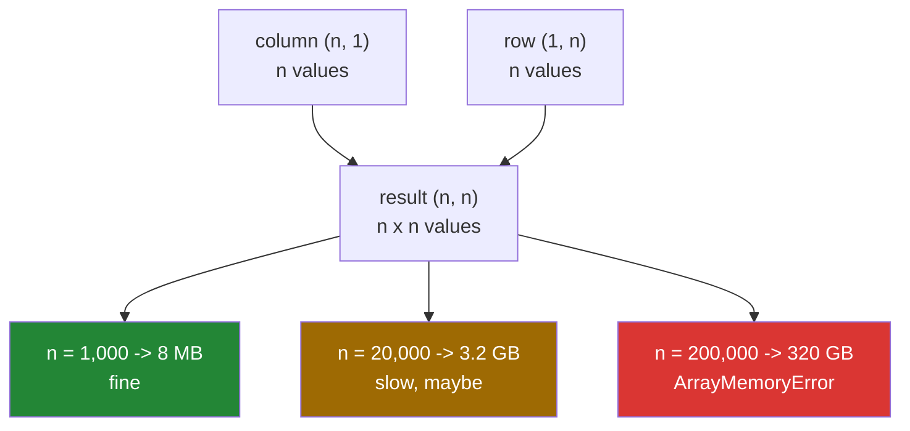

# 1.7 — `(n, 1)` against `(1, n)` — the broadcast that ate the memory

## One-line answer

When both operands stretch — a column against a row — the result is every combination, so two arrays
of twenty thousand values produce a matrix of four hundred million, and the process dies before it
prints anything.

---

## The story

Somebody is organising a small conference and wants to know who should meet whom.

With seven people it is easy. Write the seven names down the side of a sheet and the same seven along
the top, and you have a grid of forty-nine boxes: every person against every other person. It fits on
one page and it is genuinely useful.

They run the same conference the following year with two hundred people. The same idea now needs a
grid of forty thousand boxes, which is a large poster and nobody's idea of useful, but it exists.

The year after that there are twenty thousand attendees. The grid has four hundred million boxes. Nobody
notices this while planning, because the instruction has not changed at all — it is still "everyone
against everyone" and it is still one sentence.

The sentence stayed the same size. The paper did not.

---

## The idea in plain language

[1.5](1.5-no-data-is-copied.md) said the stretch is free, and it is: the *operands* are read with a
stride of zero and nothing is copied. The **result** is a real array with real memory, and its size is
the broadcast shape.

For most broadcasts that does not matter, because the result is the size of the larger operand.
`(60000, 20)` minus `(20,)` is a `(60000, 20)` result — the same size as the input you already had.

The dangerous case is when **both** operands stretch, which happens when one is a column and the other
is a row:

```
column  (n, 1)
row     (1, m)
        --------
result  (n, m)
```

Two arrays holding n and m values produce a result holding n × m. That multiplication is the whole
part. It is also, most of the time, exactly what you want: an outer product, a distance matrix, every
pair of something against every other. The operation is not a mistake; the size is.

The arithmetic is worth having in your head, for `float64` at eight bytes per value:

| n | result | memory |
|---|---|---|
| 1 000 | 1 000 000 | 8 MB |
| 10 000 | 100 000 000 | 800 MB |
| 20 000 | 400 000 000 | 3.2 GB |
| 100 000 | 10 000 000 000 | 80 GB |

Ten times the input is a hundred times the output. A function that works comfortably on a thousand
rows and is asked for a hundred thousand does not get a hundred times slower; it fails.

When it fails, it fails with `numpy._core._exceptions._ArrayMemoryError: Unable to allocate 298. GiB
for an array with shape (200000, 200000) and data type int64` — a clear message, and the size in it
is often the first time anyone has thought about the size at all.

Three ways out, in the order to try them.

**Do not build the matrix.** Many uses of a pairwise matrix only need a reduction of it — the largest
gap, the nearest neighbour, the row sums. Those can often be computed without the matrix, either
algebraically or by a library function written for the purpose.

**Build it in blocks.** Process two thousand rows at a time, reduce each block, and keep the running
answer. The peak memory becomes the block rather than the whole, and the total work is the same. This
is the technique below.

**Use a smaller dtype.** `float32` halves it. It is the least effective of the three and the easiest
to reach for, so it is worth naming last: 40 GB is no more allocatable than 80.

---

## Why Setu needs it

- **Day 155's similarity search** is a pairwise matrix by definition — every query against every
  document — and it is the first place this bites for real.
- **Day 107's clustering** computes distances between every pair of points, and the naive
  implementation is exactly the code below.
- **Day 84's correlation matrix** is fine at twenty features and impossible at a hundred thousand.
- **Day 130's batching** exists partly for this reason: a batch is a block, and blocking is how a
  computation too large for memory is made to fit.
- **Day 226's incident** is a service killed by the kernel with no traceback, and an accidental
  pairwise broadcast is one of the two commonest causes.

---

## The mechanism

The useful version first, on seven values:

```python
import numpy as np

counts = np.array([8213, 10442, 6180, 9000, 12007, 9631, 7204])

gaps = counts[:, np.newaxis] - counts[np.newaxis, :]
print("counts shape :", counts.shape)
print("column shape :", counts[:, np.newaxis].shape)
print("row shape    :", counts[np.newaxis, :].shape)
print("gaps shape   :", gaps.shape)
print("gaps nbytes  :", gaps.nbytes, "from two arrays of", counts.nbytes)
print(gaps[:3, :3])

for n in (1_000, 10_000, 100_000):
    values = n * n * 8
    print(f"n = {n:>7,} -> ({n:,}, {n:,}) float64 = {values / 1e9:8.2f} GB")
```

**Line by line:**

- `counts[:, np.newaxis]` — a `(7, 1)` column
  ([Day 21, 1.6](../../../day-21-indexing-and-views/parts/01-one-element/1.6-ellipsis-and-newaxis.md)).
- `counts[np.newaxis, :]` — a `(1, 7)` row. It is the same seven numbers, laid the other way.
- `column - row` — `(7, 1)` against `(1, 7)`: the 1 in each stretches to the other's 7, giving `(7, 7)`.
  **Both operands stretched**, which is the case to recognise on sight.
- `gaps[i, j]` is `counts[i] - counts[j]` — the difference between day i and day j, for every pair. The
  diagonal is zero because a day differs from itself by nothing, and the matrix is
  antisymmetric: `gaps[j, i] == -gaps[i, j]`.
- `gaps.nbytes` against `counts.nbytes` — 392 bytes from 56. Seven times the input, because n is seven.
- The loop at the end does no work at all; it prints the arithmetic. **Doing that multiplication before
  writing the line is the entire defence**, and it takes ten seconds.

```text
counts shape : (7,)
column shape : (7, 1)
row shape    : (1, 7)
gaps shape   : (7, 7)
gaps nbytes  : 392 from two arrays of 56
[[    0 -2229  2033]
 [ 2229     0  4262]
 [-2033 -4262     0]]
n =   1,000 -> (1,000, 1,000) float64 =     0.01 GB
n =  10,000 -> (10,000, 10,000) float64 =     0.80 GB
n = 100,000 -> (100,000, 100,000) float64 =    80.00 GB
```

The shape of the disaster:



The way out, when the matrix is only wanted in order to reduce it:

```python
import time

import numpy as np

rng = np.random.default_rng(22)
points = rng.random(20_000)
points.sum()

start = time.perf_counter()
biggest = 0.0
for start_row in range(0, points.size, 2_000):
    block = points[start_row : start_row + 2_000, np.newaxis] - points[np.newaxis, :]
    biggest = max(biggest, float(np.abs(block).max()))
chunked_time = time.perf_counter() - start
block_bytes = 2_000 * points.size * 8
full_bytes = points.size * points.size * 8

print(f"points        : {points.size:,} values, {points.nbytes:,} bytes")
print(f"full matrix   : {full_bytes / 1e9:.2f} GB, never allocated")
print(f"one block     : {block_bytes / 1e6:.0f} MB, allocated 10 times")
print(f"chunked pass  : {chunked_time * 1000:.0f} ms")
print(f"largest gap   : {biggest:.6f}")
```

**Line by line:**

- `range(0, points.size, 2_000)` — ten blocks of two thousand rows. The block size is a **memory**
  decision: two thousand rows against twenty thousand columns is 320 MB, which is comfortable, and a
  block of two hundred would be ten times smaller and ten times more loop iterations.
- `points[start_row : start_row + 2_000, np.newaxis]` — a slice of the column, so only this block's rows
  are broadcast. The slice is a view and costs nothing
  ([Day 21, 1.3](../../../day-21-indexing-and-views/parts/01-one-element/1.3-slicing-one-axis.md)); the
  `block` it produces is the real allocation.
- `points[np.newaxis, :]` — the full row, every time. It is a view with a zero stride
  ([1.5](1.5-no-data-is-copied.md)), so repeating it in the loop costs nothing.
- `float(np.abs(block).max())` — reduce the block to one number immediately, then let the block be
  collected. **The block must not be kept**; keeping ten of them is the problem again with extra steps.
- `max(biggest, ...)` — the running answer. This works because the maximum of maxima is the maximum;
  a mean would need a running sum and a count instead, and a median would not decompose at all.
- `points.sum()` before timing — the warm-up.

```text
points        : 20,000 values, 160,000 bytes
full matrix   : 3.20 GB, never allocated
one block     : 320 MB, allocated 10 times
chunked pass  : 2674 ms
largest gap   : 0.999938
```

Three point two gigabytes of intermediate values, computed and reduced, with a peak of 320 MB. The
work is identical; only the peak changed.

---

## When it breaks

**The allocation that could not happen:**

```text
$ uv run python -c "
import numpy as np
a = np.arange(200_000).reshape(200_000, 1)
b = np.arange(200_000).reshape(1, 200_000)
d = a - b
"
Traceback (most recent call last):
  File "<string>", line 5, in <module>
numpy._core._exceptions._ArrayMemoryError: Unable to allocate 298. GiB for an array with shape (200000, 200000) and data type int64
```

**What it means.** Exactly what it says, and it is the **good** outcome: NumPy asked for the memory,
the operating system said no, and Python raised before anything was written. The message hands you the
shape and the size, which together tell you which two arrays met. Note that the traceback points at
`a - b`, a line with no obvious problem — the two `reshape`s above it are where the column and the row
were made.

**The one that does not raise, and is worse:**

A request for slightly less memory than the machine has does not fail. It succeeds slowly: the
operating system pages memory to disk, every subsequent operation waits on the disk, and the process
appears to hang. On a server with a memory limit, the kernel kills it instead, with **no traceback at
all** — the process simply stops, and the logs end mid-sentence. That is why the arithmetic is done
before the line is written rather than after the failure: about half the time there is no failure
message to read.

**The dtype that hid it:**

```text
$ uv run python -c "
import numpy as np
n = 30_000
print('float64 :', f'{n * n * 8 / 1e9:.1f}', 'GB')
print('float32 :', f'{n * n * 4 / 1e9:.1f}', 'GB')
print('int8    :', f'{n * n * 1 / 1e9:.1f}', 'GB')
print('bool    :', f'{n * n * 1 / 1e9:.1f}', 'GB')
"
float64 : 7.2 GB
float32 : 3.6 GB
int8    : 0.9 GB
bool    : 0.9 GB
```

**What it means.** Halving the dtype halves the problem, which sounds useful and mostly is not: it buys
one factor of two against a quadratic. It matters in one case — a pairwise **comparison** produces a
boolean matrix at one byte per value, so `points[:, None] > points[None, :]` is eight times smaller
than the difference matrix and still quadratic. If a mask is what you actually wanted, say so directly
rather than computing differences and comparing them.

**The accidental version, which is the commonest of all:**

```text
$ uv run python -c "
import numpy as np
scores = np.arange(5.0)
means = np.arange(5.0)
print('meant  :', (scores - means).shape)
print('wrote  :', (scores[:, None] - means).shape)
print('and    :', (scores - means[:, None]).shape)
"
meant  : (5,)
wrote  : (5, 5)
and    : (5, 5)
```

**What it means.** One stray `[:, None]` turns an elementwise subtraction of two equal-length arrays
into a full pairwise matrix. At five values it is invisible; at fifty thousand it is 20 GB. This
usually happens while fixing a *different* shape error — somebody adds a `[:, None]` until the code
stops raising, and it stops raising by computing something much larger and completely different.
**When a `[:, None]` makes an error go away, check the output shape before moving on.**

---

## In production

**What a professional writes instead of the teaching version.** They refuse the allocation themselves,
with a message that says what to do:

```python
from __future__ import annotations

import numpy as np

MAX_INTERMEDIATE_BYTES = 2_000_000_000


def pairwise_gaps(values: np.ndarray, *, limit: int = MAX_INTERMEDIATE_BYTES) -> np.ndarray:
    """Every value minus every other value, as an (n, n) matrix.

    Refuses rather than allocating more than ``limit`` bytes: the result grows with the
    SQUARE of the input, so a caller who is comfortable at 10 000 values is asking for
    100 times as much at 100 000.
    """
    if values.ndim != 1:
        raise ValueError(f"expected one axis of values, got shape {values.shape}")
    n = values.size
    needed = n * n * values.dtype.itemsize
    if needed > limit:
        raise MemoryError(
            f"pairwise_gaps({n:,} values) would allocate {needed / 1e9:.1f} GB "
            f"(limit {limit / 1e9:.1f} GB); reduce in blocks instead"
        )
    return values[:, np.newaxis] - values[np.newaxis, :]


def largest_gap(values: np.ndarray, *, block: int = 2_000) -> float:
    """The largest absolute difference between any two values, without the full matrix."""
    biggest = 0.0
    row = values[np.newaxis, :]
    for start in range(0, values.size, block):
        chunk = values[start : start + block, np.newaxis] - row
        biggest = max(biggest, float(np.abs(chunk).max()))
    return biggest
```

**Line by line:**

- `MAX_INTERMEDIATE_BYTES` as a module constant — the limit is a **policy**, stated once, rather than a
  number buried in a condition. Two gigabytes is a defensible default for a service and far too small
  for a batch job, which is why it is also a parameter.
- `needed = n * n * values.dtype.itemsize` — the arithmetic from the mechanism, done by the code
  instead of by the reader. `itemsize` rather than a hard-coded 8, so a `float32` input gets an honest
  answer ([Day 20, 1.2](../../../day-20-arrays-and-dtypes/parts/01-the-block/1.2-shape-dtype-and-the-rest.md)).
- `raise MemoryError(...)` — the same exception class NumPy would raise, so a caller's existing handling
  still works, with a message that names the function, the input size, the amount and the alternative.
  **An error that says what to do instead is worth three that say what went wrong**
  ([Day 18, 3.3](../../../day-18-exceptions/parts/03-your-own/3.3-the-message-is-an-interface.md)).
- `row = values[np.newaxis, :]` hoisted out of the loop — it is a zero-cost view, and hoisting it says
  so. Recreating it each iteration would also be free, and a reader would have to work that out.
- `values[start : start + block, np.newaxis]` — the slice is clipped automatically at the end
  ([Day 21, 1.3](../../../day-21-indexing-and-views/parts/01-one-element/1.3-slicing-one-axis.md)), so
  the last block being short needs no special case.
- `float(np.abs(chunk).max())` — a plain Python float out, and the chunk released at the end of each
  iteration.
- The two functions are the two answers: build it when it fits, reduce in blocks when it does not.
  Offering only the first is how a library becomes unusable at scale, and offering only the second
  makes small cases needlessly awkward.

**What changes at scale.** The blocking becomes the normal way to write this rather than a fallback,
and the block size becomes a tuning parameter — large enough that the per-block overhead is
negligible, small enough to fit in memory alongside everything else the process is holding. Beyond
that, the answer is usually not to write it at all: for distances there is `scipy.spatial.distance`
and for nearest neighbours there are index structures that never materialise the matrix, which is
Day 155's subject. The rule of thumb worth keeping: **any expression whose output is larger than both
of its inputs deserves a number written next to it before it is run.**

**The failure that only appears with real data.** A recommendation job computed similarity between
every pair of items with `items[:, None] * items[None, :]`. The catalogue had 8 000 items, the matrix
was 512 MB, and it ran nightly for two years. The catalogue grew to 40 000 items, the matrix became
12.8 GB, and the job was killed by the container. Nothing in the code had changed and no error was
logged, because a kernel kill produces no traceback. The line that caused it was two years old and had
never been wrong before.

**The review comment a senior engineer leaves.** *"`x[:, None] - y[None, :]` allocates
`len(x) × len(y)` values — with the catalogue at 40 000 that is 12.8 GB. Either block this or use a
library that computes the reduction without the matrix. And put the size arithmetic in a comment so
the next person sees it."*

**The interview question.** *"You write `a[:, None] - b[None, :]` and the process is killed. What
happened?"* Both operands were stretched, so the result is `len(a) × len(b)` values rather than
`max(len(a), len(b))` — the output grows with the product of the inputs, so ten times the data is a
hundred times the memory. At twenty thousand values that is 3.2 GB and at two hundred thousand it is
320 GB, which NumPy refuses with an `_ArrayMemoryError` naming the shape. The part worth volunteering
is that the fix is rarely a smaller dtype: it is either computing the reduction in blocks, keeping the
peak at one block instead of the whole matrix, or using an algorithm that never forms the matrix at
all.

---

## Check yourself

```bash
uv run python -c "
import numpy as np
for n in (100, 1_000, 10_000, 50_000):
    gb = n * n * 8 / 1e9
    print(f'n = {n:>6,} -> ({n:,}, {n:,}) float64 = {gb:8.3f} GB')
small = np.arange(5.0)
print('elementwise :', (small - small).shape)
print('pairwise    :', (small[:, None] - small[None, :]).shape)
"
```

Read the four sizes, then look at the last two lines: one bracket's difference between the two shapes.

**Answer out loud, without scrolling up:**

> `a` and `b` each hold 50 000 values. What shape and what size is `a[:, None] - b[None, :]`, and name
> the two ways to get the largest difference without allocating it.

---

**Next:** [2.1 — same block, new shape](../02-reshape/2.1-same-block-new-shape.md).
