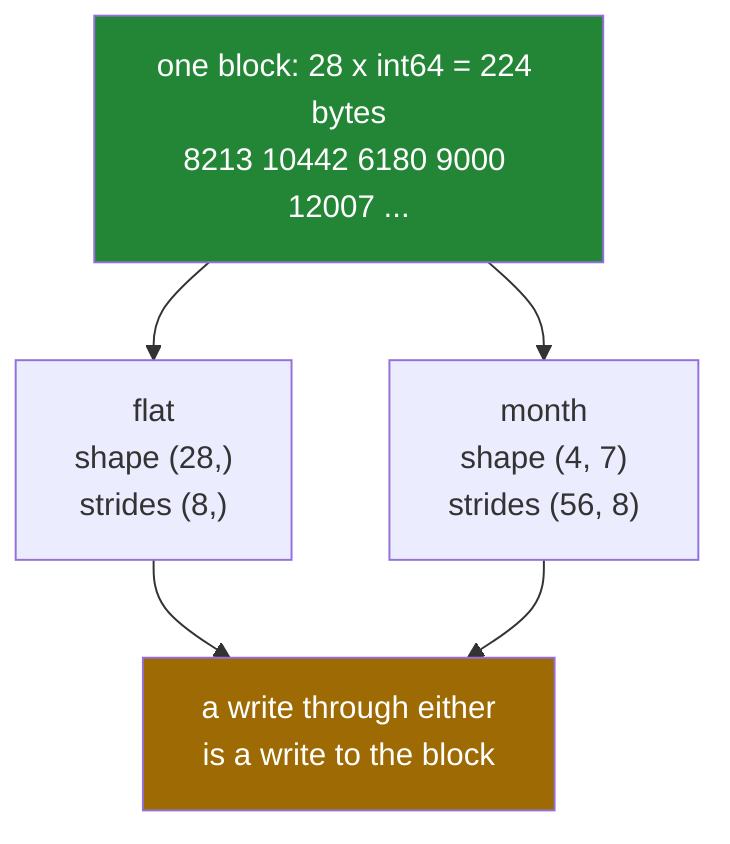

# 2.1 — `reshape` — the same block, read as a different shape

## One-line answer

`reshape` does not move a single number; it changes the shape and strides that describe the same
block of memory, so the result is a **view** and writing to it changes the original.

---

## The story

A month of step counts arrives as one long line of twenty-eight numbers in a text file, one per line.

Somebody wants to see it as weeks. They do not copy anything out. They take a pair of scissors to a
sheet of card, cut a window seven boxes wide, and lay it over the list — first seven, next seven, and
so on. The numbers have not moved. What changed is how they are being read.

The list is still a list. Anyone else looking at the file still sees twenty-eight lines. And if
somebody corrects a number through the window, the file has changed, because there was only ever one
set of numbers.

That is reshaping. The word makes it sound like the data is being rearranged, and nothing is
rearranged at all.

---

## The idea in plain language

An array is one block of memory plus a small description: a shape, a dtype, and one stride per axis
([Day 20, 1.3](../../../day-20-arrays-and-dtypes/parts/01-the-block/1.3-one-block-and-strides.md)).
`reshape` writes a new description over the same block.

`flat.reshape(4, 7)` on a twenty-eight element array gives a `(4, 7)` array whose strides are
`(56, 8)`: eight bytes to the next day, fifty-six — seven times eight — to the next week. Every value
is where it always was. Only the arithmetic used to find them changed.

Three rules follow, and the first two are the ones people ask about.

**The number of elements must not change.** A shape of `(4, 7)` holds twenty-eight values, so a
twenty-eight element array can become `(4, 7)`, `(7, 4)`, `(2, 14)`, `(28, 1)` or `(2, 2, 7)`. It
cannot become `(5, 6)`, which holds thirty, and the error says so in exactly those terms:
`cannot reshape array of size 28 into shape (5,6)`.

**The result is a view whenever it can be.** Writing to it writes through to the original, exactly like
a slice ([Day 21, 2.1](../../../day-21-indexing-and-views/parts/02-the-view-trap/2.1-a-slice-does-not-copy.md)).
"Whenever it can be" is doing real work in that sentence — sometimes a reshape must copy, and
[2.5](2.5-when-reshape-must-copy.md) is about exactly when.

**The values are read in row-major order.** The first seven values become the first row, the next seven
the second row, and so on. That is the order they sit in memory, which is why nothing has to move. The
alternative — filling the first *column* first — is column-major order, and it is available as
`order="F"` ([2.3](2.3-the-order-argument.md)).

One naming note, because both spellings appear everywhere. `arr.reshape(4, 7)` is the method and
`np.reshape(arr, (4, 7))` is the function; they do the same thing. The method takes the sizes as
separate arguments or as one tuple, so `arr.reshape(4, 7)` and `arr.reshape((4, 7))` are both fine.

---

## Why Setu needs it

- **The plan names this day's example as reshaping a flat image buffer to `(28, 28)`** — the MNIST move
  on Day 130. An image arrives as 784 numbers in a row and becomes a square with one call.
- **Day 26's Pandas** builds a frame from a flat array, and the shape you hand it decides what the
  columns are.
- **Day 117's document vectors** arrive as one long array from a file and are read back as
  `(n_documents, n_features)`.
- **Day 130's batching** reshapes a flat stream of examples into `(batch, features)` on every step,
  and the fact that it is free is why that is affordable.
- **Day 141's attention** reshapes `(batch, positions, features)` into
  `(batch, positions, heads, head_size)` and back, several times per layer.

---

## The mechanism

Twenty-eight numbers, read as four weeks:

```python
import numpy as np

flat = np.array(
    [
        8213,
        10442,
        6180,
        9000,
        12007,
        9631,
        7204,
        7788,
        9120,
        11345,
        8402,
        6733,
        14210,
        5096,
        9004,
        8765,
        7621,
        10188,
        9950,
        8317,
        11002,
        6540,
        12488,
        9873,
        7106,
        8899,
        10540,
        9218,
    ]
)

month = flat.reshape(4, 7)
print("flat shape   :", flat.shape, "strides", flat.strides)
print("month shape  :", month.shape, "strides", month.strides)
print("shares memory:", np.shares_memory(flat, month))
print("same bytes   :", flat.nbytes == month.nbytes)
print(month)

month[0, 3] = -1
print("wrote month[0, 3], flat[3] is now:", flat[3])
```

**Line by line:**

- The literal is laid out seven per line for the reader; NumPy sees one flat list of twenty-eight
  values and the line breaks mean nothing to it.
- `flat.reshape(4, 7)` — four rows of seven. **No data moved**, which the next three lines prove.
- `flat.strides` is `(8,)` and `month.strides` is `(56, 8)` — the eight is unchanged, and the
  fifty-six is seven times eight, the distance from the start of one week to the start of the next.
- `np.shares_memory(flat, month)` — `True`. This is a view, and everything from
  [Day 21, 2.2](../../../day-21-indexing-and-views/parts/02-the-view-trap/2.2-how-to-tell-base-and-shares-memory.md)
  applies.
- `flat.nbytes == month.nbytes` — the same 224 bytes described two ways. Reshaping cannot change how
  much memory an array uses, because it does not touch the memory.
- `month[0, 3] = -1` then `flat[3]` — the write goes through. **Reshaping is not a way to get your own
  copy**, and treating it as one is the mistake this part exists to prevent.

```text
flat shape   : (28,) strides (8,)
month shape  : (4, 7) strides (56, 8)
shares memory: True
same bytes   : True
[[ 8213 10442  6180  9000 12007  9631  7204]
 [ 7788  9120 11345  8402  6733 14210  5096]
 [ 9004  8765  7621 10188  9950  8317 11002]
 [ 6540 12488  9873  7106  8899 10540  9218]]
wrote month[0, 3], flat[3] is now: -1
```

The same bytes, two descriptions:



Every shape twenty-eight values can take:

```python
import numpy as np

flat = np.arange(28)

for shape in [(28,), (4, 7), (7, 4), (2, 14), (28, 1), (1, 28), (2, 2, 7)]:
    reshaped = flat.reshape(shape)
    print(
        f"{str(shape):<12} strides {str(reshaped.strides):<16} "
        f"view: {np.shares_memory(flat, reshaped)}"
    )
```

**Line by line:**

- `flat.reshape(shape)` — the shape passed as a **tuple**, which is what a loop variable has to be. The
  separate-arguments form `reshape(4, 7)` is the same call.
- `(28, 1)` and `(1, 28)` — the column and the row from
  [1.4](../01-broadcasting/1.4-keepdims-and-the-column.md), reached by reshape rather than by
  `np.newaxis`. They hold the same twenty-eight values and broadcast completely differently.
- `(2, 2, 7)` — three axes, still twenty-eight values. Any factorisation of 28 works.
- `reshaped.strides` — read the last number in each: always 8, because the last axis is always the one
  laid out contiguously. The earlier numbers are products of the later sizes.
- `np.shares_memory(...)` — `True` for every one of them, because a reshape of a contiguous array can
  always be described rather than gathered.

```text
(28,)        strides (8,)             view: True
(4, 7)       strides (56, 8)          view: True
(7, 4)       strides (32, 8)          view: True
(2, 14)      strides (112, 8)         view: True
(28, 1)      strides (8, 8)           view: True
(1, 28)      strides (224, 8)         view: True
(2, 2, 7)    strides (112, 56, 8)     view: True
```

---

## When it breaks

**The shape that does not hold the right number of values:**

```text
$ uv run python -c "
import numpy as np
np.arange(28).reshape(5, 6)
"
Traceback (most recent call last):
  File "<string>", line 3, in <module>
ValueError: cannot reshape array of size 28 into shape (5,6)
```

**What it means.** Five sixes are thirty and there are twenty-eight values. The message gives both
numbers, so the arithmetic is done for you. In real code this usually means an earlier step produced a
different number of rows than expected — a file with a trailing blank line, a filter that removed
something — so the fix is upstream, and the useful next step is printing `arr.size` at each stage.

**The write that went where it was not expected:**

```text
$ uv run python -c "
import numpy as np
raw = np.arange(12)
grid = raw.reshape(3, 4)
grid *= 10
print('grid :', grid.tolist())
print('raw  :', raw.tolist())
"
grid : [[0, 10, 20, 30], [40, 50, 60, 70], [80, 90, 100, 110]]
raw  : [0, 10, 20, 30, 40, 50, 60, 70, 80, 90, 100, 110]
```

**What it means.** `grid *= 10` writes in place through the view, so `raw` changed too. If `raw` is a
buffer that something else is still reading — a memory-mapped file, a shared array, the caller's data
— that is a real bug. `raw.reshape(3, 4).copy()` gives an independent grid, and the four situations
where paying for that is right are in
[Day 21, 2.3](../../../day-21-indexing-and-views/parts/02-the-view-trap/2.3-copy-and-when-to-pay.md).

**The reshape that was really a transpose:**

```text
$ uv run python -c "
import numpy as np
by_day = np.arange(28).reshape(7, 4)
by_week = np.arange(28).reshape(4, 7)
print('reshape(7, 4) row 0 :', by_day[0])
print('reshape(4, 7).T col :', by_week.T[0])
"
reshape(7, 4) row 0 : [0 1 2 3]
reshape(4, 7).T col : [ 0  7 14 21]
```

**What it means.** Both produce a `(7, 4)` array and they hold completely different arrangements.
`reshape(7, 4)` takes the values in the order they sit in memory, four at a time. `reshape(4, 7).T`
reads down the weeks. If your data is *twenty-eight readings in order* then the first is right; if it
is *four weeks of seven days and you want days as rows* then the second is. **Reshape never
rearranges, so when the arrangement is wrong, reshape is not the tool** —
[3.1](../03-transpose/3.1-t-the-axes-swapped.md) is.

---

## In production

**What a professional writes instead of the teaching version.** They reshape at the boundary, check
the size first, and say what the axes mean:

```python
from __future__ import annotations

import numpy as np

DAYS_PER_WEEK = 7


def as_weeks(counts: np.ndarray) -> np.ndarray:
    """Read a flat run of daily counts as (weeks, 7).

    Returns a VIEW of ``counts``: writing to the result writes to the input.
    """
    if counts.ndim != 1:
        raise ValueError(f"expected a flat run of counts, got shape {counts.shape}")
    leftover = counts.size % DAYS_PER_WEEK
    if leftover:
        raise ValueError(
            f"{counts.size} counts is {leftover} short of a whole number of weeks; "
            f"trim or pad before reshaping"
        )
    return counts.reshape(-1, DAYS_PER_WEEK)
```

**Line by line:**

- `DAYS_PER_WEEK = 7` — the 7 appears three times and means the same thing each time. A literal
  repeated is a literal that will eventually disagree with itself.
- `counts.ndim != 1` first — reshaping an already-two-dimensional array would "work" and produce
  nonsense, because `reshape` only cares about the total count.
- `counts.size % DAYS_PER_WEEK` — **the check that produces a useful message.** Without it, NumPy says
  `cannot reshape array of size 30 into shape (7)`, which does not mention weeks and does not say what
  to do.
- `f"{leftover} short of a whole number of weeks"` — the message names the domain, so the on-call
  reader knows immediately that a data file is truncated rather than that a matrix is malformed.
- `counts.reshape(-1, DAYS_PER_WEEK)` — the `-1` lets NumPy compute the number of weeks
  ([2.2](2.2-minus-one.md)), so this function works for four weeks or four hundred.
- **The docstring says VIEW in capitals**, because the caller cannot see it from the signature and
  because the alternative is somebody writing to the result and corrupting the file buffer it came
  from ([Day 21, 5.2](../../../day-21-indexing-and-views/parts/05-in-anger/5.2-view-or-copy-on-purpose.md)).

**What changes at scale.** Reshape stays free, and that is the point: streaming a gigabyte of readings
from disk and presenting them as `(n, features)` costs nothing, which is why data loaders are written
this way. Two things do change. First, the view relationship starts to matter for memory: a small
reshaped window of a large buffer pins the whole buffer
([Day 21, 5.1](../../../day-21-indexing-and-views/parts/05-in-anger/5.1-the-leak-a-view-causes.md)).
Second, at some point a reshape stops being free because the array is no longer contiguous, and a
silent copy appears in the middle of a pipeline that was tuned to have none —
[2.5](2.5-when-reshape-must-copy.md) is where that is diagnosed.

**The failure that only appears with real data.** A loader read a binary file of sensor readings and
reshaped it to `(n, 6)` — six sensors per sample. The device firmware was updated to report seven
values per sample, the file size stopped being divisible by six, and the loader raised
`cannot reshape array of size 4200007 into shape (6)`. That was lucky: the same change with an eighth
value would have divided evenly, reshaped silently, and produced a dataset where every column was a
mixture of two sensors. **A size check that passes is not evidence that the layout is right**, which
is why the loader now reads the field count from the file's own header.

**The review comment a senior engineer leaves.** *"`buf.reshape(n, 6)` returns a view of the mapped
file, and the caller writes to it two lines later — that is writing to the file's page cache. Add a
`.copy()` here or take the write out."*

**The interview question.** *"Is `reshape` expensive?"* No — it writes a new shape and a new set of
strides over the same block and returns a view, so it costs a small object allocation regardless of
whether the array holds ten values or a billion. Two things follow: writing to the result writes to
the original, and the total number of elements cannot change, so `(28,)` can become `(4, 7)` but not
`(5, 6)`. The detail that shows experience is knowing when it is *not* free: if the array is not
laid out contiguously — after a transpose, or a strided slice — the requested shape may be
undescribable with strides, and NumPy silently returns a copy instead, which in a hot loop is the
difference between free and a full pass over the data.

---

## Check yourself

```bash
uv run python -c "
import numpy as np
flat = np.arange(28)
month = flat.reshape(4, 7)
print('strides flat  :', flat.strides)
print('strides month :', month.strides)
print('shares memory :', np.shares_memory(flat, month))
month[3, 6] = 999
print('flat[27]      :', flat[27])
try:
    flat.reshape(5, 6)
except ValueError as exc:
    print('bad shape     :', exc)
"
```

The write on the fifth line reaches an array that was never mentioned on that line. Say why.

**Answer out loud, without scrolling up:**

> `flat` holds 28 values. What are the strides of `flat.reshape(4, 7)`, where did the 56 come from,
> and what happens to `flat` when you write to the reshaped array?

---

**Next:** [2.2 — `-1`, and letting NumPy do the arithmetic](2.2-minus-one.md).
