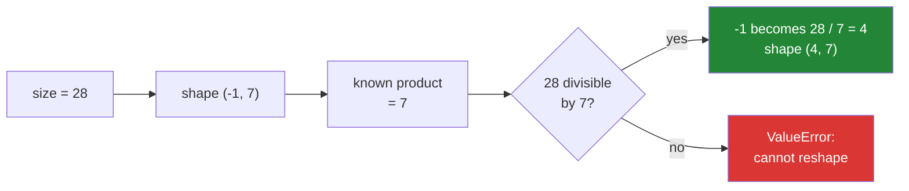

# 2.2 — `reshape(-1, 7)` — letting NumPy do the division

## One-line answer

A `-1` in a reshape means "work this one out from the total", so `reshape(-1, 7)` says *seven per row,
however many rows that makes* — and you may use it exactly once.

---

## The story

Somebody is laying out photographs on a table, seven across, because that is how many fit.

They do not count the photographs first. They put down seven, start a new row, put down seven more,
and keep going until the pile is empty. However many rows that turns out to be is however many rows
there are.

If somebody asks "how many rows will there be?", the honest answer is "however many; there are seven
in each". The number of rows is not a decision anybody made — it follows from the pile and from the
seven.

And if somebody suggests laying them out "some across and some down, we'll see how it goes", the whole
thing stops working. One of the two numbers has to be fixed for the other to be worked out.

---

## The idea in plain language

`reshape` needs a shape whose sizes multiply to the number of elements
([2.1](2.1-same-block-new-shape.md)). Often you know all but one of them, and the last one is just
division: twenty-eight values, seven per row, so four rows.

Writing `-1` in place of that size tells NumPy to do the division. `flat.reshape(-1, 7)` gives
`(4, 7)`, and the same line works for a year of readings without being edited.

Four things to know, and the first is the one that makes it worth using at all.

**It is a division, so it must come out exactly.** `flat.reshape(5, -1)` on twenty-eight values fails,
because twenty-eight divided by five is not a whole number. The error is
`cannot reshape array of size 28 into shape (5,newaxis)`, and the word `newaxis` there is NumPy's
internal name for the unknown — read it as "the `-1` you wrote".

**Only one `-1` is allowed.** Two unknowns have infinitely many answers, and NumPy says so directly:
`can only specify one unknown dimension`.

**`reshape(-1)` flattens.** With nothing else in the shape, the whole array becomes one axis of
whatever length it needs. That is the commonest use of all, and
[2.4](2.4-ravel-and-flatten.md) is about the two other spellings of it.

**It makes the code independent of the size.** This is the real argument. `counts.reshape(4, 7)` is
correct for one month and wrong for the next; `counts.reshape(-1, 7)` states the thing that is
actually fixed — seven days in a week — and derives the thing that is not.

Which of the two numbers to fix is a question about your data, not about NumPy. The fixed one is the
one that comes from the world: seven days in a week, three colour channels, 384 numbers in an
embedding. The `-1` goes on the axis that counts however many records there happen to be.

---

## Why Setu needs it

- **Day 130's batching** reshapes a stream into `(-1, features)` where the number of examples changes
  every run and the feature count never does.
- **Day 117's document vectors** are read back as `(-1, vector_size)` from a flat file, so the loader
  does not need to know how many documents there are.
- **Day 155's index** stores embeddings as one long buffer and presents them as
  `(-1, embedding_dim)`, which is the same line.
- **Day 26's Pandas** reads a flat column into `(-1, 1)` to satisfy scikit-learn's "one feature"
  convention, which is the single most common `-1` in machine-learning code.
- **Day 141's attention** reshapes `(batch, positions, features)` into
  `(batch, positions, heads, -1)`, where the last size is derived from the other three.

---

## The mechanism

The five useful forms, and the two that fail:

```python
import numpy as np

flat = np.arange(28)

print("reshape(4, -1)  :", flat.reshape(4, -1).shape)
print("reshape(-1, 7)  :", flat.reshape(-1, 7).shape)
print("reshape(-1)     :", flat.reshape(4, 7).reshape(-1).shape)
print("reshape(-1, 1)  :", flat.reshape(-1, 1).shape)
print("reshape(2, -1, 7):", flat.reshape(2, -1, 7).shape)

for bad, label in [((-1, -1), "two unknowns"), ((5, -1), "not divisible")]:
    try:
        flat.reshape(bad)
    except ValueError as exc:
        print(f"{label:<14}: {exc}")
```

**Line by line:**

- `reshape(4, -1)` — four rows, however many columns that needs. NumPy computes 28 ÷ 4 = 7.
- `reshape(-1, 7)` — seven columns, however many rows. **This is the one to prefer** when seven is a
  fact about the world and the row count is a fact about this particular file.
- `reshape(-1)` — one axis, all twenty-eight values. Flattening.
- `reshape(-1, 1)` — a column of twenty-eight, which is the shape scikit-learn asks for when a single
  feature is passed as a matrix.
- `reshape(2, -1, 7)` — the `-1` works with any number of axes. Two blocks of seven columns, so the
  middle size is 28 ÷ (2 × 7) = 2.
- `(-1, -1)` — refused, because "some rows and some columns" has no single answer.
- `(5, -1)` — refused, because 28 ÷ 5 is not whole. The message says `(5,newaxis)`, which is NumPy
  showing you your own `-1` under its internal name.

```text
reshape(4, -1)  : (4, 7)
reshape(-1, 7)  : (4, 7)
reshape(-1)     : (28,)
reshape(-1, 1)  : (28, 1)
reshape(2, -1, 7): (2, 2, 7)
two unknowns  : can only specify one unknown dimension
not divisible : cannot reshape array of size 28 into shape (5,newaxis)
```

What the `-1` is actually doing:



The reason to write it, shown by changing the data:

```python
import numpy as np


def to_weeks_fixed(counts: np.ndarray) -> np.ndarray:
    """Breaks the moment the data is not four weeks long."""
    return counts.reshape(4, 7)


def to_weeks(counts: np.ndarray) -> np.ndarray:
    """Seven days in a week is fixed; the number of weeks is whatever arrived."""
    return counts.reshape(-1, 7)


for size in (28, 56, 84):
    counts = np.arange(size)
    flexible = to_weeks(counts).shape
    try:
        fixed = str(to_weeks_fixed(counts).shape)
    except ValueError as exc:
        fixed = f"ValueError: {exc}"
    print(f"{size:>3} counts -> reshape(-1, 7) {str(flexible):<8} reshape(4, 7) {fixed}")
```

**Line by line:**

- Two functions differing by one character, so the comparison is about that character and nothing else.
- `counts.reshape(4, 7)` — correct for exactly one input size, and silently correct-looking until the
  data changes.
- `counts.reshape(-1, 7)` — correct for every input size that is a whole number of weeks.
- The loop feeds one, two and three months. The fixed version works for the first and raises for the
  other two.
- `str(...)` around the shape inside the `try` — so both branches produce a string and the printing
  stays aligned.

```text
 28 counts -> reshape(-1, 7) (4, 7)   reshape(4, 7) (4, 7)
 56 counts -> reshape(-1, 7) (8, 7)   reshape(4, 7) ValueError: cannot reshape array of size 56 into shape (4,7)
 84 counts -> reshape(-1, 7) (12, 7)  reshape(4, 7) ValueError: cannot reshape array of size 84 into shape (4,7)
```

---

## When it breaks

**Two unknowns:**

```text
$ uv run python -c "
import numpy as np
np.arange(28).reshape(-1, -1)
"
Traceback (most recent call last):
  File "<string>", line 3, in <module>
ValueError: can only specify one unknown dimension
```

**What it means.** Twenty-eight values could be `(1, 28)`, `(2, 14)`, `(4, 7)`, `(7, 4)`, `(14, 2)` or
`(28, 1)`, and nothing in the request says which. NumPy will not choose. If you genuinely do not know
either size, the information is somewhere else — a header, a config, a second array — and that is
where the shape should come from.

**A total that does not divide:**

```text
$ uv run python -c "
import numpy as np
np.arange(30).reshape(-1, 7)
"
Traceback (most recent call last):
  File "<string>", line 3, in <module>
ValueError: cannot reshape array of size 30 into shape (7)
```

**What it means.** Thirty readings will not lay out seven per row. Note that the message prints only
the size you gave — the `-1` is not shown when it comes first, and it appears as `newaxis` when it
comes second, as in the mechanism's `(5,newaxis)`. Both are the same complaint: the division did not
come out. In practice this is nearly always a
data problem rather than a code problem: a partial final week, a trailing blank line, a header row
that was not skipped. **The reshape is the messenger.** Fix the count upstream rather than padding it,
because a padded week is a week of made-up data.

**The `-1` that hid a bug:**

```text
$ uv run python -c "
import numpy as np
readings = np.arange(24)
print('as 6 sensors :', readings.reshape(-1, 6).shape)
print('as 8 sensors :', readings.reshape(-1, 8).shape)
print('as 4 sensors :', readings.reshape(-1, 4).shape)
"
as 6 sensors : (4, 6)
as 8 sensors : (3, 8)
as 4 sensors : (6, 4)
```

**What it means.** All three succeed, because twenty-four divides by all three, and only one of them
matches what the device actually sent. `-1` removes the arithmetic and it does not check the layout:
it will happily arrange the data any way that fits. The defence is to know the fixed size from
somewhere authoritative — the file's header, the API's schema, a constant with a comment — rather than
from the number that made the reshape stop complaining.

**The empty array, which behaves better than you would expect:**

```text
$ uv run python -c "
import numpy as np
empty = np.array([], dtype=np.int64)
print('size      :', empty.size)
print('7 cols    :', empty.reshape(-1, 7).shape)
try:
    empty.reshape(-1, 0)
except ValueError as exc:
    print('zero cols :', exc)
"
size      : 0
7 cols    : (0, 7)
zero cols : cannot reshape array of size 0 into shape (0)
```

**What it means.** An empty array reshapes to `(0, 7)` — no rows, seven columns — which is exactly
right and keeps the shape usable downstream
([Day 21, 3.5](../../../day-21-indexing-and-views/parts/03-boolean-masks/3.5-the-mask-that-matched-nothing.md)).
The failure is only when the *known* size is itself zero, because then the division has no answer: any
number of rows times zero columns is zero. Empty inputs are common in production and this is one of
the few places NumPy handles them gracefully by default.

---

## In production

**What a professional writes instead of the teaching version.** The fixed size comes from a named
constant or from the data's own metadata, never from trial and error:

```python
from __future__ import annotations

import numpy as np


def as_records(buffer: np.ndarray, *, fields: int) -> np.ndarray:
    """Read a flat buffer as (records, fields).

    ``fields`` must come from the format's own definition - a file header, a schema, a
    documented constant - and never from whichever number happened to divide evenly.
    """
    if fields < 1:
        raise ValueError(f"fields must be positive, got {fields}")
    leftover = buffer.size % fields
    if leftover:
        raise ValueError(
            f"{buffer.size} values is not a whole number of {fields}-field records "
            f"({leftover} left over): the buffer is truncated or the field count is wrong"
        )
    return buffer.reshape(-1, fields)
```

**Line by line:**

- `*, fields: int` — keyword-only, so a call site reads `as_records(buf, fields=6)` and cannot silently
  swap the arguments ([Day 10, 1.5](../../../day-10-functions/parts/01-the-signature/1.5-keyword-only-and-positional-only.md)).
- The docstring's second sentence is the whole lesson of the third failure above, aimed at the person
  who will one day be tempted to change 6 to 8 because the error went away.
- `buffer.size % fields` checked before reshaping — so the message can say **how many are left over**,
  which distinguishes a truncated file (a small leftover) from a wrong field count (usually a large
  one).
- The message names both possible causes. An error that offers the two candidate explanations saves
  more time than one that only reports the symptom
  ([Day 18, 3.3](../../../day-18-exceptions/parts/03-your-own/3.3-the-message-is-an-interface.md)).
- `buffer.reshape(-1, fields)` — the `-1` is on the record count, which is the thing that varies.
- No check that `fields` is *correct* — that is not knowable here. The function's job is to refuse the
  impossible and to document where the truth lives.

**What changes at scale.** The `-1` stops being a convenience and becomes the only maintainable option:
a pipeline where every stage hard-codes a row count has to be edited whenever the input grows, and one
of those edits will be missed. The other change is that the divisibility check moves earlier. On a
streaming loader, discovering at the end of a 10 GB file that the size does not divide is expensive,
so the field count is validated against the header before the read starts. And in a training loop the
last batch is famously not full, which is why data loaders take a `drop_last` flag rather than trying
to reshape a remainder into a rectangle.

**The failure that only appears with real data.** A telemetry loader used `reshape(-1, 8)` because the
device sent eight fields. A firmware update added a ninth. The file sizes were large and happened to be
divisible by eight, so the loader kept working and every "record" it produced was a sliding mixture of
two real records. The dashboards looked slightly wrong for three weeks before anyone could say why.
The fix was to read the field count from the file header, which the format had always included and the
loader had never used.

**The review comment a senior engineer leaves.** *"`reshape(-1, 6)` — where does the 6 come from? If it
is the number of sensors, name it and read it from the header; if it is the number that made the
exception go away, this will silently misalign the day the device changes."*

**The interview question.** *"What does `-1` mean in `reshape`?"* It is the size to be computed from
the total: NumPy divides the number of elements by the product of the sizes you did give, so
`reshape(-1, 7)` is "seven per row, work out the rows". Only one `-1` is allowed, because two unknowns
have no unique answer, and the division has to come out exactly or it raises. The reason to prefer it
is that it states which size is a fact about the data — seven days, three channels, 384 dimensions —
and derives the one that is a fact about this particular input. The caveat worth adding is that `-1`
removes the arithmetic and not the thinking: several different field counts often divide evenly, so
the fixed size still has to come from the format rather than from whatever made the error stop.

---

## Check yourself

```bash
uv run python -c "
import numpy as np
counts = np.arange(56)
print('(-1, 7)  :', counts.reshape(-1, 7).shape)
print('(7, -1)  :', counts.reshape(7, -1).shape)
print('(-1,)    :', counts.reshape(-1).shape)
print('(-1, 1)  :', counts.reshape(-1, 1).shape)
for bad in [(-1, -1), (5, -1)]:
    try:
        counts.reshape(bad)
    except ValueError as exc:
        print(f'{str(bad):<9}:', exc)
"
```

The first two both give a valid shape and they are not the same array. Say which one means "weeks of
seven days".

**Answer out loud, without scrolling up:**

> You have a flat buffer of readings, six fields per record. Write the reshape, say which number is the
> `-1` and why, and say what happens when the buffer has one field too many.

---

**Next:** [2.3 — the `order` argument](2.3-the-order-argument.md).
