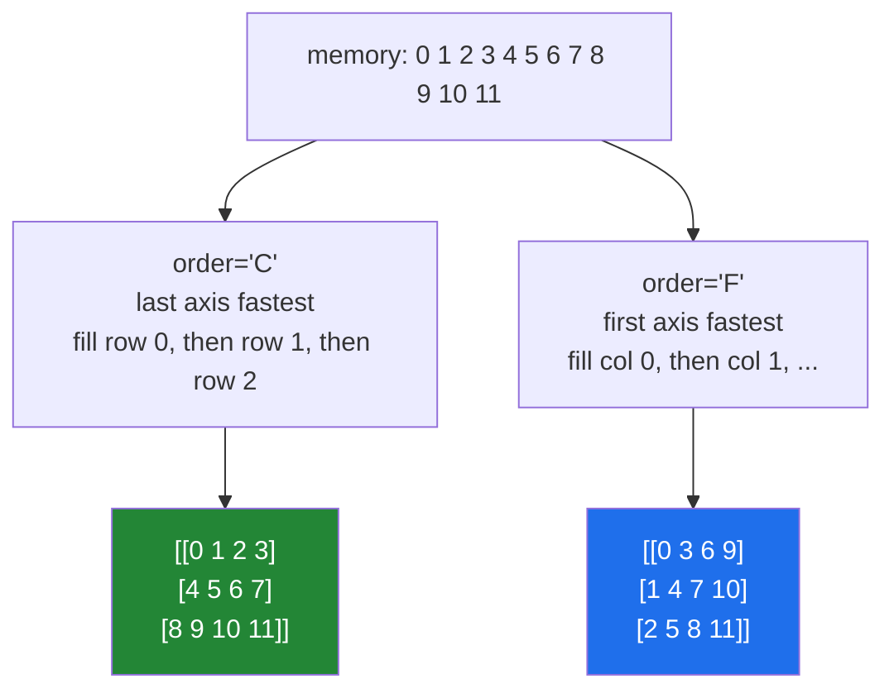

# 2.3 — `order="C"` and `order="F"` — which way the values are filled in

## One-line answer

`order="C"` fills the result row by row and `order="F"` fills it column by column, so the same twelve
numbers become two completely different grids — and using the wrong one is how an image comes out
scrambled.

---

## The story

Somebody is copying a list of twelve names into a grid of three rows and four columns, to make a
seating plan.

There are two obvious ways to do it. Go along the top row — first four names — then the second row,
then the third. Or go down the first column — first three names — then the second column, and so on.

Both use all twelve names. Both fill the grid completely. And the two seating plans are entirely
different: in the first, names one and two are sitting next to each other; in the second, they are one
behind the other.

Neither way is wrong. What is wrong is copying the list out one way and reading it back the other,
which is how somebody ends up sitting next to a person they were supposed to be behind.

---

## The idea in plain language

A grid is two-dimensional and memory is one long line, so turning one into the other requires a
decision about which direction comes first. There are two conventions and they are named after the
programming languages that popularised them.

**C order**, also called **row-major**: the last axis varies fastest. Reading a `(3, 4)` array in
memory order gives row 0's four values, then row 1's, then row 2's. This is NumPy's default, and it is
why a `(4, 7)` array has strides `(56, 8)` — moving along a row is one step of eight bytes, moving
down a column jumps a whole row
([2.1](2.1-same-block-new-shape.md)).

**Fortran order**, also called **column-major**: the first axis varies fastest. The same memory read as
`(3, 4)` in F order gives column 0's three values first. MATLAB, R and Fortran all work this way, and
so does most numerical linear algebra underneath.

`reshape` takes an `order=` argument saying how to read the values out of the flat block. `order="C"`
is the default and needs no thought. `order="F"` is a view too — it just describes the same memory with
different strides, `(8, 24)` instead of `(32, 8)` — and it is genuinely useful in two situations:
reading data produced by a column-major system, and handing data to a library that wants columns
contiguous.

There is a third value, `order="A"`, which means "F if the input is F-contiguous, otherwise C". It
exists for library code that wants to preserve whatever the caller had. In application code, choosing
based on the input's layout is usually a way of writing something whose behaviour you cannot predict.

Two ideas that will keep coming back:

**Contiguous** means the values are laid out in memory with no gaps, in the order the shape implies. An
array can be C-contiguous, F-contiguous, both — a one-dimensional array or one with a single row is
both — or neither, which is what a strided slice usually is
([Day 21, 1.5](../../../day-21-indexing-and-views/parts/01-one-element/1.5-the-step-and-the-reverse.md)).
`arr.flags` reports it.

**The order argument is about reading, not about storing.** `reshape(3, 4, order="F")` does not
rearrange memory; it produces a view whose strides make the first axis the fast one. That is why it
costs nothing, and it is also why the values appear in unexpected places.

---

## Why Setu needs it

- **Day 130's images** arrive as flat buffers, and whether a file stores them row by row or column by
  column decides which `order` reads them back correctly. The wrong one gives a transposed picture,
  not a broken one, so it is easy to miss.
- **Day 42's database exports** and Day 26's CSV readers are row-major; MATLAB `.mat` files and R data
  are column-major, and any pipeline that crosses that boundary needs one deliberate `order=`.
- **Day 44's scikit-learn** copies to F order internally for some solvers, which is where an unexpected
  copy of your feature matrix comes from ([3.3](../03-transpose/3.3-contiguity-and-the-speed-you-lose.md)).
- **Day 137's debugging** of a model that trains to nothing quite often ends at a scrambled input
  buffer, which is this mistake.

---

## The mechanism

The same twelve values, two grids:

```python
import numpy as np

flat = np.arange(12)

c_order = flat.reshape(3, 4, order="C")
f_order = flat.reshape(3, 4, order="F")

print("C order (row by row):")
print(c_order)
print("F order (column by column):")
print(f_order)
print("C strides :", c_order.strides, "C-contiguous:", c_order.flags["C_CONTIGUOUS"])
print("F strides :", f_order.strides, "F-contiguous:", f_order.flags["F_CONTIGUOUS"])
print("both views:", np.shares_memory(flat, c_order), np.shares_memory(flat, f_order))
print("same values, different places:", sorted(c_order.ravel()) == sorted(f_order.ravel()))
```

**Line by line:**

- `flat.reshape(3, 4, order="C")` — reads four values into row 0, four into row 1, four into row 2. The
  first row is `0 1 2 3`.
- `flat.reshape(3, 4, order="F")` — reads three values down column 0, three down column 1, and so on.
  The first row is `0 3 6 9`, because those are the values that landed at the top of each column.
- `c_order.strides` is `(32, 8)` — four values of eight bytes per row, so a row step is 32 bytes.
- `f_order.strides` is `(8, 24)` — **the small number is now first.** Moving down a row is eight bytes,
  moving across a column is 24. That inversion is the whole difference.
- `flags["C_CONTIGUOUS"]` and `flags["F_CONTIGUOUS"]` — each array is contiguous in its own sense and
  not in the other's.
- `np.shares_memory(...)` — `True` for both. **Neither reshape moved anything**; both are views of the
  same twelve values.
- `sorted(...) == sorted(...)` — the same multiset of values in both, which is the point: nothing was
  gained or lost, only rearranged.

```text
C order (row by row):
[[ 0  1  2  3]
 [ 4  5  6  7]
 [ 8  9 10 11]]
F order (column by column):
[[ 0  3  6  9]
 [ 1  4  7 10]
 [ 2  5  8 11]]
C strides : (32, 8) C-contiguous: True
F strides : (8, 24) F-contiguous: True
both views: True True
same values, different places: True
```

The two fill orders:



The round trip, and the one that scrambles:

```python
import numpy as np

image = np.arange(9).reshape(3, 3)
buffer_c = image.ravel(order="C")
buffer_f = image.ravel(order="F")

print("image      :")
print(image)
print("C buffer   :", buffer_c)
print("F buffer   :", buffer_f)
print("C round trip:")
print(buffer_c.reshape(3, 3))
print("wrong order :")
print(buffer_c.reshape(3, 3, order="F"))
```

**Line by line:**

- `image.ravel(order="C")` — flatten row by row, giving `0 1 2 3 4 5 6 7 8`. This is what writing the
  array to a file in the obvious way produces.
- `image.ravel(order="F")` — flatten column by column, giving `0 3 6 1 4 7 2 5 8`. **Same picture, a
  different file.**
- `buffer_c.reshape(3, 3)` — read a C buffer in C order. The original comes back exactly.
- `buffer_c.reshape(3, 3, order="F")` — read a C buffer in F order. The result is the **transpose** of
  the original: not corrupted, not obviously wrong, just turned on its side.
- `ravel` here is being used as the flattening tool; [2.4](2.4-ravel-and-flatten.md) is about it
  properly.

```text
image      :
[[0 1 2]
 [3 4 5]
 [6 7 8]]
C buffer   : [0 1 2 3 4 5 6 7 8]
F buffer   : [0 3 6 1 4 7 2 5 8]
C round trip:
[[0 1 2]
 [3 4 5]
 [6 7 8]]
wrong order :
[[0 3 6]
 [1 4 7]
 [2 5 8]]
```

The last grid is the first one transposed. That is what a mismatched `order` produces on a square
array — and on a non-square one it raises instead, which is luckier.

---

## When it breaks

**The image that came out sideways:**

```text
$ uv run python -c "
import numpy as np
picture = np.zeros((4, 6), dtype=np.uint8)
picture[0, :] = 255
buffer = picture.ravel()
back_c = buffer.reshape(4, 6)
back_f = buffer.reshape(4, 6, order='F')
print('white row in C :', np.count_nonzero(back_c[0]) == 6)
print('white row in F :', np.count_nonzero(back_f[0]) == 6)
print('F first row    :', back_f[0])
"
white row in C : True
white row in F : False
F first row    : [255 255   0   0   0   0]
```

**What it means.** A picture with a white top row comes back with a white *partial* row and stripes
everywhere else. On a non-square image the shapes still fit, so nothing raises, and the result is
visibly scrambled rather than transposed. Anyone looking at the image sees it immediately; a pipeline
that feeds it straight into a model does not, and the model trains on noise. **Whenever a flat buffer
crosses a file boundary, the order is part of the format** and belongs in the format's documentation.

**The order that silently did nothing:**

```text
$ uv run python -c "
import numpy as np
flat = np.arange(12)
row = flat.reshape(1, 12)
print('C flags :', row.flags['C_CONTIGUOUS'], 'F flags :', row.flags['F_CONTIGUOUS'])
print('same    :', np.array_equal(flat.reshape(1, 12, order='C'), flat.reshape(1, 12, order='F')))
"
C flags : True F flags : True
same    : True
```

**What it means.** With a single row there is only one way to lay the values out, so both orders give
the same array and both contiguity flags are `True`. Testing an `order=` decision on a one-row fixture
proves nothing at all — the same trap as testing broadcasting on a square array
([../01-broadcasting/1.4-keepdims-and-the-column.md](../01-broadcasting/1.4-keepdims-and-the-column.md)).
Use a fixture with at least two rows and two different-sized axes.

**The `order="A"` that depended on its input:**

```text
$ uv run python -c "
import numpy as np
c_array = np.arange(12).reshape(3, 4)
f_array = np.asfortranarray(c_array)
print('from C input :', c_array.ravel(order='A')[:4])
print('from F input :', f_array.ravel(order='A')[:4])
print('same object? :', np.array_equal(c_array, f_array))
"
from C input : [0 1 2 3]
from F input : [0 4 8 1]
same object? : True
```

**What it means.** The two arrays hold identical values — `array_equal` says so — and `order="A"`
flattens them differently, because it follows whichever layout each one has. A function using
`order="A"` therefore behaves differently depending on where its input came from, which is a property
almost nobody wants in application code. Use `"C"` or `"F"` and mean it.

---

## In production

**What a professional writes instead of the teaching version.** The order is a property of the format,
named and documented at the boundary:

```python
from __future__ import annotations

from typing import Literal

import numpy as np

Order = Literal["C", "F"]


def decode_frame(buffer: np.ndarray, height: int, width: int, *, order: Order = "C") -> np.ndarray:
    """Read a flat pixel buffer as a (height, width) frame.

    ``order`` is part of the FILE FORMAT, not a preference: "C" for buffers written row
    by row (PNG, JPEG, most cameras), "F" for those written column by column (MATLAB
    exports, some scientific instruments). Getting it wrong transposes or scrambles the
    image without raising.
    """
    expected = height * width
    if buffer.size != expected:
        raise ValueError(
            f"buffer holds {buffer.size} values, expected {expected} for {height}x{width}"
        )
    return buffer.reshape(height, width, order=order)
```

**Line by line:**

- `Order = Literal["C", "F"]` — a type that permits exactly two strings
  ([Day 19, 1.2](../../../day-19-typing-dataclasses-and-concurrency/parts/01-type-hints/1.2-the-vocabulary.md)),
  so a typo like `order="c"` — which NumPy actually accepts, lowercase — or `order="A"` is caught by
  the checker rather than at three in the morning.
- `*, order: Order = "C"` — keyword-only with the common case as the default, so the unusual choice is
  visible at the call site.
- **The docstring says the order is part of the file format.** That sentence is the deliverable: the
  next person's instinct will be to flip it until the picture looks right, and this tells them where
  the answer actually lives.
- `buffer.size != expected` — checked before the reshape, so the message can name the height and width
  rather than only the total ([2.2](2.2-minus-one.md)).
- `buffer.reshape(height, width, order=order)` — one line, and it returns a **view**
  ([2.1](2.1-same-block-new-shape.md)), so decoding a frame from a memory-mapped file costs nothing.

**What changes at scale.** Order stops being about correctness and starts being about speed as well.
Numerical libraries — the ones underneath `@`, `np.linalg` and scikit-learn — are written in Fortran
or expect Fortran layout, so passing a C-contiguous matrix to some solvers causes a full copy inside
the library, which on a 4 GB matrix is a 4 GB surprise
([3.3](../03-transpose/3.3-contiguity-and-the-speed-you-lose.md)). When a pipeline feeds one such
solver repeatedly, storing the matrix F-contiguous once with `np.asfortranarray` removes a copy per
call. The rule stays the same either way: **choose the order deliberately, once, at the boundary, and
never let it be decided by whatever the last operation happened to produce.**

**The failure that only appears with real data.** A team exported simulation results from a
column-major tool as a raw binary file and read them back with the default `order="C"`. The grids were
square during development, so the data came back transposed rather than scrambled, and the physical
quantity being plotted was roughly symmetric — so nothing looked wrong for two months. It surfaced
when a non-square grid raised `cannot reshape array of size 4092 into shape (66,62)`, and every result
from those two months had to be regenerated.

**The review comment a senior engineer leaves.** *"`buf.reshape(h, w)` assumes the file is row-major.
The instrument's manual says it writes column-major. Add `order='F'` and put the reference in a
comment, because this will look plausible either way on the square test grids."*

**The interview question.** *"What is the difference between C order and Fortran order?"* Which axis
varies fastest in memory. In C order the last axis is contiguous, so a `(3, 4)` array stores row 0's
four values first; in Fortran order the first axis is contiguous, so it stores column 0's three values
first. NumPy defaults to C, and `reshape(..., order="F")` is still a view — it just describes the same
memory with the strides inverted. The reason to care is twofold: the order is part of any binary
format, so reading a column-major file with the default transposes or scrambles it without raising;
and several numerical libraries want Fortran layout, so a C-contiguous matrix passed to them is copied
internally, which is where an unexplained memory spike inside a solver comes from.

---

## Check yourself

```bash
uv run python -c "
import numpy as np
flat = np.arange(6)
print('C:'); print(flat.reshape(2, 3, order='C'))
print('F:'); print(flat.reshape(2, 3, order='F'))
print('C strides:', flat.reshape(2, 3, order='C').strides)
print('F strides:', flat.reshape(2, 3, order='F').strides)
print('both views:', np.shares_memory(flat, flat.reshape(2, 3, order='F')))
"
```

Six numbers, two grids, no copies. Point at where the `3` went in each one.

**Answer out loud, without scrolling up:**

> A flat buffer of 12 values is reshaped to `(3, 4)`. Which value ends up at position `[0, 1]` in C
> order, which in F order, and how much memory does either reshape allocate?

---

**Next:** [2.4 — `ravel` and `flatten`](2.4-ravel-and-flatten.md).
