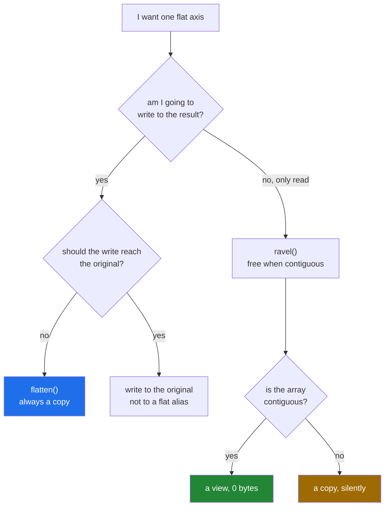

# 2.4 — `ravel` and `flatten` — the view and the copy that look identical

## One-line answer

Both turn any array into one long row of the same values; `ravel` returns a **view** when it can and
`flatten` **always copies**, so the two differ in nothing you can see and everything you cannot.

---

## The story

Somebody needs the month's twenty-eight numbers as a single list, to read down the phone.

They have two ways to get one. They can put a ruler under the grid and read straight across, line
after line, without touching the paper — the grid stays a grid and they are simply reading it in a
particular order. Or they can copy the numbers out onto a fresh strip, one after another, and read
from the strip.

Reading with the ruler is quicker and there is now one piece of paper in the room. Copying takes a
minute and there are two.

The difference only shows up when somebody corrects a number. Correct it while reading with the ruler
and you have corrected the grid. Correct it on the strip and the grid still says the old value, and
one of the two is now wrong.

---

## The idea in plain language

Flattening means turning an array of any shape into one axis holding the same values in memory order.
NumPy gives you three spellings, and they are not interchangeable.

**`arr.ravel()`** — returns a **view** if the values can be described as one contiguous run, and a copy
if they cannot. On an ordinary array it is free; on a transposed or strided one it copies, and it does
so silently ([2.5](2.5-when-reshape-must-copy.md)).

**`arr.flatten()`** — **always** returns a copy. It never shares memory with the original, so writing
to it is always safe and always costs a full pass over the data.

**`arr.reshape(-1)`** — the same rule as `ravel`: a view when possible, a copy when not
([2.2](2.2-minus-one.md)).

So the choice is between *cheap but connected* and *expensive but independent*, and the honest way to
decide is to ask what happens next:

- Only reading — a reduction, a print, a `.tolist()` — use `ravel`. There is nothing to protect.
- About to write to the result, or about to keep it beyond the life of the original — use `flatten`,
  or `ravel().copy()` if you want the copy to be visible in the source.

Two details that catch people.

**`ravel` returning a view is not guaranteed**, so code that relies on the write going through is
relying on the input's layout. If the caller passes a transpose, the same line silently stops writing
through. When you want the write to reach the original, say so with `arr[...] = ...` on the original
rather than through a flattened alias.

**Both take `order=`.** `ravel(order="F")` reads column by column
([2.3](2.3-the-order-argument.md)), and for a C-contiguous array that requires a copy, because the
values in that order are not contiguous.

The names are worth a sentence, because they are not obviously distinguishable. *Ravel* means to
unravel — to pull a knitted thing into one thread — and NumPy uses it for the cheap version. *Flatten*
is the plain-English one, and it is the one that always allocates. There is no logic connecting the
words to the behaviour; it has to be learned.

---

## Why Setu needs it

- **Day 130's loss functions** flatten predictions and targets before comparing them, and whether that
  flatten is a view decides whether a later in-place operation reaches the model's output buffer.
- **Day 26's Pandas** calls `.to_numpy().ravel()` all over the place, and a returned view of a frame's
  data is how a "copy" of a column ends up connected to the frame.
- **Day 117's feature vectors** are flattened before being written to disk, where a copy is harmless
  and a view is a bug waiting for the parent to be freed
  ([Day 21, 5.1](../../../day-21-indexing-and-views/parts/05-in-anger/5.1-the-leak-a-view-causes.md)).
- **Day 155's index building** flattens a batch of embeddings into one buffer, and at that size the
  difference between a view and a copy is gigabytes.

---

## The mechanism

The two calls, and the one difference:

```python
import numpy as np

month = np.arange(28).reshape(4, 7)

ravelled = month.ravel()
flattened = month.flatten()

print("ravel   shares memory :", np.shares_memory(month, ravelled))
print("flatten shares memory :", np.shares_memory(month, flattened))
print("ravel   base is None  :", ravelled.base is None)
print("flatten base is None  :", flattened.base is None)
print("same values           :", np.array_equal(ravelled, flattened))

ravelled[0] = 999
print("after ravel[0] = 999  , month[0, 0] :", month[0, 0])
flattened[1] = 888
print("after flatten[1] = 888, month[0, 1] :", month[0, 1])
```

**Line by line:**

- `month.ravel()` — one axis of twenty-eight values, and **no allocation**: the values were already
  contiguous in that order, so a shape of `(28,)` and a stride of `(8,)` describes them.
- `month.flatten()` — the same twenty-eight values in a new block of 224 bytes.
- `np.shares_memory(...)` — `True` and `False`, which is the entire difference and the only way to see
  it ([Day 21, 2.2](../../../day-21-indexing-and-views/parts/02-the-view-trap/2.2-how-to-tell-base-and-shares-memory.md)).
- `np.array_equal(ravelled, flattened)` — `True`. **The values are identical**, which is why this
  cannot be caught by looking at the output.
- `ravelled[0] = 999` — writes through, so `month[0, 0]` changes.
- `flattened[1] = 888` — writes into the copy, so `month[0, 1]` is still 1. Two adjacent lines, two
  opposite behaviours, no warning from either.

```text
ravel   shares memory : True
flatten shares memory : False
ravel   base is None  : False
flatten base is None  : True
same values           : True
after ravel[0] = 999  , month[0, 0] : 999
after flatten[1] = 888, month[0, 1] : 1
```

The choice, drawn:



The case where `ravel` stops being free:

```python
import numpy as np

month = np.arange(28).reshape(4, 7)
transposed = month.T
strided = month[:, ::2]

for label, arr in [("month", month), ("month.T", transposed), ("month[:, ::2]", strided)]:
    flat = arr.ravel()
    print(
        f"{label:<14} C-contiguous: {str(arr.flags['C_CONTIGUOUS']):<6} "
        f"ravel is a view: {np.shares_memory(arr, flat)}"
    )
```

**Line by line:**

- `month.T` — the transpose, which is a view with the strides swapped
  ([3.1](../03-transpose/3.1-t-the-axes-swapped.md)). Reading it row by row means jumping around the
  original block, so there is no contiguous run to describe.
- `month[:, ::2]` — every other column, a strided view
  ([Day 21, 1.5](../../../day-21-indexing-and-views/parts/01-one-element/1.5-the-step-and-the-reverse.md)).
  Same problem: the values it names have gaps.
- `arr.flags['C_CONTIGUOUS']` — the flag that predicts the answer. **When it is `False`, `ravel` will
  copy**, and there is no message.
- `np.shares_memory(arr, flat)` — the measurement, which agrees with the flag in all three cases.
- The point of the table is that the *call is identical* in all three rows. Whether it allocates
  depends entirely on what was passed in, which is why a function that ravels its input has a cost the
  caller controls.

```text
month          C-contiguous: True   ravel is a view: True
month.T        C-contiguous: False  ravel is a view: False
month[:, ::2]  C-contiguous: False  ravel is a view: False
```

---

## When it breaks

**The write that reached the original — or did not, depending on the caller:**

```text
$ uv run python -c "
import numpy as np


def zero_the_first(values):
    flat = values.ravel()
    flat[0] = 0
    return values


ordinary = np.arange(12).reshape(3, 4)
transposed = np.arange(12).reshape(4, 3).T
print('ordinary  :', zero_the_first(ordinary)[0, 0])
print('transposed:', zero_the_first(transposed)[0, 0])
"
ordinary  : 0
transposed: 0
```

**What it means.** Both printed `0`, which looks like the function works — and it does not, for the
same reason both are `0`: the transposed case zeroed a *copy* and then returned the untouched
original, whose `[0, 0]` was already 0. Change the data so the first element is not zero and the two
disagree. **A function that writes through `ravel()` works or does not depending on its caller's
layout**, which is the least testable kind of bug. Write to `values[0, 0]` directly.

**The copy nobody asked for, on a big array:**

```text
$ uv run python -c "
import time
import numpy as np
rng = np.random.default_rng(22)
table = rng.random((5_000, 4_000))
table.sum()
start = time.perf_counter()
a = table.ravel()
plain = time.perf_counter() - start
start = time.perf_counter()
b = table.T.ravel()
after_t = time.perf_counter() - start
print(f'ravel of C array  : {plain * 1e6:9.1f} us, view: {np.shares_memory(table, a)}')
print(f'ravel of transpose: {after_t * 1000:9.1f} ms, view: {np.shares_memory(table, b)}')
print(f'the copy is {table.nbytes:,} bytes')
"
ravel of C array  :      18.9 us, view: True
ravel of transpose:     210.6 ms, view: False
the copy is 160,000,000 bytes
```

**What it means.** The same method call, nineteen microseconds against two hundred milliseconds and a
160 MB allocation, decided entirely by whether a `.T` appeared earlier in the pipeline. Nothing warns
you. In a loop that ravels once per iteration, adding a transpose upstream turns a free operation into
the dominant cost.

**`flatten` in a loop:**

```text
$ uv run python -c "
import time
import numpy as np
rng = np.random.default_rng(22)
table = rng.random((2_000, 500))
table.sum()
start = time.perf_counter()
total = 0.0
for _ in range(50):
    total += table.flatten().sum()
flat_time = time.perf_counter() - start
start = time.perf_counter()
total2 = 0.0
for _ in range(50):
    total2 += table.ravel().sum()
ravel_time = time.perf_counter() - start
print(f'flatten : {flat_time * 1000:7.1f} ms')
print(f'ravel   : {ravel_time * 1000:7.1f} ms')
print(f'ratio   : {flat_time / ravel_time:7.1f}x, same answer: {np.isclose(total, total2)}')
"
flatten :   148.0 ms
ravel   :    54.8 ms
ratio   :     2.7x, same answer: True
```

**What it means.** The loop only sums, so every copy `flatten` made was thrown away unused. Nearly
three times the time for nothing. This is the same over-correction as copying a slice you only intend to read
([Day 21, 2.3](../../../day-21-indexing-and-views/parts/02-the-view-trap/2.3-copy-and-when-to-pay.md)),
and it is common because `flatten` is the more familiar English word.

---

## In production

**What a professional writes instead of the teaching version.** They pick by intent and say so, and
where the intent is "give this away", they make the copy unconditional:

```python
from __future__ import annotations

import numpy as np


def as_payload(values: np.ndarray) -> np.ndarray:
    """Flatten for sending elsewhere: always a copy, never tied to the source.

    The result is written to a queue and outlives ``values``, so a view would pin the
    whole source array (Day 21, 5.1) and would change under the reader if the source
    were modified.
    """
    return values.flatten()


def checksum(values: np.ndarray) -> int:
    """Read-only reduction: ravel, because nothing is written and nothing is kept."""
    return int(values.ravel().sum())


def guaranteed_contiguous(values: np.ndarray) -> np.ndarray:
    """One flat axis, copying only if the layout forces it.

    ``np.ascontiguousarray`` is free when the input is already C-contiguous and copies
    when it is not - the same rule ravel follows, said out loud.
    """
    return np.ascontiguousarray(values).reshape(-1)
```

**Line by line:**

- `as_payload` uses `flatten` **because of lifetime, not because of writing**. The result goes on a
  queue and outlives its source, so the copy buys both independence and the release of the source
  array.
- The docstring names the two reasons — pinning and later modification — because either alone would
  justify it and a future reader needs to know both still apply.
- `checksum` uses `ravel` because the array is consumed immediately. Using `flatten` here would double
  the work for no benefit, which is the third failure above.
- `int(...)` on the result — a plain Python integer at the boundary
  ([Day 19, 3.4](../../../day-19-typing-dataclasses-and-concurrency/parts/03-pydantic/3.4-model-dump-and-the-boundary.md)).
- `guaranteed_contiguous` uses `np.ascontiguousarray` — **free when the input already is**, a copy when
  it is not, and it says which it is doing by its name. It is the right call when something downstream
  needs contiguous bytes, such as a `tobytes()`, a file write, or a call into another language.
- Three functions, three names, no `copy=` flags. The caller picks by what they are about to do
  ([Day 21, 5.2](../../../day-21-indexing-and-views/parts/05-in-anger/5.2-view-or-copy-on-purpose.md)).

**What changes at scale.** The difference stops being stylistic. `flatten` on a 4 GB array is a 4 GB
allocation and a full memory pass; in a training loop called once per batch, that is the difference
between a loop that keeps the processor busy and one that waits on memory. Two habits follow. Flatten
once, outside the loop, if the flat form is used repeatedly. And be suspicious of any `ravel` whose
input might not be contiguous — because at scale a silent copy is not a slowdown, it is an
out-of-memory kill. The diagnostic is one line: `assert arr.flags["C_CONTIGUOUS"]` before the ravel, or
`np.shares_memory` after it.

**The failure that only appears with real data.** A serialisation function returned `array.ravel()` and
the result was cached. For most inputs the array was contiguous, so the cache held views of much larger
arrays and memory climbed all day. For the inputs that were transposed, `ravel` copied, and those
entries behaved perfectly — so the memory growth correlated with input *shape* in a way nobody could
explain for weeks. One `flatten` fixed it, and the general rule is that anything crossing into a cache
or a queue is copied, deliberately.

**The review comment a senior engineer leaves.** *"`ravel()` here returns a view when the input is
contiguous and a copy when it is not, and this result goes into a cache. That is two different
lifetime behaviours from one line. Use `flatten()` — you want the copy — and the ambiguity goes
away."*

**The interview question.** *"What is the difference between `ravel` and `flatten`?"* The values are
identical; `ravel` returns a view when the array is contiguous and `flatten` always returns a copy. So
`ravel` is free on a normal array and silently allocates on a transposed or strided one, while
`flatten` costs a full pass every time and is always independent. I use `ravel` when the result is
immediately reduced or read, and `flatten` when the result will be written to, kept, or sent
somewhere. The detail worth adding is that `ravel`'s inconsistency is the real risk: a function that
writes through `ravel()` works or silently does nothing depending on the caller's array layout, which
is close to untestable — so writes go to the original array, not to a flattened alias.

---

## Check yourself

```bash
uv run python -c "
import numpy as np
month = np.arange(28).reshape(4, 7)
for label, arr in [('month', month), ('month.T', month.T)]:
    r = arr.ravel()
    f = arr.flatten()
    print(f'{label:<8} ravel view: {np.shares_memory(arr, r):<5} flatten view: {np.shares_memory(arr, f)}')
"
```

Four answers, and only one of them is `True`. Say which and why.

**Answer out loud, without scrolling up:**

> You call `arr.ravel()` and write to element 0. Under what condition does the original array change,
> and what would you write instead to make the behaviour the same for every caller?

---

**Next:** [2.5 — when reshape must copy](2.5-when-reshape-must-copy.md).
