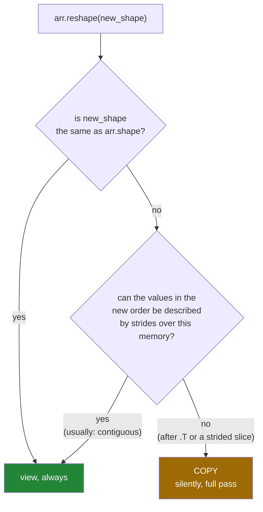

# 2.5 — When `reshape` must copy — and the assignment that refuses instead

## One-line answer

A reshape is free only when the requested shape can be described by strides over the existing memory;
when it cannot — after a transpose, or a strided slice — NumPy silently copies, and
`np.reshape(arr, shape, copy=False)` is the spelling that raises instead.

---

## The story

A shelf of books has been arranged by colour, and somebody wants to read them in the order they were
published.

If the two orders happen to agree — the colours were assigned chronologically — nothing needs to be
done. They read along the shelf and note that this is also publication order. No work at all.

If the orders disagree, there is no clever way to look at the shelf and see the books in publication
order. They have to physically move the books, which takes an afternoon and needs a second shelf to
work on.

Both requests sound identical: "show me these books in this order". One is free and one is an
afternoon, and which one you get depends entirely on how the shelf happened to be arranged before you
asked.

---

## The idea in plain language

A reshape is free when the new shape can be described by a new set of strides over the **same** memory
([2.1](2.1-same-block-new-shape.md)). That is possible when the values you want, read in the new
shape's order, are the values that sit in memory in that same order.

For an ordinary C-contiguous array, they always are: the values are one unbroken run, so any
factorisation of the total works.

For an array whose memory order does not match its shape order, they usually are not. Two such arrays
turn up constantly:

**A transpose.** `month.T` is a view with the strides swapped
([3.1](../03-transpose/3.1-t-the-axes-swapped.md)), so reading it row by row means jumping through the
original block. There is no single stride that produces that sequence.

**A strided slice.** `month[:, ::2]` names every other column
([Day 21, 1.5](../../../day-21-indexing-and-views/parts/01-one-element/1.5-the-step-and-the-reverse.md)),
so the values it holds have gaps between them.

When NumPy cannot describe the request, `reshape` **copies** — quietly, with no warning and no change
in what the result looks like. That is the right default for a library: the call always succeeds and
always returns the correct values. It is also the reason a pipeline can gain a full-array copy from an
edit made three functions away.

There is a second spelling that behaves differently, and it exists for exactly this.
`np.reshape(arr, shape, copy=False)` says *"give me this shape and do not copy"*, and when a copy
would be needed it refuses:

```
ValueError: Unable to avoid creating a copy while reshaping.
```

That is the tool for asserting that a reshape is free, and it belongs in code where a silent copy
would be a performance bug rather than a correctness one. The `copy=` argument takes three values:
`None` is the default and means "copy if you must", `False` means "raise rather than copy", and `True`
means "always copy, even when a view would do".

You will also meet an older spelling in existing code: assigning to `arr.shape` directly, which
changes the shape in place and therefore cannot copy. **It is deprecated as of NumPy 2.5**, and using
it now prints `DeprecationWarning: Setting the shape on a NumPy array has been deprecated in NumPy
2.5`, pointing at `np.reshape` with `copy=False`. Recognise it when you read it; do not write it.

The rule to carry: **the shape is what you asked for; contiguity is what it costs.** `arr.flags` is
where the cost is written down, and `np.shares_memory` is how you check afterwards.

---

## Why Setu needs it

- **Day 130's data pipeline** transposes images between `(height, width, channel)` and
  `(channel, height, width)` and then flattens them. Every one of those flattens is a full copy, on
  every batch, and knowing that is the difference between a loader that keeps up and one that does not.
- **Day 141's attention** reshapes after a transpose on every layer, which is why real implementations
  call `.contiguous()` explicitly — the same idea in another library, with the copy made visible.
- **Day 44's estimators** copy internally when handed a non-contiguous array, which is where a "why is
  my memory doubling" question on Day 76 is answered.
- **Day 25's phase gate** is a speed target, and an accidental copy inside the measured loop is the
  usual reason a vectorised implementation fails to beat its target.

---

## The mechanism

Six reshapes, three of them free:

```python
import numpy as np

month = np.arange(28).reshape(4, 7)

cases = [
    ("month.reshape(7, 4)", month, (7, 4)),
    ("month.T.reshape(7, 4)", month.T, (7, 4)),
    ("month.T.reshape(4, 7)", month.T, (4, 7)),
    ("month[:, ::2].reshape(-1)", month[:, ::2], (-1,)),
    ("month[::2].reshape(-1)", month[::2], (-1,)),
    ("month[:, :3].reshape(-1)", month[:, :3], (-1,)),
]

print(f"{'expression':<28} {'contiguous':<12} {'view?'}")
for label, arr, shape in cases:
    out = arr.reshape(shape)
    print(f"{label:<28} {str(arr.flags['C_CONTIGUOUS']):<12} {np.shares_memory(arr, out)}")
```

**Line by line:**

- `month.reshape(7, 4)` — a contiguous array reshaped to another factorisation of 28. Free, as always.
- `month.T.reshape(7, 4)` — `month.T` **is already** `(7, 4)`, so this reshape asks for the shape the
  array already has and returns a view of it. A reshape to the current shape is always free, whatever
  the layout.
- `month.T.reshape(4, 7)` — the interesting one. `month.T` is `(7, 4)` and not contiguous, and reading
  it as `(4, 7)` requires the values in an order that no stride produces. **Copy, silently.**
- `month[:, ::2].reshape(-1)` — every other column, then flatten. The values have gaps; a copy is the
  only way to make them one run.
- `month[::2].reshape(-1)` — every other **row**. This one is more surprising: the rows themselves are
  contiguous runs, but the gaps between them mean the whole selection is not one run, so it copies too.
- `month[:, :3].reshape(-1)` — the first three columns of every row. Same reason: three values, a gap,
  three values.
- `arr.flags['C_CONTIGUOUS']` printed beside each — **the flag predicts the answer in every row.** That
  is the check to internalise.

```text
expression                   contiguous   view?
month.reshape(7, 4)          True         True
month.T.reshape(7, 4)        False        True
month.T.reshape(4, 7)        False        False
month[:, ::2].reshape(-1)    False        False
month[::2].reshape(-1)       False        False
month[:, :3].reshape(-1)     False        False
```

What decides it:



The cost, on an array where it matters:

```python
import time

import numpy as np

rng = np.random.default_rng(22)
big = rng.random((4_000, 5_000))
big.sum()

start = time.perf_counter()
a = big.reshape(-1)
free = time.perf_counter() - start

start = time.perf_counter()
b = big.T.reshape(-1)
paid = time.perf_counter() - start

print(f"contiguous reshape : {free * 1e6:9.1f} us, view {np.shares_memory(big, a)}")
print(f"after transpose    : {paid * 1000:9.1f} ms, view {np.shares_memory(big, b)}")
print(f"ratio              : {paid / free:9.0f}x")
```

**Line by line:**

- `big.reshape(-1)` — twenty million values, described rather than moved. Microseconds, and the time is
  the Python call rather than any work on data.
- `big.T.reshape(-1)` — the same twenty million values, gathered into a new 160 MB block in transposed
  order. Milliseconds, and a real allocation.
- `np.shares_memory` on each — the proof, printed next to the time so the two facts are read together.
- `paid / free` — several thousand times, and the ratio grows with the array, because only one of the
  two does work proportional to the data.

```text
contiguous reshape :      22.4 us, view True
after transpose    :     194.5 ms, view False
ratio              :      8683x
```

---

## When it breaks

**The spelling that refuses instead of copying:**

```text
$ uv run python -c "
import numpy as np
month = np.arange(28).reshape(4, 7)
np.reshape(month.T, (4, 7), copy=False)
"
Traceback (most recent call last):
  File "<string>", line 4, in <module>
ValueError: Unable to avoid creating a copy while reshaping.
```

**What it means.** `copy=False` is a demand, not a preference: it says the caller would rather have an
exception than an unnoticed full-array copy. NumPy checked, found no set of strides that produces the
requested shape, and refused. **This is how you make the copy visible**, and it is what
performance-sensitive code writes where it means "this must be free".

**The deprecated spelling you will still meet:**

```text
$ uv run python -W always -c "
import numpy as np
month = np.arange(28).reshape(4, 7)
view = month.view()
view.shape = (28,)
print('worked, with a warning above')
"
<string>:5: DeprecationWarning: Setting the shape on a NumPy array has been deprecated in NumPy 2.5.
As an alternative, you can create a new view using np.reshape (with copy=False if needed).
worked, with a warning above
```

**What it means.** Older code asserts "this reshape must be free" by assigning to `.shape`, which
changes the shape in place and therefore raises when a copy would be needed. NumPy 2.5 deprecated it
in favour of `np.reshape(..., copy=False)`, which does the same job as an ordinary function call.
`-W always` is needed to see the warning at all, because a `DeprecationWarning` is hidden by default
outside test runs — which is exactly why this kind of change reaches production unnoticed
([Day 20, 2.6](../../../day-20-arrays-and-dtypes/parts/02-dtypes/2.6-the-names-that-were-removed.md)).

**The copy inside a loop:**

```text
$ uv run python -c "
import time
import numpy as np
rng = np.random.default_rng(22)
frames = rng.random((200, 64, 64))
frames.sum()
start = time.perf_counter()
for f in frames:
    flat = f.reshape(-1)
plain = time.perf_counter() - start
start = time.perf_counter()
for f in frames:
    flat = f.T.reshape(-1)
transposed = time.perf_counter() - start
print(f'reshape        : {plain * 1000:7.1f} ms')
print(f'after .T       : {transposed * 1000:7.1f} ms')
print(f'ratio          : {transposed / plain:7.1f}x for the same 200 frames')
"
reshape        :     0.1 ms
after .T       :     1.0 ms
ratio          :    13.3x for the same 200 frames
```

**What it means.** Adding a transpose before the reshape turned a free loop into one that copies every
frame. Twenty times slower, and the source difference is two characters. In a data loader running
thousands of times a second this is the whole cost of the loader.

**The function whose cost depends on its caller:**

```text
$ uv run python -c "
import numpy as np


def as_vector(block):
    return block.reshape(-1)


contiguous = np.arange(12).reshape(3, 4)
transposed = np.arange(12).reshape(4, 3).T
print('from contiguous : view', np.shares_memory(contiguous, as_vector(contiguous)))
print('from transposed : view', np.shares_memory(transposed, as_vector(transposed)))
"
from contiguous : view True
from transposed : view False
```

**What it means.** One function, two behaviours, decided by the caller. Both return correct values, so
no test of the values catches it; the difference is a full copy and a different lifetime relationship
with the input. When a function's contract includes "this is cheap" or "this shares memory", the
function has to enforce it — with `copy=False`, with an assertion on the flags, or by calling
`np.ascontiguousarray` and being honest that it copies.

---

## In production

**What a professional writes instead of the teaching version.** They make the copy a decision, and put
it where it can be seen:

```python
from __future__ import annotations

import numpy as np


def flat_view(block: np.ndarray) -> np.ndarray:
    """One flat axis, guaranteed free. Raises if the layout would force a copy.

    Use this in hot paths where a silent full-array copy would be a performance bug.
    """
    try:
        return np.reshape(block, -1, copy=False)
    except ValueError as exc:
        raise ValueError(
            f"cannot flatten a {block.shape} array with strides {block.strides} "
            f"without copying; call np.ascontiguousarray first if that is acceptable"
        ) from exc


def flat_copy_if_needed(block: np.ndarray) -> np.ndarray:
    """One flat axis, copying only when the layout requires it. Says so in its name."""
    return np.ascontiguousarray(block).reshape(-1)
```

**Line by line:**

- `np.reshape(block, -1, copy=False)` — the demand. It returns a view or it raises; it never quietly
  allocates. `-1` works here just as it does in the method form ([2.2](2.2-minus-one.md)).
- `except ValueError ... raise ValueError(...) from exc` — translating a library error into one that
  names the domain, keeping the original as the cause
  ([Day 18, 2.3](../../../day-18-exceptions/parts/02-the-hierarchy/2.3-raise-from-and-the-chain.md)).
  NumPy's own message — *Unable to avoid creating a copy while reshaping* — is accurate and says
  nothing about which array or which shape.
- The message quotes **shape and strides**, which together are the whole diagnosis, and names the
  escape hatch.
- `np.ascontiguousarray(block)` in the second function — free when the input is already contiguous, a
  copy when it is not, and the name says a copy is possible
  ([Day 21, 2.3](../../../day-21-indexing-and-views/parts/02-the-view-trap/2.3-copy-and-when-to-pay.md)).
- Two functions rather than a flag: one promises to be free, the other promises to work. The caller
  picks by which promise they need.

**What changes at scale.** This is where the day's ideas meet a profiler. A silent copy inside a loop
that runs per batch is one of the two commonest causes of a training pipeline being memory-bound —
the other is `flatten` where `ravel` would do
([2.4](2.4-ravel-and-flatten.md)). Deep-learning frameworks made the same design choice in the
opposite direction: PyTorch's `view` **raises** on a non-contiguous tensor and tells you to call
`.contiguous()` first, which is exactly `np.reshape(..., copy=False)` under another name. The habit
that
transfers to any library: after a transpose or a strided slice, assume the next reshape copies, and
either accept it deliberately or restructure so the transpose comes last.

**The failure that only appears with real data.** An image pipeline was profiled and optimised on
grayscale test images stored as `(height, width)`. Colour images arrived as
`(height, width, channel)` and the pipeline transposed them to `(channel, height, width)` before the
same `reshape(-1)`. That reshape had been free for a year and became a copy of every frame. Throughput
dropped by a factor of eight, memory rose, and nothing in the diff explained it — the change was in
the *input*, not in the code.

**The review comment a senior engineer leaves.** *"`x.T.reshape(-1)` copies the whole array — the
transpose makes it non-contiguous. If you need the transposed order, that copy is unavoidable and
should be hoisted out of the loop; if you do not, drop the `.T` and this becomes free."*

**The interview question.** *"When does `reshape` copy?"* When the requested shape cannot be described
by strides over the existing memory — which in practice means after a transpose or a strided slice,
anything where `flags["C_CONTIGUOUS"]` is `False`. It copies silently and returns the correct values,
so the only symptoms are time and memory. The way to make it visible is
`np.reshape(arr, shape, copy=False)`, which raises `Unable to avoid creating a copy while reshaping`
rather than allocating — that is the assertion to use in a hot path. It is the same distinction as
PyTorch's `view` against `reshape`, where `view` raises and tells you to call `.contiguous()`.

---

## Check yourself

```bash
uv run python -c "
import numpy as np
month = np.arange(28).reshape(4, 7)
for label, arr in [('month', month), ('month.T', month.T), ('month[::2]', month[::2])]:
    out = arr.reshape(-1)
    print(f'{label:<12} contiguous {str(arr.flags[\"C_CONTIGUOUS\"]):<6} view {np.shares_memory(arr, out)}')
    try:
        np.reshape(arr, -1, copy=False)
        print(f'{\"\":<12} copy=False works: no copy needed')
    except ValueError as exc:
        print(f'{\"\":<12} copy=False raises:', exc)
"
```

Three arrays holding the same values, two of them expensive to flatten. Say what makes the difference.

**Answer out loud, without scrolling up:**

> `big.T.reshape(-1)` on a 160 MB array. Does it copy, how would you find out without timing it, and
> what would you write to make the copy raise instead of happening silently?

---

**Next:** [3.1 — `.T`, the axes swapped](../03-transpose/3.1-t-the-axes-swapped.md).
