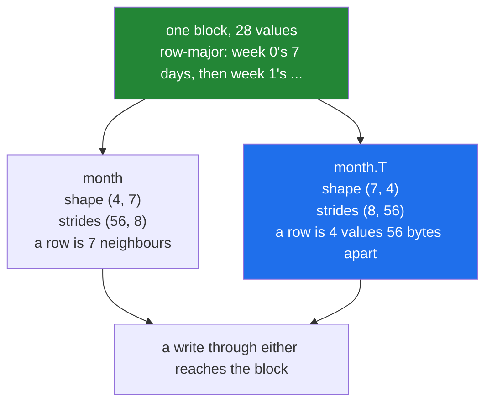

# 3.1 — `.T` — the axes swapped, and not one number moved

## One-line answer

`month.T` turns weeks-by-days into days-by-weeks by **swapping the strides**, so it is a view, it
costs nothing, and writing to it writes to the original.

---

## The story

The month is written on squared paper: four rows of seven, weeks going down and days going across.

Somebody wants to look at it the other way — all four Mondays together, then all four Tuesdays. They
do not copy the numbers out into a new grid of seven rows and four columns. They turn the paper
ninety degrees.

Every number is exactly where it was. The paper has not changed. What changed is which direction
counts as "along a row", and that was never a property of the numbers — it was a property of how
somebody was holding the page.

If they now write a correction on the turned page and turn it back, the correction is there. There
was only one page the whole time.

---

## The idea in plain language

An array is a block of memory plus a shape and one stride per axis
([Day 20, 1.3](../../../day-20-arrays-and-dtypes/parts/01-the-block/1.3-one-block-and-strides.md)).
For a `(4, 7)` array of eight-byte values, the strides are `(56, 8)`: fifty-six bytes to the next
week, eight to the next day.

`month.T` is the same block with the shape and the strides **reversed**: shape `(7, 4)`, strides
`(8, 56)`. Now the first axis steps eight bytes — down what used to be a row — and the second steps
fifty-six. Reading `by_day[0]` walks eight bytes at a time through the whole block, picking up every
Monday.

Nothing was moved, allocated or computed. Transposing a four-gigabyte array takes the same time as
transposing a four-element one, because in both cases the work is writing two small tuples.

Four consequences worth stating plainly.

**`arr.T[i, j]` is `arr[j, i]`.** That is the definition, and every other property follows from it.

**It is a view.** Writing through the transpose writes to the original, exactly like a slice
([Day 21, 2.1](../../../day-21-indexing-and-views/parts/02-the-view-trap/2.1-a-slice-does-not-copy.md)).

**`arr.T.T` is the original.** Swapping twice gives the strides back, and the result shares memory with
what you started from.

**The result is not C-contiguous.** Its values, read row by row, are scattered through the block —
which costs nothing until something needs them contiguous, and then it costs a full copy
([3.3](3.3-contiguity-and-the-speed-you-lose.md), and
[2.5](../02-reshape/2.5-when-reshape-must-copy.md) for the reshape case).

One special case that surprises everybody once: **`.T` on a one-dimensional array does nothing.** A
`(3,)` array has one axis, reversing one axis gives the same axis, and the result is still `(3,)`. If
you wanted a column, `.T` is not the tool — `arr[:, np.newaxis]` is
([Day 21, 1.6](../../../day-21-indexing-and-views/parts/01-one-element/1.6-ellipsis-and-newaxis.md)).
People coming from MATLAB, where a vector is a matrix with one row, hit this on their first day.

---

## Why Setu needs it

- **Day 130's images** are transposed between `(height, width, channel)` and
  `(channel, height, width)` because different libraries want different orders, and it is free.
- **Day 155's similarity matrix** is `unit @ unit.T`, and the transpose is what turns "every row
  against every row" into a matrix multiplication.
- **Day 91's design matrix** is transposed in the normal equations, `(X.T @ X)`, which you will derive
  by hand rather than call.
- **Day 26's Pandas** transposes a frame with the same `.T`, and the same view semantics apply
  underneath.
- **Day 44's solvers** want F-contiguous input, and a transpose of a C-contiguous array is exactly
  that — which is [3.3](3.3-contiguity-and-the-speed-you-lose.md)'s useful half.

---

## The mechanism

The month, turned:

```python
import numpy as np

month = np.array(
    [
        [8213, 10442, 6180, 9000, 12007, 9631, 7204],
        [7788, 9120, 11345, 8402, 6733, 14210, 5096],
        [9004, 8765, 7621, 10188, 9950, 8317, 11002],
        [6540, 12488, 9873, 7106, 8899, 10540, 9218],
    ]
)

by_day = month.T
print("month shape   :", month.shape, "strides", month.strides)
print("month.T shape :", by_day.shape, "strides", by_day.strides)
print("shares memory :", np.shares_memory(month, by_day))
print("month[1, 4]   :", month[1, 4], " by_day[4, 1] :", by_day[4, 1])
print("Mondays       :", by_day[0])
print(
    "C-contiguous  :", by_day.flags["C_CONTIGUOUS"], "F-contiguous:", by_day.flags["F_CONTIGUOUS"]
)

by_day[0, 0] = -1
print("wrote by_day[0, 0], month[0, 0] is:", month[0, 0])
print("T of T is the original:", np.shares_memory(month, by_day.T), by_day.T.shape)
```

**Line by line:**

- `month.T` — no arguments, no options. For a two-dimensional array it means "swap the two axes".
- `month.strides` is `(56, 8)` and `by_day.strides` is `(8, 56)` — **the same two numbers, reversed.**
  That single swap is the entire implementation.
- `np.shares_memory(month, by_day)` — `True`. A transpose is a view, and everything from
  [Day 21, 2.2](../../../day-21-indexing-and-views/parts/02-the-view-trap/2.2-how-to-tell-base-and-shares-memory.md)
  applies to it.
- `month[1, 4]` and `by_day[4, 1]` — the same value, which is the definition written as a check.
- `by_day[0]` — every Monday, in one row. In the original that is a column
  ([Day 21, 1.4](../../../day-21-indexing-and-views/parts/01-one-element/1.4-a-whole-column.md)), and
  after the transpose it is a row, without anything being gathered.
- `flags` — **not C-contiguous, and F-contiguous instead.** The transpose of a C-contiguous array is
  F-contiguous, because column-major is exactly what row-major looks like from the other side
  ([2.3](../02-reshape/2.3-the-order-argument.md)).
- `by_day[0, 0] = -1` — the write goes to `month[0, 0]`. One block, two descriptions.
- `by_day.T` — back to `(4, 7)`, sharing memory with the original. Two swaps cancel.

```text
month shape   : (4, 7) strides (56, 8)
month.T shape : (7, 4) strides (8, 56)
shares memory : True
month[1, 4]   : 6733  by_day[4, 1] : 6733
Mondays       : [8213 7788 9004 6540]
C-contiguous  : False F-contiguous: True
wrote by_day[0, 0], month[0, 0] is: -1
T of T is the original: True (4, 7)
```

What the swap does to the reading pattern:



The one-dimensional case, which does nothing:

```python
import numpy as np

row = np.array([1, 2, 3])
print("row shape   :", row.shape)
print("row.T shape :", row.T.shape)
print("same object :", np.shares_memory(row, row.T))
print("column      :", row[:, None].shape, row[:, None].T.shape)
```

**Line by line:**

- `row.T.shape` — still `(3,)`. **Reversing a list of one axis gives the same list.** There is no
  "row vector" and "column vector" distinction in NumPy; there is a one-dimensional array, and there
  are two-dimensional arrays with a size of 1 on one axis.
- `np.shares_memory(row, row.T)` — `True`, because it is effectively the same array.
- `row[:, None]` — `(3, 1)`, a genuine column, made by adding an axis rather than by transposing.
- `row[:, None].T` — `(1, 3)`, a genuine row. Once there are two axes, `.T` does what you expect.

```text
row shape   : (3,)
row.T shape : (3,)
same object : True
column      : (3, 1) (1, 3)
```

---

## When it breaks

**The transpose that did nothing, and the broadcast that followed:**

```text
$ uv run python -c "
import numpy as np
table = np.arange(12).reshape(3, 4)
weights = np.array([1, 2, 3])
print('shape of weights.T :', weights.T.shape)
print(table * weights.T)
"
shape of weights.T : (3,)
Traceback (most recent call last):
  File "<string>", line 6, in <module>
ValueError: operands could not be broadcast together with shapes (3,4) (3,)
```

**What it means.** Somebody wanted the weights as a column and reached for `.T`, which on a
one-dimensional array does nothing, so the broadcast failed exactly as it would have without it. The
fix is `weights[:, np.newaxis]`, or `keepdims=True` at the reduction that produced the weights
([../01-broadcasting/1.4-keepdims-and-the-column.md](../01-broadcasting/1.4-keepdims-and-the-column.md)).
Reading `.T` as "make this a column" is the mistake; it means "reverse the axes", and one axis
reversed is one axis.

**The write that reached the original:**

```text
$ uv run python -c "
import numpy as np
month = np.arange(28).reshape(4, 7)
by_day = month.T
by_day[:] = 0
print('by_day is all zero :', not by_day.any())
print('month is all zero  :', not month.any())
"
by_day is all zero : True
month is all zero  : True
```

**What it means.** Zeroing the transpose zeroed the original, because there is only one set of
numbers. A function that transposes its input and then writes is writing to the caller's array
([Day 21, 2.4](../../../day-21-indexing-and-views/parts/02-the-view-trap/2.4-the-function-that-changed-its-input.md)).
This is easy to miss, because the transpose feels like it produced something new.

**The copy that appeared later:**

```text
$ uv run python -c "
import numpy as np
month = np.arange(28).reshape(4, 7)
by_day = month.T
print('transpose is free  :', np.shares_memory(month, by_day))
print('but .ravel() is not:', np.shares_memory(month, by_day.ravel()))
print('and .copy() is real:', by_day.copy().flags['C_CONTIGUOUS'])
"
transpose is free  : True
but .ravel() is not: False
and .copy() is real: True
```

**What it means.** The transpose costs nothing and it changes the layout, so the **next** operation may
pay for it. `ravel` on a transposed array copies ([2.4](../02-reshape/2.4-ravel-and-flatten.md)), and
so does `reshape` to most shapes ([2.5](../02-reshape/2.5-when-reshape-must-copy.md)). The cost does
not appear on the line with the `.T`; it appears somewhere below it, which is why a profiler points at
an innocent-looking `reshape`.

---

## In production

**What a professional writes instead of the teaching version.** They transpose to satisfy an interface
and say which orientation the code below assumes:

```python
from __future__ import annotations

import numpy as np


def features_by_column(table: np.ndarray) -> np.ndarray:
    """Present a (samples, features) table as (features, samples), as a VIEW.

    Some routines - per-feature statistics, plotting one series at a time - are natural
    over columns. Transposing costs nothing; the caller must not write to the result,
    because it shares memory with ``table``.
    """
    if table.ndim != 2:
        raise ValueError(f"expected (samples, features), got shape {table.shape}")
    flipped = table.T.view()
    flipped.flags.writeable = False
    return flipped


def gram_matrix(unit_rows: np.ndarray) -> np.ndarray:
    """Every row against every row: the (n, n) matrix of dot products.

    ``unit_rows`` should already be length-1 rows, so the result is cosine similarity.
    """
    if unit_rows.ndim != 2:
        raise ValueError(f"expected (rows, features), got shape {unit_rows.shape}")
    n = unit_rows.shape[0]
    if n * n * unit_rows.dtype.itemsize > 2_000_000_000:
        raise MemoryError(f"a {n}x{n} similarity matrix is too large to build at once")
    return unit_rows @ unit_rows.T
```

**Line by line:**

- `table.T.view()` then `flags.writeable = False` — the transpose is a view of the caller's data, so it
  is handed out read-only ([Day 21, 5.2](../../../day-21-indexing-and-views/parts/05-in-anger/5.2-view-or-copy-on-purpose.md)).
  The `.view()` is needed so the flag lands on our object rather than on a temporary.
- The docstring says VIEW and says what the caller must not do. `.T` looks like it produced a new
  array, so the warning has to be explicit.
- `unit_rows @ unit_rows.T` — `(n, f) @ (f, n)` giving `(n, n)`. **The transpose is what makes the
  inner dimensions meet**, which is the signature from
  [../01-broadcasting/1.6-reading-the-broadcast-error.md](../01-broadcasting/1.6-reading-the-broadcast-error.md).
- The `MemoryError` guard — this is the `(n, 1)` against `(1, n)` explosion wearing a matrix
  multiplication's clothes ([../01-broadcasting/1.7-the-broadcast-that-ate-the-memory.md](../01-broadcasting/1.7-the-broadcast-that-ate-the-memory.md)).
  Ten thousand rows is a 800 MB result; a hundred thousand is 80 GB.
- `unit_rows.dtype.itemsize` rather than a hard-coded 8, so a `float32` matrix gets an honest estimate.
- Neither function calls `.copy()`. Transposing is free and should stay free; the moment a copy is
  needed, it is [3.3](3.3-contiguity-and-the-speed-you-lose.md)'s decision and belongs where it can be
  seen.

**What changes at scale.** The transpose itself stays free at every size, which is exactly what makes
it dangerous: it is the cheapest possible way to make every subsequent operation expensive. On a large
matrix, `X.T @ X` is fine — matrix multiplication handles either layout — while `X.T.reshape(-1)`,
`X.T.ravel()` and `np.ascontiguousarray(X.T)` all copy the whole thing. The production habit is to
keep data in the orientation the hot loop wants and transpose at the edges, rather than transposing in
the middle and paying for it in every stage that follows.

**The failure that only appears with real data.** A feature store returned `(features, samples)`
because that was convenient for its own statistics, and each consumer transposed it. One consumer then
called `.ravel()` to hash the contents for a cache key. At a hundred features and a thousand samples
the copy was invisible. When the store started returning a million samples, that hash became a 800 MB
copy per request. The fix was to hash the untransposed array, which needed no copy at all.

**The review comment a senior engineer leaves.** *"`return data.T` hands the caller a view of our
array, and the caller writes to it two functions later. Mark it read-only or copy it — and if you copy
it, do it here where the cost is visible rather than inside their `reshape`."*

**The interview question.** *"What does `.T` cost?"* Nothing — it returns a view with the shape and
strides reversed, so a four-gigabyte array transposes in the same time as a four-element one, and the
result shares memory with the original, so writes go through. Two things follow. It is not C-contiguous
any more, so the next `ravel` or `reshape` may silently copy the entire array, which is where the cost
actually appears. And on a one-dimensional array it does nothing at all: reversing one axis gives the
same axis, so if you wanted a column you need `arr[:, None]`.

---

## Check yourself

```bash
uv run python -c "
import numpy as np
month = np.arange(28).reshape(4, 7)
t = month.T
print('shape   :', month.shape, '->', t.shape)
print('strides :', month.strides, '->', t.strides)
print('view    :', np.shares_memory(month, t))
print('flags   : C', t.flags['C_CONTIGUOUS'], 'F', t.flags['F_CONTIGUOUS'])
print('1-D .T  :', np.array([1, 2, 3]).T.shape)
print('T of T  :', np.shares_memory(month, t.T))
"
```

Five facts about an operation that did no work. The fourth line is the one that costs you later.

**Answer out loud, without scrolling up:**

> `month` is `(4, 7)` with strides `(56, 8)`. Give the shape and strides of `month.T`, say how many
> bytes it allocated, and say what `month[2, 5] = 0` does to `month.T`.

---

**Next:** [3.2 — `transpose` and `swapaxes`](3.2-transpose-and-swapaxes.md).
