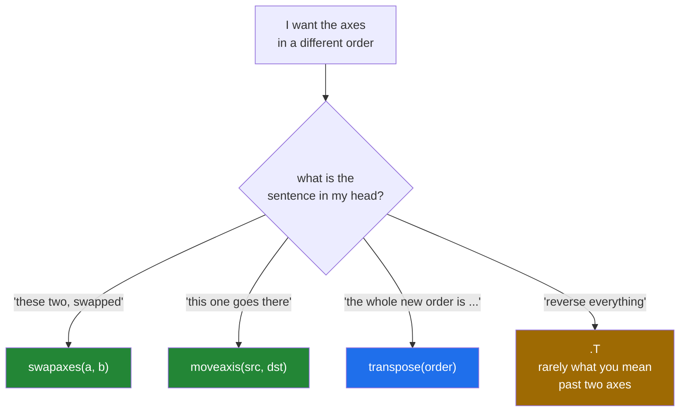

# 3.2 — `transpose`, `swapaxes` and `moveaxis` — naming the axes you meant

## One-line answer

With three or more axes, `.T` reverses **all** of them, which is almost never what you want —
`transpose(order)` states the new order, `swapaxes(a, b)` exchanges exactly two, and `moveaxis(src,
dst)` takes one axis somewhere else and leaves the rest alone.

---

## The story

A shop keeps its stock records in a filing cabinet: one drawer per branch, one folder per month
inside each drawer, and one page per product inside each folder.

Somebody asks for the records arranged by month instead — one drawer per month, branches inside.
That is a real job and it is a specific one: two of the three levels swap and the third stays where
it is.

If you simply reverse the whole hierarchy, you get one drawer per product, months inside, branches
inside that. Every page is still in the cabinet, and nobody asked for this.

"Turn it round" is not an instruction when there are three levels. There are several ways to turn it
round, and you have to say which two levels you meant.

---

## The idea in plain language

`.T` reverses the order of the axes: `(2, 3, 4)` becomes `(4, 3, 2)`. For two axes that is the swap
everyone means. For three or more it reverses everything, which is rarely the intention and which
still returns a perfectly valid array — so it does not raise, it just gives you the wrong arrangement
([3.1](3.1-t-the-axes-swapped.md)).

Three functions say what you mean instead. All three are views, all three cost nothing, and each takes
a different way of describing the change.

**`arr.transpose(order)`** takes the **new order of the old axis numbers**. `cube.transpose(1, 0, 2)`
means "the new axis 0 is the old axis 1, the new axis 1 is the old axis 0, the new axis 2 is the old
axis 2". You must list every axis, which is both its strength — nothing is left ambiguous — and its
weakness, because a five-axis tensor needs five numbers and one typo is a silent transposition.

**`arr.swapaxes(a, b)`** exchanges exactly two axes and leaves the others in place. It says the whole
intention in two numbers, and it is the right choice when the intention is genuinely "these two, the
other way round".

**`np.moveaxis(arr, source, destination)`** takes one axis out and reinserts it somewhere else,
sliding everything between along. `np.moveaxis(images, 0, -1)` means "the channel axis is currently
first; put it last". This is the one that reads like English, and it is the one to reach for when the
sentence in your head is "move the channels to the end".

The three overlap: any single change can be written with any of them. Choose by which one states your
reason. "Swap these two" is `swapaxes`. "Put this one there" is `moveaxis`. "Here is the whole new
order" is `transpose`.

Two conventions to know, because they are why this comes up at all. Image data is stored as
`(height, width, channel)` by most file formats and image libraries, and as
`(channel, height, width)` by most deep-learning frameworks. Converting between them is one
`moveaxis`, done thousands of times a second in a data loader, and it is free every time.

---

## Why Setu needs it

- **Day 130's images** move between `(H, W, C)` and `(C, H, W)` on every batch, and this is the call
  that does it.
- **Day 141's attention** reshapes to `(batch, positions, heads, head_size)` and then swaps positions
  with heads, because the multiplication needs heads on the outside. Written with `.T` it would
  reverse all four axes and train on nonsense.
- **Day 149's sequence batching** moves the time axis between first and second — the "batch first"
  convention that every sequence library argues about.
- **Day 84's grouped tables** rearrange a three-axis summary so the axis you want to plot is last.

---

## The mechanism

One cube, four rearrangements:

```python
import numpy as np

cube = np.arange(24).reshape(2, 3, 4)

print("cube            :", cube.shape, cube.strides)
print("cube.T          :", cube.T.shape, cube.T.strides)
print("transpose(1,0,2):", cube.transpose(1, 0, 2).shape)
print("swapaxes(0,1)   :", cube.swapaxes(0, 1).shape)
print("moveaxis(0,-1)  :", np.moveaxis(cube, 0, -1).shape)
print(
    "all views       :",
    np.shares_memory(cube, cube.T),
    np.shares_memory(cube, np.moveaxis(cube, 0, -1)),
)
```

**Line by line:**

- `np.arange(24).reshape(2, 3, 4)` — two blocks of three rows of four. Every value equals its own flat
  position, so any confusion can be traced to actual numbers.
- `cube.T` — `(4, 3, 2)`. **All three axes reversed**, including the middle one, which stayed where it
  was only by accident of being in the middle.
- `cube.transpose(1, 0, 2)` — `(3, 2, 4)`. The first two swapped, the third left alone. Read the
  argument as "new axis 0 comes from old axis 1".
- `cube.swapaxes(0, 1)` — `(3, 2, 4)`, the same result in two numbers instead of three. For this
  intention, `swapaxes` is the clearer spelling.
- `np.moveaxis(cube, 0, -1)` — `(3, 4, 2)`. The first axis moved to the end, and the other two slid
  forward. **This is a different result from the swap**, which is the point of having both.
- `np.shares_memory(...)` — every one of these is a view. None of them moved a byte.

```text
cube            : (2, 3, 4) (96, 32, 8)
cube.T          : (4, 3, 2) (8, 32, 96)
transpose(1,0,2): (3, 2, 4)
swapaxes(0,1)   : (3, 2, 4)
moveaxis(0,-1)  : (3, 4, 2)
all views       : True True
```

Which tool for which sentence:



The image conversion, which is the case you will write most:

```python
import numpy as np

rng = np.random.default_rng(22)
picture = rng.integers(0, 256, size=(8, 6, 3), dtype=np.uint8)

framework = np.moveaxis(picture, -1, 0)
back = np.moveaxis(framework, 0, -1)

print("as loaded (H, W, C) :", picture.shape)
print("for a framework     :", framework.shape)
print("back again          :", back.shape)
print("round trip is exact :", np.array_equal(picture, back))
print(
    "all views           :", np.shares_memory(picture, framework), np.shares_memory(picture, back)
)
print("red channel matches :", np.array_equal(picture[:, :, 0], framework[0]))
print("wrong tool (.T)     :", picture.T.shape)
```

**Line by line:**

- `size=(8, 6, 3)` with `dtype=np.uint8` — eight rows, six columns, three colour channels, one byte per
  value, which is how an image actually arrives
  ([Day 20, 2.2](../../../day-20-arrays-and-dtypes/parts/02-dtypes/2.2-integers-and-the-silent-wrap.md)).
- `np.moveaxis(picture, -1, 0)` — "the last axis goes first". `(8, 6, 3)` becomes `(3, 8, 6)`: three
  channels, each an 8 × 6 picture.
- `np.moveaxis(framework, 0, -1)` — the exact inverse, and `array_equal` confirms the round trip.
- `np.shares_memory(...)` — both directions are views. A data loader doing this per image is doing no
  work at all, which is the only reason it is affordable.
- `picture[:, :, 0]` against `framework[0]` — the red channel, reached two ways. After the move it is
  a whole first axis rather than a slice of the last, which is exactly why frameworks want that order.
- `picture.T.shape` — `(3, 6, 8)`. **Right first axis, and the height and width have been swapped
  too.** The image is transposed as well as reordered, and nothing raises.

```text
as loaded (H, W, C) : (8, 6, 3)
for a framework     : (3, 8, 6)
back again          : (8, 6, 3)
round trip is exact : True
all views           : True True
red channel matches : True
wrong tool (.T)     : (3, 6, 8)
```

---

## When it breaks

**An axis listed twice:**

```text
$ uv run python -c "
import numpy as np
cube = np.arange(24).reshape(2, 3, 4)
cube.transpose(0, 0, 2)
"
Traceback (most recent call last):
  File "<string>", line 4, in <module>
ValueError: repeated axis in transpose
```

**What it means.** `transpose` needs a permutation — every old axis mentioned exactly once. Listing 0
twice means axis 1 is unaccounted for, and there is no sensible array that could result. This is the
typo that `swapaxes` and `moveaxis` cannot make, which is a real argument for using them.

**Too few axes named:**

```text
$ uv run python -c "
import numpy as np
cube = np.arange(24).reshape(2, 3, 4)
cube.transpose(1, 0)
"
Traceback (most recent call last):
  File "<string>", line 4, in <module>
ValueError: axes don't match array
```

**What it means.** Three axes in, two named. NumPy will not guess where the third goes. The message is
terse and the cause is nearly always code written for a two-dimensional array and later handed a batch
dimension — `(3, 4)` became `(2, 3, 4)` and the `transpose(1, 0)` did not follow. `swapaxes(-2, -1)`
is the version that survives an added leading axis, because negative numbers count from the end.

**`.T` on three axes, which does not raise:**

```text
$ uv run python -c "
import numpy as np
rng = np.random.default_rng(22)
batch = rng.random((10, 3, 5))
print('meant (swap last two) :', batch.swapaxes(-2, -1).shape)
print('wrote .T              :', batch.T.shape)
print('same array            :', np.array_equal(batch.swapaxes(-2, -1), batch.T))
"
meant (swap last two) : (10, 5, 3)
wrote .T              : (5, 3, 10)
same array            : False
```

**What it means.** The batch axis was supposed to stay first and `.T` put it last. Both are valid
arrays, both have three axes, and every operation after this point runs happily on the wrong one. If
the batch size and one of the other sizes ever match, even the shape assertions pass. **`.T` on
anything with more than two axes is worth treating as a bug until proven otherwise.**

**The negative-axis habit that saves you:**

```text
$ uv run python -c "
import numpy as np
plain = np.arange(12).reshape(3, 4)
batched = np.arange(24).reshape(2, 3, 4)
print('plain  swapaxes(-2, -1) :', plain.swapaxes(-2, -1).shape)
print('batched swapaxes(-2, -1):', batched.swapaxes(-2, -1).shape)
print('plain  swapaxes(0, 1)   :', plain.swapaxes(0, 1).shape)
print('batched swapaxes(0, 1)  :', batched.swapaxes(0, 1).shape)
"
plain  swapaxes(-2, -1) : (4, 3)
batched swapaxes(-2, -1): (2, 4, 3)
plain  swapaxes(0, 1)   : (4, 3)
batched swapaxes(0, 1)  : (3, 2, 4)
```

**What it means.** Counted from the end, "the last two axes" means the same thing whether or not a
batch dimension has been added in front. Counted from the front, it does not. Nothing here raises;
the last line is simply the wrong array. **Number your axes from the end whenever the leading axes are
batch-like**, which in machine-learning code is nearly always.

---

## In production

**What a professional writes instead of the teaching version.** Named conversions at the boundary, so
the axis order is never a matter of memory:

```python
from __future__ import annotations

import numpy as np


def to_channels_first(image: np.ndarray) -> np.ndarray:
    """(height, width, channel) -> (channel, height, width), as a view.

    File formats and image libraries give the first; most model frameworks want the
    second. This is a view, so it costs nothing and shares memory with ``image``.
    """
    if image.ndim != 3:
        raise ValueError(f"expected (height, width, channel), got shape {image.shape}")
    if image.shape[-1] not in (1, 3, 4):
        raise ValueError(
            f"last axis is {image.shape[-1]}, which is not 1, 3 or 4 channels: "
            f"is this array already channels-first?"
        )
    return np.moveaxis(image, -1, 0)


def to_channels_last(image: np.ndarray) -> np.ndarray:
    """(channel, height, width) -> (height, width, channel), as a view."""
    if image.ndim != 3:
        raise ValueError(f"expected (channel, height, width), got shape {image.shape}")
    return np.moveaxis(image, 0, -1)
```

**Line by line:**

- Two named functions rather than a `moveaxis` at each call site. **The name is the documentation**:
  a reader does not have to work out which convention a bare `np.moveaxis(x, -1, 0)` is converting
  from.
- `image.shape[-1] not in (1, 3, 4)` — a cheap sanity check, because a channel axis is almost always
  1, 3 or 4. It catches the commonest mistake, which is calling the conversion twice, and it names
  that mistake in the message.
- The check is a heuristic and is honest about it: a 3 × 3 × 3 array passes either way. That is
  acceptable, because the alternative — no check — catches nothing at all.
- `np.moveaxis(image, -1, 0)` — negative indexing, so it reads as "the last axis" rather than "axis 2"
  and keeps working if a batch axis is ever added.
- Both return views, and neither marks them read-only, deliberately: a conversion in a data-loading
  pipeline is normally followed by an operation that allocates anyway, and making it read-only would
  force a copy on the next in-place step.

**What changes at scale.** The moves stay free and what they cost moves downstream, exactly as in
[3.1](3.1-t-the-axes-swapped.md): a rearranged array is not contiguous, so the next operation that
needs contiguous memory copies the whole thing
([3.3](3.3-contiguity-and-the-speed-you-lose.md)). In a data loader handling thousands of images a
second, the pattern that works is to do all the rearranging first, then one `np.ascontiguousarray` at
the end, so exactly one copy happens instead of one per stage. The second thing that changes is
communication: at scale the axis order is part of an interface between teams, so it is written in the
function name, in the docstring and in an assertion, rather than being remembered.

**The failure that only appears with real data.** A pipeline converted images to channels-first and
was tested on square images, where an accidental `.T` instead of `moveaxis` produces an array of the
same shape as the correct answer. Every shape assertion passed. The model trained to a plausible-looking
accuracy and failed on the first non-square input with a shape error, at which point it turned out
that every image in training had been transposed as well as reordered. **The square test image hid
it**, and one non-square fixture would have caught it on day one.

**The review comment a senior engineer leaves.** *"`x.T` on a three-axis tensor reverses all three —
you want the last two swapped, which is `x.swapaxes(-2, -1)`. And use negative axis numbers here: this
function gets called with and without a batch dimension."*

**The interview question.** *"How do you swap two axes of a four-dimensional tensor?"*
`arr.swapaxes(a, b)`, or `np.moveaxis` if the intention is to move one axis somewhere else rather than
to exchange a pair; both return views and cost nothing. What you do not use is `.T`, which reverses
**all** the axes — on a four-axis tensor that is almost never the intention, and it returns a valid
array rather than raising, so the mistake shows up much later as wrong numbers. The practical detail
is to index axes from the end — `swapaxes(-2, -1)` — so the same code works whether or not a batch
dimension is present.

---

## Check yourself

```bash
uv run python -c "
import numpy as np
cube = np.arange(24).reshape(2, 3, 4)
print('.T              :', cube.T.shape)
print('swapaxes(0, 1)  :', cube.swapaxes(0, 1).shape)
print('swapaxes(-2, -1):', cube.swapaxes(-2, -1).shape)
print('moveaxis(0, -1) :', np.moveaxis(cube, 0, -1).shape)
print('transpose(2,0,1):', cube.transpose(2, 0, 1).shape)
print('all views       :', all(np.shares_memory(cube, x) for x in
    [cube.T, cube.swapaxes(0, 1), np.moveaxis(cube, 0, -1), cube.transpose(2, 0, 1)]))
"
```

Five rearrangements, five shapes, no allocations. Say which one you would write for "put the channels
last".

**Answer out loud, without scrolling up:**

> A tensor is `(batch, height, width, channel)` and a framework wants
> `(batch, channel, height, width)`. Write the call, and say why `.T` is wrong.

---

**Next:** [3.3 — contiguity and the speed you lose](3.3-contiguity-and-the-speed-you-lose.md).
