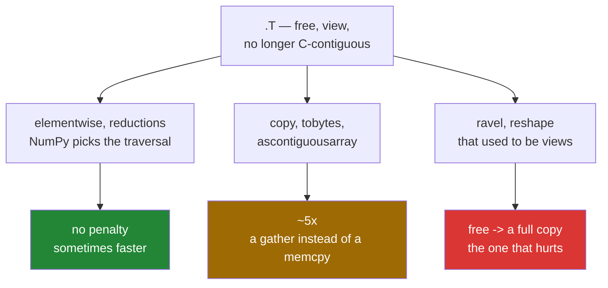

# 3.3 — Contiguity — which operations pay for a transpose, and which do not

## One-line answer

A transpose is free and it makes the array non-contiguous, which costs nothing for elementwise work
and reductions, and roughly five times as much for anything that has to produce a contiguous block —
`copy`, `ravel`, `tobytes`, and every hand-off to another library.

---

## The story

A warehouse stores boxes in long aisles: everything for one order is together on one shelf, in order.

A picker asked for "everything on shelf 12" walks along the shelf once and is done. Asked for "the
third box on every shelf", they walk the whole warehouse, taking one box from each aisle. The number
of boxes is the same. The walking is not.

Now, if all they have to do is *count* the boxes, the walking is annoying and manageable. If they have
to load them onto a lorry **in order**, the walking becomes the entire job, and at that point somebody
suggests restacking the warehouse first.

Restacking is a real cost, and whether it is worth paying depends entirely on what happens next. It is
worth it before ten lorries. It is a waste before one count.

---

## The idea in plain language

**Contiguous** means an array's values sit in memory in the order its shape implies, with no gaps.
`arr.flags["C_CONTIGUOUS"]` reports it. A fresh array is contiguous; a transpose
([3.1](3.1-t-the-axes-swapped.md)), a strided slice, or a rearranged axis
([3.2](3.2-transpose-and-swapaxes.md)) is usually not.

The intuition people arrive with is "non-contiguous is slower", and it is too coarse to be useful.
Measured, the operations fall into three groups.

**No penalty at all: elementwise operations and reductions.** NumPy's iterator inspects the strides and
walks the array in whatever order is best for memory, so `table.T * 2` costs the same as `table * 2`.
A reduction over a transposed array can even be *faster* than the equivalent over the original,
because the two are different traversals of the same data and one of them vectorises better.

**A real penalty — roughly five times here: anything that must produce a contiguous block.**
`.copy()`, `.tobytes()`, `np.ascontiguousarray`, and every call that hands the array to code written
in another language. These have to gather the values in order, which means jumping through memory and
missing the cache on nearly every read.

**A penalty out of all proportion: operations that were free and are now copies.** `ravel` on a
contiguous array is a view and takes microseconds; on a transposed array it copies and takes as long as
a gather ([2.4](../02-reshape/2.4-ravel-and-flatten.md)). The ratio is not five, it is however many
thousand — not because the copy is slow, but because the alternative was nothing at all.

That third group is the one to watch, and it explains the shape of the advice: **a transpose does not
make your program slower, it moves a copy into whichever later line first needs contiguous memory.**

`np.ascontiguousarray(arr)` is the tool for paying deliberately. It returns the array unchanged when it
is already C-contiguous — genuinely free, not merely cheap — and copies when it is not. Calling it once
before a run of operations that would each have copied is how you turn several copies into one.

---

## Why Setu needs it

- **Day 130's data loader** transposes every image and then hands it to a framework, which needs
  contiguous memory. One `np.ascontiguousarray` at the end of the transforms, rather than one per
  transform, is the difference between a loader that keeps the processor fed and one that does not.
- **Day 44's estimators** copy your feature matrix internally when it is not in the layout their
  solver wants, which is where "why did fitting allocate another four gigabytes" is answered.
- **Day 155's index** writes vectors to disk with `tobytes`, and writing a transposed array costs five
  times what writing a contiguous one does.
- **Day 25's phase gate** is a measured speedup, and an accidental gather inside the timed loop is the
  usual reason a vectorised version misses its target.

---

## The mechanism

Five operations, each on the same data in both layouts:

```python
import time

import numpy as np


def best_of(fn, repeat=3):
    out = float("inf")
    for _ in range(repeat):
        start = time.perf_counter()
        fn()
        out = min(out, time.perf_counter() - start)
    return out


rng = np.random.default_rng(22)
table = rng.random((4_000, 4_000))
table.sum()
transposed = table.T

pairs = [
    ("elementwise  table * 2", lambda: table * 2, lambda: transposed * 2),
    ("copy         .copy()", table.copy, transposed.copy),
    ("flatten      .ravel()", table.ravel, transposed.ravel),
    ("to bytes     .tobytes()", table.tobytes, transposed.tobytes),
    ("reduce       .sum(axis=1)", lambda: table.sum(axis=1), lambda: transposed.sum(axis=1)),
]

print(f"{'operation':<28} {'C-contiguous':>14} {'transposed':>12} {'ratio':>8}")
for label, c_fn, t_fn in pairs:
    c = best_of(c_fn)
    t = best_of(t_fn)
    print(f"{label:<28} {c * 1000:12.1f} ms {t * 1000:10.1f} ms {t / c:7.1f}x")
```

**Line by line:**

- `best_of(fn, repeat=3)` — the **fastest** of three runs, not the mean. Timing measures the machine as
  well as the code, and the minimum is the run least disturbed by everything else happening
  ([Day 20, 1.4](../../../day-20-arrays-and-dtypes/parts/01-the-block/1.4-a-million-floats-measured.md)).
- `table.sum()` before the loop — the warm-up, so page faults on a fresh 128 MB array are not
  attributed to the first measurement.
- `transposed = table.T` — a view, allocated nothing ([3.1](3.1-t-the-axes-swapped.md)). Every row of
  the table below compares the same values reached two ways.
- `lambda: table * 2` for the operations that need arguments, and the bare `table.copy` for those that
  do not — a method object is already callable, so wrapping it in a lambda would only add a frame.
- `.tobytes()` — produces the raw memory as a `bytes` object, in C order, which is what writing to a
  file or sending over a socket does.
- `t / c` — the ratio, printed so the shape of the answer is visible without arithmetic.

```text
operation                      C-contiguous   transposed    ratio
elementwise  table * 2               35.6 ms       33.5 ms     0.9x
copy         .copy()                 30.7 ms      141.0 ms     4.6x
flatten      .ravel()                 0.0 ms      143.1 ms 477050.4x
to bytes     .tobytes()              29.1 ms      142.4 ms     4.9x
reduce       .sum(axis=1)            14.3 ms        7.7 ms     0.5x
```

Read that table carefully, because three of its five rows contradict the folklore.

**Elementwise: no penalty.** `0.9x` — the transposed version was marginally *faster* in this run, which
is measurement noise around "the same". NumPy chose a traversal order that suits the memory rather
than the shape.

**Reduction: faster.** `0.5x`, and it is not noise. `transposed.sum(axis=1)` and `table.sum(axis=0)`
are the same computation, and summing down columns lets the processor add several values at once
instead of accumulating along a row. **A transposed array is not a slow array.**

**Copy, bytes, flatten: real.** These have to write out the values in order, so they gather, and
gathering misses the cache on nearly every read. The `ravel` ratio is meaningless as a number —
dividing by an operation that took microseconds — and it is the most important row in the table: an
operation that cost nothing now costs 143 milliseconds and 128 megabytes.

Where the cost goes:



Paying once instead of five times:

```python
import time

import numpy as np

rng = np.random.default_rng(22)
table = rng.random((3_000, 3_000))
table.sum()
transposed = table.T

start = time.perf_counter()
for _ in range(5):
    transposed.tobytes()
repeated = time.perf_counter() - start

start = time.perf_counter()
once = np.ascontiguousarray(transposed)
for _ in range(5):
    once.tobytes()
paid_once = time.perf_counter() - start

start = time.perf_counter()
already = np.ascontiguousarray(table)
free_call = time.perf_counter() - start

print(f"five gathers            : {repeated * 1000:7.1f} ms")
print(f"one copy, five memcpys  : {paid_once * 1000:7.1f} ms")
print(f"ascontiguousarray on a C array: {free_call * 1e6:5.1f} us, same object: {already is table}")
```

**Line by line:**

- The first loop calls `tobytes` five times on the transposed view, so it gathers all nine million
  values five times.
- `np.ascontiguousarray(transposed)` — one gather, and the result is an ordinary C-contiguous array.
  The five `tobytes` calls after it are straight memory copies.
- `np.ascontiguousarray(table)` on an array that is **already** C-contiguous returns the same object,
  which `already is table` proves. Not a fast copy: **no copy**, so calling it defensively costs
  nothing.
- The pattern generalises: when the same non-contiguous array is going to be consumed more than once,
  make it contiguous explicitly and once.

```text
five gathers            :   383.3 ms
one copy, five memcpys  :   162.6 ms
ascontiguousarray on a C array:  10.1 us, same object: True
```

---

## When it breaks

**The copy that appeared inside an innocent line:**

```text
$ uv run python -c "
import numpy as np
import tracemalloc
rng = np.random.default_rng(22)
table = rng.random((2_000, 2_000))
view = table.T
tracemalloc.start()
flat = view.ravel()
current, _ = tracemalloc.get_traced_memory()
tracemalloc.stop()
print('the .T allocated  : 0 bytes')
print('the .ravel() did  :', f'{current:,}', 'bytes')
print('shares with table :', np.shares_memory(table, flat))
"
the .T allocated  : 0 bytes
the .ravel() did  : 32,000,096 bytes
shares with table : False
```

**What it means.** The transpose is the cause and the `ravel` is where the memory appears. A profiler
blames `ravel`, a reviewer looking at that line sees nothing wrong with it, and the fix is on a
different line entirely — either drop the transpose or accept the copy and hoist it out of the loop.
**When a cheap-looking line allocates, look at what produced its input.**

**The defensive copy that was not free:**

```text
$ uv run python -c "
import time
import numpy as np
rng = np.random.default_rng(22)
table = rng.random((2_000, 2_000))
table.sum()
start = time.perf_counter()
for _ in range(20):
    np.ascontiguousarray(table)
already = time.perf_counter() - start
start = time.perf_counter()
for _ in range(20):
    np.ascontiguousarray(table.T)
not_yet = time.perf_counter() - start
print(f'on a C-contiguous array : {already * 1e6:8.1f} us total for 20 calls')
print(f'on a transposed view    : {not_yet * 1000:8.1f} ms total for 20 calls')
"
on a C-contiguous array :     10.2 us total for 20 calls
on a transposed view    :    466.8 ms total for 20 calls
```

**What it means.** `np.ascontiguousarray` is free when there is nothing to do and a full copy when
there is, and the same call in a loop is therefore either negligible or dominant depending on its
input. Calling it once at a boundary is right; calling it inside a loop over data that never becomes
contiguous is paying for the same copy every iteration.

**The library that copied without telling you:**

```text
$ uv run python -c "
import numpy as np
rng = np.random.default_rng(22)
table = rng.random((1_000, 1_000))
view = table.T
print('view is C-contiguous :', view.flags['C_CONTIGUOUS'])
print('view is F-contiguous :', view.flags['F_CONTIGUOUS'])
result = view @ view
print('matmul worked        :', result.shape)
print('result is contiguous :', result.flags['C_CONTIGUOUS'])
print('result shares memory :', np.shares_memory(table, result))
"
view is C-contiguous : False
view is F-contiguous : True
matmul worked        : (1000, 1000)
result is contiguous : True
result shares memory : False
```

**What it means.** The matrix multiplication accepted the non-contiguous operand and returned a fresh
contiguous array. Whether it copied the input internally is not visible from here at all — and for the
underlying linear-algebra library it very often does, which is where an unexplained allocation inside
a `fit` call comes from. The lesson is that contiguity is part of the interface between you and any
compiled library, and it is not part of the type.

---

## In production

**What a professional writes instead of the teaching version.** They make the layout decision once, at
the point where the data crosses into code that cares:

```python
from __future__ import annotations

import numpy as np


def prepare_for_export(block: np.ndarray) -> np.ndarray:
    """Contiguous C-order data, ready to be written or handed to a compiled library.

    Free when ``block`` is already C-contiguous; a single full copy when it is not.
    Call this ONCE at the boundary, never inside a loop over the same array.
    """
    return np.ascontiguousarray(block)


def export_all(blocks: list[np.ndarray], destination) -> int:
    """Write several blocks, paying for contiguity at most once per block."""
    written = 0
    for block in blocks:
        ready = prepare_for_export(block)
        payload = ready.tobytes()
        destination.write(payload)
        written += len(payload)
    return written
```

**Line by line:**

- `np.ascontiguousarray(block)` rather than `block.copy()` — **the conditional version.** `.copy()`
  always allocates, even when the array was already exactly right, which on the common path is a full
  wasted pass.
- The docstring says *free when already contiguous* and *call this once*, because both halves are
  needed: the first tells a reader it is safe to call defensively, the second tells them where.
- `ready = prepare_for_export(block)` inside the loop, but **once per block** — each block is a
  different array, so this is one gather per block rather than one per use.
- `ready.tobytes()` then `destination.write(...)` — the bytes are produced from an already-contiguous
  array, so this is a memory copy rather than a gather.
- `written += len(payload)` — returning how much was written, so the caller can check it against what
  it expected rather than trusting the loop.
- What this function deliberately does **not** do is transpose anything. Layout conversions belong
  where the meaning of the axes is known ([3.2](3.2-transpose-and-swapaxes.md)); this function's only
  job is to make whatever it is given writable in one pass.

**What changes at scale.** Two things. The gather stops being a constant factor and starts deciding
whether a job fits: a 4 GB transposed array made contiguous needs a second 4 GB while both exist, so
the peak is 8 GB. And the ordering of a pipeline starts to matter more than any individual operation —
transposes are free, so a pipeline that does every rearrangement first and one
`np.ascontiguousarray` at the end pays for exactly one gather, while one that alternates rearranging
and materialising pays for several. The rule that survives contact with real systems: **rearrange
freely, materialise once, and put the materialisation where a reviewer can see it.**

**The failure that only appears with real data.** A service serialised feature vectors to a cache with
`vector.tobytes()`. The vectors came from a matrix that was transposed upstream for a statistics
routine, so every serialisation was a gather. At a hundred requests a second on small vectors it was
invisible. When the vector size grew from 128 to 1536 dimensions, serialisation became the slowest
part of the request, and the profiler pointed at `tobytes` — a line nobody had changed. One
`np.ascontiguousarray` after the statistics step fixed it, and the real lesson was that the transpose
three functions upstream had a cost that never appeared on its own line.

**The review comment a senior engineer leaves.** *"`np.ascontiguousarray` inside the loop copies the
whole array on every iteration, because the input never becomes contiguous. Hoist it above the loop.
And it is free when the input already is contiguous, so there is no reason to guard it with an `if`."*

**The interview question.** *"What does a transpose cost?"* Nothing directly — it is a view with the
strides swapped. What it costs is contiguity, and that bill is paid by whichever later operation needs
a contiguous block. Measured on a 128 MB array: elementwise operations and reductions show no penalty
at all, because NumPy chooses its traversal from the strides and a column-wise reduction can even be
faster; `copy`, `tobytes` and `ascontiguousarray` cost about five times more, because they gather
rather than stream; and `ravel` goes from free to a full copy, which is the one that actually hurts.
The practical rule is to do all the rearranging first and call `np.ascontiguousarray` once at the
boundary — it returns the same object untouched when there is nothing to do, so it is safe to call
defensively.

---

## Check yourself

```bash
uv run python -c "
import numpy as np
rng = np.random.default_rng(22)
table = rng.random((1_000, 1_000))
view = table.T
print('table C-contiguous :', table.flags['C_CONTIGUOUS'])
print('view  C-contiguous :', view.flags['C_CONTIGUOUS'])
print('view  F-contiguous :', view.flags['F_CONTIGUOUS'])
print('ascontig(table) is table  :', np.ascontiguousarray(table) is table)
print('ascontig(view)  is view   :', np.ascontiguousarray(view) is view)
print('ravel(table) is a view    :', np.shares_memory(table, table.ravel()))
print('ravel(view)  is a view    :', np.shares_memory(table, view.ravel()))
"
```

Two of those lines say "no work was done" and two say "a full copy just happened". Say which.

**Answer out loud, without scrolling up:**

> You transpose a 1 GB array. Name one operation on it that costs nothing extra, one that costs about
> five times more, and one that goes from free to a full copy.

---

**Next:** [4.1 — `concatenate`](../04-joining-and-splitting/4.1-concatenate.md).
