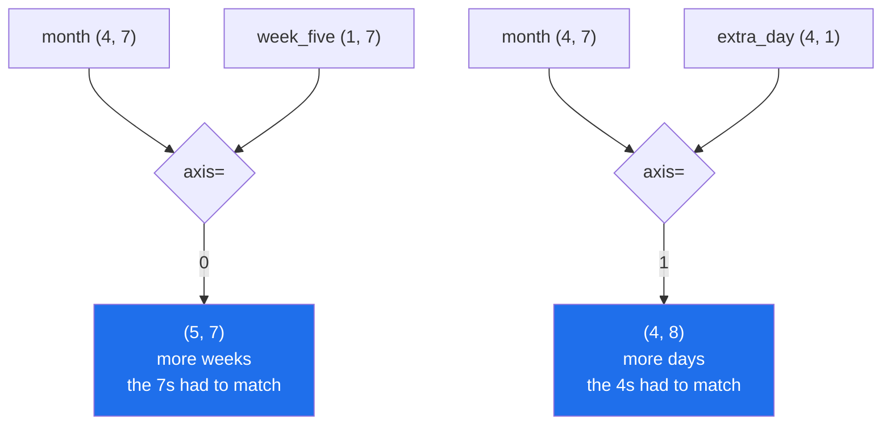

# 4.1 — `concatenate` — joining along an axis that already exists

## One-line answer

`np.concatenate([a, b], axis=0)` makes one longer array out of two, along an axis they both already
have — and unlike everything else today it **always allocates**, because two separate blocks of memory
cannot be described as one.

---

## The story

The month of step counts is written on squared paper, four rows of seven. A fifth week has now
happened, on a second sheet.

Somebody wants one table. There is no arrangement of the two sheets that makes them one sheet: laying
the second under the first gets you two sheets on a desk, and anybody reading it has to know to look at
both. To have one table, the numbers have to be copied onto a bigger sheet.

That copying is the honest cost of joining things. Everything else today has been "look at the same
numbers differently", which is free. This is "have more numbers in one place", which is not.

And there is a rule that becomes obvious the moment you try it: the second sheet has to be seven boxes
wide. A sheet of five would not line up, and there is no sensible thing to do with the gap.

---

## The idea in plain language

`np.concatenate` joins arrays along an axis that **already exists in all of them**. The result has the
same number of axes as the inputs; one of those axes gets longer.

The rules are short:

**All the inputs need the same number of axes.** A `(4, 7)` and a `(7,)` cannot be joined, because
there is no correspondence between their axes. That is what `expand_dims` is for
([4.4](4.4-newaxis-and-expand-dims.md)).

**Every axis except the joining one must match exactly.** Joining `(4, 7)` and `(1, 7)` along axis 0
works because the 7s agree. Joining `(4, 7)` and `(1, 5)` does not, and **nothing is broadcast** —
this is not an elementwise operation, so an axis of length 1 is not stretched
([../01-broadcasting/1.2-the-rule-in-three-lines.md](../01-broadcasting/1.2-the-rule-in-three-lines.md)).

**The result is always a new array.** Two arrays are two blocks of memory in two places, and no shape
and stride can describe both. The cost is a full copy of everything being joined, every time.

**The dtype is promoted to whatever holds all the inputs.** Joining an integer array with a float array
gives floats. Joining anything with text gives text, which is almost never what was intended
([Day 20, 2.1](../../../day-20-arrays-and-dtypes/parts/02-dtypes/2.1-a-dtype-is-a-promise.md)).

The `axis=` argument says which axis grows. `axis=0` stacks rows — more weeks. `axis=1` adds columns —
more days per week. `axis=None` flattens everything first and returns one long array, which is
occasionally what you want and more often a sign that the shapes were wrong.

Two convenience spellings exist and are worth recognising rather than writing: `np.vstack` is
`concatenate(..., axis=0)` with some reshaping of one-dimensional inputs, and `np.hstack` is roughly
`axis=1`. They are friendly for interactive work and ambiguous in a file, because what they do to a
one-dimensional input depends on the input. `np.concatenate` with an explicit `axis=` says what it
means.

---

## Why Setu needs it

- **Day 26's Pandas `concat`** is this function with labels attached, and it inherits the same costs
  and the same shape rules.
- **Day 91's cross-validation** rebuilds a training set from the folds that were not held out, which is
  one concatenate per split.
- **Day 130's batching** joins per-example arrays into a batch, thousands of times a second — and it is
  where [4.5](4.5-growing-an-array-in-a-loop.md)'s warning about doing it in a loop applies hardest.
- **Day 155's index building** appends each new chunk of vectors to the store, and doing that naively
  is quadratic.
- **Day 76's feature engineering** joins engineered columns onto the original matrix along `axis=1`.

---

## The mechanism

A fifth week, and an extra column:

```python
import numpy as np

month = np.array(
    [
        [8213, 10442, 6180, 9000, 12007, 9631, 7204],
        [7788, 9120, 11345, 8402, 6733, 14210, 5096],
        [9004, 8765, 7621, 10188, 9950, 8317, 11002],
        [6540, 12488, 9873, 7106, 8899, 10540, 9218],
    ]
)
week_five = np.array([[8100, 9200, 10300, 7400, 11500, 9600, 8700]])

longer = np.concatenate([month, week_five], axis=0)
print("month     :", month.shape)
print("week_five :", week_five.shape)
print("axis=0    :", longer.shape)
print("copy?     :", np.shares_memory(month, longer))
print("last row  :", longer[-1])

extra_day = np.array([[0], [0], [0], [0]])
wider = np.concatenate([month, extra_day], axis=1)
print("axis=1    :", wider.shape)
print("row 0     :", wider[0])
print("flattened :", np.concatenate([month.ravel(), week_five.ravel()]).shape)
```

**Line by line:**

- `week_five` is written with **double brackets** — `[[...]]` — so its shape is `(1, 7)` and not `(7,)`.
  That single pair of brackets is the difference between joining and an error, and it is the commonest
  mistake in this whole function.
- `np.concatenate([month, week_five], axis=0)` — the arrays go in as a **list**, in one argument.
  Writing `np.concatenate(month, week_five)` passes the second array as the `axis` and produces a
  confusing `TypeError`.
- `axis=0` — the axis that grows. Four weeks plus one week is five weeks; the seven stays seven.
- `np.shares_memory(month, longer)` — `False`. **Always.** There is no version of this that returns a
  view.
- `extra_day` with shape `(4, 1)` — one value per existing row, arranged as a column, so it can join
  along `axis=1`.
- `np.concatenate([month.ravel(), week_five.ravel()])` — both flattened first, then joined into one
  35-element array. With no `axis=`, the default is 0, which for one-dimensional inputs is the only
  axis there is.

```text
month     : (4, 7)
week_five : (1, 7)
axis=0    : (5, 7)
copy?     : False
last row  : [ 8100  9200 10300  7400 11500  9600  8700]
axis=1    : (4, 8)
row 0     : [ 8213 10442  6180  9000 12007  9631  7204     0]
flattened : (35,)
```

Which axis grows:



What it costs, at a size where cost is visible:

```python
import time

import numpy as np

rng = np.random.default_rng(22)
left = rng.random((20_000, 200))
right = rng.random((20_000, 200))
left.sum()

start = time.perf_counter()
joined = np.concatenate([left, right], axis=0)
join_time = time.perf_counter() - start

start = time.perf_counter()
view = left[:10_000]
view_time = time.perf_counter() - start

print(f"concatenate : {join_time * 1000:8.2f} ms, allocated {joined.nbytes:,} bytes")
print(f"a slice     : {view_time * 1e6:8.2f} us, allocated 0 bytes")
print(f"result is a copy of both inputs: {joined.nbytes == left.nbytes + right.nbytes}")
```

**Line by line:**

- Two 32 MB arrays, so the join has to write 64 MB.
- `np.concatenate([left, right], axis=0)` — allocates the result and copies both inputs into it. There
  is no cleverness available; the values have to end up next to each other in memory and they were not.
- `left[:10_000]` — a slice, for contrast: the same number of values reached with no allocation at all
  ([Day 21, 1.3](../../../day-21-indexing-and-views/parts/01-one-element/1.3-slicing-one-axis.md)).
- `joined.nbytes == left.nbytes + right.nbytes` — the result is exactly the size of both inputs, which
  is the arithmetic to do before joining anything large: **during the call, all three exist**, so the
  peak is twice the result.

```text
concatenate :    14.94 ms, allocated 64,000,000 bytes
a slice     :     5.90 us, allocated 0 bytes
result is a copy of both inputs: True
```

---

## When it breaks

**Axes that do not match:**

```text
$ uv run python -c "
import numpy as np
a = np.zeros((2, 3))
b = np.zeros((2, 4))
np.concatenate([a, b])
"
Traceback (most recent call last):
  File "<string>", line 5, in <module>
ValueError: all the input array dimensions except for the concatenation axis must match exactly, but along dimension 1, the array at index 0 has size 3 and the array at index 1 has size 4
```

**What it means.** Joining along axis 0, so axis 1 must agree, and 3 is not 4. The message is one of
the best in NumPy: it names the axis, the position in your list, and both sizes. The words **"match
exactly"** are the ones to notice — there is no broadcasting here, so a size of 1 would not be
stretched either.

**Different numbers of axes:**

```text
$ uv run python -c "
import numpy as np
a = np.zeros((2, 3))
b = np.zeros(3)
np.concatenate([a, b])
"
Traceback (most recent call last):
  File "<string>", line 5, in <module>
ValueError: all the input arrays must have same number of dimensions, but the array at index 0 has 2 dimension(s) and the array at index 1 has 1 dimension(s)
```

**What it means.** A row written as `np.array([1, 2, 3])` is one-dimensional and cannot join a
two-dimensional table, however obviously it "is a row". The fix is `b[np.newaxis, :]` or
`np.expand_dims(b, 0)` ([4.4](4.4-newaxis-and-expand-dims.md)), or `np.vstack`, which does the
promotion for you and is why people reach for it. **Doing it explicitly is one more character and
removes all the ambiguity.**

**The arguments passed the wrong way:**

```text
$ uv run python -c "
import numpy as np
a = np.zeros((2, 3))
np.concatenate(a, np.zeros((1, 3)))
"
Traceback (most recent call last):
  File "<string>", line 4, in <module>
TypeError: only integer scalar arrays can be converted to a scalar index
```

**What it means.** `concatenate` takes **one** argument that is a sequence of arrays. Passing two
arrays means the second is interpreted as `axis`, and an array is not a valid axis number — hence a
message about scalar indices that mentions nothing you wrote. Whenever a NumPy error seems to be about
a completely different subject, check whether a list has gone missing from the call.

**Nothing to join:**

```text
$ uv run python -c "
import numpy as np
np.concatenate([])
"
Traceback (most recent call last):
  File "<string>", line 3, in <module>
ValueError: need at least one array to concatenate
```

**What it means.** An empty list of pieces. In real code this is a loop that collected nothing — no
files matched, no rows passed the filter — and it surfaces here rather than where the collection was
built. Guard the empty case at the point of joining, and decide there what an empty result should be:
often `np.empty((0, n_columns))`, which keeps the shape usable downstream
([Day 21, 3.5](../../../day-21-indexing-and-views/parts/03-boolean-masks/3.5-the-mask-that-matched-nothing.md)).

**The dtype that swallowed the numbers:**

```text
$ uv run python -c "
import numpy as np
ints = np.array([1, 2, 3], dtype=np.int32)
floats = np.array([1.5, 2.5])
strs = np.array(['a', 'b'])
print('ints + floats :', np.concatenate([ints, floats]).dtype, np.concatenate([ints, floats]))
print('ints + text   :', np.concatenate([ints, strs]).dtype, np.concatenate([ints, strs]))
"
ints + floats : float64 [1.  2.  3.  1.5 2.5]
ints + text   : <U11 ['1' '2' '3' 'a' 'b']
```

**What it means.** The first promotion is reasonable and doubles the memory: `int32` values become
`float64`, four bytes to eight. The second is a disaster with no error attached — every number became
a string, and every arithmetic operation downstream will now fail or, worse, concatenate. One stray
text column in a list of arrays does this to the whole result. Check the dtype after any join whose
inputs come from different places.

---

## In production

**What a professional writes instead of the teaching version.** They collect first and join once, and
they state the dtype:

```python
from __future__ import annotations

import numpy as np


def stack_weeks(weeks: list[np.ndarray], *, days: int = 7) -> np.ndarray:
    """Join a list of (n, days) blocks into one table, in one allocation.

    Refuses an empty list, mismatched widths, and a dtype that is not numeric, because
    each of those is silent or confusing when np.concatenate reports it.
    """
    if not weeks:
        return np.empty((0, days), dtype=np.int64)
    for position, block in enumerate(weeks):
        if block.ndim != 2:
            raise ValueError(f"block {position}: expected 2 axes, got shape {block.shape}")
        if block.shape[1] != days:
            raise ValueError(
                f"block {position}: expected {days} days per row, got {block.shape[1]}"
            )
        if block.dtype.kind not in "iuf":
            raise TypeError(f"block {position}: expected numbers, got dtype {block.dtype}")
    return np.concatenate(weeks, axis=0)
```

**Line by line:**

- `if not weeks: return np.empty((0, days), ...)` — the empty case answered **with the right shape**
  rather than with an exception, so a caller can concatenate the result again or take its `.shape[0]`
  without a special case.
- `dtype=np.int64` stated on that empty array — an empty array still has a dtype, and an unstated one
  defaults to `float64`, which would then promote every later join
  ([Day 20, 2.1](../../../day-20-arrays-and-dtypes/parts/02-dtypes/2.1-a-dtype-is-a-promise.md)).
- `for position, block in enumerate(weeks)` — checking every block **before** joining any, so the error
  names the offending position the way NumPy's own message does
  ([Day 6, 1.3](../../../day-06-loops/parts/01-iteration/1.3-enumerate-and-zip.md)).
- `block.dtype.kind not in "iuf"` — signed, unsigned or float. This is the check that catches the text
  promotion above, which NumPy performs silently.
- `np.concatenate(weeks, axis=0)` — **one call, one allocation**, at the end. Joining inside the loop
  would be quadratic ([4.5](4.5-growing-an-array-in-a-loop.md)).
- `axis=0` written out rather than relying on the default, because the default being 0 is a fact about
  NumPy and the intention being "more rows" is a fact about the data.

**What changes at scale.** Concatenation is where memory peaks. During the call the inputs and the
result all exist, so joining two 4 GB arrays needs 12 GB, and the peak is what decides whether the job
survives — not the final size. Two habits follow. Allocate the destination once with `np.empty` and
fill it with slice assignments when the total size is known in advance, which halves the peak. And when
the total is not known, collect into a Python list and make exactly one `concatenate` call at the end,
which is what the function above does. Above a certain size the answer stops being an array at all:
data that does not fit is processed in chunks, and the join never happens.

**The failure that only appears with real data.** A loader concatenated each file's rows onto a running
array inside the loop. With twenty small test files it was instant. With four thousand production files
it took forty minutes, almost all of it copying the same rows over and over — the first file's rows
were copied four thousand times. Collecting into a list and joining once brought it to nine seconds.
Nothing about the code looked wrong, and no single call was slow.

**The review comment a senior engineer leaves.** *"`result = np.concatenate([result, chunk])` inside
the loop copies everything read so far on every iteration — that is quadratic. Append `chunk` to a
list and concatenate once after the loop."*

**The interview question.** *"How do you join two NumPy arrays, and what does it cost?"*
`np.concatenate([a, b], axis=n)`, where every axis except `n` must match exactly — nothing is
broadcast, because joining is not an elementwise operation. It always allocates a new array and copies
both inputs, so it is the one shape operation today that is never free, and during the call all three
arrays exist, making the peak memory twice the result. The detail that matters in practice is never to
do it in a loop: repeatedly concatenating onto a growing array copies everything accumulated so far
each time, which is quadratic, so you collect the pieces in a list and make one call at the end.

---

## Check yourself

```bash
uv run python -c "
import numpy as np
month = np.arange(28).reshape(4, 7)
week = np.arange(7)
print('rows  :', np.concatenate([month, week[np.newaxis, :]], axis=0).shape)
print('cols  :', np.concatenate([month, np.zeros((4, 1), dtype=int)], axis=1).shape)
print('copy? :', np.shares_memory(month, np.concatenate([month, month])))
try:
    np.concatenate([month, week])
except ValueError as exc:
    print('flat  :', exc)
"
```

The third line answers "is joining ever free". The fourth shows what one missing pair of brackets
costs.

**Answer out loud, without scrolling up:**

> You have a `(4, 7)` table and a new week as a `(7,)` array. Write the call that appends it as a
> fifth row, say what has to change about the second array first, and say how much memory the call
> allocates.

---

**Next:** [4.2 — stack against concatenate](4.2-stack-versus-concatenate.md).
