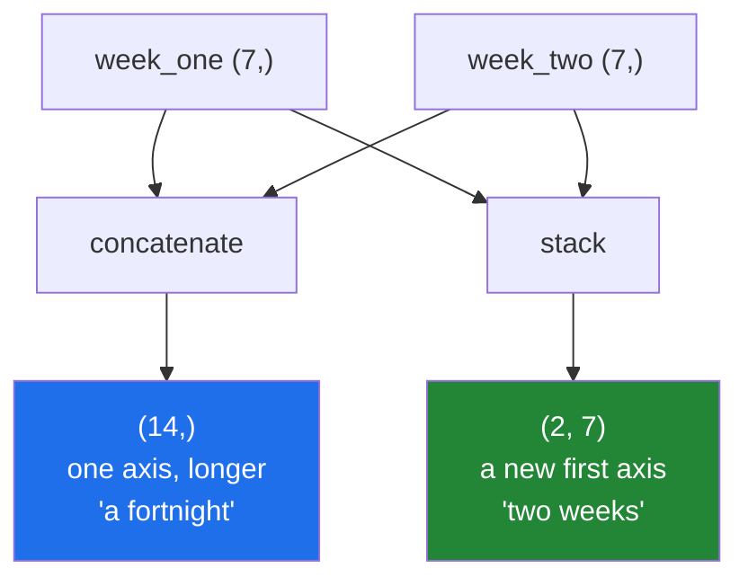

# 4.2 — `stack` against `concatenate` — a new axis, or a longer one

## One-line answer

`concatenate` makes an existing axis longer and `stack` adds a new axis, so two seven-day weeks become
either fourteen days in a row or a `(2, 7)` table — and which you get depends only on which function
you called.

---

## The story

Two weeks of step counts are written on two strips of card, seven boxes each.

Somebody says "put them together", and there are two entirely different things they could mean.

Tape the strips end to end and you have one strip of fourteen boxes. Day eight follows day seven. It
is one run of time.

Lay one strip above the other and you have a small grid, two rows of seven. Now Monday is above
Monday, and you can compare the two weeks by looking down a column.

Both are "putting them together". The first answers "what did the fortnight look like"; the second
answers "how did week two compare with week one". Nobody would confuse them holding two strips of
card, and everybody confuses them holding two arrays.

---

## The idea in plain language

The two functions differ in exactly one way, and everything else follows from it.

**`np.concatenate` joins along an axis that already exists.** The result has the **same number of
axes** as the inputs; one of them is longer. Two `(7,)` arrays give `(14,)`
([4.1](4.1-concatenate.md)).

**`np.stack` creates a new axis.** The result has **one more axis** than the inputs, and the new axis
is as long as the number of arrays you passed. Two `(7,)` arrays give `(2, 7)`.

That difference produces a second, stricter rule. `concatenate` requires every axis except the joining
one to match; `stack` requires **every** input to have exactly the same shape, because they are being
laid on top of each other. Its error says so in six words: `all input arrays must have the same
shape`.

`stack` also takes an `axis=`, which says **where the new axis goes**. `np.stack([a, b])` puts it
first, giving `(2, 7)`: two weeks, seven days. `np.stack([a, b], axis=1)` puts it second, giving
`(7, 2)`: seven days, two values each. Same data, and the second is the shape you want when the two
arrays are two *measurements* of the same seven things rather than two *runs* of seven.

The way to choose is to finish this sentence: *the new array's first axis means…*. If the answer is
"the same thing as before, just more of it", it is `concatenate`. If the answer is a new word — weeks,
sensors, runs, models — it is `stack`.

Both always allocate ([4.1](4.1-concatenate.md)), for the same reason: separate blocks of memory
cannot be described as one.

You will also meet `np.vstack` and `np.hstack`, and it is worth seeing exactly why to avoid them.
`np.vstack` promotes a one-dimensional input to a row and then concatenates, so on `(3,)` inputs it
behaves like `stack` and on `(1, 3)` inputs like `concatenate` — **the same call, two different
meanings, decided by the input's shape.** `np.hstack` has the mirror problem. When a function's
behaviour depends on something the reader cannot see, use the two explicit ones instead.

---

## Why Setu needs it

- **Day 130's batching** stacks per-example arrays into `(batch, features)` — a new axis, because
  "example" is a new word. Getting `concatenate` here silently produces one long run of features.
- **Day 141's multi-head attention** stacks per-head results and then reorders the axes
  ([../03-transpose/3.2-transpose-and-swapaxes.md](../03-transpose/3.2-transpose-and-swapaxes.md)).
- **Day 84's comparison plots** stack several series so they can be reduced along the new axis at once.
- **Day 91's cross-validation** stacks per-fold scores into `(folds, metrics)`, which is exactly the
  "new word" test.
- **Day 155's embedding batches** stack query vectors so one matrix multiplication answers many
  queries.

---

## The mechanism

Two weeks, three answers:

```python
import numpy as np

week_one = np.array([8213, 10442, 6180, 9000, 12007, 9631, 7204])
week_two = np.array([7788, 9120, 11345, 8402, 6733, 14210, 5096])

joined = np.concatenate([week_one, week_two])
stacked = np.stack([week_one, week_two])
columns = np.stack([week_one, week_two], axis=1)

print("inputs        :", week_one.shape, week_two.shape)
print("concatenate   :", joined.shape)
print("stack         :", stacked.shape)
print("stack axis=1  :", columns.shape)
print(stacked)
print("column form   :")
print(columns[:3])
print("both copies   :", np.shares_memory(week_one, joined), np.shares_memory(week_one, stacked))
```

**Line by line:**

- `np.concatenate([week_one, week_two])` — `(14,)`. Fourteen days in a row, and after this there is no
  way to tell where week one ended.
- `np.stack([week_one, week_two])` — `(2, 7)`. **A new first axis of length 2**, because two arrays
  were passed. The weeks are still separable, which is the whole reason to choose it.
- `np.stack([week_one, week_two], axis=1)` — `(7, 2)`. The new axis goes second, so each row is one day
  with its two values. This is the shape for "Monday: 8213 and 7788".
- `columns[:3]` — the first three days, each a pair. Reading down a column of `stacked` and reading a
  row of `columns` give the same numbers.
- `np.shares_memory(...)` — `False` for both. Joining always allocates
  ([4.1](4.1-concatenate.md)).

```text
inputs        : (7,) (7,)
concatenate   : (14,)
stack         : (2, 7)
stack axis=1  : (7, 2)
[[ 8213 10442  6180  9000 12007  9631  7204]
 [ 7788  9120 11345  8402  6733 14210  5096]]
column form   :
[[ 8213  7788]
 [10442  9120]
 [ 6180 11345]]
both copies   : False False
```

The difference, drawn:



On two-dimensional inputs, where the choice matters more:

```python
import numpy as np

a = np.arange(12).reshape(3, 4)
b = np.arange(12, 24).reshape(3, 4)

print("concatenate axis=0 :", np.concatenate([a, b], axis=0).shape)
print("stack       axis=0 :", np.stack([a, b], axis=0).shape)
print("stack       axis=1 :", np.stack([a, b], axis=1).shape)
print("stack       axis=-1:", np.stack([a, b], axis=-1).shape)
```

**Line by line:**

- `concatenate([a, b], axis=0)` — `(6, 4)`. Six rows of four; the two blocks are now indistinguishable.
- `stack([a, b], axis=0)` — `(2, 3, 4)`. **Three axes**, and the first says which block. This is how a
  batch of images becomes a batch: two `(3, 4)` pictures become one `(2, 3, 4)` array.
- `stack([a, b], axis=1)` — `(3, 2, 4)`. The new axis in the middle, which is the layout for "for each
  row, the two versions of it".
- `stack([a, b], axis=-1)` — `(3, 4, 2)`. The new axis last, which is how colour channels are added to
  a grayscale image: three separate `(H, W)` planes stacked into `(H, W, 3)`
  ([../03-transpose/3.2-transpose-and-swapaxes.md](../03-transpose/3.2-transpose-and-swapaxes.md)).
- Every one of these is legal and they mean four different things. **`stack` with an explicit `axis=`
  is how you say which.**

```text
concatenate axis=0 : (6, 4)
stack       axis=0 : (2, 3, 4)
stack       axis=1 : (3, 2, 4)
stack       axis=-1: (3, 4, 2)
```

---

## When it breaks

**Shapes that do not match exactly:**

```text
$ uv run python -c "
import numpy as np
np.stack([np.zeros(7), np.zeros(6)])
"
Traceback (most recent call last):
  File "<string>", line 3, in <module>
ValueError: all input arrays must have the same shape
```

**What it means.** `stack` lays the inputs on top of each other, so a seven and a six have nowhere to
meet. Note how much less informative this is than `concatenate`'s message, which names the axis, the
position and both sizes ([4.1](4.1-concatenate.md)). When you are stacking a list built in a loop,
check the shapes yourself before the call so the failure can name which item is wrong.

**The one that does not raise:**

```text
$ uv run python -c "
import numpy as np
week_one = np.arange(7)
week_two = np.arange(7, 14)
wrong = np.concatenate([week_one, week_two])
right = np.stack([week_one, week_two])
print('concatenate :', wrong.shape, 'mean', wrong.mean())
print('stack       :', right.shape, 'mean per week', right.mean(axis=1))
"
concatenate : (14,) mean 6.5
stack       : (2, 7) mean per week [ 3. 10.]
```

**What it means.** Both produce a valid array and both hold the same fourteen numbers — but the second
one can give a mean **per week**, and the first cannot, because the week boundary was thrown away. If a downstream
step later needs "per week", the information is simply gone and the pipeline has to be re-run.
Concatenating when you meant to stack is not caught by any shape check; it is caught by noticing that
a question you wanted to ask has become unanswerable.

**The convenience functions, which change behaviour with their input:**

```text
$ uv run python -c "
import numpy as np
one_d = np.arange(3)
two_d = np.arange(3).reshape(1, 3)
print('vstack of 1-D :', np.vstack([one_d, one_d]).shape)
print('vstack of 2-D :', np.vstack([two_d, two_d]).shape)
print('hstack of 1-D :', np.hstack([one_d, one_d]).shape)
print('hstack of 2-D :', np.hstack([two_d, two_d]).shape)
"
vstack of 1-D : (2, 3)
vstack of 2-D : (2, 3)
hstack of 1-D : (6,)
hstack of 2-D : (1, 6)
```

**What it means.** `np.vstack` gave `(2, 3)` both times, so it behaved like `stack` for one-dimensional
input and like `concatenate` for two-dimensional. `np.hstack` gave `(6,)` and `(1, 6)`, which are
arrays of different rank. A function whose result depends on a property of the input the reader cannot
see at the call site is a function that hides bugs. In a script, write `np.stack` or
`np.concatenate` with an explicit `axis=`.

**Stacking an empty list:**

```text
$ uv run python -c "
import numpy as np
np.stack([])
"
Traceback (most recent call last):
  File "<string>", line 3, in <module>
ValueError: need at least one array to stack
```

**What it means.** The same empty-collection failure as `concatenate`, and the same fix: guard the
empty case at the call and decide there what shape "nothing" should have. With `stack` that decision is
harder, because the result would need one more axis than the inputs you do not have — which is a good
sign that the empty case belongs to the caller rather than to this line.

---

## In production

**What a professional writes instead of the teaching version.** They stack once, with the axis named,
and check the shapes before the call so the error can be useful:

```python
from __future__ import annotations

import numpy as np


def batch(examples: list[np.ndarray]) -> np.ndarray:
    """Lay a list of equally shaped examples into one array with a leading batch axis.

    ``stack`` and not ``concatenate``: "example" is a new word, so it gets a new axis.
    """
    if not examples:
        raise ValueError("cannot build a batch from no examples")
    first = examples[0].shape
    for position, example in enumerate(examples):
        if example.shape != first:
            raise ValueError(
                f"example {position} has shape {example.shape}, expected {first} "
                f"(every example in a batch must be the same shape)"
            )
    return np.stack(examples, axis=0)


def as_columns(series: list[np.ndarray]) -> np.ndarray:
    """Several equal-length measurements as columns of one (n, k) table."""
    if not series:
        raise ValueError("cannot build a table from no series")
    return np.stack(series, axis=-1)
```

**Line by line:**

- The docstring's second line says *why* `stack`, in the vocabulary of the "new word" test. That
  sentence is what stops the next person from replacing it with `concatenate` because "it also joins
  things".
- `if not examples: raise` — the empty case, with a message about batches rather than about arrays.
- `first = examples[0].shape` then the loop — checking every shape against the first, so the error names
  **which** example is wrong. NumPy's own message would say only `all input arrays must have the same
  shape`, and with a batch of five hundred that is not a useful sentence.
- `np.stack(examples, axis=0)` — `axis=0` written out even though it is the default, because "the batch
  axis is first" is a convention worth stating where the code implements it.
- `as_columns` uses `axis=-1` — the new axis last, so `(n,)` series become an `(n, k)` table with one
  column per series. That is the layout every table-shaped consumer expects, and writing `-1` rather
  than `1` keeps it correct if the series ever gain an axis of their own.
- Neither function uses `vstack` or `hstack`, deliberately.

**What changes at scale.** `stack` allocates the whole result, so a batch of a thousand 4 MB examples
is a 4 GB allocation with all the inputs still alive during the call. Two consequences. Data loaders
allocate the batch buffer once, outside the loop, and copy each example into a slice of it —
`buffer[i] = example` — which avoids both the peak and the per-batch allocation. And when examples
differ in shape, as sequences of different lengths do, stacking is impossible by definition, which is
why padding exists: every example is made the same shape first, and a mask records which parts were
real.

**The failure that only appears with real data.** A metrics collector concatenated each run's score
array instead of stacking it. With one metric per run the shapes were `(1,)`, so concatenating gave a
flat array that looked exactly right, and the dashboard worked. When a second metric was added, the
flat array interleaved the two metrics from every run and the dashboard silently plotted alternating
values as a time series. The fix was one word, and the reason it had survived was that with a single
metric the two functions produce the same thing.

**The review comment a senior engineer leaves.** *"`np.concatenate(per_fold_scores)` flattens the fold
boundary away — you cannot compute a per-fold mean afterwards. Use `np.stack(..., axis=0)` and keep the
`(folds, metrics)` shape."*

**The interview question.** *"When do you use `stack` rather than `concatenate`?"* When the pieces are
separate things that should stay separable: `stack` adds a new axis whose length is the number of
arrays, so two `(7,)` weeks become `(2, 7)`, while `concatenate` makes an existing axis longer and
gives `(14,)`. The test I use is whether the new axis has a name — batch, fold, sensor, head — because
if it does, the boundary matters and flattening it away loses information no later step can recover.
`stack` also demands that every input have exactly the same shape, where `concatenate` only requires
the non-joined axes to match. And I avoid `vstack` and `hstack`, because they behave like one or the
other depending on the rank of their input.

---

## Check yourself

```bash
uv run python -c "
import numpy as np
a = np.arange(4)
b = np.arange(4, 8)
print('concatenate    :', np.concatenate([a, b]).shape)
print('stack          :', np.stack([a, b]).shape)
print('stack axis=1   :', np.stack([a, b], axis=1).shape)
print('per-array mean :', np.stack([a, b]).mean(axis=1))
print('from the flat  : the boundary is gone')
try:
    np.stack([a, np.arange(3)])
except ValueError as exc:
    print('mismatch       :', exc)
"
```

The fourth line asks a question the first line's result cannot answer. Say what that question is.

**Answer out loud, without scrolling up:**

> You have ten arrays, each `(384,)`, one per document. Which function gives you a `(10, 384)` matrix,
> what would the other one give you, and which of the two lets you compute a per-document mean
> afterwards?

---

**Next:** [4.3 — split, and the uneven last piece](4.3-split-and-the-uneven-last-piece.md).
