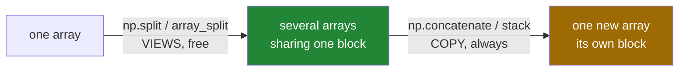

# 4.3 — `split` and `array_split` — cutting an array up, and the uneven last piece

## One-line answer

`np.split` cuts an array into pieces along an axis and **returns views**, so unlike joining it costs
nothing — but it refuses an uneven division, which is what `np.array_split` is for.

---

## The story

A month of step counts on one sheet, and somebody wants to hand one week to each of four people.

They do not copy anything out. They put a ruler across the sheet three times and say "you have that
row, you have that one". Four people are now looking at four parts of one sheet. Nothing was
duplicated.

Then someone asks to split the same sheet between three people. Four rows do not divide into three
equal parts. There are two reasonable responses: refuse and ask what they meant, or hand out two rows,
one row and one row and let everybody see that the parts are uneven.

Both responses are useful, and confusing them is how somebody ends up with an empty share.

---

## The idea in plain language

`np.split(arr, n, axis=0)` cuts an array into `n` pieces along that axis and returns a **list of
arrays**. Each piece is a **view** — a slice, described rather than copied
([Day 21, 1.3](../../../day-21-indexing-and-views/parts/01-one-element/1.3-slicing-one-axis.md)) — so
splitting a four-gigabyte array costs nothing, and writing to a piece writes to the original.

That is the mirror image of joining ([4.1](4.1-concatenate.md)): putting things together always
allocates, taking them apart never does.

There are two ways to say where the cuts go.

**A number of pieces.** `np.split(month, 4)` cuts into four equal pieces. If the axis does not divide
evenly, it **raises**: `array split does not result in an equal division`. That refusal is deliberate —
"four equal parts" of a five-row array is not a thing.

**A list of cut points.** `np.split(month, [2])` cuts before row 2, giving two pieces. With `[2, 5]`
it gives three. The numbers are positions, not sizes, which is the same convention as slice bounds and
worth saying out loud because it is easy to misread. Cut points past the end are allowed and produce
empty pieces rather than an error.

**`np.array_split(arr, n)` is the version that never refuses.** It divides as evenly as it can, making
the earlier pieces one longer than the later ones. Ten values into three gives 4, 3, 3. This is the
right tool whenever `n` comes from the world — a number of workers, a number of chunks — rather than
from the data.

Two related helpers you will see: `np.vsplit` and `np.hsplit`, which are `split` with `axis=0` and
`axis=1` fixed. As with `vstack` ([4.2](4.2-stack-versus-concatenate.md)), the explicit `axis=` is
clearer in a file.

One thing to keep in mind because it follows from the pieces being views: **a piece keeps the whole
original alive** ([Day 21, 5.1](../../../day-21-indexing-and-views/parts/05-in-anger/5.1-the-leak-a-view-causes.md)).
Splitting a large array and keeping one small piece retains all of it.

---

## Why Setu needs it

- **Day 91's cross-validation** splits the row positions into folds, and `array_split` is what handles
  a dataset whose size is not divisible by the number of folds.
- **Day 130's batching** splits a shuffled index array into batches, and the last batch is nearly
  always short — which is exactly the uneven-division case.
- **Day 76's column groups** split a feature matrix into numeric and categorical blocks along `axis=1`.
- **Day 155's chunked index building** splits a large embedding matrix into pieces that fit in memory,
  which is the blocking technique from
  [../01-broadcasting/1.7-the-broadcast-that-ate-the-memory.md](../01-broadcasting/1.7-the-broadcast-that-ate-the-memory.md).
- **Day 19's parallel work** splits an array between workers, and each worker getting a view means
  nothing is copied until the data crosses a process boundary.

---

## The mechanism

Four weeks, cut four ways:

```python
import numpy as np

month = np.arange(28).reshape(4, 7)

weeks = np.split(month, 4, axis=0)
print("np.split into 4  :", [w.shape for w in weeks])
print("each is a view   :", [np.shares_memory(month, w) for w in weeks])

halves = np.split(month, [2], axis=0)
print("split at [2]     :", [h.shape for h in halves])

thirds = np.array_split(month, 3, axis=0)
print("array_split by 3 :", [t.shape for t in thirds])

by_day = np.split(month, 7, axis=1)
print("columns          :", [c.shape for c in by_day], "count", len(by_day))
```

**Line by line:**

- `np.split(month, 4, axis=0)` — four pieces of one row each. Note the shape is `(1, 7)` and not
  `(7,)`: **splitting never removes an axis**, it only makes one shorter.
- `[np.shares_memory(month, w) for w in weeks]` — `True` for every piece. Four arrays, one block of
  memory, nothing allocated.
- `np.split(month, [2], axis=0)` — a **list**, so `2` is a cut point: rows 0–1 and rows 2–3. Writing
  `np.split(month, 2)` without the brackets asks for two equal pieces, which here gives the same answer
  by coincidence and would not on a five-row array.
- `np.array_split(month, 3, axis=0)` — `(2, 7)`, `(1, 7)`, `(1, 7)`. Four does not divide by three, so
  the first piece takes the extra row. `np.split` would have raised.
- `np.split(month, 7, axis=1)` — seven pieces along the days axis, each `(4, 1)`: one day for every
  week. Again the axis is kept, at length 1.

```text
np.split into 4  : [(1, 7), (1, 7), (1, 7), (1, 7)]
each is a view   : [True, True, True, True]
split at [2]     : [(2, 7), (2, 7)]
array_split by 3 : [(2, 7), (1, 7), (1, 7)]
columns          : [(4, 1), (4, 1), (4, 1), (4, 1), (4, 1), (4, 1), (4, 1)] count 7
```

Joining and splitting, side by side:



The two ways of saying where to cut:

```python
import numpy as np

flat = np.arange(10)

print("array_split 3  :", [p.tolist() for p in np.array_split(flat, 3)])
print("array_split 4  :", [p.tolist() for p in np.array_split(flat, 4)])
print("split at points:", [p.tolist() for p in np.split(flat, [3, 7])])
print("past the end   :", [p.tolist() for p in np.split(flat, [3, 99])])
```

**Line by line:**

- `np.array_split(flat, 3)` — ten into three gives 4, 3, 3. **The extra goes to the earlier pieces**,
  which matters if you are labelling them: piece 0 is not interchangeable with piece 2.
- `np.array_split(flat, 4)` — ten into four gives 3, 3, 2, 2. Two pieces get the remainder, again from
  the front.
- `np.split(flat, [3, 7])` — cut **before** position 3 and **before** position 7, giving `[0:3]`,
  `[3:7]` and `[7:]`. Two cut points, three pieces.
- `np.split(flat, [3, 99])` — a cut point past the end is legal and produces an **empty** third piece
  rather than an error. Empty pieces flow through most code silently
  ([Day 21, 3.5](../../../day-21-indexing-and-views/parts/03-boolean-masks/3.5-the-mask-that-matched-nothing.md)),
  which is why a loop over pieces should be prepared for one with no rows.
- `.tolist()` on each piece for readable printing; the pieces themselves are arrays.

```text
array_split 3  : [[0, 1, 2, 3], [4, 5, 6], [7, 8, 9]]
array_split 4  : [[0, 1, 2], [3, 4, 5], [6, 7], [8, 9]]
split at points: [[0, 1, 2], [3, 4, 5, 6], [7, 8, 9]]
past the end   : [[0, 1, 2], [3, 4, 5, 6, 7, 8, 9], []]
```

---

## When it breaks

**The division that does not come out:**

```text
$ uv run python -c "
import numpy as np
np.split(np.arange(28).reshape(4, 7), 3, axis=0)
"
Traceback (most recent call last):
  File "<string>", line 3, in <module>
ValueError: array split does not result in an equal division
```

**What it means.** Four rows into three equal pieces is impossible, and `np.split` refuses rather than
guessing. This is the right behaviour when the division being exact is part of your assumption — a
file of records, a fixed number of channels. When it is not, `np.array_split` is the call, and choosing
between them is a statement about the data rather than a way of avoiding an error.

**The write that reached the original:**

```text
$ uv run python -c "
import numpy as np
month = np.arange(28).reshape(4, 7)
first, rest = np.split(month, [1], axis=0)
first[0, 0] = -1
print('month[0,0] :', month[0, 0])
print('views      :', np.shares_memory(month, first), np.shares_memory(month, rest))
"
month[0,0] : -1
views      : True True
```

**What it means.** The pieces are views, so writing to one writes to the original — and to any other
piece that overlapped it, though these do not. Splitting a training set into folds and then normalising
one fold in place changes the original data for every other fold too. When the pieces are going to be
modified independently, copy them: `[p.copy() for p in np.split(...)]`, paying deliberately
([Day 21, 2.3](../../../day-21-indexing-and-views/parts/02-the-view-trap/2.3-copy-and-when-to-pay.md)).

**The cut points read as sizes:**

```text
$ uv run python -c "
import numpy as np
flat = np.arange(10)
print('as cut points :', [p.tolist() for p in np.split(flat, [2, 4])])
print('wanted sizes 2, 4, 4? no:')
print('sizes         :', [len(p) for p in np.split(flat, [2, 4])])
print('correct points:', [len(p) for p in np.split(flat, [2, 6])])
"
as cut points : [[0, 1], [2, 3], [4, 5, 6, 7, 8, 9]]
wanted sizes 2, 4, 4? no:
sizes         : [2, 2, 6]
correct points: [2, 4, 4]
```

**What it means.** `[2, 4]` means "cut before position 2 and before position 4", giving sizes 2, 2, 6 —
not sizes 2 and 4. To get sizes you accumulate: sizes 2, 4, 4 need cut points 2 and 6. It is the same
running-total conversion you would do by hand, and `np.cumsum(sizes)[:-1]` is the one-line version. No
error is raised, because both readings produce valid pieces.

**The piece that kept the whole array alive:**

```text
$ uv run python -c "
import numpy as np
big = np.zeros((5_000, 1_000))
pieces = np.split(big, 5)
keep = pieces[0]
del big, pieces
print('kept nbytes  :', f'{keep.nbytes:,}')
print('base nbytes  :', f'{keep.base.nbytes:,}')
print('still holding:', f'{keep.base.nbytes:,}', 'bytes for', f'{keep.nbytes:,}', 'of interest')
"
kept nbytes  : 8,000,000
base nbytes  : 40,000,000
still holding: 40,000,000 bytes for 8,000,000 of interest
```

**What it means.** One fifth was kept and all five fifths are still in memory, because a view keeps its
parent alive ([Day 21, 5.1](../../../day-21-indexing-and-views/parts/05-in-anger/5.1-the-leak-a-view-causes.md)).
Splitting a large array to keep one piece is one of the neatest ways to write that bug, because
`np.split` looks like it produced five independent arrays. `.copy()` on the piece you keep releases the
rest.

---

## In production

**What a professional writes instead of the teaching version.** Batching that handles the short last
piece, with the choice of function stated:

```python
from __future__ import annotations

from collections.abc import Iterator

import numpy as np


def batches(rows: np.ndarray, size: int, *, drop_last: bool = False) -> Iterator[np.ndarray]:
    """Yield consecutive batches of ``size`` rows as VIEWS, cheapest first.

    The final batch is short unless ``drop_last``. Yielding views means nothing is
    copied; a consumer that keeps a batch beyond one iteration must copy it.
    """
    if size < 1:
        raise ValueError(f"batch size must be positive, got {size}")
    total = rows.shape[0]
    for start in range(0, total, size):
        stop = start + size
        if drop_last and stop > total:
            return
        yield rows[start:stop]


def into_folds(rows: np.ndarray, folds: int) -> list[np.ndarray]:
    """Divide rows into folds as evenly as possible.

    ``array_split`` and not ``split``: the number of folds comes from the caller and the
    number of rows comes from the data, so they will not divide evenly in general.
    """
    if not 1 <= folds <= rows.shape[0]:
        raise ValueError(f"folds must be between 1 and {rows.shape[0]}, got {folds}")
    return np.array_split(rows, folds, axis=0)
```

**Line by line:**

- `Iterator[np.ndarray]` with `yield` — a generator, so batches are produced one at a time and no list
  of them is held ([Day 11, 2.1](../../../day-11-iterators-and-generators/parts/02-generators/2.1-yield-the-function-that-pauses.md)).
- `rows[start:stop]` — a slice, so each batch is a view and the loop allocates nothing at all. The
  slice clips at the end automatically, which is why the short last batch needs no special case
  ([Day 21, 1.3](../../../day-21-indexing-and-views/parts/01-one-element/1.3-slicing-one-axis.md)).
- `drop_last` — the flag every real data loader has, because a short final batch breaks code that
  assumes a fixed batch size, and because in training it contributes a noisier gradient than the rest.
- **The docstring says VIEWS and says what a consumer must do about it.** A batch held past its
  iteration pins the whole dataset.
- `into_folds` uses `array_split` **and says why in the docstring**: the two numbers come from
  different places and cannot be expected to divide.
- `1 <= folds <= rows.shape[0]` — more folds than rows would produce empty folds, which then produce
  `nan` metrics rather than an error
  ([Day 21, 3.5](../../../day-21-indexing-and-views/parts/03-boolean-masks/3.5-the-mask-that-matched-nothing.md)).

**What changes at scale.** Splitting stays free at every size, which makes it the natural way to
process data too large to work on at once: split, reduce each piece, combine the reductions
([../01-broadcasting/1.7-the-broadcast-that-ate-the-memory.md](../01-broadcasting/1.7-the-broadcast-that-ate-the-memory.md)).
Two cautions come with scale. Pieces are views, so handing them to worker **processes** copies them
across the process boundary anyway
([Day 19, 4.4](../../../day-19-typing-dataclasses-and-concurrency/parts/04-concurrency/4.4-processes.md))
— the free split saves nothing there, and the transfer is the cost to measure. And the uneven last
piece stops being a curiosity: with a million rows and a batch size of 512 there will be a final batch
of 64, and every downstream shape assumption meets it.

**The failure that only appears with real data.** A validation routine used `np.split(scores, folds)`
and had been run with datasets whose size was a multiple of five for a year. A dataset with 1 001 rows
arrived and the run failed with `array split does not result in an equal division` — which was the
lucky outcome. The unlucky version of the same story is a team that switched to `array_split` without
noticing that fold sizes now differed, and then averaged the per-fold scores unweighted, which is
subtly wrong when the folds are not the same size.

**The review comment a senior engineer leaves.** *"`np.split(data, n_workers)` raises whenever the row
count is not divisible — that will happen the first time this runs on real data. Use `array_split`,
and if you average the per-worker results afterwards, weight them by the piece sizes."*

**The interview question.** *"How do you split an array into chunks?"* `np.split(arr, n, axis=)` for
equal pieces, or with a list of cut points for specific boundaries; `np.array_split` when the division
will not be exact, because `split` raises rather than guessing. The important property is that the
pieces are **views**, so splitting costs nothing however large the array — the exact mirror of
concatenation, which always copies. Two consequences worth volunteering: writing to a piece writes to
the original, so folds that will be modified independently must be copied; and keeping one small piece
keeps the entire original alive, which is a memory bug that looks like ordinary code.

---

## Check yourself

```bash
uv run python -c "
import numpy as np
month = np.arange(28).reshape(4, 7)
pieces = np.split(month, 4)
print('shapes   :', [p.shape for p in pieces])
print('views    :', all(np.shares_memory(month, p) for p in pieces))
print('uneven   :', [p.shape for p in np.array_split(month, 3)])
pieces[0][0, 0] = -1
print('month[0,0]:', month[0, 0])
try:
    np.split(month, 3)
except ValueError as exc:
    print('split(3) :', exc)
"
```

Four pieces, no allocation, and one write that reached an array nobody mentioned.

**Answer out loud, without scrolling up:**

> You split a 4 GB array into eight pieces. How much memory did that allocate, what happens to the
> original when you write to piece three, and which function would you use if the row count were not
> divisible by eight?

---

**Next:** [4.4 — `np.newaxis` and `expand_dims`](4.4-newaxis-and-expand-dims.md).
