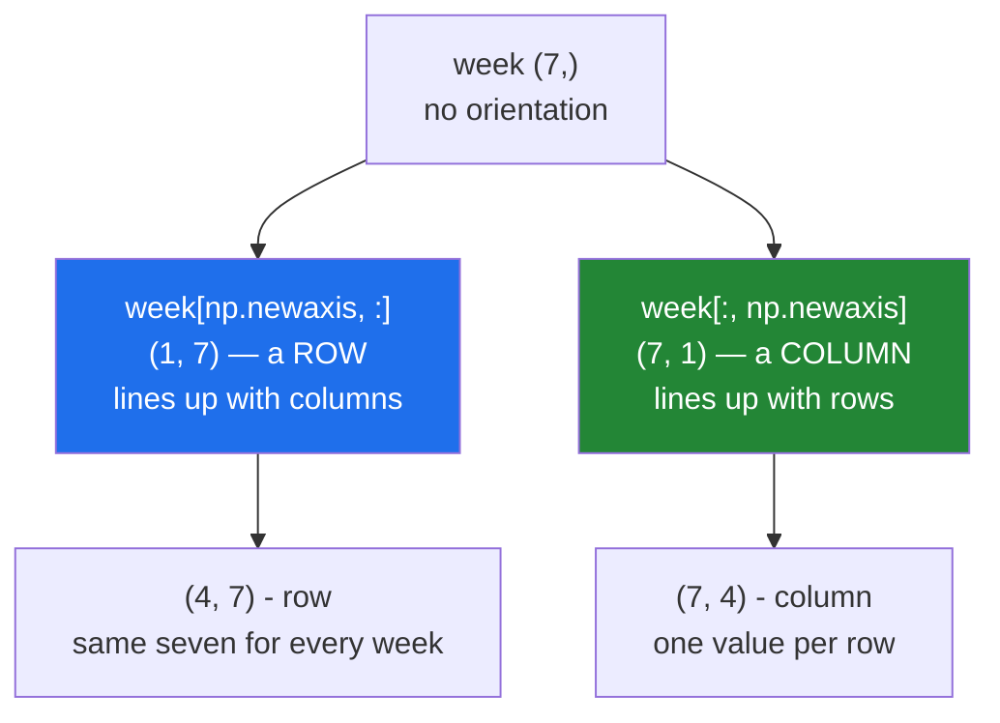

# 4.4 — `np.newaxis` and `expand_dims` — the axis you add to make things line up

## One-line answer

Inserting an axis of length 1 costs nothing and changes everything about how an array broadcasts and
whether it can be joined — `week[:, np.newaxis]` is a column, `week[np.newaxis, :]` is a row, and both
are views of the same seven numbers.

---

## The story

Somebody has seven numbers written along a strip of paper and wants to compare them with a table.

The strip has no orientation of its own. Lay it across the top of the table and each number lines up
with a column. Turn it ninety degrees and lay it down the side, and each number lines up with a row.
The paper did not change; where it is laid decides what it means.

Handing somebody the strip and saying "compare these with the table" is not enough information. They
have to be told which way to lay it, and the answer depends on what the seven numbers are — days of
the week, or weeks of the month.

---

## The idea in plain language

A one-dimensional array has no orientation. `(7,)` is neither a row nor a column; it is seven values.
The distinction only appears when it meets a two-dimensional array, and then it is decided by the
broadcasting rule's left-padding
([1.2](../01-broadcasting/1.2-the-rule-in-three-lines.md)): `(7,)` pads to `(1, 7)`, so it behaves as a
**row**, always.

To make it behave as a column you have to give it the second axis yourself. There are two spellings,
and they produce identical results:

**`week[:, np.newaxis]`** — indexing with `np.newaxis` inserts an axis of length 1 at that position
([Day 21, 1.6](../../../day-21-indexing-and-views/parts/01-one-element/1.6-ellipsis-and-newaxis.md)).
`np.newaxis` **is** `None`, so `week[:, None]` is the same thing and is what you will see most often in
real code.

**`np.expand_dims(week, axis=1)`** — the function form, which says what it is doing in words. It is the
better choice when the axis number is computed or when the reader would otherwise have to count
colons.

Adding an axis is free: it is a view with a new shape and a stride inserted. Nothing is copied, and
writing to the result writes to the original.

Two jobs need this constantly.

**Making a broadcast mean what you intended.** A per-row statistic has to be a column to line up with
its rows, which is what `keepdims=True` produces at the reduction
([1.4](../01-broadcasting/1.4-keepdims-and-the-column.md)) and what `np.newaxis` produces afterwards.

**Making a join legal.** `np.concatenate` requires every input to have the same number of axes
([4.1](4.1-concatenate.md)), so a `(7,)` week cannot be appended to a `(4, 7)` month until it is
`(1, 7)`.

The opposite operation is `squeeze`, which removes axes of length 1. It has one sharp edge worth
learning now: **a bare `arr.squeeze()` removes every length-1 axis**, so a batch of one collapses to
nothing and code that worked on batches of 32 breaks on the single request that arrives on its own.
Always name the axis: `arr.squeeze(axis=1)`.

`np.atleast_2d` exists as well, and promotes a `(7,)` to `(1, 7)`. It is convenient in interactive work
and vague in a file, because it does nothing at all to an input that already has two axes — so the
reader cannot tell from the call what shape came in.

---

## Why Setu needs it

- **Day 155's similarity** compares a query vector against a matrix, which needs the query as a row and
  the norms as a column, in the same expression.
- **Day 76's per-row scaling** divides an `(n, f)` matrix by an `(n,)` array of row totals, and the
  `[:, None]` is what makes it mean "per row".
- **Day 130's single-image inference** wraps one `(H, W, C)` image as a `(1, H, W, C)` batch, because
  the model's first axis is the batch — and then squeezes the result, where the batch-of-one trap
  waits.
- **Day 44's scikit-learn** raises `Expected 2D array, got 1D array instead` and tells you to reshape
  with `-1, 1`, which is this operation in the message.
- **Day 141's masks** are `(1, 1, positions, positions)` so they broadcast across batch and heads —
  three added axes, all of them free.

---

## The mechanism

One strip, two orientations:

```python
import numpy as np

week = np.array([8213, 10442, 6180, 9000, 12007, 9631, 7204])

as_row = week[np.newaxis, :]
as_column = week[:, np.newaxis]

print("week      :", week.shape)
print("row       :", as_row.shape, "expand_dims 0:", np.expand_dims(week, 0).shape)
print("column    :", as_column.shape, "expand_dims -1:", np.expand_dims(week, -1).shape)
print("None is np.newaxis:", np.newaxis is None)
print("all views :", np.shares_memory(week, as_row), np.shares_memory(week, as_column))
print("row  * (2,1) :", (as_row * np.array([[1], [2]])).shape)
print("col  * (2,)  :", (as_column * np.array([1, 2])).shape)
print("squeeze back:", as_column.squeeze(axis=1).shape)
```

**Line by line:**

- `week[np.newaxis, :]` — the new axis goes **first**, giving `(1, 7)`. This is what a bare `(7,)` array
  becomes anyway when it is broadcast, so writing it out changes nothing about behaviour and makes the
  intention visible.
- `week[:, np.newaxis]` — the new axis goes **second**, giving `(7, 1)`. **This is the one that changes
  the meaning**, because it makes the seven values line up with rows rather than columns.
- `np.expand_dims(week, 0)` and `np.expand_dims(week, -1)` — the same two results, said as a function
  call. `-1` means "at the end", which is easier to read than counting colons on a five-axis array.
- `np.newaxis is None` — `True`. They are the same object; `np.newaxis` is a name that exists to make
  the intent readable, because a bare `None` inside brackets tells the reader nothing.
- `np.shares_memory(...)` — both are views. Adding an axis of length 1 changes the description, not the
  data.
- `as_row * np.array([[1], [2]])` — `(1, 7)` against `(2, 1)`: both stretch, giving `(2, 7)`
  ([1.2](../01-broadcasting/1.2-the-rule-in-three-lines.md)).
- `as_column * np.array([1, 2])` — `(7, 1)` against `(2,)`, which pads to `(1, 2)`, giving `(7, 2)`.
  **Seven days each with two values**, which is a completely different result from the line above, from
  the same seven numbers.
- `as_column.squeeze(axis=1)` — back to `(7,)`, with the axis **named** so nothing else can be removed.

```text
week      : (7,)
row       : (1, 7) expand_dims 0: (1, 7)
column    : (7, 1) expand_dims -1: (7, 1)
None is np.newaxis: True
all views : True True
row  * (2,1) : (2, 7)
col  * (2,)  : (7, 2)
squeeze back: (7,)
```

Where the axis goes, and what it does:



The join that needs it:

```python
import numpy as np

month = np.arange(28).reshape(4, 7)
week = np.arange(7)

try:
    np.concatenate([month, week])
except ValueError as exc:
    print("without :", str(exc)[:60])
print("with    :", np.concatenate([month, week[np.newaxis, :]]).shape)
print("atleast_2d:", np.atleast_2d(week).shape)
```

**Line by line:**

- `np.concatenate([month, week])` — refused, because a `(4, 7)` and a `(7,)` have different numbers of
  axes and joining does not broadcast ([4.1](4.1-concatenate.md)).
- `str(exc)[:60]` — truncating the message for display; the full text is in
  [4.1](4.1-concatenate.md)'s failures.
- `week[np.newaxis, :]` — `(1, 7)`, which now has the same rank as `month` and matching size on the
  non-joined axis. The result is `(5, 7)`.
- `np.atleast_2d(week)` — the same `(1, 7)`, obtained by a function that would leave a two-dimensional
  input alone. Convenient, and it hides what the input was.

```text
without : all the input arrays must have same number of dimensions, bu
with    : (5, 7)
atleast_2d: (1, 7)
```

---

## When it breaks

**The squeeze that removed too much:**

```text
$ uv run python -c "
import numpy as np
one = np.zeros((1, 1, 5))
print('squeeze()      :', one.squeeze().shape)
print('squeeze(axis=0):', one.squeeze(axis=0).shape)
try:
    one.squeeze(axis=2)
except ValueError as exc:
    print('squeeze(axis=2):', exc)
batch_of_one = np.zeros((1, 384))
print('batch of one .squeeze():', batch_of_one.squeeze().shape)
batch_of_ten = np.zeros((10, 384))
print('batch of ten .squeeze():', batch_of_ten.squeeze().shape)
"
squeeze()      : (5,)
squeeze(axis=0): (1, 5)
squeeze(axis=2): cannot select an axis to squeeze out which has size not equal to one
batch of one .squeeze(): (384,)
batch of ten .squeeze(): (10, 384)
```

**What it means.** Look at the last two lines. A batch of ten keeps both axes and a batch of **one**
loses the batch axis entirely, so a function that returns `result.squeeze()` gives `(n, 384)` in
testing and `(384,)` on the single-item request that arrives in production. Everything downstream that
indexes `result[0]` then returns a number instead of a row. Naming the axis — `squeeze(axis=1)` —
removes the ambiguity, and the third line shows the reward: naming an axis that is not length 1 raises
instead of silently doing nothing.

**The column that was still a row:**

```text
$ uv run python -c "
import numpy as np
rng = np.random.default_rng(22)
table = rng.random((4, 3))
totals = table.sum(axis=1)
print('totals shape :', totals.shape)
try:
    print(table / totals)
except ValueError as exc:
    print('as is        :', exc)
print('with newaxis :', (table / totals[:, np.newaxis]).shape)
print('rows sum to 1:', np.allclose((table / totals[:, np.newaxis]).sum(axis=1), 1))
"
totals shape : (4,)
as is        : operands could not be broadcast together with shapes (4,3) (4,)
with newaxis : (4, 3)
rows sum to 1: True
```

**What it means.** A per-row total came back as `(4,)`, which broadcasts as a row and fails against
three columns. One `[:, np.newaxis]` makes it a column and the division means "each row divided by its
own total". On a **square** table neither version raises and only one is right, which is why
`keepdims=True` at the reduction is the better habit
([1.4](../01-broadcasting/1.4-keepdims-and-the-column.md)) — it removes the chance to forget.

**The axis added in the wrong place:**

```text
$ uv run python -c "
import numpy as np
week = np.arange(7)
square = np.zeros((7, 7))
row = square + week[np.newaxis, :]
col = square + week[:, np.newaxis]
print('as a row    :', row.shape, 'first row', row[0][:4])
print('as a column :', col.shape, 'first row', col[0][:4])
print('same array  :', np.array_equal(row, col))
"
as a row    : (7, 7) first row [0. 1. 2. 3.]
as a column : (7, 7) first row [0. 0. 0. 0.]
same array  : False
```

**What it means.** Both succeed, both give `(7, 7)`, and they are different arrays. As a row, the seven
values run across every row; as a column, each row gets one value repeated. On a non-square table one
of the two would have raised `operands could not be broadcast together with shapes (4,7) (7,1)`, which
is the lucky case — here the table is square and nothing complains. **Check the output values, not just
the output shape, after adding an axis.**

---

## In production

**What a professional writes instead of the teaching version.** The axis is added where the meaning is
known, and the batch axis is handled explicitly:

```python
from __future__ import annotations

import numpy as np


def as_batch(example: np.ndarray) -> np.ndarray:
    """Present one example as a batch of one, as a view.

    Models take (batch, ...) input, so a single item needs a leading axis. This costs
    nothing and shares memory with ``example``.
    """
    return example[np.newaxis, ...]


def first_result(batched: np.ndarray) -> np.ndarray:
    """Take the single result out of a batch of one, refusing a larger batch.

    ``squeeze(axis=0)`` and not ``squeeze()``: a bare squeeze would also remove any other
    length-1 axis, so a (1, 1, 384) result would come back as (384,).
    """
    if batched.shape[0] != 1:
        raise ValueError(f"expected a batch of one, got {batched.shape[0]}")
    return batched.squeeze(axis=0)
```

**Line by line:**

- `example[np.newaxis, ...]` — the new axis first, and `...` for "every other axis, however many there
  are" ([Day 21, 1.6](../../../day-21-indexing-and-views/parts/01-one-element/1.6-ellipsis-and-newaxis.md)).
  This works for a `(384,)` vector and a `(3, 224, 224)` image without change.
- `np.newaxis` rather than `None` — the same object, and the name says what the position means to a
  reader who has not memorised the convention.
- `if batched.shape[0] != 1: raise` — the guard that makes the function honest. Without it, a batch of
  32 would silently keep its axis and the caller would get something of a different rank than the name
  promises.
- `batched.squeeze(axis=0)` with the axis **named**, and the docstring explaining what the bare version
  would have done. That sentence is the deliverable: it is the trap in the first failure above, written
  where somebody is about to fall into it.
- Both functions return views, so the pair costs nothing in a serving loop that runs thousands of times
  a second.

**What changes at scale.** The operations stay free — an added axis is a description, not data — and
what changes is how much depends on them being right. A serving path handles single requests and a
training path handles large batches, so the batch-of-one case runs constantly in production and rarely
in tests, which is exactly the wrong way round. Two habits follow: never use a bare `squeeze`, and
write at least one test with a batch size of 1. On the broadcasting side, prefer `keepdims=True` at the
reduction to `[:, None]` afterwards, because it keeps the axis decision next to the operation that
removed it and cannot be forgotten three lines later.

**The failure that only appears with real data.** A model server took a list of texts, embedded them,
and returned `embeddings.squeeze()`. Every test used two or more texts. The first production request
with a single text returned a `(384,)` array where the client expected `(1, 384)`, the client indexed
`[0]` and got a single float, and the similarity search compared a number against a matrix — which
broadcast successfully and returned plausible nonsense. One `axis=0` fixed it, and a one-item test
would have caught it before release.

**The review comment a senior engineer leaves.** *"`.squeeze()` with no axis will drop the batch
dimension whenever the batch happens to be one. Use `.squeeze(axis=1)`, or better, keep the axis and
let the caller index it."*

**The interview question.** *"How do you turn a `(n,)` array into a column?"* `arr[:, np.newaxis]` or
`np.expand_dims(arr, 1)` — both insert an axis of length 1 and both are free views, since only the
shape and strides change. It matters because a one-dimensional array has no orientation: broadcasting
right-aligns shapes, so `(n,)` always behaves as a row, and a per-row statistic applied without the
extra axis either raises or, on a square array, silently uses the wrong axis. The counterpart worth
mentioning is `squeeze`: always pass `axis=`, because a bare `squeeze()` removes **every** length-1
axis and will drop the batch dimension on the single-item request that only ever happens in
production.

---

## Check yourself

```bash
uv run python -c "
import numpy as np
week = np.arange(7)
table = np.zeros((4, 7))
print('bare      :', (table + week).shape)
print('as row    :', (table + week[np.newaxis, :]).shape)
try:
    print('as column :', (table + week[:, np.newaxis]).shape)
except ValueError as exc:
    print('as column :', exc)
print('views     :', np.shares_memory(week, week[:, None]))
print('squeeze   :', week[:, None].squeeze(axis=1).shape)
print('newaxis is:', np.newaxis)
"
```

The first two lines agree and the third refuses. Say which of the three you would want for "add the
same seven values to every week", and what would have happened on a square table.

**Answer out loud, without scrolling up:**

> `totals` is `(n,)` and `table` is `(n, m)`. Write the expression that divides each row by its own
> total, say how much memory the added axis costs, and say what a bare `.squeeze()` would do to the
> result when `n` is 1.

---

**Next:** [4.5 — growing an array in a loop](4.5-growing-an-array-in-a-loop.md).
