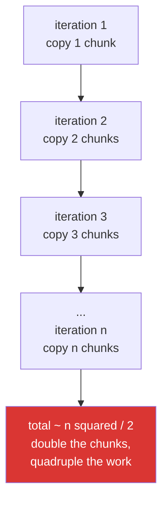

# 4.5 — Growing an array in a loop — the quadratic nobody sees

## One-line answer

`result = np.concatenate([result, chunk])` inside a loop copies everything collected so far on every
iteration, so the total work grows with the **square** of the number of chunks — collect into a list
and join once instead.

---

## The story

Somebody is copying a long recipe from a website onto index cards.

They write the first paragraph on a card. For the second paragraph they take a fresh card, copy the
first paragraph onto it again, and then add the second. For the third they take another fresh card and
copy both previous paragraphs before adding the third.

By paragraph twenty they are spending almost all their time recopying paragraph one. The recipe is not
long and the afternoon is gone.

Nobody does this with index cards, because the waste is visible on the desk in a pile of discarded
cards. In code the discarded cards are invisible: each one is freed the moment the next is made, and
all anybody sees is a loop that gets slower.

---

## The idea in plain language

`np.concatenate` always allocates a new array and copies every input into it
([4.1](4.1-concatenate.md)). That is fine once. In a loop it is the index-card problem.

Joining a growing result with a new chunk on each of `n` iterations copies:

- iteration 1: 1 chunk
- iteration 2: 2 chunks
- iteration 3: 3 chunks
- …
- iteration n: n chunks

The total is 1 + 2 + 3 + … + n, which is about **n² / 2**. Doubling the number of chunks quadruples the
work. This is the **accidental quadratic** you met for lists on
[Day 6, 4.1](../../../day-06-loops/parts/04-loop-cost/4.1-the-accidental-quadratic.md), and NumPy makes
it easier to write because there is no `append` to reach for instead.

Python's own `list.append` does not have this problem: a list over-allocates and grows in place, so
appending n items costs about n operations rather than n². That is why the fix is to collect in a
Python list and convert once.

Three ways to build an array from pieces, in the order to prefer them:

**Collect into a list, then join once.** `pieces.append(chunk)` in the loop, one
`np.concatenate(pieces)` after it. One allocation, one copy of everything, and it works when you do not
know the final size in advance.

**Pre-allocate and fill.** When the final size **is** known, `np.empty((total, width))` once and
`buffer[start:stop] = chunk` in the loop. This is the only version that never has two full copies alive
at the same time, so it has the lowest peak memory.

**Grow the array.** Only when the number of iterations is genuinely small and fixed.

One caution on `np.empty`: it does not initialise, so every position must be written before it is read
([Day 20, 3.2](../../../day-20-arrays-and-dtypes/parts/03-creating/3.2-zeros-ones-full-and-empty.md)).
When the pieces might not fill the buffer exactly, `np.zeros` is the safer default and the difference
is one pass.

---

## Why Setu needs it

- **Day 26's file loading** reads many CSV files and joins them, which is this exact loop.
- **Day 130's epoch collection** accumulates per-batch predictions, thousands of them, and the naive
  version turns a two-minute evaluation into an hour.
- **Day 155's index building** appends each chunk of embeddings to the store — millions of vectors, and
  the quadratic version never finishes.
- **Day 172's eval harness** collects per-example results across a long run.
- **Day 25's phase gate** is a speed target, and this is the single most common way a vectorised
  implementation is slower than the loop it replaced.

---

## The mechanism

Four hundred chunks, three ways:

```python
import time

import numpy as np

rng = np.random.default_rng(22)
chunks = [rng.random((100, 20)) for _ in range(400)]
chunks[0].sum()

start = time.perf_counter()
grown = np.empty((0, 20))
for chunk in chunks:
    grown = np.concatenate([grown, chunk], axis=0)
grow_time = time.perf_counter() - start

start = time.perf_counter()
collected = []
for chunk in chunks:
    collected.append(chunk)
joined = np.concatenate(collected, axis=0)
collect_time = time.perf_counter() - start

start = time.perf_counter()
buffer = np.empty((len(chunks) * 100, 20))
for i, chunk in enumerate(chunks):
    buffer[i * 100 : (i + 1) * 100] = chunk
buffer_time = time.perf_counter() - start

print(f"concatenate in the loop : {grow_time * 1000:8.1f} ms")
print(f"collect then join once  : {collect_time * 1000:8.1f} ms")
print(f"preallocate and fill    : {buffer_time * 1000:8.1f} ms")
print(f"loop is {grow_time / collect_time:.0f}x the one-shot join")
print("same answer             :", np.allclose(grown, joined), np.allclose(grown, buffer))
```

**Line by line:**

- `np.empty((0, 20))` — a starting array with **no rows and twenty columns**. The width has to be right
  from the start or the first join fails, which is a small argument against this approach on its own.
- `grown = np.concatenate([grown, chunk], axis=0)` — the line to recognise on sight. It rebinds `grown`
  to a new array every iteration and the old one is discarded.
- `collected.append(chunk)` — a Python list append, which is close to free and does not touch the array
  data at all. **The chunks are not copied here**; the list holds references.
- `np.concatenate(collected, axis=0)` — one call, after the loop, copying everything exactly once.
- `np.empty((len(chunks) * 100, 20))` — the pre-allocated buffer, which needs the final size known in
  advance.
- `buffer[i * 100 : (i + 1) * 100] = chunk` — writing into a slice of the buffer
  ([Day 21, 3.4](../../../day-21-indexing-and-views/parts/03-boolean-masks/3.4-assigning-through-a-mask.md)).
  No allocation at all inside the loop.
- `np.allclose(...)` twice — proof that all three built the same array, so the timings compare methods
  rather than results.

```text
concatenate in the loop :    396.7 ms
collect then join once  :      2.6 ms
preallocate and fill    :      3.3 ms
loop is 152x the one-shot join
same answer             : True True
```

A hundred and fifty times, for four hundred chunks of two thousand values. Note also that
pre-allocating is *not* faster than collecting here — it wins on peak memory, not on time — which is
worth knowing before optimising the wrong thing.

Why the loop grows the way it does:



The shape of the curve, measured:

```python
import time

import numpy as np

rng = np.random.default_rng(22)

print(f"{'chunks':>8} {'grow (ms)':>12} {'join once (ms)':>16} {'ratio':>8}")
for n in (100, 200, 400, 800):
    chunks = [rng.random((50, 10)) for _ in range(n)]
    start = time.perf_counter()
    grown = np.empty((0, 10))
    for chunk in chunks:
        grown = np.concatenate([grown, chunk], axis=0)
    grow = time.perf_counter() - start
    start = time.perf_counter()
    joined = np.concatenate(chunks, axis=0)
    once = time.perf_counter() - start
    print(f"{n:>8} {grow * 1000:12.1f} {once * 1000:16.2f} {grow / once:7.0f}x")
```

**Line by line:**

- The same experiment at four sizes, so the **growth** is visible rather than a single number.
- `np.empty((0, 10))` fresh inside each iteration of the outer loop, so each size starts from nothing.
- `np.concatenate(chunks, axis=0)` — the one-shot version, whose time grows **linearly**: roughly
  doubling as the data doubles.
- `grow / once` — the ratio, which itself grows. That is the signature of a quadratic: not just slower,
  but slower by a factor that increases with the input.

```text
  chunks    grow (ms)   join once (ms)    ratio
     100          0.8             0.03      26x
     200         12.2             0.15      84x
     400         65.1             0.47     138x
     800        289.3             1.26     230x
```

Read the ratio column downwards. Twenty-six, eighty-four, a hundred and thirty-eight, two hundred and
thirty. **The penalty is not a constant you can budget for** — it grows with your data, so a loop that
was acceptable in testing is unusable in production by a factor nobody predicted.

---

## When it breaks

**The version that has no error at all:**

The quadratic loop always produces the correct array. There is no exception, no warning and no wrong
value — only time. That is what makes it hard to catch in review: the code reads perfectly, and the
only symptom is a job that used to finish.

**The one that eventually does fail:**

```text
$ uv run python -c "
import numpy as np
import tracemalloc
rng = np.random.default_rng(22)
chunks = [rng.random((1_000, 100)) for _ in range(30)]
tracemalloc.start()
grown = np.empty((0, 100))
for chunk in chunks:
    grown = np.concatenate([grown, chunk], axis=0)
peak_grow = tracemalloc.get_traced_memory()[1]
tracemalloc.stop()
tracemalloc.start()
joined = np.concatenate(chunks, axis=0)
peak_join = tracemalloc.get_traced_memory()[1]
tracemalloc.stop()
print('final array   :', f'{grown.nbytes:,}', 'bytes')
print('peak, growing :', f'{peak_grow:,}', 'bytes')
print('peak, one join:', f'{peak_join:,}', 'bytes')
"
final array   : 24,000,000 bytes
peak, growing : 47,200,464 bytes
peak, one join: 24,000,432 bytes
```

**What it means.** During each join both the old result and the new one exist, so the peak is nearly
twice the final size — and it is reached on the last iteration, when the array is largest. The one-shot
version peaks at the size of the result. On a job whose output nearly fills memory, that factor of two
is the difference between finishing and being killed.

**The `np.append` that looks like `list.append` and is not:**

```text
$ uv run python -c "
import numpy as np
values = np.array([1, 2, 3])
grown = np.append(values, 4)
print('np.append result :', grown)
print('original changed :', values)
print('is a new array   :', not np.shares_memory(values, grown))
"
np.append result : [1 2 3 4]
original changed : [1 2 3]
is a new array   : True
```

**What it means.** `np.append` is not the array version of `list.append`. It does not modify anything
in place; it allocates a whole new array and copies everything, every call. The name is the trap — a
loop of `np.append` is the quadratic in its most convincing disguise, because the reader's instinct
from Python lists says it is cheap. **There is no in-place append for a NumPy array**, because an
array's size is fixed at allocation.

**The list comprehension that hides it:**

```text
$ uv run python -c "
import functools
import numpy as np
chunks = [np.ones((10, 3)) for _ in range(5)]
one_line = functools.reduce(lambda a, b: np.concatenate([a, b]), chunks)
print('shape :', one_line.shape)
print('this is the loop, written as one line, with the same cost')
"
shape : (50, 3)
this is the loop, written as one line, with the same cost
```

**What it means.** `functools.reduce` with `concatenate` is the same quadratic wearing a functional
hat: it joins the accumulated result with each new piece in turn. Being one line makes it look
efficient and changes nothing about the work
([Day 11, 3.4](../../../day-11-iterators-and-generators/parts/03-lambda-and-map/3.4-reduce-any-and-all.md)).
`np.concatenate(chunks)` does the whole job in one call.

---

## In production

**What a professional writes instead of the teaching version.** They collect, and pre-allocate when the
size is known:

```python
from __future__ import annotations

from collections.abc import Iterable

import numpy as np


def collect(chunks: Iterable[np.ndarray], *, width: int) -> np.ndarray:
    """Join an unknown number of (n, width) chunks with exactly one allocation."""
    pieces = [chunk for chunk in chunks if chunk.size]
    if not pieces:
        return np.empty((0, width))
    for position, piece in enumerate(pieces):
        if piece.ndim != 2 or piece.shape[1] != width:
            raise ValueError(f"chunk {position}: expected (n, {width}), got shape {piece.shape}")
    return np.concatenate(pieces, axis=0)


def fill(chunks: list[np.ndarray], *, rows: int, width: int) -> np.ndarray:
    """Write chunks into one pre-allocated buffer. Lowest peak memory of the three.

    Use when the total row count is known in advance - a file header, a database count.
    """
    buffer = np.zeros((rows, width))
    at = 0
    for chunk in chunks:
        end = at + chunk.shape[0]
        if end > rows:
            raise ValueError(f"chunks hold more than the {rows} rows promised")
        buffer[at:end] = chunk
        at = end
    if at != rows:
        raise ValueError(f"chunks filled {at} of {rows} rows")
    return buffer
```

**Line by line:**

- `Iterable[np.ndarray]` — accepts a generator as well as a list, so the caller can stream chunks from
  a file ([Day 11, 2.3](../../../day-11-iterators-and-generators/parts/02-generators/2.3-streaming-a-file.md)).
  The comprehension on the next line consumes it once.
- `if chunk.size` — empty chunks dropped, because an empty piece contributes nothing and an empty piece
  with the **wrong width** would otherwise raise from inside `concatenate` for a confusing reason.
- `if not pieces: return np.empty((0, width))` — the empty case with the right shape and width, so the
  caller can go on using `.shape[1]` ([4.1](4.1-concatenate.md)).
- The width check loop, before joining, so the error names the chunk number rather than saying "the
  array at index 3".
- `np.concatenate(pieces, axis=0)` — **one call, outside any loop.** That is the whole point of the
  function.
- `fill` uses `np.zeros` rather than `np.empty` — if the chunks do not fill the buffer, unwritten rows
  are zeros rather than whatever was in memory, and the check below catches the mistake anyway. The
  extra pass is worth it for a function whose failure mode would otherwise be silent garbage.
- `if at != rows: raise` — the promise was `rows` and the chunks delivered `at`. Checking is one
  comparison and catches a truncated input file at the boundary rather than in the model.

**What changes at scale.** The quadratic stops being a slowdown and becomes an outage: at ten thousand
chunks it is not a hundred times slower than the one-shot join, it is thousands of times slower, and
the job simply never finishes. Two further habits appear at scale. When the data does not fit in
memory at all, the collect-then-join step is replaced by writing each chunk to disk and memory-mapping
the result, so there is never a moment when everything is in RAM. And when chunks arrive over time —
a stream, a queue — the structure becomes a list of blocks that is joined lazily, or a pre-allocated
buffer with a write cursor, which is exactly the `fill` function above.

**The failure that only appears with real data.** An ingestion job read files from a directory and
concatenated each file's rows onto a running array. With the twelve files in the test fixture it took
under a second. In production the directory held nine thousand files, and the job ran for six hours
before being killed — with the first file's rows having been copied nine thousand times. The change
was three lines: a list, an append, and one concatenate after the loop. Runtime went to eleven
seconds.

**The review comment a senior engineer leaves.** *"`out = np.concatenate([out, chunk])` in a loop is
quadratic — each iteration copies everything read so far. Append to a list and concatenate once after
the loop. Same for `np.append`, which despite the name is not an in-place operation."*

**The interview question.** *"What is wrong with building a NumPy array by concatenating in a loop?"*
Every `concatenate` allocates a new array and copies both inputs, so joining a growing result n times
copies 1 + 2 + … + n chunks — about n² / 2 — where the same data joined once costs n. Doubling the
input quadruples the work, so it looks fine in tests and does not finish in production. The fix is to
append to a Python list, which grows in amortised constant time, and make one `np.concatenate` call at
the end; or, when the final size is known, allocate the buffer once and assign into slices, which also
halves the peak memory because the old and new arrays never coexist. The related trap worth
mentioning is `np.append`, which reads like `list.append` and is a full copy every call.

---

## Check yourself

```bash
uv run python -c "
import time
import numpy as np
rng = np.random.default_rng(22)
chunks = [rng.random((50, 4)) for _ in range(300)]
start = time.perf_counter()
grown = np.empty((0, 4))
for c in chunks:
    grown = np.concatenate([grown, c])
slow = time.perf_counter() - start
start = time.perf_counter()
fast = np.concatenate(chunks)
quick = time.perf_counter() - start
print(f'in the loop : {slow * 1000:7.1f} ms')
print(f'one call    : {quick * 1000:7.2f} ms')
print(f'ratio       : {slow / quick:7.0f}x')
print('same answer :', np.allclose(grown, fast))
"
```

Then change 300 to 600 and run it again. The ratio should roughly double; say why.

**Answer out loud, without scrolling up:**

> A loop concatenates 1 000 chunks onto a growing array. How many chunk-copies does it perform in
> total, what would the one-shot version cost, and what is the third option when you know the final
> size?

---

**Next:** [5.1 — mean-centring the month, in the module](../05-the-module/5.1-mean-centring-the-month.md).
