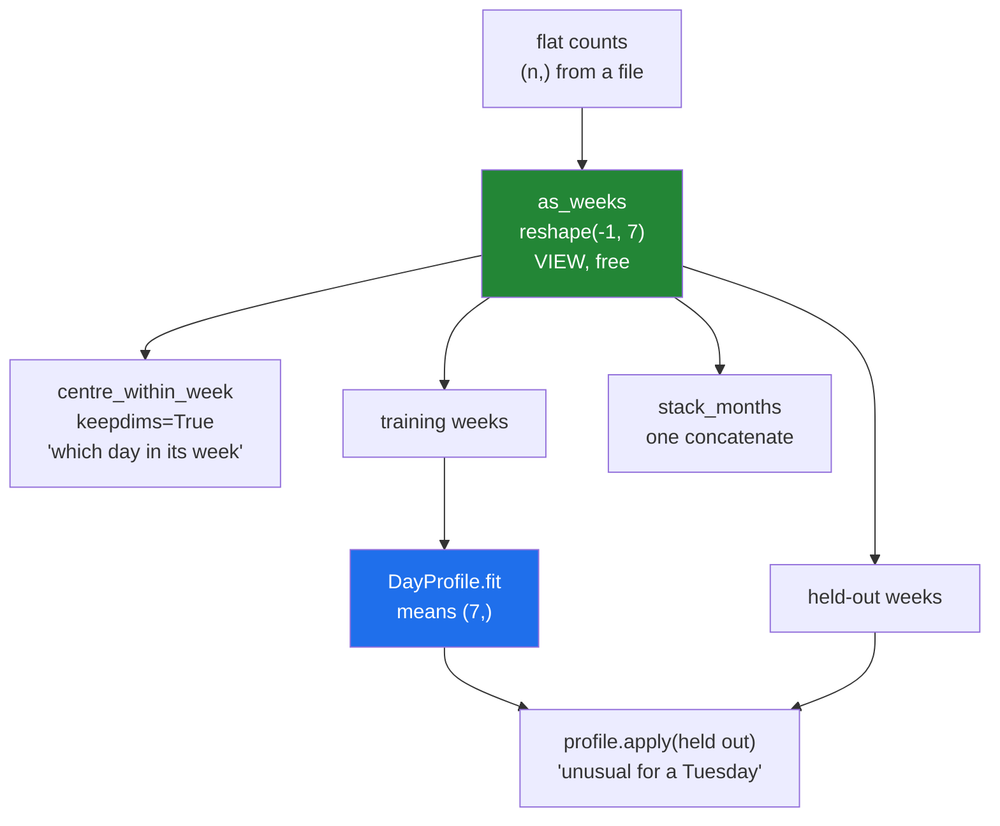

# 5.1 — `src/setu/shape.py` — reshape at the boundary, centre without leaking

## One-line answer

Today's module does three jobs that the rest of the curriculum will keep asking for: read a flat run of
numbers as weeks, centre it against a mean that was learned from the right rows, and join several
months in one allocation.

---

## The story

A physiotherapist asks somebody for their walking data from the last few months.

What arrives is a text file: one number per line, thousands of them. Nothing in the file says where
one week ends. The person reading it knows the numbers are daily and that a week is seven days, and
that is enough — they rule the page into rows of seven.

Then comes the question the file cannot answer on its own: *was this Tuesday unusual?* Unusual compared
with what? Compared with the person's other Tuesdays, which means working out a typical Tuesday first.

And there is a trap the physiotherapist knows about and the file does not. If they work out "a typical
Tuesday" using every Tuesday including this one, then this Tuesday helped to define the standard it is
being judged against. With four Tuesdays that is a quarter of the answer. The typical day has to come
from the weeks that are not being judged.

---

## The idea in plain language

The module is `src/setu/shape.py`, and it has three parts, each one a day's idea made permanent.

**Reading the flat file as weeks** is `reshape(-1, 7)` at the boundary
([2.2](../02-reshape/2.2-minus-one.md)). Seven is a fact about weeks; the number of weeks is a fact
about this file. It costs nothing and it returns a **view**
([2.1](../02-reshape/2.1-same-block-new-shape.md)), which the docstring has to say out loud.

**Centring** comes in two kinds, and the module offers both because they answer different questions.

*Within a week* — subtract each week's own mean from its days — answers "which day was that week's
big one". It needs `keepdims=True`, because a per-row statistic has to be a column
([1.4](../01-broadcasting/1.4-keepdims-and-the-column.md)).

*Against a day profile* — subtract the typical Monday from every Monday — answers "was that Tuesday
unusual". It needs the means to be **learned once and applied elsewhere**, which is why it is an object
with `fit` and `apply` rather than a function
([1.3](../01-broadcasting/1.3-a-row-against-a-table.md)). That split is Principle 8's leakage rule made
structural: with one function that does both, there is no way to write the correct version.

**Joining months** is one `np.concatenate` outside any loop
([4.5](../04-joining-and-splitting/4.5-growing-an-array-in-a-loop.md)), with the empty case returning
the right shape rather than raising ([4.1](../04-joining-and-splitting/4.1-concatenate.md)).

One decision worth naming. The module works in `float64` rather than integers, because centring
produces fractions and `np.nanmean` needs a float type to express a missing value at all
([Day 20, 2.3](../../../day-20-arrays-and-dtypes/parts/02-dtypes/2.3-floats-nan-and-precision.md)).
Day 21's integer sentinel was right for selection, and it is wrong here, which is a normal thing for a
representation to be: it depends on the operation.

---

## Why Setu needs it

- **Day 25's phase gate** is a vectorised statistics module beating a loop by fifty times, and this is
  the shape half of it — Day 23 supplies the statistics.
- **Day 44's `StandardScaler`** has exactly this `fit`/`apply` split, for exactly this reason. Writing
  it by hand once is why the library version stops being magic (Principle 2).
- **Day 76's feature pipeline** imports `DayProfile`'s shape of thinking: learn on training rows, apply
  to everything.
- **Day 91's leakage check** asks you to point at the line where the mean was computed, and the answer
  has to be a method that only ever saw the training weeks.
- **Day 130's loaders** reshape a flat buffer into batches on every step, which is `as_weeks` with
  different names.

---

## The mechanism

The module, in three pieces. First the boundary:

```python
"""Read a flat run of daily counts as weeks, and centre it without leaking."""

from __future__ import annotations

from dataclasses import dataclass

import numpy as np

DAYS_PER_WEEK = 7


def as_weeks(counts: np.ndarray) -> np.ndarray:
    """Read a flat run of daily counts as (weeks, 7). Returns a VIEW of ``counts``."""
    if counts.ndim != 1:
        raise ValueError(f"expected a flat run of counts, got shape {counts.shape}")
    leftover = counts.size % DAYS_PER_WEEK
    if leftover:
        raise ValueError(
            f"{counts.size} counts is {leftover} short of a whole number of weeks; "
            f"trim or pad before reshaping"
        )
    return counts.reshape(-1, DAYS_PER_WEEK)


def centre_within_week(weeks: np.ndarray) -> np.ndarray:
    """Subtract each week's own mean from its days. Returns a new array."""
    if weeks.ndim != 2:
        raise ValueError(f"expected (weeks, days), got shape {weeks.shape}")
    return weeks - weeks.mean(axis=1, keepdims=True)
```

**Line by line:**

- `DAYS_PER_WEEK = 7` — named once. The 7 appears in a check, in a reshape and in an error message, and
  a literal repeated three times is a literal that will eventually disagree with itself.
- `counts.ndim != 1` — checked first, because `reshape` only looks at the total count and would happily
  re-cut an already-two-dimensional array into nonsense
  ([2.1](../02-reshape/2.1-same-block-new-shape.md)).
- `counts.size % DAYS_PER_WEEK` — the divisibility check, so the message can say **how many are left
  over**. NumPy's own message would be `cannot reshape array of size 30 into shape (7)`, which mentions
  neither weeks nor what to do.
- `counts.reshape(-1, DAYS_PER_WEEK)` — the `-1` on the axis that varies
  ([2.2](../02-reshape/2.2-minus-one.md)), so the function works for four weeks or four hundred.
- **The docstring says VIEW in capitals.** The caller cannot see it from the signature, and a write to
  the result reaches the buffer the counts came from
  ([Day 21, 5.2](../../../day-21-indexing-and-views/parts/05-in-anger/5.2-view-or-copy-on-purpose.md)).
- `weeks.mean(axis=1, keepdims=True)` — `axis=1` collapses the days, `keepdims=True` keeps the axis as
  a column so the subtraction lines up ([1.4](../01-broadcasting/1.4-keepdims-and-the-column.md)).
  Without it this raises on a real month and silently uses the wrong axis on a seven-week one.
- `weeks - ...` rather than `weeks -= ...` — a new array, so the caller's data is untouched
  ([Day 21, 2.4](../../../day-21-indexing-and-views/parts/02-the-view-trap/2.4-the-function-that-changed-its-input.md)).

Then the part that must not leak:

```python
@dataclass(frozen=True, slots=True)
class DayProfile:
    """The per-day-of-week means learned from one set of weeks."""

    means: np.ndarray

    @classmethod
    def fit(cls, training_weeks: np.ndarray) -> "DayProfile":
        """Learn one mean per day of the week, from these weeks only."""
        if training_weeks.ndim != 2 or training_weeks.shape[1] != DAYS_PER_WEEK:
            raise ValueError(f"expected (weeks, {DAYS_PER_WEEK}), got shape {training_weeks.shape}")
        if training_weeks.shape[0] < 2:
            raise ValueError("need at least two weeks to learn a per-day mean")
        return cls(means=np.nanmean(training_weeks, axis=0))

    def apply(self, weeks: np.ndarray) -> np.ndarray:
        """Subtract the learned per-day means. The input is never modified."""
        if weeks.ndim != 2 or weeks.shape[1] != self.means.shape[0]:
            raise ValueError(f"expected (weeks, {self.means.shape[0]}), got shape {weeks.shape}")
        return weeks - self.means
```

**Line by line:**

- **Two methods rather than one function** — `fit` learns, `apply` uses. A single
  `centre_by_day(weeks)` would compute the means from whatever it was handed, which is the leak
  ([1.3](../01-broadcasting/1.3-a-row-against-a-table.md)) with no way to write it correctly.
- `@classmethod fit` — an alternative constructor
  ([Day 15, 1.2](../../../day-15-constructors-and-dunders/parts/01-three-kinds-of-method/1.2-from-message-the-second-door-in.md)),
  so a `DayProfile` cannot exist without having been fitted to something.
- `frozen=True` — the means cannot be replaced after fitting, so a later stage cannot quietly refit on
  the held-out weeks.
- `slots=True` — cheap, and it turns a mistyped attribute into an error rather than a new attribute
  ([Day 19, 2.3](../../../day-19-typing-dataclasses-and-concurrency/parts/02-dataclasses/2.3-frozen-slots-kw-only.md)).
- `training_weeks.shape[0] < 2` — one week would give means equal to itself and centred values of
  exactly zero, which looks like it worked.
- `np.nanmean(..., axis=0)` — **collapse the weeks, keep the days**, giving `(7,)`. That shape
  broadcasts against `(weeks, 7)` with no reshape at all, which is the asymmetry from
  [1.2](../01-broadcasting/1.2-the-rule-in-three-lines.md). `nanmean` rather than `mean` so one missing
  day does not turn a whole column into `nan`.
- `weeks.shape[1] != self.means.shape[0]` — comparing against the **learned** width rather than against
  `DAYS_PER_WEEK`, so the object stays correct if it is ever fitted to something other than weeks.
- `weeks - self.means` — the broadcast, one line. Everything above it exists so that this line is
  always right.

And the join:

```python
def stack_months(months: list[np.ndarray]) -> np.ndarray:
    """Join several (weeks, 7) blocks into one table, with a single allocation."""
    blocks = [month for month in months if month.size]
    if not blocks:
        return np.empty((0, DAYS_PER_WEEK))
    for position, block in enumerate(blocks):
        if block.ndim != 2 or block.shape[1] != DAYS_PER_WEEK:
            raise ValueError(
                f"month {position}: expected (weeks, {DAYS_PER_WEEK}), got {block.shape}"
            )
    return np.concatenate(blocks, axis=0)
```

**Line by line:**

- `[month for month in months if month.size]` — empty blocks dropped, because an empty month with the
  wrong width would otherwise raise from inside `concatenate` for a confusing reason.
- `np.empty((0, DAYS_PER_WEEK))` for the empty case — the right **shape**, so the caller can still read
  `.shape[1]` or join the result again ([4.1](../04-joining-and-splitting/4.1-concatenate.md)).
- The check loop before the join, so the message names **which** month is wrong rather than "the array
  at index 3".
- `np.concatenate(blocks, axis=0)` — **one call, outside any loop.** The quadratic version is the
  single most common way this function gets written badly
  ([4.5](../04-joining-and-splitting/4.5-growing-an-array-in-a-loop.md)).

Running it on the month:

```python
import numpy as np

from setu.shape import DayProfile, as_weeks, centre_within_week, stack_months

flat = np.array(
    [
        8213,
        10442,
        6180,
        9000,
        12007,
        9631,
        7204,
        7788,
        9120,
        11345,
        8402,
        6733,
        14210,
        5096,
        9004,
        8765,
        7621,
        10188,
        9950,
        8317,
        11002,
        6540,
        12488,
        9873,
        7106,
        8899,
        10540,
        9218,
    ],
    dtype=np.float64,
)

month = as_weeks(flat)
print("as_weeks shape :", month.shape)
print("is a view      :", np.shares_memory(flat, month))

within = centre_within_week(month)
print("row means now  :", np.round(within.mean(axis=1), 10))
print("input untouched:", np.array_equal(month, as_weeks(flat)))

profile = DayProfile.fit(month[:3])
print("means shape    :", profile.means.shape)
print("learned means  :", profile.means.round(1))
held_out = profile.apply(month[3:])
print("held out       :", held_out.round(1))

print("stacked        :", stack_months([month, month]).shape)
print("empty          :", stack_months([]).shape)
```

**Line by line:**

- `dtype=np.float64` stated on the input — the module's arithmetic is in floats, and stating it at the
  source means no promotion happens silently later
  ([Day 20, 2.5](../../../day-20-arrays-and-dtypes/parts/02-dtypes/2.5-nep-50-and-the-python-number.md)).
- `np.shares_memory(flat, month)` — `True`, printed so the docstring's claim is visible rather than
  asserted.
- `np.round(within.mean(axis=1), 10)` — every row mean is zero to ten places, which is what centring
  within a week promised. The `-0.` values are floating-point noise, and a test uses `np.allclose`
  rather than `==`.
- `DayProfile.fit(month[:3])` — **the first three weeks only.** Week four is held out, so the profile
  has never seen it.
- `profile.apply(month[3:])` — the held-out week, judged against a standard it did not help to set.
  Wednesday of week four is 3 045 steps above a typical Wednesday, and that number is honest.
- `stack_months([month, month])` — eight weeks in one allocation.

```text
as_weeks shape : (4, 7)
is a view      : True
row means now  : [-0.  0. -0. -0.]
input untouched: True
means shape    : (7,)
learned means  : [ 8335.   9442.3  8382.   9196.7  9563.3 10719.3  7767.3]
held out       : [[-1795.   3045.7  1491.  -2090.7  -664.3  -179.3  1450.7]]
stacked        : (8, 7)
empty          : (0, 7)
```

How the module fits together:



---

## When it breaks

**A file that is not a whole number of weeks:**

```text
$ uv run python -c "
import numpy as np
from setu.shape import as_weeks
as_weeks(np.arange(30.0))
"
Traceback (most recent call last):
  File "<string>", line 4, in <module>
ValueError: 30 counts is 2 short of a whole number of weeks; trim or pad before reshaping
```

**What it means.** Thirty daily counts is four weeks and two days. The message says how far off it is,
which distinguishes a truncated download (short by a lot) from a file with a stray header line (short
by one). Note what the module does **not** do: it does not pad, because padded days are invented data
and the caller is the only one who can decide whether to drop them or wait for the rest of the week.

**The centring that used the wrong rows:**

```text
$ uv run python -c "
import numpy as np
from setu.shape import DayProfile, as_weeks
rng = np.random.default_rng(22)
month = as_weeks(rng.random(28) * 10_000)
leaky = DayProfile.fit(month)
honest = DayProfile.fit(month[:3])
print('leaky means  :', leaky.means.round(1))
print('honest means :', honest.means.round(1))
print('difference   :', (leaky.means - honest.means).round(1))
"
leaky means  : [4017.8 2786.2 3942.4 5078.5 3228.4 8070.4 5238. ]
honest means : [4732.6 3492.5 3549.3 4546.1 2928.5 7932.8 5235.8]
difference   : [-714.8 -706.3  393.1  532.4  299.9  137.6    2.3]
```

**What it means.** Both calls run, both return a `(7,)` array of plausible means, and only one of them
may be used to judge week four. Fitting on all four weeks lets week four influence the standard it is
compared against, which makes it look more typical than it is — Principle 8's leak, with no error and
no warning. The module cannot prevent you from passing everything to `fit`; what it can do is make the
two calls look different, so a reviewer can see which one was written.

**The apply that met the wrong width:**

```text
$ uv run python -c "
import numpy as np
from setu.shape import DayProfile, as_weeks
month = as_weeks(np.arange(28.0))
profile = DayProfile.fit(month[:3])
profile.apply(np.arange(20.0).reshape(4, 5))
"
Traceback (most recent call last):
  File "<string>", line 6, in <module>
ValueError: expected (weeks, 7), got shape (4, 5)
```

**What it means.** Our message, not NumPy's. Without the check the failure would be
`operands could not be broadcast together with shapes (4,5) (7,)`, which names neither the profile nor
the weeks and leaves the reader to work out which array is which
([1.6](../01-broadcasting/1.6-reading-the-broadcast-error.md)).

**The view that let a write through:**

```text
$ uv run python -c "
import numpy as np
from setu.shape import as_weeks
flat = np.arange(28.0)
month = as_weeks(flat)
month[0, 0] = -1
print('flat[0] :', flat[0])
print('this is why the docstring says VIEW')
"
flat[0] : -1.0
this is why the docstring says VIEW
```

**What it means.** `as_weeks` returns a view, so writing to the weeks writes to the flat array — and
if that flat array came from `np.load(..., mmap_mode="r+")`, it writes to a file. This is the
behaviour the docstring promises, and it is still worth demonstrating once, because "returns a view"
is a sentence that people read and do not act on.

---

## In production

**What a professional writes instead of the teaching version.** They save the fitted profile alongside
whatever used it, because a centring applied with the wrong means is silently wrong rather than
broken:

```python
from __future__ import annotations

import json
from pathlib import Path

import numpy as np

from setu.shape import DAYS_PER_WEEK, DayProfile


def save_profile(profile: DayProfile, path: Path) -> None:
    """Write a fitted profile to disk with enough context to be checked on load."""
    path.write_text(
        json.dumps(
            {
                "days_per_week": DAYS_PER_WEEK,
                "means": [float(m) for m in profile.means],
            }
        ),
        encoding="utf-8",
    )


def load_profile(path: Path) -> DayProfile:
    """Read a profile back, refusing one that does not match this module's shape."""
    record = json.loads(path.read_text(encoding="utf-8"))
    if record["days_per_week"] != DAYS_PER_WEEK:
        raise ValueError(
            f"profile was fitted for {record['days_per_week']} days per week, "
            f"this module uses {DAYS_PER_WEEK}"
        )
    return DayProfile(means=np.asarray(record["means"], dtype=np.float64))
```

**Line by line:**

- The profile is saved with `days_per_week` alongside the means, so the file carries the assumption it
  was made under. A file of seven numbers with no context is indistinguishable from a file of seven
  numbers made for something else.
- `[float(m) for m in profile.means]` — plain Python floats, because `json.dumps` cannot serialise
  `np.float64` ([Day 19, 3.4](../../../day-19-typing-dataclasses-and-concurrency/parts/03-pydantic/3.4-model-dump-and-the-boundary.md)).
- `encoding="utf-8"` on both calls — stated rather than inherited from the platform
  ([Day 16, 2.2](../../../day-16-files-and-context-managers/parts/02-reading-and-writing/2.2-encoding.md)).
- The check on load, with a message naming both numbers. **A profile that silently does not match is
  worse than a missing one**, because the pipeline runs and the results are wrong by an amount nobody
  can see.
- `np.asarray(..., dtype=np.float64)` — the dtype stated at the boundary, so a profile written by an
  older version with integer means comes back as floats.
- The pair is deliberately plain JSON rather than a NumPy `.npy` file: seven numbers are small,
  and a text file can be read by a human during an incident.

**What changes at scale.** Three things. `as_weeks` stays free however large the file, which is why a
loader can present a gigabyte of readings as batches without copying — but the view keeps the whole
buffer alive, so a small slice kept for a long time pins everything
([Day 21, 5.1](../../../day-21-indexing-and-views/parts/05-in-anger/5.1-the-leak-a-view-causes.md)).
`apply` allocates a full-sized result, so at scale it becomes `np.subtract(weeks, means, out=weeks)`
inside a function that owns its input ([1.1](../01-broadcasting/1.1-adding-one-number-to-every-day.md)).
And the means themselves are computed in `float64` even when the data is `float32`, because a mean over
tens of millions of values accumulated in single precision drifts measurably
([Day 23, 2.6](../../../day-23-ufuncs-and-statistics/parts/02-statistics/2.6-float-summation-and-the-drift.md)).

**The failure that only appears with real data.** A monitoring job centred each day's readings against
a profile it recomputed from that same day. On a normal day the profile and the data agreed and every
reading looked typical, which is exactly what the centring says when the standard comes from the data
being judged. On the day a sensor failed, every reading was low, the profile was low too, and the
centred values were all near zero — the anomaly detector reported nothing at all. The fix was to fit
the profile on a fixed historical window and store it, which is why `fit` and `apply` are separate
here.

**The review comment a senior engineer leaves.** *"`centre(data)` computes the mean from `data`, so
when you call it on the test set you are centring the test set against itself. Split it into `fit` and
`apply`, store the fitted means with the model, and add a test that applying a profile to unseen rows
does not change the profile."*

**The interview question.** *"How would you write a function that mean-centres a table?"* I would write
two: one that learns the means from a set of training rows and one that applies them, because with a
single function there is no way to centre held-out data against the training statistics — and doing it
the other way leaks. The learning is `np.nanmean(rows, axis=0)`, which gives one value per column and
broadcasts back against the rows with no reshape; if it were per-row I would need `keepdims=True`,
because `(n,)` right-aligns against the last axis and would either raise or, on a square table,
silently centre the wrong way. And the fitted means get saved with the model, because a model applied
with the wrong centring is quietly wrong rather than obviously broken.

---

## Check yourself

```bash
uv run python -c "
import numpy as np
from setu.shape import DayProfile, as_weeks, centre_within_week
flat = np.arange(28.0)
month = as_weeks(flat)
print('view          :', np.shares_memory(flat, month))
print('row means zero:', np.allclose(centre_within_week(month).mean(axis=1), 0))
profile = DayProfile.fit(month[:3])
print('means shape   :', profile.means.shape)
print('apply shape   :', profile.apply(month[3:]).shape)
print('input intact  :', np.array_equal(month, as_weeks(flat)))
"
```

Every line is one of today's ideas, asserted. The last one is the promise that `apply` returns a new
array.

**Answer out loud, without scrolling up:**

> Why is `DayProfile` an object with `fit` and `apply` rather than one function, and which of the two
> centring functions needs `keepdims=True`?

---

**Next:** [5.2 — the test that can go red](5.2-the-test-that-can-go-red.md).
