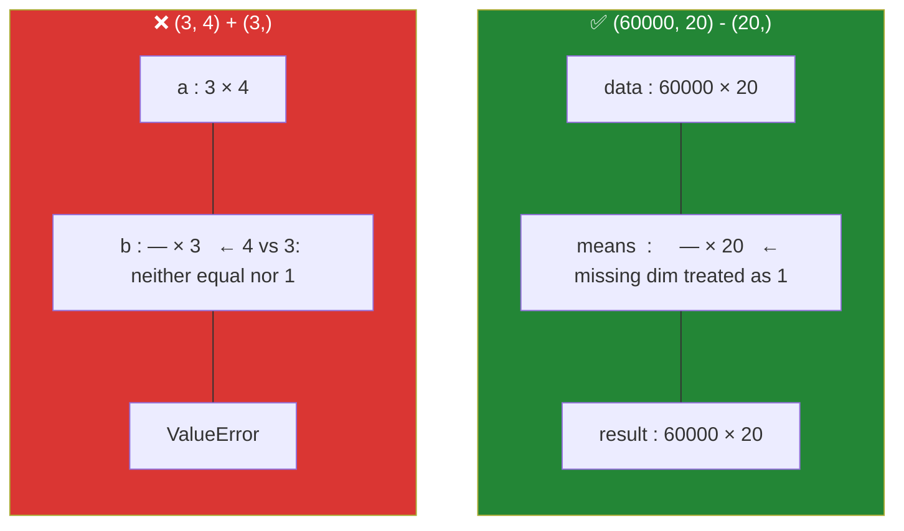

# Day 22 — Broadcasting and array manipulation

**Phase 3 · Module 3** · IDs: **NP-04** (broadcasting, iterating), **NP-05** (reshape, stack, split, transpose)

> **Yesterday:** views, copies, and the leakage they enable.
> **Today:** the rule that makes "add a vector to every row of a matrix" a single expression — and
> the reshaping vocabulary you will use on Day 130 to turn a flat buffer into a 28×28 image and on
> Day 143 to split attention into heads.
> **Tomorrow:** universal functions and `argsort` top-k.

```bash
./m start 22 && ./m scaffold 22
```

**Time:** 100 minutes. **Request budget:** 0 model calls.

---

## §1 The story

You have 60 000 rows and 20 columns, and you want to subtract each column's mean from every value —
the centring step that appears in Day 80's scaler, Day 86's PCA, and Day 133's batch normalisation.

Written with loops it is 1.2 million iterations. Written with broadcasting it is:

```python
centred = data - data.mean(axis=0)
```

`data` is `(60000, 20)`. `data.mean(axis=0)` is `(20,)`. Different shapes, and NumPy still knows what
you meant — because of **one rule, applied right to left**:

> Compare the shapes from the **trailing** dimension backwards. At each position the two sizes must
> be **equal**, or one of them must be **1**, or one array must have **run out of dimensions**
> (missing dimensions count as 1). Any size-1 dimension is then stretched — *virtually*, with no
> memory allocated — to match.



The second example is the one that bites: `(3, 4) + (3,)` fails, even though "three rows and three
values" sounds compatible, because alignment is from the **right**. The fix is to say which axis you
meant: `a + b[:, None]` makes `b` shape `(3, 1)`, which broadcasts across columns.

**No memory is allocated for the stretch.** NumPy sets the stride of the broadcast dimension to zero,
so the same value is read repeatedly. That is why broadcasting is fast as well as short — and why the
alternative, `np.tile`, is usually the wrong answer.

The second half of today is **reshaping**: the vocabulary for rearranging the same buffer into
different shapes. `reshape`, `ravel`, `transpose`, `stack`, `concatenate`, `split`. All cheap, most of
them views, and all of them things you will type without thinking by Day 143.

---

## §2 Setup — run this

```bash
mkdir -p days/day-22/lab
touch days/day-22/lab/broadcasting.py
```

`src/setu/arrays.py` grows today. No new packages.

---

## §3 NP-04 — broadcasting

`days/day-22/lab/broadcasting.py`:

```python
"""NP-04 / NP-05: the broadcasting rule, and the reshaping vocabulary."""

from __future__ import annotations

import numpy as np


def the_rule() -> None:
    a = np.arange(12).reshape(3, 4)

    print(f"\n{a.shape=}")
    print(f"{(a + 10).shape=}                <- scalar: broadcasts to everything")
    print(f"{(a + np.arange(4)).shape=}      <- (3,4) + (4,): trailing dims match")

    try:
        a + np.arange(3)
    except ValueError as exc:
        print(f"\n  (3,4) + (3,) -> {exc}")
        print("  aligned from the RIGHT: 4 vs 3. Neither equal nor 1.")

    col = np.arange(3)[:, None]
    print(f"\n{col.shape=}   <- [:, None] adds a trailing axis of size 1")
    print(f"{(a + col).shape=}   <- (3,4) + (3,1): the 1 stretches across columns")

    print(f"\n{np.broadcast_shapes((3, 1), (1, 4))=}   <- ask before you compute")
    print(f"{np.broadcast_shapes((60000, 20), (20,))=}")


def why_it_is_free() -> None:
    a = np.arange(3)[:, None]
    b = np.broadcast_to(a, (3, 4))
    print(f"\n{b=}")
    print(f"{b.strides=}   <- a zero stride: the same value re-read, not copied")
    print(f"{b.base is not None=}   <- it is a VIEW (Day 21)")
    try:
        b[0, 0] = 99
    except ValueError as exc:
        print(f"  and read-only: {exc}")


def real_uses() -> None:
    rng = np.random.default_rng(0)
    data = rng.normal(loc=[10, 100, 1000], scale=[1, 10, 100], size=(1000, 3))

    print(f"\n{data.mean(axis=0).round(1)=}   <- axis=0: collapse ROWS, one value per column")
    print(f"{data.mean(axis=1).shape=}       <- axis=1: collapse COLUMNS, one per row")
    print(f"{data.mean().round(1)=}          <- no axis: everything")

    centred = data - data.mean(axis=0)
    print(f"\n{centred.mean(axis=0).round(6)=}   <- centring, one line")

    standardised = (data - data.mean(axis=0)) / data.std(axis=0, ddof=1)
    print(f"{standardised.std(axis=0, ddof=1).round(6)=}   <- Day 80's scaler, in one line")

    print(f"\n{data.mean(axis=0, keepdims=True).shape=}   <- keepdims keeps it 2-D for broadcasting")


def pairwise_distances() -> None:
    points = np.array([[0.0, 0.0], [3.0, 4.0], [1.0, 1.0]])
    diff = points[:, None, :] - points[None, :, :]
    print(f"\n{points.shape=} -> {diff.shape=}   <- (3,1,2) - (1,3,2) = (3,3,2)")
    distances = np.sqrt((diff**2).sum(axis=-1))
    print(f"{distances.round(2)=}")
    print("  ^ every pair, no loop. Day 103's KNN and Day 155's similarity search are this.")

    n, d = 5_000, 128
    bytes_needed = n * n * d * 8
    print(f"\n  BUT at n={n:,}, d={d}: the (n,n,d) intermediate is {bytes_needed / 1024**3:.1f} GiB")
    print("  Broadcasting allocates the RESULT even when the stretch is free. Chunk it (Day 159).")


def iterating() -> None:
    a = np.arange(6).reshape(2, 3)
    print(f"\nrows:   {[row for row in a]}")
    print(f"flat:   {list(a.flat)}   <- .flat iterates every element")
    print(f"indexed: {[(idx, v) for idx, v in np.ndenumerate(a)]}")
    print("\n  All three are SLOW. They exist for debugging, not for computing.")
```

**Line by line:**

- `a + np.arange(4)` — shapes `(3, 4)` and `(4,)`. Aligned right: 4 vs 4 ✓, then `a` has a 3 and `b`
  has nothing, so the missing dimension counts as 1 ✓. Result `(3, 4)`.
- `a + np.arange(3)` — 4 vs 3. Neither equal nor 1. `ValueError`, with a message naming both shapes.
  **Read that message**; it tells you exactly which position failed.
- `np.arange(3)[:, None]` — `None` (also spelled `np.newaxis`) inserts an axis of size 1. `[:, None]`
  turns `(3,)` into `(3, 1)`. This is the single most common broadcasting fix and it is worth
  memorising as an idiom: **`[:, None]` means "make this a column".**
- `np.broadcast_shapes(...)` — asks what the result shape *would* be, without computing anything.
  Use it when you are unsure instead of running a 60-second computation to find out.
- `np.broadcast_to(a, (3, 4)).strides` includes a **zero**. A zero stride means "do not move in memory
  when this index advances" — the same value is read repeatedly. That is the mechanism, and it is why
  the result is a read-only view: writing to it would write to several logical positions at once.
- `axis=0` collapses **rows**, giving one value per column. `axis=1` collapses **columns**. The
  reliable way to remember it: *the axis you name is the one that disappears.* Getting this backwards
  is the most common NumPy mistake in data work, and on Day 80 it silently standardises across the
  wrong dimension.
- `data.std(axis=0, ddof=1)` — `ddof=1` again (Day 20). Be consistent or your Day 80 scaler and your
  Day 60 statistics disagree.
- `keepdims=True` — keeps the collapsed axis as size 1, so the result broadcasts back against the
  original without needing `[:, None]`. For `axis=1` reductions it is nearly always what you want.
- `points[:, None, :] - points[None, :, :]` — shapes `(3, 1, 2)` and `(1, 3, 2)` broadcast to
  `(3, 3, 2)`: every point minus every point. **This is the whole of pairwise distance**, and it is
  Day 103's KNN and Day 155's similarity search in one expression.
- The GiB warning — **broadcasting makes the stretch free but not the result.** A `(5000, 5000, 128)`
  intermediate is 25 GiB and your machine will swap or die. Day 159 chunks it. Knowing the failure
  mode now is why you will not spend an evening on it then.
- `.flat`, `np.ndenumerate`, iterating rows — all present, all slow. **They exist for debugging.** If
  you are iterating an array to compute something, there is a vectorised way; find it.

---

## §4 NP-05 — reshaping vocabulary

Add to the same file:

```python
def reshaping() -> None:
    a = np.arange(12)
    print(f"\n{a.reshape(3, 4)=}")
    print(f"{a.reshape(3, -1).shape=}   <- -1 means 'work it out'; only ONE -1 allowed")
    print(f"{a.reshape(3, 4).base is a=}   <- a view when the memory allows it")

    try:
        a.reshape(5, 3)
    except ValueError as exc:
        print(f"  {exc}   <- the element count must match exactly")

    m = a.reshape(3, 4)
    print(f"\n{m.ravel().shape=}     <- flatten; a VIEW when possible")
    print(f"{m.flatten().base is None=}   <- flatten ALWAYS copies")
    print(f"{m.T.shape=} {m.T.base is not None=}   <- transpose is a view")
    print(f"{np.shares_memory(m, m.T)=}")


def adding_and_removing_axes() -> None:
    a = np.arange(3)
    print(f"\n{a.shape=}")
    print(f"{a[:, None].shape=}      <- column")
    print(f"{a[None, :].shape=}      <- row")
    print(f"{np.expand_dims(a, 0).shape=}   <- the explicit spelling")
    print(f"{a[:, None].squeeze().shape=}   <- squeeze removes every size-1 axis")


def joining_and_splitting() -> None:
    a, b = np.array([[1, 2]]), np.array([[3, 4]])
    print(f"\n{np.concatenate([a, b], axis=0).shape=}   <- along existing axis 0")
    print(f"{np.concatenate([a, b], axis=1).shape=}   <- along existing axis 1")
    print(f"{np.stack([a, b], axis=0).shape=}         <- stack CREATES a new axis")
    print(f"{np.vstack([a, b]).shape=} {np.hstack([a, b]).shape=}")

    big = np.arange(12).reshape(6, 2)
    parts = np.split(big, 3, axis=0)
    print(f"\n{[p.shape for p in parts]=}")
    print(f"{[p.shape for p in np.array_split(np.arange(7), 3)]=}   <- array_split allows ragged")


def the_attention_reshape() -> None:
    batch, seq, model_dim, heads = 2, 5, 12, 3
    x = np.arange(batch * seq * model_dim).reshape(batch, seq, model_dim)
    print(f"\n{x.shape=}   <- (batch, sequence, model_dim)")

    split = x.reshape(batch, seq, heads, model_dim // heads)
    print(f"{split.shape=}   <- split model_dim into heads")

    per_head = split.transpose(0, 2, 1, 3)
    print(f"{per_head.shape=}   <- (batch, heads, sequence, head_dim)")
    print("  ^ this exact pair of lines is Day 143's multi-head attention.")

    back = per_head.transpose(0, 2, 1, 3).reshape(batch, seq, model_dim)
    print(f"{np.array_equal(back, x)=}   <- and it round-trips")


if __name__ == "__main__":
    the_rule()
    why_it_is_free()
    real_uses()
    pairwise_distances()
    iterating()
    reshaping()
    adding_and_removing_axes()
    joining_and_splitting()
    the_attention_reshape()
```

**Line by line:**

- `reshape(3, -1)` — `-1` means "infer this from the total". Exactly one `-1` is allowed. Use it so a
  shape change in one place does not require edits in three.
- `reshape` returns a **view when the memory layout allows it** and a copy otherwise (for example
  after a transpose, when the data is no longer contiguous). Do not assume either; check with
  `np.shares_memory` if it matters.
- `ravel()` versus `flatten()` — **`ravel` is a view when it can be, `flatten` always copies.** Day 4's
  trap, in NumPy form: `m.ravel()[0] = 99` can modify `m`. Use `ravel` for reading, `flatten` when you
  need independence.
- `m.T` — a view with the strides swapped. Transposing a 1 GB matrix costs nothing.
- `np.concatenate` joins along an **existing** axis; `np.stack` **creates a new one**. `concatenate`
  on two `(1, 2)` arrays with `axis=0` gives `(2, 2)`; `stack` gives `(2, 1, 2)`. Choosing the wrong
  one produces an array that is technically valid and semantically wrong, which is the worst kind.
- `np.split` requires equal parts and raises otherwise; `np.array_split` allows ragged ones. Pick
  deliberately — a raise is often what you want.
- `the_attention_reshape` — reshape to split the model dimension into heads, then `transpose(0, 2, 1, 3)`
  to bring heads forward. **This is verbatim what you will write on Day 143.** Note that the round-trip
  works because transpose is its own inverse for a swapped pair, and that the final `reshape` needs the
  transpose undone first, or the values interleave wrongly. Reshaping non-contiguous data is where
  silent tensor bugs live.

---

## §5 Build brief

Extend `src/setu/arrays.py`:

```python
def standardise(matrix, *, ddof: int = 1) -> tuple[np.ndarray, np.ndarray, np.ndarray]:
    """TODO(me): column-wise standardise. Return (standardised, means, stds).

    - broadcasting only; no Python loop over columns
    - returns the means and stds so Day 80 can apply TRAIN statistics to TEST data
      (fitting a scaler on the test set is leakage - Principle 8)
    - a column with zero variance must return zeros for that column, not inf or nan
    - must NOT modify the input
    """
    raise NotImplementedError


def apply_standardisation(matrix, means, stds) -> np.ndarray:
    """TODO(me): apply PRE-COMPUTED means and stds. This is the test-set path.

    Raise DataError if the shapes do not line up with the matrix's columns.
    """
    raise NotImplementedError


def pairwise_distances(points, *, chunk: int = 1024) -> np.ndarray:
    """TODO(me): (n, n) Euclidean distances, computed in row chunks.

    - the naive (n, n, d) broadcast is O(n^2 * d) memory; chunk the ROWS so peak
      memory is O(chunk * n * d)
    - the diagonal must be exactly 0.0, not 1e-8 (floating error) - clamp negatives
      to zero before the sqrt
    - must be symmetric
    """
    raise NotImplementedError


def batch(matrix, size: int) -> list[np.ndarray]:
    """TODO(me): split rows into consecutive batches of at most `size`.

    Use np.array_split logic, not a Python loop building lists.
    Raise DataError if size < 1. An empty matrix returns [].
    """
    raise NotImplementedError
```

- `standardise` returning its statistics is Principle 8 built into the signature. You *cannot*
  accidentally fit on the test set if the only way to transform it is `apply_standardisation`.
- The zero-variance guard is real: a constant column divided by a zero std gives `inf` or `nan` and
  poisons every downstream model. Day 83's `ColumnTransformer` will do this for you; doing it by hand
  once means you know what it is protecting you from.
- `pairwise_distances` chunking is the §3 GiB warning, handled.

---

## §6 The eval that must be able to fail

Add to `tests/test_arrays.py`:

```python
from setu.arrays import apply_standardisation, batch, pairwise_distances, standardise


def test_standardise_produces_zero_mean_unit_std():
    rng = np.random.default_rng(0)
    data = rng.normal(loc=[5, 50], scale=[1, 20], size=(500, 2))
    out, means, stds = standardise(data)
    assert np.allclose(out.mean(axis=0), 0, atol=1e-10)
    assert np.allclose(out.std(axis=0, ddof=1), 1, atol=1e-10)
    assert means.shape == (2,) and stds.shape == (2,)


def test_standardise_does_not_modify_the_input():
    data = np.arange(20, dtype=float).reshape(10, 2)
    before = data.copy()
    standardise(data)
    assert np.array_equal(data, before)


def test_standardise_handles_a_constant_column():
    data = np.column_stack([np.arange(10, dtype=float), np.full(10, 7.0)])
    out, _, _ = standardise(data)
    assert np.all(np.isfinite(out)), "a zero-variance column produced inf or nan"
    assert np.allclose(out[:, 1], 0.0)


def test_apply_uses_train_statistics_not_test_statistics():
    train = np.arange(20, dtype=float).reshape(10, 2)
    test = train * 100
    _, means, stds = standardise(train)
    out = apply_standardisation(test, means, stds)
    assert not np.allclose(out.mean(axis=0), 0), (
        "the test set was re-centred on its own mean - that is leakage"
    )


def test_apply_rejects_a_shape_mismatch():
    with pytest.raises(DataError):
        apply_standardisation(np.zeros((5, 3)), np.zeros(2), np.ones(2))


def test_pairwise_distances_are_correct():
    points = np.array([[0.0, 0.0], [3.0, 4.0]])
    out = pairwise_distances(points)
    assert out.shape == (2, 2)
    assert out[0, 1] == pytest.approx(5.0)


def test_pairwise_diagonal_is_exactly_zero():
    rng = np.random.default_rng(1)
    out = pairwise_distances(rng.normal(size=(50, 8)))
    assert np.array_equal(np.diag(out), np.zeros(50)), "floating error left a non-zero diagonal"


def test_pairwise_is_symmetric():
    rng = np.random.default_rng(2)
    out = pairwise_distances(rng.normal(size=(40, 5)))
    assert np.allclose(out, out.T)


def test_pairwise_chunking_matches_the_unchunked_result():
    rng = np.random.default_rng(3)
    points = rng.normal(size=(120, 6))
    assert np.allclose(pairwise_distances(points, chunk=7), pairwise_distances(points, chunk=1000))


def test_batch_sizes_and_completeness():
    data = np.arange(20, dtype=float).reshape(10, 2)
    parts = batch(data, 3)
    assert [len(p) for p in parts] == [3, 3, 3, 1]
    assert np.array_equal(np.concatenate(parts), data)


def test_batch_empty_returns_nothing():
    assert batch(np.zeros((0, 3)), 5) == []


def test_batch_rejects_zero_size():
    with pytest.raises(DataError):
        batch(np.zeros((4, 2)), 0)
```

**Line by line:**

- `test_apply_uses_train_statistics_not_test_statistics` — **the day's real assessment, and it is a
  Principle 8 test.** `test` is `train * 100`, so if `apply_standardisation` correctly uses the *train*
  means and stds, the result is nowhere near zero-mean. An implementation that recomputes statistics
  from its input produces a perfectly centred result and fails here, with a message naming leakage.
  This is the single most valuable test in Phase 3.
- `test_standardise_handles_a_constant_column` — `np.all(np.isfinite(...))`. Division by a zero std
  gives `inf` or `nan`; both are caught.
- `test_pairwise_diagonal_is_exactly_zero` — `np.array_equal`, not `allclose`. A point's distance to
  itself is `sqrt(a - a)`, and floating error can make that a tiny **negative** number whose square
  root is `nan`. Clamping negatives to zero before the `sqrt` is the fix, and this test insists on it.
- `test_pairwise_chunking_matches_the_unchunked_result` — chunk sizes 7 and 1000 over 120 rows.
  A chunking bug at the boundary (dropping the last partial chunk, or double-counting) shows up here
  and nowhere else.
- `test_batch_sizes_and_completeness` — `[3, 3, 3, 1]` for 10 rows. The ragged final batch, again
  (Days 8 and 11). It is the third time; that is deliberate.

```bash
uv run python -m pytest tests/test_arrays.py -v
```

---

## §7 Request budget

| Resource | Spent today |
|---|---|
| LLM calls | **0** |

---

## §8 Traps

- **Aligning shapes from the left.** Broadcasting works right to left. `(3,4) + (3,)` fails.
- **Forgetting `[:, None]`** when you meant "one value per row".
- **`axis=0` versus `axis=1` backwards.** The axis you name is the one that disappears.
- **Assuming broadcasting is free in memory.** The stretch is; the **result** is not. `(n, n, d)` kills.
- **`ravel` when you needed `flatten`.** `ravel` can be a view; writing to it changes the parent.
- **`concatenate` when you meant `stack`.** One joins along an axis, the other creates one.
- **`reshape` after a transpose.** Non-contiguous data may copy, and values can interleave wrongly.
- **A negative under `sqrt`** from floating error. Clamp to zero first.
- **Dividing by a zero standard deviation.** A constant column poisons everything downstream.
- **Iterating an array to compute.** `.flat` and `ndenumerate` are for debugging.

---

## §9 Verify before you code

Written **2026-08-21**:

- <https://numpy.org/doc/stable/user/basics.broadcasting.html> — the rule, with the shape tables.
- <https://numpy.org/doc/stable/reference/generated/numpy.broadcast_shapes.html> — check before you compute.
- <https://numpy.org/doc/stable/reference/generated/numpy.reshape.html> — when it returns a view.
- <https://numpy.org/doc/stable/reference/generated/numpy.ravel.html> — versus `flatten`.

---

## §10 Say it in an interview

> "Broadcasting aligns shapes from the right — equal, or one, or missing — and stretches the size-one
> dimensions with a zero stride, so no memory is allocated for the stretch. That's why centring 60 000
> rows is one expression rather than a loop. The thing people miss is that the *result* still has to
> be allocated: a naive pairwise-distance broadcast is n² × d, which at five thousand points is tens of
> gigabytes, so mine chunks the rows. And my standardise function returns the means and standard
> deviations rather than just the transformed data, because the only way to transform a test set is to
> pass in the training statistics — there's a test that makes the test data a hundred times larger and
> asserts the result is *not* zero-centred, which fails if someone refits on the test set."

---

## §11 Done when

Tick [`CHECKLIST.md`](CHECKLIST.md), then `./m check && ./m done 22`.
