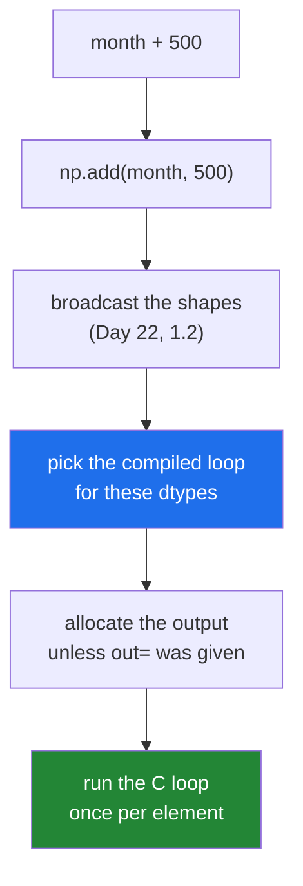

# 1.1 — A ufunc — one operation, applied to every element

## One-line answer

Every arithmetic operator on an array is really a **universal function** — a `ufunc` — a single object
that knows how to apply one operation to every element of any-shaped input, in compiled code, with
broadcasting built in.

---

## The story

A market stall keeps its prices on a board, and the owner decides everything goes up by ten pence.

They do not think about it as forty separate decisions. They think "everything up by ten pence", walk
along the board, and change each number. One instruction, forty applications.

If somebody asked "what did you do?", the honest answer is the instruction, not the forty changes. And
if the board had four hundred prices, the instruction would be exactly the same length.

The instruction is a thing in its own right — it can be written on a note, handed to somebody else,
applied to a different board. That is worth noticing, because it is exactly what NumPy does: the
instruction is an object, and applying it to a board is a separate act.

---

## The idea in plain language

On Day 22 you wrote `month + 500` and it added 500 to every element
([Day 22, 1.1](../../../day-22-broadcasting-and-shape/parts/01-broadcasting/1.1-adding-one-number-to-every-day.md)).
The `+` was doing something with a name.

A **universal function**, always shortened to **ufunc**, is an object that applies one operation
elementwise to arrays. `np.add` is a ufunc. So are `np.subtract`, `np.multiply`, `np.sqrt`,
`np.greater`, `np.isnan` and about a hundred others. When you write `a + b`, NumPy calls `np.add(a, b)`
— the operator is a spelling, and the ufunc is the thing.

Four properties come with being a ufunc, and every one of them is something you have already relied
on.

**It is elementwise.** One input element in, one output element out, for every position.

**It broadcasts.** The shape rules from
[Day 22, 1.2](../../../day-22-broadcasting-and-shape/parts/01-broadcasting/1.2-the-rule-in-three-lines.md)
are implemented once, inside the ufunc machinery, which is why every operator obeys them identically.

**It loops in compiled code.** The Python interpreter is involved once per call, not once per element,
which is where the speed comes from
([Day 20, 1.4](../../../day-20-arrays-and-dtypes/parts/01-the-block/1.4-a-million-floats-measured.md)).

**It has a fixed number of inputs and outputs**, reported as `nin` and `nout`. `np.add` takes two and
gives one; `np.sqrt` takes one and gives one; `np.divmod` takes two and gives **two**.

Being an object rather than a syntax gives ufuncs extra arguments that operators cannot express:
`out=` for writing into memory you already own ([1.2](1.2-out-and-the-temporaries.md)), `where=` for
applying the operation only where a mask is true, and methods like `.reduce` and `.at`
([1.7](1.7-reduce-accumulate-and-at.md)). Everything in the rest of this section is one of those.

One more word to define, because it appears in every error message here. A ufunc contains a **loop**
for each combination of input dtypes it supports — `np.add.ntypes` counts them. When you ask it to
work on a combination it has no loop for, the message says exactly that:
`ufunc 'greater' did not contain a loop with signature matching types`, which you have already met
([Day 21, 3.1](../../../day-21-indexing-and-views/parts/03-boolean-masks/3.1-a-comparison-makes-an-array.md)).

---

## Why Setu needs it

- **The rest of today** is ufunc arguments and ufunc methods: `out=`, `where=`, `errstate`, `reduce`,
  `at`. None of them make sense without knowing what object they belong to.
- **Day 25's phase gate** — a vectorised statistics module beating a loop by fifty times — is
  ufunc-shaped code from beginning to end.
- **Day 125's activations** are ufuncs: `np.maximum(x, 0)` is a rectified linear unit, and `np.exp` is
  half of a softmax.
- **Day 76's transformations** — logs, square roots, clipping — are one ufunc call each, and doing them
  in a loop is the difference between seconds and minutes.
- **Day 155's similarity** uses `np.dot` under the hood, and knowing which operations are elementwise
  and which are not is how you keep the two apart.

---

## The mechanism

The operator, and the object behind it:

```python
import numpy as np

month = np.array(
    [
        [8213, 10442, 6180, 9000, 12007, 9631, 7204],
        [7788, 9120, 11345, 8402, 6733, 14210, 5096],
        [9004, 8765, 7621, 10188, 9950, 8317, 11002],
        [6540, 12488, 9873, 7106, 8899, 10540, 9218],
    ]
)
goal = 10_000

print("type of np.add   :", type(np.add).__name__)
print("+ is np.add      :", np.array_equal(month + 1, np.add(month, 1)))
print("nin, nout        :", np.add.nin, np.add.nout)
print("ntypes           :", np.add.ntypes)
print("shortfall        :", np.subtract(goal, month)[0])
print("sqrt is a ufunc  :", type(np.sqrt).__name__, np.sqrt(np.array([9.0, 16.0])))
print("comparison too   :", type(np.greater).__name__, np.greater(month, goal)[0])
print(
    "how many ufuncs  :",
    sum(1 for name in dir(np) if isinstance(getattr(np, name, None), np.ufunc)),
)
```

**Line by line:**

- `type(np.add).__name__` — `ufunc`. Not a function, not a method: **its own type**, which is why it
  can carry extra arguments and methods.
- `np.array_equal(month + 1, np.add(month, 1))` — `True`. The operator and the call are the same
  operation, and knowing that is what makes `out=` available to you at all.
- `np.add.nin, np.add.nout` — two inputs, one output. This is how NumPy knows how many arrays to expect
  and how many to produce, and it is checked before any data is touched.
- `np.add.ntypes` — twenty-two compiled loops, one per supported dtype combination. The
  `did not contain a loop` error is this number running out.
- `np.subtract(goal, month)` — **the number first**, which the operator form `goal - month` also
  allows. Positive values are days that missed the goal.
- `np.greater(month, goal)` — comparisons are ufuncs too, which is why they produce arrays rather than
  single answers ([Day 21, 3.1](../../../day-21-indexing-and-views/parts/03-boolean-masks/3.1-a-comparison-makes-an-array.md)).
- The last line counts the ufuncs in the top-level namespace by checking each name's type
  ([Day 13, 2.2](../../../day-13-inheritance-and-abstraction/parts/02-polymorphism/2.2-duck-typing-and-isinstance.md)).

```text
type of np.add   : ufunc
+ is np.add      : True
nin, nout        : 2 1
ntypes           : 22
shortfall        : [ 1787  -442  3820  1000 -2007   369  2796]
sqrt is a ufunc  : ufunc [3. 4.]
comparison too   : ufunc [False  True False False  True False False]
how many ufuncs  : 106
```

A hundred and six of them, all obeying the same rules.

What a ufunc call actually involves:



Steps two, three and four are where the rest of this section lives: broadcasting was Day 22, the dtype
loop is where `did not contain a loop` comes from, and the allocation is what `out=` removes.

The families worth knowing by name:

| Family | Examples | Notes |
|---|---|---|
| arithmetic | `add`, `subtract`, `multiply`, `divide`, `power`, `mod` | the operators |
| comparison | `greater`, `equal`, `less_equal` | give `bool` arrays |
| logical | `logical_and`, `logical_or`, `logical_not` | the function forms of `&`, `\|`, `~` |
| maths | `sqrt`, `exp`, `log`, `sin`, `abs` | one input each |
| tests | `isnan`, `isinf`, `isfinite` | give `bool` arrays |
| choosing | `maximum`, `minimum` | elementwise, not reductions ([1.5](1.5-maximum-clip-and-elementwise.md)) |
| two outputs | `divmod`, `frexp`, `modf` | `nout` is 2 |

---

## When it breaks

**A dtype combination with no compiled loop:**

```text
$ uv run python -c "
import numpy as np
counts = np.array([1, 2, 3])
np.add(counts, 'four')
"
Traceback (most recent call last):
  File "<string>", line 4, in <module>
numpy._core._exceptions._UFuncNoLoopError: ufunc 'add' did not contain a loop with signature matching types (dtype('int64'), dtype('<U4')) -> None
```

**What it means.** `np.add` has twenty-two loops and none of them adds an integer to a string. Read
the message from the end: the two input dtypes — `<U4` is four-character text
([Day 20, 2.1](../../../day-20-arrays-and-dtypes/parts/02-dtypes/2.1-a-dtype-is-a-promise.md)) — and
`None` for the output it could not decide. In
practice this means a value arrived as text — from a CSV, an environment variable, a form field — and
was never converted. **Convert at the boundary**, not in the middle
([Day 19, 3.4](../../../day-19-typing-dataclasses-and-concurrency/parts/03-pydantic/3.4-model-dump-and-the-boundary.md)).

**A ufunc with the wrong number of arguments:**

```text
$ uv run python -c "
import numpy as np
np.sqrt(np.array([1.0, 4.0]), np.array([1.0, 4.0]), np.array([1.0]))
"
Traceback (most recent call last):
  File "<string>", line 3, in <module>
TypeError: sqrt() takes from 1 to 2 positional arguments but 3 were given
```

**What it means.** `np.sqrt` has `nin` of 1 and `nout` of 1, so it accepts one input and optionally one
output array — "from 1 to 2" is exactly `nin` to `nin + nout`. Three arrays is not a shape it has. The
check happens in the ufunc machinery before anything about your data is looked at, which is why the
message names the counts rather than the arrays.

**The output that was quietly a different dtype:**

```text
$ uv run python -c "
import numpy as np
counts = np.array([1, 2, 3], dtype=np.int32)
print('int32 + int32  :', np.add(counts, counts).dtype)
print('int32 + 1      :', np.add(counts, 1).dtype)
print('int32 + 1.0    :', np.add(counts, 1.0).dtype)
print('int32 + int64  :', np.add(counts, np.array([1], dtype=np.int64)).dtype)
"
int32 + int32  : int32
int32 + 1      : int32
int32 + 1.0    : float64
int32 + int64  : int64
```

**What it means.** The loop NumPy picks decides the output dtype, and a plain Python `1` keeps the
array's dtype while `1.0` promotes the whole result to `float64` — which is NEP 50, the rule from
[Day 20, 2.5](../../../day-20-arrays-and-dtypes/parts/02-dtypes/2.5-nep-50-and-the-python-number.md).
On a large `int32` array that single character doubles the memory, and nothing warns you. **State the
dtype at every boundary and check it after any expression whose operands came from different places.**

---

## In production

**What a professional writes instead of the teaching version.** They keep the whole calculation in
ufuncs, and check what came out:

```python
from __future__ import annotations

import numpy as np


def shortfall_against_goal(counts: np.ndarray, goal: int) -> np.ndarray:
    """How far each day fell short of the goal. Negative means the goal was beaten.

    Stays in float64 deliberately: the caller may pass an integer array, and a shortfall
    that is later averaged or scaled must not be silently truncated.
    """
    if counts.dtype.kind not in "iuf":
        raise TypeError(f"expected numbers, got dtype {counts.dtype}")
    out = np.empty(counts.shape, dtype=np.float64)
    np.subtract(goal, counts, out=out)
    return out
```

**Line by line:**

- `counts.dtype.kind not in "iuf"` — signed, unsigned or float. This catches a text column before the
  ufunc does, with a message that names the dtype rather than describing missing loops.
- `np.empty(counts.shape, dtype=np.float64)` — the output dtype **chosen** rather than inherited. With
  an integer input the operator form would produce integers, and the first later division would then
  behave differently from the same code on float input.
- `np.subtract(goal, counts, out=out)` — the number first, matching the docstring's "how far short".
  Writing an integer result into a `float64` buffer is allowed because widening an integer to a float
  is a **safe** cast; the reverse would not be, and would raise the same
  `Cannot cast ufunc output ... with casting rule 'same_kind'` you met from `+=` on Day 21
  ([Day 21, 2.4](../../../day-21-indexing-and-views/parts/02-the-view-trap/2.4-the-function-that-changed-its-input.md)).
  A ufunc's `casting=` argument is where that rule can be relaxed deliberately, and relaxing it is a
  decision that belongs in a comment.
- `out=` at all — one allocation, made by this function, rather than one made by the ufunc and one by
  the conversion afterwards ([1.2](1.2-out-and-the-temporaries.md)).

**What changes at scale.** Nothing about the ufunc, and everything about how many of them you write. A
chain of five operators on a 4 GB array allocates four intermediate 4 GB arrays, so the expression that
reads best is the one that runs out of memory; that is [1.2](1.2-out-and-the-temporaries.md)'s subject.
The second effect is dtype discipline: at small sizes an accidental promotion from `float32` to
`float64` is invisible, and on a hundred-gigabyte dataset it is the difference between a job that fits
and one that does not. The habit is to assert the dtype after any expression whose operands came from
different sources, in the same place you assert the shape
([Day 22, 1.6](../../../day-22-broadcasting-and-shape/parts/01-broadcasting/1.6-reading-the-broadcast-error.md)).

**The failure that only appears with real data.** A scoring service multiplied a `float32` feature
matrix by a weight read from a JSON config. JSON numbers become Python floats, so every score was
computed in `float64` and the matrix was promoted on every request — doubling memory and halving
throughput. The fix was one line, `weight = np.float32(config["weight"])`, and the reason nobody found
it for months is that the results were correct.

**The review comment a senior engineer leaves.** *"`x * 2.0` on a `float32` array promotes the whole
thing to `float64`. Use `np.float32(2.0)` or `np.multiply(x, 2, out=x)` — the results are identical and
the memory is not."*

**The interview question.** *"What is a ufunc?"* A universal function: a NumPy object that applies one
operation elementwise across arrays, with broadcasting and a compiled loop per dtype combination. Every
arithmetic operator is one — `a + b` is `np.add(a, b)` — which matters because the object form takes
arguments the operator cannot: `out=` to write into an existing buffer instead of allocating, `where=`
to apply the operation only where a mask is true, and methods like `.reduce`, `.accumulate` and `.at`.
The detail worth adding is that the chosen loop decides the output dtype, so an integer array plus a
Python float silently becomes `float64` — a doubling of memory that no warning mentions.

---

## Check yourself

```bash
uv run python -c "
import numpy as np
print('np.add is a  :', type(np.add).__name__)
print('nin / nout   :', np.add.nin, np.add.nout)
print('divmod nout  :', np.divmod.nout)
print('operator form:', np.array_equal(np.arange(5) * 3, np.multiply(np.arange(5), 3)))
print('int + 1      :', np.add(np.arange(5, dtype=np.int32), 1).dtype)
print('int + 1.0    :', np.add(np.arange(5, dtype=np.int32), 1.0).dtype)
"
```

The last two lines differ by one character and one dtype. Say what that costs on a billion values.

**Answer out loud, without scrolling up:**

> Name three things a ufunc gives you that a bare operator does not, and say what decides the dtype of
> `int32_array + 1.0`.

---

**Next:** [1.2 — `out=` and the temporaries](1.2-out-and-the-temporaries.md).
