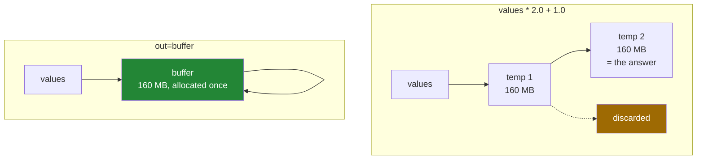

# 1.2 — `out=` and `where=` — the arrays a chained expression allocates

## One-line answer

`values * 2 + 1` builds **two** whole new arrays and throws the first away; `out=` writes the result
into memory you already own, and `where=` applies the operation only where a mask says to.

---

## The story

Somebody is baking and the recipe needs doubling and then a tablespoon of sugar added.

They could do it in one bowl: double everything, tip the sugar in, done. One bowl to wash.

What they actually do, because they are being careful, is measure the doubled amounts into a second
bowl, then tip that into a third bowl and add the sugar. Three bowls, two of them now dirty and
holding nothing.

Nobody notices with one recipe. Somebody catering for two hundred people, working through a stack of
mixing bowls, notices immediately — not because the extra bowls are wrong, but because there are only
so many bowls and only so much space to put them down.

---

## The idea in plain language

Every ufunc call allocates an array for its result
([1.1](1.1-one-operation-every-element.md)). A chained expression is several ufunc calls, so it
allocates several arrays, and all but the last are thrown away.

`values * 2.0 + 1.0` is:

1. `np.multiply(values, 2.0)` — allocates a full-size array.
2. `np.add(that, 1.0)` — allocates another full-size array.
3. The first one becomes garbage.

On a twenty-million-element `float64` array that is two allocations of 160 MB to produce 160 MB of
answer. The peak memory is higher than the result, and the time includes writing 320 MB that nobody
will read.

**`out=` removes the allocation.** `np.multiply(values, 2.0, out=buffer)` writes into `buffer` and
returns it. Chained:

```
np.multiply(values, 2.0, out=buffer)
np.add(buffer, 1.0, out=buffer)
```

Two operations, one buffer, nothing allocated. The output may be the same array as an input —
`np.add(buffer, 1.0, out=buffer)` is exactly what `buffer += 1.0` does underneath, which is why the
in-place operators exist and why they are the short spelling of this
([Day 22, 1.1](../../../day-22-broadcasting-and-shape/parts/01-broadcasting/1.1-adding-one-number-to-every-day.md)).

**`where=` limits which elements are touched.** `np.divide(a, b, out=result, where=b != 0)` performs
the division only where the mask is true and **leaves the other positions of `out` exactly as they
were**. That last clause is the one people get wrong: `where=` does not fill the skipped positions with
anything, so `out` must already hold something sensible there — which is why the `out=` array is
usually created with `np.zeros` or `np.full` rather than `np.empty`
([Day 20, 3.2](../../../day-20-arrays-and-dtypes/parts/03-creating/3.2-zeros-ones-full-and-empty.md)).

Two cautions that keep this honest.

**Readability is a real cost.** `values * 2 + 1` says what it means; three `out=` calls do not. The
trade is worth making inside a hot loop and not worth making in a script that runs once.

**The output must be the right shape and dtype.** A wrong shape raises
`non-broadcastable output operand`, and a narrowing dtype raises rather than truncating
([Day 22, 1.6](../../../day-22-broadcasting-and-shape/parts/01-broadcasting/1.6-reading-the-broadcast-error.md)).
NumPy will stretch an input and never an output, because there is nowhere to put the extra values.

---

## Why Setu needs it

- **Day 130's training loop** allocates its buffers once and writes into them on every step. A
  framework doing otherwise would spend its time in the memory allocator.
- **Day 76's feature pipeline** applies several transformations in sequence, and on a large matrix the
  intermediates decide whether the job fits in memory.
- **Day 155's index scoring** normalises and compares millions of vectors per query, where one avoided
  allocation per query is the difference between comfortable and not.
- **Day 25's phase gate** is a speed target, and an expression that allocates twice where it could
  allocate none is a straightforward way to miss it.
- **`where=` is the memory-free version of masked assignment**, which you wrote on
  [Day 21, 3.4](../../../day-21-indexing-and-views/parts/03-boolean-masks/3.4-assigning-through-a-mask.md).

---

## The mechanism

The chain, and the buffer:

```python
import time

import numpy as np

rng = np.random.default_rng(23)
values = rng.random(20_000_000)
values.sum()

start = time.perf_counter()
chained = values * 2.0 + 1.0
chained_time = time.perf_counter() - start

buffer = np.empty_like(values)
start = time.perf_counter()
np.multiply(values, 2.0, out=buffer)
np.add(buffer, 1.0, out=buffer)
out_time = time.perf_counter() - start

print(f"values * 2 + 1   : {chained_time * 1000:7.1f} ms, temporaries {2 * values.nbytes:,} bytes")
print(f"with out=        : {out_time * 1000:7.1f} ms, temporaries 0 bytes")
print("same answer      :", np.allclose(chained, buffer))
```

**Line by line:**

- `rng.random(20_000_000)` — 160 MB, big enough that allocation is measurable and small enough to be
  comfortable. Seeded, so the measurement repeats
  ([Day 20, 4.2](../../../day-20-arrays-and-dtypes/parts/04-random/4.2-the-seed-is-part-of-the-result.md)).
- `values.sum()` — the warm-up, so the first pass's page faults are not charged to the first timing.
- `values * 2.0 + 1.0` — **two** allocations. The multiply produces one 160 MB array and the add
  produces another; the first is discarded the moment the second finishes.
- `np.empty_like(values)` — the destination, allocated **before** timing because in real code it is
  allocated once and reused many times. `empty_like` matches shape and dtype exactly
  ([Day 20, 3.5](../../../day-20-arrays-and-dtypes/parts/03-creating/3.5-like-and-the-identity.md)),
  and `empty` is safe here because every element is written by the multiply.
- `np.multiply(values, 2.0, out=buffer)` — reads `values`, writes `buffer`. Nothing allocated.
- `np.add(buffer, 1.0, out=buffer)` — **input and output are the same array.** This is legal and it is
  exactly what `buffer += 1.0` compiles to.
- `2 * values.nbytes` — the temporaries the chained version created, printed rather than described.
- `np.allclose` — the two routes give the same numbers, so the comparison is about how the work was
  organised.

```text
values * 2 + 1   :   173.9 ms, temporaries 320,000,000 bytes
with out=        :   100.4 ms, temporaries 0 bytes
same answer      : True
```

Not quite twice as fast, and 320 MB lighter. The time saved is the allocation and the writing of an
array nobody reads.

What each version does with memory:



`where=`, and the position it does not touch:

```python
import numpy as np

steps = np.array([8213.0, 0.0, 6180.0, 9000.0])
minutes = np.array([73.0, 0.0, 55.0, 80.0])

pace = np.zeros_like(steps)
np.divide(steps, minutes, out=pace, where=minutes > 0)
print("pace          :", pace.round(1))

untouched = np.full_like(steps, -1.0)
np.divide(steps, minutes, out=untouched, where=minutes > 0)
print("with sentinel :", untouched.round(1))

empty_start = np.empty_like(steps)
np.divide(steps, minutes, out=empty_start, where=minutes > 0)
print("from np.empty : position 1 is", empty_start[1], "- whatever was in memory")
```

**Line by line:**

- `minutes` has a zero, so dividing everything would produce `inf` and a warning
  ([1.3](1.3-divide-by-zero-warns.md)).
- `np.zeros_like(steps)` — the destination, **pre-filled with zeros**. The `where=` will skip position
  1, so whatever is there beforehand survives.
- `np.divide(..., out=pace, where=minutes > 0)` — the division runs on three of the four positions.
  Position 1 keeps the zero it started with.
- `np.full_like(steps, -1.0)` — the same call with a sentinel instead
  ([Day 20, 3.2](../../../day-20-arrays-and-dtypes/parts/03-creating/3.2-zeros-ones-full-and-empty.md)).
  Now the skipped position says "not computed" rather than "zero pace", which is a different claim.
- `np.empty_like(steps)` — the mistake. `empty` does not initialise, so the skipped position holds
  whatever bytes were already there. **`where=` skips; it does not fill.**
- Printing `empty_start[1]` is the whole lesson. In this run it came back as `-1.0` — the memory freed
  by the sentinel array two lines above, handed straight back by the allocator. It is not random and it
  is not yours; on another run, or on another machine, it is a different number.

```text
pace          : [112.5   0.   112.4 112.5]
with sentinel : [112.5  -1.  112.4 112.5]
from np.empty : position 1 is -1.0 - whatever was in memory
```

---

## When it breaks

**The output that does not fit:**

```text
$ uv run python -c "
import numpy as np
month = np.arange(28).reshape(4, 7)
out = np.empty(7, dtype=np.int64)
np.multiply(month, 2, out=out)
"
Traceback (most recent call last):
  File "<string>", line 5, in <module>
ValueError: non-broadcastable output operand with shape (7,) doesn't match the broadcast shape (4,7)
```

**What it means.** NumPy stretches inputs and never outputs, because there is nowhere to put the extra
rows. The result of `month * 2` is `(4, 7)` and the buffer is `(7,)`. Allocate the destination from the
**broadcast** shape — `np.broadcast_shapes(month.shape, ())` if you want it computed
([Day 22, 1.2](../../../day-22-broadcasting-and-shape/parts/01-broadcasting/1.2-the-rule-in-three-lines.md))
— rather than from either input's shape.

**The output whose dtype cannot hold the answer:**

```text
$ uv run python -c "
import numpy as np
values = np.array([1.5, 2.5, 3.5])
out = np.empty(3, dtype=np.int64)
np.multiply(values, 2.0, out=out)
"
Traceback (most recent call last):
  File "<string>", line 5, in <module>
numpy._core._exceptions._UFuncOutputCastingError: Cannot cast ufunc 'multiply' output from dtype('float64') to dtype('int64') with casting rule 'same_kind'
```

**What it means.** The same refusal as `+=` on an integer array
([Day 21, 2.4](../../../day-21-indexing-and-views/parts/02-the-view-trap/2.4-the-function-that-changed-its-input.md)):
NumPy will not throw away the fractional part without being asked. The fix is to decide out loud —
allocate a float buffer, or add `casting="unsafe"` with a comment saying why truncation is acceptable.

**The `where=` that left rubbish behind:**

```text
$ uv run python -c "
import numpy as np
big = np.arange(1_000_000, dtype=np.float64)
del big
out = np.empty(6, dtype=np.float64)
np.add(np.ones(6), 1.0, out=out, where=np.array([True, False, True, False, True, False]))
print('result :', out)
print('the False positions were never written')
"
result : [2. 0. 2. 0. 2. 0.]
the False positions were never written
```

**What it means.** The `False` positions hold whatever was already in that memory — zeros, on this run.
That is the worst possible outcome, because zero is a perfectly plausible answer and nothing about the
array says three of its six values were never computed. Another run, another machine, or a different
allocation history gives different numbers there. This is the most dangerous combination in this part:
**`np.empty` plus `where=`**, because the uninitialised positions are exactly the ones nobody inspects.
Use `np.zeros`, `np.full` with a sentinel, or copy the input into the output first.

**The in-place operation that aliased its own input:**

```text
$ uv run python -c "
import numpy as np
a = np.arange(5.0)
b = a[1:]
try:
    np.add(a[:-1], 1.0, out=b)
    print('overlapping out= :', a)
except Exception as exc:
    print(type(exc).__name__, exc)
"
overlapping out= : [0. 1. 2. 3. 4.]
```

**What it means.** The input and the output overlap but are not the same array. NumPy detects the
overlap and makes a temporary copy so the result is correct — which is right, and which quietly
reintroduces the allocation you were using `out=` to avoid. When performance is the reason for `out=`,
the destination should be either a completely separate buffer or exactly the input array, never a
partially overlapping slice of it.

---

## In production

**What a professional writes instead of the teaching version.** They allocate once, outside the loop,
and keep the readable version for everything that is not hot:

```python
from __future__ import annotations

import numpy as np


class PaceCalculator:
    """Steps per minute for many days, reusing one buffer across calls.

    Built for a loop that runs thousands of times. For a one-off calculation, write
    ``steps / minutes`` - it is clearer and the allocation does not matter.
    """

    def __init__(self, size: int) -> None:
        self._buffer = np.zeros(size, dtype=np.float64)

    def compute(self, steps: np.ndarray, minutes: np.ndarray) -> np.ndarray:
        if steps.shape != (self._buffer.size,) or minutes.shape != steps.shape:
            raise ValueError(
                f"expected two arrays of shape {(self._buffer.size,)}, "
                f"got {steps.shape} and {minutes.shape}"
            )
        self._buffer.fill(0.0)
        np.divide(steps, minutes, out=self._buffer, where=minutes > 0)
        return self._buffer
```

**Line by line:**

- The docstring's second sentence is the honest half: **this shape of code is only worth writing in a
  hot loop**, and saying so stops it spreading.
- `np.zeros(size, ...)` in `__init__` — one allocation for the object's lifetime, and zeros rather than
  `empty` because `where=` will skip positions.
- The shape check before anything is written, with both received shapes in the message
  ([Day 22, 1.6](../../../day-22-broadcasting-and-shape/parts/01-broadcasting/1.6-reading-the-broadcast-error.md)).
- `self._buffer.fill(0.0)` — **resetting between calls.** Without it, a position skipped by this call's
  `where=` would still hold the previous call's answer, which is a stale-data bug that only appears
  when the mask changes between calls. One pass over the buffer, and it removes an entire class of
  failure.
- `np.divide(..., out=self._buffer, where=minutes > 0)` — no allocation for the result, and the
  zero-minute days keep their zero.
- **The method returns the buffer itself**, so two calls hand back the same array and the caller must
  copy anything they keep. That is a sharp edge, and in a real class it would be either documented in
  capitals or removed by returning `self._buffer.copy()` — which costs the allocation back. There is no
  free version; the choice is which cost to pay
  ([Day 21, 5.2](../../../day-21-indexing-and-views/parts/05-in-anger/5.2-view-or-copy-on-purpose.md)).

**What changes at scale.** The intermediates stop being a rounding error. A five-operation expression
on a 4 GB array allocates and frees about 20 GB over its life, and the peak — the two largest
intermediates coexisting — decides whether the job runs at all. Frameworks solve this by fusing
operations, so that a chain runs in one pass with no intermediate written; NumPy has no fusion, so the
`out=` discipline is how you get the same effect by hand. The rule of thumb worth keeping: **write the
readable expression, measure, and only convert the chain that a profiler names.**

**The failure that only appears with real data.** A service pre-allocated one shared output buffer and
reused it across concurrent requests. With one request at a time it was correct and fast. Under two
concurrent requests both wrote into the same buffer and each read the other's answer, so responses were
occasionally correct-looking and belonged to somebody else. Buffers are per-worker state, never
module-level state, and a shared mutable buffer is the same bug as any other shared mutable object
([Day 19, 4.3](../../../day-19-typing-dataclasses-and-concurrency/parts/04-concurrency/4.3-threads.md)).

**The review comment a senior engineer leaves.** *"`np.divide(a, b, out=result, where=b != 0)` with
`result = np.empty(...)` leaves uninitialised memory wherever `b` is zero. Use `np.zeros` or
`np.full(..., np.nan)` so the skipped positions say something definite."*

**The interview question.** *"How would you reduce the memory a NumPy expression uses?"* Every ufunc
allocates its result, so a chained expression like `a * 2 + 1` allocates two full-size arrays and
discards one. Passing `out=` writes into a buffer you already own, and the output may be one of the
inputs — which is what the in-place operators do underneath — so a chain becomes one allocation instead
of several. The related argument is `where=`, which applies the operation only where a mask is true;
the trap there is that it **skips** rather than fills, so the output array must already hold something
sensible in the skipped positions, and pairing `where=` with `np.empty` leaves uninitialised memory in
exactly the positions nobody inspects.

---

## Check yourself

```bash
uv run python -c "
import numpy as np
values = np.arange(6.0)
buffer = np.zeros(6)
np.multiply(values, 2.0, out=buffer)
np.add(buffer, 1.0, out=buffer)
print('chained  :', values * 2.0 + 1.0)
print('with out=:', buffer)
skipped = np.full(6, -1.0)
np.add(values, 100.0, out=skipped, where=values % 2 == 0)
print('where=   :', skipped)
"
```

The last line has three values that were never computed. Say what decided what they hold.

**Answer out loud, without scrolling up:**

> `a * 2 + 1` on a 1 GB array. How many arrays exist while it runs, how would you make it one, and what
> must be true of the buffer if you also pass `where=`?

---

**Next:** [1.3 — divide by zero warns, it does not raise](1.3-divide-by-zero-warns.md).
