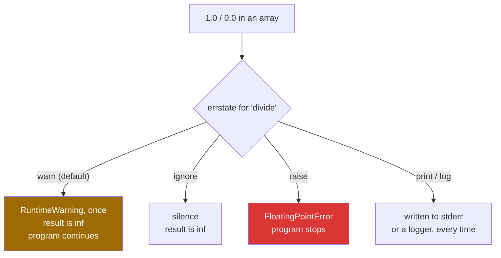

# 1.3 — Dividing by zero warns and carries on — `errstate`, and who decides

## One-line answer

`1.0 / 0.0` in plain Python raises `ZeroDivisionError`; in NumPy it prints a warning once and produces
`inf`, and `np.errstate` is how you change that to silence or to an exception.

---

## The story

A shop's till has a rule: if a customer's card is declined, print a small message on the receipt and
carry on with the next customer.

That is the right rule for a busy Saturday. Stopping the queue for every declined card would be worse
for everybody, and the message on the receipt means somebody can look into it later.

It is exactly the wrong rule for the end-of-day accounts. There, a declined card that was quietly
noted and carried past means the totals do not add up and nobody knows why. At that point somebody
wants the machine to stop and say so.

Same event, two correct responses, and which one you want depends on what the machine is doing at the
time. The till cannot know; the person setting it up has to say.

---

## The idea in plain language

Plain Python raises on `1 / 0`. NumPy does not. Three reasons, all of them good.

**Floating-point arithmetic has answers for these cases.** `1.0 / 0.0` is `inf`, `-1.0 / 0.0` is
`-inf`, and `0.0 / 0.0` is `nan`. These are defined by the *IEEE Standard for Floating-Point
Arithmetic* (IEEE 754-2019, DOI 10.1109/IEEESTD.2019.8766229), which every processor implements, and
they are the values the hardware produces.

**Stopping a million-element operation because element 8 231 divided by zero would be unhelpful.** The
other 999 999 answers are fine, and `inf` records which one was not.

**Which response is right depends on the program**, not on the operation. So NumPy warns by default and
lets you change it.

Four kinds of event are tracked, and you will see all four names in messages:

| Name | Happens when | Default | Example |
|---|---|---|---|
| `divide` | dividing a non-zero by zero | `warn` | `1.0 / 0.0` → `inf` |
| `invalid` | an operation with no defined answer | `warn` | `0.0 / 0.0` → `nan`, `sqrt(-1)` → `nan` |
| `over` | the result is too big for the dtype | `warn` | `np.float32(1e30) ** 2` → `inf` |
| `under` | the result is too small to represent | `ignore` | a tiny number becoming `0.0` |

`np.geterr()` shows the current settings, and each can be `warn`, `ignore`, `raise`, `call`, `print` or
`log`.

**`np.errstate` is a context manager** ([Day 16, 4.1](../../../day-16-files-and-context-managers/parts/04-context-managers/4.1-with-the-block-that-cleans-up.md))
that changes them for one block and restores them afterwards:

```
with np.errstate(divide="ignore", invalid="ignore"):
    pace = steps / minutes
```

Inside the block the warning is suppressed; outside it, everything is as before. That is the shape to
use, because the alternative — `np.seterr` — changes the setting globally and for everybody, including
library code that was relying on the default.

Two things that catch people out.

**A `RuntimeWarning` is printed once per location and then suppressed.** So a million bad divisions
produce one line of output, and a loop that hits the same line every iteration warns once. The warning
is not a count; it is a flag.

**Integer division by zero does not follow the same rules.** `np.array([1]) // np.array([0])` gives
`0` with a warning rather than `inf`, because integers have no `inf` to give. That is a genuine
surprise, and the value it substitutes is not a sentinel you should rely on.

---

## Why Setu needs it

- **Day 76's rate features** — steps per minute, clicks per view, price per unit — divide by a
  denominator that is sometimes zero, in every real dataset.
- **Day 130's training loops** hit `over` when a learning rate is too high, and the loss becomes `inf`
  before it becomes `nan`. Setting `over="raise"` during debugging is how you find the step it happened
  on.
- **Day 155's normalisation** divides by a vector's length, and an all-zero embedding — what an encoder
  returns for an empty document — makes that zero
  ([Day 22, 1.4](../../../day-22-broadcasting-and-shape/parts/01-broadcasting/1.4-keepdims-and-the-column.md)).
- **Day 172's eval harness** runs unattended, which is where a warning nobody reads becomes a `nan` in
  a report.
- **Day 20, 2.3** established what `nan` and `inf` are; this part is about who decides when they are
  acceptable.

---

## The mechanism

The four outcomes, and the block that silences them:

```python
import numpy as np

steps = np.array([8213.0, 0.0, 6180.0, -100.0])
minutes = np.array([73.0, 0.0, 55.0, 80.0])

with np.errstate(divide="ignore", invalid="ignore"):
    pace = steps / minutes
    root = np.sqrt(steps)

print("pace       :", pace.round(1))
print("sqrt       :", root.round(1))
print("infinite   :", np.isinf(pace))
print("not a number:", np.isnan(root))
print("current settings:", np.geterr())
```

**Line by line:**

- `steps` holds a zero and a negative. Both are the kind of value that arrives in real data: a day not
  recorded, and a reading corrupted somewhere upstream.
- `with np.errstate(divide="ignore", invalid="ignore")` — **two settings, because two different things
  go wrong here.** `0.0 / 0.0` is `invalid`, not `divide`; `divide` is for a non-zero numerator over
  zero. Silencing one and not the other is the commonest mistake in this call.
- `steps / minutes` — position 1 is `0.0 / 0.0`, which is `nan`.
- `np.sqrt(steps)` — position 3 is the square root of a negative, which is `nan` and is reported as
  `invalid`.
- `np.isinf(pace)` — all `False` here, because no positive number was divided by zero; `0/0` gives
  `nan` rather than `inf`. **`isinf` and `isnan` are different questions** and code that checks only one
  misses half the bad values.
- `np.geterr()` — the settings **outside** the block, printed after it, showing they were restored.
  Note that `under` defaults to `ignore`, because underflow is usually harmless and would otherwise be
  constant noise.

```text
pace       : [112.5   nan 112.4  -1.2]
sqrt       : [90.6  0.  78.6  nan]
infinite   : [False False False False]
not a number: [False False False  True]
current settings: {'divide': 'warn', 'over': 'warn', 'under': 'ignore', 'invalid': 'warn'}
```

What happens without the block:



The default, and what it looks like:

```python
import numpy as np

steps = np.array([8213.0, 0.0])
minutes = np.array([73.0, 0.0])
print(steps / minutes)
print(np.array([0.0, 0.0]) / np.array([0.0, 1.0]))
```

**Line by line:**

- No `errstate`, so the defaults apply and the warnings appear on standard error.
- `steps / minutes` — `0.0 / 0.0` at position 1, so this is `invalid`, and the message says so.
- The second division is `invalid` again, from a different line — **and it warns separately**, because
  the once-per-location rule counts locations, not events.
- The printed arrays come after the warnings, which is why in a long script the warnings appear far
  from the output they belong to.

```text
<string>:5: RuntimeWarning: invalid value encountered in divide
<string>:6: RuntimeWarning: invalid value encountered in divide
[112.50684932          nan]
[nan  0.]
```

---

## When it breaks

**The setting that turns it into a stop:**

```text
$ uv run python -c "
import numpy as np
with np.errstate(divide='raise'):
    np.array([1.0]) / np.array([0.0])
"
Traceback (most recent call last):
  File "<string>", line 4, in <module>
FloatingPointError: divide by zero encountered in divide
```

**What it means.** `raise` turns the flag into a `FloatingPointError` — a real exception, with a
traceback that names the line. This is the setting for a batch job, and it is worth putting at the top
of any script that runs unattended: **an unread warning and a `nan` in a report are the same thing.**
The places that genuinely expect a division by zero then opt out locally with their own `errstate`.

**Integer division, which does something else entirely:**

```text
$ uv run python -c "
import numpy as np
print(np.array([1, 2]) // np.array([0, 1]))
print(np.array([1, 2]) % np.array([0, 1]))
"
<string>:3: RuntimeWarning: divide by zero encountered in floor_divide
<string>:4: RuntimeWarning: divide by zero encountered in remainder
[0 2]
[0 0]
```

**What it means.** Integers have no `inf` and no `nan`, so NumPy substitutes **zero** and warns. A zero
that means "undefined" is indistinguishable from a zero that means zero, which is far worse than
`inf`. Plain Python raises `ZeroDivisionError` here, so the same expression behaves differently
depending on whether it is running on numbers or on arrays. Guard integer denominators explicitly
rather than relying on the result.

**The warning that appeared once for a million problems:**

```text
$ uv run python -c "
import numpy as np
values = np.ones(1_000_000)
zeros = np.zeros(1_000_000)
result = values / zeros
print('infinite values :', int(np.isinf(result).sum()), 'of', result.size)
print('warnings printed: 1')
"
<string>:5: RuntimeWarning: divide by zero encountered in divide
infinite values : 1000000 of 1000000
warnings printed: 1
```

**What it means.** Every single value is `inf` and there is one line of warning. The warning tells you
*that* it happened, never *how often*, so it is useless as a measure of how bad things are. When the
count matters — and it usually does — count it: `np.isinf(result).sum()`, or check before dividing.

**The one that raises where you did not expect it:**

```text
$ uv run python -c "
import numpy as np
with np.errstate(all='raise'):
    tiny = np.float64(1e-320) / np.float64(10.0)
    print('got', tiny)
"
Traceback (most recent call last):
  File "<string>", line 4, in <module>
FloatingPointError: underflow encountered in scalar divide
```

**What it means.** `all="raise"` includes `under`, which is `ignore` by default for a good reason:
underflow — a number too small to represent becoming zero — happens constantly in normal numerical work
and is almost always harmless. Turning everything to `raise` in a numerical program stops it on
something nobody cares about. Set `divide`, `invalid` and `over` to `raise` and leave `under` alone.

---

## In production

**What a professional writes instead of the teaching version.** The policy is set once at the entry
point, and the places that expect a bad value opt out locally and say why:

```python
from __future__ import annotations

import numpy as np


def configure_numerics() -> None:
    """Make silent nan and inf into errors for this process.

    Call once at start-up, in a batch job or a test suite. ``under`` stays ignored:
    underflow is normal in numerical work and stopping on it is noise.
    """
    np.seterr(divide="raise", invalid="raise", over="raise", under="ignore")


def pace_per_minute(steps: np.ndarray, minutes: np.ndarray) -> np.ndarray:
    """Steps per minute, with days of zero minutes reported as nan rather than inf.

    The division by zero is expected here - a day with no recorded time is normal - so
    this function opts out of the process-wide policy and marks those days explicitly.
    """
    if steps.shape != minutes.shape:
        raise ValueError(f"shapes differ: {steps.shape} and {minutes.shape}")
    out = np.full(steps.shape, np.nan, dtype=np.float64)
    with np.errstate(divide="ignore", invalid="ignore"):
        np.divide(steps, minutes, out=out, where=minutes > 0)
    return out
```

**Line by line:**

- `np.seterr(...)` in a function called **once at start-up** — the global setting, used the way it
  should be: as a process-wide policy, set in one visible place, not scattered through library code.
- `under="ignore"` — stated rather than left out, so a reader can see it was a decision.
- The docstring says *batch job or test suite*, because in an interactive session raising on every
  `nan` makes exploration painful, and the right setting there is the default.
- `np.full(steps.shape, np.nan, ...)` — the destination pre-filled with `nan`, so the positions
  `where=` skips say "not computed" ([1.2](1.2-out-and-the-temporaries.md)). With `np.empty` they
  would hold uninitialised memory.
- `with np.errstate(divide="ignore", invalid="ignore")` — the **local** opt-out, wrapping only the one
  line that is expected to hit it. A blanket `ignore` at the top of the function would also hide a
  genuine problem in the shape check or the copy.
- `where=minutes > 0` — the division does not even run on the zero-minute days, so no warning is
  produced and no `inf` is created. The `errstate` is belt and braces for the values that are zero for
  a different reason, such as a `nan` in `minutes`.
- **The result distinguishes "no time recorded" from "zero pace"**, which is the actual deliverable;
  `inf` would say the opposite.

**What changes at scale.** Warnings stop being visible at all. A service writes to a log nobody greps,
a notebook scrolls past, and a scheduled job's stderr goes to a file that is rotated away — so the
default `warn` is effectively `ignore` in every unattended context. The two production habits are
therefore: set `raise` for `divide`, `invalid` and `over` at the entry point of anything that runs
without a human watching, and count rather than warn where a bad value is expected —
`int(np.isnan(result).sum())` in the output record, so the number appears in the same report as the
answer. The third habit is narrower and worth knowing: in a training loop, `over="raise"` catches the
exact step where the loss became `inf`, which is far easier than reasoning backwards from a `nan` model
several hundred steps later.

**The failure that only appears with real data.** A nightly report computed conversion rates as
`conversions / visits`. Every test fixture had visits. In production a new marketing channel had a day
with no visits, the rate came back `inf`, the aggregation that followed produced `nan`, and the whole
report was blank — with one `RuntimeWarning` in a log file that nobody read until the third blank
morning. `np.errstate(divide="raise")` at the entry point would have failed the job on the first night,
with a traceback naming the line.

**The review comment a senior engineer leaves.** *"This divides by a count that can be zero and relies
on the default warning, which is invisible in the job's logs. Pre-fill the output with `nan`, use
`where=count > 0`, and put the number of skipped rows in the result so it shows up in the report."*

**The interview question.** *"What does NumPy do when you divide by zero?"* It follows IEEE 754 rather
than Python: a non-zero over zero gives `inf`, zero over zero gives `nan`, and it prints a
`RuntimeWarning` once per source location rather than raising. That default suits interactive work and
is wrong for anything unattended, because a warning that nobody reads plus a `nan` that propagates is a
silently blank report. So I set `np.seterr(divide="raise", invalid="raise", over="raise")` at the entry
point of batch jobs, leave `under` ignored because underflow is normal, and use `np.errstate` as a
context manager to opt out locally where a zero denominator is genuinely expected. The detail people
miss is integers: `1 // 0` on arrays gives **0** with a warning, not `inf`, so an undefined result is
indistinguishable from a real zero.

---

## Check yourself

```bash
uv run python -c "
import numpy as np
print('defaults :', np.geterr())
with np.errstate(divide='ignore', invalid='ignore'):
    print('1/0      :', np.array([1.0]) / 0.0)
    print('0/0      :', np.array([0.0]) / 0.0)
    print('sqrt(-1) :', np.sqrt(np.array([-1.0])))
print('restored :', np.geterr())
try:
    with np.errstate(invalid='raise'):
        np.sqrt(np.array([-1.0]))
except FloatingPointError as exc:
    print('raised   :', exc)
"
```

Two of those three bad values are `nan` and one is `inf`. Say which, and which `errstate` name each one
belongs to.

**Answer out loud, without scrolling up:**

> Name the four error states NumPy tracks, say which one is ignored by default and why, and say what
> integer division by zero produces.

---

**Next:** [1.4 — `np.where`, the vectorised `if`](1.4-np-where-the-vectorised-if.md).
