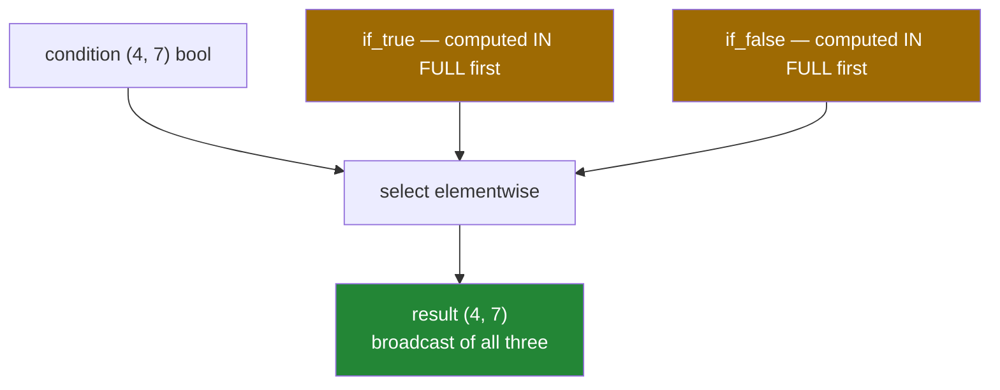

# 1.4 — `np.where` — the vectorised `if`, and the branch that always runs

## One-line answer

`np.where(condition, a, b)` picks from `a` where the condition is true and from `b` where it is false,
elementwise — but unlike an `if`, **both `a` and `b` are computed in full first**, so the branch you
did not want still runs.

---

## The story

Somebody is marking a stack of homework, and the rule is: if the answer is right, write the score in
green; if it is wrong, write it in red.

Nobody works through that as thirty separate decisions announced out loud. They go down the pile with
both pens in hand, glancing at each answer and using whichever pen fits. One rule, thirty
applications, both pens out the whole time.

That last detail is the one that matters here. Having both pens ready is not a cost with pens. If
"green" meant fetching a pen from the next room each time, having both ready in advance would be a
completely different arrangement — and that is exactly the arrangement `np.where` uses.

---

## The idea in plain language

`if` in Python works on one true-or-false value and chooses **which code to run**. With an array of
conditions there is nothing for it to choose, which is where `The truth value of an array with more
than one element is ambiguous` comes from
([Day 21, 3.3](../../../day-21-indexing-and-views/parts/03-boolean-masks/3.3-and-or-not-and-why-and-raises.md)).

`np.where(condition, if_true, if_false)` is the array version. It takes three arrays — or values that
broadcast to arrays — and builds a result by taking each element from `if_true` where the condition is
true and from `if_false` where it is false. All three broadcast against each other
([Day 22, 1.2](../../../day-22-broadcasting-and-shape/parts/01-broadcasting/1.2-the-rule-in-three-lines.md)),
so a condition array with two plain numbers is the common case.

The behaviour that surprises everybody: **`np.where` is not a branch.** It is a *selection* from two
arrays that already exist. Python evaluates the arguments before the call, so
`np.where(minutes > 0, steps / minutes, 0.0)` computes the division for **every** element, including
the zeros, and then throws away the results it did not want — producing the warning you were trying to
avoid ([1.3](1.3-divide-by-zero-warns.md)). This is the same "no short-circuit" property as `&` and
`|`, and for the same reason.

When the unwanted branch must not run, use `out=` and `where=` instead
([1.2](1.2-out-and-the-temporaries.md)): those genuinely skip the elements, because the mask is passed
*into* the operation rather than applied to its result.

Two more things worth knowing.

**Called with one argument, `np.where` does something else entirely.** `np.where(mask)` returns the
**positions** where the mask is true, as a tuple of one array per axis — it is `np.nonzero`
([Day 21, 3.2](../../../day-21-indexing-and-views/parts/03-boolean-masks/3.2-indexing-with-a-mask.md)).
Two meanings for one name, decided by the argument count, and the documentation itself recommends using
`np.nonzero` when that is what you want.

**For more than two outcomes, `np.select` beats nesting.** `np.select([cond1, cond2], [val1, val2],
default=val3)` reads as a list of rules with a fallback, where the nested
`np.where(c1, v1, np.where(c2, v2, v3))` reads as a puzzle. They produce the same array.

---

## Why Setu needs it

- **The plan names `np.where` as this day's example for `NP-06`** — the vectorised `if`.
- **Day 76's feature engineering** bins continuous values into categories, which is `np.select` with
  one condition per bin.
- **Day 125's rectified linear unit** is `np.where(x > 0, x, 0)`, though
  [1.5](1.5-maximum-clip-and-elementwise.md) shows the better spelling.
- **Day 91's label encoding** turns a threshold into a class: `np.where(score >= cutoff, 1, 0)`.
- **Day 165's chunk filtering** marks each chunk keep-or-drop before anything expensive is computed on
  it.

---

## The mechanism

One condition, four uses:

```python
import numpy as np

month = np.array(
    [
        [8213, 10442, 6180, 9000, 12007, 9631, 7204],
        [7788, 9120, 11345, 8402, 6733, 14210, 5096],
        [9004, 8765, 7621, 10188, 9950, 8317, 11002],
        [6540, 12488, 9873, 7106, 8899, 10540, 9218],
    ]
)

labels = np.where(month >= 10_000, "met", "missed")
print("labels row 0 :", labels[0])
print("dtype        :", labels.dtype)

capped = np.where(month > 12_000, 12_000, month)
print("capped row 1 :", capped[1])

bonus = np.where(month >= 10_000, month * 1.1, month)
print("bonus row 0  :", bonus[0].round(0))

positions = np.where(month >= 12_000)
print("one argument :", positions)
print("values there :", month[positions])
```

**Line by line:**

- `np.where(month >= 10_000, "met", "missed")` — a mask and two **strings**. The result is a text array
  of dtype `<U6`, six characters wide, because that is the longest of the two words
  ([Day 20, 2.1](../../../day-20-arrays-and-dtypes/parts/02-dtypes/2.1-a-dtype-is-a-promise.md)). A
  longer label later would be silently truncated, which is a real trap with text dtypes.
- `np.where(month > 12_000, 12_000, month)` — the cap. Where the value is too big take the limit,
  otherwise take the original. This is a correct and slightly clumsy `np.clip`
  ([1.5](1.5-maximum-clip-and-elementwise.md)).
- `np.where(month >= 10_000, month * 1.1, month)` — **both branches are arrays**, and `month * 1.1` is
  computed for all twenty-eight values before the selection happens. Here that is only wasted work;
  when the discarded branch divides by zero it is a warning as well.
- `np.where(month >= 12_000)` — **one argument, completely different behaviour.** It returns a tuple of
  position arrays, one per axis, which is `np.nonzero`. The row array and the column array read
  together give the coordinates.
- `month[positions]` — the tuple used directly as an index, which is the pair-indexing form from
  [Day 21, 4.2](../../../day-21-indexing-and-views/parts/04-fancy-indexing/4.2-two-index-arrays.md).

```text
labels row 0 : ['missed' 'met' 'missed' 'missed' 'met' 'missed' 'missed']
dtype        : <U6
capped row 1 : [ 7788  9120 11345  8402  6733 12000  5096]
bonus row 0  : [ 8213. 11486.  6180.  9000. 13208.  9631.  7204.]
one argument : (array([0, 1, 3]), array([4, 5, 1]))
values there : [12007 14210 12488]
```

What `np.where` actually does:



The two amber boxes are the whole difference from an `if`.

Both branches running, demonstrated:

```python
import numpy as np

minutes = np.array([73.0, 0.0, 55.0])
steps = np.array([8213.0, 500.0, 6180.0])
pace = np.where(minutes > 0, steps / minutes, 0.0)
print("pace :", pace.round(1))
```

**Line by line:**

- `minutes > 0` — the condition, false at position 1.
- `steps / minutes` — **evaluated before `np.where` is called at all**, because Python evaluates
  arguments first. Position 1 is `500.0 / 0.0`, which is `inf` and a `RuntimeWarning`
  ([1.3](1.3-divide-by-zero-warns.md)).
- `np.where(...)` then discards that `inf` and takes `0.0` instead, so **the result is correct** and the
  warning already happened.
- The fix, when the branch must not run: `np.divide(steps, minutes, out=np.zeros_like(steps),
  where=minutes > 0)` ([1.2](1.2-out-and-the-temporaries.md)), where the mask is passed into the
  division rather than applied to its output.

```text
<string>:5: RuntimeWarning: divide by zero encountered in divide
pace : [112.5   0.  112.4]
```

More than two outcomes:

```python
import numpy as np

month = np.arange(28).reshape(4, 7)

nested = np.where(month > 20, "high", np.where(month > 10, "mid", "low"))
chosen = np.select([month > 20, month > 10], ["high", "mid"], default="low")
print("nested equal select :", np.array_equal(nested, chosen))
print("row 2 :", chosen[2])
```

**Line by line:**

- `np.where(month > 20, "high", np.where(month > 10, "mid", "low"))` — the nested form. It works, and
  the reader has to unwind it inside out to see that the second condition only applies below 20.
- `np.select([conditions], [values], default=...)` — the same rules as a **list**, read top to bottom,
  with the first matching condition winning. Adding a fourth band is one entry in each list rather than
  another layer of nesting.
- `np.array_equal(nested, chosen)` — `True`. The choice is entirely about which one a person can check.
- **Order matters in `np.select`**: conditions are tried in order, so the most specific must come first.
  Writing `month > 10` before `month > 20` would label everything above 10 as `mid` and nothing as
  `high`, with no error.

```text
nested equal select : True
row 2 : ['mid' 'mid' 'mid' 'mid' 'mid' 'mid' 'mid']
```

---

## When it breaks

**Branches that do not broadcast:**

```text
$ uv run python -c "
import numpy as np
month = np.arange(28).reshape(4, 7)
np.where(month > 13, np.zeros(5), 0)
"
Traceback (most recent call last):
  File "<string>", line 4, in <module>
ValueError: operands could not be broadcast together with shapes (4,7) (5,) ()
```

**What it means.** All three arguments broadcast together, so a `(5,)` branch cannot meet a `(4, 7)`
condition. The message shows all three shapes — the condition, the true branch and the empty tuple for
the scalar false branch — which is unusually helpful once you know that is what you are looking at
([Day 22, 1.6](../../../day-22-broadcasting-and-shape/parts/01-broadcasting/1.6-reading-the-broadcast-error.md)).

**The text that was cut off:**

```text
$ uv run python -c "
import numpy as np
scores = np.array([5, 95])
labels = np.where(scores > 50, 'pass', 'needs improvement')
print('labels :', labels)
print('dtype  :', labels.dtype)
extended = np.where(scores > 50, 'passed with distinction', 'needs improvement')
print('longer :', extended, extended.dtype)
"
labels : ['needs improvement' 'pass']
dtype  : <U17
longer : ['needs improvement' 'passed with distinction'] <U23
```

**What it means.** The result's text width is decided by the longest branch, and here both fit. The
trap arrives when one branch is an existing array with a narrower dtype: assigning a longer string into
a `<U6` array truncates silently
([Day 20, 2.1](../../../day-20-arrays-and-dtypes/parts/02-dtypes/2.1-a-dtype-is-a-promise.md)). Labels
are better represented as small integers with a separate lookup — text arrays in NumPy are a fixed-width
format, not the flexible strings Python gives you.

**`np.select` with the conditions in the wrong order:**

```text
$ uv run python -c "
import numpy as np
values = np.array([5, 15, 25])
right = np.select([values > 20, values > 10], ['high', 'mid'], default='low')
wrong = np.select([values > 10, values > 20], ['mid', 'high'], default='low')
print('specific first :', right)
print('general first  :', wrong)
"
specific first : ['low' 'mid' 'high']
general first  : ['low' 'mid' 'mid']
```

**What it means.** `np.select` takes the **first** matching condition, so a general rule placed before
a specific one swallows it. Nothing raises, both arrays are the right shape, and the value 25 is
labelled `mid`. This is the same hazard as an `if/elif` chain in the wrong order
([Day 5, 2.1](../../../day-05-operators-and-conditionals/parts/02-conditionals/2.1-if-elif-else-and-the-indent.md)),
without the indentation that makes the order visible.

**The one-argument form, met by accident:**

```text
$ uv run python -c "
import numpy as np
scores = np.array([5, 95, 50])
result = np.where(scores > 50)
print('result :', result)
print('type   :', type(result).__name__, 'of', len(result), 'array(s)')
print('this is np.nonzero, not a selection')
"
result : (array([1]),)
type   : tuple of 1 array(s)
this is np.nonzero, not a selection
```

**What it means.** Forgetting the two branches does not raise; it silently returns positions instead of
values, as a **tuple**. Code that then does arithmetic on the result gets a confusing error several
lines later about tuples. When you want positions, write `np.nonzero(mask)` or `np.flatnonzero(mask)` —
the names say what you are asking for, and the one-argument `np.where` is a historical spelling the
documentation itself steers away from.

---

## In production

**What a professional writes instead of the teaching version.** Bands as a named list, applied with
`np.select`, and the expensive branch kept out of the arguments:

```python
from __future__ import annotations

import numpy as np

# Ordered most specific first: np.select takes the first match.
ACTIVITY_BANDS: list[tuple[int, int]] = [
    (12_000, 3),  # very active
    (10_000, 2),  # met the goal
    (5_000, 1),  # some walking
]


def band(counts: np.ndarray) -> np.ndarray:
    """Label each day 0-3 by how far it got. Returns int8, not text.

    Small integers rather than strings: a NumPy text array is fixed-width, so a longer
    label added later would be truncated without warning, and integers compare, sort and
    group without any of that.
    """
    conditions = [counts >= threshold for threshold, _ in ACTIVITY_BANDS]
    choices = [np.int8(label) for _, label in ACTIVITY_BANDS]
    return np.select(conditions, choices, default=np.int8(0))


def safe_pace(steps: np.ndarray, minutes: np.ndarray) -> np.ndarray:
    """Steps per minute, without computing the division on zero-minute days.

    np.where would evaluate steps / minutes for every day first and then discard the
    bad values - correct, and it warns. Passing the mask into the division skips them.
    """
    out = np.full(steps.shape, np.nan, dtype=np.float64)
    np.divide(steps, minutes, out=out, where=minutes > 0)
    return out
```

**Line by line:**

- `ACTIVITY_BANDS` as a module constant with the ordering comment **on the constant itself**, because
  that is where somebody will add a band and where the order rule has to be visible.
- The thresholds and labels live together as pairs, so adding a band cannot leave the two lists out of
  step — which is the failure a pair of parallel lists invites.
- `[counts >= threshold for threshold, _ in ACTIVITY_BANDS]` — a comprehension over the pairs
  ([Day 9, 1.1](../../../day-09-comprehensions/parts/01-list-comprehensions/1.1-the-loop-and-the-comprehension.md)),
  so the conditions are derived from the constant rather than repeated.
- `np.int8(label)` — the dtype stated, so the result is one byte per day rather than eight. On a
  million days that is the difference between 1 MB and 8 MB for four possible values.
- **The docstring argues for integers over text**, which is the decision a reviewer would otherwise
  question every time.
- `safe_pace` uses `out=` and `where=` rather than `np.where`, and the docstring says exactly why —
  this is the one place in the module where the difference between selecting and skipping matters.
- `np.full(..., np.nan)` — the skipped positions say "not computed"
  ([1.2](1.2-out-and-the-temporaries.md)).

**What changes at scale.** `np.where` allocates a full-size result and evaluates both branches, so on a
4 GB array a two-branch expression touches 12 GB: two branches and a result. When one branch is
expensive — a division, a logarithm, a lookup — the wasted half is real time, and the version with
`where=` becomes several times faster rather than merely tidier. The second effect is dtype: at scale
the difference between `int8` labels and `<U17` text labels is seventeen times the memory, and text
arrays cannot be compared or grouped efficiently. Categories become small integers with a lookup table
almost immediately, which is what Pandas' categorical type does for you from Day 26.

**The failure that only appears with real data.** A pipeline labelled records with
`np.where(score > cutoff, "accepted", "rejected")`. A third outcome — "manual review" — was added by
nesting another `np.where` inside the false branch. The new label was longer than the existing dtype
allowed in one code path where the array was pre-allocated, so it was stored as `"manual revi"`, and a
downstream equality check against `"manual review"` matched nothing. Every record needing review was
silently treated as rejected for two weeks.

**The review comment a senior engineer leaves.** *"`np.where(mask, a / b, 0)` still divides everywhere
and warns; the mask only filters the result. Use `np.divide(a, b, out=..., where=mask)`. And this
three-way nest wants `np.select` with the conditions ordered most specific first."*

**The interview question.** *"How do you write an `if` that works elementwise on an array?"*
`np.where(condition, if_true, if_false)`, which selects elementwise and broadcasts all three arguments.
The thing to know is that it is not a branch: Python evaluates the arguments before the call, so both
alternatives are computed in full for every element and the unwanted half is discarded — which means a
division by zero inside a branch still happens and still warns. When the unwanted branch must not run,
pass the mask into the operation with `out=` and `where=` instead. For more than two outcomes I use
`np.select`, which takes the first matching condition, so the conditions have to be ordered most
specific first or a general rule swallows the ones after it.

---

## Check yourself

```bash
uv run python -c "
import numpy as np
month = np.arange(28).reshape(4, 7)
print('labels   :', np.where(month > 20, 1, 0)[3])
print('shape    :', np.where(month > 20, 1, 0).shape)
print('positions:', np.where(month > 25))
print('select   :', np.select([month > 20, month > 10], [2, 1], default=0)[2])
minutes = np.array([1.0, 0.0])
print('both run :', np.where(minutes > 0, 1.0 / minutes, 0.0))
"
```

The last line prints a correct answer and a warning. Say where the warning came from.

**Answer out loud, without scrolling up:**

> `np.where(mask, a / b, 0)` where `b` contains zeros. Is the result correct, does it warn, and what
> would you write instead if the division must not run on those elements?

---

**Next:** [1.5 — `maximum`, `clip`, and elementwise against reduction](1.5-maximum-clip-and-elementwise.md).
