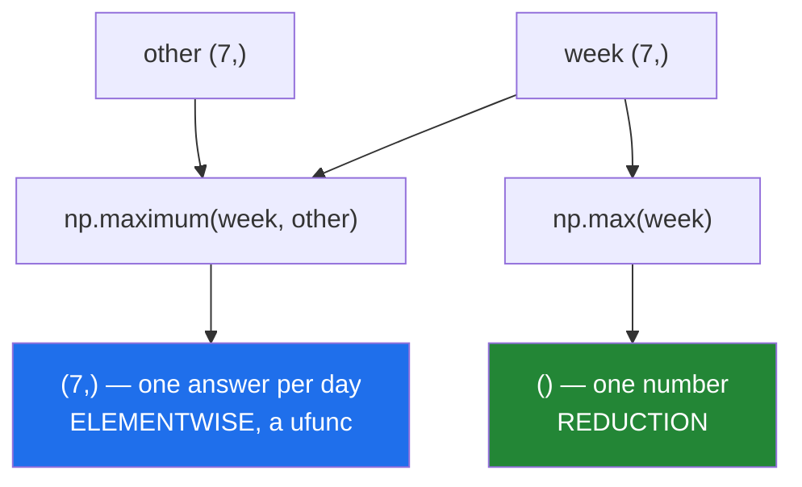

# 1.5 — `np.maximum` against `np.max` — elementwise and reduction, one letter apart

## One-line answer

`np.maximum(a, b)` compares two arrays position by position and returns an array; `np.max(a)` collapses
one array into a single number — same word, different shapes of answer, and the names differ by three
letters.

---

## The story

Two people have been keeping their own step counts for the same week, and they want to combine them.

There are two entirely different things they might mean.

"For each day, whose was higher?" gives seven numbers — Monday's winner, Tuesday's winner, and so on.
It is a week-shaped answer to a week-shaped question.

"What is the highest number either of us walked?" gives one number for the whole week.

Both are reasonable. Both are "the maximum". If somebody says only "take the maximum", they have not
said which, and the two answers do not even have the same size.

---

## The idea in plain language

NumPy has two families and names them almost identically.

**Elementwise, a ufunc**: `np.maximum(a, b)` and `np.minimum(a, b)`. Two inputs, one output, the same
shape as the broadcast of the inputs. `nin` is 2 ([1.1](1.1-one-operation-every-element.md)).

**A reduction**: `np.max(a)` and `np.min(a)`, also spelled `a.max()` and `a.min()`. One input, and the
result is one number, or one number per row if you pass `axis=`
([2.2](../02-statistics/2.2-axis-the-one-that-disappears.md)).

The names to keep straight: **`maximum` and `minimum` take two arrays; `max` and `min` take one.** The
longer name is the elementwise one, which is worth an association because it is the counter-intuitive
way round.

`np.clip(values, low, high)` is the specialised version of applying both at once: it is
`np.minimum(np.maximum(values, low), high)`, in one pass, with either bound allowed to be `None` for
"no limit on this side". It is faster than the two-call version and much clearer than the `np.where`
version ([1.4](1.4-np-where-the-vectorised-if.md)), and like every ufunc it takes `out=`
([1.2](1.2-out-and-the-temporaries.md)).

Two details that matter in real data.

**`np.maximum` propagates `nan`.** If either input is `nan`, the result is `nan`, because there is no
honest way to say a missing value is smaller than 9000. When you want the other behaviour — ignore the
missing value and take the real one — `np.fmax` and `np.fmin` do exactly that.

**`np.clip` passes `nan` through.** Clipping to `[0, 1]` leaves a `nan` as `nan` rather than turning it
into a bound, which is right and worth knowing, because it means clipping does not clean your data.

Finally, Python's own `max()` is a third thing again. `max(a, b)` on two arrays asks whether one array
is greater than the other, which is the ambiguous-truth-value error from
[Day 21, 3.3](../../../day-21-indexing-and-views/parts/03-boolean-masks/3.3-and-or-not-and-why-and-raises.md).
Three functions, three behaviours, one English word.

---

## Why Setu needs it

- **Day 125's rectified linear unit** is `np.maximum(x, 0.0)` — the most-used activation in machine
  learning, and it is this function.
- **Day 78's outlier capping** is `np.clip(values, low, high)`, with the bounds coming from percentiles
  computed on the training rows only.
- **Day 130's gradient clipping** limits every gradient to a range so one bad batch cannot destroy the
  weights, and it is the same call.
- **Day 76's floors** — never let a probability be exactly zero before taking a logarithm — are
  `np.maximum(p, 1e-12)`.
- **Day 23's own statistics section** uses `max` the other way, as a reduction, which is why the two are
  introduced together.

---

## The mechanism

The two meanings, side by side:

```python
import numpy as np

week = np.array([8213.0, 10442.0, 6180.0, np.nan, 12007.0, 9631.0, 7204.0])
other = np.array([9000.0, 9000.0, 9000.0, 9000.0, 9000.0, 9000.0, 9000.0])

print("np.maximum (elementwise) :", np.maximum(week, other))
print("np.max     (reduction)   :", np.max(other))
print("nin of maximum           :", np.maximum.nin, "nout", np.maximum.nout)
print("clip                     :", np.clip(week, 7000, 11000))
print("with nan, maximum        :", np.maximum(week, other)[3])
print("with nan, fmax           :", np.fmax(week, other)[3])
```

**Line by line:**

- `np.maximum(week, other)` — seven comparisons, seven answers. Where the week beat 9000 the week's
  value survives; elsewhere 9000 does. **This is a floor applied to a whole array.**
- `np.max(other)` — one number, because a reduction collapses the array. Note it is called on `other`
  alone: passing two arrays to `np.max` is the mistake below.
- `np.maximum.nin` — 2 inputs, 1 output, which is the machine-readable version of the distinction
  ([1.1](1.1-one-operation-every-element.md)).
- `np.clip(week, 7000, 11000)` — both bounds at once. Wednesday's 6180 comes up to 7000 and Friday's
  12007 comes down to 11000; the rest are untouched.
- `np.maximum(week, other)[3]` — `nan`. The missing Thursday stays missing, because "is `nan` bigger
  than 9000" has no answer.
- `np.fmax(week, other)[3]` — `9000.0`. `fmax` **ignores** the missing value and takes the other one.
  Which of the two you want is a decision about your data, and it is the same decision as `mean`
  against `nanmean` ([2.5](../02-statistics/2.5-the-nan-family.md)).

```text
np.maximum (elementwise) : [ 9000. 10442.  9000.    nan 12007.  9631.  9000.]
np.max     (reduction)   : 9000.0
nin of maximum           : 2 nout 1
clip                     : [ 8213. 10442.  7000.    nan 11000.  9631.  7204.]
with nan, maximum        : nan
with nan, fmax           : 9000.0
```

The two shapes of answer:



`clip`, and what each argument does:

```python
import numpy as np

values = np.array([-5.0, 0.5, 50.0])
print("both bounds :", np.clip(values, 0.0, 1.0))
print("lower only  :", np.clip(values, 0.0, None))
print("upper only  :", np.clip(values, None, 1.0))
print("nan through :", np.clip(np.array([np.nan, 5.0]), 0.0, 1.0))
print("in place    :", np.clip(values, 0.0, 1.0, out=values), values)
```

**Line by line:**

- `np.clip(values, 0.0, 1.0)` — everything below 0 becomes 0 and everything above 1 becomes 1. This is
  the standard way to force a value into a valid range.
- `np.clip(values, 0.0, None)` — `None` means "no upper limit", so this is a floor only, and it is
  `np.maximum(values, 0.0)` said differently.
- `np.clip(values, None, 1.0)` — a ceiling only.
- `np.clip(np.array([np.nan, 5.0]), 0.0, 1.0)` — the `nan` **survives**. Clipping bounds the numbers
  and does not decide what a missing value should be, which is a separate decision belonging to a
  separate line.
- `out=values` — writing back into the input, so no array is allocated
  ([1.2](1.2-out-and-the-temporaries.md)). The printed value and the array afterwards are the same
  object, which the second half of the line shows.

```text
both bounds : [0.  0.5 1. ]
lower only  : [ 0.   0.5 50. ]
upper only  : [-5.   0.5  1. ]
nan through : [nan  1.]
in place    : [0.  0.5 1. ] [0.  0.5 1. ]
```

Three ways to write a rectified linear unit, timed:

```python
import time

import numpy as np

rng = np.random.default_rng(23)
x = rng.standard_normal(10_000_000)
x.sum()


def timed(fn):
    best = float("inf")
    for _ in range(3):
        start = time.perf_counter()
        fn()
        best = min(best, time.perf_counter() - start)
    return best


print(f"np.where   : {timed(lambda: np.where(x > 0, x, 0.0)) * 1000:6.1f} ms")
print(f"np.maximum : {timed(lambda: np.maximum(x, 0.0)) * 1000:6.1f} ms")
print(f"np.clip    : {timed(lambda: np.clip(x, 0.0, None)) * 1000:6.1f} ms")
print("same       :", np.array_equal(np.where(x > 0, x, 0.0), np.maximum(x, 0.0)))
```

**Line by line:**

- `rng.standard_normal(...)` — values either side of zero, so the rectifier has something to do.
- `np.where(x > 0, x, 0.0)` — builds a mask, then selects. Three passes over the data and an extra
  10 MB for the mask.
- `np.maximum(x, 0.0)` — one pass, no mask. **The specialised function is both faster and clearer.**
- `np.clip(x, 0.0, None)` — also one pass, and says "bound this below" rather than "take the larger of
  these two", which is arguably the better sentence for a rectifier.
- `np.array_equal` — identical results, so the choice is about speed and reading, not correctness.

```text
np.where   :   29.7 ms
np.maximum :   21.9 ms
np.clip    :   23.2 ms
same       : True
```

---

## When it breaks

**Two arrays given to the reduction:**

```text
$ uv run python -c "
import numpy as np
a = np.array([1.0, 5.0, 3.0])
b = np.array([4.0, 2.0, 6.0])
np.max(a, b)
"
Traceback (most recent call last):
  File "<string>", line 5, in <module>
TypeError: only integer scalar arrays can be converted to a scalar index
```

**What it means.** `np.max`'s second parameter is `axis`, so passing an array puts `b` where an axis
number belongs, and the message is about indices rather than about maxima. It mentions nothing you
wrote. **Whenever a NumPy error seems to be about a subject you never raised, check whether an argument
has landed in the wrong parameter** — `np.max(a, b)` should be `np.maximum(a, b)`.

**Python's own `max`, which is a third behaviour:**

```text
$ uv run python -c "
import numpy as np
a = np.array([1.0, 5.0, 3.0])
b = np.array([4.0, 2.0, 6.0])
print(max(a, b))
"
Traceback (most recent call last):
  File "<string>", line 5, in <module>
ValueError: The truth value of an array with more than one element is ambiguous. Use a.any() or a.all()
```

**What it means.** The built-in `max` compares its arguments with `>`, which on two arrays gives an
array of three booleans, and Python cannot decide from that which argument to return. This is the
ambiguous-truth-value error again ([Day 21, 3.3](../../../day-21-indexing-and-views/parts/03-boolean-masks/3.3-and-or-not-and-why-and-raises.md)),
arriving from a direction nobody expects. Note also that `max(one_array)` **works** and iterates the
array in Python — correct, and hundreds of times slower than `arr.max()`.

**The missing value that spread:**

```text
$ uv run python -c "
import numpy as np
readings = np.array([1.0, np.nan, 3.0])
floor = np.zeros(3)
print('maximum :', np.maximum(readings, floor))
print('fmax    :', np.fmax(readings, floor))
print('max     :', np.max(readings), 'and nanmax:', np.nanmax(readings))
"
maximum : [ 1. nan  3.]
fmax    : [1. 0. 3.]
max     : nan and nanmax: 3.0
```

**What it means.** Four functions, three answers. `np.maximum` keeps the `nan`, `np.fmax` replaces it
with the other operand, `np.max` returns `nan` for the whole array, and `np.nanmax` skips it. Applying
a floor of zero with `fmax` turns a missing reading into a real zero — which may be what you want and
is certainly a decision, not a detail. **Pick the one whose behaviour you can defend, and say so in a
comment.**

**Clip with the bounds the wrong way round:**

```text
$ uv run python -c "
import numpy as np
values = np.array([1.0, 5.0, 9.0])
print('correct :', np.clip(values, 2.0, 8.0))
print('swapped :', np.clip(values, 8.0, 2.0))
"
correct : [2. 5. 8.]
swapped : [2. 2. 2.]
```

**What it means.** No error. With the bounds swapped, `clip` applies the lower bound first and then the
upper, so every value is raised to 8 and then lowered to 2 — the whole array becomes the second bound.
An array of identical values is easy to miss in a pipeline, especially one that is then averaged. If
the bounds are computed rather than typed, assert `low <= high` before the call.

---

## In production

**What a professional writes instead of the teaching version.** The bounds are learned, stored, and
applied to data that did not set them:

```python
from __future__ import annotations

from dataclasses import dataclass

import numpy as np


@dataclass(frozen=True, slots=True)
class Bounds:
    """A clipping range learned from training rows, applied to everything else."""

    low: float
    high: float

    @classmethod
    def fit(cls, training: np.ndarray, *, tail: float = 1.0) -> "Bounds":
        """Take the tail-percent and (100 - tail)-percent points as the bounds."""
        if not 0.0 < tail < 50.0:
            raise ValueError(f"tail must be between 0 and 50, got {tail}")
        low, high = np.nanpercentile(training, [tail, 100.0 - tail])
        if not low < high:
            raise ValueError(f"degenerate bounds {low} and {high}: the column is constant")
        return cls(low=float(low), high=float(high))

    def apply(self, values: np.ndarray, *, inplace: bool = False) -> np.ndarray:
        """Clip into the learned range. nan values pass through untouched."""
        out = values if inplace else None
        return np.clip(values, self.low, self.high, out=out)
```

**Line by line:**

- `fit` and `apply` as separate steps — the same leakage discipline as Day 22's `DayProfile`
  ([Day 22, 5.1](../../../day-22-broadcasting-and-shape/parts/05-the-module/5.1-mean-centring-the-month.md)).
  Bounds computed from the data being clipped would let the test set set its own limits.
- `np.nanpercentile(training, [tail, 100.0 - tail])` — **both bounds in one call**, so they come from
  the same pass and cannot drift apart. The `nan`-aware version, because a column with missing values
  would otherwise give `nan` bounds ([2.4](../02-statistics/2.4-median-percentile-and-quantile.md)).
- `if not low < high: raise` — the degenerate case. A constant column gives equal bounds, and clipping
  to a single value silently destroys the column; refusing is better than a column of one repeated
  number.
- `float(low)` — plain Python floats in the dataclass, so it serialises
  ([Day 19, 3.4](../../../day-19-typing-dataclasses-and-concurrency/parts/03-pydantic/3.4-model-dump-and-the-boundary.md)).
- `frozen=True` — the bounds cannot be changed after fitting.
- `out = values if inplace else None` — passing `out=None` to `np.clip` means "allocate", so one
  expression covers both behaviours, and the default is the safe one
  ([Day 21, 2.4](../../../day-21-indexing-and-views/parts/02-the-view-trap/2.4-the-function-that-changed-its-input.md)).
- **The docstring says `nan` passes through**, because a reader will assume clipping cleans the data and
  it does not.

**What changes at scale.** Two things. The specialised function stops being a style preference: on a
4 GB array, `np.where(x > 0, x, 0)` allocates a 4 GB boolean mask and a 4 GB result where
`np.maximum(x, 0)` allocates only the result, and with `out=` it allocates nothing. In a training loop
running thousands of times a second that is the whole budget. The second is that clipping becomes a
**recorded** operation: how many values were clipped is a number worth logging, because a bound that
suddenly clips 40% of a column means the data has moved, and the model is being fed a wall of identical
values ([2.4](../02-statistics/2.4-median-percentile-and-quantile.md)).

**The failure that only appears with real data.** A pipeline clipped a latency column to the 1st and
99th percentiles computed on that same batch. On a normal batch this trimmed a handful of outliers.
During an incident every request was slow, the percentiles moved with the data, and the clipping
trimmed the same 2% — so the feature looked completely normal while the system was on fire. The
anomaly detector saw nothing. Fitting the bounds on a fixed historical window and applying them
afterwards is the fix, and it is exactly the `fit`/`apply` split above.

**The review comment a senior engineer leaves.** *"`np.where(x > 0, x, 0)` is `np.maximum(x, 0)` — one
pass instead of three, no mask allocated, and it says 'floor at zero' rather than making the reader
work it out. And if this is a hot path, pass `out=x`."*

**The interview question.** *"What is the difference between `np.max` and `np.maximum`?"* `np.maximum`
is a ufunc: two arrays in, one array out, compared elementwise with broadcasting. `np.max` is a
reduction: one array in, one number out, or one per row with `axis=`. Confusing them gives a confusing
error, because `np.max`'s second parameter is `axis`, so `np.max(a, b)` complains about scalar indices.
The related pieces are `np.clip`, which is both bounds in one pass and takes `None` for either side,
and the `nan` behaviour: `np.maximum` propagates a missing value while `np.fmax` ignores it, which is
the same choice as `mean` against `nanmean` and should be made deliberately.

---

## Check yourself

```bash
uv run python -c "
import numpy as np
a = np.array([1.0, 5.0, 3.0])
b = np.array([4.0, 2.0, 6.0])
print('elementwise :', np.maximum(a, b))
print('reduction   :', np.max(a))
print('clip        :', np.clip(a, 2.0, 4.0))
print('relu        :', np.maximum(np.array([-1.0, 2.0]), 0.0))
print('nan keeps   :', np.maximum(np.array([np.nan]), np.array([1.0])))
print('nan ignored :', np.fmax(np.array([np.nan]), np.array([1.0])))
"
```

Six lines, three shapes of answer. Say which two lines produce a single number and which four produce
arrays.

**Answer out loud, without scrolling up:**

> Write a rectified linear unit three ways, say which is fastest and why, and say what each of them does
> to a `nan`.

---

**Next:** [1.6 — `isclose` and `allclose`](1.6-isclose-and-allclose.md).
